# 01. 파일 I/O 기초와 io 패키지

## 학습 목표
Go의 파일 읽기/쓰기, 디렉토리 작업, 경로 처리를 깊이 이해하고 상황에 맞게 사용한다.

---

## 파일 I/O 기초

### 파일이란?

운영체제 관점에서 파일은 **바이트의 연속**입니다. 텍스트 파일, 이미지, 실행 파일 모두 바이트 스트림으로 처리됩니다.

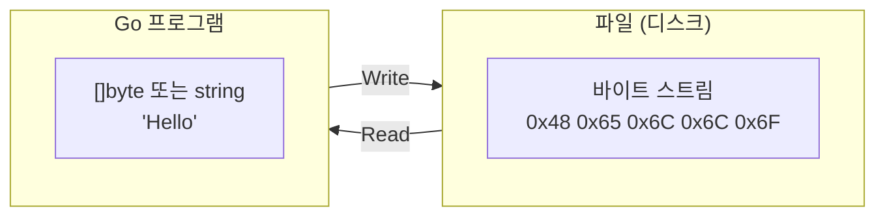

### 파일 디스크립터 복습

09-fmt에서 배운 파일 디스크립터 개념이 파일 I/O의 기초입니다. \
참고: https://daydreamx.tistory.com/entry/OSError-Too-many-open-files

| fd | 이름 | Go에서 | 용도 |
|----|------|--------|------|
| 0 | stdin | `os.Stdin` | 표준 입력 |
| 1 | stdout | `os.Stdout` | 표준 출력 |
| 2 | stderr | `os.Stderr` | 에러 출력 |
| 3+ | (파일) | `*os.File` | 열린 파일 |

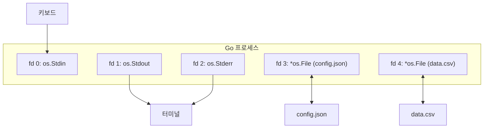

### *os.File 타입

`os.Open`, `os.Create` 등이 반환하는 타입입니다.

```go
type File struct {
    // 내부 필드 (비공개)
}

// 주요 메서드
func (f *File) Read(b []byte) (n int, err error)   // io.Reader
func (f *File) Write(b []byte) (n int, err error)  // io.Writer
func (f *File) Close() error                        // io.Closer
func (f *File) Name() string                        // 파일 경로
func (f *File) Stat() (FileInfo, error)            // 파일 정보
```

`*os.File`은 `io.Reader`, `io.Writer`, `io.Closer`를 모두 구현합니다.

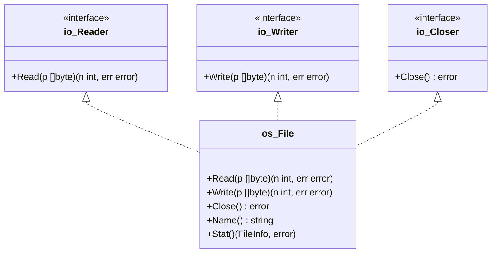

---

## io 패키지 인터페이스 심화

09-fmt에서 `io.Reader`와 `io.Writer`의 기본 개념을 학습했습니다. 이 섹션에서는 Go의 I/O 시스템을 구성하는 나머지 인터페이스들과 실제 구현체들을 체계적으로 정리합니다.

> **참고**: `io.Reader`와 `io.Writer`의 기본 개념은 [09-fmt/STUDY.md](../09-fmt/STUDY.md)를 참조하세요.

### io.Closer와 리소스 관리

`io.Closer`는 시스템 리소스(파일 디스크립터, 네트워크 연결 등)의 해제를 담당합니다.

```go
type Closer interface {
    Close() error
}
```

**왜 Close()가 중요한가?**

운영체제는 프로세스당 열 수 있는 파일 디스크립터 수를 제한합니다. Close를 호출하지 않으면 **파일 디스크립터 누수**가 발생합니다.

```go
// 문제 코드: fd 누수
func bad() {
    for i := 0; i < 10000; i++ {
        file, _ := os.Open("data.txt")
        // Close 안 함 → fd 누수
        _ = file
    }
    // → "too many open files" 에러 발생
}

// 올바른 패턴
func good() {
    for i := 0; i < 10000; i++ {
        file, err := os.Open("data.txt")
        if err != nil {
            continue
        }
        processFile(file)
        file.Close()  // 명시적 닫기
    }
}
```

**Close() 에러 처리**:

`Close()`도 에러를 반환할 수 있습니다. 쓰기 작업 후에는 반드시 확인해야 합니다.

```go
// 읽기 전용: Close 에러 무시해도 됨
defer file.Close()

// 쓰기 작업: Close 에러 확인 필요
func writeData(path string, data []byte) error {
    file, err := os.Create(path)
    if err != nil {
        return err
    }

    _, writeErr := file.Write(data)
    closeErr := file.Close()  // 버퍼 플러시 포함

    if writeErr != nil {
        return writeErr
    }
    return closeErr  // 닫기 에러도 반환
}
```

**루프 내 defer 실수**:

```go
// ❌ 문제: 모든 defer가 함수 종료 시 실행됨
func processFiles(paths []string) {
    for _, path := range paths {
        file, _ := os.Open(path)
        defer file.Close()  // 루프 끝까지 모든 파일이 열려 있음!
    }
    // 여기서 모든 Close() 실행 → 메모리 폭발
}

// ✅ 해결: 함수로 분리
func processFiles(paths []string) {
    for _, path := range paths {
        processOne(path)
    }
}

func processOne(path string) {
    file, _ := os.Open(path)
    defer file.Close()  // 함수 종료 시 즉시 닫힘
    // ...
}
```

### io.Seeker - 파일 내 위치 제어

`io.Seeker`는 읽기/쓰기 위치를 이동합니다. 파일의 특정 위치로 점프하거나 처음으로 돌아갈 때 사용합니다.

```go
type Seeker interface {
    Seek(offset int64, whence int) (int64, error)
}
```

**whence 상수**:

| 상수 | 값 | 의미 |
|------|---|------|
| `io.SeekStart` | 0 | 파일 시작 기준 |
| `io.SeekCurrent` | 1 | 현재 위치 기준 |
| `io.SeekEnd` | 2 | 파일 끝 기준 |

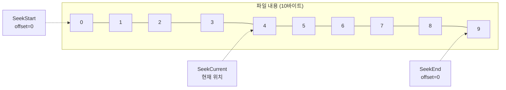

**사용 예시**:

```go
file, _ := os.Open("data.txt")
defer file.Close()

// 파일 끝에서 100바이트 앞으로 이동
file.Seek(-100, io.SeekEnd)

// 파일 처음으로 돌아가기
file.Seek(0, io.SeekStart)

// 현재 위치에서 50바이트 앞으로
file.Seek(50, io.SeekCurrent)

// 현재 위치 확인 (0바이트 이동)
pos, _ := file.Seek(0, io.SeekCurrent)
fmt.Println("현재 위치:", pos)
```

**실용 패턴: 파일 두 번 읽기**

```go
file, _ := os.Open("data.txt")
defer file.Close()

// 첫 번째 읽기
data1, _ := io.ReadAll(file)
fmt.Println("첫 번째:", len(data1))

// 처음으로 돌아가기
file.Seek(0, io.SeekStart)

// 두 번째 읽기
data2, _ := io.ReadAll(file)
fmt.Println("두 번째:", len(data2))  // 같은 결과
```

### io.ReaderAt / io.WriterAt - 위치 지정 I/O

`io.ReaderAt`와 `io.WriterAt`는 **상태 없이** 특정 위치에서 읽기/쓰기를 수행합니다. 내부 커서를 이동하지 않으므로 **동시 접근에 안전**합니다.

```go
type ReaderAt interface {
    ReadAt(p []byte, off int64) (n int, err error)
}

type WriterAt interface {
    WriteAt(p []byte, off int64) (n int, err error)
}
```

**Reader vs ReaderAt 비교**:

| 특성 | io.Reader | io.ReaderAt |
|------|-----------|-------------|
| 상태 | 내부 커서 있음 | 상태 없음 |
| 호출 방식 | `Read(buf)` | `ReadAt(buf, offset)` |
| 병렬 호출 | 안전하지 않음 | 안전함 |
| 순차 읽기 | 자연스러움 | 매번 offset 지정 |

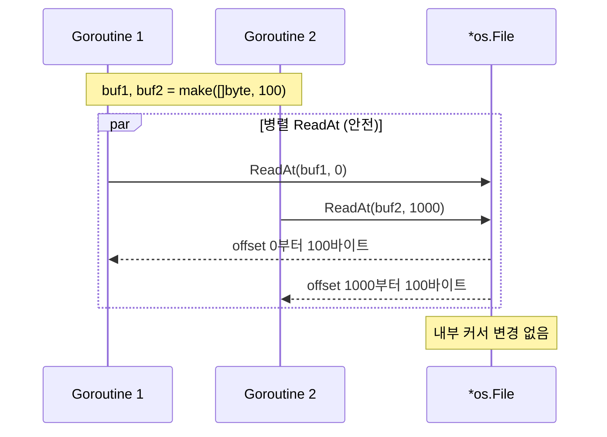

**병렬 읽기 예시**:

```go
func parallelRead(file *os.File, size int64) ([]byte, error) {
    result := make([]byte, size)
    chunkSize := int64(1024 * 1024)  // 1MB 청크

    var wg sync.WaitGroup
    var readErr error

    for offset := int64(0); offset < size; offset += chunkSize {
        wg.Add(1)
        go func(off int64) {
            defer wg.Done()

            end := off + chunkSize
            if end > size {
                end = size
            }

            _, err := file.ReadAt(result[off:end], off)
            if err != nil && err != io.EOF {
                readErr = err
            }
        }(offset)
    }

    wg.Wait()
    return result, readErr
}
```

### io.ReaderFrom / io.WriterTo - 효율적 복사

#### io.Copy란?

`io.Copy`는 **Reader에서 Writer로 데이터를 복사**하는 범용 함수입니다.

```go
// src(Reader)에서 읽어서 dst(Writer)에 쓰기
// EOF까지 모든 데이터를 복사
func Copy(dst Writer, src Reader) (written int64, err error)
```

```go
// 기본 사용 예
src, _ := os.Open("input.txt")
dst, _ := os.Create("output.txt")
defer src.Close()
defer dst.Close()

n, err := io.Copy(dst, src)  // input.txt → output.txt 복사
fmt.Printf("%d 바이트 복사됨\n", n)
```

#### 일반적인 복사 방식 (버퍼 복사)

`io.Copy`의 기본 동작은 **중간 버퍼**를 사용합니다.

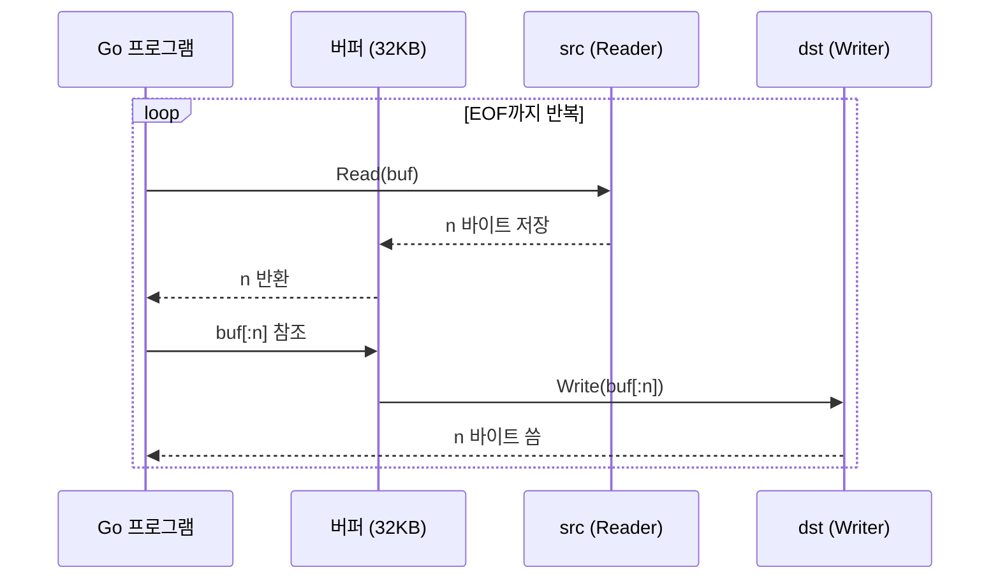

```go
// 버퍼 복사의 내부 동작 (단순화)
func copyBuffer(dst Writer, src Reader) (int64, error) {
    buf := make([]byte, 32*1024)  // 32KB 버퍼 할당
    var written int64

    for {
        nr, readErr := src.Read(buf)      // 1. src에서 버퍼로 읽기
        if nr > 0 {
            nw, writeErr := dst.Write(buf[:nr])  // 2. 버퍼에서 dst로 쓰기
            written += int64(nw)
            if writeErr != nil {
                return written, writeErr
            }
        }
        if readErr == io.EOF {
            return written, nil
        }
        if readErr != nil {
            return written, readErr
        }
    }
}
```

**문제점**: 데이터가 `src → 버퍼 → dst`로 **두 번 복사**됩니다.

#### ReaderFrom / WriterTo 인터페이스

이 인터페이스들은 **중간 버퍼 없이** 직접 데이터를 전송할 수 있게 해줍니다.

```go
// WriterTo: "나는 직접 Writer에 쓸 수 있어"
type WriterTo interface {
    WriteTo(w Writer) (n int64, err error)
}

// ReaderFrom: "나는 직접 Reader에서 읽어올 수 있어"
type ReaderFrom interface {
    ReadFrom(r Reader) (n int64, err error)
}
```

**핵심 아이디어**:
- `WriterTo`: src가 자신의 데이터를 dst에 **직접 쓰기** (src 주도)
- `ReaderFrom`: dst가 src의 데이터를 **직접 읽어오기** (dst 주도)

#### io.Copy의 최적화 동작

`io.Copy`는 내부적으로 이 인터페이스들을 감지하여 최적화된 경로를 선택합니다.

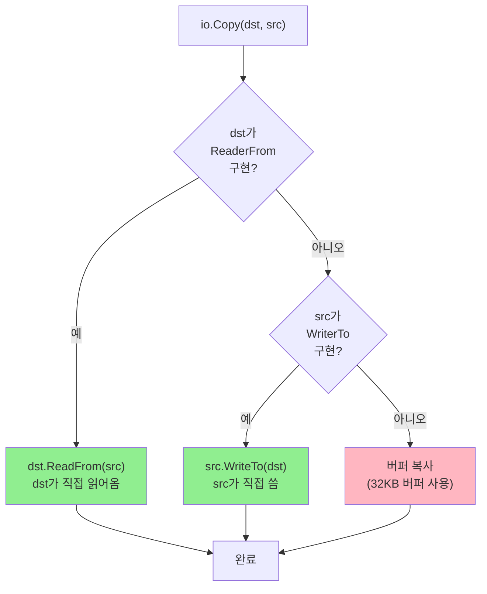

```go
// io.Copy 내부 동작 (단순화)
func Copy(dst Writer, src Reader) (int64, error) {
    // 1. dst가 ReaderFrom 구현하면 직접 호출
    if rf, ok := dst.(ReaderFrom); ok {
        return rf.ReadFrom(src)  // dst가 src에서 직접 읽어옴
    }

    // 2. src가 WriterTo 구현하면 직접 호출
    if wt, ok := src.(WriterTo); ok {
        return wt.WriteTo(dst)   // src가 dst에 직접 씀
    }

    // 3. 둘 다 없으면 버퍼로 복사 (느림)
    buf := make([]byte, 32*1024)
    // ... 버퍼 복사 로직
}
```

#### 최적화의 실제 효과: 파일 복사

`*os.File`은 `ReaderFrom`을 구현하며, Linux에서는 내부적으로 `sendfile()` 시스템 콜을 사용합니다.

**버퍼 복사 (최적화 없음)**:

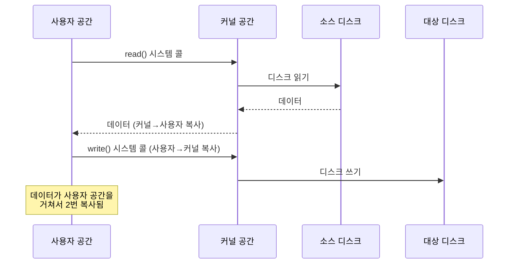

**sendfile 최적화 (ReaderFrom 사용 시)**:

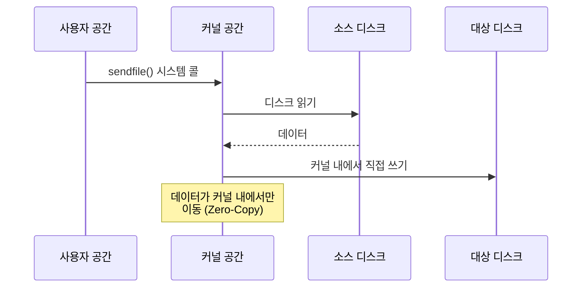

```go
// *os.File은 ReaderFrom/WriterTo를 구현
src, _ := os.Open("large.dat")    // 1GB 파일
dst, _ := os.Create("copy.dat")
defer src.Close()
defer dst.Close()

// io.Copy 호출
// → dst.(*os.File).ReadFrom(src) 호출됨
// → Linux에서 sendfile() 사용 (Zero-Copy)
n, _ := io.Copy(dst, src)
```

#### 성능 비교

| 방식 | 시스템 콜 | 메모리 복사 | CPU 사용 |
|------|----------|------------|----------|
| 버퍼 복사 | read + write (반복) | 2회 (커널↔사용자) | 높음 |
| sendfile | sendfile 1회 | 0회 (Zero-Copy) | 낮음 |

**실제 벤치마크** (1GB 파일 복사):
- 버퍼 복사: ~2초
- sendfile: ~0.5초 (약 4배 빠름)

#### 커스텀 타입에 WriterTo 구현 예시

```go
// 자신의 데이터를 효율적으로 쓸 수 있는 타입
type MyData struct {
    chunks [][]byte
}

// WriterTo 구현: 중간 버퍼 없이 직접 쓰기
func (d *MyData) WriteTo(w io.Writer) (int64, error) {
    var total int64
    for _, chunk := range d.chunks {
        n, err := w.Write(chunk)  // 각 청크를 직접 씀
        total += int64(n)
        if err != nil {
            return total, err
        }
    }
    return total, nil
}

// 사용
data := &MyData{chunks: [][]byte{...}}
file, _ := os.Create("output.dat")

// io.Copy가 자동으로 data.WriteTo(file) 호출
io.Copy(file, data)
```

### 바이트/문자 단위 인터페이스

작은 단위의 읽기/쓰기를 위한 특화된 인터페이스들입니다.

```go
// 바이트 단위
type ByteReader interface {
    ReadByte() (byte, error)
}

type ByteWriter interface {
    WriteByte(c byte) error
}

// 유니코드 문자(rune) 단위
type RuneReader interface {
    ReadRune() (r rune, size int, err error)
}

// 문자열 쓰기 (복사 최적화)
type StringWriter interface {
    WriteString(s string) (n int, err error)
}
```

**사용 예시**:

```go
reader := bufio.NewReader(file)

// 한 바이트씩 읽기
for {
    b, err := reader.ReadByte()
    if err == io.EOF {
        break
    }
    process(b)
}

// 유니코드 문자씩 읽기 (한글 등)
for {
    r, size, err := reader.ReadRune()
    if err == io.EOF {
        break
    }
    fmt.Printf("문자: %c (크기: %d바이트)\n", r, size)
}
```

**StringWriter의 장점**:

```go
// Write([]byte(s))는 문자열을 바이트로 복사
writer.Write([]byte("hello"))  // 메모리 할당 발생

// WriteString은 복사 없이 직접 쓰기 가능
writer.WriteString("hello")    // 최적화됨
```

### 조합 인터페이스

Go는 기본 인터페이스들을 조합한 편의 인터페이스를 제공합니다.

```go
// 읽기 + 닫기
type ReadCloser interface {
    Reader
    Closer
}

// 쓰기 + 닫기
type WriteCloser interface {
    Writer
    Closer
}

// 읽기 + 쓰기 + 닫기
type ReadWriteCloser interface {
    Reader
    Writer
    Closer
}

// 읽기 + 위치이동
type ReadSeeker interface {
    Reader
    Seeker
}

// 쓰기 + 위치이동
type WriteSeeker interface {
    Writer
    Seeker
}

// 읽기 + 쓰기 + 위치이동
type ReadWriteSeeker interface {
    Reader
    Writer
    Seeker
}
```

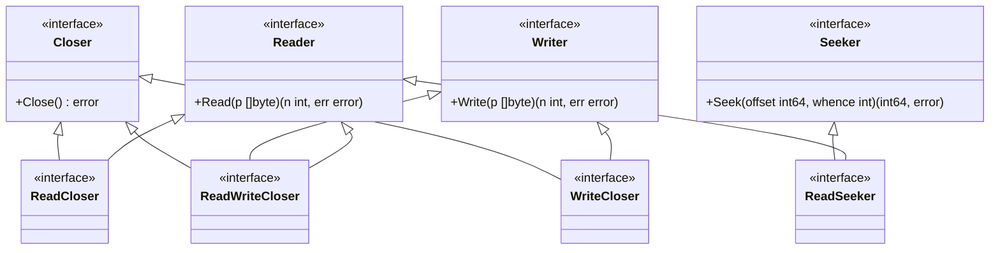

**실무 사용처**:

| 인터페이스 | 사용처 |
|-----------|--------|
| `io.ReadCloser` | `http.Response.Body`, `os.Open()` 반환값 |
| `io.WriteCloser` | `http.Request.Body`, 압축 Writer |
| `io.ReadWriteCloser` | 네트워크 연결 (`net.Conn`) |
| `io.ReadSeeker` | `bytes.Reader`, 랜덤 액세스 필요 시 |

```go
// HTTP 응답 처리 예시
resp, _ := http.Get("https://example.com")
// resp.Body는 io.ReadCloser
defer resp.Body.Close()

data, _ := io.ReadAll(resp.Body)
```

### 표준 라이브러리 구현체 매트릭스

어떤 타입이 어떤 인터페이스를 구현하는지 정리한 표입니다.

| 타입 | Reader | Writer | Closer | Seeker | ReaderAt | WriterAt |
|------|:------:|:------:|:------:|:------:|:--------:|:--------:|
| `*os.File` | ✅ | ✅ | ✅ | ✅ | ✅ | ✅ |
| `*bytes.Buffer` | ✅ | ✅ | ❌ | ❌ | ❌ | ❌ |
| `*bytes.Reader` | ✅ | ❌ | ❌ | ✅ | ✅ | ❌ |
| `*strings.Reader` | ✅ | ❌ | ❌ | ✅ | ✅ | ❌ |
| `*bufio.Reader` | ✅ | ❌ | ❌ | ❌ | ❌ | ❌ |
| `*bufio.Writer` | ❌ | ✅ | ❌ | ❌ | ❌ | ❌ |
| `net.Conn` | ✅ | ✅ | ✅ | ❌ | ❌ | ❌ |
| `http.Response.Body` | ✅ | ❌ | ✅ | ❌ | ❌ | ❌ |

**추가 인터페이스 구현**:

| 타입 | ByteReader | ByteWriter | RuneReader | StringWriter |
|------|:----------:|:----------:|:----------:|:------------:|
| `*os.File` | ❌ | ❌ | ❌ | ✅ |
| `*bytes.Buffer` | ✅ | ✅ | ✅ | ✅ |
| `*bytes.Reader` | ✅ | ❌ | ✅ | ❌ |
| `*strings.Reader` | ✅ | ❌ | ✅ | ❌ |
| `*bufio.Reader` | ✅ | ❌ | ✅ | ❌ |
| `*bufio.Writer` | ❌ | ✅ | ❌ | ✅ |

**상황별 타입 선택 가이드**:

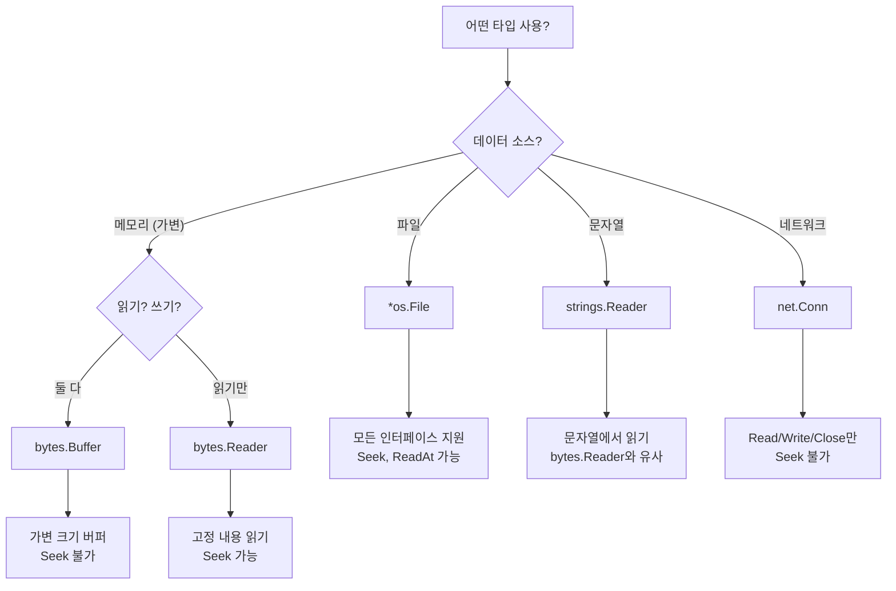

**타입별 사용 예시**:

```go
// 1. bytes.Buffer - 가변 크기 메모리 버퍼
var buf bytes.Buffer
buf.WriteString("Hello")
buf.Write([]byte{' ', 'W', 'o', 'r', 'l', 'd'})
fmt.Println(buf.String())  // "Hello World"

// 2. bytes.Reader - 고정 내용 읽기 (Seek 가능)
data := []byte("Hello World")
reader := bytes.NewReader(data)
reader.Seek(6, io.SeekStart)
rest, _ := io.ReadAll(reader)
fmt.Println(string(rest))  // "World"

// 3. strings.Reader - 문자열에서 읽기
strReader := strings.NewReader("안녕하세요")
for {
    r, _, err := strReader.ReadRune()
    if err == io.EOF {
        break
    }
    fmt.Printf("%c ", r)  // 안 녕 하 세 요
}
```

### io 패키지 유틸리티 함수

자주 사용되는 io 패키지 함수들입니다.

```go
// 전체 복사
n, err := io.Copy(dst, src)

// 제한된 크기만 복사
n, err := io.CopyN(dst, src, 1024)  // 최대 1024바이트

// 버퍼 제공하여 복사 (메모리 재사용)
buf := make([]byte, 32*1024)
n, err := io.CopyBuffer(dst, src, buf)

// 전체 읽기
data, err := io.ReadAll(reader)

// 정확히 n바이트 읽기 (부족하면 에러)
buf := make([]byte, 100)
n, err := io.ReadFull(reader, buf)

// 최소 n바이트 읽기
n, err := io.ReadAtLeast(reader, buf, 50)

// Reader 크기 제한
limited := io.LimitReader(reader, 1024)  // 1024바이트까지만 읽음

// 여러 Reader 연결
multi := io.MultiReader(reader1, reader2, reader3)

// 하나의 Reader를 여러 Writer에 복사
tee := io.TeeReader(src, dst)  // src를 읽으면 dst에도 쓰임

// 여러 Writer에 동시에 쓰기
multi := io.MultiWriter(writer1, writer2)
```

---

## 다음 문서

- [02-FILE-READ-WRITE.md](02-FILE-READ-WRITE.md) - 파일 읽기/쓰기, 모드, 권한, defer
