# 02. 파일 읽기/쓰기

## 파일 읽기

Go에서 파일을 읽는 방법은 크게 5가지가 있으며, 파일 크기와 처리 방식에 따라 적절한 방법을 선택해야 합니다. 작은 파일은 전체를 메모리에 올려도 되지만, 대용량 파일은 스트리밍 방식으로 처리해야 메모리 부족 문제를 피할 수 있습니다. 줄 단위 처리에는 bufio.Scanner가, 바이너리 처리에는 청크 읽기가 적합합니다.

### 읽기 방법 선택 가이드

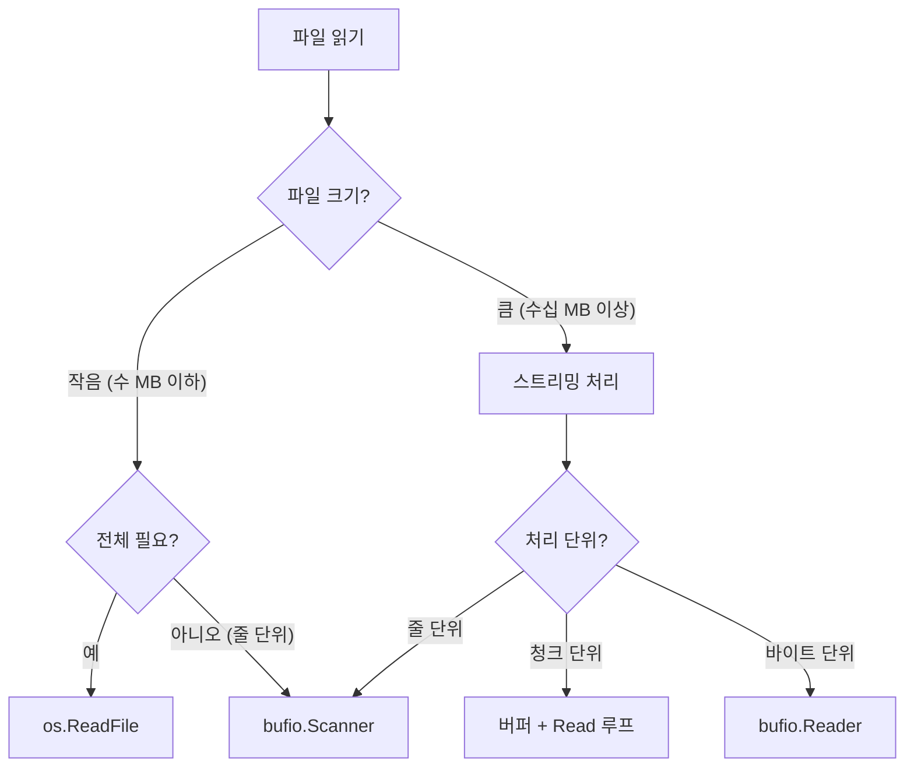

### 방법 1: os.ReadFile (가장 간단)

**os.ReadFile은 파일 전체를 메모리로 한 번에 읽어오는 가장 간단한 함수입니다.** 내부적으로 파일을 열고, fstat으로 크기를 확인하여 정확한 크기의 버퍼를 할당한 뒤, 전체 내용을 읽고, 자동으로 파일을 닫습니다. 개발자가 파일 핸들을 직접 관리할 필요가 없어 코드가 간결해지지만, 파일 전체가 메모리에 올라가므로 대용량 파일에는 부적합합니다. 설정 파일, JSON 데이터, 작은 텍스트 파일(수 MB 이하) 처리에 적합합니다.

```go
// 파일 전체를 []byte로 읽기
data, err := os.ReadFile("config.json")
if err != nil {
    log.Fatal(err)
}

// 문자열로 변환
content := string(data)
fmt.Println(content)
```

**내부 동작**:

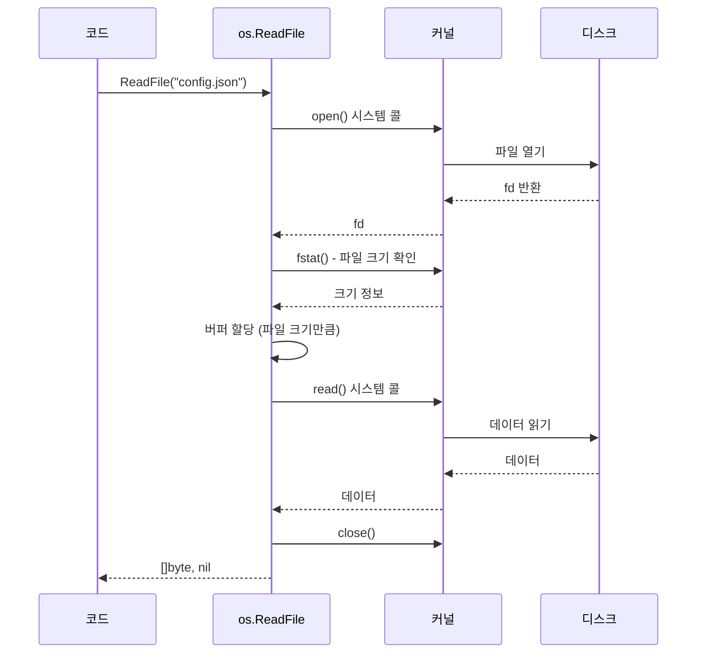

**장단점**:

| 장점 | 단점 |
|------|------|
| 코드가 간단함 | 파일 전체가 메모리에 로드됨 |
| 한 번의 함수 호출 | 대용량 파일에 부적합 |
| 자동으로 파일 닫음 | 스트리밍 처리 불가 |

**적합한 경우**: 설정 파일, 작은 데이터 파일 (수 MB 이하)

### 방법 2: os.Open + io.ReadAll

**os.Open은 파일 핸들(`*os.File`)을 직접 반환하므로 파일 메타데이터 조회, 부분 읽기, 위치 이동이 가능합니다.** os.ReadFile과 달리 파일 핸들을 직접 관리해야 하므로 반드시 `defer file.Close()`로 리소스를 해제해야 합니다. `file.Stat()`으로 파일 크기, 수정 시간 등을 조회하거나, `file.Seek()`으로 위치를 이동하여 여러 번 읽어야 할 때 사용합니다. io.ReadAll은 Reader 인터페이스를 받으므로 파일뿐 아니라 네트워크 응답 등 다양한 Reader에 사용할 수 있습니다.

```go
// 파일 열기 (읽기 전용)
file, err := os.Open("data.txt")
if err != nil {
    log.Fatal(err)
}
defer file.Close()  // 반드시 닫기!

// 전체 읽기
data, err := io.ReadAll(file)
if err != nil {
    log.Fatal(err)
}

fmt.Println(string(data))
```

**os.ReadFile과의 차이**:

| 구분 | os.ReadFile | os.Open + io.ReadAll |
|------|-------------|----------------------|
| 파일 핸들 | 내부 처리 | 직접 관리 |
| Close | 자동 | 수동 (defer) |
| 파일 정보 | 접근 불가 | `file.Stat()` 가능 |
| 부분 읽기 | 불가 | 가능 |
| 여러 번 읽기 | 불가 | `file.Seek()` 후 가능 |

### 방법 3: bufio.Scanner (줄 단위)

**bufio.Scanner는 대용량 파일을 줄 단위로 처리할 때 가장 효율적인 방법입니다.** 내부적으로 64KB 버퍼를 사용하여 파일에서 청크 단위로 읽어온 뒤, 줄바꿈 문자를 찾아 한 줄씩 반환합니다. 파일 전체를 메모리에 올리지 않으므로 GB 단위 로그 파일도 일정한 메모리로 처리할 수 있습니다. 기본 구분자는 줄바꿈이며, `Split()` 메서드로 ScanWords(단어), ScanBytes(바이트), ScanRunes(유니코드 문자)로 변경할 수 있습니다. **스캔 완료 후에는 반드시 `scanner.Err()`로 에러를 확인해야 합니다.** Scan()이 false를 반환하는 것은 EOF일 수도 있고 에러일 수도 있기 때문입니다.

```go
file, err := os.Open("large_log.txt")
if err != nil {
    log.Fatal(err)
}
defer file.Close()

scanner := bufio.NewScanner(file)

lineNum := 0
for scanner.Scan() {
    lineNum++
    line := scanner.Text()  // 현재 줄 (줄바꿈 제외)

    // 줄 처리
    if strings.Contains(line, "ERROR") {
        fmt.Printf("Line %d: %s\n", lineNum, line)
    }
}

// 스캔 중 에러 확인 (중요!)
if err := scanner.Err(); err != nil {
    log.Fatal(err)
}
```

**내부 동작**:

Scanner는 파일에서 데이터를 청크 단위로 읽어 내부 버퍼에 저장한 뒤, 줄바꿈을 찾아 한 줄씩 반환합니다.

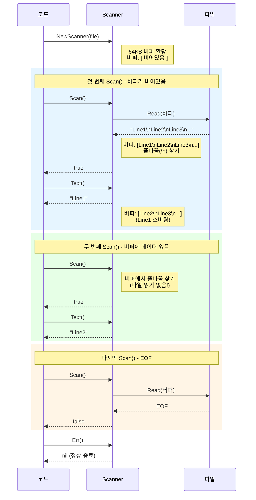

**핵심 포인트**:
- **버퍼가 차 있으면 파일 읽기 없이 버퍼에서 바로 반환** (성능 최적화)
- **버퍼가 비거나 줄바꿈이 없으면 파일에서 추가 읽기**
- **Scan()이 false를 반환하면 반드시 Err()로 EOF인지 에러인지 확인**

**Scanner 옵션**:

```go
scanner := bufio.NewScanner(file)

// 버퍼 크기 변경 (긴 줄 처리 시)
buf := make([]byte, 1024*1024)  // 1MB
scanner.Buffer(buf, 1024*1024)

// 구분자 변경
scanner.Split(bufio.ScanWords)   // 단어 단위
scanner.Split(bufio.ScanBytes)   // 바이트 단위
scanner.Split(bufio.ScanRunes)   // 룬(유니코드 문자) 단위
scanner.Split(bufio.ScanLines)   // 줄 단위 (기본값)
```

### 방법 4: 청크 단위 읽기

**바이너리 파일이나 버퍼 크기를 직접 제어해야 할 때는 고정 크기 버퍼와 Read 루프를 사용합니다.** 이 방식은 가장 저수준의 읽기 방법으로, 메모리 사용량을 정확히 제어할 수 있습니다. **중요한 점은 Read()가 요청한 크기보다 적게 읽을 수 있다는 것입니다.** 예를 들어 32KB 버퍼로 Read를 호출해도 실제로는 8KB만 읽힐 수 있습니다. 따라서 반환된 n 값을 확인하고 `buf[:n]`만 처리해야 합니다. io.EOF는 에러가 아니라 정상적인 파일 끝 신호이므로 별도로 처리합니다.

```go
file, err := os.Open("huge_file.bin")
if err != nil {
    log.Fatal(err)
}
defer file.Close()

buf := make([]byte, 32*1024)  // 32KB 버퍼

for {
    n, err := file.Read(buf)
    if err == io.EOF {
        break
    }
    if err != nil {
        log.Fatal(err)
    }

    // buf[:n] 처리 (n바이트만 유효)
    processChunk(buf[:n])
}
```

### 방법 5: bufio.Reader (버퍼링된 Reader)

**bufio.Reader는 ReadString, ReadByte, ReadBytes, Peek 등 다양한 읽기 메서드를 제공하는 버퍼링 래퍼입니다.** 내부 버퍼를 사용하여 작은 읽기 요청을 모아서 처리하므로 시스템 콜 횟수를 줄여 성능을 높입니다. `ReadString('\n')`은 구분자까지 읽어 문자열로 반환하고(구분자 포함), `ReadBytes(':')`는 바이트 슬라이스로 반환합니다. `Peek(n)`은 다음 n바이트를 미리보기만 하고 실제로 읽지는 않으므로, 프로토콜 파싱처럼 헤더를 확인한 뒤 처리 방식을 결정해야 할 때 유용합니다. Scanner와 달리 줄바꿈 문자가 결과에 포함됩니다.

```go
file, err := os.Open("data.txt")
if err != nil {
    log.Fatal(err)
}
defer file.Close()

reader := bufio.NewReader(file)

// 한 줄 읽기 (줄바꿈 포함)
line, err := reader.ReadString('\n')

// 한 바이트 읽기
b, err := reader.ReadByte()

// 구분자까지 읽기
data, err := reader.ReadBytes(':')

// n 바이트 미리보기 (읽지 않음)
peek, err := reader.Peek(10)
```

### 읽기 방법 비교 정리

| 방법 | 메모리 사용 | 용도 | 예시 |
|------|------------|------|------|
| `os.ReadFile` | 파일 전체 | 작은 파일 | 설정 파일 |
| `os.Open` + `io.ReadAll` | 파일 전체 | 파일 핸들 필요 시 | 메타데이터 확인 |
| `bufio.Scanner` | 버퍼 크기 | 줄 단위 처리 | 로그 파일 |
| 청크 읽기 | 버퍼 크기 | 바이너리 처리 | 대용량 파일 |
| `bufio.Reader` | 버퍼 크기 | 다양한 읽기 | 프로토콜 파싱 |

---

## 파일 쓰기

Go에서 파일을 쓰는 방법은 크게 4가지가 있습니다. 간단한 쓰기에는 os.WriteFile을, 파일 핸들이 필요하면 os.Create를, 추가 모드나 세밀한 제어가 필요하면 os.OpenFile을, 대량의 작은 쓰기에는 bufio.Writer를 사용합니다. 파일 쓰기는 읽기와 달리 데이터 손실 위험이 있으므로, 에러 처리와 리소스 관리에 더욱 주의해야 합니다.

### 쓰기 방법 선택 가이드

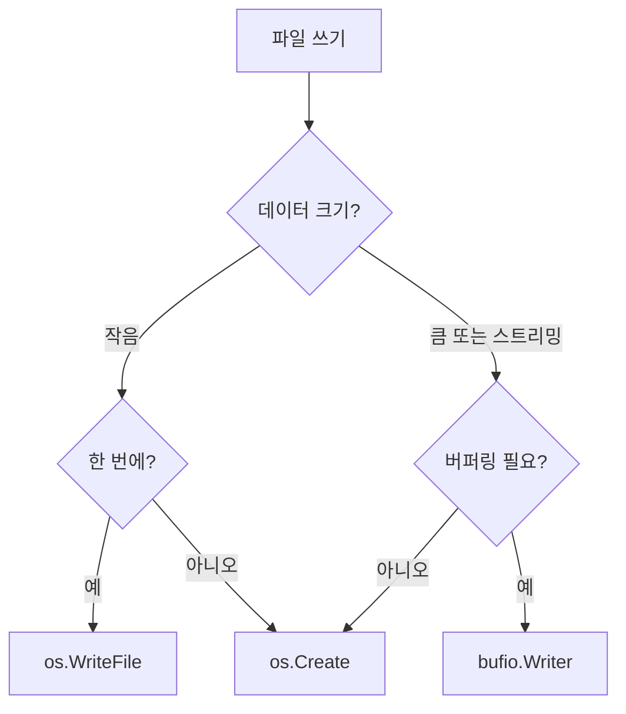

### 방법 1: os.WriteFile (가장 간단)

**os.WriteFile은 바이트 슬라이스 전체를 파일에 한 번에 쓰는 가장 간단한 함수입니다.** 파일이 없으면 생성하고, 있으면 기존 내용을 삭제(truncate)한 뒤 새 내용으로 덮어씁니다. 내부적으로 파일 열기, 쓰기, 닫기를 모두 처리하므로 개발자가 파일 핸들을 관리할 필요가 없습니다. 세 번째 인자는 파일 권한(permission)으로, 일반 파일에는 0644를 사용합니다. 설정 저장, 캐시 파일 생성, 작은 데이터 출력 등 한 번에 쓰고 끝나는 작업에 적합합니다.

```go
content := []byte("Hello, World!\n")

// 파일에 쓰기 (없으면 생성, 있으면 덮어쓰기)
err := os.WriteFile("output.txt", content, 0644)
if err != nil {
    log.Fatal(err)
}
```

**세 번째 인자 `0644`는 파일 권한입니다** (뒤에서 자세히 설명).

**내부 동작**:

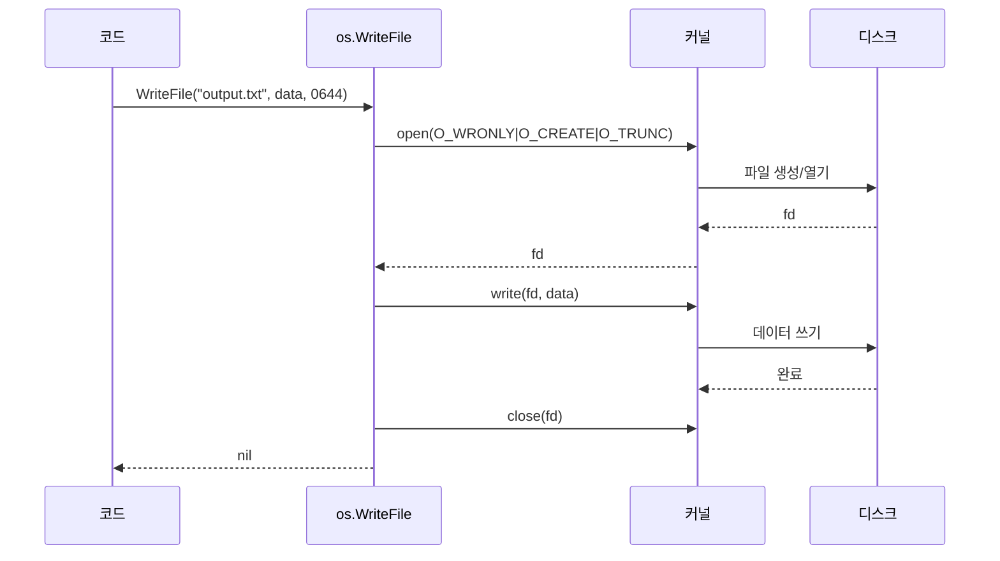

> **open() 플래그 설명**: `O_WRONLY`(쓰기 전용) + `O_CREATE`(없으면 생성) + `O_TRUNC`(있으면 내용 삭제). 이 조합으로 "파일이 없으면 생성, 있으면 덮어쓰기" 동작이 됩니다.

### 방법 2: os.Create + Write

**os.Create는 파일을 생성하거나 기존 파일을 비우고 쓰기용 파일 핸들을 반환합니다.** 내부적으로 `os.OpenFile(name, O_RDWR|O_CREATE|O_TRUNC, 0666)`과 동일합니다. 파일 핸들을 직접 관리하므로 반드시 `defer file.Close()`로 리소스를 해제해야 합니다. `Write([]byte)`는 바이트 슬라이스를, `WriteString(string)`은 문자열을 씁니다. `fmt.Fprintf(file, format, args...)`를 사용하면 포맷팅된 출력도 가능합니다. 여러 번에 나눠서 쓰거나, 쓰기 중간에 파일 정보를 확인해야 할 때 사용합니다.

```go
// 파일 생성 (있으면 덮어쓰기)
file, err := os.Create("output.txt")
if err != nil {
    log.Fatal(err)
}
defer file.Close()

// 여러 번 쓰기 가능
file.WriteString("첫 번째 줄\n")
file.WriteString("두 번째 줄\n")
file.Write([]byte("세 번째 줄\n"))

// 또는 fmt.Fprint 사용
fmt.Fprintln(file, "네 번째 줄")
```

### 방법 3: os.OpenFile (세밀한 제어)

**os.OpenFile은 플래그 조합으로 파일 열기 방식을 세밀하게 제어할 수 있는 저수준 함수입니다.** 두 번째 인자로 플래그를 비트 OR(|)로 조합하여 전달합니다. `O_APPEND|O_CREATE|O_WRONLY`는 로그 파일처럼 기존 내용 뒤에 추가하는 패턴이고, `O_CREATE|O_EXCL|O_WRONLY`는 파일이 이미 존재하면 에러를 반환하여 실수로 덮어쓰는 것을 방지합니다. os.Open과 os.Create는 os.OpenFile의 특수한 경우를 편의 함수로 제공한 것입니다.

```go
// 파일 열기/생성 (추가 모드)
file, err := os.OpenFile(
    "log.txt",
    os.O_APPEND|os.O_CREATE|os.O_WRONLY,
    0644,
)
if err != nil {
    log.Fatal(err)
}
defer file.Close()

// 파일 끝에 추가
file.WriteString("새 로그 항목\n")
```

### 방법 4: bufio.Writer (버퍼링된 쓰기)

**bufio.Writer는 여러 번의 작은 쓰기를 내부 버퍼에 모아 한 번의 시스템 콜로 처리하여 성능을 크게 높입니다.** 시스템 콜은 사용자 공간에서 커널 공간으로 컨텍스트 전환이 필요하므로 오버헤드가 큽니다. 예를 들어 10,000번의 작은 쓰기를 각각 시스템 콜로 처리하면 10,000번의 전환이 발생하지만, bufio.Writer를 사용하면 버퍼가 찰 때만 시스템 콜이 발생하여 수십 번으로 줄어듭니다. **Flush()를 호출하지 않으면 버퍼에 남은 데이터가 파일에 쓰이지 않아 데이터가 손실됩니다.** 따라서 반드시 `defer writer.Flush()`를 등록하거나 명시적으로 호출해야 합니다.

```go
file, err := os.Create("output.txt")
if err != nil {
    log.Fatal(err)
}
defer file.Close()

writer := bufio.NewWriter(file)

// 버퍼에 쓰기 (아직 파일에 안 씀)
for i := 0; i < 10000; i++ {
    fmt.Fprintf(writer, "Line %d\n", i)
}

// 반드시 Flush 호출! (버퍼 → 파일)
if err := writer.Flush(); err != nil {
    log.Fatal(err)
}
```

**왜 버퍼링이 중요한가?**

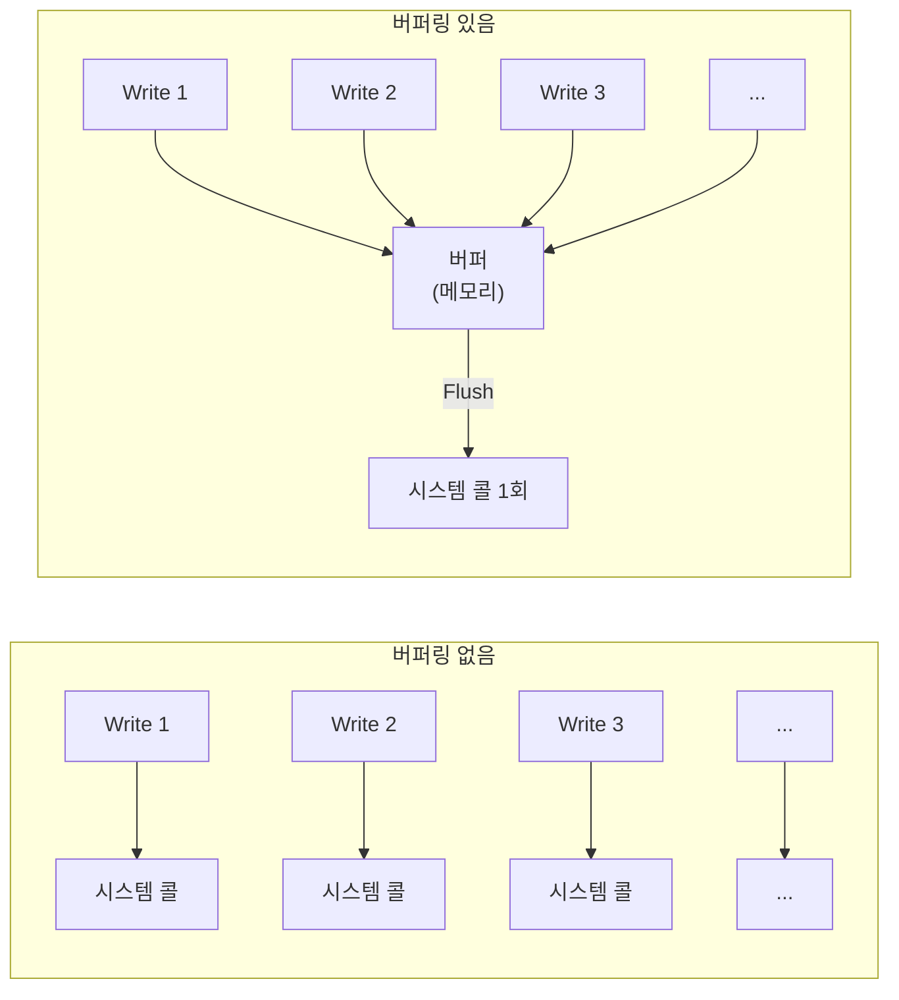

| 구분 | 버퍼링 없음 | bufio.Writer |
|------|------------|--------------|
| 시스템 콜 | 쓰기마다 발생 | Flush 시 1회 |
| 오버헤드 | 높음 | 낮음 |
| 실시간성 | 즉시 반영 | Flush 후 반영 |
| 용도 | 중요 데이터 | 대량 쓰기 |

**주의: Flush를 잊으면 데이터 손실!**

```go
writer := bufio.NewWriter(file)
writer.WriteString("중요 데이터")
// Flush 안 하고 프로그램 종료 → 데이터 손실!

// 올바른 패턴
defer writer.Flush()  // 또는 명시적 호출
```

### Sync() - 디스크 동기화

**file.Sync()는 OS 커널 버퍼의 데이터를 물리적 디스크에 기록하도록 강제합니다.** `Write()`나 `Flush()`를 호출해도 데이터는 OS 커널 버퍼에만 저장되고, 실제 디스크 기록은 OS가 나중에 수행합니다. 이 상태에서 시스템 전원이 꺼지면 데이터가 손실됩니다. Sync()를 호출하면 디스크 기록이 완료될 때까지 대기하므로, 중요한 데이터는 Sync() 후에야 영구 저장이 보장됩니다.

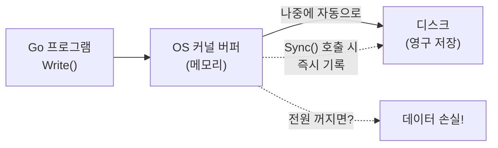

**bufio.Flush()와 file.Sync()의 차이**:

| 함수 | 동작 | 보장 |
|------|------|------|
| `bufio.Writer.Flush()` | 애플리케이션 버퍼 → OS 커널 버퍼 | 커널에 전달됨 |
| `file.Sync()` | OS 커널 버퍼 → 디스크 | 디스크에 기록됨 |

```go
writer := bufio.NewWriter(file)
writer.WriteString("중요 데이터")

writer.Flush()   // 애플리케이션 버퍼 → OS 커널 버퍼
file.Sync()      // OS 커널 버퍼 → 디스크 (영구 저장 보장)
```

**언제 Sync()를 사용하는가?**

| 상황 | Sync 필요? | 이유 |
|------|-----------|------|
| 일반 로그 파일 | ❌ 불필요 | 성능 우선, 일부 손실 허용 |
| 설정 파일 저장 | ✅ 필요 | 데이터 무결성 중요 |
| 데이터베이스 트랜잭션 | ✅ 필수 | ACID 보장 |
| 임시 파일 → Rename 전 | ✅ 필요 | 새 파일이 완전해야 함 |

**주의**: Sync()는 디스크 I/O를 대기하므로 성능에 영향을 줍니다. 매 쓰기마다 호출하지 말고, 중요한 시점에만 사용하세요.

```go
// 나쁜 예: 매번 Sync (성능 저하)
for _, line := range lines {
    file.WriteString(line)
    file.Sync()  // 매번 디스크 대기!
}

// 좋은 예: 마지막에만 Sync
for _, line := range lines {
    file.WriteString(line)
}
file.Sync()  // 한 번만 호출
```

---

## 파일 모드와 플래그

**파일 플래그는 파일을 열 때의 동작 방식을 제어하는 비트 마스크입니다.** 유닉스 시스템의 open() 시스템 콜에서 유래했으며, Go에서도 동일한 개념을 사용합니다. 플래그는 접근 모드(읽기/쓰기)와 동작 옵션(생성/자르기/추가)으로 나뉘며, 비트 OR(|)로 조합하여 원하는 동작을 만듭니다. `os.Open()`은 `O_RDONLY`, `os.Create()`는 `O_RDWR|O_CREATE|O_TRUNC`의 단축 함수입니다.

### os.OpenFile 플래그

```go
file, err := os.OpenFile(
    "file.txt",
    os.O_RDWR|os.O_CREATE|os.O_TRUNC,  // 플래그 조합
    0644,                                // 권한
)
```

**플래그 종류**:

| 플래그 | 의미 | 설명 |
|--------|------|------|
| `os.O_RDONLY` | Read Only | 읽기 전용 |
| `os.O_WRONLY` | Write Only | 쓰기 전용 |
| `os.O_RDWR` | Read/Write | 읽기/쓰기 |
| `os.O_CREATE` | Create | 없으면 생성 |
| `os.O_TRUNC` | Truncate | 있으면 내용 삭제 |
| `os.O_APPEND` | Append | 파일 끝에 추가 |
| `os.O_EXCL` | Exclusive | 파일 있으면 에러 |
| `os.O_SYNC` | Sync | 동기 I/O |

**일반적인 조합**:

```go
// 읽기 전용 (os.Open과 동일)
os.OpenFile(path, os.O_RDONLY, 0)

// 새 파일 생성, 기존 파일 덮어쓰기 (os.Create와 동일)
os.OpenFile(path, os.O_RDWR|os.O_CREATE|os.O_TRUNC, 0644)

// 추가 모드 (로그 파일)
os.OpenFile(path, os.O_APPEND|os.O_CREATE|os.O_WRONLY, 0644)

// 새 파일만 생성 (기존 파일 있으면 에러)
os.OpenFile(path, os.O_CREATE|os.O_EXCL|os.O_WRONLY, 0644)
```

### 플래그 조합 다이어그램

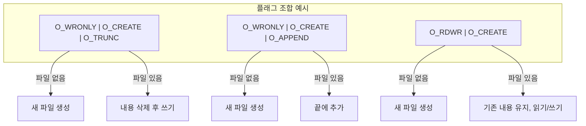

---

## 파일 권한 (Permission)

**파일 권한은 누가 파일에 어떤 작업을 할 수 있는지 제어하는 유닉스 보안 메커니즘입니다.** 소유자(owner), 그룹(group), 기타(others) 세 범주에 대해 읽기(read=4), 쓰기(write=2), 실행(execute=1) 권한을 각각 지정합니다. 권한은 8진수로 표현하며, 각 자리가 한 범주의 권한 합을 나타냅니다. 예를 들어 0644는 소유자에게 읽기+쓰기(6=4+2), 그룹과 기타에게 읽기(4)만 허용합니다. Go에서 파일을 생성할 때 이 권한을 지정하며, 실제 적용되는 권한은 프로세스의 umask에 의해 제한될 수 있습니다.

### 유닉스 권한 시스템

파일 권한은 **8진수**로 표현합니다.

```
권한: rwxrwxrwx
      ↑↑↑↑↑↑↑↑↑
      │││││││││
      │││││││└─ others: execute (1)
      ││││││└── others: write (2)
      │││││└─── others: read (4)
      ││││└──── group: execute (1)
      │││└───── group: write (2)
      ││└────── group: read (4)
      │└─────── owner: execute (1)
      └──────── owner: write (2)
               owner: read (4)
```

**권한 계산**:

| 권한 | 2진수 | 8진수 | 의미 |
|------|-------|-------|------|
| `---` | 000 | 0 | 권한 없음 |
| `--x` | 001 | 1 | 실행 |
| `-w-` | 010 | 2 | 쓰기 |
| `-wx` | 011 | 3 | 쓰기+실행 |
| `r--` | 100 | 4 | 읽기 |
| `r-x` | 101 | 5 | 읽기+실행 |
| `rw-` | 110 | 6 | 읽기+쓰기 |
| `rwx` | 111 | 7 | 모든 권한 |

**일반적인 권한 값**:

| 8진수 | 의미 | 용도 |
|-------|------|------|
| `0644` | `rw-r--r--` | 일반 파일 (소유자 읽기/쓰기, 나머지 읽기) |
| `0755` | `rwxr-xr-x` | 실행 파일, 디렉토리 |
| `0600` | `rw-------` | 비밀 파일 (소유자만 접근) |
| `0700` | `rwx------` | 비밀 디렉토리 |
| `0666` | `rw-rw-rw-` | 모두 읽기/쓰기 (보안 주의) |
| `0777` | `rwxrwxrwx` | 모든 권한 (보안 주의) |

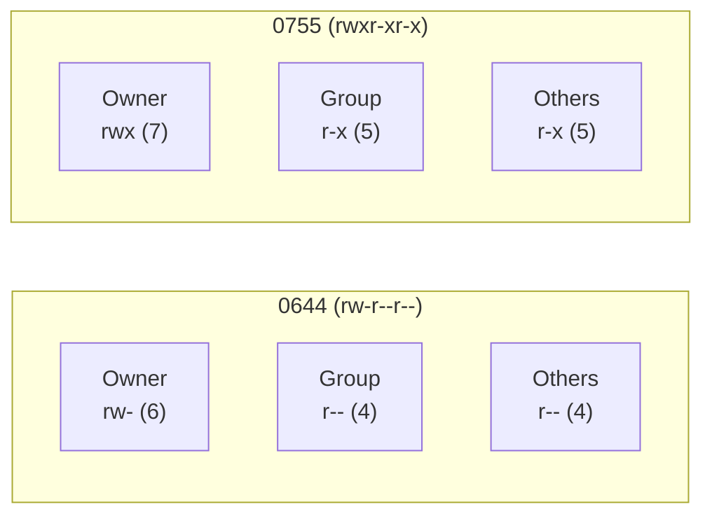

### Go에서 권한 사용

```go
// 일반 파일 생성
os.WriteFile("config.txt", data, 0644)

// 실행 파일 생성
os.WriteFile("script.sh", script, 0755)

// 비밀 파일 생성
os.WriteFile("secret.key", key, 0600)

// 디렉토리 생성
os.Mkdir("mydir", 0755)
os.MkdirAll("path/to/dir", 0755)
```

### Windows에서의 권한

Windows는 유닉스 권한 시스템을 사용하지 않습니다.

```go
// Windows에서는 권한이 제한적으로 적용됨
// 0644, 0755 등은 무시되거나 부분적으로 적용

// 읽기 전용 설정
os.Chmod("file.txt", 0444)  // Windows에서는 읽기 전용으로 설정
```

---

## defer와 리소스 관리

**defer는 함수가 종료될 때 반드시 실행되어야 하는 정리(cleanup) 작업을 등록하는 Go의 핵심 메커니즘입니다.** 파일, 네트워크 연결, 뮤텍스 등 시스템 리소스는 사용 후 반드시 해제해야 하는데, 함수 내에서 에러가 발생하면 정리 코드에 도달하지 못할 수 있습니다. defer로 등록된 함수는 정상 반환, 에러 반환, 심지어 panic이 발생해도 반드시 실행됩니다. **파일을 열면 즉시 `defer file.Close()`를 등록하는 것이 Go의 관용적 패턴입니다.** 이 패턴을 따르지 않으면 파일 디스크립터 누수가 발생하여 프로세스가 더 이상 파일을 열 수 없게 됩니다.

### 왜 defer file.Close()가 중요한가?

```go
file, err := os.Open("data.txt")
if err != nil {
    return err
}
defer file.Close()  // 함수 종료 시 반드시 실행

// ... 파일 처리 ...
```

**defer를 사용하지 않으면?**

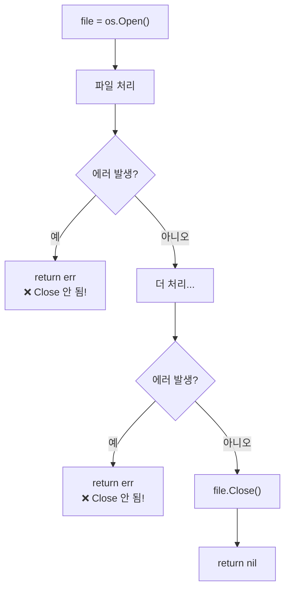

**문제점**: 에러 발생 시 `Close()`가 호출되지 않아 **파일 디스크립터 누수** 발생

**defer 사용 시**:

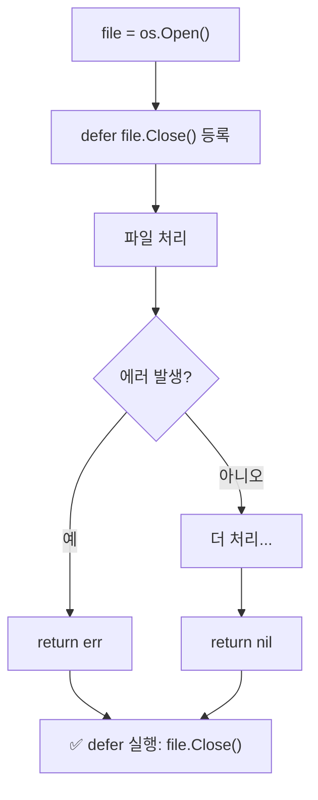

### 파일 디스크립터 누수의 영향

```go
// 나쁜 예: Close를 안 하면 fd 누수
for i := 0; i < 10000; i++ {
    file, _ := os.Open("data.txt")
    // file.Close() 안 함!
    // → fd 고갈 → "too many open files" 에러
}

// 좋은 예
for i := 0; i < 10000; i++ {
    file, err := os.Open("data.txt")
    if err != nil {
        continue
    }
    // 처리...
    file.Close()  // 또는 defer (루프에서는 주의)
}
```

### 루프에서 defer 주의

```go
// 문제: defer는 함수 종료 시 실행
// → 모든 파일이 루프 끝까지 열려 있음
for _, path := range paths {
    file, _ := os.Open(path)
    defer file.Close()  // ❌ 루프 끝까지 안 닫힘
}

// 해결 1: 명시적 Close
for _, path := range paths {
    file, _ := os.Open(path)
    processFile(file)
    file.Close()  // 명시적으로 닫기
}

// 해결 2: 함수 분리
for _, path := range paths {
    processFile(path)  // 함수 내에서 defer 사용
}

func processFile(path string) error {
    file, err := os.Open(path)
    if err != nil {
        return err
    }
    defer file.Close()  // ✅ 함수 종료 시 닫힘
    // ...
}
```

---

## 다음 문서

- [03-PATH-AND-PATTERNS.md](03-PATH-AND-PATTERNS.md) - 경로 처리, 디렉토리 작업, 실무 패턴
