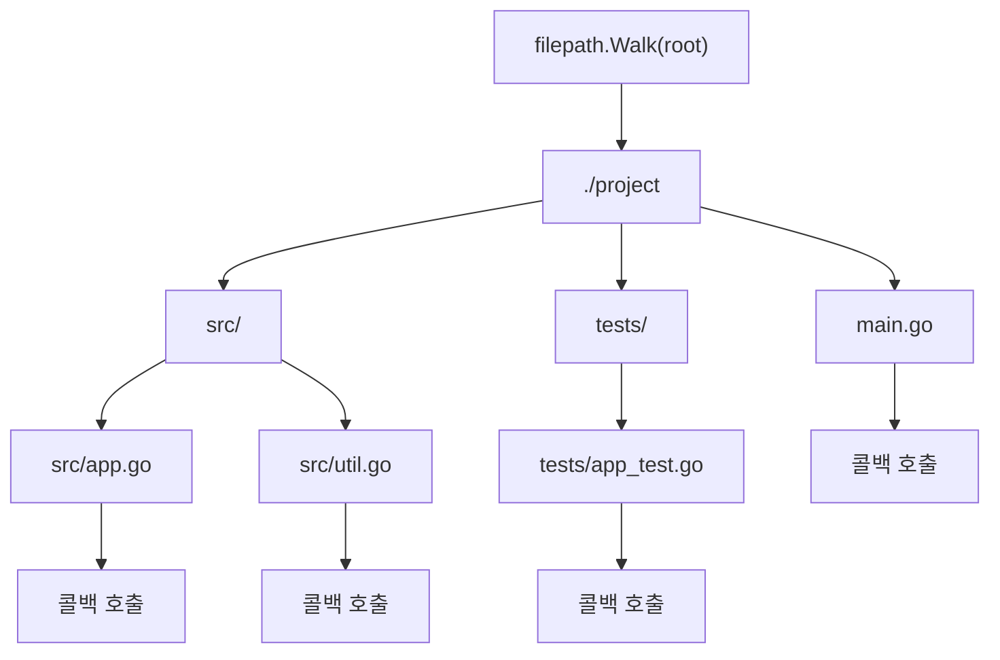
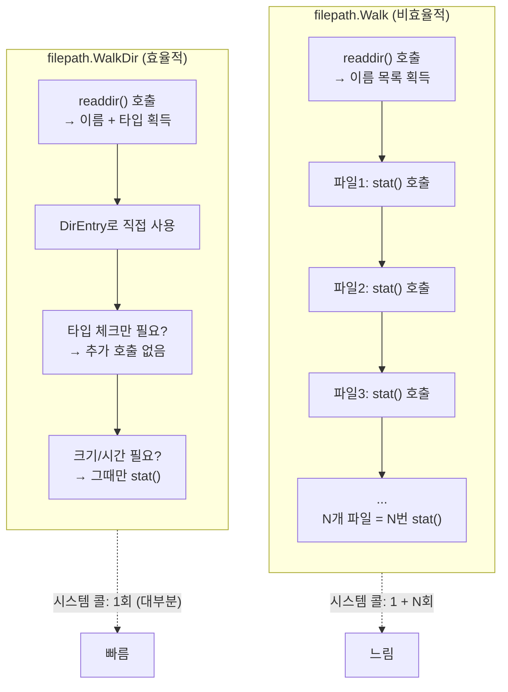
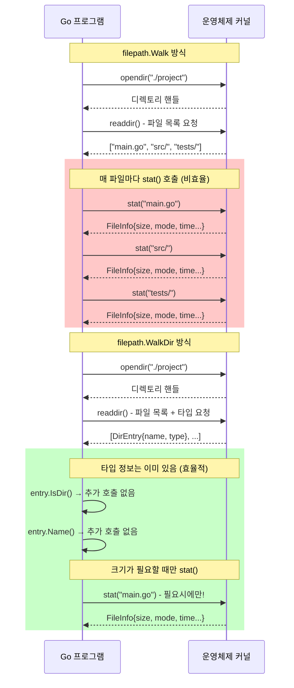
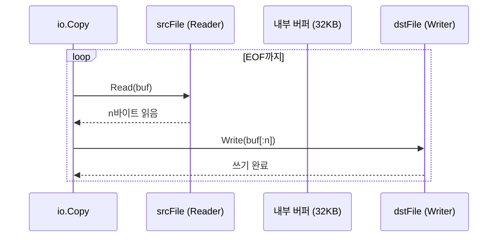
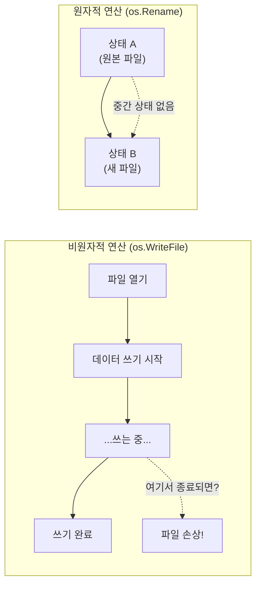
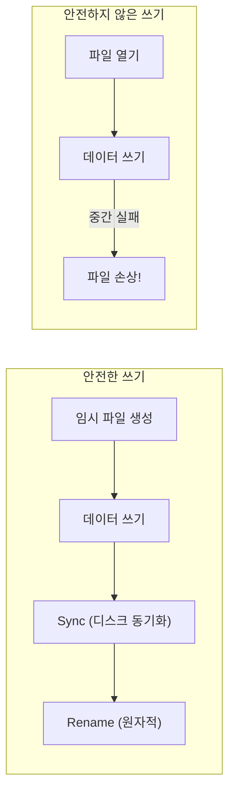
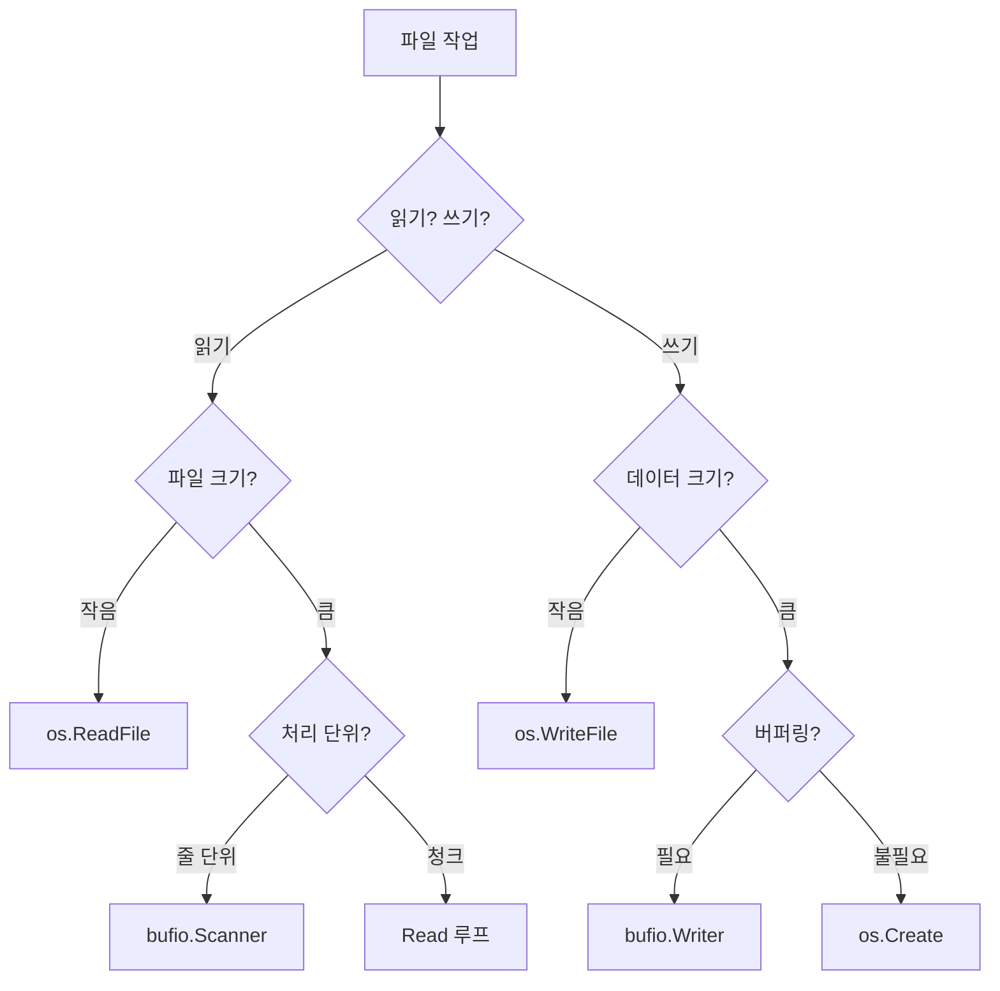

# 03. 경로 처리와 실무 패턴

## 경로 처리 (filepath 패키지)

**path/filepath 패키지는 운영체제에 독립적인 파일 경로 처리를 제공합니다.** 파일 경로 구분자는 운영체제마다 다릅니다(Unix: `/`, Windows: `\`). 경로를 문자열로 직접 조작하면 특정 OS에서만 동작하는 코드가 되지만, filepath 패키지를 사용하면 실행 환경에 맞는 구분자를 자동으로 사용합니다. 이는 크로스 플랫폼 Go 프로그램 개발의 필수 요소입니다.

### 왜 filepath.Join을 사용해야 하는가?

```go
// 나쁜 예: 하드코딩된 경로 구분자
path := "dir" + "/" + "file.txt"   // Unix에서만 동작
path := "dir" + "\\" + "file.txt"  // Windows에서만 동작

// 좋은 예: OS에 맞게 자동 처리
path := filepath.Join("dir", "file.txt")
// Unix: "dir/file.txt"
// Windows: "dir\\file.txt"
```

### 주요 함수

**filepath 패키지는 경로 조합, 분리, 정규화, 패턴 매칭 등 다양한 경로 처리 함수를 제공합니다.** `Join`은 여러 경로 요소를 OS에 맞게 조합하고, `Dir`과 `Base`는 경로에서 디렉토리와 파일명을 분리합니다. `Abs`는 상대 경로를 절대 경로로 변환하고, `Rel`은 기준 경로에서 대상까지의 상대 경로를 계산합니다. `Clean`은 `.`이나 `..`를 정리하여 정규화된 경로를 반환하고, `Match`는 glob 패턴으로 파일명을 매칭합니다.

```go
import "path/filepath"

// 경로 조합 (OS에 맞게)
path := filepath.Join("dir", "subdir", "file.txt")

// 경로 분리
dir := filepath.Dir("/path/to/file.txt")    // "/path/to"
base := filepath.Base("/path/to/file.txt")  // "file.txt"
ext := filepath.Ext("file.txt")             // ".txt"

// 절대 경로 변환
abs, err := filepath.Abs("relative/path")

// 상대 경로 계산
rel, err := filepath.Rel("/base", "/base/sub/file.txt")  // "sub/file.txt"

// 경로 정리
clean := filepath.Clean("dir/../other/./file.txt")  // "other/file.txt"

// 경로 매칭
matched, err := filepath.Match("*.txt", "file.txt")  // true
```

### filepath vs path 패키지

**Go에는 경로를 다루는 패키지가 두 개 있으며, 용도가 명확히 다릅니다.** `path/filepath`는 로컬 파일 시스템 경로용으로 OS에 따라 구분자가 달라지고, `path`는 URL이나 슬래시 기반 경로용으로 항상 `/`를 사용합니다. 파일 시스템 작업에는 반드시 filepath를, HTTP 라우팅이나 URL 조작에는 path를 사용해야 합니다. 이 둘을 혼동하면 Windows에서 URL 경로에 역슬래시가 들어가는 등의 버그가 발생합니다.

| 패키지 | 용도 | 구분자 |
|--------|------|--------|
| `path/filepath` | 로컬 파일 시스템 | OS에 따라 다름 |
| `path` | URL, 슬래시 경로 | 항상 `/` |

```go
import (
    "path"
    "path/filepath"
)

// 파일 시스템 경로 → filepath 사용
localPath := filepath.Join("dir", "file.txt")

// URL 경로 → path 사용
urlPath := path.Join("api", "users", "123")  // "api/users/123"
```

### 디렉토리 순회 (Walk)

**filepath.Walk는 디렉토리 트리를 재귀적으로 순회하며 각 파일과 디렉토리에 대해 콜백 함수를 호출합니다.** 루트 경로부터 시작하여 깊이 우선(depth-first)으로 모든 하위 항목을 방문합니다. 콜백 함수는 경로, 파일 정보(os.FileInfo), 에러를 인자로 받으며, 에러를 반환하면 순회가 중단됩니다. 특정 디렉토리를 건너뛰려면 `filepath.SkipDir`을 반환합니다. 파일 검색, 백업, 통계 수집 등 디렉토리 전체를 처리해야 할 때 사용합니다.

```go
// 디렉토리 재귀 순회
err := filepath.Walk("./project", func(path string, info os.FileInfo, err error) error {
    if err != nil {
        return err
    }

    if info.IsDir() {
        fmt.Println("디렉토리:", path)
    } else {
        fmt.Printf("파일: %s (크기: %d)\n", path, info.Size())
    }

    return nil
})
```



### filepath.WalkDir (Go 1.16+, 더 효율적)

**Go 1.16에서 추가된 WalkDir는 Walk보다 효율적인 디렉토리 순회 함수입니다.** Walk는 모든 파일에 대해 Stat() 시스템 콜을 호출하여 os.FileInfo를 얻지만, WalkDir는 fs.DirEntry를 사용하여 디렉토리 읽기 시 이미 얻은 정보(이름, 타입)를 활용합니다. 파일 크기나 수정 시간이 필요할 때만 `entry.Info()`를 호출하면 되므로, 대부분의 경우 시스템 콜 횟수가 크게 줄어듭니다. 새 코드에서는 WalkDir 사용을 권장합니다.

```go
// WalkDir는 FileInfo 대신 DirEntry 사용 (더 빠름)
err := filepath.WalkDir("./project", func(path string, d fs.DirEntry, err error) error {
    if err != nil {
        return err
    }

    // d.IsDir()와 filepath.Ext()는 추가 시스템 콜 없음!
    // - d.IsDir(): readdir()에서 이미 얻은 타입 정보 사용
    // - filepath.Ext(path): 단순 문자열 파싱
    // → 이 코드는 readdir() 한 번으로 전체 순회 완료
    if !d.IsDir() && filepath.Ext(path) == ".go" {
        fmt.Println("Go 파일:", path)
    }

    return nil
})
```

| 함수 | Go 버전 | 성능 | 정보 |
|------|---------|------|------|
| `filepath.Walk` | 모든 버전 | 느림 | `os.FileInfo` (Stat 호출) |
| `filepath.WalkDir` | 1.16+ | 빠름 | `fs.DirEntry` (Stat 지연) |

### Walk vs WalkDir 시스템 콜 비교

**Walk와 WalkDir의 핵심 차이는 시스템 콜 호출 횟수입니다.** 운영체제의 디렉토리 읽기 시스템 콜(`readdir`)은 이미 파일 이름과 타입 정보를 반환합니다. 하지만 기존 Walk는 이 정보를 버리고 매 파일마다 `stat()` 시스템 콜을 추가로 호출하여 os.FileInfo를 얻었습니다. WalkDir는 `readdir`에서 얻은 정보를 fs.DirEntry로 직접 활용하여 불필요한 `stat()` 호출을 제거합니다.



### 시스템 콜 상세 비교



### 시스템 콜 횟수 비교 예시

10개 파일이 있는 디렉토리를 순회할 때:

| 작업 | Walk | WalkDir (타입만 확인) | WalkDir (크기도 확인) |
|------|------|---------------------|---------------------|
| `opendir()` | 1회 | 1회 | 1회 |
| `readdir()` | 1회 | 1회 | 1회 |
| `stat()` | **10회** | **0회** | 10회 |
| **총 시스템 콜** | **12회** | **2회** | 12회 |

**1000개 파일 디렉토리에서의 차이:**
- Walk: 1 + 1 + 1000 = **1002회** 시스템 콜
- WalkDir (타입만): 1 + 1 = **2회** 시스템 콜
- **약 500배 차이!**

### 언제 stat()이 필요한가?

```go
// stat() 호출 없음 - DirEntry에서 바로 얻을 수 있는 정보
entry.Name()     // 파일 이름
entry.IsDir()    // 디렉토리 여부
entry.Type()     // 파일 타입 (regular, dir, symlink 등)

// stat() 호출 필요 - entry.Info() 호출 시
info, _ := entry.Info()
info.Size()      // 파일 크기
info.ModTime()   // 수정 시간
info.Mode()      // 상세 권한 (실행 권한 등)
```

### 효율적인 WalkDir 사용 패턴

```go
// 나쁜 예: 모든 파일에서 Info() 호출 → Walk와 동일한 성능
filepath.WalkDir("./project", func(path string, d fs.DirEntry, err error) error {
    info, _ := d.Info()  // 매번 stat() 호출!
    fmt.Printf("%s: %d bytes\n", d.Name(), info.Size())
    return nil
})

// 좋은 예: 필요한 경우에만 Info() 호출
filepath.WalkDir("./project", func(path string, d fs.DirEntry, err error) error {
    // .go 파일만 크기 확인 (타입 체크는 stat 불필요)
    if !d.IsDir() && filepath.Ext(path) == ".go" {
        info, _ := d.Info()  // .go 파일에서만 stat() 호출
        fmt.Printf("%s: %d bytes\n", d.Name(), info.Size())
    }
    return nil
})
```

---

## 디렉토리 작업

**os 패키지는 디렉토리 생성, 읽기, 삭제, 이름 변경 등 파일 시스템 조작 함수를 제공합니다.** 이 함수들은 운영체제의 시스템 콜을 직접 래핑하므로 권한, 경로 존재 여부 등에 따라 에러가 발생할 수 있습니다. 에러 처리 시 os.IsNotExist, os.IsPermission 등의 헬퍼 함수로 에러 종류를 구분할 수 있습니다.

### 디렉토리 생성

**os.Mkdir는 단일 디렉토리만 생성하고, os.MkdirAll은 경로의 모든 디렉토리를 재귀적으로 생성합니다.** Mkdir는 부모 디렉토리가 없으면 에러를 반환하지만, MkdirAll은 필요한 모든 상위 디렉토리를 자동으로 생성합니다. 따라서 중첩된 경로를 만들 때는 MkdirAll을 사용하는 것이 안전합니다. 두 번째 인자는 디렉토리 권한으로, 일반적으로 0755(소유자 모든 권한, 그룹/기타 읽기+실행)를 사용합니다.

```go
// 단일 디렉토리 생성
err := os.Mkdir("newdir", 0755)
// 부모 디렉토리 없으면 에러

// 중첩 디렉토리 생성 (부모도 함께)
err := os.MkdirAll("path/to/deep/dir", 0755)
// 부모 디렉토리도 자동 생성
```

### 디렉토리 내용 읽기

**os.ReadDir는 디렉토리의 모든 항목을 읽어 fs.DirEntry 슬라이스로 반환합니다.** Go 1.16에서 추가된 이 함수는 기존의 ioutil.ReadDir(deprecated)를 대체합니다. DirEntry는 이름과 타입 정보를 바로 제공하고, 파일 크기나 수정 시간이 필요할 때만 `Info()` 메서드로 추가 시스템 콜을 수행합니다. 결과는 파일명 기준 알파벳 순으로 정렬되어 반환됩니다.

```go
// 디렉토리 엔트리 읽기 (Go 1.16+)
entries, err := os.ReadDir("./mydir")
if err != nil {
    log.Fatal(err)
}

for _, entry := range entries {
    info, _ := entry.Info()
    fmt.Printf("%s\t%d\t%v\n",
        entry.Name(),
        info.Size(),
        entry.IsDir(),
    )
}
```

**이전 방식 (ioutil.ReadDir)**:

```go
// Go 1.16 이전 (deprecated)
files, err := ioutil.ReadDir("./mydir")

// Go 1.16+ 권장
entries, err := os.ReadDir("./mydir")
```

### 파일/디렉토리 삭제

**os.Remove는 단일 파일이나 빈 디렉토리만 삭제하고, os.RemoveAll은 디렉토리와 모든 내용을 재귀적으로 삭제합니다.** Remove로 내용이 있는 디렉토리를 삭제하려 하면 "directory not empty" 에러가 발생합니다. RemoveAll은 경로가 존재하지 않아도 에러를 반환하지 않으므로 멱등성(idempotent)이 있습니다. **RemoveAll은 복구가 불가능하므로 사용 시 경로를 반드시 검증해야 합니다.** 실수로 루트 디렉토리나 중요 경로를 삭제하면 치명적인 데이터 손실이 발생합니다.

```go
// 단일 파일 또는 빈 디렉토리 삭제
err := os.Remove("file.txt")
err := os.Remove("emptydir")

// 디렉토리와 모든 내용 삭제 (재귀)
err := os.RemoveAll("dirWithContents")
// 주의: 복구 불가!
```

### 파일/디렉토리 이동/이름변경

**os.Rename은 파일 이름 변경과 이동을 모두 수행하지만, 같은 파일 시스템 내에서만 동작합니다.** 이름 변경은 파일 메타데이터만 수정하는 원자적(atomic) 연산이므로 매우 빠릅니다. 하지만 다른 파일 시스템(예: 다른 디스크 파티션, 네트워크 드라이브)으로 이동하려 하면 "invalid cross-device link" 에러가 발생합니다. 이 경우 파일을 복사한 뒤 원본을 삭제해야 합니다. 대상 경로에 이미 파일이 있으면 덮어씁니다.

```go
// 이름 변경 또는 이동
err := os.Rename("old.txt", "new.txt")
err := os.Rename("file.txt", "subdir/file.txt")

// 같은 파일 시스템 내에서만 동작
// 다른 파일 시스템 간 이동은 복사 후 삭제 필요
```

### 파일 정보 확인

**os.Stat은 파일의 메타데이터(이름, 크기, 권한, 수정 시간, 디렉토리 여부)를 os.FileInfo 인터페이스로 반환합니다.** 이 함수는 파일 시스템의 stat() 시스템 콜을 래핑합니다. 심볼릭 링크의 경우 링크가 가리키는 대상의 정보를 반환하며, 링크 자체의 정보를 얻으려면 os.Lstat을 사용합니다. 파일이 존재하지 않거나 권한이 없으면 에러를 반환하므로, 에러를 os.IsNotExist, os.IsPermission으로 구분할 수 있습니다.

```go
// 파일 정보 가져오기
info, err := os.Stat("file.txt")
if err != nil {
    if os.IsNotExist(err) {
        fmt.Println("파일이 없습니다")
    }
    return err
}

fmt.Println("이름:", info.Name())
fmt.Println("크기:", info.Size())
fmt.Println("권한:", info.Mode())
fmt.Println("수정 시간:", info.ModTime())
fmt.Println("디렉토리?:", info.IsDir())
```

### 파일 존재 확인 패턴

**파일 존재 여부는 os.Stat의 에러를 os.IsNotExist로 검사하여 확인합니다.** 단순히 `err != nil`로 검사하면 권한 부족, 잘못된 경로 등 다른 에러와 구분할 수 없습니다. Go에는 Python의 `os.path.exists()` 같은 전용 함수가 없는데, 이는 파일 존재 확인과 파일 열기 사이에 다른 프로세스가 파일을 삭제할 수 있는 **TOCTTOU(Time Of Check To Time Of Use)** 경쟁 조건을 피하기 위함입니다. 가능하면 존재 확인 없이 바로 파일을 열고 에러를 처리하는 것이 더 안전합니다.

```go
// 파일 존재 확인
func fileExists(path string) bool {
    _, err := os.Stat(path)
    return err == nil
}

// 더 정확한 확인
func fileExists(path string) (bool, error) {
    _, err := os.Stat(path)
    if err == nil {
        return true, nil
    }
    if os.IsNotExist(err) {
        return false, nil
    }
    return false, err  // 다른 에러 (권한 등)
}
```

---

## 임시 파일과 디렉토리

**임시 파일은 프로그램 실행 중에만 필요하고 종료 후에는 삭제해야 하는 파일입니다.** 중간 계산 결과 저장, 다운로드 임시 저장, 테스트 데이터 등에 사용됩니다. 임시 파일을 직접 만들면 이름 충돌이나 보안 문제가 발생할 수 있으므로, Go가 제공하는 os.CreateTemp와 os.MkdirTemp를 사용해야 합니다. 이 함수들은 고유한 랜덤 이름을 생성하고 적절한 권한으로 파일을 생성합니다.

### 임시 파일 생성

**os.CreateTemp는 고유한 이름의 임시 파일을 생성하고 열린 파일 핸들을 반환합니다.** 첫 번째 인자는 디렉토리로, 빈 문자열이면 시스템 기본 임시 디렉토리(Unix: /tmp, Windows: %TEMP%)를 사용합니다. 두 번째 인자는 이름 패턴으로, `*`는 랜덤 문자열로 대체됩니다. 예를 들어 `"myapp-*.txt"`는 `"myapp-123456789.txt"` 같은 이름이 됩니다. **임시 파일은 자동으로 삭제되지 않으므로 반드시 `defer os.Remove(tmpFile.Name())`으로 정리해야 합니다.**

```go
// 임시 파일 생성
tmpFile, err := os.CreateTemp("", "myapp-*.txt")
// 첫 번째 인자: 디렉토리 ("" = 시스템 기본 임시 디렉토리)
// 두 번째 인자: 패턴 (* = 랜덤 문자열로 대체)

if err != nil {
    log.Fatal(err)
}

// 사용 후 삭제
defer os.Remove(tmpFile.Name())
defer tmpFile.Close()

fmt.Println("임시 파일:", tmpFile.Name())
// 예: /tmp/myapp-123456789.txt

tmpFile.WriteString("임시 데이터")
```

### 임시 디렉토리 생성

**os.MkdirTemp는 고유한 이름의 임시 디렉토리를 생성하고 경로를 반환합니다.** CreateTemp와 동일한 패턴 문법을 사용합니다. 임시 디렉토리 내에 여러 파일을 생성해야 할 때 유용합니다. 테스트에서 격리된 파일 시스템 환경을 만들 때 자주 사용됩니다. **정리할 때는 `defer os.RemoveAll(tmpDir)`로 디렉토리와 모든 내용을 삭제합니다.**

```go
// 임시 디렉토리 생성
tmpDir, err := os.MkdirTemp("", "myapp-*")
if err != nil {
    log.Fatal(err)
}

// 사용 후 삭제 (모든 내용 포함)
defer os.RemoveAll(tmpDir)

fmt.Println("임시 디렉토리:", tmpDir)
// 예: /tmp/myapp-123456789

// 임시 디렉토리 내에 파일 생성
filePath := filepath.Join(tmpDir, "data.txt")
os.WriteFile(filePath, []byte("data"), 0644)
```

### 안전한 임시 파일 패턴

```go
func processWithTempFile(data []byte) error {
    // 1. 임시 파일 생성
    tmpFile, err := os.CreateTemp("", "process-*.tmp")
    if err != nil {
        return fmt.Errorf("임시 파일 생성 실패: %w", err)
    }

    // 2. 정리 등록 (에러 시에도 삭제)
    tmpPath := tmpFile.Name()
    defer os.Remove(tmpPath)
    defer tmpFile.Close()

    // 3. 데이터 쓰기
    if _, err := tmpFile.Write(data); err != nil {
        return fmt.Errorf("쓰기 실패: %w", err)
    }

    // 4. 처리...

    return nil
}
```

---

## 파일 복사

**Go 표준 라이브러리에는 파일 복사 전용 함수가 없으며, io.Copy와 파일 열기/생성을 조합하여 구현합니다.** 이는 복사 시 버퍼 크기 제어, 권한 보존, 진행률 표시 등 다양한 요구사항에 유연하게 대응하기 위함입니다. 기본 패턴은 소스 파일을 열고, 대상 파일을 생성한 뒤, io.Copy로 데이터를 전송하고, Sync로 디스크 쓰기를 보장하는 것입니다.

### io.Copy 사용

```go
func copyFile(src, dst string) error {
    // 소스 파일 열기
    srcFile, err := os.Open(src)
    if err != nil {
        return fmt.Errorf("소스 열기 실패: %w", err)
    }
    defer srcFile.Close()

    // 대상 파일 생성
    dstFile, err := os.Create(dst)
    if err != nil {
        return fmt.Errorf("대상 생성 실패: %w", err)
    }
    defer dstFile.Close()

    // 복사
    _, err = io.Copy(dstFile, srcFile)
    if err != nil {
        return fmt.Errorf("복사 실패: %w", err)
    }

    // 버퍼 플러시 보장
    return dstFile.Sync()
}
```

### io.Copy 동작 원리

**io.Copy는 Reader에서 Writer로 EOF까지 데이터를 복사하며, 내부적으로 32KB 버퍼를 사용합니다.** Reader의 Read를 호출하여 버퍼에 읽고, Writer의 Write를 호출하여 버퍼의 내용을 쓰는 과정을 EOF까지 반복합니다. 복사된 총 바이트 수와 에러를 반환합니다. `*os.File`이 ReaderFrom이나 WriterTo 인터페이스를 구현하면 중간 버퍼 없이 커널 레벨에서 직접 복사하는 최적화가 적용될 수 있습니다(Linux의 sendfile 등).



### 권한 보존 복사

**파일을 복사할 때 실행 권한 등 원본의 권한을 유지하려면 소스 파일의 Mode()를 가져와 대상 파일 생성 시 적용해야 합니다.** os.Create는 기본 권한(0666, umask 적용됨)으로 파일을 생성하므로 원본이 실행 파일이어도 복사본은 실행 권한이 없습니다. os.OpenFile로 대상 파일을 생성할 때 `srcInfo.Mode()`를 권한 인자로 전달하면 원본과 동일한 권한이 설정됩니다.

```go
func copyFilePreserveMode(src, dst string) error {
    // 소스 파일 정보
    srcInfo, err := os.Stat(src)
    if err != nil {
        return err
    }

    // 소스 열기
    srcFile, err := os.Open(src)
    if err != nil {
        return err
    }
    defer srcFile.Close()

    // 대상 생성 (같은 권한)
    dstFile, err := os.OpenFile(dst, os.O_WRONLY|os.O_CREATE|os.O_TRUNC, srcInfo.Mode())
    if err != nil {
        return err
    }
    defer dstFile.Close()

    // 복사
    _, err = io.Copy(dstFile, srcFile)
    return err
}
```

---

## 에러 처리 패턴

**파일 I/O는 다양한 이유로 실패할 수 있으므로 에러 처리가 필수적입니다.** 파일이 없을 수도 있고, 권한이 부족할 수도 있고, 디스크가 가득 찼을 수도 있습니다. Go의 파일 I/O 에러는 os 패키지의 헬퍼 함수(IsNotExist, IsPermission, IsExist)로 종류를 구분할 수 있습니다. Go 1.13부터는 errors.Is와 errors.As로 래핑된 에러도 검사할 수 있습니다.

### 파일 I/O 에러 종류

```go
// 파일 열기 시 발생할 수 있는 에러
file, err := os.Open("file.txt")
if err != nil {
    switch {
    case os.IsNotExist(err):
        // 파일이 존재하지 않음
        fmt.Println("파일을 찾을 수 없습니다")

    case os.IsPermission(err):
        // 권한 부족
        fmt.Println("파일에 접근할 권한이 없습니다")

    case os.IsExist(err):
        // 파일이 이미 존재 (O_EXCL 사용 시)
        fmt.Println("파일이 이미 존재합니다")

    default:
        fmt.Printf("알 수 없는 에러: %v\n", err)
    }
}
```

### 읽기 에러 처리

**io.EOF는 에러가 아니라 파일 끝에 도달했다는 정상적인 신호입니다.** Read 계열 함수는 더 이상 읽을 데이터가 없으면 `io.EOF`를 반환합니다. 이를 일반 에러와 동일하게 처리하면 정상 종료를 에러로 오인하게 됩니다. EOF는 `err == io.EOF`로 별도 검사하고, 그 외의 에러만 에러로 처리해야 합니다.

```go
// io.EOF는 정상적인 파일 끝
n, err := file.Read(buf)
if err == io.EOF {
    // 정상 종료
} else if err != nil {
    // 실제 에러
    return fmt.Errorf("읽기 실패: %w", err)
}
```

### 래핑된 에러와 컨텍스트

**에러를 반환할 때는 fmt.Errorf와 %w 동사로 원본 에러를 래핑하여 컨텍스트를 추가합니다.** 단순히 에러를 그대로 반환하면 호출자는 어디서 에러가 발생했는지 알 수 없습니다. `fmt.Errorf("설정 파일 '%s' 로드 실패: %w", path, err)`처럼 래핑하면 에러 메시지에 컨텍스트가 포함되고, 호출자는 `errors.Is`나 `errors.As`로 원인 에러를 추출하여 종류를 확인할 수 있습니다.

```go
func loadConfig(path string) (*Config, error) {
    data, err := os.ReadFile(path)
    if err != nil {
        return nil, fmt.Errorf("설정 파일 '%s' 로드 실패: %w", path, err)
    }

    var config Config
    if err := json.Unmarshal(data, &config); err != nil {
        return nil, fmt.Errorf("설정 파일 '%s' 파싱 실패: %w", path, err)
    }

    return &config, nil
}
```

---

## 원자적 연산 (Atomic Operation)

### 원자적이란?

**원자적(Atomic)**이란 **"중간 상태가 없는"** 연산입니다. 연산이 완전히 성공하거나, 전혀 수행되지 않거나 둘 중 하나입니다. 중간에 실패해도 절반만 적용된 상태가 발생하지 않습니다.



### os.Rename이 원자적인 이유

파일 시스템에서 Rename은 **메타데이터(디렉토리 엔트리)만 변경**합니다. 실제 데이터를 복사하지 않습니다.

```
// 파일 시스템 내부 (디렉토리 엔트리)
이름: "config.json" → inode: 12345  (원본)
이름: ".tmp-abc"    → inode: 67890  (임시 파일)

// os.Rename 수행 (원자적)
이름: "config.json" → inode: 67890  (포인터만 변경!)
// 원본 inode 12345는 삭제 대상
```

**왜 원자적인가?**
- 실제 데이터 복사 없음 (포인터만 변경)
- inode 번호 하나만 교체하는 단일 연산
- 중간에 실패해도 원본 또는 새 파일 중 하나만 존재

### 원자적/비원자적 연산 비교

| 연산 | 원자적? | 중간 실패 시 | 용도 |
|------|---------|-------------|------|
| `os.Rename` | ✅ 예 | 원본 유지 | 안전한 파일 교체 |
| `os.WriteFile` | ❌ 아니오 | 파일 손상 가능 | 간단한 쓰기 |
| `file.Write` (일부) | ❌ 아니오 | 부분 쓰기 | 스트리밍 쓰기 |
| `os.Remove` | ✅ 예 | 파일 그대로 | 파일 삭제 |
| `os.Mkdir` | ✅ 예 | 디렉토리 없음 | 디렉토리 생성 |

**주의**: `os.Rename`은 **같은 파일 시스템 내에서만** 원자적입니다. 다른 파일 시스템(다른 디스크, 파티션) 간에는 실패합니다.

---

## 실무 패턴 모음

실무에서 자주 사용되는 파일 I/O 패턴들입니다. 이 패턴들은 데이터 안전성, 에러 복구, 성능을 고려하여 설계되었습니다.

### 패턴 1: 안전한 파일 쓰기 (원자적 교체)

**중요한 파일을 덮어쓸 때는 임시 파일에 먼저 쓰고 Rename으로 교체하는 원자적 쓰기 패턴을 사용합니다.** 파일에 직접 쓰다가 중간에 프로그램이 종료되거나 디스크가 가득 차면 파일이 손상됩니다. 반면 os.Rename은 파일 시스템 레벨에서 원자적(atomic)으로 수행되므로, 성공하면 완전한 새 파일이 되고 실패하면 기존 파일이 그대로 유지됩니다. **임시 파일은 대상 파일과 같은 디렉토리에 생성해야 같은 파일 시스템임이 보장됩니다.**(다른 파일 시스템 간 Rename은 실패)

```go
func safeWriteFile(path string, data []byte, perm os.FileMode) error {
    // 1. 임시 파일에 먼저 쓰기
    dir := filepath.Dir(path)
    tmpFile, err := os.CreateTemp(dir, ".tmp-*")
    if err != nil {
        return err
    }
    tmpPath := tmpFile.Name()

    // 실패 시 임시 파일 정리
    success := false
    defer func() {
        if !success {
            os.Remove(tmpPath)
        }
    }()

    // 2. 데이터 쓰기
    if _, err := tmpFile.Write(data); err != nil {
        tmpFile.Close()
        return err
    }

    // 3. 디스크에 동기화
    if err := tmpFile.Sync(); err != nil {
        tmpFile.Close()
        return err
    }
    tmpFile.Close()

    // 4. 권한 설정
    if err := os.Chmod(tmpPath, perm); err != nil {
        return err
    }

    // 5. 원자적 이름 변경 (rename은 원자적)
    if err := os.Rename(tmpPath, path); err != nil {
        return err
    }

    success = true
    return nil
}
```



### 패턴 2: 설정 파일 로드 (기본값 포함)

**설정 파일이 없거나 일부 필드만 있을 때 기본값을 사용하려면 구조체에 먼저 기본값을 설정한 뒤 JSON을 언마샬합니다.** json.Unmarshal은 JSON에 명시된 필드만 덮어쓰고 나머지는 기존 값을 유지합니다. 파일이 없을 때는 os.IsNotExist로 검사하여 기본값 구조체를 반환하면 됩니다. 이 패턴으로 사용자가 필요한 설정만 파일에 명시하고 나머지는 기본값을 사용할 수 있습니다.

```go
type Config struct {
    Host     string `json:"host"`
    Port     int    `json:"port"`
    LogLevel string `json:"log_level"`
}

func LoadConfig(path string) (*Config, error) {
    // 기본값
    config := &Config{
        Host:     "localhost",
        Port:     8080,
        LogLevel: "info",
    }

    data, err := os.ReadFile(path)
    if err != nil {
        if os.IsNotExist(err) {
            // 파일 없으면 기본값 반환
            return config, nil
        }
        return nil, fmt.Errorf("설정 파일 읽기 실패: %w", err)
    }

    // JSON 파싱 (기본값 위에 덮어쓰기)
    if err := json.Unmarshal(data, config); err != nil {
        return nil, fmt.Errorf("설정 파일 파싱 실패: %w", err)
    }

    return config, nil
}
```

### 패턴 3: 로그 파일 로테이션

**로그 파일이 무한히 커지는 것을 방지하기 위해 일정 크기에 도달하면 새 파일로 전환하는 로테이션 패턴입니다.** Write 메서드에서 현재 크기를 추적하고, 최대 크기를 초과하면 현재 파일을 타임스탬프가 붙은 백업 파일로 이름을 변경한 뒤 새 파일을 생성합니다. io.Writer 인터페이스를 구현하므로 log.SetOutput 등에 직접 사용할 수 있습니다. 프로덕션 환경에서는 lumberjack 같은 검증된 라이브러리 사용을 권장합니다.

```go
type RotatingWriter struct {
    file    *os.File
    path    string
    maxSize int64
    size    int64
}

func (w *RotatingWriter) Write(p []byte) (n int, err error) {
    // 크기 체크
    if w.size+int64(len(p)) > w.maxSize {
        if err := w.rotate(); err != nil {
            return 0, err
        }
    }

    n, err = w.file.Write(p)
    w.size += int64(n)
    return
}

func (w *RotatingWriter) rotate() error {
    w.file.Close()

    // 이전 파일 백업
    backup := w.path + "." + time.Now().Format("20060102-150405")
    os.Rename(w.path, backup)

    // 새 파일 생성
    file, err := os.Create(w.path)
    if err != nil {
        return err
    }

    w.file = file
    w.size = 0
    return nil
}
```

### 패턴 4: CSV 파일 처리

**encoding/csv 패키지는 CSV(Comma-Separated Values) 파일의 읽기와 쓰기를 지원합니다.** csv.Reader는 io.Reader를 래핑하여 레코드(행) 단위로 파싱하고, csv.Writer는 레코드를 CSV 형식으로 출력합니다. 필드 내 쉼표, 줄바꿈, 따옴표 등의 이스케이프 처리를 자동으로 수행합니다. **csv.Writer는 내부 버퍼를 사용하므로 반드시 Flush()를 호출하고 Error()로 지연된 에러를 확인해야 합니다.**

```go
import "encoding/csv"

func readCSV(path string) ([][]string, error) {
    file, err := os.Open(path)
    if err != nil {
        return nil, err
    }
    defer file.Close()

    reader := csv.NewReader(file)
    return reader.ReadAll()
}

func writeCSV(path string, records [][]string) error {
    file, err := os.Create(path)
    if err != nil {
        return err
    }
    defer file.Close()

    writer := csv.NewWriter(file)
    defer writer.Flush()

    for _, record := range records {
        if err := writer.Write(record); err != nil {
            return err
        }
    }

    return writer.Error()
}
```

### 패턴 5: 대용량 파일 처리

**GB 단위의 대용량 파일을 처리할 때는 bufio.Scanner로 줄 단위로 읽어 메모리 사용량을 일정하게 유지합니다.** 파일 전체를 메모리에 올리면 메모리 부족으로 프로그램이 종료될 수 있습니다. Scanner의 기본 버퍼는 64KB이고 최대 토큰 크기도 64KB이므로, 더 긴 줄이 예상되면 `scanner.Buffer(buf, maxSize)`로 크기를 늘려야 합니다. 에러 발생 시 줄 번호를 포함하면 디버깅이 쉬워집니다.

```go
func processLargeFile(path string, process func(line string) error) error {
    file, err := os.Open(path)
    if err != nil {
        return err
    }
    defer file.Close()

    scanner := bufio.NewScanner(file)

    // 큰 줄 처리를 위한 버퍼 설정
    buf := make([]byte, 0, 1024*1024)  // 1MB
    scanner.Buffer(buf, 10*1024*1024)   // 최대 10MB

    lineNum := 0
    for scanner.Scan() {
        lineNum++
        if err := process(scanner.Text()); err != nil {
            return fmt.Errorf("line %d: %w", lineNum, err)
        }
    }

    return scanner.Err()
}

// 사용
err := processLargeFile("huge.log", func(line string) error {
    if strings.Contains(line, "ERROR") {
        fmt.Println(line)
    }
    return nil
})
```

---

## 정리

### 함수 선택 가이드



### 핵심 요약

| 작업 | 간단한 방법 | 세밀한 제어 |
|------|------------|------------|
| 전체 읽기 | `os.ReadFile` | `os.Open` + `io.ReadAll` |
| 줄 단위 읽기 | - | `bufio.Scanner` |
| 전체 쓰기 | `os.WriteFile` | `os.Create` + `Write` |
| 추가 쓰기 | - | `os.OpenFile` + `O_APPEND` |
| 버퍼링 쓰기 | - | `bufio.Writer` |

### 중요 규칙

| 규칙 | 설명 |
|------|------|
| `defer file.Close()` | 파일 열면 즉시 등록 |
| `filepath.Join` | 경로 조합 시 항상 사용 |
| 권한 `0644` | 일반 파일 기본값 |
| 권한 `0755` | 실행 파일, 디렉토리 |
| `bufio.Flush()` | 버퍼 사용 시 반드시 호출 |
| 에러 체크 | 모든 I/O 작업 후 확인 |

### 자주 쓰는 함수 정리

| 함수 | 용도 |
|------|------|
| `os.ReadFile(path)` | 파일 전체 읽기 |
| `os.WriteFile(path, data, perm)` | 파일 전체 쓰기 |
| `os.Open(path)` | 읽기 전용 열기 |
| `os.Create(path)` | 파일 생성/덮어쓰기 |
| `os.OpenFile(path, flag, perm)` | 세밀한 제어 |
| `os.Stat(path)` | 파일 정보 |
| `os.Mkdir(path, perm)` | 디렉토리 생성 |
| `os.MkdirAll(path, perm)` | 중첩 디렉토리 생성 |
| `os.Remove(path)` | 삭제 |
| `os.RemoveAll(path)` | 재귀 삭제 |
| `os.Rename(old, new)` | 이동/이름변경 |
| `filepath.Join(...)` | 경로 조합 |
| `filepath.Walk(...)` | 디렉토리 순회 |

---

## 하위 디렉토리
- `exec/`: os/exec 패키지 예제 (외부 명령 실행)

---

## 실습 과제

### 과제 1: 파일 복사
소스 파일을 대상 파일로 복사하는 함수를 작성하세요. 권한도 보존해야 합니다.

### 과제 2: 디렉토리 크기 계산
주어진 디렉토리의 총 파일 크기(재귀적)를 계산하는 함수를 작성하세요.

### 과제 3: 로그 파일 검색
특정 디렉토리에서 `.log` 파일을 찾아 "ERROR"가 포함된 줄을 출력하세요.

### 과제 4: 안전한 설정 저장
설정을 JSON으로 저장하되, 원자적 쓰기 패턴을 적용하세요.

---

## 참고 자료
- [Go Package - os](https://pkg.go.dev/os)
- [Go Package - io](https://pkg.go.dev/io)
- [Go Package - bufio](https://pkg.go.dev/bufio)
- [Go Package - filepath](https://pkg.go.dev/path/filepath)
- [Effective Go - Files](https://go.dev/doc/effective_go#files)
