# 01. JSON과 인코딩 (JSON & Encoding)

## 학습 목표
Go의 `encoding/json` 패키지를 깊이 이해하고, 다양한 JSON 처리 패턴을 상황에 맞게 사용한다.

---

## JSON 기초: 왜 JSON인가?

### 데이터 교환 포맷의 필요성

서로 다른 시스템 간에 데이터를 주고받으려면 **공통된 형식**이 필요합니다.

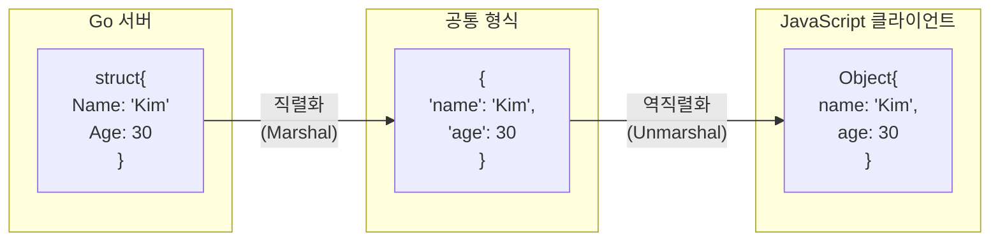

### JSON vs 다른 포맷

| 포맷 | 장점 | 단점 | 주요 용도 |
|------|------|------|----------|
| **JSON** | 사람이 읽기 쉬움, 언어 독립적 | 바이너리보다 크기 큼 | REST API, 설정 파일 |
| **XML** | 스키마 검증, 속성 지원 | 장황함, 파싱 복잡 | SOAP, 레거시 시스템 |
| **Gob** | Go 간 효율적, 타입 보존 | Go 전용 | Go 서비스 간 통신 |
| **Protocol Buffers** | 작은 크기, 빠름 | 스키마 필요, 디버깅 어려움 | gRPC, 고성능 시스템 |

### JSON 데이터 타입

```mermaid
mindmap
  root((JSON 타입))
    문자열
      "hello"
      "2024-01-15"
    숫자
      42
      3.14
      -17
    불리언
      true
      false
    null
      null
    배열
      [1, 2, 3]
      ["a", "b"]
    객체
      {"key": "value"}
      중첩 가능
```

| JSON 타입 | Go 타입 | 예시 |
|-----------|---------|------|
| string | `string` | `"hello"` |
| number | `float64`, `int` | `42`, `3.14` |
| boolean | `bool` | `true`, `false` |
| null | `nil` (포인터) | `null` |
| array | `[]T`, `[]interface{}` | `[1, 2, 3]` |
| object | `struct`, `map[string]T` | `{"name": "Kim"}` |

---

## 직렬화와 역직렬화

### 용어 정리

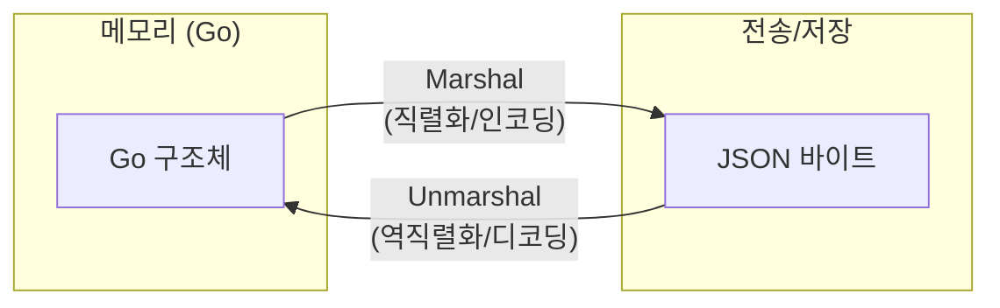

| 용어 | 방향 | 설명 |
|------|------|------|
| **Marshal** (직렬화) | Go → JSON | 메모리의 데이터를 전송 가능한 형태로 변환 |
| **Unmarshal** (역직렬화) | JSON → Go | 전송된 데이터를 메모리의 데이터 구조로 변환 |
| **Encode** | Go → io.Writer | 스트림에 직접 쓰기 |
| **Decode** | io.Reader → Go | 스트림에서 직접 읽기 |

---

## json.Marshal: 구조체 → JSON

### 기본 사용법

```go
type User struct {
    Name  string
    Age   int
    Email string
}

func main() {
    user := User{
        Name:  "Kim",
        Age:   30,
        Email: "kim@example.com",
    }

    // Marshal: 구조체 → JSON 바이트
    jsonBytes, err := json.Marshal(user)
    if err != nil {
        log.Fatal(err)
    }

    fmt.Println(string(jsonBytes))
    // {"Name":"Kim","Age":30,"Email":"kim@example.com"}
}
```

### Marshal 내부 동작

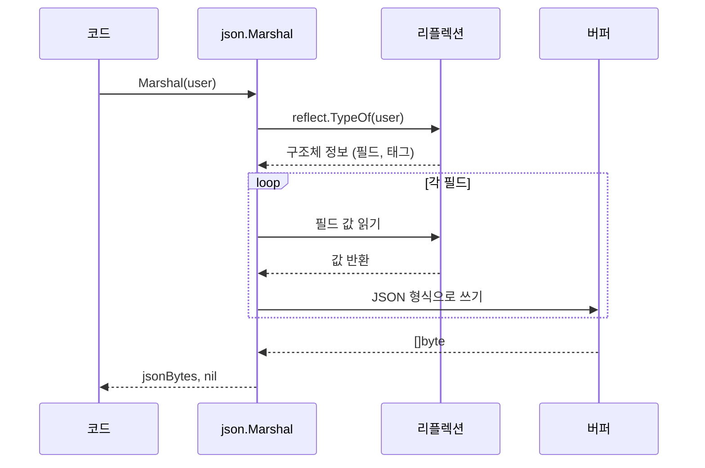

**핵심 포인트**:
- **리플렉션(Reflection)** 사용: 런타임에 구조체 정보를 분석
- **내부 버퍼**에 JSON 문자열 생성
- 완료 후 **[]byte로 반환**

### MarshalIndent: 보기 좋은 출력

```go
// 들여쓰기 포함 (디버깅, 로깅용)
jsonBytes, err := json.MarshalIndent(user, "", "  ")
// 첫 번째 "": 각 줄 앞에 붙는 접두사
// 두 번째 "  ": 들여쓰기 문자 (스페이스 2개)

/*
{
  "Name": "Kim",
  "Age": 30,
  "Email": "kim@example.com"
}
*/
```

| 함수 | 출력 형태 | 용도 |
|------|----------|------|
| `Marshal` | 한 줄 | API 응답, 저장 |
| `MarshalIndent` | 들여쓰기 | 디버깅, 설정 파일, 로깅 |

---

## json.Unmarshal: JSON → 구조체

### 기본 사용법

```go
jsonStr := `{"Name":"Kim","Age":30,"Email":"kim@example.com"}`

var user User
err := json.Unmarshal([]byte(jsonStr), &user)
//                                      ↑ 포인터 필수!
if err != nil {
    log.Fatal(err)
}

fmt.Printf("%+v\n", user)
// {Name:Kim Age:30 Email:kim@example.com}
```

### 왜 포인터(&user)를 전달하는가?

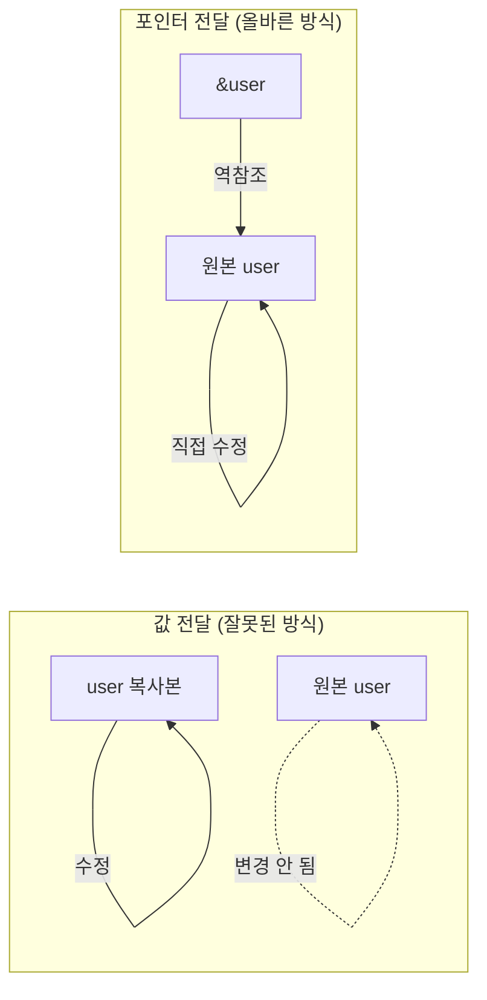

```go
// Unmarshal 시그니처
func Unmarshal(data []byte, v interface{}) error
//                          ↑ interface{}로 받지만, 내부에서 포인터인지 확인

// 잘못된 사용 (컴파일은 되지만 동작 안 함)
json.Unmarshal(data, user)   // 복사본이 수정됨, 원본 변경 없음

// 올바른 사용
json.Unmarshal(data, &user)  // 포인터로 원본 직접 수정
```

### Unmarshal 내부 동작

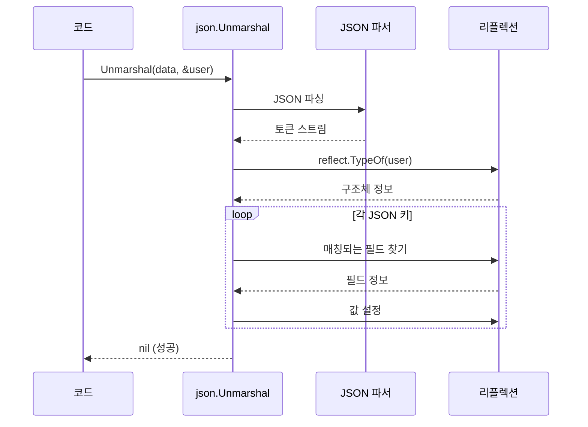

### 필드 매칭 규칙

JSON 키와 구조체 필드를 매칭할 때의 규칙입니다.

```go
type User struct {
    Name     string  // "Name", "name", "NAME" 모두 매칭
    Age      int
    Email    string
    Password string
}

jsonStr := `{
    "name": "Kim",
    "AGE": 30,
    "EMAIL": "kim@example.com",
    "unknown": "무시됨"
}`
```

| 규칙 | 설명 |
|------|------|
| **대소문자 무시** | `Name`과 `name`, `NAME` 모두 매칭 |
| **정확한 매칭 우선** | 태그가 있으면 태그 기준 |
| **없는 필드 무시** | JSON에 있지만 구조체에 없으면 무시 |
| **없는 값은 제로값** | 구조체에 있지만 JSON에 없으면 제로값 유지 |

---

## 구조체 태그 (Struct Tags)

### 태그란?

구조체 필드에 **메타데이터**를 추가하는 Go의 기능입니다.

```go
type User struct {
    ID       int    `json:"id"`
    Name     string `json:"name"`
    Email    string `json:"email,omitempty"`
    Password string `json:"-"`
    Age      int    `json:"age,string"`
}
```

### 태그 문법

```
`json:"<키이름>,<옵션1>,<옵션2>"`
```

```mermaid
flowchart LR
    TAG["`json:\"user_name,omitempty\"`"]

    TAG --> PKG["json"]
    TAG --> NAME["user_name<br/>(JSON 키 이름)"]
    TAG --> OPT["omitempty<br/>(옵션)"]
```

### 태그 옵션 상세

#### 1. 키 이름 지정: `json:"keyName"`

```go
type User struct {
    UserName string `json:"user_name"`  // snake_case로 변환
    CreatedAt time.Time `json:"created_at"`
}

// 출력: {"user_name":"Kim","created_at":"2024-01-15T..."}
```

**왜 키 이름을 바꾸는가?**
- Go 컨벤션: `UserName` (PascalCase)
- JSON/JS 컨벤션: `user_name` (snake_case) 또는 `userName` (camelCase)

#### 2. 제로값 생략: `omitempty`

```go
type User struct {
    Name  string `json:"name"`
    Email string `json:"email,omitempty"`  // 빈 문자열이면 생략
    Age   int    `json:"age,omitempty"`    // 0이면 생략
}

user := User{Name: "Kim"}  // Email, Age는 제로값

jsonBytes, _ := json.Marshal(user)
// {"name":"Kim"}  ← email, age 생략됨
```

**omitempty가 적용되는 제로값**:

| 타입 | 제로값 | 생략 여부 |
|------|--------|----------|
| `string` | `""` | ✅ 생략 |
| `int`, `float64` | `0` | ✅ 생략 |
| `bool` | `false` | ✅ 생략 |
| `pointer` | `nil` | ✅ 생략 |
| `slice`, `map` | `nil` | ✅ 생략 |
| `slice`, `map` | `[]T{}`, `map[]{}` (빈 값) | ❌ 생략 안 됨! |
| `struct` | 빈 구조체 | ❌ 생략 안 됨! |

**주의: 빈 슬라이스/맵은 생략 안 됨**

```go
type Response struct {
    Items []string `json:"items,omitempty"`
}

// nil 슬라이스: 생략됨
r1 := Response{Items: nil}
// {"items":null} 또는 {} (버전에 따라)

// 빈 슬라이스: 생략 안 됨!
r2 := Response{Items: []string{}}
// {"items":[]}
```

#### 3. 필드 제외: `json:"-"`

```go
type User struct {
    Name     string `json:"name"`
    Password string `json:"-"`      // JSON에서 완전히 제외
    APIKey   string `json:"-"`
}

user := User{Name: "Kim", Password: "secret123", APIKey: "abc"}
jsonBytes, _ := json.Marshal(user)
// {"name":"Kim"}  ← Password, APIKey 없음
```

**용도**: 민감한 정보(비밀번호, 토큰), 내부 전용 필드

#### 4. 문자열로 인코딩: `string`

```go
type Item struct {
    ID    int64 `json:"id,string"`      // 숫자를 문자열로
    Price int   `json:"price,string"`
}

item := Item{ID: 123456789012345, Price: 1000}
jsonBytes, _ := json.Marshal(item)
// {"id":"123456789012345","price":"1000"}
```

**왜 필요한가?**
- JavaScript는 큰 정수를 정확히 표현 못함 (53비트 제한)
- `int64` 값이 JavaScript에서 손실될 수 있음

```mermaid
flowchart LR
    GO["Go: 123456789012345678<br/>(int64, 정확함)"]
    JSON["JSON: 123456789012345678<br/>(숫자)"]
    JS["JavaScript: 123456789012345680<br/>(정밀도 손실!)"]

    GO --> JSON --> JS

    GO2["Go: 123456789012345678<br/>(int64)"]
    JSON2["JSON: \"123456789012345678\"<br/>(문자열)"]
    JS2["JavaScript: \"123456789012345678\"<br/>(정확함)"]

    GO2 -->|"string 태그"| JSON2 --> JS2
```

### 태그 조합 예시

```go
type User struct {
    ID        int64     `json:"id,string"`           // 문자열로 변환
    Name      string    `json:"name"`                // 키 이름만 지정
    Email     string    `json:"email,omitempty"`     // 빈 값 생략
    Password  string    `json:"-"`                   // 완전 제외
    CreatedAt time.Time `json:"created_at"`          // snake_case
    UpdatedAt time.Time `json:"updated_at,omitempty"` // 제로값이면 생략
}
```

---

## Exported vs Unexported 필드

### Go의 가시성 규칙

```go
type User struct {
    Name     string  // Exported (대문자 시작) - JSON 포함
    Age      int     // Exported - JSON 포함
    password string  // unexported (소문자 시작) - JSON 제외!
    apiKey   string  // unexported - JSON 제외!
}
```

```mermaid
flowchart TB
    subgraph Struct["User 구조체"]
        E1["Name (Exported)"]
        E2["Age (Exported)"]
        U1["password (unexported)"]
        U2["apiKey (unexported)"]
    end

    subgraph JSON["JSON 출력"]
        J1["{<br/>\"Name\": \"Kim\",<br/>\"Age\": 30<br/>}"]
    end

    E1 --> J1
    E2 --> J1
    U1 -.->|"❌ 제외"| X1["포함 안 됨"]
    U2 -.->|"❌ 제외"| X2["포함 안 됨"]
```

**왜 unexported 필드는 제외되는가?**

1. **리플렉션 제한**: `encoding/json`은 다른 패키지 → unexported 필드 접근 불가
2. **캡슐화 존중**: 외부에 노출하지 않겠다는 의도 존중

```go
// json 패키지 입장에서
reflect.ValueOf(user).FieldByName("password")
// → 다른 패키지의 unexported 필드는 읽기/쓰기 불가
```

---

## Marshal vs Encoder / Unmarshal vs Decoder

### 두 가지 방식의 차이

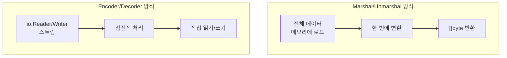

| 구분 | Marshal/Unmarshal | Encoder/Decoder |
|------|-------------------|-----------------|
| **입출력** | `[]byte` | `io.Reader`, `io.Writer` |
| **메모리** | 전체 데이터 메모리에 | 스트리밍 (메모리 효율적) |
| **용도** | 작은 데이터, 문자열 | 파일, HTTP, 네트워크 |
| **여러 객체** | 직접 처리 | 연속 처리 가능 |

### Marshal/Unmarshal 사용

```go
// 문자열/바이트 기반 처리
user := User{Name: "Kim", Age: 30}

// Marshal: 구조체 → []byte
jsonBytes, err := json.Marshal(user)

// Unmarshal: []byte → 구조체
var decoded User
err = json.Unmarshal(jsonBytes, &decoded)
```

### Encoder/Decoder 사용

```go
// 스트림 기반 처리

// 파일에 쓰기
file, _ := os.Create("user.json")
encoder := json.NewEncoder(file)
encoder.Encode(user)  // 파일에 직접 쓰기

// 파일에서 읽기
file, _ = os.Open("user.json")
decoder := json.NewDecoder(file)
var loaded User
decoder.Decode(&loaded)  // 파일에서 직접 읽기
```

### HTTP에서의 활용

```go
// HTTP 응답 보내기
func handler(w http.ResponseWriter, r *http.Request) {
    user := User{Name: "Kim", Age: 30}

    w.Header().Set("Content-Type", "application/json")

    // 방법 1: Marshal (메모리에 바이트 생성 후 쓰기)
    jsonBytes, _ := json.Marshal(user)
    w.Write(jsonBytes)

    // 방법 2: Encoder (직접 스트림에 쓰기) - 더 효율적
    json.NewEncoder(w).Encode(user)
}

// HTTP 요청 본문 읽기
func handler(w http.ResponseWriter, r *http.Request) {
    var user User

    // 방법 1: Unmarshal (전체 읽은 후 파싱)
    body, _ := io.ReadAll(r.Body)
    json.Unmarshal(body, &user)

    // 방법 2: Decoder (스트림에서 직접 파싱) - 더 효율적
    json.NewDecoder(r.Body).Decode(&user)
}
```

### Encoder/Decoder 동작 흐름

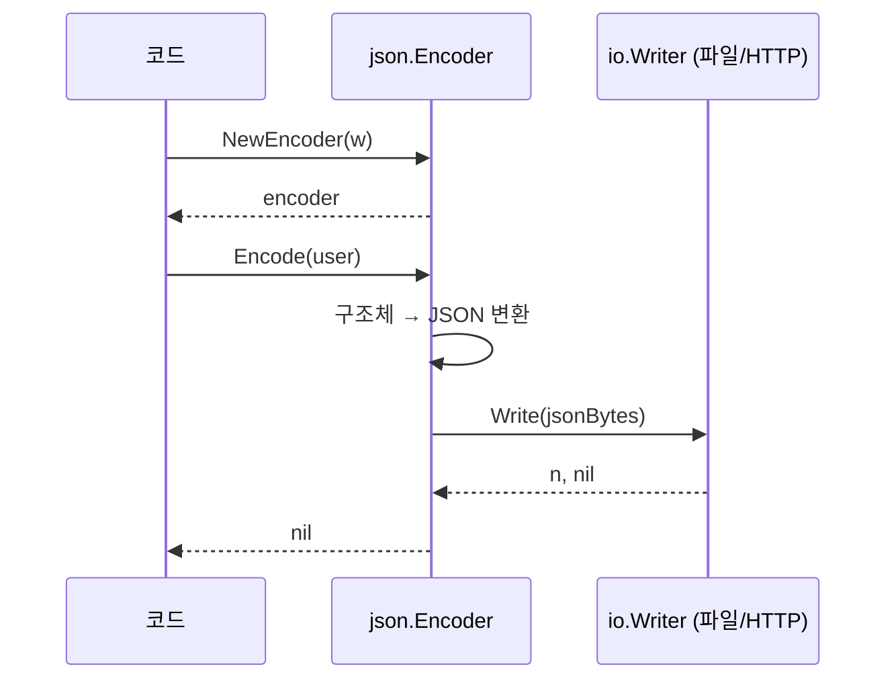

### 여러 객체 연속 처리

Encoder/Decoder의 장점: **여러 JSON 객체를 연속으로 처리** 가능

```go
// 여러 객체 쓰기
encoder := json.NewEncoder(file)
encoder.Encode(user1)  // {"name":"Kim"}\n
encoder.Encode(user2)  // {"name":"Lee"}\n
encoder.Encode(user3)  // {"name":"Park"}\n

// 여러 객체 읽기
decoder := json.NewDecoder(file)
for {
    var user User
    err := decoder.Decode(&user)
    if err == io.EOF {
        break  // 파일 끝
    }
    fmt.Println(user)
}
```

---

## 동적 JSON 처리

### 구조를 모르는 JSON 처리

API 응답의 구조가 동적이거나, 일부만 필요할 때 사용합니다.

#### 방법 1: map[string]interface{}

```go
jsonStr := `{
    "name": "Kim",
    "age": 30,
    "address": {
        "city": "Seoul",
        "zip": "12345"
    },
    "tags": ["developer", "go"]
}`

var data map[string]interface{}
json.Unmarshal([]byte(jsonStr), &data)

// 값 접근 (타입 단언 필요)
name := data["name"].(string)
age := data["age"].(float64)  // 주의: 숫자는 항상 float64!

// 중첩 객체 접근
address := data["address"].(map[string]interface{})
city := address["city"].(string)

// 배열 접근
tags := data["tags"].([]interface{})
firstTag := tags[0].(string)
```

#### 숫자가 float64가 되는 이유

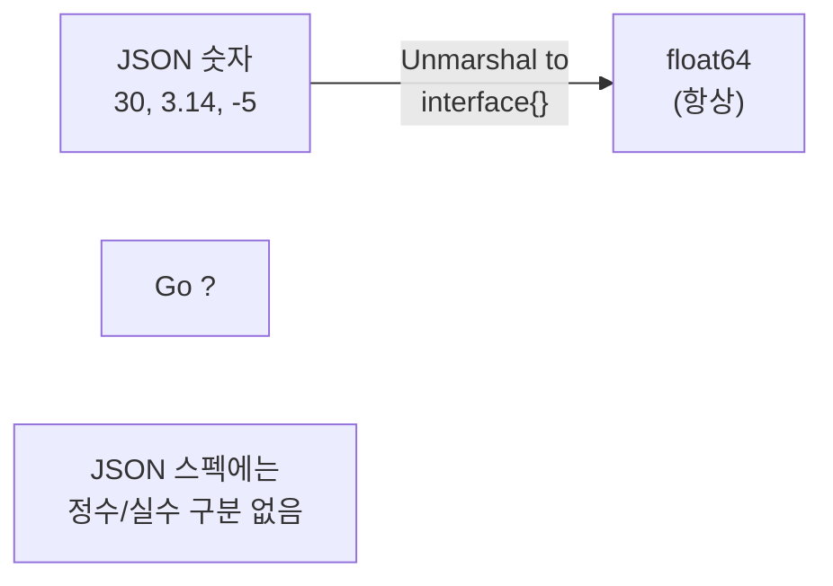

JSON 숫자는 **정수/실수 구분이 없습니다**. Go의 `interface{}`로 받을 때:
- 구체적인 타입을 알 수 없음
- **가장 안전한 타입** = `float64` (정수도 실수도 표현 가능)

```go
var data map[string]interface{}
json.Unmarshal([]byte(`{"count": 42}`), &data)

// 잘못된 방법 (panic!)
count := data["count"].(int)  // panic: interface {} is float64, not int

// 올바른 방법
count := int(data["count"].(float64))  // 42
```

#### 방법 2: json.RawMessage (지연 파싱)

일부만 파싱하고, 나머지는 나중에 처리하고 싶을 때:

```go
type Response struct {
    Type    string          `json:"type"`
    Payload json.RawMessage `json:"payload"`  // 파싱 보류
}

jsonStr := `{
    "type": "user",
    "payload": {"name": "Kim", "age": 30}
}`

var resp Response
json.Unmarshal([]byte(jsonStr), &resp)

// resp.Type = "user"
// resp.Payload = []byte(`{"name": "Kim", "age": 30}`)  // 아직 파싱 안 됨

// type에 따라 다른 구조체로 파싱
switch resp.Type {
case "user":
    var user User
    json.Unmarshal(resp.Payload, &user)
case "product":
    var product Product
    json.Unmarshal(resp.Payload, &product)
}
```

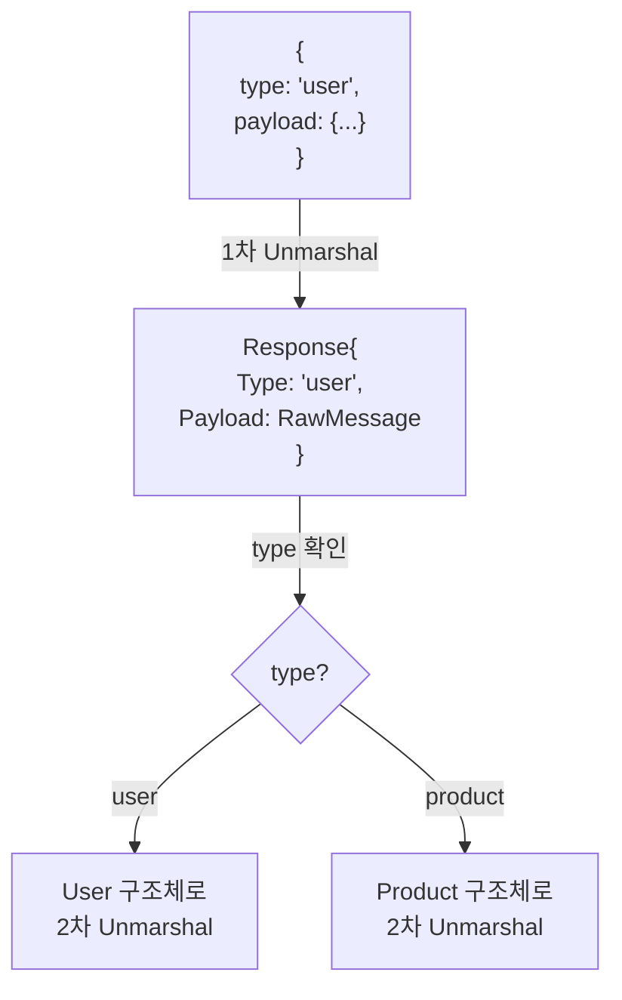

#### 방법 3: 부분 구조체 정의

필요한 필드만 정의하면 나머지는 무시됩니다.

```go
// 큰 JSON에서 일부만 추출
jsonStr := `{
    "id": 123,
    "name": "Kim",
    "email": "kim@example.com",
    "address": {...},
    "preferences": {...},
    "metadata": {...}
}`

// 필요한 필드만 정의
type PartialUser struct {
    ID   int    `json:"id"`
    Name string `json:"name"`
}

var user PartialUser
json.Unmarshal([]byte(jsonStr), &user)
// user.ID = 123, user.Name = "Kim"
// 나머지 필드는 무시됨
```

---

## 커스텀 Marshal/Unmarshal

### MarshalJSON 인터페이스

특별한 직렬화 로직이 필요할 때 구현합니다.

```go
type Marshaler interface {
    MarshalJSON() ([]byte, error)
}
```

**예시: 시간 포맷 커스터마이징**

```go
type CustomTime struct {
    time.Time
}

// MarshalJSON 구현
func (ct CustomTime) MarshalJSON() ([]byte, error) {
    formatted := ct.Format("2006-01-02")  // YYYY-MM-DD 형식
    return []byte(`"` + formatted + `"`), nil
    //             ↑ JSON 문자열이므로 따옴표 포함
}

type Event struct {
    Name string     `json:"name"`
    Date CustomTime `json:"date"`
}

event := Event{
    Name: "Meeting",
    Date: CustomTime{time.Now()},
}

jsonBytes, _ := json.Marshal(event)
// {"name":"Meeting","date":"2024-01-15"}
```

### UnmarshalJSON 인터페이스

특별한 역직렬화 로직이 필요할 때 구현합니다.

```go
type Unmarshaler interface {
    UnmarshalJSON([]byte) error
}
```

**예시: 유연한 시간 파싱**

```go
func (ct *CustomTime) UnmarshalJSON(data []byte) error {
    // 따옴표 제거
    str := strings.Trim(string(data), `"`)

    // 여러 포맷 시도
    formats := []string{
        "2006-01-02",
        "2006/01/02",
        "02-Jan-2006",
        time.RFC3339,
    }

    for _, format := range formats {
        if t, err := time.Parse(format, str); err == nil {
            ct.Time = t
            return nil
        }
    }

    return fmt.Errorf("cannot parse time: %s", str)
}
```

### 동작 흐름

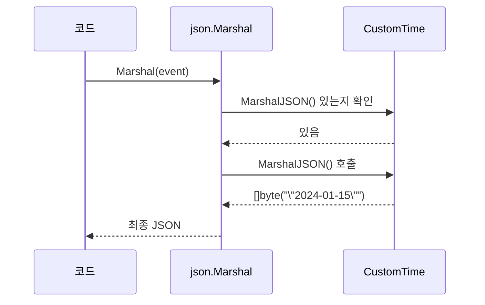

---

## 에러 처리

### 일반적인 에러 유형

```go
// 1. 잘못된 JSON 문법
err := json.Unmarshal([]byte(`{invalid json}`), &data)
// json: invalid character 'i' looking for beginning of object key string

// 2. 타입 불일치
type User struct {
    Age int `json:"age"`
}
err := json.Unmarshal([]byte(`{"age": "thirty"}`), &user)
// json: cannot unmarshal string into Go struct field User.age of type int

// 3. 포인터가 아닌 값 전달
err := json.Unmarshal(data, user)  // &user가 아닌 user
// json: Unmarshal(non-pointer User)
```

### 에러 타입 확인

```go
var syntaxErr *json.SyntaxError
var typeErr *json.UnmarshalTypeError

err := json.Unmarshal(data, &target)

switch {
case errors.As(err, &syntaxErr):
    fmt.Printf("JSON 문법 에러 (위치 %d): %v\n", syntaxErr.Offset, err)

case errors.As(err, &typeErr):
    fmt.Printf("타입 에러: 필드 %s, 기대 %s, 실제 %s\n",
        typeErr.Field, typeErr.Type, typeErr.Value)

case err != nil:
    fmt.Printf("기타 에러: %v\n", err)
}
```

### 안전한 타입 단언

```go
var data map[string]interface{}
json.Unmarshal(jsonBytes, &data)

// 위험한 방법 (panic 가능)
name := data["name"].(string)

// 안전한 방법 (ok 패턴)
if name, ok := data["name"].(string); ok {
    fmt.Println("이름:", name)
} else {
    fmt.Println("name이 없거나 문자열이 아님")
}

// 중첩 객체 안전하게 접근
if address, ok := data["address"].(map[string]interface{}); ok {
    if city, ok := address["city"].(string); ok {
        fmt.Println("도시:", city)
    }
}
```

---

## 성능 고려사항

### Marshal/Unmarshal의 비용

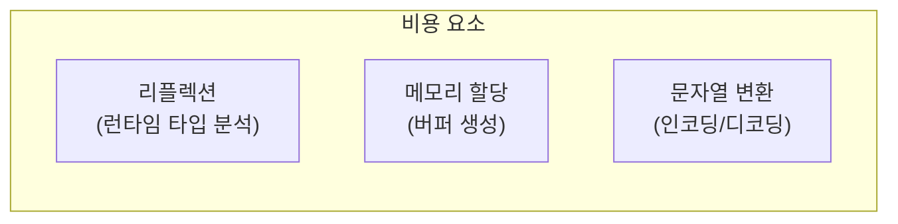

### 성능 최적화 팁

#### 1. 구조체 재사용

```go
// 나쁜 예: 매번 새 구조체
for _, data := range jsonList {
    var user User  // 매번 새로 할당
    json.Unmarshal(data, &user)
    process(user)
}

// 좋은 예: 구조체 재사용
var user User
for _, data := range jsonList {
    json.Unmarshal(data, &user)  // 기존 구조체 덮어쓰기
    process(user)
}
```

#### 2. Encoder/Decoder 재사용

```go
// HTTP 핸들러에서 매번 생성하지 말고...
encoder := json.NewEncoder(w)
encoder.SetIndent("", "  ")  // 설정 재사용 가능
```

#### 3. 고성능 라이브러리 고려

표준 라이브러리가 충분하지 않을 때:

| 라이브러리 | 특징 |
|-----------|------|
| `json-iterator/go` | 표준 호환, 더 빠름 |
| `easyjson` | 코드 생성 기반, 매우 빠름 |
| `ffjson` | 코드 생성 기반 |
| `sonic` | SIMD 활용, 최고 성능 |

```go
// json-iterator 사용 예
import jsoniter "github.com/json-iterator/go"

var json = jsoniter.ConfigCompatibleWithStandardLibrary
json.Marshal(user)
json.Unmarshal(data, &user)
```

---

## 실무 패턴 모음

### 패턴 1: API 응답 구조체

```go
// 표준 API 응답 형식
type APIResponse[T any] struct {
    Success bool   `json:"success"`
    Data    T      `json:"data,omitempty"`
    Error   string `json:"error,omitempty"`
}

// 사용
type User struct {
    ID   int    `json:"id"`
    Name string `json:"name"`
}

response := APIResponse[User]{
    Success: true,
    Data:    User{ID: 1, Name: "Kim"},
}
```

### 패턴 2: 설정 파일 처리

```go
type Config struct {
    Server   ServerConfig   `json:"server"`
    Database DatabaseConfig `json:"database"`
}

type ServerConfig struct {
    Host string `json:"host"`
    Port int    `json:"port"`
}

type DatabaseConfig struct {
    URL      string `json:"url"`
    MaxConns int    `json:"max_connections"`
}

// 파일에서 읽기
func LoadConfig(path string) (*Config, error) {
    file, err := os.Open(path)
    if err != nil {
        return nil, fmt.Errorf("설정 파일 열기 실패: %w", err)
    }
    defer file.Close()

    var config Config
    if err := json.NewDecoder(file).Decode(&config); err != nil {
        return nil, fmt.Errorf("설정 파싱 실패: %w", err)
    }

    return &config, nil
}

// 파일에 저장
func SaveConfig(path string, config *Config) error {
    file, err := os.Create(path)
    if err != nil {
        return fmt.Errorf("설정 파일 생성 실패: %w", err)
    }
    defer file.Close()

    encoder := json.NewEncoder(file)
    encoder.SetIndent("", "  ")  // 보기 좋게

    if err := encoder.Encode(config); err != nil {
        return fmt.Errorf("설정 저장 실패: %w", err)
    }

    return nil
}
```

### 패턴 3: HTTP 핸들러

```go
// JSON 요청 처리 헬퍼
func decodeJSON[T any](r *http.Request) (T, error) {
    var v T
    if err := json.NewDecoder(r.Body).Decode(&v); err != nil {
        return v, fmt.Errorf("JSON 디코딩 실패: %w", err)
    }
    return v, nil
}

// JSON 응답 헬퍼
func respondJSON(w http.ResponseWriter, status int, data interface{}) {
    w.Header().Set("Content-Type", "application/json")
    w.WriteHeader(status)
    json.NewEncoder(w).Encode(data)
}

// 에러 응답 헬퍼
func respondError(w http.ResponseWriter, status int, message string) {
    respondJSON(w, status, map[string]string{"error": message})
}

// 핸들러 사용 예
func createUserHandler(w http.ResponseWriter, r *http.Request) {
    user, err := decodeJSON[User](r)
    if err != nil {
        respondError(w, http.StatusBadRequest, err.Error())
        return
    }

    // 사용자 생성 로직...

    respondJSON(w, http.StatusCreated, user)
}
```

### 패턴 4: 다형성 JSON (type 필드 기반)

```go
type Message struct {
    Type    string          `json:"type"`
    Payload json.RawMessage `json:"payload"`
}

type TextMessage struct {
    Content string `json:"content"`
}

type ImageMessage struct {
    URL    string `json:"url"`
    Width  int    `json:"width"`
    Height int    `json:"height"`
}

func ParseMessage(data []byte) (interface{}, error) {
    var msg Message
    if err := json.Unmarshal(data, &msg); err != nil {
        return nil, err
    }

    switch msg.Type {
    case "text":
        var text TextMessage
        if err := json.Unmarshal(msg.Payload, &text); err != nil {
            return nil, err
        }
        return text, nil

    case "image":
        var image ImageMessage
        if err := json.Unmarshal(msg.Payload, &image); err != nil {
            return nil, err
        }
        return image, nil

    default:
        return nil, fmt.Errorf("unknown message type: %s", msg.Type)
    }
}
```

---

## 정리

### 함수 선택 가이드

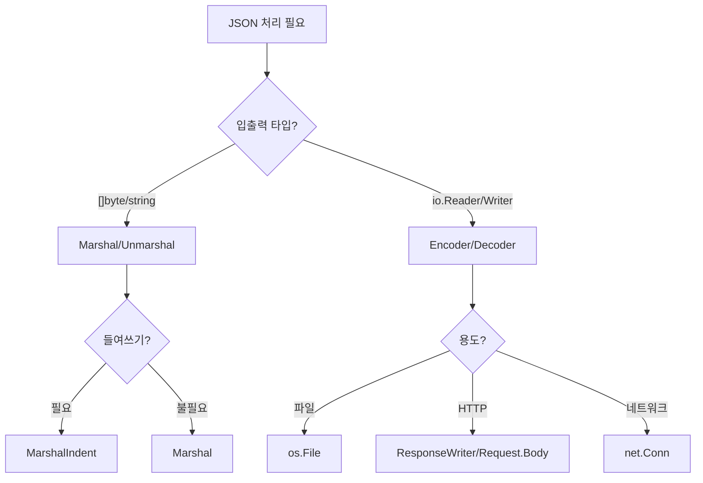

### 핵심 요약

| 개념 | 설명 |
|------|------|
| `Marshal` | 구조체 → []byte (메모리) |
| `Unmarshal` | []byte → 구조체 (메모리) |
| `Encoder` | 구조체 → io.Writer (스트림) |
| `Decoder` | io.Reader → 구조체 (스트림) |
| 구조체 태그 | `json:"name,omitempty"` |
| Exported 필드만 | 대문자 시작 필드만 JSON 포함 |
| `interface{}` | 숫자는 항상 `float64` |
| `json.RawMessage` | 파싱 지연 |

### 태그 요약

| 태그 | 의미 | 예시 |
|------|------|------|
| `json:"name"` | JSON 키 이름 | `json:"user_name"` |
| `json:",omitempty"` | 제로값 생략 | `json:"email,omitempty"` |
| `json:"-"` | 필드 제외 | `json:"-"` |
| `json:",string"` | 문자열로 인코딩 | `json:"id,string"` |

---

## 실습 과제

### 과제 1: API 응답 파싱
외부 API(예: GitHub API)의 JSON 응답을 적절한 구조체로 언마샬하는 코드를 작성하세요.

### 과제 2: 설정 파일 처리
JSON 형식의 설정 파일을 읽어 구조체로 변환하고, 수정 후 다시 저장하는 프로그램을 작성하세요.

### 과제 3: 커스텀 시간 포맷
`MarshalJSON`/`UnmarshalJSON`을 구현하여 "2024년 01월 15일" 형식의 날짜를 처리하는 타입을 만드세요.

### 과제 4: 다형성 메시지 처리
`type` 필드에 따라 다른 구조체로 파싱하는 메시지 시스템을 구현하세요.

---

## 참고 자료
- [Go Package - encoding/json](https://pkg.go.dev/encoding/json)
- [Go Blog - JSON and Go](https://go.dev/blog/json)
- [Go Blog - JSON-RPC: a tale of interfaces](https://go.dev/blog/json-rpc)
- [Effective Go - JSON](https://go.dev/doc/effective_go#json)
