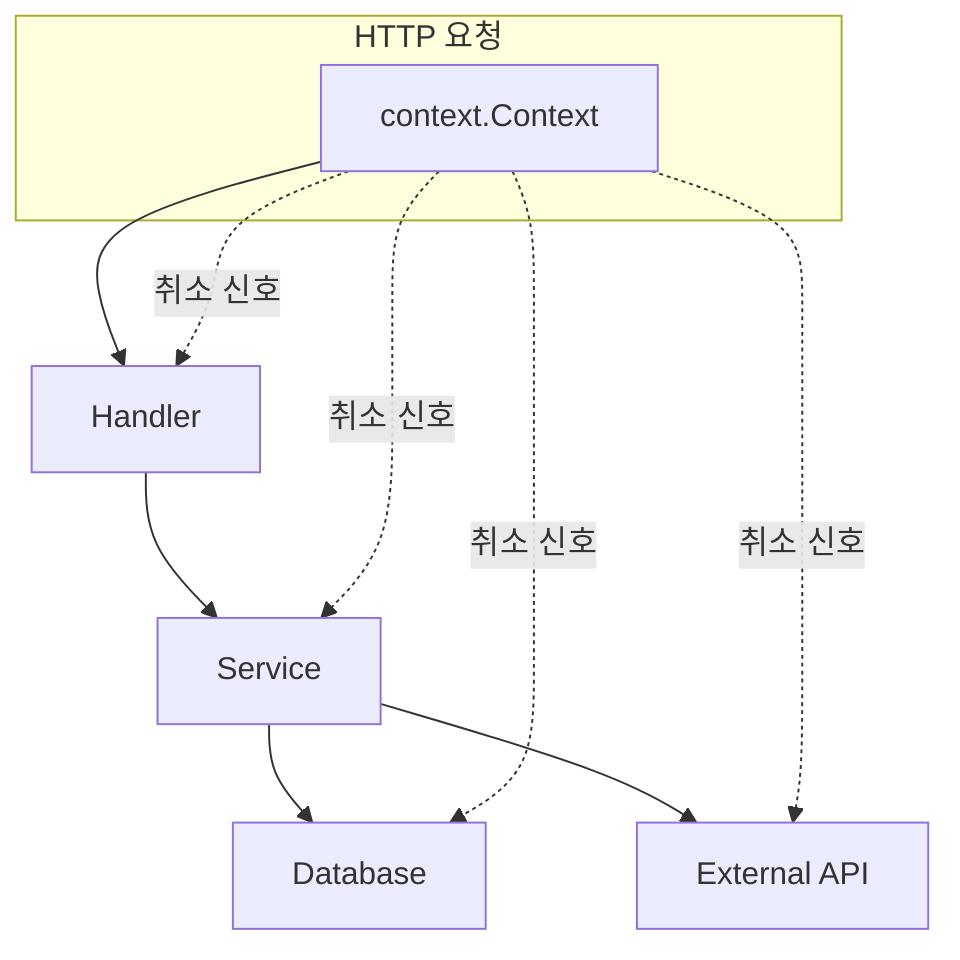
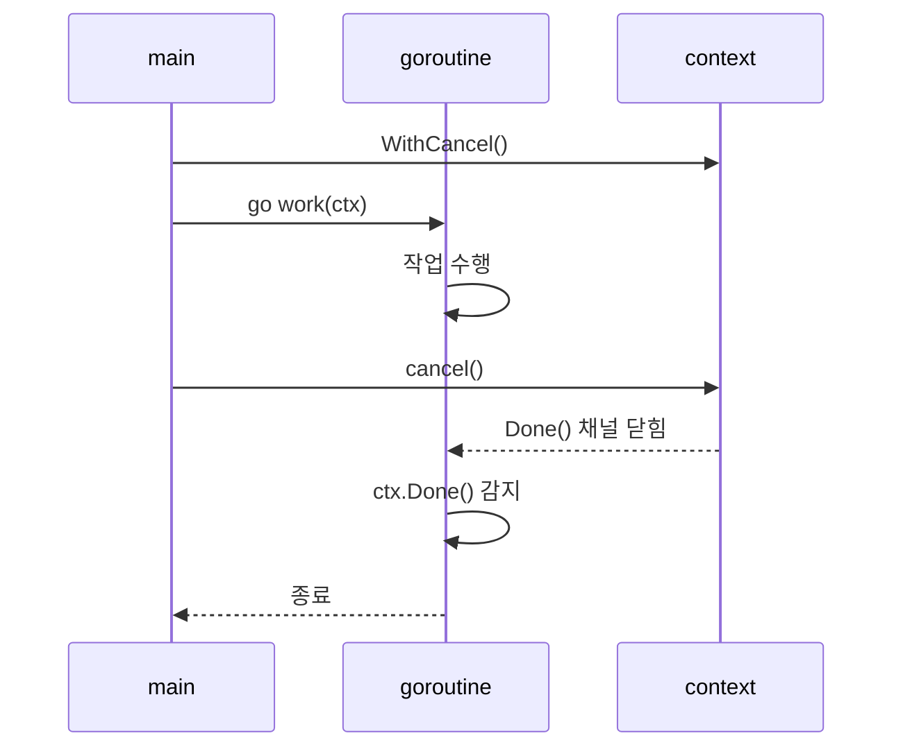
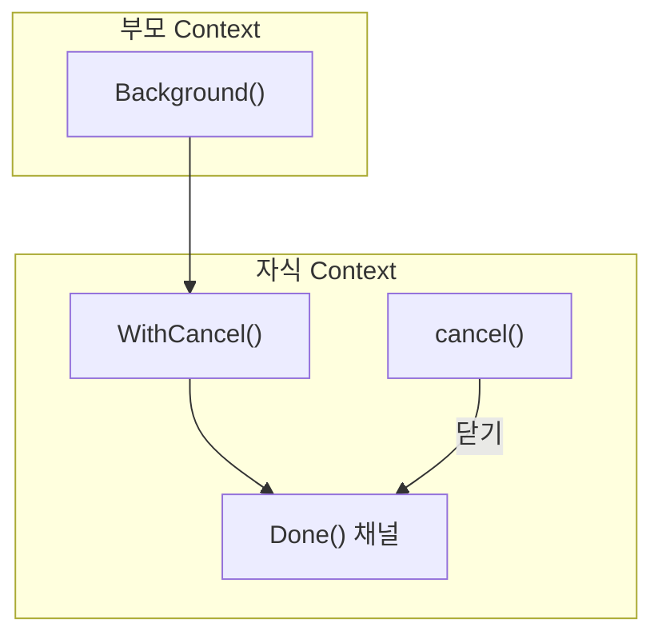
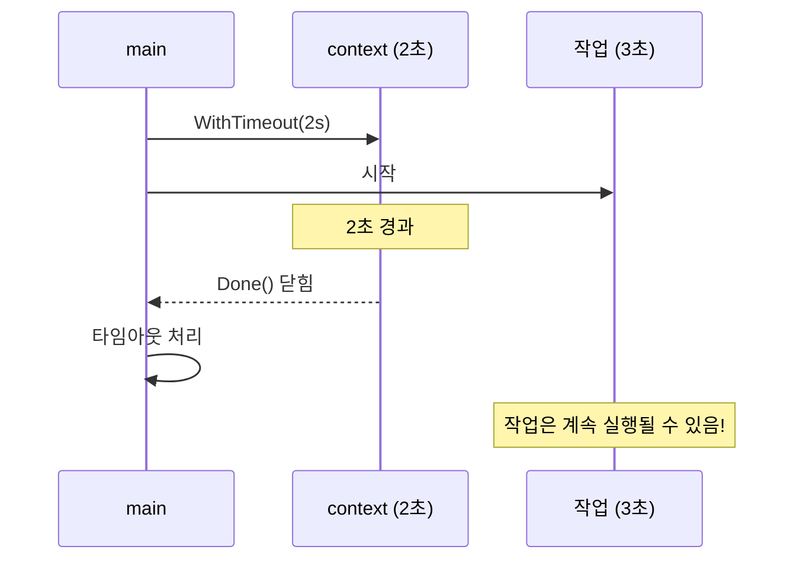
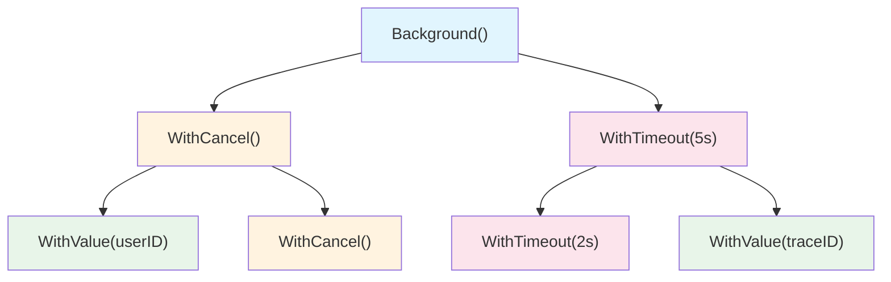
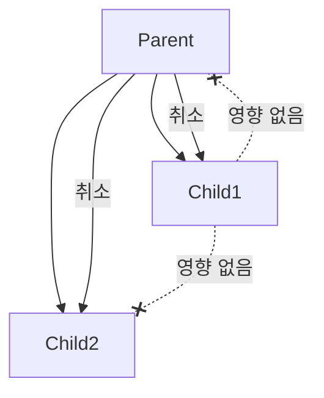
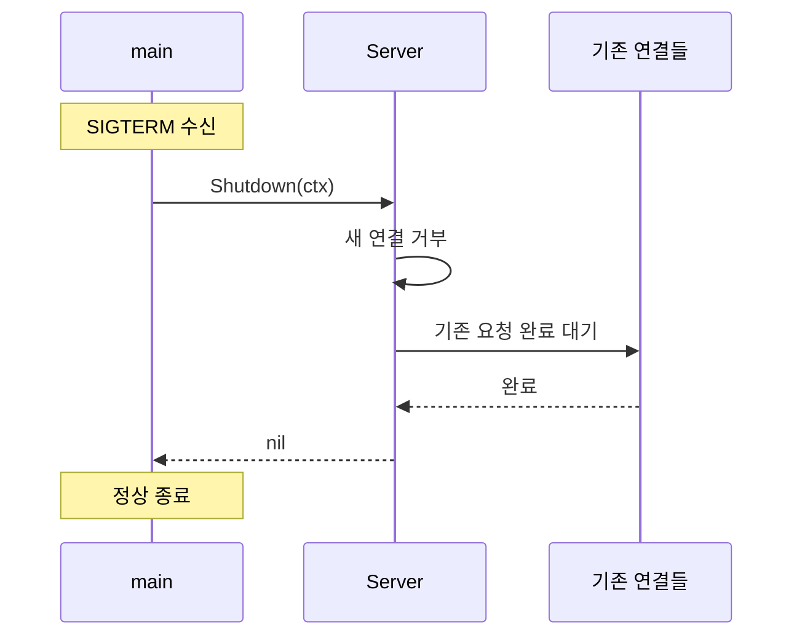
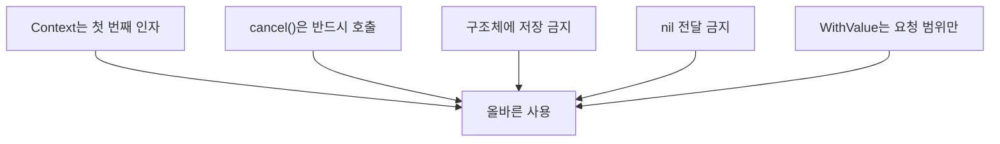

```mermaid
gantt
    title 타임아웃 체이닝
    dateFormat ss
    axisFormat %S초

    section 전체 요청
    30초 타임아웃 :a1, 00, 30s

    section 인증
    5초 타임아웃 :a2, 00, 5s

    section 데이터 조회
    10초 타임아웃 :a3, 05, 10s

    section 처리
    나머지 :a4, 15, 15s
```

# 03. Context 패키지 심화

## 학습 목표
Go의 `context` 패키지를 깊이 이해하고, 취소 신호 전파, 타임아웃 처리, 요청 범위 데이터 전달을 상황에 맞게 구현한다.

---

## Context란 무엇인가?

### 문제 상황: 고루틴 제어의 어려움

```go
// 문제: 이 고루틴을 어떻게 멈출까?
func fetchData() {
    go func() {
        for {
            // 외부 API 호출
            data := callExternalAPI()
            process(data)
            time.Sleep(time.Second)
        }
    }()
}
```

고루틴은 시작하기는 쉽지만, **외부에서 멈추기가 어렵습니다**. 특히:
- HTTP 요청이 취소되었을 때
- 타임아웃이 발생했을 때
- 상위 작업이 종료되었을 때

### Context의 역할

`context.Context`는 **작업의 취소, 타임아웃, 데드라인을 전파**하는 표준 메커니즘입니다.



**Context의 세 가지 핵심 기능**:

| 기능 | 설명 | 함수 |
|------|------|------|
| **취소 (Cancellation)** | 작업을 명시적으로 중단 | `WithCancel` |
| **타임아웃 (Timeout)** | 일정 시간 후 자동 취소 | `WithTimeout`, `WithDeadline` |
| **값 전달 (Value)** | 요청 범위 데이터 전달 | `WithValue` |

---

## Context 인터페이스

### 정의

```go
type Context interface {
    // 취소 또는 타임아웃 시 닫히는 채널 반환
    Done() <-chan struct{}

    // Done()이 닫힌 이유 반환 (Canceled 또는 DeadlineExceeded)
    Err() error

    // 데드라인 반환 (설정된 경우)
    Deadline() (deadline time.Time, ok bool)

    // 저장된 값 조회
    Value(key interface{}) interface{}
}
```

### 메서드 상세

#### Done() - 취소 신호 채널

```go
// Done()은 읽기 전용 채널 반환
<-chan struct{}

// 사용 패턴: select로 취소 감지
select {
case <-ctx.Done():
    // 취소됨!
    return ctx.Err()
case result := <-resultChan:
    // 정상 결과
    return result
}
```



#### Err() - 취소 원인

```go
// Done()이 닫힌 후 호출
err := ctx.Err()

// 가능한 값
context.Canceled         // cancel() 호출됨
context.DeadlineExceeded // 타임아웃/데드라인 초과
nil                      // 아직 취소 안 됨
```

#### Deadline() - 데드라인 확인

```go
deadline, ok := ctx.Deadline()
if ok {
    remaining := time.Until(deadline)
    fmt.Printf("남은 시간: %v\n", remaining)
} else {
    fmt.Println("데드라인 없음")
}
```

#### Value() - 저장된 값 조회

```go
// 값 조회 (타입 단언 필요)
if userID, ok := ctx.Value("userID").(string); ok {
    fmt.Println("사용자:", userID)
}
```

---

## Context 생성 함수

### context.Background()

**루트 Context**입니다. 취소되지 않고, 값이 없으며, 데드라인이 없습니다.

```go
ctx := context.Background()
```

**사용 시점**:
- `main()` 함수에서
- 최상위 요청 처리 시작점
- 테스트에서

### context.TODO()

구현이 아직 불완전할 때 사용하는 **플레이스홀더**입니다.

```go
ctx := context.TODO()
```

**사용 시점**:
- 어떤 Context를 사용할지 아직 모를 때
- 리팩토링 중 임시로
- **프로덕션 코드에서는 피해야 함**

### Background vs TODO

```go
// 의도가 명확: "이게 루트 context다"
ctx := context.Background()

// 의도가 불명확: "나중에 적절한 context로 바꿔야 함"
ctx := context.TODO()
```

---

## WithCancel: 수동 취소

### 기본 사용법

```go
// 부모 context로부터 취소 가능한 context 생성
ctx, cancel := context.WithCancel(context.Background())

// 반드시 cancel 호출! (리소스 해제)
defer cancel()

// 고루틴 시작
go doWork(ctx)

// 필요 시 취소
cancel()
```

### 동작 원리



### 예제: 고루틴 취소

```go
func main() {
    ctx, cancel := context.WithCancel(context.Background())

    // 고루틴 시작
    go func(ctx context.Context) {
        for {
            select {
            case <-ctx.Done():
                fmt.Println("취소됨:", ctx.Err())
                return
            default:
                fmt.Println("작업 중...")
                time.Sleep(500 * time.Millisecond)
            }
        }
    }(ctx)

    // 2초 후 취소
    time.Sleep(2 * time.Second)
    cancel()

    // 고루틴 종료 대기
    time.Sleep(100 * time.Millisecond)
    fmt.Println("메인 종료")
}
```

**출력**:
```
작업 중...
작업 중...
작업 중...
작업 중...
취소됨: context canceled
메인 종료
```

### 중요: defer cancel() 필수!

```go
ctx, cancel := context.WithCancel(parent)
defer cancel()  // 항상 호출해야 리소스 누수 방지!
```

**cancel()을 호출하지 않으면**:
- 내부 고루틴이 계속 실행될 수 있음
- 메모리 누수
- 고루틴 누수

---

## WithTimeout: 시간 제한

### 기본 사용법

```go
// 3초 후 자동 취소
ctx, cancel := context.WithTimeout(context.Background(), 3*time.Second)
defer cancel()

// ctx.Done()은 3초 후 닫힘
```

### WithTimeout vs WithDeadline

```go
// WithTimeout: 상대 시간 (지금부터 3초)
ctx, cancel := context.WithTimeout(parent, 3*time.Second)

// WithDeadline: 절대 시간 (특정 시점)
deadline := time.Now().Add(3 * time.Second)
ctx, cancel := context.WithDeadline(parent, deadline)

// 동일한 결과!
```

| 함수 | 인자 | 용도 |
|------|------|------|
| `WithTimeout` | `Duration` | "3초 후" |
| `WithDeadline` | `Time` | "15:30:00에" |

### 예제: HTTP 요청 타임아웃

```go
func fetchWithTimeout(url string) ([]byte, error) {
    // 5초 타임아웃
    ctx, cancel := context.WithTimeout(context.Background(), 5*time.Second)
    defer cancel()

    // Context가 포함된 요청 생성
    req, err := http.NewRequestWithContext(ctx, "GET", url, nil)
    if err != nil {
        return nil, err
    }

    // 요청 실행
    resp, err := http.DefaultClient.Do(req)
    if err != nil {
        // 타임아웃 시 context deadline exceeded
        return nil, err
    }
    defer resp.Body.Close()

    return io.ReadAll(resp.Body)
}
```

### 예제: 데이터베이스 쿼리 타임아웃

```go
func queryWithTimeout(db *sql.DB, query string) (*sql.Rows, error) {
    ctx, cancel := context.WithTimeout(context.Background(), 10*time.Second)
    defer cancel()

    // Context가 포함된 쿼리
    return db.QueryContext(ctx, query)
}
```

### 타임아웃 감지 패턴

```go
ctx, cancel := context.WithTimeout(context.Background(), 2*time.Second)
defer cancel()

select {
case <-time.After(3 * time.Second):
    // 3초 후 완료
    fmt.Println("작업 완료")

case <-ctx.Done():
    // 2초 후 타임아웃
    if ctx.Err() == context.DeadlineExceeded {
        fmt.Println("타임아웃!")
    }
}
```



---

## WithValue: 값 전달

### 기본 사용법

```go
// 값 저장
ctx := context.WithValue(parent, "userID", "user-123")

// 값 조회
userID := ctx.Value("userID").(string)
```

### 타입 안전한 키 사용

**문자열 키의 문제점**:

```go
// 패키지 A
ctx = context.WithValue(ctx, "userID", "user-A")

// 패키지 B (충돌!)
ctx = context.WithValue(ctx, "userID", "user-B")
```

**해결: 비공개 타입을 키로 사용**:

```go
// 패키지 수준 비공개 타입
type contextKey string

const (
    userIDKey contextKey = "userID"
    traceIDKey contextKey = "traceID"
)

// 저장
ctx := context.WithValue(parent, userIDKey, "user-123")

// 조회
if userID, ok := ctx.Value(userIDKey).(string); ok {
    fmt.Println("사용자:", userID)
}
```

### 값 접근 헬퍼 함수 패턴

```go
type contextKey string

const userIDKey contextKey = "userID"

// 저장 헬퍼
func WithUserID(ctx context.Context, userID string) context.Context {
    return context.WithValue(ctx, userIDKey, userID)
}

// 조회 헬퍼
func GetUserID(ctx context.Context) (string, bool) {
    userID, ok := ctx.Value(userIDKey).(string)
    return userID, ok
}

// 사용
ctx := WithUserID(context.Background(), "user-123")
if userID, ok := GetUserID(ctx); ok {
    fmt.Println("사용자:", userID)
}
```

### WithValue 주의사항

**적절한 사용**:
- 요청 ID (Request ID)
- 트레이스 ID (Trace ID)
- 인증된 사용자 정보
- 로깅 메타데이터

**부적절한 사용**:
- 함수 매개변수 대체 ❌
- 선택적 인자 전달 ❌
- 비즈니스 로직 데이터 ❌

```go
// ❌ 나쁜 예: 함수 인자를 context로 전달
ctx := context.WithValue(ctx, "config", config)
doSomething(ctx)

// ✅ 좋은 예: 명시적 인자 사용
doSomething(ctx, config)
```

---

## Context 전파

### 트리 구조

Context는 **부모-자식 트리 구조**를 형성합니다.



### 취소 전파 규칙

1. **부모가 취소되면 모든 자식도 취소됨**
2. **자식이 취소되어도 부모는 영향 없음**
3. **형제 간에는 영향 없음**

```go
parent, parentCancel := context.WithCancel(context.Background())
child1, child1Cancel := context.WithCancel(parent)
child2, child2Cancel := context.WithCancel(parent)

// parent 취소 → child1, child2 모두 취소됨
parentCancel()

// child1 취소 → parent, child2는 영향 없음
child1Cancel()
```



### 타임아웃 상속

자식의 타임아웃은 부모보다 **짧아야 의미 있습니다**.

```go
// 부모: 5초 타임아웃
parent, _ := context.WithTimeout(context.Background(), 5*time.Second)

// 자식: 10초 타임아웃 (의미 없음! 부모가 먼저 취소됨)
child, _ := context.WithTimeout(parent, 10*time.Second)

// 자식: 2초 타임아웃 (유효! 2초 후 취소)
child, _ := context.WithTimeout(parent, 2*time.Second)
```

---

## 실무 패턴

### 패턴 1: HTTP 서버에서 Context 사용

```go
func handler(w http.ResponseWriter, r *http.Request) {
    // 요청의 context 사용 (클라이언트 연결 끊김 시 취소됨)
    ctx := r.Context()

    // 하위 작업에 전달
    result, err := fetchData(ctx)
    if err != nil {
        if ctx.Err() == context.Canceled {
            // 클라이언트가 연결을 끊음
            return
        }
        http.Error(w, err.Error(), http.StatusInternalServerError)
        return
    }

    json.NewEncoder(w).Encode(result)
}

func fetchData(ctx context.Context) (Data, error) {
    // 추가 타임아웃 설정
    ctx, cancel := context.WithTimeout(ctx, 5*time.Second)
    defer cancel()

    // 외부 API 호출
    return callExternalAPI(ctx)
}
```

### 패턴 2: Graceful Shutdown

```go
func main() {
    server := &http.Server{Addr: ":8080"}

    // 서버 시작 (고루틴)
    go func() {
        if err := server.ListenAndServe(); err != http.ErrServerClosed {
            log.Fatal(err)
        }
    }()

    // 종료 신호 대기
    quit := make(chan os.Signal, 1)
    signal.Notify(quit, syscall.SIGINT, syscall.SIGTERM)
    <-quit

    log.Println("서버 종료 중...")

    // 30초 타임아웃으로 graceful shutdown
    ctx, cancel := context.WithTimeout(context.Background(), 30*time.Second)
    defer cancel()

    if err := server.Shutdown(ctx); err != nil {
        log.Fatal("강제 종료:", err)
    }

    log.Println("서버 종료 완료")
}
```



### 패턴 3: 여러 고루틴 취소

```go
func processItems(ctx context.Context, items []Item) error {
    ctx, cancel := context.WithCancel(ctx)
    defer cancel()

    errChan := make(chan error, len(items))

    for _, item := range items {
        go func(item Item) {
            err := processItem(ctx, item)
            errChan <- err
        }(item)
    }

    // 결과 수집
    for range items {
        if err := <-errChan; err != nil {
            cancel()  // 하나라도 실패하면 모두 취소
            return err
        }
    }

    return nil
}

func processItem(ctx context.Context, item Item) error {
    select {
    case <-ctx.Done():
        return ctx.Err()
    default:
        // 처리 로직
        return doProcess(item)
    }
}
```

### 패턴 4: 데이터베이스 트랜잭션

```go
func transferMoney(ctx context.Context, db *sql.DB, from, to string, amount int) error {
    // 트랜잭션 타임아웃
    ctx, cancel := context.WithTimeout(ctx, 10*time.Second)
    defer cancel()

    tx, err := db.BeginTx(ctx, nil)
    if err != nil {
        return err
    }

    // 롤백 보장
    defer func() {
        if err != nil {
            tx.Rollback()
        }
    }()

    // 출금
    _, err = tx.ExecContext(ctx, "UPDATE accounts SET balance = balance - ? WHERE id = ?", amount, from)
    if err != nil {
        return err
    }

    // 입금
    _, err = tx.ExecContext(ctx, "UPDATE accounts SET balance = balance + ? WHERE id = ?", amount, to)
    if err != nil {
        return err
    }

    return tx.Commit()
}
```

### 패턴 5: 요청 추적 (Request Tracing)

```go
type contextKey string

const (
    requestIDKey contextKey = "requestID"
    traceIDKey   contextKey = "traceID"
)

// 미들웨어: 요청 ID 추가
func requestIDMiddleware(next http.Handler) http.Handler {
    return http.HandlerFunc(func(w http.ResponseWriter, r *http.Request) {
        requestID := uuid.New().String()
        ctx := context.WithValue(r.Context(), requestIDKey, requestID)
        next.ServeHTTP(w, r.WithContext(ctx))
    })
}

// 로거: 요청 ID 포함
func logWithContext(ctx context.Context, msg string) {
    requestID, _ := ctx.Value(requestIDKey).(string)
    log.Printf("[%s] %s", requestID, msg)
}

// 사용
func handler(w http.ResponseWriter, r *http.Request) {
    ctx := r.Context()
    logWithContext(ctx, "요청 처리 시작")

    // 하위 함수에서도 동일한 요청 ID로 로깅
    processRequest(ctx)

    logWithContext(ctx, "요청 처리 완료")
}
```

### 패턴 6: 타임아웃 체이닝

```go
func handleRequest(ctx context.Context) error {
    // 전체 요청 타임아웃: 30초
    ctx, cancel := context.WithTimeout(ctx, 30*time.Second)
    defer cancel()

    // 1단계: 인증 (5초)
    authCtx, authCancel := context.WithTimeout(ctx, 5*time.Second)
    defer authCancel()
    if err := authenticate(authCtx); err != nil {
        return fmt.Errorf("인증 실패: %w", err)
    }

    // 2단계: 데이터 조회 (10초)
    fetchCtx, fetchCancel := context.WithTimeout(ctx, 10*time.Second)
    defer fetchCancel()
    data, err := fetchData(fetchCtx)
    if err != nil {
        return fmt.Errorf("데이터 조회 실패: %w", err)
    }

    // 3단계: 처리 (나머지 시간)
    return processData(ctx, data)
}
```



---

## Context 사용 규칙

### 공식 가이드라인

1. **Context를 구조체에 저장하지 마세요**
   ```go
   // ❌ 나쁜 예
   type Service struct {
       ctx context.Context
   }

   // ✅ 좋은 예: 함수 인자로 전달
   func (s *Service) DoSomething(ctx context.Context) error
   ```

2. **Context는 첫 번째 인자로**
   ```go
   // ✅ 표준 패턴
   func DoSomething(ctx context.Context, arg1 string, arg2 int) error

   // ❌ 나쁜 예
   func DoSomething(arg1 string, ctx context.Context, arg2 int) error
   ```

3. **nil Context를 전달하지 마세요**
   ```go
   // ❌ 나쁜 예
   DoSomething(nil, "arg")

   // ✅ 불확실하면 TODO 사용
   DoSomething(context.TODO(), "arg")
   ```

4. **WithValue는 요청 범위 데이터에만**
   ```go
   // ✅ 적절한 사용
   ctx = context.WithValue(ctx, requestIDKey, "req-123")

   // ❌ 부적절: 함수 인자 대체
   ctx = context.WithValue(ctx, "config", myConfig)
   ```

### 함수 시그니처 패턴

```go
// 표준 라이브러리 패턴
func (db *DB) QueryContext(ctx context.Context, query string, args ...interface{}) (*Rows, error)
func (c *Client) Do(req *Request) (*Response, error)  // req에 context 포함

// 권장 패턴
func FetchUser(ctx context.Context, userID string) (*User, error)
func SendEmail(ctx context.Context, to, subject, body string) error
```

---

## 취소 처리 패턴

### 패턴 1: select로 취소 감지

```go
func doWork(ctx context.Context) error {
    for {
        select {
        case <-ctx.Done():
            return ctx.Err()
        default:
            // 작업 수행
            if done := doStep(); done {
                return nil
            }
        }
    }
}
```

### 패턴 2: 채널과 함께 사용

```go
func fetchWithCancel(ctx context.Context) (Result, error) {
    resultChan := make(chan Result, 1)
    errChan := make(chan error, 1)

    go func() {
        result, err := slowOperation()
        if err != nil {
            errChan <- err
            return
        }
        resultChan <- result
    }()

    select {
    case result := <-resultChan:
        return result, nil
    case err := <-errChan:
        return Result{}, err
    case <-ctx.Done():
        return Result{}, ctx.Err()
    }
}
```

### 패턴 3: 주기적 작업에서 취소 확인

```go
func periodicTask(ctx context.Context, interval time.Duration) {
    ticker := time.NewTicker(interval)
    defer ticker.Stop()

    for {
        select {
        case <-ctx.Done():
            log.Println("주기적 작업 종료")
            return
        case <-ticker.C:
            doPeriodicWork()
        }
    }
}
```

### 패턴 4: 긴 작업 중간에 취소 확인

```go
func processLargeData(ctx context.Context, data []Item) error {
    for i, item := range data {
        // 주기적으로 취소 확인
        if i%100 == 0 {
            select {
            case <-ctx.Done():
                return ctx.Err()
            default:
            }
        }

        if err := processItem(item); err != nil {
            return err
        }
    }
    return nil
}
```

---

## 에러 처리

### Context 에러 타입

```go
var (
    Canceled         = errors.New("context canceled")
    DeadlineExceeded = errors.New("context deadline exceeded")
)
```

### 에러 원인 확인

```go
func handleError(err error) {
    switch {
    case errors.Is(err, context.Canceled):
        // 명시적 취소 (cancel() 호출)
        log.Println("작업이 취소되었습니다")

    case errors.Is(err, context.DeadlineExceeded):
        // 타임아웃
        log.Println("시간 초과되었습니다")

    default:
        // 다른 에러
        log.Printf("에러: %v", err)
    }
}
```

### 에러 래핑

```go
func fetchData(ctx context.Context) (Data, error) {
    resp, err := httpClient.Do(req.WithContext(ctx))
    if err != nil {
        if ctx.Err() != nil {
            // Context 에러가 원인
            return Data{}, fmt.Errorf("요청 취소됨: %w", ctx.Err())
        }
        return Data{}, fmt.Errorf("HTTP 요청 실패: %w", err)
    }
    // ...
}
```

---

## 성능 고려사항

### Context 생성 비용

```go
// 비용 낮음: 구조체 할당 + 채널 생성
ctx, cancel := context.WithCancel(parent)

// 비용 약간 높음: 타이머 추가
ctx, cancel := context.WithTimeout(parent, 5*time.Second)

// 비용 낮음: 값 하나 추가
ctx = context.WithValue(ctx, key, value)
```

### 불필요한 Context 생성 피하기

```go
// ❌ 매 루프마다 새 context 생성
for _, item := range items {
    ctx, cancel := context.WithTimeout(parentCtx, 5*time.Second)
    process(ctx, item)
    cancel()
}

// ✅ 하나의 context 재사용 (적절한 경우)
ctx, cancel := context.WithTimeout(parentCtx, 30*time.Second)
defer cancel()
for _, item := range items {
    process(ctx, item)
}
```

### Context 체인 깊이

```go
// 너무 깊은 체인 피하기
ctx = context.WithValue(ctx, k1, v1)
ctx = context.WithValue(ctx, k2, v2)
ctx = context.WithValue(ctx, k3, v3)
// ... 10개 이상의 WithValue

// Value 조회 시 체인을 따라 탐색 → O(n)
```

---

## 정리

### Context 생성 함수

| 함수 | 용도 | 반환 |
|------|------|------|
| `Background()` | 루트 context | `Context` |
| `TODO()` | 임시 플레이스홀더 | `Context` |
| `WithCancel(parent)` | 수동 취소 | `Context, CancelFunc` |
| `WithTimeout(parent, d)` | 상대 시간 타임아웃 | `Context, CancelFunc` |
| `WithDeadline(parent, t)` | 절대 시간 데드라인 | `Context, CancelFunc` |
| `WithValue(parent, k, v)` | 값 저장 | `Context` |

### Context 인터페이스

| 메서드 | 반환 | 용도 |
|--------|------|------|
| `Done()` | `<-chan struct{}` | 취소 신호 채널 |
| `Err()` | `error` | 취소 원인 |
| `Deadline()` | `time.Time, bool` | 데드라인 확인 |
| `Value(key)` | `interface{}` | 값 조회 |

### 핵심 규칙



| 규칙 | 설명 |
|------|------|
| 첫 번째 인자 | `func Foo(ctx context.Context, ...)` |
| defer cancel() | 리소스 누수 방지 |
| 구조체 저장 금지 | 함수 인자로만 전달 |
| nil 금지 | `context.TODO()` 사용 |
| WithValue 제한 | 요청 ID, 트레이스 ID 등만 |

---

## 실습 과제

### 과제 1: 타임아웃 HTTP 클라이언트
5초 타임아웃이 있는 HTTP 클라이언트를 구현하고, 타임아웃 시 적절한 에러를 반환하세요.

### 과제 2: Graceful Shutdown 서버
SIGTERM 신호를 받으면 진행 중인 요청을 완료한 후 종료하는 HTTP 서버를 구현하세요.

### 과제 3: 병렬 작업 취소
여러 고루틴이 병렬로 작업하다가, 하나라도 실패하면 모든 작업을 취소하는 함수를 구현하세요.

### 과제 4: 요청 추적 미들웨어
요청 ID를 생성하여 Context에 저장하고, 모든 로그에 요청 ID가 포함되도록 미들웨어를 구현하세요.

---

## 참고 자료
- [Go Package - context](https://pkg.go.dev/context)
- [Go Blog - Contexts and structs](https://go.dev/blog/context-and-structs)
- [Go Blog - Go Concurrency Patterns: Context](https://go.dev/blog/context)
- [Go Blog - Pipelines and cancellation](https://go.dev/blog/pipelines)
