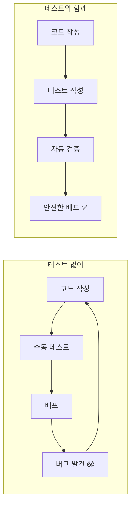
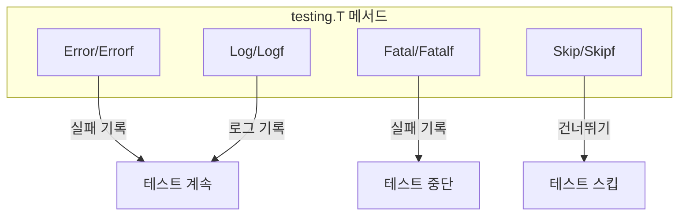
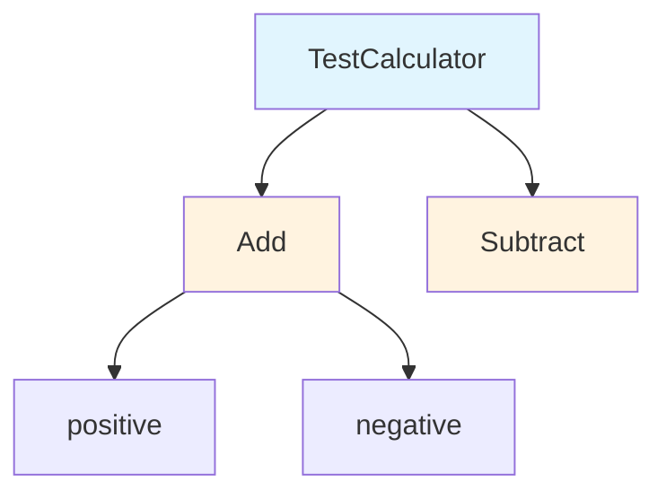
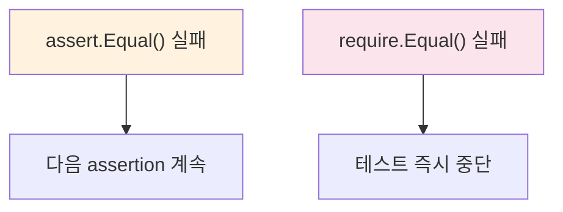
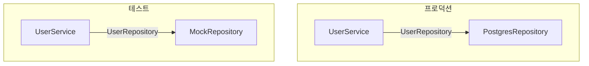
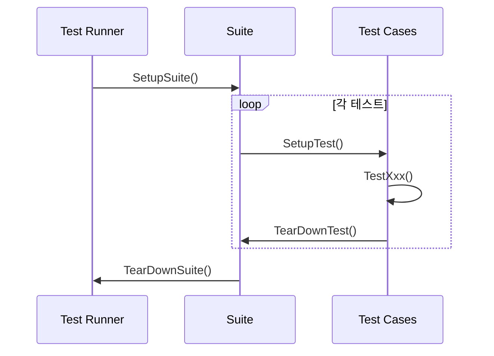
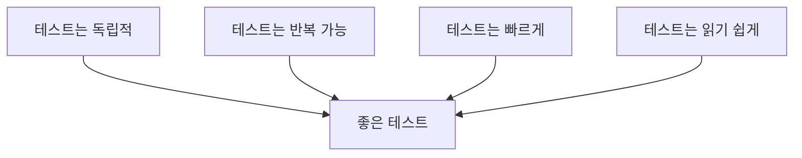

# 04. Testing 패키지 심화

## 학습 목표
Go의 `testing` 패키지를 깊이 이해하고, 단위 테스트, 벤치마크, 커버리지 분석, Mock 패턴을 실무 수준으로 구현한다.

---

## 테스트의 중요성

### 왜 테스트를 작성하는가?



**테스트의 이점**:

| 이점 | 설명 |
|------|------|
| **회귀 방지** | 기존 기능이 새 변경으로 깨지지 않음 |
| **문서화** | 테스트가 사용법을 보여줌 |
| **설계 개선** | 테스트 가능한 코드 = 좋은 설계 |
| **리팩토링 자신감** | 안전하게 코드 개선 가능 |
| **빠른 피드백** | 문제를 즉시 발견 |

---

## testing 패키지 기초

### 테스트 파일 규칙

```
mypackage/
├── calculator.go       # 소스 코드
├── calculator_test.go  # 테스트 코드 (*_test.go)
└── testdata/          # 테스트 데이터 (빌드 제외)
    └── input.json
```

**규칙**:
- 파일명: `*_test.go`
- 패키지: 같은 패키지 또는 `패키지_test` (black-box 테스트)
- 함수명: `TestXxx` (대문자로 시작)

### 기본 테스트 구조

```go
package calculator

import "testing"

// 테스트 함수는 반드시 *testing.T를 인자로 받음
func TestAdd(t *testing.T) {
    result := Add(2, 3)

    if result != 5 {
        t.Errorf("Add(2, 3) = %d; want 5", result)
    }
}
```

### testing.T 주요 메서드

```go
func TestExample(t *testing.T) {
    // 실패 로그 (테스트 계속 진행)
    t.Error("에러 메시지")
    t.Errorf("포맷: %d", value)

    // 실패 로그 (테스트 즉시 중단)
    t.Fatal("치명적 에러")
    t.Fatalf("포맷: %d", value)

    // 일반 로그 (-v 옵션에서만 표시)
    t.Log("로그 메시지")
    t.Logf("포맷: %d", value)

    // 테스트 건너뛰기
    t.Skip("이 테스트는 건너뜁니다")
    t.Skipf("이유: %s", reason)

    // 헬퍼 함수 표시
    t.Helper()

    // 병렬 실행 허용
    t.Parallel()

    // 테스트 실패 표시 (로그 없이)
    t.Fail()      // 계속 진행
    t.FailNow()   // 즉시 중단
}
```



### 테스트 실행

```bash
# 현재 디렉토리 테스트
go test

# 모든 하위 패키지 테스트
go test ./...

# 상세 출력
go test -v

# 특정 테스트만 실행 (정규식)
go test -v -run TestAdd
go test -v -run "Test.*Calculator"

# 특정 패키지
go test -v ./unit/

# 짧은 모드 (긴 테스트 건너뛰기)
go test -short

# 캐시 무시
go test -count=1 ./...
```

---

## Table-Driven Tests

### 기본 패턴

Go에서 **가장 권장하는 테스트 패턴**입니다.

```go
func TestAdd(t *testing.T) {
    // 테스트 케이스 정의
    tests := []struct {
        name     string  // 테스트 케이스 이름
        a, b     int     // 입력
        expected int     // 기대값
    }{
        {"positive numbers", 2, 3, 5},
        {"negative numbers", -1, -2, -3},
        {"zero", 0, 0, 0},
        {"mixed", -5, 10, 5},
    }

    // 테스트 실행
    for _, tt := range tests {
        t.Run(tt.name, func(t *testing.T) {
            result := Add(tt.a, tt.b)
            if result != tt.expected {
                t.Errorf("Add(%d, %d) = %d; want %d",
                    tt.a, tt.b, result, tt.expected)
            }
        })
    }
}
```

**장점**:
- 새 테스트 케이스 추가가 쉬움
- 코드 중복 감소
- 테스트 케이스가 명확하게 보임
- 각 케이스가 독립적으로 실행

### 에러 케이스 포함

```go
func TestDivide(t *testing.T) {
    tests := []struct {
        name        string
        a, b        int
        expected    int
        expectError bool  // 에러 예상 여부
    }{
        {"normal division", 10, 2, 5, false},
        {"divide by zero", 10, 0, 0, true},
        {"negative result", -10, 2, -5, false},
    }

    for _, tt := range tests {
        t.Run(tt.name, func(t *testing.T) {
            result, err := Divide(tt.a, tt.b)

            // 에러 검증
            if tt.expectError {
                if err == nil {
                    t.Error("expected error but got nil")
                }
                return
            }

            // 정상 케이스 검증
            if err != nil {
                t.Errorf("unexpected error: %v", err)
                return
            }

            if result != tt.expected {
                t.Errorf("Divide(%d, %d) = %d; want %d",
                    tt.a, tt.b, result, tt.expected)
            }
        })
    }
}
```

### map 기반 테스트 테이블

```go
func TestAdd(t *testing.T) {
    // map을 사용하면 이름이 키가 됨
    tests := map[string]struct {
        a, b     int
        expected int
    }{
        "positive numbers": {2, 3, 5},
        "negative numbers": {-1, -2, -3},
        "zero":            {0, 0, 0},
    }

    for name, tt := range tests {
        t.Run(name, func(t *testing.T) {
            result := Add(tt.a, tt.b)
            if result != tt.expected {
                t.Errorf("got %d; want %d", result, tt.expected)
            }
        })
    }
}
```

**주의**: map 순서는 무작위이므로 순서 의존성이 없어야 함

---

## Sub-tests와 t.Run

### 기본 사용법

```go
func TestCalculator(t *testing.T) {
    // 서브테스트 그룹화
    t.Run("Add", func(t *testing.T) {
        t.Run("positive", func(t *testing.T) {
            // ...
        })
        t.Run("negative", func(t *testing.T) {
            // ...
        })
    })

    t.Run("Subtract", func(t *testing.T) {
        // ...
    })
}
```



### 특정 서브테스트만 실행

```bash
# TestCalculator의 Add 서브테스트만
go test -v -run "TestCalculator/Add"

# Add의 positive만
go test -v -run "TestCalculator/Add/positive"

# 정규식 사용
go test -v -run "TestCalculator/.*negative"
```

### 병렬 서브테스트

```go
func TestParallel(t *testing.T) {
    tests := []struct {
        name string
        // ...
    }{
        {"test1"},
        {"test2"},
        {"test3"},
    }

    for _, tt := range tests {
        tt := tt  // 중요: 루프 변수 캡처
        t.Run(tt.name, func(t *testing.T) {
            t.Parallel()  // 병렬 실행 허용
            // 테스트 로직
        })
    }
}
```

**주의**: `tt := tt`는 클로저가 올바른 값을 참조하도록 함

---

## testify 라이브러리

### 설치

```bash
go get github.com/stretchr/testify
```

### assert vs require

```go
import (
    "testing"
    "github.com/stretchr/testify/assert"
    "github.com/stretchr/testify/require"
)

func TestExample(t *testing.T) {
    // assert: 실패해도 테스트 계속 진행
    assert.Equal(t, 5, Add(2, 3))
    assert.NotNil(t, obj)
    assert.True(t, condition)

    // require: 실패하면 테스트 즉시 중단
    require.NoError(t, err)
    require.NotEmpty(t, slice)
}
```



**선택 기준**:

| 상황 | 선택 |
|------|------|
| 전제 조건 검증 (nil 체크 등) | `require` |
| 에러 체크 | `require.NoError` |
| 여러 값을 한 번에 검증 | `assert` |
| 이후 검증이 의미 없는 경우 | `require` |

### 주요 assertion 함수

```go
// 동등성
assert.Equal(t, expected, actual)
assert.NotEqual(t, expected, actual)
assert.EqualValues(t, expected, actual)  // 타입 변환 허용

// nil 체크
assert.Nil(t, obj)
assert.NotNil(t, obj)

// 불리언
assert.True(t, condition)
assert.False(t, condition)

// 에러
assert.Error(t, err)
assert.NoError(t, err)
assert.ErrorIs(t, err, targetErr)
assert.ErrorContains(t, err, "substring")

// 컬렉션
assert.Len(t, slice, 3)
assert.Empty(t, slice)
assert.NotEmpty(t, slice)
assert.Contains(t, slice, element)
assert.ElementsMatch(t, expected, actual)  // 순서 무관

// 문자열
assert.Contains(t, str, "substring")
assert.Regexp(t, regexp, str)

// 숫자
assert.Greater(t, 5, 3)
assert.Less(t, 3, 5)
assert.InDelta(t, expected, actual, delta)  // 부동소수점

// 타입
assert.IsType(t, &MyStruct{}, obj)

// 패닉
assert.Panics(t, func() { panicFunc() })
assert.NotPanics(t, func() { safeFunc() })
```

### 커스텀 메시지

```go
// 실패 시 추가 정보 제공
assert.Equal(t, expected, actual, "user ID should match")
assert.Equalf(t, expected, actual, "user %s ID should match", username)
```

---

## Mock 패턴

### 인터페이스 기반 설계

Mock을 사용하려면 **인터페이스 의존성**이 필요합니다.

```go
// 인터페이스 정의
type UserRepository interface {
    FindByID(id string) (*User, error)
    Save(user *User) error
    Delete(id string) error
}

// 서비스는 인터페이스에 의존
type UserService struct {
    repo UserRepository  // 구체 타입이 아닌 인터페이스
}

func NewUserService(repo UserRepository) *UserService {
    return &UserService{repo: repo}
}
```



### testify/mock 사용법

```go
import "github.com/stretchr/testify/mock"

// Mock 구현
type MockUserRepository struct {
    mock.Mock
}

func (m *MockUserRepository) FindByID(id string) (*User, error) {
    args := m.Called(id)

    // 첫 번째 반환값이 nil인 경우 처리
    if args.Get(0) == nil {
        return nil, args.Error(1)
    }
    return args.Get(0).(*User), args.Error(1)
}

func (m *MockUserRepository) Save(user *User) error {
    args := m.Called(user)
    return args.Error(0)
}

func (m *MockUserRepository) Delete(id string) error {
    args := m.Called(id)
    return args.Error(0)
}
```

### Mock 사용 예제

```go
func TestUserService_GetUser(t *testing.T) {
    // 1. Mock 생성
    mockRepo := new(MockUserRepository)

    // 2. 기대 동작 설정
    expectedUser := &User{ID: "123", Name: "John"}
    mockRepo.On("FindByID", "123").Return(expectedUser, nil)

    // 3. 서비스 생성 (Mock 주입)
    service := NewUserService(mockRepo)

    // 4. 테스트 실행
    user, err := service.GetUser("123")

    // 5. 검증
    require.NoError(t, err)
    assert.Equal(t, "John", user.Name)

    // 6. Mock 호출 검증
    mockRepo.AssertExpectations(t)
}
```

### Mock 설정 패턴

```go
// 정확한 인자 매칭
mockRepo.On("FindByID", "user-123").Return(user, nil)

// 어떤 인자든 매칭
mockRepo.On("FindByID", mock.Anything).Return(user, nil)

// 조건부 매칭
mockRepo.On("FindByID", mock.MatchedBy(func(id string) bool {
    return strings.HasPrefix(id, "user-")
})).Return(user, nil)

// 에러 반환
mockRepo.On("FindByID", "unknown").Return(nil, errors.New("not found"))

// 호출 횟수 제한
mockRepo.On("Save", mock.Anything).Return(nil).Once()
mockRepo.On("Save", mock.Anything).Return(nil).Times(3)

// 순차적 반환값
mockRepo.On("FindByID", "123").Return(user1, nil).Once()
mockRepo.On("FindByID", "123").Return(user2, nil).Once()
```

### Mock 검증

```go
// 모든 기대 동작이 호출되었는지
mockRepo.AssertExpectations(t)

// 특정 메서드가 호출되었는지
mockRepo.AssertCalled(t, "FindByID", "123")

// 특정 메서드가 호출되지 않았는지
mockRepo.AssertNotCalled(t, "Delete", mock.Anything)

// 호출 횟수 검증
mockRepo.AssertNumberOfCalls(t, "Save", 2)
```

### 에러 케이스 테스트

```go
func TestUserService_GetUser_NotFound(t *testing.T) {
    mockRepo := new(MockUserRepository)

    // 에러 반환 설정
    mockRepo.On("FindByID", "unknown").
        Return(nil, ErrUserNotFound)

    service := NewUserService(mockRepo)
    user, err := service.GetUser("unknown")

    assert.Nil(t, user)
    assert.ErrorIs(t, err, ErrUserNotFound)
    mockRepo.AssertExpectations(t)
}
```

---

## Test Suite (testify/suite)

### 기본 구조

```go
import (
    "testing"
    "github.com/stretchr/testify/suite"
)

// Suite 정의
type CalculatorTestSuite struct {
    suite.Suite
    calc *Calculator  // 공유 리소스
}

// 전체 Suite 시작 전 1회 실행
func (s *CalculatorTestSuite) SetupSuite() {
    fmt.Println("Suite 시작")
}

// 전체 Suite 종료 후 1회 실행
func (s *CalculatorTestSuite) TearDownSuite() {
    fmt.Println("Suite 종료")
}

// 각 테스트 전 실행
func (s *CalculatorTestSuite) SetupTest() {
    s.calc = NewCalculator()
}

// 각 테스트 후 실행
func (s *CalculatorTestSuite) TearDownTest() {
    s.calc = nil
}

// 테스트 메서드 (Test로 시작)
func (s *CalculatorTestSuite) TestAdd() {
    result := s.calc.Add(2, 3)
    s.Equal(5, result)  // Suite 내장 assertion
}

func (s *CalculatorTestSuite) TestSubtract() {
    result := s.calc.Subtract(5, 3)
    s.Equal(2, result)
}

// Suite 실행
func TestCalculatorSuite(t *testing.T) {
    suite.Run(t, new(CalculatorTestSuite))
}
```

### 라이프사이클



### Suite 내장 assertion

```go
func (s *CalculatorTestSuite) TestExample() {
    // s.Suite에 내장된 assertion 메서드
    s.Equal(expected, actual)
    s.NotNil(obj)
    s.NoError(err)
    s.True(condition)

    // require 버전 (Require() 호출)
    s.Require().NoError(err)
    s.Require().NotNil(obj)
}
```

---

## httptest 패키지

### HTTP 핸들러 테스트

```go
import (
    "net/http"
    "net/http/httptest"
    "testing"
)

func TestHealthHandler(t *testing.T) {
    // 1. 요청 생성
    req := httptest.NewRequest("GET", "/health", nil)

    // 2. ResponseRecorder 생성
    rec := httptest.NewRecorder()

    // 3. 핸들러 호출
    HealthHandler(rec, req)

    // 4. 응답 검증
    assert.Equal(t, http.StatusOK, rec.Code)
    assert.Contains(t, rec.Body.String(), "healthy")
    assert.Equal(t, "application/json", rec.Header().Get("Content-Type"))
}
```

### JSON 요청/응답 테스트

```go
func TestCreateUser(t *testing.T) {
    // JSON 요청 본문
    body := `{"name": "John", "email": "john@example.com"}`
    req := httptest.NewRequest("POST", "/users",
        strings.NewReader(body))
    req.Header.Set("Content-Type", "application/json")

    rec := httptest.NewRecorder()
    CreateUserHandler(rec, req)

    // 응답 검증
    assert.Equal(t, http.StatusCreated, rec.Code)

    // JSON 응답 파싱
    var user User
    err := json.Unmarshal(rec.Body.Bytes(), &user)
    require.NoError(t, err)
    assert.Equal(t, "John", user.Name)
}
```

### 테스트 서버 (클라이언트 테스트용)

```go
func TestAPIClient(t *testing.T) {
    // 테스트 서버 생성
    server := httptest.NewServer(http.HandlerFunc(
        func(w http.ResponseWriter, r *http.Request) {
            // 요청 검증
            assert.Equal(t, "/api/users/123", r.URL.Path)
            assert.Equal(t, "GET", r.Method)

            // 응답 설정
            w.Header().Set("Content-Type", "application/json")
            w.WriteHeader(http.StatusOK)
            w.Write([]byte(`{"id": "123", "name": "John"}`))
        },
    ))
    defer server.Close()

    // 클라이언트 테스트
    client := NewAPIClient(server.URL)
    user, err := client.GetUser("123")

    require.NoError(t, err)
    assert.Equal(t, "123", user.ID)
    assert.Equal(t, "John", user.Name)
}
```

### TLS 테스트 서버

```go
func TestSecureClient(t *testing.T) {
    // HTTPS 테스트 서버
    server := httptest.NewTLSServer(http.HandlerFunc(
        func(w http.ResponseWriter, r *http.Request) {
            w.WriteHeader(http.StatusOK)
        },
    ))
    defer server.Close()

    // TLS 클라이언트 사용
    client := server.Client()  // 테스트용 인증서가 설정된 클라이언트
    resp, err := client.Get(server.URL)
    require.NoError(t, err)
    assert.Equal(t, http.StatusOK, resp.StatusCode)
}
```

---

## 벤치마크 테스트

### 기본 구조

```go
func BenchmarkAdd(b *testing.B) {
    // b.N은 Go가 자동 조정
    for i := 0; i < b.N; i++ {
        Add(2, 3)
    }
}
```

### 실행

```bash
# 벤치마크 실행
go test -bench=.

# 특정 벤치마크만
go test -bench=BenchmarkAdd

# 메모리 할당 통계
go test -bench=. -benchmem

# 벤치마크 시간 조정
go test -bench=. -benchtime=5s

# 횟수 지정
go test -bench=. -benchtime=10000x

# CPU 프로파일
go test -bench=. -cpuprofile=cpu.out
```

### 출력 해석

```
BenchmarkAdd-8       1000000000    0.284 ns/op    0 B/op    0 allocs/op
         │              │              │           │            │
         │              │              │           │            └─ 할당 횟수
         │              │              │           └─ 할당 바이트
         │              │              └─ 연산당 시간
         │              └─ 실행 횟수
         └─ GOMAXPROCS (CPU 코어)
```

### testing.B 메서드

#### b.ResetTimer()

셋업 시간을 측정에서 제외합니다.

```go
func BenchmarkProcess(b *testing.B) {
    // 셋업 (측정에서 제외)
    data := loadLargeData()

    b.ResetTimer()  // 타이머 리셋

    for i := 0; i < b.N; i++ {
        Process(data)
    }
}
```

#### b.ReportAllocs()

메모리 할당을 보고합니다.

```go
func BenchmarkAllocations(b *testing.B) {
    b.ReportAllocs()

    for i := 0; i < b.N; i++ {
        _ = make([]byte, 1024)
    }
}
```

#### b.StopTimer() / b.StartTimer()

측정을 일시 중지/재개합니다.

```go
func BenchmarkWithPause(b *testing.B) {
    for i := 0; i < b.N; i++ {
        b.StopTimer()
        data := prepareData()  // 준비 시간 제외
        b.StartTimer()

        Process(data)
    }
}
```

### 서브 벤치마크

```go
func BenchmarkSort(b *testing.B) {
    sizes := []int{10, 100, 1000, 10000}

    for _, size := range sizes {
        b.Run(fmt.Sprintf("size-%d", size), func(b *testing.B) {
            data := generateData(size)
            b.ResetTimer()

            for i := 0; i < b.N; i++ {
                Sort(data)
            }
        })
    }
}
```

### 병렬 벤치마크

```go
func BenchmarkConcurrent(b *testing.B) {
    b.RunParallel(func(pb *testing.PB) {
        for pb.Next() {
            DoSomething()
        }
    })
}
```

### 벤치마크 비교 (benchstat)

```bash
# 설치
go install golang.org/x/perf/cmd/benchstat@latest

# 기준 측정
go test -bench=. -count=10 > old.txt

# 코드 수정 후
go test -bench=. -count=10 > new.txt

# 비교
benchstat old.txt new.txt
```

---

## 커버리지 분석

### 기본 커버리지

```bash
# 커버리지 측정
go test -cover ./...

# 결과 예시
ok      mypackage    0.015s    coverage: 78.5% of statements
```

### 커버리지 리포트

```bash
# 프로파일 생성
go test -coverprofile=coverage.out ./...

# 함수별 커버리지
go tool cover -func=coverage.out

# HTML 리포트 (시각화)
go tool cover -html=coverage.out -o coverage.html
```

### 커버리지 모드

```bash
# set: 실행 여부만 (기본값)
go test -covermode=set -coverprofile=coverage.out

# count: 실행 횟수
go test -covermode=count -coverprofile=coverage.out

# atomic: count + 동시성 안전
go test -covermode=atomic -coverprofile=coverage.out
```

### 커버리지 목표

| 수준 | 커버리지 | 설명 |
|------|----------|------|
| 최소 | 60% | 핵심 경로만 |
| 권장 | 80% | 대부분의 분기 |
| 높음 | 90%+ | 에지 케이스 포함 |

**주의**: 100% 커버리지 ≠ 버그 없음

```go
// 100% 커버리지지만 버그 있음
func Add(a, b int) int {
    return a - b  // 버그!
}

func TestAdd(t *testing.T) {
    Add(1, 1)  // 100% 커버리지, 하지만 검증 없음!
}
```

---

## 테스트 헬퍼

### t.Helper()

에러 위치를 명확하게 합니다.

```go
// t.Helper() 없이
func assertEqual(t *testing.T, got, want int) {
    if got != want {
        t.Errorf("got %d, want %d", got, want)
        // 에러 위치: 이 라인 (헬퍼 함수 내부)
    }
}

// t.Helper() 있으면
func assertEqual(t *testing.T, got, want int) {
    t.Helper()  // "이건 헬퍼 함수야"
    if got != want {
        t.Errorf("got %d, want %d", got, want)
        // 에러 위치: assertEqual을 호출한 라인
    }
}
```

### t.Cleanup()

테스트 종료 시 정리 작업을 등록합니다.

```go
func TestWithCleanup(t *testing.T) {
    tmpFile, err := os.CreateTemp("", "test")
    require.NoError(t, err)

    t.Cleanup(func() {
        os.Remove(tmpFile.Name())  // 테스트 끝나면 자동 삭제
    })

    // 테스트 로직...
}
```

### t.TempDir()

자동 정리되는 임시 디렉토리를 생성합니다.

```go
func TestWithTempDir(t *testing.T) {
    dir := t.TempDir()  // 테스트 후 자동 삭제

    path := filepath.Join(dir, "test.txt")
    os.WriteFile(path, []byte("hello"), 0644)

    // 테스트 로직...
}
```

### testdata 디렉토리

```
mypackage/
├── calc.go
├── calc_test.go
└── testdata/          # 자동으로 빌드에서 제외
    ├── input.json
    ├── expected.json
    └── golden/
        └── output.txt
```

```go
func TestProcess(t *testing.T) {
    input, err := os.ReadFile("testdata/input.json")
    require.NoError(t, err)

    result := Process(input)

    expected, _ := os.ReadFile("testdata/expected.json")
    assert.Equal(t, expected, result)
}
```

---

## Golden File 패턴

예상 출력을 파일로 저장하고 비교합니다.

```go
var update = flag.Bool("update", false, "update golden files")

func TestGolden(t *testing.T) {
    result := GenerateOutput()
    goldenFile := "testdata/golden/output.txt"

    if *update {
        // 골든 파일 업데이트
        err := os.WriteFile(goldenFile, result, 0644)
        require.NoError(t, err)
        return
    }

    expected, err := os.ReadFile(goldenFile)
    require.NoError(t, err)
    assert.Equal(t, string(expected), string(result))
}
```

```bash
# 골든 파일 업데이트
go test -update ./...
```

---

## 테스트 건너뛰기

### 조건부 스킵

```go
func TestIntegration(t *testing.T) {
    // 짧은 모드에서 건너뛰기
    if testing.Short() {
        t.Skip("skipping integration test in short mode")
    }
    // ...
}

func TestWithDB(t *testing.T) {
    // 환경 변수 없으면 건너뛰기
    if os.Getenv("DATABASE_URL") == "" {
        t.Skip("DATABASE_URL not set")
    }
    // ...
}

func TestLinuxOnly(t *testing.T) {
    // 특정 OS에서만 실행
    if runtime.GOOS != "linux" {
        t.Skip("linux only test")
    }
    // ...
}
```

### 빌드 태그

```go
//go:build integration

package mypackage

func TestIntegration(t *testing.T) {
    // 통합 테스트
}
```

```bash
# 일반 테스트만
go test ./...

# 통합 테스트 포함
go test -tags=integration ./...
```

---

## 실무 패턴

### 패턴 1: 테스트 픽스처

```go
type testFixture struct {
    t        *testing.T
    db       *sql.DB
    service  *UserService
    mockRepo *MockUserRepository
}

func newTestFixture(t *testing.T) *testFixture {
    t.Helper()

    mockRepo := new(MockUserRepository)
    service := NewUserService(mockRepo)

    return &testFixture{
        t:        t,
        mockRepo: mockRepo,
        service:  service,
    }
}

func (f *testFixture) cleanup() {
    // 정리 로직
}

func TestUserService(t *testing.T) {
    f := newTestFixture(t)
    defer f.cleanup()

    f.mockRepo.On("FindByID", "123").Return(&User{ID: "123"}, nil)

    user, err := f.service.GetUser("123")
    require.NoError(t, err)
    assert.Equal(t, "123", user.ID)
}
```

### 패턴 2: 테스트 빌더

```go
type UserBuilder struct {
    user User
}

func NewUserBuilder() *UserBuilder {
    return &UserBuilder{
        user: User{
            ID:    "default-id",
            Name:  "Default Name",
            Email: "default@example.com",
        },
    }
}

func (b *UserBuilder) WithID(id string) *UserBuilder {
    b.user.ID = id
    return b
}

func (b *UserBuilder) WithName(name string) *UserBuilder {
    b.user.Name = name
    return b
}

func (b *UserBuilder) Build() *User {
    return &b.user
}

// 사용
func TestWithBuilder(t *testing.T) {
    user := NewUserBuilder().
        WithID("123").
        WithName("John").
        Build()

    assert.Equal(t, "123", user.ID)
}
```

### 패턴 3: 에러 주입 테스트

```go
func TestServiceWithErrors(t *testing.T) {
    tests := []struct {
        name        string
        setupMock   func(*MockRepository)
        expectError error
    }{
        {
            name: "repository error",
            setupMock: func(m *MockRepository) {
                m.On("FindByID", mock.Anything).
                    Return(nil, errors.New("db error"))
            },
            expectError: ErrInternalError,
        },
        {
            name: "not found",
            setupMock: func(m *MockRepository) {
                m.On("FindByID", mock.Anything).
                    Return(nil, ErrNotFound)
            },
            expectError: ErrNotFound,
        },
    }

    for _, tt := range tests {
        t.Run(tt.name, func(t *testing.T) {
            mockRepo := new(MockRepository)
            tt.setupMock(mockRepo)

            service := NewService(mockRepo)
            _, err := service.Get("123")

            assert.ErrorIs(t, err, tt.expectError)
        })
    }
}
```

### 패턴 4: 타임아웃 테스트

```go
func TestWithTimeout(t *testing.T) {
    ctx, cancel := context.WithTimeout(context.Background(), 5*time.Second)
    defer cancel()

    done := make(chan struct{})

    go func() {
        // 테스트할 작업
        doSomething()
        close(done)
    }()

    select {
    case <-done:
        // 성공
    case <-ctx.Done():
        t.Fatal("test timed out")
    }
}
```

---

## 테스트 실행 팁

### 자주 사용하는 명령어

```bash
# 기본
go test ./...              # 모든 테스트
go test -v ./...           # 상세 출력
go test -v -run TestAdd    # 특정 테스트

# 디버깅
go test -v -count=1        # 캐시 무시
go test -v -failfast       # 첫 실패에서 중단

# 성능
go test -race ./...        # 레이스 감지
go test -bench=. ./...     # 벤치마크
go test -bench=. -benchmem # 메모리 프로파일

# 커버리지
go test -cover ./...
go test -coverprofile=c.out && go tool cover -html=c.out

# 병렬 제어
go test -parallel 4        # 최대 4개 병렬
```

### CI/CD 통합

```yaml
# GitHub Actions 예시
- name: Run tests
  run: |
    go test -v -race -coverprofile=coverage.out ./...

- name: Upload coverage
  uses: codecov/codecov-action@v3
  with:
    files: coverage.out
```

---

## 정리

### 테스트 유형

| 유형 | 파일명 패턴 | 목적 |
|------|------------|------|
| 단위 테스트 | `*_test.go` | 개별 함수/메서드 |
| 벤치마크 | `*_test.go` (`Benchmark*`) | 성능 측정 |
| 통합 테스트 | `*_integration_test.go` | 시스템 통합 |

### testing.T vs testing.B

| | `testing.T` | `testing.B` |
|--|-------------|-------------|
| 목적 | 기능 테스트 | 성능 측정 |
| 함수명 | `TestXxx` | `BenchmarkXxx` |
| 루프 | 1회 | `b.N`회 |
| 실행 | `go test` | `go test -bench=.` |

### testify 선택 가이드

| 상황 | 선택 |
|------|------|
| 전제 조건 검증 | `require` |
| 다중 assertion | `assert` |
| 외부 의존성 대체 | `mock` |
| 공유 셋업/정리 | `suite` |

### 핵심 규칙



| 규칙 | 설명 |
|------|------|
| 독립성 | 테스트 간 의존성 없음 |
| 반복성 | 같은 결과 보장 |
| 속도 | 단위 테스트는 빠르게 |
| 가독성 | 실패 시 원인 명확 |

---

## 실습 과제

### 과제 1: Table-Driven Tests
Calculator의 모든 메서드에 대해 Table-Driven Tests를 작성하세요.

### 과제 2: Mock 테스트
UserService의 CreateOrder 메서드를 Mock을 사용해 테스트하세요.

### 과제 3: HTTP 테스트
UserHandler의 GetUser, CreateUser를 httptest로 테스트하세요.

### 과제 4: 벤치마크 비교
Factorial의 반복/재귀 구현을 벤치마크로 비교하세요.

### 과제 5: 커버리지 80%
unit 패키지의 테스트 커버리지를 80% 이상 달성하세요.

---

## 참고 자료

- [Go Package - testing](https://pkg.go.dev/testing)
- [stretchr/testify](https://github.com/stretchr/testify)
- [Learn Go with Tests](https://quii.gitbook.io/learn-go-with-tests/)
- [Go Blog - Using Subtests and Sub-benchmarks](https://go.dev/blog/subtests)
- [Go Wiki - Table Driven Tests](https://go.dev/wiki/TableDrivenTests)
