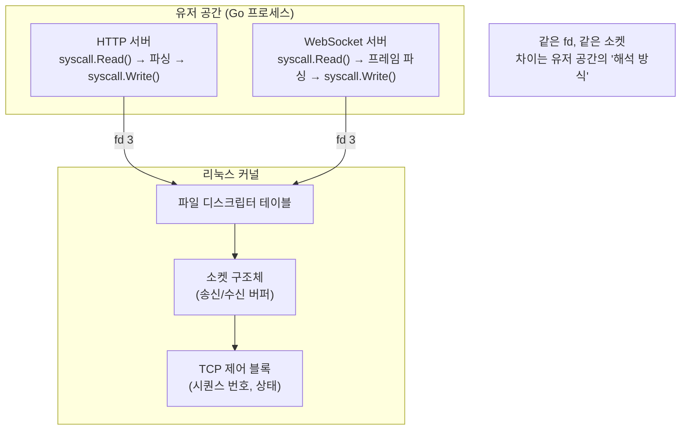
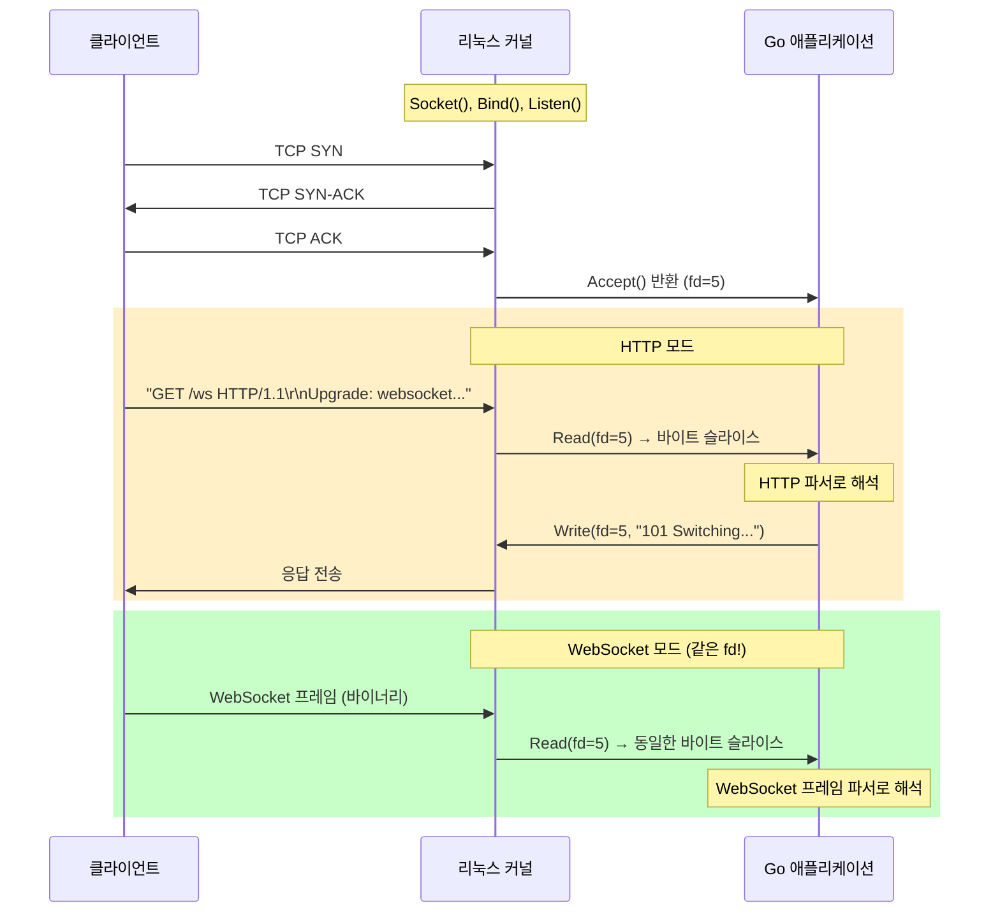
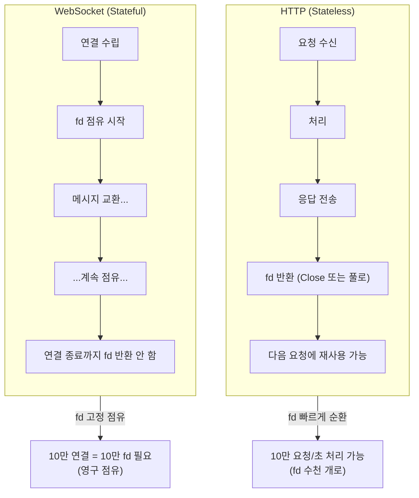
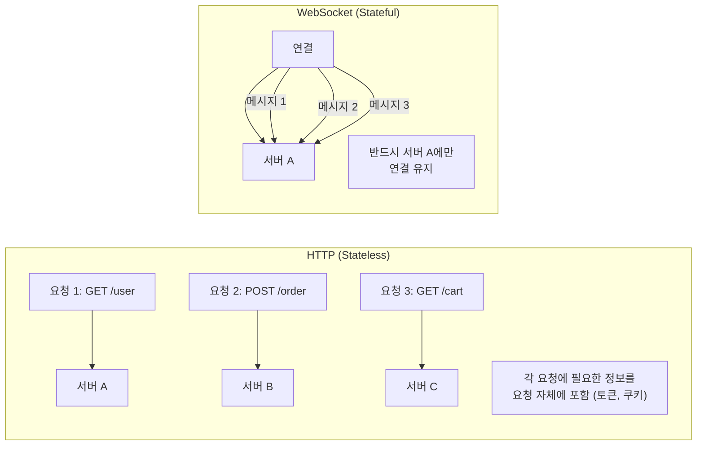
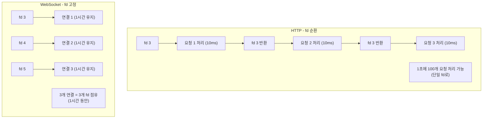
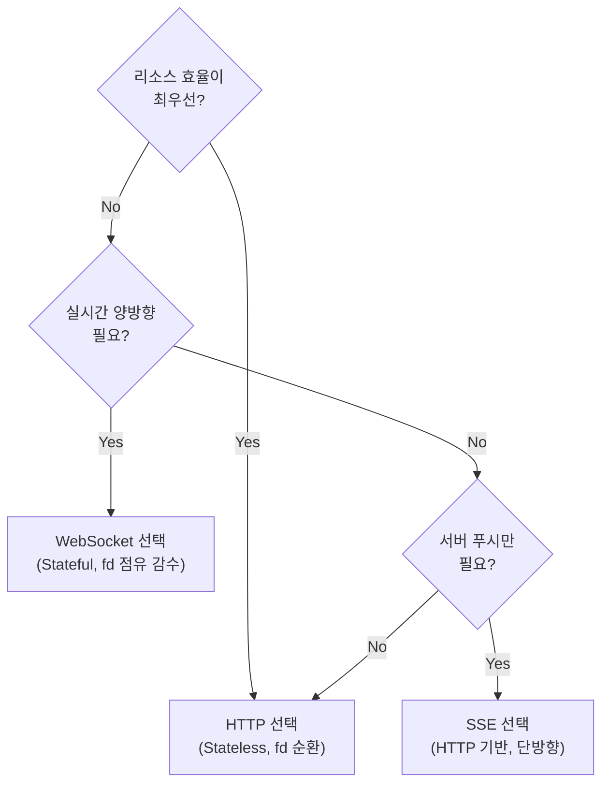

# Step 4: HTTP vs WebSocket - 소켓 레벨 심층 분석

## 학습 목표

HTTP와 WebSocket이 리눅스 커널 레벨에서 어떻게 동작하는지 이해하고, **동일한 TCP 소켓인데 왜 HTTP가 대규모 환경에서 더 효율적인지** 설명할 수 있다.

---

## 핵심 질문

> **둘 다 같은 TCP 소켓인데, 왜 HTTP가 대규모 환경에서 더 효율적인가?**

---

## 1. 리눅스 소켓 시스템 콜 흐름

**HTTP와 WebSocket 모두 동일한 시스템 콜로 시작합니다:**

```go
// Go에서 syscall 패키지로 직접 소켓 생성
package main

import (
    "syscall"
    "fmt"
)

func main() {
    // 서버 초기화 (HTTP, WebSocket 모두 동일)
    serverFd, _ := syscall.Socket(
        syscall.AF_INET,      // IPv4
        syscall.SOCK_STREAM,  // TCP
        0,
    )

    addr := syscall.SockaddrInet4{Port: 8080}
    copy(addr.Addr[:], []byte{0, 0, 0, 0})

    syscall.Bind(serverFd, &addr)   // 포트 바인딩
    syscall.Listen(serverFd, 128)   // 연결 대기

    // 클라이언트 연결 수락 (HTTP, WebSocket 모두 동일)
    clientFd, _, _ := syscall.Accept(serverFd)  // 새 연결 → 새 fd

    fmt.Printf("서버 fd: %d, 클라이언트 fd: %d\n", serverFd, clientFd)
}
```

**여기서 `clientFd`는 파일 디스크립터(fd)입니다.** 리눅스에서 소켓도 파일처럼 취급됩니다.



---

## 2. 핸드셰이크 시점의 프로토콜 전환

**HTTP → WebSocket 업그레이드는 커널이 아닌 유저 공간에서 일어납니다:**



**핵심: 커널은 HTTP인지 WebSocket인지 모릅니다.** 그냥 바이트 스트림을 전달할 뿐입니다.

```go
// 커널 관점: HTTP든 WebSocket이든 똑같음
buf := make([]byte, 4096)
n, _ := syscall.Read(clientFd, buf)  // 바이트 읽기
syscall.Write(clientFd, response)     // 바이트 쓰기

// 유저 공간에서 달라지는 것
if isHTTPMode {
    parseHTTPRequest(buf[:n])      // HTTP 파서
} else {
    parseWebSocketFrame(buf[:n])   // WebSocket 프레임 파서
}
```

---

## 3. HTTP가 스케일링에 효율적인 진짜 이유: 무상태성(Stateless)

**같은 소켓인데 왜 HTTP가 대규모 환경에서 유리한가?** 핵심은 **fd의 수명**입니다.



---

## 4. 무상태성(Stateless) 상세 설명

### 무상태성이란?

**서버가 이전 요청의 정보를 기억하지 않는다는 의미입니다.** 각 HTTP 요청은 완전히 독립적이며, 서버는 "이 클라이언트가 누구인지, 이전에 뭘 했는지" 알 필요가 없습니다.



### 무상태성이 스케일링에 유리한 이유

| 특성 | HTTP (Stateless) | WebSocket (Stateful) |
|------|------------------|---------------------|
| **서버 선택** | 아무 서버나 OK | 특정 서버에 고정 |
| **서버 추가** | 즉시 트래픽 분산 | 기존 연결 재분배 필요 |
| **서버 장애** | 다음 요청은 다른 서버로 | 연결 끊김, 재연결 필요 |
| **로드밸런싱** | 단순 라운드로빈 | Sticky Session 필요 |
| **리소스 해제** | 요청 처리 후 즉시 | 연결 종료 시까지 불가 |

### Go 코드로 보는 fd 수명 차이

```go
// HTTP: 요청 처리 후 리소스 순환
func handleHTTP(clientFd int) {
    buf := make([]byte, 4096)
    syscall.Read(clientFd, buf)    // 요청 읽기
    // ... 처리 ...
    syscall.Write(clientFd, response)  // 응답 쓰기

    // Keep-Alive면 연결 풀로 반환, 아니면 close
    if !keepAlive {
        syscall.Close(clientFd)  // fd 해제 → 다른 연결에 재사용 가능
    } else {
        returnToPool(clientFd)   // 풀에서 관리
    }
}

// WebSocket: 연결 종료까지 fd 점유
func handleWebSocket(clientFd int) {
    for connectionAlive {
        buf := make([]byte, 4096)
        // fd는 계속 이 연결에 묶여 있음
        syscall.Read(clientFd, buf)
        // ... 처리 ...
        syscall.Write(clientFd, response)
        // Close하지 않음 - 계속 점유!
    }
    syscall.Close(clientFd)  // 연결 종료 시에만 해제
}
```

---

## 5. 리눅스 리소스 한계와 HTTP의 효율성

### 파일 디스크립터(fd) 제한

```bash
# 프로세스당 fd 제한 확인
$ ulimit -n
1024  # 기본값 (매우 낮음)

# 시스템 전체 fd 제한
$ cat /proc/sys/fs/file-max
9223372036854775807

# Go에서 확인
$ go run -exec 'ulimit -n && ' main.go
```

| 시나리오 | HTTP | WebSocket |
|----------|------|-----------|
| **10만 동시 사용자** | fd 수천 개로 처리 가능<br/>(요청 처리 후 반환) | **10만 fd 필요**<br/>(각 연결이 fd 점유) |
| **fd 부족 시** | 대기 후 처리 | **연결 거부** |
| **메모리** | 요청당 일시적 | 연결당 영구적 |

### HTTP가 적은 fd로 많은 요청을 처리하는 원리



---

## 6. Go 표준 라이브러리와 시스템 콜

**Go의 `net` 패키지는 내부적으로 시스템 콜을 호출합니다:**

```go
// net.Listen() 내부
// → syscall.Socket() + syscall.Bind() + syscall.Listen()

// net.Accept() 내부
// → syscall.Accept() → 새 fd 반환

// conn.Read() 내부
// → syscall.Read(fd, buf)

// conn.Close() 내부
// → syscall.Close(fd)
```

**Go의 netpoll (runtime/netpoll.go):**
- 내부적으로 epoll(Linux) / kqueue(macOS) 사용
- 고루틴이 I/O 대기 시 스케줄러가 다른 고루틴 실행
- 시스템 콜 레벨은 동일하지만 고루틴으로 추상화

```go
// 표준 라이브러리 사용 (추상화)
listener, _ := net.Listen("tcp", ":8080")
conn, _ := listener.Accept()  // 내부에서 syscall.Accept() 호출

// syscall 직접 사용 (로우레벨)
fd, _ := syscall.Socket(syscall.AF_INET, syscall.SOCK_STREAM, 0)
syscall.Accept(fd)  // 동일한 시스템 콜
```

---

## 7. 정리: 언제 무엇을 선택할까?



| 상황 | 선택 | 이유 |
|------|------|------|
| **대규모 API 서버** | HTTP | fd 순환으로 적은 리소스로 대량 처리 |
| **실시간 채팅** | WebSocket | 양방향 필수, fd 점유 감수 |
| **알림 시스템** | SSE | 단방향이면 충분, HTTP 호환 |
| **50만+ 대기열** | HTTP 폴링 | fd 점유 비용 > 폴링 비용 |

---

## 핵심 인사이트

> HTTP와 WebSocket은 리눅스 커널 레벨에서 **완전히 동일한 TCP 소켓**입니다. 차이는 유저 공간에서의 **프로토콜 해석 방식**과 **fd 수명 관리**입니다. HTTP의 무상태성은 fd를 빠르게 순환시켜 적은 리소스로 많은 요청을 처리하게 해주고, WebSocket의 상태 유지는 실시간 양방향 통신을 가능하게 하지만 fd를 영구 점유합니다.

---

## 실습 과제

### 과제 1: fd 수명 비교 실험

```bash
# HTTP 서버와 WebSocket 서버의 fd 사용량 비교
# 터미널 1: HTTP 서버
go run main.go http

# 터미널 2: WebSocket 서버
go run main.go websocket

# 터미널 3: fd 사용량 모니터링
watch -n 1 'ls -la /proc/$(pgrep -f "go run")/fd | wc -l'
```

### 과제 2: strace로 시스템 콜 확인

```bash
# HTTP 요청 처리 시 시스템 콜
strace -e socket,accept,read,write,close go run main.go http

# WebSocket 연결 유지 시 시스템 콜
strace -e socket,accept,read,write,close go run main.go websocket
```

---

## 관련 문서

- [Step 1: 원시 소켓 API](../step1_socket_basic/)
- [Step 2: 블로킹 vs 논블로킹](../step2_blocking_nonblock/)
- [Step 3: epoll 멀티플렉싱](../step3_epoll/)
- [WebSocket POC - 기초](../../../../01-frontend/08-websocket/01-basics/LEARN.md)
- [WebSocket POC - 스케일링 고려사항](../../../../01-frontend/08-websocket/08-scaling-considerations/LEARN.md)
