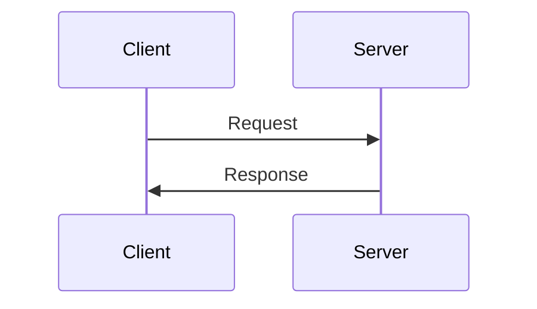
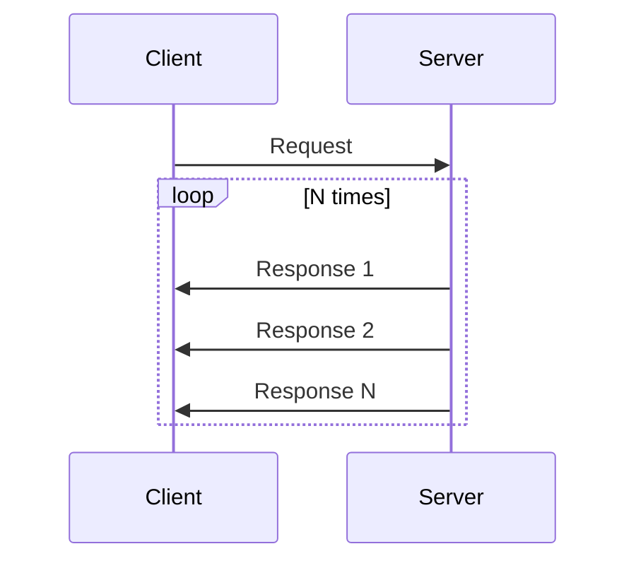
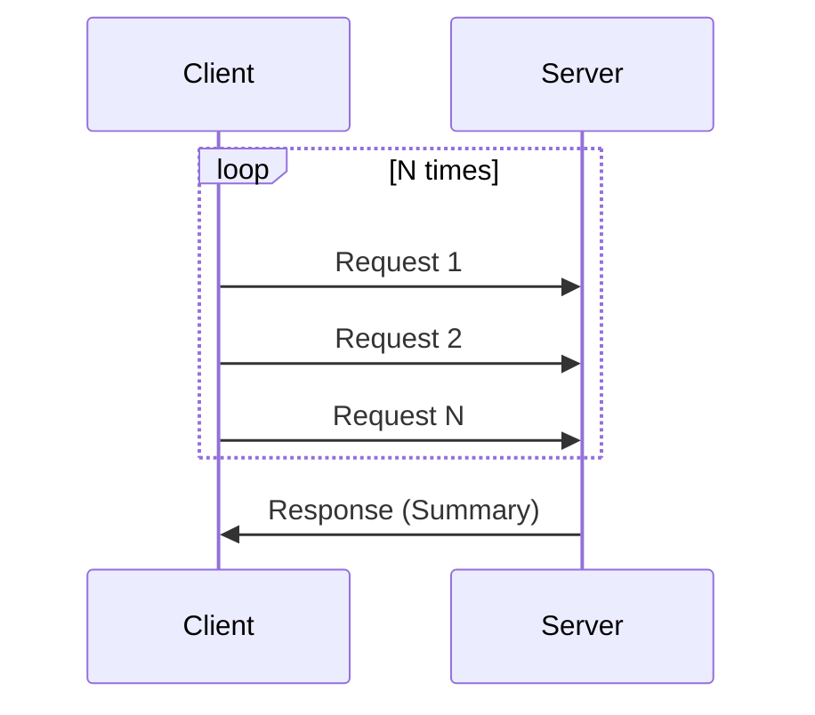
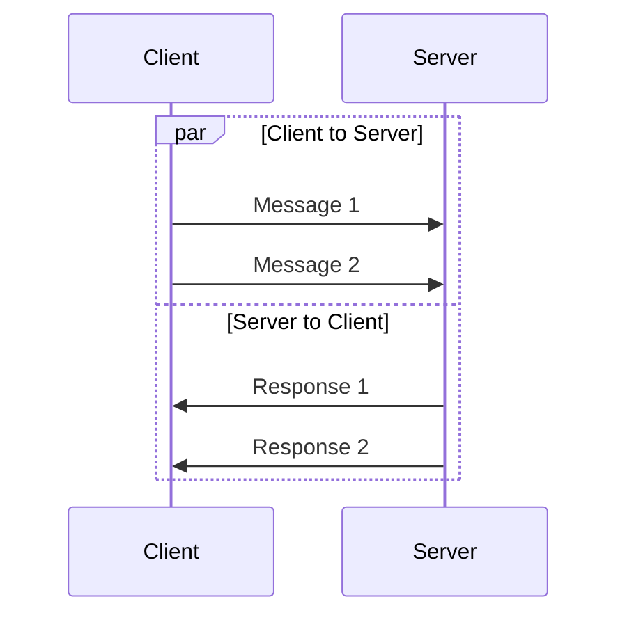

# gRPC 학습 서버 - Spring Boot 테스트용

## 개요

Spring Boot gRPC 클라이언트 테스트를 위한 Go gRPC 서버입니다.
4가지 RPC 패턴과 Interceptor를 학습할 수 있습니다.

**포트**: `50052`

---

## 프로젝트 구조

```
09-spring-test-server/
├── proto/
│   └── learning.proto       # gRPC 서비스 정의
├── pb/                      # 생성된 Go 코드
├── server/
│   └── main.go              # 서버 구현
├── interceptors/
│   └── interceptors.go      # 인터셉터 예제
├── go.mod
└── LEARNED.md
```

---

## 빌드 및 실행

### 1. Proto 컴파일

```bash
cd 09-spring-test-server

# pb 디렉토리 생성
mkdir -p pb

# protoc 실행
protoc --go_out=pb --go_opt=paths=source_relative \
       --go-grpc_out=pb --go-grpc_opt=paths=source_relative \
       proto/learning.proto
```

### 2. 서버 실행

```bash
cd server
go run main.go
```

### 3. grpcurl 테스트

```bash
# 서비스 목록
grpcurl -plaintext localhost:50052 list

# Unary RPC 테스트
grpcurl -plaintext -d '{"name":"홍길동","language":"ko"}' \
  localhost:50052 learning.v1.LearningService/SayHello

# Server Streaming 테스트
grpcurl -plaintext -d '{"start":1,"end":5,"delay_ms":500}' \
  localhost:50052 learning.v1.LearningService/StreamNumbers
```

---

## 4가지 RPC 패턴

### 1. Unary RPC (단순 요청/응답)



**메서드:**
- `SayHello` - 다국어 인사
- `Calculate` - 사칙연산
- `TestError` - 에러 코드 테스트
- `TestDelay` - 타임아웃 테스트

**Spring Boot 예제:**
```java
@GrpcClient("learning-server")
private LearningServiceGrpc.LearningServiceBlockingStub stub;

public String sayHello(String name) {
    HelloRequest request = HelloRequest.newBuilder()
        .setName(name)
        .setLanguage("ko")
        .build();
    HelloResponse response = stub.sayHello(request);
    return response.getMessage();
}
```

---

### 2. Server Streaming (서버 → 클라이언트 스트림)



**메서드:**
- `StreamNumbers` - 숫자 순차 전송
- `StreamLogs` - 실시간 로그 전송
- `DownloadFile` - 파일 청크 전송

**Spring Boot 예제:**
```java
public void streamNumbers(int start, int end) {
    NumberRequest request = NumberRequest.newBuilder()
        .setStart(start)
        .setEnd(end)
        .setDelayMs(100)
        .build();

    Iterator<NumberResponse> responses = stub.streamNumbers(request);
    while (responses.hasNext()) {
        NumberResponse resp = responses.next();
        System.out.printf("Received: %d (%d/%d)%n",
            resp.getValue(), resp.getIndex(), resp.getTotal());
    }
}
```

---

### 3. Client Streaming (클라이언트 → 서버 스트림)



**메서드:**
- `SumNumbers` - 숫자 합계 계산
- `UploadFile` - 파일 청크 업로드

**Spring Boot 예제 (Async Stub 필요):**
```java
public void sumNumbers(List<Double> numbers) {
    StreamObserver<SumResponse> responseObserver = new StreamObserver<>() {
        @Override
        public void onNext(SumResponse response) {
            System.out.printf("Sum=%.2f, Count=%d, Avg=%.2f%n",
                response.getSum(), response.getCount(), response.getAverage());
        }
        @Override
        public void onError(Throwable t) { /* 에러 처리 */ }
        @Override
        public void onCompleted() { /* 완료 */ }
    };

    StreamObserver<NumberValue> requestObserver = asyncStub.sumNumbers(responseObserver);
    for (Double num : numbers) {
        requestObserver.onNext(NumberValue.newBuilder().setValue(num).build());
    }
    requestObserver.onCompleted();
}
```

---

### 4. Bidirectional Streaming (양방향 스트림)



**메서드:**
- `Chat` - 실시간 채팅
- `Echo` - 메시지 에코 (대문자 변환)

**Spring Boot 예제 (Async Stub 필요):**
```java
public void echo(List<String> messages) {
    StreamObserver<EchoResponse> responseObserver = new StreamObserver<>() {
        @Override
        public void onNext(EchoResponse response) {
            System.out.printf("Echo: %s -> %s%n",
                response.getOriginal(), response.getTransformed());
        }
        // ... onError, onCompleted
    };

    StreamObserver<EchoRequest> requestObserver = asyncStub.echo(responseObserver);
    for (String msg : messages) {
        requestObserver.onNext(EchoRequest.newBuilder()
            .setMessage(msg)
            .setRepeat(1)
            .build());
    }
    requestObserver.onCompleted();
}
```

---

## Interceptor 패턴

### Unary Interceptor

```go
func LoggingUnaryInterceptor(
    ctx context.Context,
    req interface{},
    info *grpc.UnaryServerInfo,
    handler grpc.UnaryHandler,
) (interface{}, error) {
    start := time.Now()

    // 전처리
    log.Printf("Request: %s", info.FullMethod)

    // 핸들러 실행
    resp, err := handler(ctx, req)

    // 후처리
    log.Printf("Duration: %v", time.Since(start))

    return resp, err
}
```

### Stream Interceptor

```go
func LoggingStreamInterceptor(
    srv interface{},
    ss grpc.ServerStream,
    info *grpc.StreamServerInfo,
    handler grpc.StreamHandler,
) error {
    // 스트림 래핑으로 메시지 카운트
    wrapped := &loggingServerStream{ServerStream: ss}
    err := handler(srv, wrapped)
    log.Printf("Messages: Sent=%d, Recv=%d", wrapped.sentCount, wrapped.recvCount)
    return err
}
```

---

## gRPC 에러 코드

| 코드 | 설명 | HTTP 매핑 |
|------|------|----------|
| `OK` | 성공 | 200 |
| `CANCELLED` | 클라이언트 취소 | 499 |
| `INVALID_ARGUMENT` | 잘못된 인자 | 400 |
| `NOT_FOUND` | 리소스 없음 | 404 |
| `PERMISSION_DENIED` | 권한 없음 | 403 |
| `UNAUTHENTICATED` | 인증 실패 | 401 |
| `RESOURCE_EXHAUSTED` | 리소스 소진 | 429 |
| `INTERNAL` | 서버 내부 오류 | 500 |
| `UNAVAILABLE` | 서비스 불가 | 503 |
| `DEADLINE_EXCEEDED` | 타임아웃 | 504 |

**테스트:**
```bash
# NOT_FOUND 에러
grpcurl -plaintext -d '{"error_type":"ERROR_TYPE_NOT_FOUND"}' \
  localhost:50052 learning.v1.LearningService/TestError

# DEADLINE_EXCEEDED 테스트 (3초 지연, 1초 타임아웃)
grpcurl -plaintext -max-time 1 -d '{"delay_ms":3000}' \
  localhost:50052 learning.v1.LearningService/TestDelay
```

---

## Metadata (헤더/트레일러)

### 헤더 전송 (클라이언트 → 서버)

```bash
grpcurl -plaintext \
  -H "authorization: Bearer my-token" \
  -H "x-request-id: 123" \
  -d '{"name":"Test"}' \
  localhost:50052 learning.v1.LearningService/SayHello
```

### Spring Boot에서 메타데이터

```java
// 헤더 추가
Metadata headers = new Metadata();
headers.put(Metadata.Key.of("authorization", ASCII_STRING_MARSHALLER), "Bearer token");
headers.put(Metadata.Key.of("x-request-id", ASCII_STRING_MARSHALLER), UUID.randomUUID().toString());

stub = MetadataUtils.attachHeaders(stub, headers);
```

---

## Spring Boot 설정

### application.yml

```yaml
grpc:
  client:
    learning-server:
      address: static://localhost:50052
      negotiation-type: plaintext
```

### build.gradle

```groovy
dependencies {
    implementation 'net.devh:grpc-client-spring-boot-starter:2.15.0.RELEASE'
    implementation 'io.grpc:grpc-protobuf:1.60.1'
    implementation 'io.grpc:grpc-stub:1.60.1'
}
```

---

## 학습 포인트

1. **Unary vs Streaming**: 언제 어떤 패턴을 사용해야 하는가?
2. **Interceptor**: AOP처럼 횡단 관심사 처리
3. **Error Handling**: gRPC 상태 코드와 HTTP 매핑
4. **Metadata**: 인증 토큰, 추적 ID 전달
5. **Deadline/Timeout**: 클라이언트-서버 타임아웃 처리
6. **Context Cancellation**: 요청 취소 처리

---

## 참고 자료

- [gRPC Go Quick Start](https://grpc.io/docs/languages/go/quickstart/)
- [gRPC Java](https://grpc.io/docs/languages/java/)
- [grpc-spring-boot-starter](https://github.com/yidongnan/grpc-spring-boot-starter)
