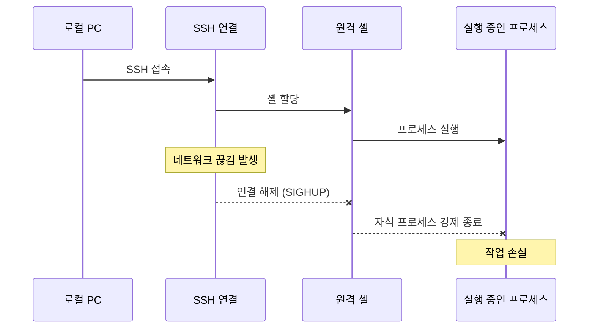
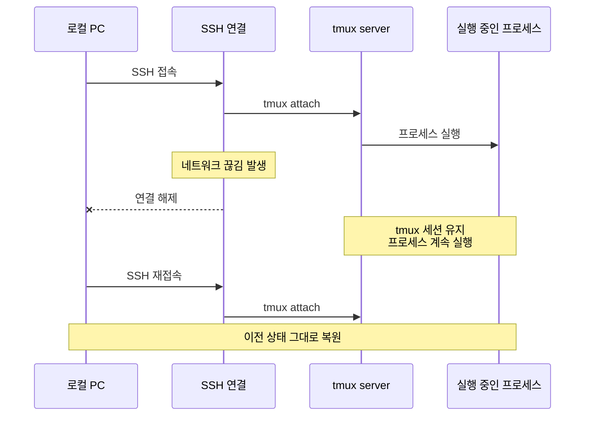
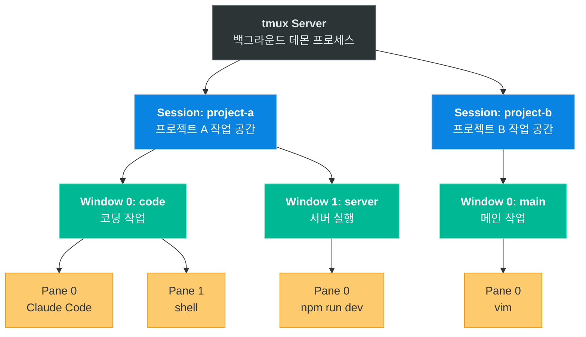
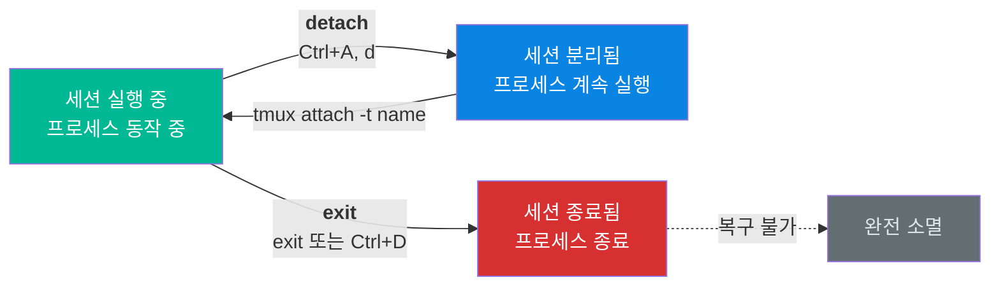

# 01. 핵심 개념 이해

tmux는 터미널 멀티플렉서(Terminal Multiplexer)입니다. 하나의 터미널 안에서 여러 세션을 생성하고, 세션을 분리(detach)한 뒤에도 프로세스가 계속 실행되도록 보장하는 도구입니다. 원격 서버 작업의 안정성과 개발 환경의 생산성을 동시에 높여주는 핵심 DevOps 도구로, 서버 엔지니어와 CLI 중심 개발자에게 필수적인 기술입니다.

---

## 목표

- [ ] tmux가 해결하는 근본적인 문제를 설명할 수 있다
- [ ] Server → Session → Window → Pane 계층 구조를 설명할 수 있다
- [ ] detach와 exit의 차이를 정확히 구분할 수 있다

---

## 1. 왜 tmux가 필요한가?

### 문제: SSH 세션의 구조적 취약성

SSH로 원격 서버에 접속하면, 로컬 터미널과 원격 셸은 하나의 TCP 연결로 묶여 있습니다. 이 연결이 끊어지면 원격 셸에 SIGHUP(Signal Hang Up) 신호가 전달되고, 해당 셸에서 실행 중이던 모든 자식 프로세스가 연쇄적으로 종료됩니다. 이것은 SSH 프로토콜의 설계 자체에 내재된 한계입니다.



이 문제가 실무에서 발생하면 다음과 같은 결과를 초래합니다.

- **실행 중인 프로세스 강제 종료**: 빌드, 배포, 데이터 마이그레이션 등 장시간 작업이 중간에 끊깁니다.
- **작업 히스토리 손실**: 셸 환경 변수, 작업 디렉토리, 명령어 히스토리 등 컨텍스트가 모두 사라집니다.
- **복구 불가능한 중간 상태**: 특히 데이터베이스 마이그레이션이나 배포 스크립트가 중간에 멈추면, 시스템이 불완전한 상태에 놓일 수 있습니다.

### 해결: tmux의 프로세스 분리 아키텍처

tmux는 이 문제를 **프로세스 소유권의 분리**라는 방법으로 해결합니다. tmux server는 SSH 연결과 독립적인 별도의 프로세스로 원격 서버에서 실행됩니다. 사용자의 작업 프로세스는 SSH 셸이 아닌 tmux server의 자식 프로세스로 동작하기 때문에, SSH 연결이 끊어져도 tmux server와 그 하위 프로세스는 영향을 받지 않습니다.



핵심은 **프로세스 트리의 루트가 SSH 셸에서 tmux server로 바뀐다**는 점입니다. SSH는 단지 tmux server에 접속하는 클라이언트 역할만 하므로, 클라이언트가 끊어져도 서버는 계속 동작합니다. 이 구조는 마치 웹 브라우저(클라이언트)를 닫아도 웹 서버가 계속 동작하는 것과 같은 원리입니다.

---

## 2. tmux 계층 구조

tmux는 Server, Session, Window, Pane이라는 네 가지 계층으로 구성됩니다. 각 계층은 명확한 포함 관계를 가지며, 이 구조를 이해하는 것이 tmux를 효과적으로 활용하는 출발점입니다.



### Server: tmux의 심장

tmux server는 `tmux` 명령어를 처음 실행할 때 자동으로 시작되는 백그라운드 데몬 프로세스입니다. 하나의 서버가 여러 세션을 관리하며, 모든 세션과 그 하위 프로세스의 생명주기를 책임집니다. 사용자가 명시적으로 종료(`tmux kill-server`)하거나 시스템이 재부팅되지 않는 한 계속 실행됩니다. 일반적으로 사용자가 server를 직접 다룰 일은 거의 없으며, tmux가 내부적으로 관리합니다.

### Session: 프로젝트 단위의 독립된 작업 공간

Session은 하나의 독립된 작업 컨텍스트입니다. 실무에서는 프로젝트 단위로 세션을 생성하는 것이 일반적입니다. 예를 들어 `project-a` 세션에서는 프론트엔드 개발을, `project-b` 세션에서는 백엔드 API 작업을 진행할 수 있습니다. 각 세션은 서로 완전히 독립되어 있어 환경 변수, 작업 디렉토리, 실행 중인 프로세스가 서로 간섭하지 않습니다. 이러한 격리 특성 덕분에 여러 프로젝트를 동시에 관리하면서도 컨텍스트 전환의 비용을 최소화할 수 있습니다.

### Window: 세션 안의 탭

Window는 하나의 세션 안에서 작업을 논리적으로 분리하는 단위로, 웹 브라우저의 탭과 유사합니다. 하나의 세션 안에 여러 윈도우를 만들 수 있으며, 탭처럼 빠르게 전환할 수 있습니다. 예를 들어 `code` 윈도우에서는 에디터를, `server` 윈도우에서는 개발 서버를 실행하는 식으로 역할을 분리합니다. 한 번에 하나의 윈도우만 화면에 표시되며, 단축키(`Ctrl+A` → `n` 또는 `p`)로 전환합니다.

### Pane: 화면 분할의 최소 단위

Pane은 하나의 윈도우를 물리적으로 분할한 영역이며, 각 Pane은 독립적인 셸 인스턴스를 실행합니다. 하나의 화면에서 코드 에디터와 터미널을 나란히 놓고 작업하거나, 로그를 모니터링하면서 동시에 명령을 실행할 수 있습니다. 수평 분할(`Ctrl+A` → `"`)과 수직 분할(`Ctrl+A` → `%`)을 조합하여 원하는 레이아웃을 구성할 수 있습니다.

### 계층 관계 요약

| 계층 | 비유 | 역할 | 관계 |
|------|------|------|------|
| **Server** | 운영체제 | tmux 데몬 프로세스, 전체 생명주기 관리 | 1개의 Server가 N개의 Session 보유 |
| **Session** | 바탕화면(가상 데스크톱) | 프로젝트별 독립 작업 환경 | 1개의 Session이 N개의 Window 보유 |
| **Window** | 브라우저 탭 | 같은 프로젝트 내 작업 분류 | 1개의 Window가 N개의 Pane 보유 |
| **Pane** | 분할 화면 | 하나의 독립적인 셸 인스턴스 | 최소 실행 단위 |

---

## 3. detach vs exit

tmux를 사용하면서 가장 먼저 체화해야 할 개념이 바로 **detach와 exit의 차이**입니다. 이 두 동작은 겉보기에 모두 "tmux 세션에서 나온다"는 점에서 비슷해 보이지만, 세션의 생존 여부라는 결정적인 차이가 있습니다.



### detach: "세션을 백그라운드에 두고 나오기"

detach는 현재 세션과의 **연결만 끊는 동작**입니다. 세션 자체는 tmux server 안에서 그대로 살아 있으며, 실행 중이던 모든 프로세스도 계속 동작합니다. 나중에 `tmux attach` 명령으로 다시 연결하면 detach 시점의 상태가 그대로 복원됩니다. 화면의 레이아웃, 실행 중인 프로그램, 셸의 작업 디렉토리까지 모두 유지됩니다.

```bash
# 세션 생성 및 진입
tmux new -s work

# 작업 수행 중...
# 빌드 프로세스 실행, 로그 모니터링 등

# detach (Ctrl+A를 누른 뒤 d)
# → 터미널로 돌아옴. 세션은 백그라운드에서 계속 실행.

# 시간이 지난 후 다시 연결
tmux attach -t work
# → 이전 상태가 완벽하게 복원됨
```

detach는 tmux를 사용하는 가장 핵심적인 이유입니다. SSH 연결이 끊어졌을 때 자동으로 detach가 발생하며, 재접속 후 `tmux attach`로 작업을 이어갈 수 있습니다.

### exit: "세션을 완전히 종료하기"

exit는 세션의 마지막 셸을 종료하는 동작이며, 결과적으로 **세션 자체가 소멸**합니다. 세션이 종료되면 그 안에서 실행 중이던 모든 프로세스도 함께 종료되며, 이 동작은 되돌릴 수 없습니다.

```bash
# 세션 생성 및 진입
tmux new -s temp

# 작업 완료 후
exit
# → 세션이 완전히 종료됨. 복구 불가.
```

### 비교 정리

| 항목 | detach | exit |
|------|--------|------|
| **단축키** | `Ctrl+A` → `d` | `exit` 또는 `Ctrl+D` |
| **세션 상태** | 유지됨 (백그라운드) | 종료됨 (소멸) |
| **프로세스** | 계속 실행 | 함께 종료 |
| **재연결** | `tmux attach -t name` | 불가 |
| **용도** | 일시적으로 나갈 때 | 작업을 완전히 마칠 때 |

실무에서는 거의 항상 detach를 사용합니다. exit는 더 이상 필요 없는 임시 세션을 정리할 때만 사용하는 것이 안전합니다.

---

## 4. 핵심 용어 정리

| 용어 | 정의 | 사용 예시 |
|------|------|----------|
| **attach** | tmux 세션에 연결하여 해당 세션의 화면을 현재 터미널에 표시하는 동작 | `tmux attach -t work` |
| **detach** | 세션과의 연결을 끊되 세션은 백그라운드에서 유지하는 동작 | `Ctrl+A` → `d` |
| **prefix key** | tmux 단축키의 시작을 알리는 키 조합. 기본값은 `Ctrl+A`이며, 이 키를 먼저 누른 뒤 동작 키를 입력합니다. | `Ctrl+A` → `d` (detach) |
| **pane** | 하나의 윈도우를 분할한 영역. 각각 독립 셸을 실행합니다. | `Ctrl+A` → `%` (수직 분할) |
| **window** | 하나의 세션 안에서 탭처럼 전환 가능한 작업 단위 | `Ctrl+A` → `c` (새 윈도우) |
| **session** | 윈도우들의 집합이자 독립된 작업 공간 | `tmux new -s project` |

---

## 체크포인트

다음 질문에 면접에서 답변하듯이 설명할 수 있는지 확인하세요.

1. **SSH 연결이 끊어져도 tmux 세션이 유지되는 이유는 무엇인가요?**
2. **Server, Session, Window, Pane의 관계를 계층적으로 설명해주세요.**
3. **detach와 exit의 차이점은 무엇이며, 실무에서 어떤 상황에 각각을 사용하나요?**

<details>
<summary>모범 답안 확인</summary>

**1. SSH 연결이 끊어져도 tmux 세션이 유지되는 이유**

tmux server는 SSH 셸과 독립적인 별도의 백그라운드 프로세스로 동작합니다. 사용자의 작업 프로세스는 SSH 셸의 자식이 아니라 tmux server의 자식으로 실행되기 때문에, SSH 연결이 끊어져 SIGHUP이 발생해도 tmux server와 그 하위 프로세스는 영향을 받지 않습니다. SSH는 단지 tmux server에 접속하는 클라이언트 역할만 하므로, 클라이언트가 사라져도 서버는 그대로 유지됩니다.

**2. 계층 구조 설명**

tmux는 Server > Session > Window > Pane의 4단계 포함 관계로 구성됩니다. Server는 tmux의 백그라운드 데몬으로 모든 세션의 생명주기를 관리합니다. Session은 프로젝트 단위의 독립된 작업 공간이며, 하나의 Session 안에 여러 Window를 탭처럼 전환하며 사용합니다. Window는 다시 여러 Pane으로 분할할 수 있으며, 각 Pane은 독립적인 셸을 실행하는 최소 단위입니다.

**3. detach와 exit의 차이**

detach(`Ctrl+A, d`)는 세션과의 연결만 끊는 것으로, 세션과 프로세스는 백그라운드에서 계속 실행됩니다. 나중에 `tmux attach`로 다시 연결하면 이전 상태가 그대로 복원됩니다. exit는 셸을 종료하여 세션 자체를 소멸시키며, 실행 중이던 프로세스도 함께 종료되고 복구할 수 없습니다. 실무에서는 서버 작업 중 자리를 비우거나 네트워크 불안정 상황에서 detach를 사용하고, 임시 세션을 정리할 때만 exit를 사용합니다.

</details>

---

다음 단계: [02-session-management](../02-session-management/)
