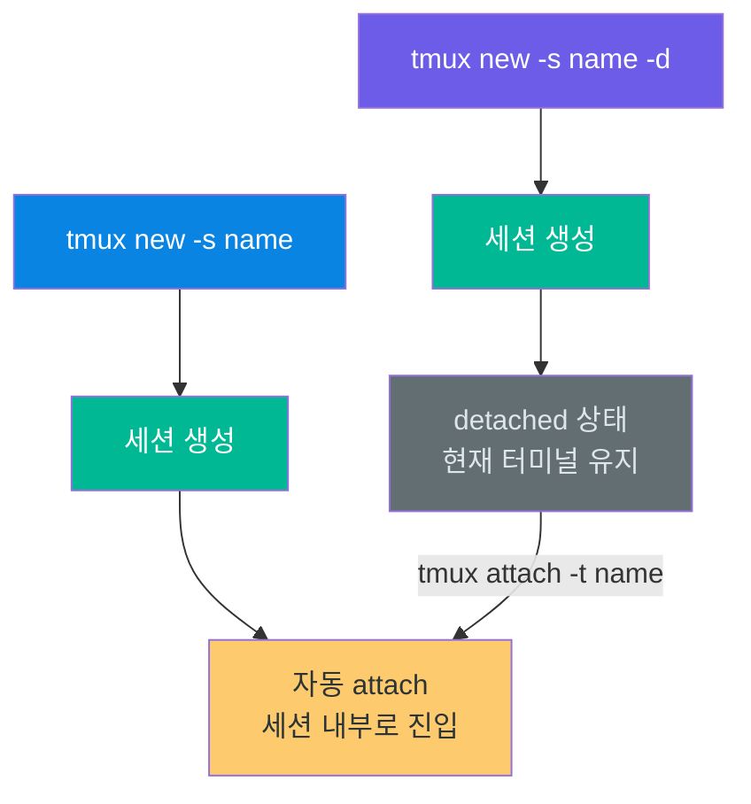
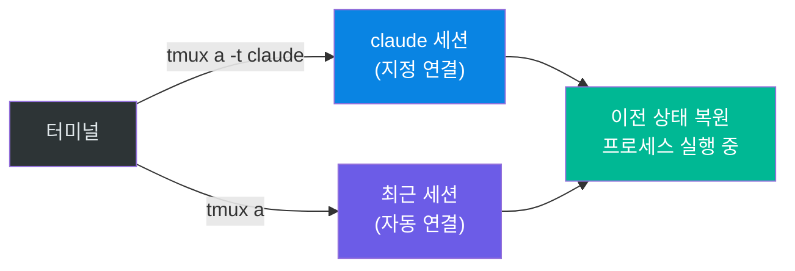
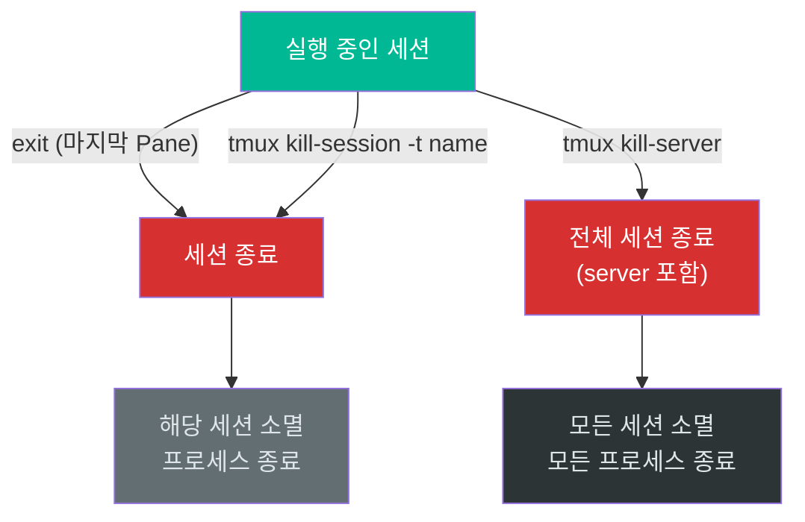
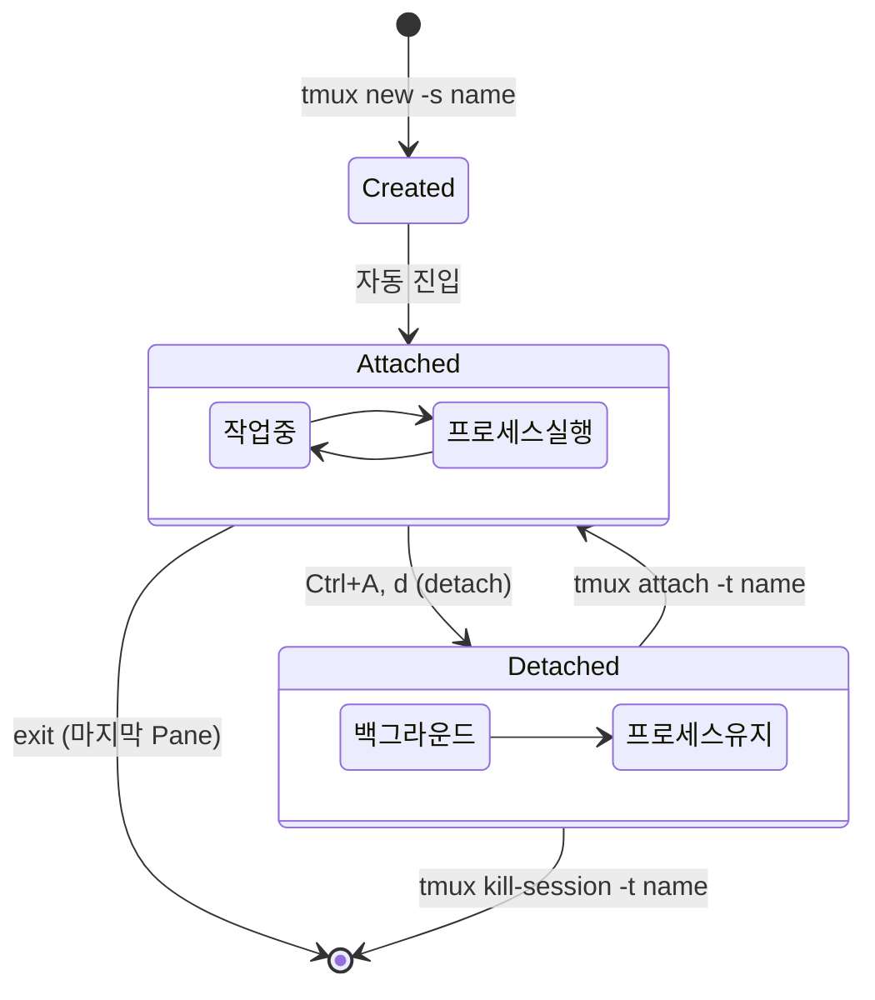

# 02. 세션 관리

tmux의 세션(Session)은 작업의 연속성을 보장하는 핵심 단위입니다. 세션을 생성하고, 이름을 부여하고, 분리(detach)했다가 다시 연결(attach)하는 일련의 생명주기를 자유자재로 다룰 수 있어야 tmux를 실무에서 효과적으로 활용할 수 있습니다. 이 장에서는 세션의 생성부터 종료까지 전체 생명주기를 다룹니다.

---

## 목표

- [ ] 세션을 이름과 함께 생성하고, 이름 지정의 중요성을 설명할 수 있다
- [ ] 실행 중인 세션 목록을 확인하고 원하는 세션을 식별할 수 있다
- [ ] 세션에 연결(attach)하고 분리(detach)하는 동작을 능숙하게 수행할 수 있다
- [ ] 세션을 안전하게 종료하는 방법과 주의사항을 이해한다

---

## 1. 세션 생성

세션을 생성한다는 것은 tmux server 안에 새로운 독립 작업 공간을 만드는 것입니다. 생성과 동시에 해당 세션에 자동으로 attach됩니다.

### 기본 생성 (이름 자동 지정)

```bash
tmux
# → 세션 이름이 0, 1, 2... 숫자로 자동 지정됨
```

이름을 지정하지 않으면 tmux가 순차적으로 숫자를 부여합니다. 세션이 늘어날수록 어떤 세션에서 어떤 작업을 하고 있었는지 구분하기 어려워지므로, 실무에서는 반드시 이름을 지정하는 것을 권장합니다.

### 이름 지정하여 생성 (권장)

```bash
tmux new -s claude
# → 세션 이름: claude
```

`-s`는 session name의 약자입니다. 프로젝트 이름, 작업 목적 등 의미 있는 이름을 부여하면 `tmux ls`로 목록을 확인할 때 어떤 작업 공간인지 즉시 파악할 수 있습니다. 이름은 세션 관리의 가장 기본적인 규율입니다.

### 백그라운드에서 생성

```bash
tmux new -s background -d
# → 세션을 생성하되 현재 터미널에 attach하지 않음
```

`-d` 플래그는 detached 모드를 의미합니다. 세션은 백그라운드에서 생성되고 현재 터미널은 그대로 유지됩니다. 스크립트에서 여러 세션을 일괄 생성하거나, 미리 작업 환경을 준비해두고 나중에 연결할 때 유용합니다.



---

## 2. 세션 목록 확인

현재 tmux server에서 실행 중인 모든 세션을 확인하는 명령입니다. 세션의 이름, 윈도우 수, 생성 시각 등을 한눈에 파악할 수 있습니다.

```bash
tmux ls
# 또는 전체 명령어
tmux list-sessions
```

**출력 예시**:
```
claude: 1 windows (created Thu Jan 23 10:30:00 2025) (attached)
project: 2 windows (created Thu Jan 23 09:00:00 2025)
```

출력의 각 항목이 의미하는 바는 다음과 같습니다.

| 항목 | 의미 |
|------|------|
| `claude` | 세션 이름 |
| `1 windows` | 해당 세션에 속한 윈도우 수 |
| `created ...` | 세션이 생성된 시각 |
| `(attached)` | 현재 누군가가 이 세션에 연결되어 있음 |

`(attached)` 표시가 없는 세션은 백그라운드에서 실행 중이지만 아무도 연결하지 않은 상태입니다. 이 명령은 SSH 재접속 후 이전 작업 세션을 찾을 때 가장 먼저 실행하는 명령이기도 합니다.

---

## 3. 세션 연결 (attach)

attach는 이미 존재하는 세션에 현재 터미널을 연결하는 동작입니다. 연결하는 순간 해당 세션의 화면이 터미널에 표시되며, detach 시점 또는 마지막으로 작업했던 상태가 그대로 복원됩니다.

### 특정 세션에 연결

```bash
tmux attach -t claude
# 축약형
tmux a -t claude
```

`-t`는 target session을 지정하는 옵션입니다. 세션 이름을 명시적으로 지정하여 원하는 작업 공간에 정확하게 연결합니다.

### 가장 최근 세션에 연결

```bash
tmux attach
# 축약형
tmux a
```

세션 이름을 생략하면 가장 최근에 사용했던 세션에 자동으로 연결됩니다. 세션이 하나뿐일 때 빠르게 재연결하는 용도로 적합합니다.



---

## 4. 세션 분리 (detach)

detach는 세션과의 연결을 끊되 세션 자체는 백그라운드에서 계속 실행되도록 하는 동작입니다. 01장에서 다룬 것처럼, 이것이 tmux의 존재 이유라고 할 수 있습니다.

| 방법 | 설명 |
|------|------|
| `Ctrl+A` → `d` | prefix 단축키 방식 (가장 빠르고 권장됨) |
| `tmux detach` | 명령어 방식 (tmux command prompt에서 사용) |

detach를 수행하면 터미널은 tmux 진입 이전 상태로 돌아가고, 세션 안에서 실행 중이던 모든 프로세스는 중단 없이 계속 동작합니다. "화면만 끄고 컴퓨터는 켜둔 상태"라고 비유할 수 있습니다.

---

## 5. 세션 종료

세션 종료는 해당 세션과 그 안의 모든 윈도우, 페인, 프로세스를 완전히 소멸시키는 동작입니다. 되돌릴 수 없으므로 신중하게 사용해야 합니다.

### 세션 안에서 종료

```bash
exit
# 또는 Ctrl+D
```

마지막 셸(Pane)에서 `exit`를 실행하면 해당 세션이 자동으로 종료됩니다. 여러 Pane이 열려 있다면 해당 Pane만 닫히고, 마지막 Pane이 닫힐 때 세션이 소멸합니다.

### 외부에서 특정 세션 종료

```bash
tmux kill-session -t claude
```

세션에 attach하지 않은 상태에서도 이름을 지정하여 종료할 수 있습니다. 더 이상 필요 없는 백그라운드 세션을 정리할 때 사용합니다.

### 모든 세션 종료

```bash
tmux kill-server
```

tmux server 자체를 종료하여 모든 세션을 한꺼번에 제거합니다. 이 명령은 실행 중인 모든 프로세스가 종료되므로 주의해서 사용해야 합니다.



---

## 6. 세션 생명주기 전체 흐름

세션은 생성 → 사용 → 분리 → 재연결 → 종료의 생명주기를 따릅니다. 이 흐름을 하나의 다이어그램으로 정리하면 다음과 같습니다.



---

## 실습: 세션 생명주기 직접 체험

다음 실습을 순서대로 수행하면 세션의 전체 생명주기를 한 번에 경험할 수 있습니다.

```bash
# 1. 이름을 지정하여 새 세션 생성
tmux new -s practice

# 2. 세션 안에서 명령 실행 (현재 상태를 확인할 수 있는 명령)
echo "Hello from tmux session"
pwd
date

# 3. detach (Ctrl+A를 누른 뒤 d)
#    → 터미널로 돌아옴. 세션은 백그라운드에서 계속 실행 중.

# 4. 세션 목록 확인
tmux ls
#    → practice: 1 windows ... 가 표시되어야 함

# 5. 다시 연결
tmux a -t practice
#    → 이전에 실행한 echo, pwd, date의 출력이 그대로 남아 있음

# 6. 세션 종료
exit
#    → 세션이 완전히 종료됨

# 7. 종료 확인
tmux ls
#    → "no server running on ..." 또는 practice가 목록에 없음
```

---

## 명령어 요약

| 명령어 | 설명 | 사용 시점 |
|--------|------|----------|
| `tmux new -s NAME` | 이름을 지정하여 새 세션 생성 | 새 프로젝트/작업 시작 시 |
| `tmux new -s NAME -d` | 백그라운드에서 세션 생성 | 미리 환경 준비 시 |
| `tmux ls` | 실행 중인 세션 목록 확인 | SSH 재접속 후 세션 찾기 |
| `tmux a -t NAME` | 특정 세션에 연결 | 이전 작업 이어가기 |
| `tmux a` | 최근 세션에 연결 | 세션이 하나일 때 |
| `Ctrl+A` → `d` | 세션 분리 (detach) | 자리를 비울 때 |
| `tmux kill-session -t NAME` | 특정 세션 종료 | 불필요한 세션 정리 |
| `tmux kill-server` | 전체 세션 종료 | 완전 초기화 시 (주의) |

---

## 체크포인트

다음 질문에 면접에서 답변하듯이 설명할 수 있는지 확인하세요.

1. **세션 생성 시 이름을 지정해야 하는 이유는 무엇인가요?**
2. **`tmux new -s name`과 `tmux new -s name -d`의 차이는 무엇인가요?**
3. **세션의 전체 생명주기를 순서대로 설명해주세요.**

<details>
<summary>모범 답안 확인</summary>

**1. 세션 이름 지정의 이유**

이름을 지정하지 않으면 tmux가 0, 1, 2와 같은 숫자를 자동으로 부여하는데, 세션이 늘어날수록 어떤 세션이 어떤 작업을 위한 것인지 구분할 수 없게 됩니다. `tmux ls`로 세션 목록을 확인할 때 `project-api`, `monitoring` 같은 의미 있는 이름이 있으면 즉시 작업 맥락을 파악할 수 있습니다. 특히 SSH 재접속 후 이전 작업을 찾아야 할 때 이름이 없으면 하나씩 attach해서 확인해야 하므로, 이름 지정은 세션 관리의 가장 기본적인 규율입니다.

**2. `-d` 플래그의 차이**

`tmux new -s name`은 세션을 생성하고 즉시 해당 세션에 attach합니다. 현재 터미널 화면이 tmux 세션 내부로 전환됩니다. 반면 `tmux new -s name -d`는 세션을 생성하되 attach하지 않고 백그라운드에 둡니다. 현재 터미널은 그대로 유지되며, 나중에 `tmux attach`로 연결할 수 있습니다. 스크립트에서 여러 세션을 일괄 생성하거나, 환경을 미리 준비해두는 용도로 사용합니다.

**3. 세션 생명주기**

세션은 `tmux new -s name`으로 생성되며 자동으로 attached 상태가 됩니다. 작업 도중 `Ctrl+A, d`로 detach하면 세션은 백그라운드에서 계속 실행됩니다. 이후 `tmux attach -t name`으로 재연결하면 이전 상태가 그대로 복원됩니다. 이 attach-detach 순환은 필요한 만큼 반복할 수 있습니다. 작업이 완전히 끝나면 세션 안에서 `exit` 또는 외부에서 `tmux kill-session -t name`으로 세션을 종료합니다.

</details>

---

다음 단계: [03-pane-window](../03-pane-window/)
