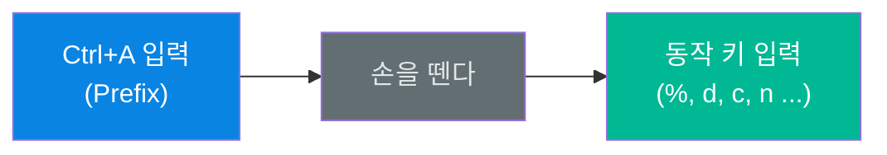
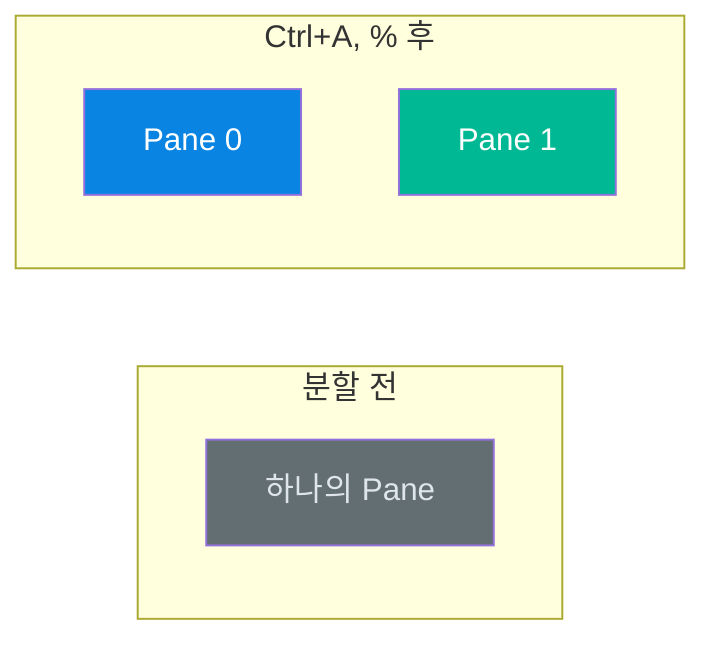
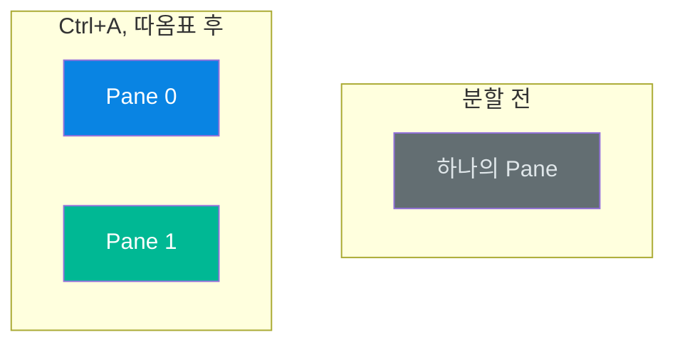
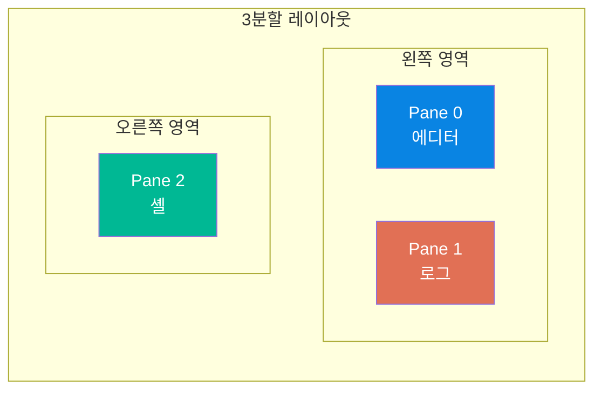
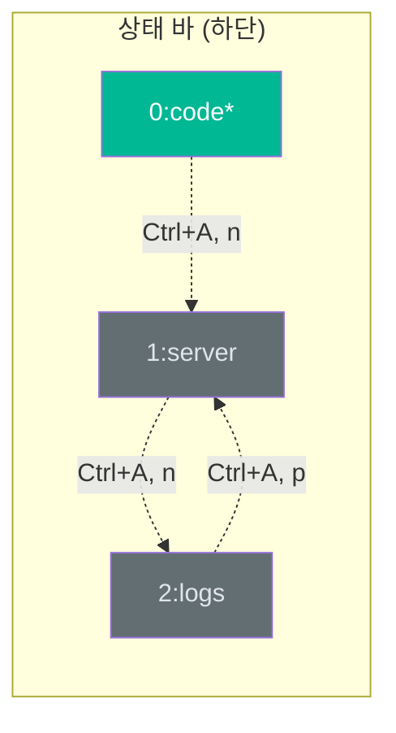
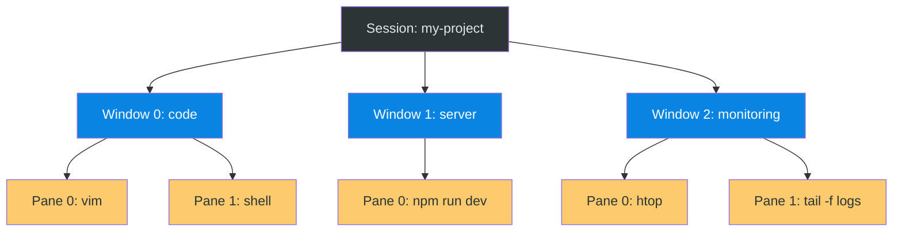

# 03. Pane과 Window 관리

tmux의 생산성은 화면 분할(Pane)과 탭 전환(Window)에서 나옵니다. Pane은 하나의 화면을 물리적으로 나누어 여러 작업을 동시에 시야에 둘 수 있게 하고, Window는 논리적으로 작업을 분류하여 탭처럼 전환할 수 있게 합니다. 이 두 가지를 조합하면 마우스 없이도 IDE 수준의 멀티태스킹 환경을 터미널에서 구현할 수 있습니다.

---

## 목표

- [ ] Pane을 수평/수직으로 분할하고 그 차이를 설명할 수 있다
- [ ] Pane 간 이동과 크기 조절을 자유롭게 수행할 수 있다
- [ ] Window(탭)를 생성하고 전환하며 이름을 관리할 수 있다
- [ ] Pane과 Window를 조합한 레이아웃을 구성할 수 있다

---

## Prefix 키 설정

tmux의 모든 단축키는 **Prefix 키를 먼저 입력한 뒤**, 손을 떼고, 동작 키를 입력하는 2단계 방식으로 동작합니다.

### 왜 `Ctrl+A`인가?

tmux의 기본 Prefix는 `Ctrl+B`이지만, Vim에서 `Ctrl+B`는 페이지 위로 스크롤하는 기본 바인딩과 충돌합니다. 커뮤니티에서 가장 널리 사용되는 대안인 `Ctrl+A`는 GNU Screen과 동일한 키이며, 왼손만으로 편하게 누를 수 있어 인체공학적으로도 우수합니다.

### `.tmux.conf` 설정

`~/.tmux.conf` 파일에 다음을 추가합니다.

```bash
# Prefix를 Ctrl+B에서 Ctrl+A로 변경
unbind C-b
set-option -g prefix C-a
bind-key C-a send-prefix
```

| 라인 | 역할 |
|------|------|
| `unbind C-b` | 기본 Prefix 바인딩 해제 |
| `set-option -g prefix C-a` | 새 Prefix를 `Ctrl+A`로 설정 |
| `bind-key C-a send-prefix` | `Ctrl+A`를 두 번 누르면 셸에 리터럴 `Ctrl+A` 전달 |

마지막 줄 덕분에 셸 본래의 `Ctrl+A` 기능(커서를 줄 맨 앞으로 이동)도 `Ctrl+A, Ctrl+A`로 사용할 수 있습니다. 설정 후 tmux를 재시작하거나, 기존 세션에서 `tmux source-file ~/.tmux.conf`를 실행하면 즉시 적용됩니다.

### 입력 방식

```
Ctrl+A → (손을 뗀다) → 동작 키
```

예를 들어 `Ctrl+A, %`는 "Ctrl과 A를 동시에 누르고, 손을 떼고, %를 누른다"는 뜻입니다. 이 2단계 방식 덕분에 일반 셸 단축키와 충돌하지 않으면서도 수십 개의 tmux 전용 단축키를 사용할 수 있습니다.



---

## 1. Pane 분할

Pane 분할은 현재 활성화된 Pane을 두 영역으로 나누는 동작입니다. 분할된 각 Pane은 독립적인 셸을 실행하며, 서로 다른 작업을 동시에 수행할 수 있습니다.

### 수직 분할 (좌우로 나누기)

```
Ctrl+A, %
```

현재 Pane을 세로 경계선으로 나누어 좌우 두 영역을 만듭니다. 코드 에디터와 터미널을 나란히 놓거나, 두 파일을 동시에 비교할 때 유용합니다.



### 수평 분할 (상하로 나누기)

```
Ctrl+A, "
```

현재 Pane을 가로 경계선으로 나누어 상하 두 영역을 만듭니다. 위쪽에서 코드를 작성하고 아래쪽에서 실행 결과나 로그를 모니터링하는 레이아웃에 적합합니다.



### 분할 조합 예시

분할을 여러 번 수행하면 복합 레이아웃을 만들 수 있습니다. 아래는 Pane 0에서 수직 분할 후, Pane 0에서 다시 수평 분할한 결과입니다.



---

## 2. Pane 이동

여러 Pane으로 분할한 뒤에는 Pane 간에 자유롭게 이동할 수 있어야 합니다. tmux는 방향키 기반 이동, 순환 이동, 번호 지정 이동 등 여러 방식을 제공합니다.

| 단축키 | 동작 | 사용 시점 |
|--------|------|----------|
| `Ctrl+A` → `방향키` | 해당 방향의 Pane으로 이동 | 원하는 Pane의 위치를 알 때 |
| `Ctrl+A` → `o` | 다음 Pane으로 순환 이동 | Pane이 2~3개일 때 빠른 전환 |
| `Ctrl+A` → `q` | Pane 번호를 표시하고, 번호를 누르면 해당 Pane으로 이동 | Pane이 많을 때 정확한 이동 |
| `Ctrl+A` → `;` | 마지막으로 활성화했던 Pane으로 이동 | 두 Pane을 번갈아 작업할 때 |

`Ctrl+A, q`를 누르면 각 Pane에 번호가 잠시 표시됩니다. 이 번호가 표시되는 동안 해당 숫자를 누르면 곧바로 이동합니다. Pane이 4개 이상으로 많아질 때 가장 정확한 이동 방법입니다.

---

## 3. Pane 크기 조절

분할 비율이 항상 원하는 대로 되지는 않습니다. tmux는 활성 Pane의 크기를 동적으로 조절하는 기능을 제공합니다.

| 단축키 | 동작 |
|--------|------|
| `Ctrl+A` → `Ctrl+방향키` | 해당 방향으로 Pane 경계를 이동하여 크기 조절 |
| `Ctrl+A` → `z` | 현재 Pane을 전체 화면으로 확대(zoom). 다시 누르면 원래 레이아웃으로 복원 |

**zoom 기능**은 특히 유용합니다. 로그를 잠깐 전체 화면으로 보거나, 좁은 Pane에서 긴 명령어를 입력할 때 `Ctrl+A, z`로 확대하고, 작업 후 다시 `Ctrl+A, z`를 눌러 원래 레이아웃으로 돌아올 수 있습니다. 레이아웃을 해체하지 않고도 임시로 전체 화면을 사용할 수 있는 기능입니다.


---

## 4. Pane 닫기

Pane을 닫으면 해당 Pane에서 실행 중이던 셸과 프로세스가 종료됩니다. 마지막 Pane이 닫히면 해당 Window가 종료되고, 마지막 Window가 종료되면 Session이 소멸합니다.

| 방법 | 설명 | 특징 |
|------|------|------|
| `exit` | 해당 Pane의 셸을 정상 종료 | 가장 일반적인 방법 |
| `Ctrl+D` | `exit`와 동일한 효과 (EOF 시그널) | 빠른 종료 |
| `Ctrl+A` → `x` | 현재 Pane을 강제 종료 (확인 메시지 표시) | 응답하지 않는 프로세스 정리 시 |

`Ctrl+A, x`는 "kill this pane?"이라는 확인 메시지를 보여줍니다. `y`를 누르면 종료되고 `n`을 누르면 취소됩니다. 프로세스가 응답하지 않아 `exit`가 동작하지 않을 때 사용합니다.

---

## 5. Window (탭) 관리

Window는 Pane들의 집합이며, 같은 Session 안에서 탭처럼 전환할 수 있는 작업 단위입니다. 화면 하단의 상태 바에 Window 목록이 표시되며, 현재 활성 Window에 `*` 표시가 붙습니다.

### Window 생성 및 전환

| 단축키 | 동작 | 설명 |
|--------|------|------|
| `Ctrl+A` → `c` | 새 Window 생성 | create의 약자. 새 탭을 여는 것과 같음 |
| `Ctrl+A` → `n` | 다음 Window로 이동 | next |
| `Ctrl+A` → `p` | 이전 Window로 이동 | previous |
| `Ctrl+A` → `숫자` | 해당 번호의 Window로 직접 이동 | 0번부터 시작 |
| `Ctrl+A` → `w` | 전체 Window 목록을 트리 형태로 표시 | 화살표로 선택 후 Enter |

### Window 이름 변경

```
Ctrl+A, ,
```

하단에 입력창이 나타나면 원하는 이름을 입력합니다. Window 이름은 상태 바에 표시되므로, `code`, `server`, `logs` 등 역할을 명시하면 탭 전환 시 목적을 즉시 파악할 수 있습니다.



---

## Pane과 Window의 관계

Pane과 Window는 서로 보완적인 관계입니다. Window가 **논리적 분리**(탭 전환)를 담당한다면, Pane은 **물리적 분리**(화면 분할)를 담당합니다. 실무에서는 이 둘을 조합하여 사용합니다.



| 용도 | 권장 단위 | 이유 |
|------|----------|------|
| 서로 다른 역할의 작업 | Window | 탭 전환으로 깔끔하게 분리 |
| 동시에 봐야 하는 작업 | Pane | 한 화면에서 함께 모니터링 |
| 프로젝트 전환 | Session | 완전히 독립된 환경 |

---

## 실습: Pane 분할 연습

```bash
# 1. 새 세션 생성
tmux new -s panes

# 2. 수직 분할 (Ctrl+A, %)
#    → 좌우 두 Pane이 생김

# 3. Pane 이동 테스트 (Ctrl+A, 방향키)
#    → 좌우 Pane을 오가며 확인

# 4. 왼쪽 Pane에서 수평 분할 (Ctrl+A, ")
#    → 3분할 레이아웃 완성

# 5. Pane 번호 확인 (Ctrl+A, q)
#    → 각 Pane에 번호가 잠시 표시됨

# 6. 각 Pane에서 다른 명령 실행
#    Pane 0: echo "editor"
#    Pane 1: echo "logs"
#    Pane 2: echo "shell"

# 7. zoom 테스트 (Ctrl+A, z)
#    → 현재 Pane이 전체 화면으로 확대
#    → 다시 Ctrl+A, z로 원래 레이아웃 복원

# 8. 정리: 각 Pane에서 exit
```

## 실습: Window 활용

```bash
# 1. 새 세션 생성
tmux new -s windows

# 2. 현재 Window 이름 변경 (Ctrl+A, ,)
#    → "main" 입력

# 3. 새 Window 생성 (Ctrl+A, c)
#    → 하단 상태 바에 새 Window 추가됨

# 4. 이 Window 이름을 "server"로 변경 (Ctrl+A, ,)

# 5. Window 전환
#    Ctrl+A, 0 → main
#    Ctrl+A, 1 → server
#    Ctrl+A, n → 다음
#    Ctrl+A, p → 이전

# 6. Window 목록 보기 (Ctrl+A, w)
#    → 트리 형태로 전체 세션/윈도우 목록 표시
#    → 화살표로 선택, Enter로 이동
```

---

## 단축키 요약

### Pane 조작

| 단축키 | 동작 | 기억법 |
|--------|------|--------|
| `Ctrl+A` → `%` | 수직 분할 (좌우) | `%`는 세로줄로 나누는 모양 |
| `Ctrl+A` → `"` | 수평 분할 (상하) | `"`는 가로줄로 나누는 모양 |
| `Ctrl+A` → `방향키` | Pane 이동 | 직관적 방향 |
| `Ctrl+A` → `z` | zoom 토글 | zoom의 z |
| `Ctrl+A` → `x` | Pane 닫기 (확인 필요) | x = 삭제 |
| `Ctrl+A` → `q` | Pane 번호 표시 | query |

### Window 조작

| 단축키 | 동작 | 기억법 |
|--------|------|--------|
| `Ctrl+A` → `c` | 새 Window 생성 | create |
| `Ctrl+A` → `n` | 다음 Window | next |
| `Ctrl+A` → `p` | 이전 Window | previous |
| `Ctrl+A` → `숫자` | 해당 번호 Window로 이동 | 직접 지정 |
| `Ctrl+A` → `,` | Window 이름 변경 | - |
| `Ctrl+A` → `&` | 현재 Window 닫기 (확인 필요) | ampersand |
| `Ctrl+A` → `w` | Window 목록 표시 | window list |

---

## 체크포인트

다음 질문에 면접에서 답변하듯이 설명할 수 있는지 확인하세요.

1. **Pane의 수직 분할과 수평 분할의 차이를 설명하고, 각각 어떤 상황에서 유용한가요?**
2. **zoom 기능은 무엇이며, 왜 레이아웃을 해체하는 것보다 나은가요?**
3. **Pane과 Window를 각각 어떤 기준으로 사용해야 하나요?**

<details>
<summary>모범 답안 확인</summary>

**1. 수직 분할과 수평 분할**

수직 분할(`Ctrl+A, %`)은 세로 경계선으로 화면을 좌우로 나눕니다. 코드와 터미널을 나란히 놓거나 두 파일을 비교할 때 적합합니다. 수평 분할(`Ctrl+A, "`)은 가로 경계선으로 화면을 상하로 나눕니다. 위에서 작업하고 아래에서 로그나 실행 결과를 모니터링하는 레이아웃에 적합합니다. 실무에서는 이 두 가지를 조합하여 3~4분할 레이아웃을 만드는 것이 일반적입니다.

**2. zoom 기능의 장점**

zoom(`Ctrl+A, z`)은 현재 Pane을 임시로 전체 화면으로 확대하는 기능입니다. 다시 `Ctrl+A, z`를 누르면 원래 분할 레이아웃으로 복원됩니다. Pane을 닫고 다시 만드는 것과 달리, 기존 레이아웃과 실행 중인 프로세스를 그대로 유지한 채 전체 화면을 사용할 수 있습니다. 좁은 Pane에서 긴 출력을 확인하거나 임시로 넓은 화면이 필요할 때, 레이아웃을 해체하지 않고 빠르게 전환할 수 있어 효율적입니다.

**3. Pane vs Window 사용 기준**

Pane은 동시에 화면에 보면서 작업해야 하는 것들에 사용합니다. 예를 들어 코드를 수정하면서 실시간으로 로그를 확인하는 경우입니다. Window는 역할이 다른 작업을 논리적으로 분리할 때 사용합니다. 예를 들어 코딩 작업과 서버 실행, 모니터링을 각각 다른 Window로 분리합니다. 한 번에 하나만 봐도 되는 작업은 Window로, 동시에 봐야 하는 작업은 Pane으로 분리하는 것이 기본 원칙입니다.

</details>

---

다음 단계: [04-claude-code-integration](../04-claude-code-integration/)
