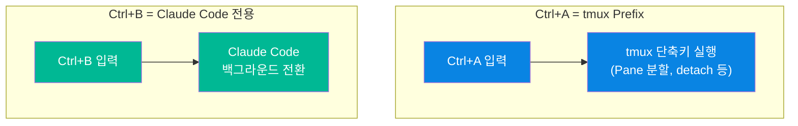
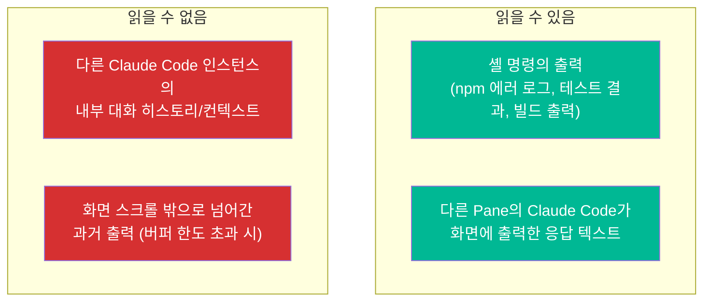
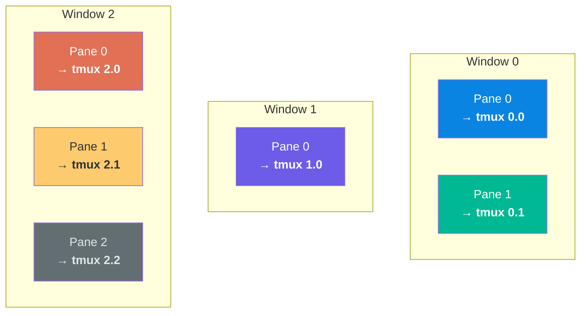
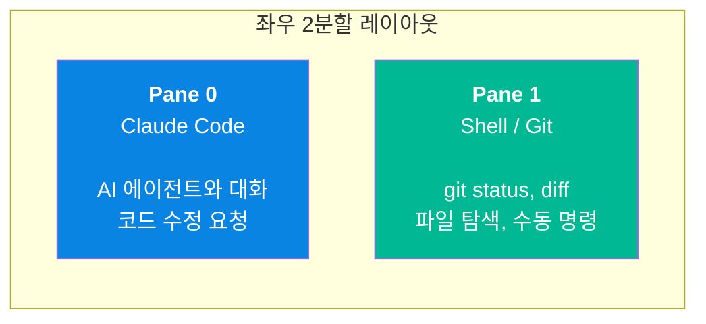
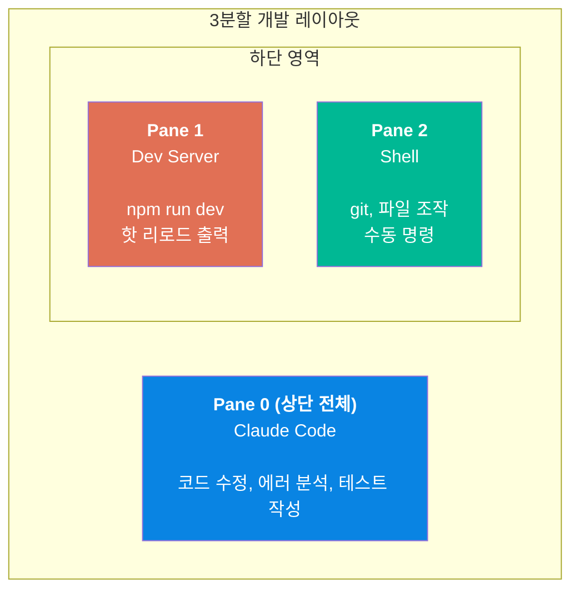
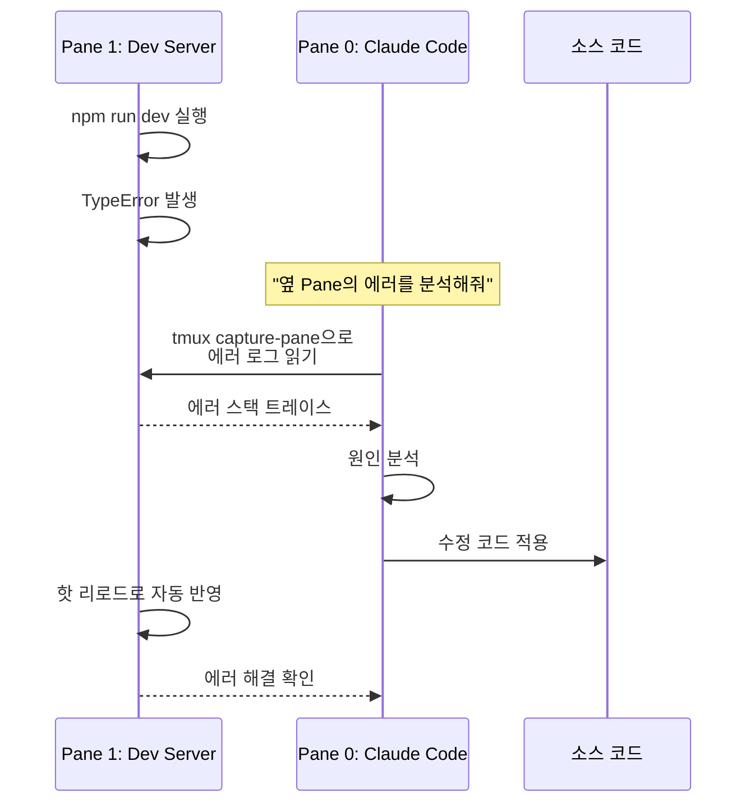
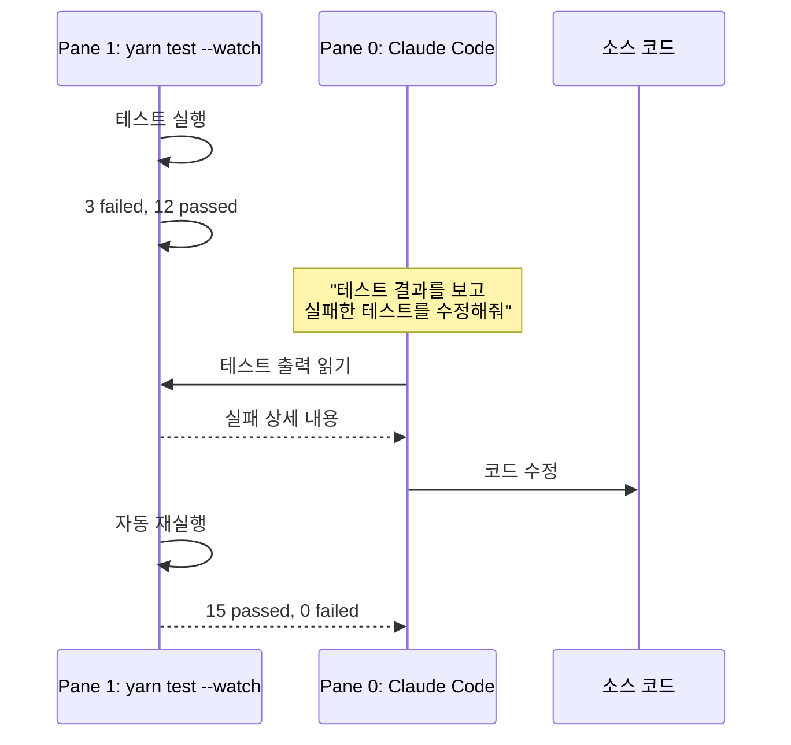
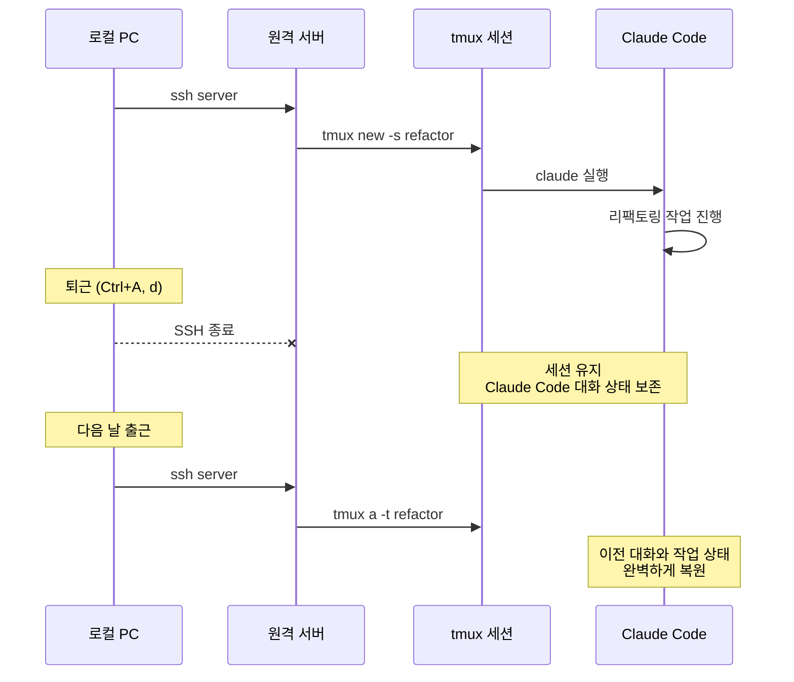
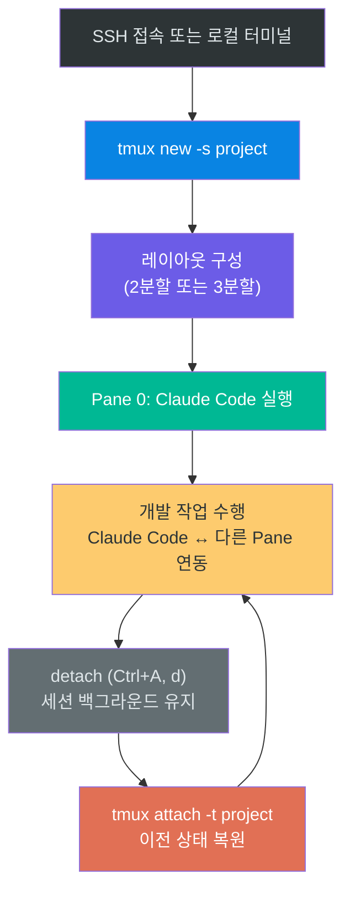

# 04. Claude Code + tmux 통합

Claude Code CLI와 tmux를 결합하면, AI 에이전트가 단순히 텍스트를 주고받는 수준을 넘어 **개발 환경 전체를 인식하고 조작하는** 강력한 워크플로우를 구축할 수 있습니다. tmux의 세션 지속성 덕분에 장시간 작업도 안전하게 유지되고, Pane 분할 덕분에 Claude Code가 다른 터미널의 출력을 읽고 분석하는 것이 가능해집니다. 이 장에서는 이 통합의 원리와 실전 활용법을 다룹니다.

---

## 목표

- [ ] Prefix를 `Ctrl+A`로 변경하면 Claude Code와의 키 충돌이 해소되는 이유를 설명할 수 있다
- [ ] Claude Code가 다른 Pane의 내용을 읽는 방법을 이해하고 활용할 수 있다
- [ ] 실전 개발 워크플로우에 맞는 tmux 레이아웃을 구성할 수 있다

---

## 1. Prefix 변경으로 키 충돌 해소

### 기본 Prefix(`Ctrl+B`) 사용 시 문제

tmux의 기본 Prefix `Ctrl+B`는 Claude Code에서 "현재 작업을 백그라운드로 보내기" 기능과 동일한 키입니다. 기본 설정 그대로 사용하면 tmux가 `Ctrl+B`를 먼저 가로채서 Claude Code에 전달되지 않는 문제가 발생합니다.

### `Ctrl+A`로 변경하면 충돌이 사라진다

03장에서 설정한 대로 Prefix를 `Ctrl+A`로 변경하면, tmux와 Claude Code가 서로 다른 키를 사용하게 되어 충돌이 완전히 해소됩니다.



| 키 | 담당 | 기능 | 충돌 |
|----|------|------|------|
| `Ctrl+A` | tmux | Prefix (단축키 시작) | 없음 |
| `Ctrl+B` | Claude Code | 백그라운드 전환 | 없음 |

**두 번 누르기 없이** 각 키가 각자의 역할을 수행합니다. Prefix를 `Ctrl+A`로 변경하는 것만으로 통합 환경의 키 입력이 깔끔하게 정리됩니다.

### 실전 대응표

| 하고 싶은 동작 | 키 입력 |
|---------------|---------|
| tmux Pane 분할 | `Ctrl+A, %` |
| tmux detach | `Ctrl+A, d` |
| tmux 스크롤 모드 | `Ctrl+A, [` |
| Claude Code 백그라운드 전환 | `Ctrl+B` (그대로 동작) |
| 셸에서 줄 맨 앞으로 이동 | `Ctrl+A, Ctrl+A` (Prefix 두 번) |

> **참고**: 셸의 `Ctrl+A`(줄 맨 앞으로 이동)만 `Ctrl+A`를 두 번 눌러야 합니다. `.tmux.conf`의 `bind-key C-a send-prefix` 설정이 이를 처리합니다.

---

## 2. Claude Code의 tmux Pane 읽기

Claude Code가 tmux 환경에서 가장 강력해지는 이유는 **다른 Pane의 출력을 읽을 수 있기 때문**입니다. 개발 서버의 에러 로그, 테스트 실행 결과, 빌드 출력 등을 Claude Code가 직접 확인하고 분석할 수 있습니다.

### 읽기의 원리와 한계

Claude Code가 다른 Pane을 "읽는다"는 것은 `tmux capture-pane` 명령으로 해당 Pane의 **화면 버퍼에 표시된 텍스트**를 캡처하는 것입니다. 다른 프로세스의 내부 상태에 접근하는 것이 아니라, 터미널에 눈으로 보이는 출력을 텍스트로 가져오는 동작입니다.



| 시나리오 | 가능 여부 | 이유 |
|---------|----------|------|
| Pane 1의 `npm run dev` 에러 출력 읽기 | **가능** | 터미널 출력을 캡처 |
| Pane 1의 Claude Code 화면에 보이는 응답 읽기 | **가능** | 화면 버퍼의 텍스트 |
| Pane 1 Claude Code의 전체 대화 히스토리 파악 | **불가** | 화면에 보이는 부분만 캡처됨 |
| 여러 Pane의 Claude Code끼리 협업/대화 | **불가** | 각각 독립된 세션, 상호 통신 없음 |

따라서 **여러 Pane에 각각 Claude Code를 실행하는 것은 권장하지 않습니다**. 각 인스턴스가 서로의 컨텍스트를 공유하지 못하므로, **1개의 Claude Code + 나머지 Pane은 셸/서버/로그 용도**로 사용하는 것이 가장 효율적입니다.

### Pane 참조 방식

tmux에서 특정 Pane을 참조할 때는 `Window 번호.Pane 번호` 형식을 사용합니다.



| 참조 | 의미 |
|------|------|
| `tmux 0.0` | Window 0의 Pane 0 |
| `tmux 0.1` | Window 0의 Pane 1 |
| `tmux 1.0` | Window 1의 Pane 0 |
| `tmux 2.2` | Window 2의 Pane 2 |

### Claude Code에게 요청하는 방법

Claude Code는 tmux 명령어를 이해하고 실행할 수 있습니다. 다른 Pane의 출력을 읽거나, 다른 Pane에 명령을 전송하는 것이 가능합니다.

```
"tmux 0.1의 출력을 확인해줘"
→ Claude Code가 해당 Pane의 화면 내용을 캡처하여 읽음

"tmux 1.0에서 npm test를 실행해줘"
→ Claude Code가 해당 Pane에 명령을 전송하여 실행

"옆 Pane의 에러 로그를 분석해줘"
→ Claude Code가 인접 Pane의 출력을 읽고 원인을 분석
```

이 기능 덕분에 Claude Code는 자신이 실행되고 있는 Pane에 갇혀 있지 않고, tmux 환경 전체를 작업 공간으로 활용할 수 있습니다.

---

## 3. 권장 레이아웃

작업 유형에 따라 최적의 Pane 레이아웃이 다릅니다. 아래는 실무에서 검증된 두 가지 대표 레이아웃입니다.

### 기본 레이아웃: 좌우 2분할

가장 간단하면서도 범용적인 레이아웃입니다. Claude Code와 일반 셸을 나란히 놓고, Claude Code가 코드를 수정하는 동안 옆에서 git 상태를 확인하거나 파일을 탐색합니다.

```bash
tmux new -s claude \; split-window -h \; select-pane -t 0
```



**적합한 상황**: 일반적인 코딩 작업, 코드 리뷰, 리팩토링

### 개발 레이아웃: 3분할

개발 서버를 포함한 레이아웃입니다. Claude Code가 코드를 수정하면 개발 서버의 핫 리로드 결과를 실시간으로 확인할 수 있고, Claude Code에게 에러 분석을 바로 요청할 수 있습니다.

```bash
tmux new -s dev \; \
  split-window -v -l 30% \; \
  split-window -h \; \
  select-pane -t 0
```



**적합한 상황**: 프론트엔드/백엔드 개발, 에러 디버깅, 실시간 테스트

---

## 4. 실전 시나리오

### 시나리오 A: 에러 로그 분석

개발 서버에서 에러가 발생했을 때, Claude Code가 에러 로그를 직접 읽고 원인을 분석하여 수정 코드를 제안합니다.



### 시나리오 B: 테스트 모니터링

#### Watch 모드란?

Watch 모드는 소스 파일의 변경을 감지하여 **자동으로 테스트를 재실행**하는 기능입니다. 파일을 저장할 때마다 수동으로 테스트를 실행할 필요 없이, 터미널에서 실시간으로 테스트 결과(통과/실패/에러 메시지)가 갱신됩니다.

| 패키지 매니저 | Watch 모드 명령어 | 비고 |
|--------------|-----------------|------|
| npm | `npm test -- --watch` | Jest 기반 프로젝트 |
| yarn | `yarn test --watch` | 동일하게 지원 |
| vitest | `vitest --watch` 또는 `vitest` (기본값) | Vitest는 기본이 watch 모드 |

Watch 모드에서 터미널에 표시되는 내용은 콘솔에서 직접 테스트를 실행했을 때와 동일합니다. 실패한 테스트의 에러 메시지, 스택 트레이스, 통과/실패 요약이 파일 변경 시마다 갱신됩니다.

테스트를 watch 모드로 실행하고, 실패한 테스트를 Claude Code가 분석하여 수정합니다.



### 시나리오 C: 장시간 원격 작업

SSH로 원격 서버에 접속하여 장시간 리팩토링 작업을 수행하는 시나리오입니다. tmux의 세션 지속성 덕분에 퇴근 후에도 작업 상태가 유지됩니다.



---

## 5. 스크롤 모드

tmux에서 화면에 표시된 것보다 이전의 출력을 확인하려면 스크롤 모드(copy mode)에 진입해야 합니다. 일반 터미널의 스크롤과 달리, tmux는 자체적인 스크롤 버퍼를 관리하기 때문에 별도의 진입 동작이 필요합니다.

> **필수 설정**: `j/k` 등 vi 스타일 키를 사용하려면 `~/.tmux.conf`에 다음 설정이 필요합니다. 기본값은 emacs 모드이므로 이 설정이 없으면 j/k가 동작하지 않습니다.
> ```bash
> set -g mode-keys vi
> ```

| 단축키 | 동작 | 모드 |
|--------|------|------|
| `Ctrl+A` → `[` | 스크롤 모드 진입 | 공통 |
| `j` / `k` | 한 줄씩 아래/위로 이동 | vi (`mode-keys vi` 필요) |
| `↑` / `↓` | 한 줄씩 아래/위로 이동 | 공통 (emacs/vi 모두) |
| `Ctrl+D` / `Ctrl+U` | 반 페이지씩 아래/위로 이동 | vi |
| `q` | 스크롤 모드 종료 | 공통 |

Prefix를 `Ctrl+A`로 변경했기 때문에, Claude Code 안에서도 `Ctrl+A, [`로 바로 스크롤 모드에 진입할 수 있습니다. `Ctrl+B`와 충돌하지 않으므로 별도의 우회 조작이 필요 없습니다.

---

## 통합 워크플로우 요약



---

## 체크포인트

다음 질문에 면접에서 답변하듯이 설명할 수 있는지 확인하세요.

1. **Prefix를 `Ctrl+A`로 변경하면 Claude Code와의 키 충돌이 해소되는 이유는 무엇인가요?**
2. **Claude Code가 다른 Pane의 출력을 읽을 수 있다는 것이 왜 중요한가요?**
3. **tmux + Claude Code 조합이 SSH 원격 작업에서 특히 유용한 이유는 무엇인가요?**

<details>
<summary>모범 답안 확인</summary>

**1. Prefix 변경으로 키 충돌이 해소되는 이유**

tmux의 기본 Prefix `Ctrl+B`는 Claude Code의 백그라운드 전환 키와 동일하여, tmux가 해당 키 입력을 먼저 가로채 Claude Code에 전달되지 않는 문제가 있었습니다. Prefix를 `Ctrl+A`로 변경하면, tmux는 `Ctrl+A`만 가로채고 `Ctrl+B`는 그대로 하위 프로세스인 Claude Code에 전달됩니다. 결과적으로 tmux 단축키(`Ctrl+A + 동작키`)와 Claude Code 단축키(`Ctrl+B`)가 서로 다른 키를 사용하게 되어 충돌 없이 각자의 기능을 수행합니다. 유일하게 주의할 점은 셸의 `Ctrl+A`(줄 맨 앞으로 이동)를 사용하려면 `Ctrl+A`를 두 번 눌러야 한다는 것입니다.

**2. 다른 Pane 읽기의 중요성**

Claude Code가 다른 Pane을 읽을 수 있다는 것은, AI 에이전트가 자신이 실행되는 터미널에 갇혀 있지 않고 개발 환경 전체를 인식할 수 있다는 뜻입니다. 예를 들어 개발 서버의 에러 로그를 직접 읽고 원인을 분석하거나, 테스트 실행 결과를 확인하고 실패한 테스트를 수정할 수 있습니다. 사용자가 에러 메시지를 복사하여 붙여넣을 필요 없이, Claude Code가 스스로 컨텍스트를 수집하여 문제를 해결하므로 작업 효율이 크게 향상됩니다.

**3. SSH 원격 작업에서의 장점**

tmux의 세션 지속성과 Claude Code의 대화 상태 보존이 결합되면, SSH 연결이 끊어져도 작업의 연속성이 보장됩니다. 퇴근하며 SSH를 닫아도 tmux 세션은 원격 서버에서 계속 실행되고, 다음 날 SSH 재접속 후 `tmux attach`로 연결하면 Claude Code의 대화 히스토리, 실행 중이던 개발 서버, 열어둔 파일 등 전체 작업 상태가 그대로 복원됩니다. 네트워크 불안정 환경에서도 작업을 안전하게 지속할 수 있으므로, 원격 서버에서 장시간 작업하는 시나리오에 특히 강력합니다.

</details>

---

다음 단계: [05-workflow](../05-workflow/)
