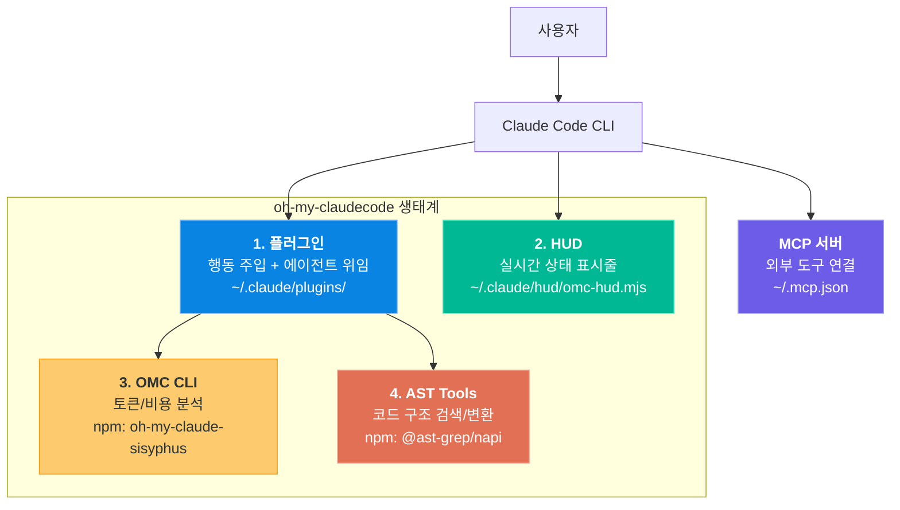

# 00. 설치 및 환경 설정

oh-my-claudecode(OMC)는 단일 프로그램이 아니라 4가지 독립적인 구성 요소의 조합입니다. 각 구성 요소가 서로 다른 문제를 해결하며, 전체를 함께 설치해야 OMC의 기능을 온전히 사용할 수 있습니다. 이 장에서는 4가지 구성 요소를 설치하고 정상 동작을 검증합니다.

---

## 목표

- [ ] OMC의 4가지 구성 요소(플러그인, HUD, CLI, AST Tools)의 역할을 구분할 수 있다
- [ ] 모든 구성 요소를 설치하고 검증할 수 있다
- [ ] MCP 서버 설정 파일(`~/.mcp.json`)의 구조를 이해한다

---

## 1. 4가지 구성 요소 이해

OMC는 Claude Code CLI 위에 올라가는 확장 생태계입니다. 각 구성 요소는 독립적으로 설치되며, 서로 다른 계층에서 동작합니다.



| 구성 요소 | 역할 | 설치 위치 |
|-----------|------|-----------|
| **플러그인** | 핵심 두뇌. 스킬 감지, 에이전트 위임, 실행 모드 제어 | `~/.claude/plugins/cache/omc/` |
| **HUD** | 터미널 상태 표시줄. 모드, 컨텍스트, 에이전트 상태 실시간 표시 | `~/.claude/hud/omc-hud.mjs` |
| **OMC CLI** | 토큰 사용량과 비용을 분석하는 커맨드라인 도구 | npm 전역 설치 |
| **AST Tools** | AST 기반 코드 패턴 검색/변환 (17개 언어 지원) | npm 전역 설치 |

---

## 2. 플러그인 설치

OMC 플러그인은 Claude Code의 플러그인 마켓플레이스를 통해 설치합니다.

```bash
# Claude Code 내에서 실행
/plugin marketplace add yeachan-heo/oh-my-claudecode

# 플러그인 설치
/plugin install oh-my-claudecode
```

설치 후 Claude Code를 재시작하면 플러그인이 활성화됩니다. 플러그인은 `plugin.json` 매니페스트를 통해 hooks와 CLAUDE.md 주입을 등록하며, 사용자의 입력에서 키워드를 감지하여 적절한 스킬과 에이전트를 활성화합니다.

---

## 3. HUD, CLI, AST Tools 설치

```bash
# HUD 설정 (Claude Code 내에서)
/claude-hud:setup
# 또는
/oh-my-claudecode:hud setup

# OMC CLI 설치
npm install -g oh-my-claude-sisyphus

# AST Tools 설치
npm install -g @ast-grep/napi
```

---

## 4. MCP 서버 설정

MCP 서버는 Claude Code에 외부 도구를 연결하는 프로토콜입니다. `~/.mcp.json` 파일에 설정합니다.

```json
{
  "mcpServers": {
    "context7": {
      "command": "npx",
      "args": ["-y", "@upstash/context7-mcp"]
    },
    "exa": {
      "command": "npx",
      "args": ["-y", "exa-mcp-server"],
      "env": {
        "EXA_API_KEY": "your-api-key"
      }
    }
  }
}
```

| MCP 서버 | 용도 | API 키 |
|----------|------|--------|
| **Context7** | 최신 라이브러리 문서 실시간 조회 | 불필요 |
| **Exa** | 고품질 웹 검색 결과 | 필요 (exa.ai) |

---

## 5. 설치 검증

모든 구성 요소가 정상 설치되었는지 확인합니다.

```bash
# 1. 플러그인 확인
grep -q "oh-my-claudecode" ~/.claude/settings.json && echo "Plugin: OK" || echo "Plugin: MISSING"

# 2. HUD 확인
[ -f ~/.claude/hud/omc-hud.mjs ] && echo "HUD: OK" || echo "HUD: MISSING"

# 3. CLI 확인
omc --version && echo "CLI: OK" || echo "CLI: MISSING"

# 4. AST Tools 확인
npx @ast-grep/napi --help > /dev/null 2>&1 && echo "AST: OK" || echo "AST: MISSING"

# 5. MCP 설정 확인
[ -f ~/.mcp.json ] && echo "MCP: OK" || echo "MCP: MISSING"
```

정상적으로 설치되었다면 Claude Code를 재시작한 후, 터미널 하단에 `[OMC]` 상태 표시줄이 나타납니다.

---

## 체크포인트

다음 질문에 면접에서 답변하듯이 설명할 수 있는지 확인하세요.

1. **OMC의 4가지 구성 요소는 각각 어떤 문제를 해결하나요?**
2. **플러그인과 MCP 서버의 차이는 무엇인가요?**
3. **HUD가 필요한 이유는 무엇인가요?**

<details>
<summary>모범 답안 확인</summary>

**1. 4가지 구성 요소의 역할**

플러그인은 Claude Code의 행동을 확장하는 핵심 두뇌로, 사용자 입력에서 키워드를 감지하여 스킬과 에이전트를 활성화합니다. HUD는 터미널 상태 표시줄을 통해 현재 모드, 컨텍스트 사용량, 에이전트 상태를 실시간으로 보여줍니다. CLI는 세션별 토큰 사용량과 비용을 분석하는 커맨드라인 도구입니다. AST Tools는 코드 구조를 이해하는 검색/변환 도구로, 텍스트가 아닌 AST(추상 구문 트리) 기반으로 정확한 코드 패턴 매칭을 수행합니다.

**2. 플러그인 vs MCP 서버**

플러그인은 Claude Code의 내부 행동을 수정합니다. hooks를 통해 사용자 입력을 가로채고, CLAUDE.md를 주입하여 Claude의 동작 방식 자체를 변경합니다. MCP 서버는 외부 도구와의 통신 채널입니다. Claude Code가 MCP 프로토콜을 통해 외부 서비스(웹 검색, 문서 조회)에 접근할 수 있게 해줍니다. 플러그인은 "어떻게 동작할지"를, MCP는 "무엇에 접근할지"를 결정합니다.

**3. HUD가 필요한 이유**

Claude Code는 기본적으로 작업 진행 상태가 불투명합니다. 장시간 작업 중 터미널이 조용해지면 실제로 작업 중인지, 무한 루프에 빠졌는지 알 수 없습니다. 컨텍스트 윈도우가 얼마나 찼는지도 보이지 않아 갑자기 컨텍스트 초과가 발생합니다. HUD는 이 블랙박스를 투명하게 만들어, 사전에 문제를 인지하고 대응할 수 있게 합니다.

</details>

---

다음 단계: [01-architecture](./01-architecture.md)
