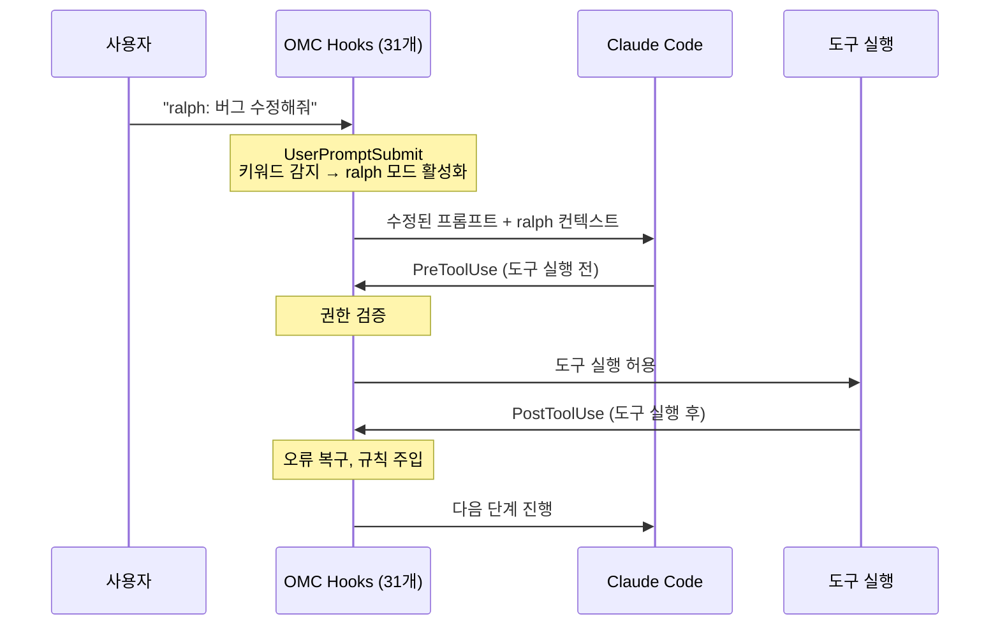
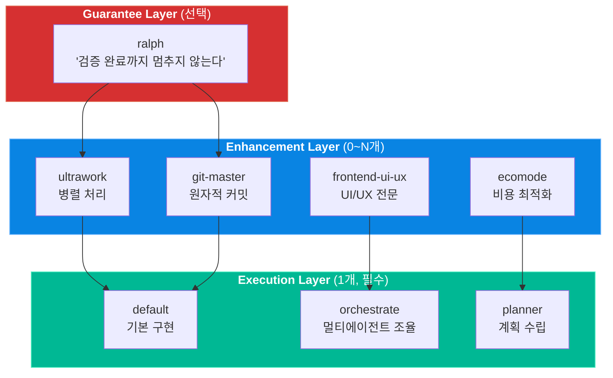

# 01. 핵심 아키텍처

oh-my-claudecode는 Claude Code CLI 위에 올라가는 "행동 주입(behavior injection)" 프레임워크입니다. 에이전트를 교체하는 방식이 아니라, 조합 가능한 스킬을 통해 Claude의 동작 방식 자체를 변경합니다. 이 장에서는 OMC가 기술적으로 어떻게 작동하는지, 플러그인 시스템의 내부 구조를 분석합니다.

---

## 목표

- [ ] 플러그인이 Claude Code의 행동을 변경하는 3가지 메커니즘(hooks, CLAUDE.md 주입, Task 위임)을 설명할 수 있다
- [ ] 3단계 스킬 조합(Execution + Enhancement + Guarantee) 구조를 설명할 수 있다
- [ ] `.omc/` 상태 관리 디렉토리의 역할을 이해한다

---

## 1. 플러그인 시스템의 동작 원리

OMC 플러그인은 `plugin.json` 매니페스트를 통해 Claude Code에 자신을 등록합니다. 등록된 플러그인은 세 가지 메커니즘으로 Claude의 행동을 제어합니다.

### 메커니즘 1: Hooks (이벤트 가로채기)

Hooks는 Claude Code의 생명주기 이벤트에 연결되는 콜백입니다. 사용자 입력이 전달되기 전, 도구가 실행되기 전후에 OMC가 개입할 수 있습니다.



| Hook 이벤트 | 시점 | OMC의 활용 |
|-------------|------|-----------|
| `UserPromptSubmit` | 사용자 입력 직후 | 키워드 감지, 모드 활성화 |
| `PreToolUse` | 도구 실행 직전 | 권한 검증, 파일 소유권 확인 |
| `PostToolUse` | 도구 실행 직후 | 오류 복구, 상태 업데이트 |
| `Stop` | 실행 중단 시 | 지속 실행 강제(ralph), 세션 종료 처리 |

### 메커니즘 2: CLAUDE.md 행동 주입

플러그인이 활성화되면, OMC는 프로젝트의 CLAUDE.md에 행동 지침을 주입합니다. Claude가 읽는 시스템 지침에 "이렇게 동작하라"는 규칙을 추가하는 것입니다. 스킬이 활성화될 때마다 해당 스킬의 행동 규칙이 CLAUDE.md를 통해 주입됩니다.

### 메커니즘 3: Task 도구 위임

OMC는 Claude Code의 `Task` 도구를 사용하여 전문화된 서브에이전트에 작업을 위임합니다. 32개의 에이전트가 복잡도(Haiku/Sonnet/Opus)에 따라 선택되며, 지휘자(orchestrator)가 적절한 에이전트에 작업을 분배합니다.

---

## 2. 4대 구성 요소의 수치

OMC 생태계는 다음과 같은 규모의 구성 요소를 포함합니다.

| 구성 요소 | 수량 | 설명 |
|-----------|------|------|
| **Skills** | 37개 | 행동 주입 단위 (execution/enhancement/guarantee) |
| **Agents** | 32개 | 전문화된 서브에이전트 (12 기본 + 16 tiered + 4 전문) |
| **Tools** | 15개 | MCP 도구 (LSP 12 + AST 2 + Python REPL 1) |
| **Hooks** | 31개 | 생명주기 이벤트 핸들러 |

---

## 3. 3단계 스킬 조합 시스템

OMC의 핵심 설계 철학은 **스킬의 조합**입니다. 단일 스킬이 아니라 여러 스킬을 레이어처럼 쌓아서 원하는 동작을 만들어냅니다.



### 공식

```
[Execution Skill] + [0-N Enhancement] + [Optional Guarantee]
```

### 조합 예시

| 사용자 요청 | 활성화되는 스킬 | 의미 |
|-------------|----------------|------|
| "ultrawork: API 리팩토링하고 커밋해줘" | `default` + `ultrawork` + `git-master` | 기본 구현 + 병렬 처리 + 자동 커밋 |
| "ralph: 테스트 통과할 때까지 반복해줘" | `default` + `ralph` | 기본 구현 + 검증까지 지속 |
| "계획 세우고 검증해줘" | `planner` + `ralph` | 계획 수립 + 검증 반복 |
| "비용 최적화해서 병렬 처리해" | `default` + `ultrawork` + `ecomode` | 기본 구현 + 병렬 + 저비용 모델 |

스킬 감지는 사용자의 자연어 입력에서 키워드를 매칭하여 자동으로 이루어집니다. "ultrawork", "parallel", "fast" 같은 키워드가 감지되면 해당 스킬이 활성화됩니다.

---

## 4. 상태 관리

OMC는 프로젝트 루트의 `.omc/` 디렉토리에 실행 상태를 저장합니다.

```
.omc/
├── state/                    # 세션 상태
│   ├── ultrapilot.json       # ultrapilot 모드 상태
│   ├── swarm.json            # swarm 모드 상태
│   └── pipeline.json         # pipeline 상태
├── sessions/                 # 세션 기록
│   └── {session-id}.json     # 개별 세션 데이터
├── notepads/                 # 계획 스코프 메모
│   └── {plan-name}/         # 계획별 지식 캡처
└── plans/                    # 생성된 계획 문서
```

| 위치 | 범위 | 저장 내용 |
|------|------|-----------|
| `.omc/state/` | 프로젝트 로컬 | 현재 실행 모드, 에이전트 상태, 작업 풀 |
| `.omc/sessions/` | 프로젝트 로컬 | 세션별 토큰 사용량, 에이전트 기록 |
| `~/.omc/state/` | 전역 | 사용자 환경설정, 글로벌 설정 |

---

## 체크포인트

다음 질문에 면접에서 답변하듯이 설명할 수 있는지 확인하세요.

1. **OMC 플러그인이 Claude Code의 행동을 변경하는 3가지 메커니즘은 무엇인가요?**
2. **3단계 스킬 조합 시스템에서 각 레이어의 역할과 예시를 설명해주세요.**
3. **사용자가 "ultrawork: API 리팩토링하고 커밋해줘"라고 입력하면 어떤 과정이 일어나나요?**

<details>
<summary>모범 답안 확인</summary>

**1. 3가지 메커니즘**

첫째, Hooks입니다. 31개의 hooks가 Claude Code의 생명주기 이벤트(UserPromptSubmit, PreToolUse, PostToolUse, Stop)에 연결되어, 사용자 입력을 가로채고 키워드를 감지하여 모드를 활성화합니다. 둘째, CLAUDE.md 행동 주입입니다. 스킬이 활성화되면 해당 스킬의 행동 규칙이 CLAUDE.md를 통해 Claude의 시스템 지침에 추가됩니다. 셋째, Task 도구 위임입니다. 작업 복잡도에 따라 32개의 전문 에이전트 중 적절한 에이전트에 Task 도구를 통해 작업을 위임합니다.

**2. 3단계 스킬 조합**

Execution Layer는 필수 1개로, 작업의 기본 실행 방식을 결정합니다. `default`(직접 구현), `orchestrate`(멀티에이전트 조율), `planner`(계획 수립) 중 하나입니다. Enhancement Layer는 0개 이상으로, 실행 방식에 추가 능력을 부여합니다. `ultrawork`(병렬 처리), `git-master`(자동 커밋), `ecomode`(비용 최적화) 등입니다. Guarantee Layer는 선택적으로, `ralph`가 유일한 보장 스킬로 "검증이 완료될 때까지 절대 멈추지 않는다"는 보장을 제공합니다.

**3. ultrawork 리팩토링 요청의 처리 과정**

UserPromptSubmit hook이 입력에서 "ultrawork"과 "커밋" 키워드를 감지합니다. 스킬 조합이 결정됩니다: `default`(Execution) + `ultrawork`(Enhancement) + `git-master`(Enhancement). ultrawork 스킬이 작업을 원자적 단위로 분할하고, 각 에이전트에 배타적 파일 소유권을 할당합니다. 최대 5개 에이전트가 병렬로 작업을 처리하며, 완료된 작업마다 git-master가 원자적 커밋을 생성합니다.

</details>

---

다음 단계: [02-execution-modes](./02-execution-modes.md)
