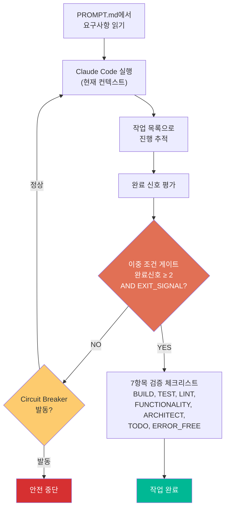
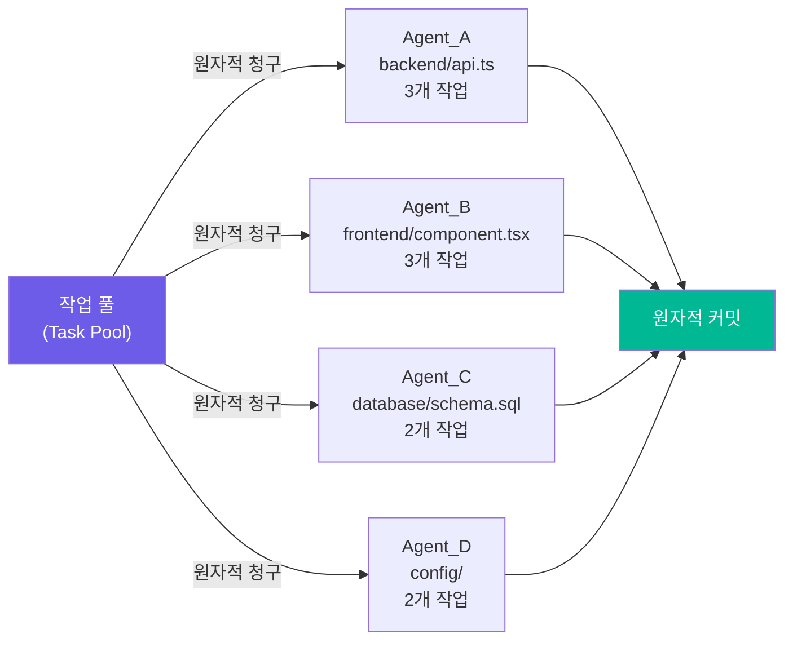
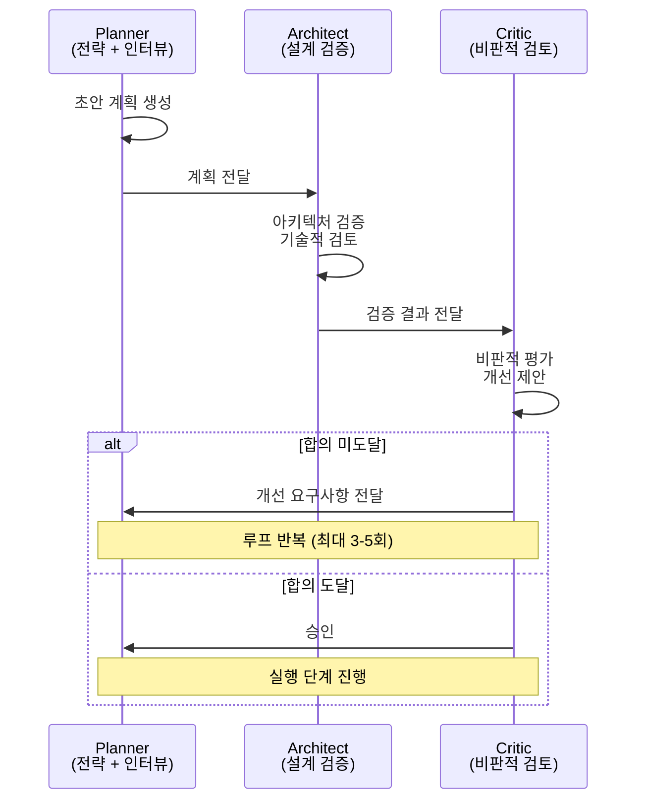
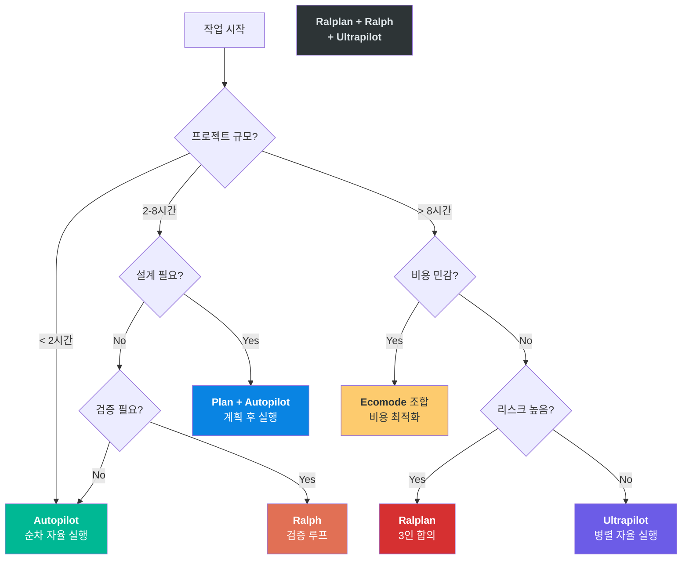

# 02. 실행 모드 8가지

oh-my-claudecode의 가장 강력한 기능은 작업의 성격에 맞는 실행 모드를 선택할 수 있다는 점입니다. 단순 버그 수정부터 대규모 병렬 리팩토링까지, 8가지 모드가 각각 다른 전략으로 작업을 처리합니다. 모드를 잘못 선택하면 비용을 낭비하거나 속도를 포기하게 되므로, 각 모드의 핵심 메커니즘과 적합한 상황을 정확히 이해하는 것이 중요합니다.

---

## 목표

- [ ] 8가지 실행 모드의 핵심 메커니즘과 차이점을 비교할 수 있다
- [ ] Ralph의 이중 조건 게이트와 Circuit Breaker를 설명할 수 있다
- [ ] 작업 성격에 따라 적합한 모드를 선택할 수 있다

---

## 1. Autopilot - 순차 자율 실행

가장 기본적인 모드입니다. 사용자의 요청을 받아 순차적으로 실행하며, 별도의 병렬화나 검증 루프 없이 한 번에 처리합니다.

**활성화**: 자연어 ("완료될 때까지 멈추지 마")
**특징**: 1개 워커, 순차 처리, 낮은 메모리
**적합한 상황**: 2시간 미만의 단순 작업, 명확한 요구사항

```
사용자: "로그인 페이지에 비밀번호 찾기 링크 추가해줘"
→ Autopilot이 순차적으로 파일 수정, 테스트 실행
```

---

## 2. Ralph - 자기 참조적 검증 루프

Ralph는 "작업이 완전히 검증될 때까지 절대 멈추지 않는" 보장(Guarantee) 모드입니다. 이중 조건 게이트와 Circuit Breaker라는 두 가지 안전장치를 통해, 무한 루프에 빠지지 않으면서도 확실한 완료를 보장합니다.

**활성화**: `ralph: 버그 수정해줘`
**핵심**: 이중 조건 게이트, 7항목 검증 체크리스트

### Ralph 실행 루프



### 이중 조건 게이트

Ralph는 종료하기 위해 두 가지 조건이 **모두** 충족되어야 합니다.

```
종료 = (완료 신호 ≥ 2) AND (EXIT_SIGNAL: true)
```

| 조건 | 설명 |
|------|------|
| **완료 신호 ≥ 2** | 자연어 패턴에서 "작업 완료" 의도가 2회 이상 감지 |
| **EXIT_SIGNAL: true** | Claude가 명시적으로 EXIT_SIGNAL을 true로 응답 |

하나만 충족되면 루프가 계속됩니다. 이 설계는 "거의 다 됐다"는 조기 종료를 방지합니다.

### Circuit Breaker (안전 차단기)

| 발동 조건 | 설명 |
|-----------|------|
| 3회 연속 무진전 | 동일 오류가 3번 연속 발생 |
| 5회 반복 동일 오류 | 같은 에러가 5번 이상 |
| 진행도 없음 | 루프에서 의미 있는 진전 미감지 |
| API 한도 초과 | 5시간 사용량 제한 도달 시 60분 대기 안내 |

### 검증 체크리스트 (7항목)

```
□ BUILD: 빌드 성공
□ TEST: 테스트 통과
□ LINT: 린트 통과
□ FUNCTIONALITY: 기능 동작 확인
□ ARCHITECT REVIEW: 아키텍처 검증 (Opus 티어)
□ TODO 완료: 모든 할일 항목 완료
□ ERROR_FREE: 에러 없음 상태
```

모든 증거는 **5분 이내의 최신 데이터**여야 하며, 실제 명령어 출력이 포함되어야 합니다.

---

## 3. Ultrawork - 최대 병렬화

파일 소유권 분할을 통해 충돌 없는 병렬 작업을 수행합니다. 최대 5개 에이전트가 동시에 서로 다른 파일을 수정합니다.

**활성화**: `ulw API 전체 리팩토링해줘`
**핵심**: 배타적 파일 소유권, 원자적 작업 청구, 5분 타임아웃

### 파일 파티셔닝



| 메커니즘 | 설명 |
|---------|------|
| 원자적 작업 청구 | 한 번에 한 에이전트만 작업 클레임 가능, 중복 청구 불가 |
| 배타적 파일 소유권 | 각 에이전트는 할당받은 파일만 수정 가능 |
| 5분 타임아웃 | 작업 미완료 시 자동으로 풀에 반환 |
| 원자적 커밋 | 변경사항은 자동으로 개별 커밋 생성 |

---

## 4. Plan - 계획 수립 인터뷰

실행 전에 5단계 인터뷰를 통해 요구사항을 명확히 하고, 계획 문서를 작성한 후에야 실행에 들어가는 모드입니다. 계획 단계는 Opus가, 실행 단계는 Sonnet이 담당하여 **76% 토큰 절감** 효과를 얻습니다.

**활성화**: `plan 새로운 결제 시스템`
**핵심**: 5단계 인터뷰, Read-only 도구 제한, 모델 분리

### 인터뷰 워크플로우

```
Step 1: 사용자 초기 요청
Step 2: Claude가 명확화 질문 (엔드포인트? 인증? DB? 에러처리?)
Step 3: 사용자 응답 수집
Step 4: plan.md 생성
Step 5: 승인 → Sonnet 4.5로 실행
```

### 도구 제한

| 사용 가능 (Read-only) | 제한됨 (상태 변경) |
|----------------------|-------------------|
| Read, LS, Glob, Grep | Edit, Write |
| Task, TodoRead/TodoWrite | Bash |
| WebFetch, WebSearch | NotebookEdit |

---

## 5. Ralplan - 3인 전문가 합의 루프

3명의 전문가(Planner, Architect, Critic)가 계획을 반복적으로 검증하며 합의에 도달할 때까지 개선하는 모드입니다.

**활성화**: `ralplan 마이크로서비스 분리`
**핵심**: 3인 합의 루프, 최대 3-5회 반복

### 합의 루프



### 합의 도달 조건

```
합의 = Architect 검증 + Critic 승인 + Planner 확인
탈출: 3명 모두 동의 + 기술적 실현 가능 + 위험 완화 계획 수립
```

---

## 6. Ultrapilot - 병렬 Autopilot

Autopilot의 병렬 처리 버전입니다. Autopilot처럼 자율 실행하되, 파일 파티셔닝을 통해 3-5배 속도를 냅니다.

**활성화**: `ultrapilot: React 앱 구축`
**핵심**: Autopilot + 파일 소유권 분할 = 3-5배 속도

| 비교 | Autopilot | Ultrapilot |
|------|-----------|-----------|
| 실행 방식 | 순차 1개 워커 | 최대 5개 병렬 워커 |
| 속도 | 1x (기준선) | 3-5x |
| 메모리 | 낮음 | 중간~높음 |
| 적합한 상황 | 단순 작업 | 대규모 멀티 컴포넌트 |

---

## 7. Swarm - N개 에이전트 좌표 제어

정해진 작업 풀에서 N개의 에이전트가 원자적으로 작업을 청구하고, 완료하면 마킹하는 방식입니다. 대규모 반복 작업에 적합합니다.

**활성화**: `swarm: 100개 파일 리팩토링`
**핵심**: SQLite 기반 원자적 작업 청구, 5분 타임아웃

```
예: 100개 파일 리팩토링
→ 5개 에이전트가 20개씩 분산 처리
→ 타임아웃으로 병목 작업 자동 재할당
```

---

## 8. Ecomode - 비용 최적화 혼합

작업 복잡도에 따라 Haiku/Sonnet/Opus 모델을 자동 선택하여 30-50% 비용을 절감하는 모드입니다.

**활성화**: 다른 모드와 조합 사용
**핵심**: 모델 자동 라우팅, 30-50% 비용 절감

| 복잡도 | 모델 | 용도 |
|--------|------|------|
| 낮음 | Haiku | 빠른 조회, 간단한 로직 |
| 중간 | Sonnet | 표준 구현, 중간 복잡도 |
| 높음 | Opus | 아키텍처 결정, 복잡한 추론 |

---

## 모드 비교 요약

| 모드 | 병렬 | 지속 | 계획 | 속도 | 비용 | 사용 사례 |
|------|------|------|------|------|------|-----------|
| **Autopilot** | - | - | - | 1x | 중간 | 단순 작업 |
| **Ralph** | 자동 | O | - | ~1x | 중간 | 복잡한 버그 수정, 검증 필요 |
| **Ultrawork** | O | - | - | 3-5x | 높음 | 대규모 리팩토링 |
| **Plan** | - | - | O | 느림 | 낮음 | 새 기능 설계 |
| **Ralplan** | - | O | O | 느림 | 높음 | 중요 아키텍처 결정 |
| **Ultrapilot** | O | - | - | 3-5x | 높음 | 대규모 멀티 컴포넌트 |
| **Swarm** | O | - | - | 3-5x | 중간 | 많은 파일 분산 처리 |
| **Ecomode** | O | - | - | 2-3x | 낮음 | 비용 최적화 |

---

## 모드 선택 의사결정 트리



---

## 체크포인트

다음 질문에 면접에서 답변하듯이 설명할 수 있는지 확인하세요.

1. **Ralph의 이중 조건 게이트와 Circuit Breaker는 각각 어떤 문제를 해결하나요?**
2. **Ultrawork의 파일 파티셔닝이 왜 필요하며, 어떤 메커니즘으로 충돌을 방지하나요?**
3. **Plan 모드에서 Opus와 Sonnet을 분리하는 이유는 무엇인가요?**

<details>
<summary>모범 답안 확인</summary>

**1. Ralph의 안전장치**

이중 조건 게이트는 **조기 종료**를 방지합니다. "거의 다 됐다"는 한 번의 완료 신호만으로는 종료하지 않고, 완료 신호가 2회 이상 감지되고 동시에 EXIT_SIGNAL이 명시적으로 true여야 종료합니다. 이 설계는 불완전한 상태에서 작업이 끝나는 것을 막습니다. Circuit Breaker는 **무한 루프**를 방지합니다. 동일 오류 3회 연속, 5회 반복, 진전 없음 등의 조건에서 자동으로 루프를 중단하여 토큰 낭비와 무의미한 반복을 차단합니다.

**2. Ultrawork의 파일 파티셔닝**

여러 에이전트가 동시에 같은 파일을 수정하면 충돌이 발생합니다. 파일 파티셔닝은 각 에이전트에 배타적 파일 소유권을 부여하여 이 문제를 해결합니다. 원자적 작업 청구로 한 번에 한 에이전트만 작업을 클레임할 수 있고, 5분 타임아웃으로 미완료 작업이 자동 반환됩니다. 공유 파일은 원자적 커밋으로 보호합니다. 이 구조는 분산 시스템의 락(lock) 메커니즘과 동일한 원리입니다.

**3. Plan 모드의 모델 분리**

계획 수립은 고수준의 추론 능력이 필요하므로 Opus가 담당합니다. 하지만 Opus는 비용이 높아(입력 $15/1M, 출력 $75/1M), 실행 단계까지 Opus를 쓰면 비용이 과도합니다. 실행 단계는 명확한 계획을 따르면 되므로 Sonnet(입력 $3/1M, 출력 $15/1M)으로 충분합니다. 이 분리로 76% 토큰 비용을 절감하면서도, 계획의 품질은 Opus 수준을 유지합니다.

</details>

---

다음 단계: [03-agent-system](./03-agent-system.md)
