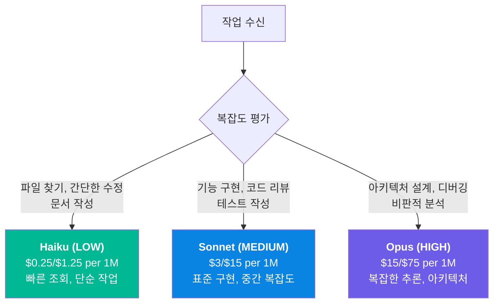
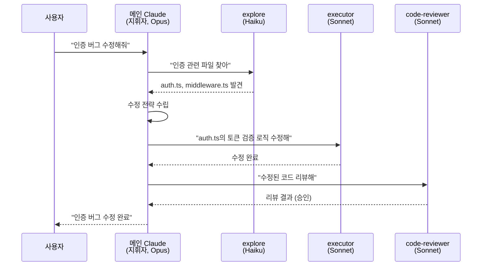

# 03. 에이전트 시스템

oh-my-claudecode는 32개의 전문화된 에이전트를 운용합니다. 각 에이전트는 특정 도메인에 최적화되어 있고, 작업 복잡도에 따라 3가지 모델 티어(Haiku/Sonnet/Opus) 중 하나가 자동 선택됩니다. 이 설계의 핵심 아이디어는 "모든 작업에 Opus를 쓸 필요가 없다"는 것입니다. 간단한 파일 탐색에 Opus를 쓰면 비용만 낭비하고, 복잡한 아키텍처 결정에 Haiku를 쓰면 품질이 떨어집니다.

---

## 목표

- [ ] 32개 에이전트의 카테고리(기본/전문/tiered)와 역할을 구분할 수 있다
- [ ] 3-Tier 모델 라우팅의 선택 기준을 설명할 수 있다
- [ ] Delegation-First 패턴(지휘자 패턴)의 장점을 설명할 수 있다

---

## 1. 에이전트 분류

32개 에이전트는 기본 에이전트 12개, 전문 에이전트 4개, 그리고 기본 에이전트의 tiered 변형 16개로 구성됩니다.

### 기본 에이전트 12개

메인 Claude(Opus)가 직접 처리하지 않고 위임하는 핵심 에이전트들입니다.

| 에이전트 | 역할 | 기본 모델 |
|---------|------|-----------|
| **architect** | 전략적 아키텍처 설계, 디버깅 조언 | Opus (READ-ONLY) |
| **researcher** | 외부 문서 조사, 레퍼런스 수집 | Sonnet |
| **explore** | 코드베이스 탐색, 파일/패턴 검색 | Haiku |
| **executor** | 집중 구현 작업, 코드 작성 | Sonnet |
| **designer** | UI/UX 디자인 + 프론트엔드 구현 | Sonnet |
| **writer** | 기술 문서 작성 (README, API docs) | Haiku |
| **vision** | 이미지/PDF/다이어그램 분석 | Sonnet |
| **critic** | 작업 계획 검토, 비판적 분석 | Opus |
| **analyst** | 요구사항 분석, 사전 계획 컨설팅 | Opus |
| **planner** | 전략적 계획 수립 + 인터뷰 워크플로우 | Opus |
| **qa-tester** | tmux 기반 대화형 CLI 테스트 | Sonnet |
| **scientist** | 데이터 분석, 연구 실행 | Sonnet |

### 전문 에이전트 4개

특정 작업에 특화된 에이전트로, 사전 활성(proactive) 사용이 권장됩니다.

| 에이전트 | 역할 | 사용 시점 |
|---------|------|-----------|
| **security-reviewer** | 보안 취약점 탐지 (OWASP Top 10) | 인증/API/입력 처리 코드 작성 후 |
| **build-fixer** | 빌드/타입 에러 최소 수정 | 빌드 실패 시 즉시 |
| **tdd-guide** | TDD 방법론 강제 (테스트 먼저) | 새 기능/버그 수정/리팩토링 시 |
| **code-reviewer** | 코드 품질/보안/유지보수성 리뷰 | 코드 작성/수정 직후 |

### 3-Tier 변형 16개

기본 에이전트 중 8개는 LOW/MEDIUM/HIGH 변형을 가집니다. 같은 역할이지만 복잡도에 따라 다른 모델을 사용합니다.

| 기본 에이전트 | LOW (Haiku) | MEDIUM (Sonnet) | HIGH (Opus) |
|-------------|-------------|-----------------|-------------|
| architect | `architect-low` | `architect-medium` | architect (기본) |
| explore | explore (기본) | `explore-medium` | `explore-high` |
| executor | `executor-low` | executor (기본) | `executor-high` |
| designer | `designer-low` | designer (기본) | `designer-high` |
| scientist | `scientist-low` | scientist (기본) | `scientist-high` |
| security-reviewer | `security-reviewer-low` | security-reviewer (기본) | - |
| build-fixer | `build-fixer-low` | build-fixer (기본) | - |
| tdd-guide | `tdd-guide-low` | tdd-guide (기본) | - |
| code-reviewer | `code-reviewer-low` | code-reviewer (기본) | - |

---

## 2. 3-Tier 모델 라우팅

### 모델별 비용 비교

| 모델 | 입력 토큰 | 출력 토큰 | 비용 비율 |
|------|-----------|-----------|-----------|
| Haiku | $0.25/1M | $1.25/1M | **1x** (기준) |
| Sonnet | $3/1M | $15/1M | **12x** |
| Opus | $15/1M | $75/1M | **60x** |

Opus는 Haiku의 60배 비용입니다. 간단한 파일 탐색에 Opus를 쓰면 60배의 비용을 불필요하게 지불하게 됩니다. 3-Tier 라우팅은 이 낭비를 자동으로 방지합니다.

---

## 3. Delegation-First 패턴

OMC의 핵심 작업 방식은 **지휘자 패턴(Conductor Pattern)**입니다. 메인 Claude(Opus)는 직접 구현하지 않고, 적절한 에이전트에 작업을 위임합니다.

### 왜 위임하는가?

| 직접 처리 | 위임 패턴 |
|-----------|-----------|
| 모든 작업을 Opus가 처리 | 탐색은 Haiku, 구현은 Sonnet, 판단만 Opus |
| 비용: $15-75/1M (모든 단계) | 비용: 단계별 최적 모델 ($0.25~75/1M) |
| 컨텍스트 창 1개에 모든 정보 | 에이전트별 독립 컨텍스트 (병렬 가능) |
| 컨텍스트 초과 위험 높음 | 메인 컨텍스트 오염 최소화 |

위임 패턴의 핵심 이점은 비용 절감과 컨텍스트 보호입니다. 탐색 결과 10,000줄을 메인 컨텍스트에 넣는 대신, explore 에이전트가 독립적으로 탐색하고 핵심 결과만 반환하면 메인 컨텍스트가 깨끗하게 유지됩니다.

---

## 4. 에이전트 선택 가이드

| 하고 싶은 것 | 에이전트 | 이유 |
|-------------|---------|------|
| 파일/코드 찾기 | `explore` (Haiku) | 빠르고 저렴 |
| 기능 구현 | `executor` (Sonnet) | 표준 구현 능력 |
| 복잡한 구현 | `executor-high` (Opus) | 복잡한 로직 처리 |
| 아키텍처 조언 | `architect` (Opus) | READ-ONLY, 변경 안 함 |
| 보안 검토 | `security-reviewer` | OWASP Top 10 체크 |
| 빌드 에러 수정 | `build-fixer` | 최소 변경으로 빌드 복구 |
| 문서 작성 | `writer` (Haiku) | 빠르고 충분한 품질 |
| 계획 수립 | `planner` (Opus) | 전략적 판단 필요 |

---

## 체크포인트

다음 질문에 면접에서 답변하듯이 설명할 수 있는지 확인하세요.

1. **3-Tier 모델 라우팅에서 Haiku, Sonnet, Opus는 각각 어떤 기준으로 선택되나요?**
2. **Delegation-First 패턴이 직접 처리보다 유리한 이유 2가지를 설명해주세요.**
3. **기본 에이전트와 tiered 변형의 관계를 설명하고, architect-low와 architect의 차이를 예시로 들어주세요.**

모범 답안 확인

**1. 3-Tier 모델 선택 기준**

Haiku(LOW)는 간단한 조회, 파일 탐색, 문서 작성 등 추론이 거의 필요 없는 작업에 사용됩니다. 비용이 가장 저렴하고 속도가 빠릅니다. Sonnet(MEDIUM)은 기능 구현, 코드 리뷰, 테스트 작성 등 중간 복잡도 작업의 표준 선택지입니다. 대부분의 구현 작업은 Sonnet으로 충분합니다. Opus(HIGH)는 복잡한 아키텍처 설계, 디버깅의 근본 원인 분석, 비판적 리뷰 등 고수준 추론이 필요한 작업에만 사용됩니다. Opus는 Haiku의 60배 비용이므로, 정말 필요한 경우에만 투입됩니다.

**2. Delegation-First 패턴의 이점**

첫째, 비용 최적화입니다. 모든 단계를 Opus가 처리하면 일관된 고비용이 발생하지만, 위임 패턴은 탐색(Haiku), 구현(Sonnet), 판단(Opus)으로 분리하여 단계별 최적 모델을 사용합니다. 둘째, 컨텍스트 보호입니다. 에이전트가 독립 컨텍스트에서 작업하고 핵심 결과만 반환하므로, 대량의 탐색 결과나 중간 산출물이 메인 컨텍스트를 오염시키지 않습니다. 이는 컨텍스트 창 초과를 방지하고 작업의 일관성을 유지합니다.

**3. 기본 에이전트와 tiered 변형**

기본 에이전트는 기본 모델 티어가 고정되어 있습니다. architect는 Opus, explore는 Haiku가 기본입니다. tiered 변형은 같은 역할을 다른 모델로 수행합니다. architect-low(Haiku)는 간단한 코드 질문이나 빠른 조회에 사용되며, architect(Opus)는 깊은 아키텍처 분석이나 디버깅 조언에 사용됩니다. 같은 "아키텍처" 도메인이지만, "이 함수의 역할이 뭐야?"(Haiku)와 "이 시스템의 확장성 병목은 어디야?"(Opus)는 필요한 추론 깊이가 다르므로, 비용 효율을 위해 티어를 분리합니다.

---

다음 단계: [04-hud-monitoring](./04-hud-monitoring.md)
