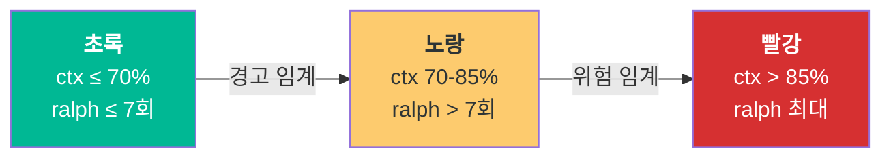

# 04. HUD 실시간 모니터링

Claude Code로 장시간 작업을 맡기면 "지금 뭘 하고 있는 거지?"라는 의문이 생깁니다. 터미널이 조용해지면 작업 중인지 멈춘 건지 알 수 없고, 컨텍스트 윈도우가 갑자기 초과되면 작업이 중단됩니다. HUD(Heads-Up Display)는 이 블랙박스를 투명하게 만듭니다. 터미널 하단 상태 표시줄 한 줄로 현재 모드, 컨텍스트 사용량, 에이전트 상태를 실시간으로 보여줍니다.

---

## 목표

- [ ] HUD 상태 표시줄의 각 요소를 해석할 수 있다
- [ ] 3가지 프리셋(minimal/focused/full)의 차이를 설명할 수 있다
- [ ] 색상 코드를 보고 즉시 대응 방법을 판단할 수 있다

---

## 1. 표시 요소 해석

HUD의 기본 프리셋(focused)은 다음과 같은 형태로 표시됩니다.

```
[OMC] ralph:3/10 | US-002 | ultrawork skill:planner | ctx:67% | agents:2 | bg:3/5 | todos:2/5
```

각 요소의 의미를 분해합니다.

| 요소 | 의미 | 해석 예시 |
|------|------|-----------|
| `[OMC]` | OMC 플러그인 활성화 표시 | 플러그인 정상 동작 중 |
| `ralph:3/10` | Ralph 반복 횟수/최대 | 10회 중 3번째 반복 진행 |
| `US-002` | 현재 PRD 스토리 ID | PRD 기반 작업 추적 |
| `ultrawork` | 활성 실행 모드 뱃지 | ultrawork 모드 동작 중 |
| `skill:planner` | 마지막 실행 스킬 | planner 스킬 사용 중 |
| `ctx:67%` | 컨텍스트 윈도우 사용량 | 전체의 67% 사용 |
| `agents:2` | 실행 중인 서브에이전트 수 | 2개 에이전트 병렬 동작 |
| `bg:3/5` | 백그라운드 작업 현황 | 5개 슬롯 중 3개 사용 |
| `todos:2/5` | 할일 진행률 | 5개 중 2개 완료 |

### 컨텍스트 사용량 계산식

```
ctx% = (input_tokens + cache_creation_input_tokens + cache_read_input_tokens)
       ÷ context_window_size
       × 100
```

HUD는 Claude Code의 JSON 로그 페이로드 스트림에서 `tool_use` 블록을 감지하고, 토큰 수를 실시간으로 계산하여 표시합니다.

---

## 2. 3가지 프리셋

### Minimal (최소)

핵심 정보만 표시합니다. 화면이 좁거나 기본 상태 확인만 필요할 때 사용합니다.

```
[OMC] ralph | ultrawork | todos:2/5
```

### Focused (기본, 권장)

대부분의 상황에 적합한 기본 프리셋입니다.

```
[OMC] ralph:3/10 | US-002 | ultrawork skill:planner | ctx:67% | agents:2 | bg:3/5 | todos:2/5
```

### Full (전체)

에이전트별 상세 상태까지 표시합니다. 병렬 작업 디버깅 시 유용합니다.

```
[OMC] ralph:3/10 | US-002 (2/5) | ultrawork | ctx:[████░░]67% | agents:3 | bg:3/5 | todos:2/5
├─ O architect    2m   analyzing architecture patterns...
├─ e explore     45s   searching for test files
└─ s executor     1m   implementing validation logic
```

Full 모드에서는 각 에이전트의 모델(O=Opus, s=Sonnet, e=explore/Haiku), 실행 시간, 현재 작업 내용이 트리 형태로 표시됩니다.

### 프리셋 변경

```bash
# Claude Code 내에서
/oh-my-claudecode:hud minimal
/oh-my-claudecode:hud focused
/oh-my-claudecode:hud full
```

---

## 3. 색상 코드와 대응

HUD는 색상으로 현재 상태의 위험도를 알려줍니다.



| 색상 | 조건 | 의미 | 대응 |
|------|------|------|------|
| **초록** | ctx ≤ 70%, ralph ≤ 7회 | 정상 | 작업 계속 |
| **노랑** | ctx 70-85% 또는 ralph > 7회 | 경고 | 새 세션 준비, 문제 재정의 고려 |
| **빨강** | ctx > 85% 또는 ralph 최대 | 위험 | 즉시 새 세션 시작 또는 작업 중단 |

### 상황별 대응 가이드

- **ctx 70% 도달**: 현재 작업을 마무리하고 새 세션 시작을 고려합니다. 컨텍스트 압축이 발생하면 초기 지침이 손실될 수 있습니다.
- **ralph 7회 초과**: 동일 문제를 반복하고 있을 가능성이 높습니다. 문제를 재정의하거나 접근 방식을 변경해야 합니다.
- **agents 5개**: 최대 병렬 슬롯에 도달했습니다. 추가 에이전트 투입이 필요하면 기존 작업 완료를 기다려야 합니다.

---

## 4. 설정 커스터마이즈

### 설정 파일

`~/.claude/.omc/hud-config.json`:

```json
{
  "preset": "focused",
  "elements": {
    "omcLabel": true,
    "ralph": true,
    "prdStory": true,
    "activeSkills": true,
    "lastSkill": true,
    "contextBar": true,
    "agents": true,
    "backgroundTasks": true,
    "todos": true,
    "showCache": true,
    "showCost": true,
    "maxOutputLines": 4
  },
  "thresholds": {
    "contextWarning": 70,
    "contextCritical": 85,
    "ralphWarning": 7
  }
}
```

### 주요 조정 항목

| 옵션 | 설명 | 기본값 |
|------|------|--------|
| `preset` | 표시 프리셋 | `"focused"` |
| `contextWarning` | 컨텍스트 경고 임계값(%) | 70 |
| `contextCritical` | 컨텍스트 위험 임계값(%) | 85 |
| `ralphWarning` | Ralph 반복 경고 횟수 | 7 |
| `maxOutputLines` | Full 모드 에이전트 표시 줄 수 | 4 |

---

## 체크포인트

다음 질문에 면접에서 답변하듯이 설명할 수 있는지 확인하세요.

1. **HUD에 `ctx:78%`가 노란색으로 표시됩니다. 이 상황의 의미와 대응 방법은?**
2. **Full 프리셋에서 `O architect 2m`은 무엇을 의미하나요?**
3. **HUD가 없었다면 어떤 문제가 발생할 수 있나요?**

<details>
<summary>모범 답안 확인</summary>

**1. ctx:78% 노란색의 의미와 대응**

컨텍스트 윈도우의 78%가 사용되었다는 뜻입니다. 기본 경고 임계값(70%)을 초과했으므로 노란색으로 표시됩니다. 85%를 넘으면 빨간색으로 전환되며, 컨텍스트 압축이 발생하여 초기 지침이나 중요한 컨텍스트가 손실될 수 있습니다. 대응으로는 현재 진행 중인 작업을 최대한 빠르게 마무리하고, 새 세션 시작을 준비해야 합니다. 작업이 길어질 것으로 예상되면 지금 중간 결과를 저장하고 새 세션에서 이어가는 것이 안전합니다.

**2. Full 프리셋의 에이전트 표시**

`O`는 Opus 모델을 의미합니다(s=Sonnet, e=Haiku 등). `architect`는 에이전트 이름이고, `2m`은 해당 에이전트가 2분 동안 실행 중이라는 의미입니다. 즉, Opus 모델의 architect 에이전트가 2분간 아키텍처 패턴을 분석하고 있다는 상태입니다. 이 정보를 통해 어떤 에이전트가 얼마나 오래 작업 중인지 파악하고, 비정상적으로 오래 걸리는 에이전트를 식별할 수 있습니다.

**3. HUD 없이 발생하는 문제**

첫째, 컨텍스트 초과 감지 불가입니다. 컨텍스트 창이 얼마나 찼는지 알 수 없어 갑자기 압축이 발생하고, 중요한 지침이 손실됩니다. 둘째, 무한 루프 감지 불가입니다. Ralph가 동일 작업을 반복하고 있는지 시각적으로 확인할 수 없어 토큰을 낭비합니다. 셋째, 작업 투명성 부재입니다. 터미널이 조용해졌을 때 Claude가 작업 중인지, 멈춘 건지, 에러를 만난 건지 판단할 수 없습니다.

</details>

---

다음 단계: [05-cli-analytics](./05-cli-analytics.md)
