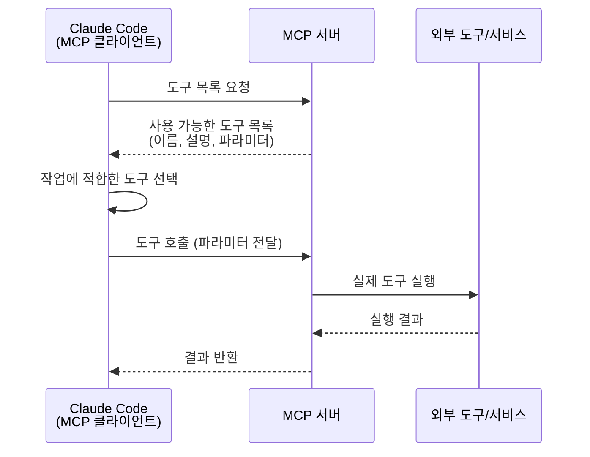

# 06. MCP 도구 통합

Claude Code는 기본적으로 학습 데이터 기준의 지식만 보유합니다. 2026년에 출시된 라이브러리의 최신 API를 모르고, 실시간 웹 정보에 접근할 수 없습니다. MCP(Model Context Protocol)는 이 한계를 해결하는 표준 프로토콜로, 외부 도구와 Claude Code를 연결하는 다리 역할을 합니다. OMC는 여기에 15개의 커스텀 도구(LSP 12 + AST 2 + Python REPL 1)를 추가하여 코드 분석 능력을 대폭 강화합니다.

---

## 목표

- [ ] MCP 프로토콜의 서버/클라이언트 구조를 설명할 수 있다
- [ ] OMC의 15개 커스텀 MCP 도구를 카테고리별로 구분할 수 있다
- [ ] 외부 MCP 서버(Context7, Exa)의 용도와 설정 방법을 이해한다

---

## 1. MCP 프로토콜 이해

MCP는 AI 모델이 외부 도구를 **발견하고 사용하는** 표준 프로토콜입니다. Claude Code(클라이언트)가 MCP 서버에 "어떤 도구가 있어?"라고 물으면, 서버가 사용 가능한 도구 목록을 반환합니다. Claude는 이 목록에서 적절한 도구를 선택하여 호출합니다.



### 핵심 개념

| 개념 | 설명 |
|------|------|
| **MCP 클라이언트** | Claude Code. 도구를 발견하고 호출하는 주체 |
| **MCP 서버** | 도구를 제공하는 프로세스. `~/.mcp.json`에 등록 |
| **도구 발견** | 서버 시작 시 자동으로 사용 가능한 도구 목록 획득 |
| **도구 호출** | Claude가 작업에 필요한 도구를 자동 선택하여 실행 |

---

## 2. OMC 커스텀 MCP 도구 (15개)

OMC는 코드 분석에 특화된 15개 MCP 도구를 제공합니다.

### LSP 도구 12개

LSP(Language Server Protocol)를 통해 IDE 수준의 코드 분석 기능을 Claude Code에 제공합니다.

| 도구 | 기능 | 사용 예시 |
|------|------|-----------|
| `lsp_hover` | 심볼의 타입 정보, 문서 조회 | "이 변수의 타입이 뭐야?" |
| `lsp_goto_definition` | 심볼 정의 위치로 이동 | "이 함수가 어디서 정의됐어?" |
| `lsp_find_references` | 심볼의 모든 참조 검색 | "이 함수를 누가 호출해?" |
| `lsp_diagnostics` | 파일의 에러/경고/힌트 조회 | "이 파일에 에러 있어?" |
| `lsp_diagnostics_directory` | 프로젝트 전체 진단 (tsc --noEmit) | "빌드 에러가 어디있어?" |
| `lsp_document_symbols` | 파일의 심볼 계층 구조 | "이 파일의 함수/클래스 목록" |
| `lsp_workspace_symbols` | 워크스페이스 전체 심볼 검색 | "UserService 클래스 어디있어?" |
| `lsp_code_actions` | 가능한 코드 액션(리팩토링) 조회 | "여기서 가능한 수정 사항은?" |
| `lsp_code_action_resolve` | 코드 액션의 상세 편집 내용 | 액션 적용 시 변경사항 미리보기 |
| `lsp_prepare_rename` | 리네임 가능 여부 확인 | "이 변수 이름 바꿀 수 있어?" |
| `lsp_rename` | 프로젝트 전체 심볼 리네임 | "변수명 변경 (모든 파일)" |
| `lsp_servers` | 설치된 언어 서버 목록 | "어떤 LSP 서버가 있어?" |

### AST Grep 도구 2개

텍스트 검색이 아닌 AST(추상 구문 트리) 기반으로 코드 패턴을 정확하게 매칭합니다.

| 도구 | 기능 |
|------|------|
| `ast_grep_search` | AST 패턴 검색 (17개 언어 지원) |
| `ast_grep_replace` | AST 패턴 교체 (구조적 코드 변환) |

**패턴 문법**:

| 메타변수 | 의미 | 예시 |
|---------|------|------|
| `$NAME` | 단일 AST 노드 매칭 | `useState($INIT)` |
| `$$$ARGS` | 0개 이상 노드 매칭 | `console.log($$$ARGS)` |

```bash
# 모든 useState 호출 찾기
ast_grep_search: pattern="useState($INIT)", language="tsx"

# console.log → logger.info 변환
ast_grep_replace: pattern="console.log($MSG)", replacement="logger.info($MSG)", language="js"
```

텍스트 grep은 주석이나 문자열 안의 `useState`도 매칭하지만, AST grep은 실제 코드의 함수 호출만 정확하게 찾습니다.

### Python REPL 1개

| 도구 | 기능 |
|------|------|
| `python_repl` | 영속적 Python 실행 환경 (pandas, numpy, matplotlib 지원) |

세션 간 변수가 유지되어 데이터 분석이나 과학 컴퓨팅에 적합합니다.

---

## 3. 외부 MCP 서버

### Context7 - 라이브러리 문서

최신 라이브러리/프레임워크 문서를 실시간으로 조회합니다. API 키가 불필요합니다.

```json
{
  "context7": {
    "command": "npx",
    "args": ["-y", "@upstash/context7-mcp"]
  }
}
```

Claude에게 "React 19의 새로운 훅 사용법 알려줘"라고 하면, Context7이 자동으로 최신 React 문서에서 해당 내용을 조회하여 학습 데이터에 없는 최신 정보를 제공합니다.

### Exa - 향상된 웹 검색

기본 웹 검색보다 정확하고 개발 콘텐츠에 최적화된 검색 결과를 제공합니다.

```json
{
  "exa": {
    "command": "npx",
    "args": ["-y", "exa-mcp-server"],
    "env": {
      "EXA_API_KEY": "your-api-key"
    }
  }
}
```

### 추가 가능한 MCP 서버

| MCP 서버 | 용도 | 요구사항 |
|----------|------|---------|
| **GitHub MCP** | 이슈, PR, 리포지토리 관리 | Docker, GitHub PAT |
| **Filesystem MCP** | 지정 디렉토리 확장 파일 접근 | Node.js 18+ |

---

## 4. 도구 선택 가이드

| 하고 싶은 것 | 도구 | 이유 |
|-------------|------|------|
| 함수 정의 위치 찾기 | `lsp_goto_definition` | 정확한 정의 위치 |
| 함수 사용처 찾기 | `lsp_find_references` | 모든 참조 검색 |
| 코드 패턴 검색 | `ast_grep_search` | 주석/문자열 제외 |
| 코드 패턴 변환 | `ast_grep_replace` | 구조적 일괄 변환 |
| 빌드 에러 찾기 | `lsp_diagnostics_directory` | 프로젝트 전체 진단 |
| 텍스트 검색 | Grep | 빠르고 간단 |
| 최신 라이브러리 문서 | Context7 | 실시간 문서 조회 |
| 웹 검색 | Exa | 개발 콘텐츠 최적화 |

---

## 체크포인트

다음 질문에 면접에서 답변하듯이 설명할 수 있는지 확인하세요.

1. **MCP 프로토콜에서 "도구 발견" 단계가 왜 필요한가요?**
2. **AST grep이 텍스트 grep보다 유리한 상황은 언제인가요?**
3. **LSP 도구와 외부 MCP 서버(Context7, Exa)의 역할 차이는 무엇인가요?**

<details>
<summary>모범 답안 확인</summary>

**1. 도구 발견 단계의 필요성**

MCP 서버는 다양한 도구를 제공하며, 서버마다 도구 구성이 다릅니다. 도구 발견 단계에서 Claude Code는 현재 연결된 모든 MCP 서버의 도구 목록, 파라미터 설명, 사용법을 자동으로 획득합니다. 이를 통해 Claude가 하드코딩 없이도 새로운 도구를 동적으로 인식하고 사용할 수 있습니다. 새 MCP 서버를 추가하면 Claude Code 재시작만으로 자동 통합되는 확장성의 핵심입니다.

**2. AST grep의 장점**

코드에서 `useState`를 텍스트 grep으로 검색하면, 주석(`// useState로 상태 관리`), 문자열(`"useState is a hook"`), 변수명(`const useStateManager`) 등 코드가 아닌 부분도 매칭됩니다. AST grep은 구문 트리 레벨에서 매칭하므로, 실제 함수 호출인 `useState()`만 정확하게 찾습니다. 리팩토링 대상을 식별하거나, 특정 패턴의 코드를 일괄 변환할 때 오탐을 방지할 수 있습니다.

**3. LSP 도구 vs 외부 MCP 서버**

LSP 도구는 프로젝트 코드베이스를 분석합니다. 함수 정의, 참조, 타입 정보, 빌드 에러 등 "내 코드"에 대한 정보를 제공합니다. 외부 MCP 서버는 프로젝트 외부의 정보를 가져옵니다. Context7은 최신 라이브러리 문서를, Exa는 웹 검색 결과를 제공합니다. LSP는 "내 코드가 어떻게 되어 있는지", 외부 MCP는 "외부 세계에서 어떤 정보가 필요한지"를 담당합니다.

</details>

---

다음 단계: [07-multi-ai-orchestration](./07-multi-ai-orchestration.md)
