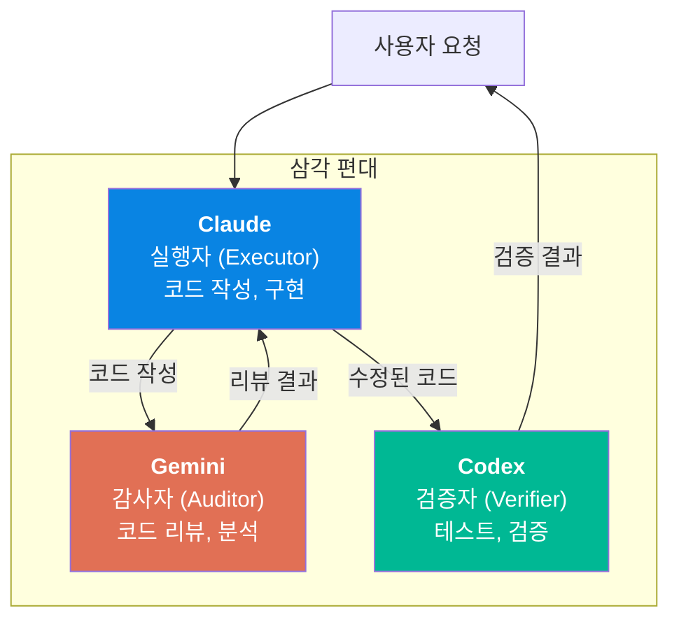
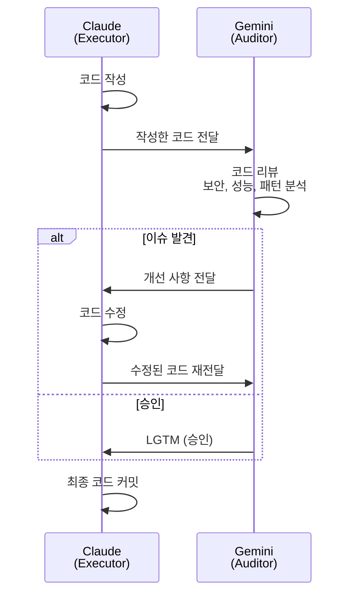

# 07. Multi-AI 오케스트레이션

2026년 AI 코딩 생태계는 단일 AI 시대를 넘어섰습니다. Claude, Gemini, Codex가 각각 다른 강점을 가지며, 이들을 조합하면 단일 AI보다 높은 품질과 효율을 달성할 수 있습니다. Claude가 코드를 작성하고, Gemini가 검토하고, Codex가 테스트를 검증하는 삼각 편대 구조는 인간 팀의 역할 분담과 동일한 원리입니다. 이 장에서는 Multi-AI 협업의 패턴, 도구, 비용/효율 구조를 분석합니다.

---

## 목표

- [ ] Claude, Gemini, Codex의 강점과 역할 분담을 설명할 수 있다
- [ ] Dual-Agent 패턴(교차 검증)의 동작 방식을 이해한다
- [ ] tmux를 활용한 Multi-AI 세션 레이아웃을 구성할 수 있다

---

## 1. 삼각 편대: Claude + Gemini + Codex

각 AI는 서로 다른 영역에서 강점을 가집니다. 이 차이를 활용하여 역할을 분담합니다.



### 역할별 강점

| AI | 역할 | 강점 | 약점 |
|----|------|------|------|
| **Claude** (Code) | 실행자 | 복잡한 구현, 긴 컨텍스트, 안전성 | 자기 코드 맹점 |
| **Gemini** (CLI) | 감사자 | 1M 토큰 컨텍스트, 외부 시각 | 구현 일관성 |
| **Codex** (CLI) | 검증자 | 샌드박스 실행, 자동 테스트 | 창의적 설계 |

핵심 통찰: 자기가 작성한 코드의 버그는 자기가 찾기 어렵습니다. 외부 AI가 검토하면 "다른 관점"에서 문제를 발견할 수 있습니다. 이것은 인간 팀에서 코드 리뷰가 필수인 것과 같은 이유입니다.

---

## 2. Dual-Agent 패턴: 교차 검증

가장 실용적인 Multi-AI 패턴은 Dual-Agent(이중 에이전트) 구조입니다. 한 AI가 작성하고, 다른 AI가 검증합니다.



### 실전 워크플로우

```bash
# tmux 레이아웃 (3분할)
# ┌─────────────────────────────────────┐
# │         Claude Code (실행)          │
# ├──────────────────┬──────────────────┤
# │  Gemini (리뷰)   │  Codex (검증)   │
# └──────────────────┴──────────────────┘

# 1. Claude가 코드 작성
# (Claude Code 세션에서)
"인증 미들웨어 구현해줘"

# 2. Gemini가 리뷰
# (Gemini 세션에서)
"이 코드를 보안 관점에서 리뷰해줘: [코드 전달]"

# 3. Codex가 테스트 검증
# (Codex 세션에서)
"이 코드의 테스트를 작성하고 실행해줘: [코드 전달]"
```

---

## 3. 2026년 생태계 도구

Multi-AI 오케스트레이션을 지원하는 2026년 주요 도구입니다.

| 도구 | 기능 | 상태 |
|------|------|------|
| **Claude Octopus** | Claude CLI의 멀티 세션 관리 | 커뮤니티 |
| **AgentMux** | 여러 AI CLI를 tmux에서 통합 관리 | 커뮤니티 |
| **Claude Code Bridge** | Claude ↔ 다른 AI 간 데이터 전달 자동화 | 커뮤니티 |
| **AWS CAO** | Claude Agent Orchestrator, 클라우드 기반 AI 오케스트레이션 | AWS |

### tmux 연계 레이아웃

Multi-AI 작업에 tmux는 필수 도구입니다. 하나의 터미널에서 여러 AI CLI를 동시에 실행하고, 결과를 비교할 수 있습니다.

```bash
# Multi-AI 세션 생성
tmux new-session -s multi-ai -d

# 3분할 레이아웃
tmux split-window -h -t multi-ai
tmux split-window -v -t multi-ai:0.1

# 각 패인에 AI CLI 배치
tmux send-keys -t multi-ai:0.0 'claude' Enter      # Claude Code
tmux send-keys -t multi-ai:0.1 'gemini' Enter       # Gemini CLI
tmux send-keys -t multi-ai:0.2 'codex' Enter        # Codex CLI

# 세션 연결
tmux attach -t multi-ai
```

---

## 4. 비용과 효율

### 구독 비용

| 플랜 | 월 비용 | 용도 |
|------|---------|------|
| Claude Pro | $20/month | 메인 실행 |
| Gemini Advanced | $20/month | 리뷰/분석 |
| ChatGPT Plus (Codex) | $20/month | 테스트/검증 |
| **합계** | **~$60/month** | 삼각 편대 |

### 역할 분담 최적화

모든 작업에 3개 AI를 투입할 필요는 없습니다. 작업의 중요도와 복잡도에 따라 투입 AI를 결정합니다.

| 작업 유형 | 투입 AI | 이유 |
|-----------|---------|------|
| 간단한 버그 수정 | Claude만 | 오버킬 방지 |
| 보안 민감 코드 | Claude + Gemini | 교차 보안 검토 |
| 프로덕션 배포 | Claude + Gemini + Codex | 최대 검증 |
| 아키텍처 설계 | Claude + Gemini | 다각적 설계 검토 |

### 효율 극대화 원칙

1. **독립성**: 각 AI의 결과가 다른 AI에 영향받지 않아야 합니다 (독립적 검증)
2. **전문화**: 각 AI의 강점에 맞는 역할만 할당합니다
3. **비용 인식**: 단순 작업에 3중 검증은 비용 낭비입니다
4. **자동화**: 수동 복사-붙여넣기 대신 도구로 자동 전달합니다

---

## 5. Single-AI vs Multi-AI 비교

| 측면 | Single-AI (Claude만) | Multi-AI (삼각 편대) |
|------|---------------------|---------------------|
| 비용 | $20/month | ~$60/month |
| 코드 리뷰 | 자기 코드 맹점 존재 | 외부 시각 확보 |
| 테스트 검증 | 작성자 편향 가능 | 독립적 검증 |
| 속도 | 빠름 (단일 흐름) | 느릴 수 있음 (교차 대기) |
| 설정 복잡도 | 낮음 | 높음 (tmux + 도구) |
| 적합한 상황 | 일상 개발, 프로토타입 | 프로덕션, 보안 민감 코드 |

---

## 체크포인트

다음 질문에 면접에서 답변하듯이 설명할 수 있는지 확인하세요.

1. **Claude가 자기 코드의 버그를 찾기 어려운 이유와, Multi-AI가 이를 해결하는 원리는?**
2. **모든 작업에 삼각 편대를 투입하지 않는 이유는 무엇인가요?**
3. **Dual-Agent 패턴에서 Gemini가 Claude보다 리뷰에 적합한 이유는?**

<details>
<summary>모범 답안 확인</summary>

**1. 자기 코드 맹점과 Multi-AI 해결**

AI도 인간 개발자처럼 "확증 편향"이 있습니다. 자기가 작성한 코드의 로직을 "이렇게 동작할 것"이라고 가정하고 검토하기 때문에, 실제 엣지 케이스나 논리적 오류를 간과합니다. Multi-AI에서 Gemini는 Claude의 코드를 처음 보는 입장에서 검토합니다. 코드 작성 의도를 모르기 때문에 오히려 순수하게 코드의 동작만 분석하고, Claude가 놓친 문제를 발견할 확률이 높아집니다. 이것은 인간 팀에서 코드 리뷰가 작성자가 아닌 다른 사람이 하는 것과 동일한 원리입니다.

**2. 항상 삼각 편대를 쓰지 않는 이유**

비용과 시간의 관점에서 비효율적이기 때문입니다. 간단한 CSS 수정이나 타이포 수정에 3개 AI를 투입하면 $60/month의 구독료와 교차 대기 시간을 낭비합니다. 투입 AI 수는 작업의 중요도와 위험도에 비례해야 합니다. 프로덕션 배포나 보안 민감 코드는 최대 검증이 필요하지만, 일상 개발이나 프로토타입은 Claude 단독으로 충분합니다. 파레토 원칙(80/20)을 적용하면, 전체 작업의 20%만 Multi-AI가 필요합니다.

**3. Gemini가 리뷰에 적합한 이유**

Gemini의 최대 강점은 1M 토큰 컨텍스트 윈도우입니다. 대규모 코드베이스를 한 번에 로드하여 전체 맥락에서 코드를 분석할 수 있습니다. 또한 Claude와 다른 학습 데이터와 추론 방식을 가지고 있어, Claude가 "자연스럽게" 작성한 패턴에서 문제를 발견할 수 있습니다. 외부 시각이라는 것은 단순히 다른 AI라는 것이 아니라, 다른 추론 과정으로 같은 코드를 분석한다는 의미입니다.

</details>

---

다음 단계: [08-practical-workflows](./08-practical-workflows.md)
