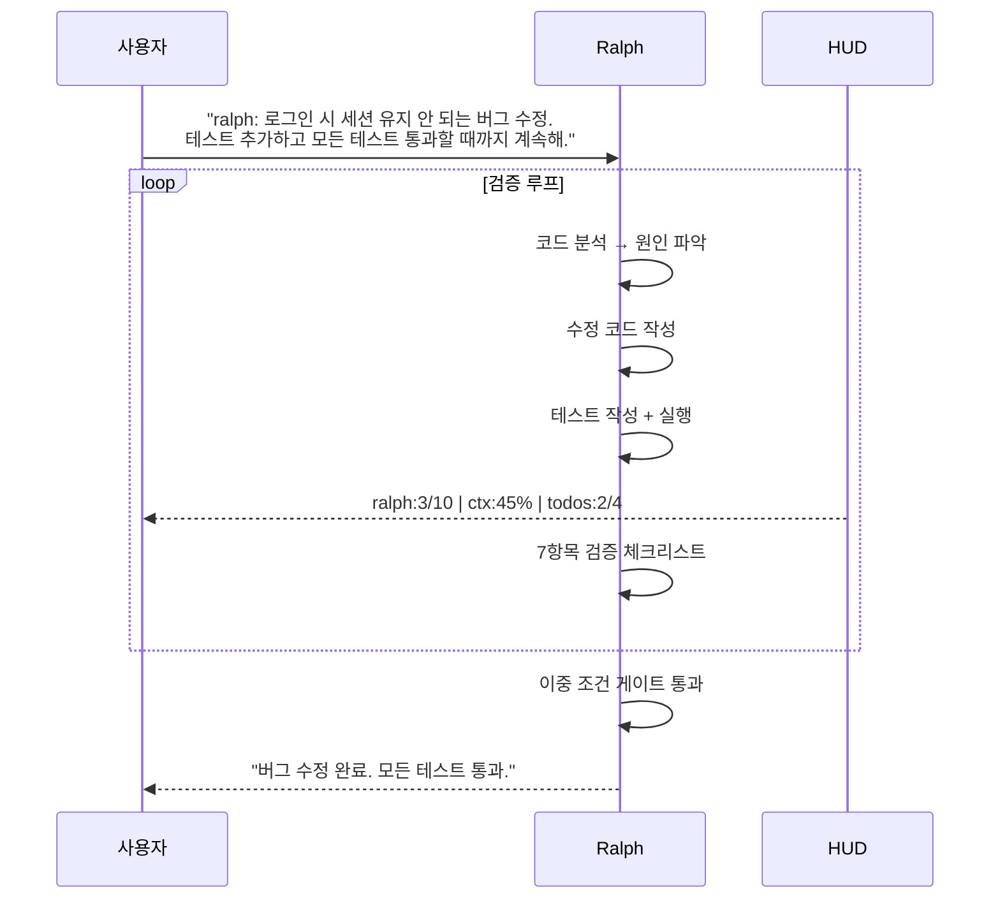
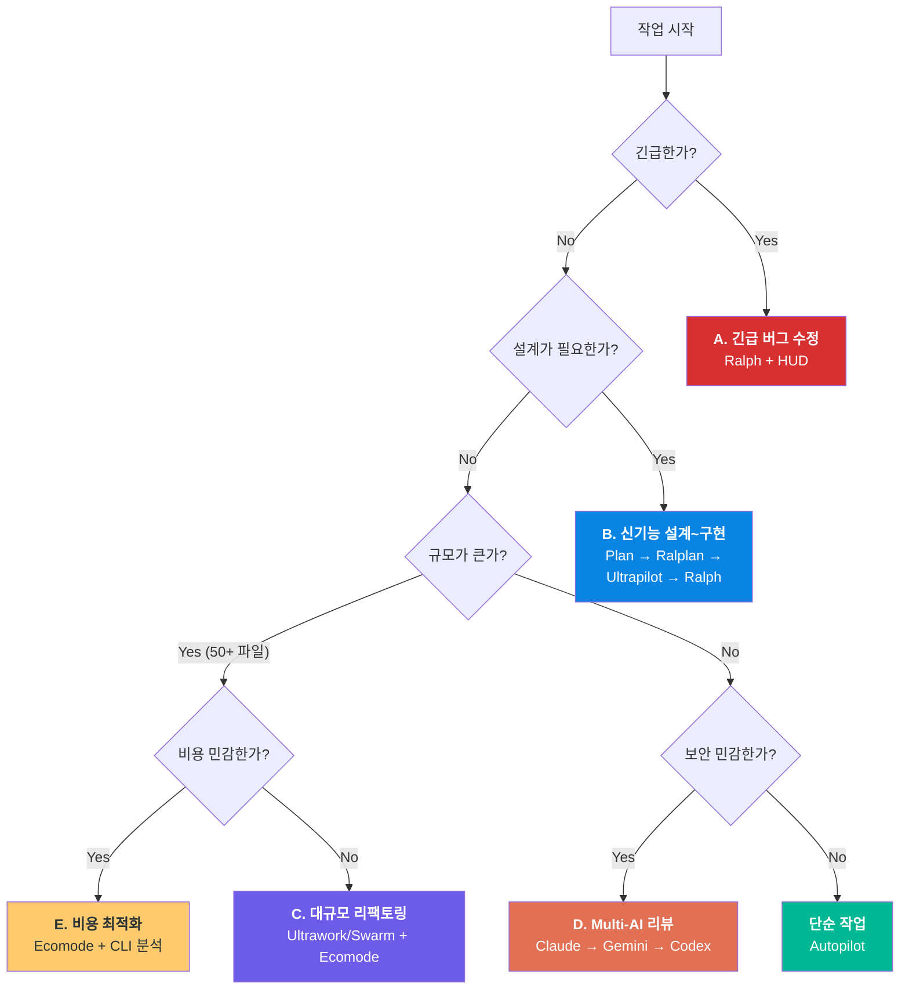

# 08. 실전 워크플로우

앞선 챕터에서 개별 기능을 학습했다면, 이 장에서는 실전 시나리오에서 여러 모드와 도구를 조합하는 방법을 다룹니다. 단일 모드로 해결할 수 없는 복잡한 작업일수록, 모드 조합과 전환 타이밍이 결과의 품질을 결정합니다. 5가지 시나리오를 통해 "언제, 어떤 모드를, 어떤 순서로" 사용하는지 체계를 잡습니다.

---

## 목표

- [ ] 5가지 실전 시나리오에서 모드 조합 전략을 설명할 수 있다
- [ ] 작업의 성격에 따라 4단계 파이프라인을 구성할 수 있다
- [ ] 워크플로우 의사결정 트리를 활용하여 최적 전략을 선택할 수 있다

---

## 1. 4단계 파이프라인

대부분의 실전 작업은 분석 → 계획 → 실행 → 검증의 4단계로 구성됩니다. 각 단계에 적합한 모드가 다릅니다.


| 단계 | 모드/도구 | 목적 | 모델 |
|------|----------|------|------|
| 분석 | `explore` + LSP 도구 | 현재 코드 이해, 영향 범위 파악 | Haiku |
| 계획 | Plan 또는 Ralplan | 전략 수립, 인터뷰, 합의 | Opus |
| 실행 | Autopilot / Ultrapilot / Ultrawork | 코드 작성, 수정 | Sonnet |
| 검증 | Ralph | 빌드/테스트/린트/리뷰 통과까지 반복 | 혼합 |

모든 작업에 4단계를 거칠 필요는 없습니다. 단순 버그 수정은 분석 → 실행 → 검증만으로 충분하고, 아키텍처 변경은 4단계 전체가 필요합니다.

---

## 2. 시나리오 A: 긴급 버그 수정

**상황**: 프로덕션에서 인증 버그 발생. 빠르게 수정하고 검증해야 합니다.

**모드 조합**: `Ralph` + HUD 모니터링



**핵심 포인트**:
- Ralph가 자동으로 반복하므로 "기다리기만" 하면 됩니다
- HUD로 진행 상황과 컨텍스트 사용량을 실시간 모니터링합니다
- Circuit Breaker가 무한 루프를 방지합니다

---

## 3. 시나리오 B: 신기능 설계~구현

**상황**: 사용자 알림 시스템을 새로 설계하고 구현해야 합니다.

**모드 조합**: `Plan` → `Ralplan` → `Ultrapilot` → `Ralph`

```
Step 1: Plan (5단계 인터뷰)
├─ "어떤 종류의 알림? (이메일, 푸시, 인앱)"
├─ "알림 우선순위가 필요한가?"
├─ "실시간 전달이 필요한가?"
└─ → plan.md 생성

Step 2: Ralplan (3인 합의)
├─ Planner: 알림 서비스 아키텍처 초안
├─ Architect: 이벤트 드리븐 설계 검증
├─ Critic: 스케일링 문제 지적 → 수정
└─ → 합의된 설계

Step 3: Ultrapilot (병렬 구현)
├─ Agent_A: backend/notification-service/
├─ Agent_B: frontend/notification-ui/
├─ Agent_C: database/notification-schema/
└─ → 3-5배 속도로 구현

Step 4: Ralph (검증)
├─ 빌드 통과? 테스트 통과? 린트 통과?
└─ → 모두 통과할 때까지 반복
```

**핵심 포인트**:
- 계획 단계에서 Opus를 사용하여 설계 품질을 높입니다
- 구현 단계에서 Sonnet으로 전환하여 비용을 줄입니다
- 파일 파티셔닝으로 병렬 구현 → Ralph로 최종 검증

---

## 4. 시나리오 C: 대규모 리팩토링

**상황**: 모놀리스의 API 엔드포인트 50개에 에러 핸들링을 일괄 추가해야 합니다.

**모드 조합**: `Ultrawork` 또는 `Swarm` + `Ecomode`

```
Ultrawork 전략:
├─ Agent_A: controllers/user/*.ts (10개 파일)
├─ Agent_B: controllers/product/*.ts (10개 파일)
├─ Agent_C: controllers/order/*.ts (10개 파일)
├─ Agent_D: controllers/payment/*.ts (10개 파일)
├─ Agent_E: controllers/admin/*.ts (10개 파일)
└─ 각 에이전트: 할당 파일에 try-catch + 커스텀 에러 추가

Ecomode 적용:
├─ 파일 탐색: Haiku (비용 1x)
├─ 패턴 적용: Sonnet (비용 12x)
└─ 아키텍처 판단 불필요 → Opus 미사용 (60x 절약)
```

**핵심 포인트**:
- 반복 패턴 작업은 Swarm이 효율적 (N개 에이전트 자동 분배)
- Ecomode로 Opus 호출을 제거하여 비용 절감
- AST grep으로 일괄 패턴 변환도 고려

---

## 5. 시나리오 D: Multi-AI 코드 리뷰

**상황**: 보안 민감 코드(결제 모듈)를 최대한 검증해야 합니다.

**모드 조합**: Claude 작성 → Gemini 리뷰 → Codex 검증

```
tmux 3분할 레이아웃:
┌─────────────────────────────────────┐
│       Claude Code (실행)            │
│  "결제 API 구현해줘"                │
├──────────────────┬──────────────────┤
│  Gemini (리뷰)   │  Codex (검증)   │
│  "보안 리뷰해줘"  │  "테스트 실행"   │
└──────────────────┴──────────────────┘

1. Claude: 결제 API 구현 완료
2. Gemini: 보안 취약점 2건 발견 (SQL 인젝션, 인증 우회)
3. Claude: 수정 후 재전달
4. Gemini: LGTM (승인)
5. Codex: 테스트 20개 작성 + 전체 통과 확인
```

**핵심 포인트**:
- 보안 민감 코드는 반드시 교차 검증
- Claude의 자기 코드 맹점을 Gemini가 보완
- Codex의 샌드박스에서 독립적 테스트 실행

---

## 6. 시나리오 E: 비용 최적화 개발

**상황**: 일일 예산이 제한된 환경에서 효율적으로 개발해야 합니다.

**모드 조합**: `Ecomode` + CLI 분석

```
작업 전:
├─ omc stats --days 1  → 어제 비용 확인
├─ omc agents          → 비용 상위 에이전트 식별
└─ 목표: architect 비용 50% 감소

작업 중:
├─ Ecomode 활성화 → 자동 티어 라우팅
├─ 간단한 질문: architect-low (Haiku)
├─ 구현 작업: executor (Sonnet)
└─ 설계 판단만: architect (Opus)

작업 후:
├─ omc stats --days 1  → 오늘 비용 확인
├─ omc agents          → architect 비용 변화 확인
└─ 결과: 30-50% 비용 절감
```

**핵심 포인트**:
- 측정 → 최적화 → 재측정 사이클
- Ecomode의 자동 티어 라우팅으로 수동 관리 불필요
- CLI로 최적화 효과를 수치로 확인

---

## 7. 워크플로우 의사결정 트리



---

## 체크포인트

다음 질문에 면접에서 답변하듯이 설명할 수 있는지 확인하세요.

1. **신기능을 설계에서 구현까지 진행할 때, 4개 모드(Plan → Ralplan → Ultrapilot → Ralph)를 순서대로 사용하는 이유는?**
2. **대규모 리팩토링에서 Ecomode를 함께 사용하면 왜 효과적인가요?**
3. **모든 작업에 4단계 파이프라인을 적용하지 않는 이유는?**

<details>
<summary>모범 답안 확인</summary>

**1. 4개 모드 순서의 이유**

Plan은 5단계 인터뷰로 모호한 요구사항을 명확히 합니다. "알림 시스템"이라는 막연한 요청에서 구체적인 스펙(이메일/푸시/인앱, 우선순위, 실시간 여부)을 도출합니다. Ralplan은 Plan의 결과를 3명의 전문가(Planner/Architect/Critic)가 검증하여, 기술적 실현 가능성과 리스크를 사전에 확인합니다. Ultrapilot은 합의된 설계를 파일 파티셔닝으로 병렬 구현하여 3-5배 속도를 냅니다. 마지막으로 Ralph가 7항목 체크리스트로 구현 결과를 검증합니다. 각 모드가 이전 모드의 산출물을 입력으로 받아 점진적으로 품질을 높이는 파이프라인입니다.

**2. 대규모 리팩토링에서 Ecomode의 효과**

대규모 리팩토링은 파일 수가 많아 에이전트 호출 횟수가 높습니다. 50개 파일에 에러 핸들링을 추가하면 수백 번의 파일 탐색과 수정이 발생합니다. Ecomode 없이 모든 작업을 Opus로 처리하면 비용이 폭증합니다. Ecomode는 파일 탐색을 Haiku(1x), 패턴 적용을 Sonnet(12x)으로 자동 라우팅하고, 아키텍처 판단이 필요 없으므로 Opus(60x)를 호출하지 않습니다. 결과적으로 30-50% 비용을 절감하면서 동일한 작업을 수행합니다.

**3. 항상 4단계를 적용하지 않는 이유**

오버킬(overengineering)이기 때문입니다. CSS 수정이나 타이포 수정에 Plan → Ralplan → Ultrapilot → Ralph를 적용하면, 실제 작업 5분에 계획/검증 30분이 추가됩니다. 4단계 파이프라인은 설계 결정이 필요하고, 파일 수가 많고, 검증이 중요한 작업에만 적합합니다. 간단한 작업은 Autopilot 단독으로, 중간 작업은 Ralph 단독으로 충분합니다. 워크플로우 의사결정 트리를 사용하여 작업의 긴급성, 규모, 보안 민감도에 따라 적절한 전략을 선택하는 것이 핵심입니다.

</details>

---

이전 단계: [07-multi-ai-orchestration](./07-multi-ai-orchestration.md)
학습 완료 후: [practice/README.md](../practice/README.md) - 명령어 Quick Reference
