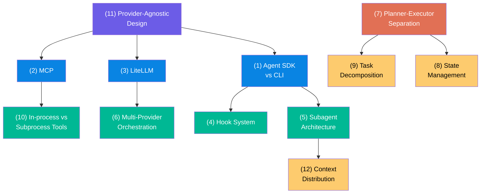

# 09. Claude Agent SDK와 멀티 프로바이더 오케스트레이션

07장에서 Claude+Gemini+Codex 삼각 편대를 tmux 기반 수동 협업으로 다뤘습니다. 이 장에서는 한 단계 더 나아가, **프로그래밍 방식으로** 여러 AI 프로바이더를 오케스트레이션할 수 있는지를 탐구합니다. Claude Agent SDK의 확장점, Oh My Opencode와의 비교, 그리고 12가지 핵심 개념을 통해 AI 에이전트 오케스트레이션의 전체 그림을 이해합니다.

---

## 목표

- [ ] OMC의 구조적 한계(Claude-only)와 Oh My Opencode의 네이티브 멀티 프로바이더 차이를 설명할 수 있다
- [ ] Claude Agent SDK가 제공하는 7가지 확장점과 4가지 하드 제약을 나열할 수 있다
- [ ] SDK 커스텀 / Opencode 전환 / 하이브리드 3가지 경로의 트레이드오프를 비교할 수 있다
- [ ] 12가지 핵심 개념의 의존 관계를 설명하고, 각 개념을 한 문장으로 정의할 수 있다

---

## 1. OMC vs Oh My Opencode: 무엇이 다른가

### 1.1 구조적 차이

OMC와 Oh My Opencode는 같은 문제(AI 에이전트 확장)를 다른 플랫폼 위에서 해결합니다.

| 측면 | Oh My Opencode | OMC (현재) |
|------|----------------|-----------|
| **기반 플랫폼** | OpenCode (오픈소스 Go CLI) | Claude Code (Anthropic 독점) |
| **프로바이더** | 75+ (Claude, GPT, Gemini, GLM 등) | Claude only |
| **에이전트별 모델** | Sisyphus=Opus, Oracle=GPT-5.2, Frontend=Gemini-3-Pro | 모두 Claude (Haiku/Sonnet/Opus) |
| **계획-실행 분리** | Prometheus(읽기전용) → Atlas(실행) | 구분 약함 |
| **오픈소스** | 전체 코드 접근/수정 가능 | 플러그인 레벨만 |
| **Hook 시스템** | 41개 라이프사이클 훅 | Shell→TS 브릿지 |

### 1.2 OMC의 핵심 한계

OMC는 Claude Code CLI 위의 플러그인입니다. Claude Code 자체가 Anthropic API만 호출하도록 설계되어 있기 때문에, OMC가 아무리 정교해도 **Claude 모델 바깥으로 나갈 수 없습니다**.

```
OMC의 천장:
┌───────────────────────────────────────┐
│  Claude Code CLI (Anthropic 독점)     │ ← 이 벽을 넘을 수 없음
│  ┌─────────────────────────────────┐  │
│  │  OMC 플러그인                    │  │
│  │  - 32 에이전트 (모두 Claude)     │  │
│  │  - 8 실행 모드                   │  │
│  │  - Hook/Skill/MCP              │  │
│  └─────────────────────────────────┘  │
└───────────────────────────────────────┘

Oh My Opencode의 구조:
┌───────────────────────────────────────┐
│  OpenCode CLI (오픈소스 Go)            │ ← 코드 수준 수정 가능
│  ┌─────────────────────────────────┐  │
│  │  Oh My Opencode 플러그인         │  │
│  │  - 에이전트별 다른 모델 선택      │  │
│  │  - Claude, GPT, Gemini, GLM... │  │
│  │  - 41 hooks + 25 tools         │  │
│  └─────────────────────────────────┘  │
└───────────────────────────────────────┘
```

핵심: OMC의 한계는 OMC 자체가 아니라 **기반 플랫폼(Claude Code)의 폐쇄성**에서 옵니다. 플러그인은 플랫폼의 벽을 넘지 못합니다.

---

## 2. Claude Agent SDK: 벽을 넘는 도구인가

Claude Agent SDK는 Anthropic이 공식 제공하는 프로그래밍 방식 에이전트 구축 도구입니다. CLI(바이너리 실행)가 아닌 SDK(라이브러리 임포트)이므로, **코어 로직 수준의 제어**가 가능합니다.

### 2.1 SDK가 제공하는 확장점

| 확장점 | 설명 | OMC 대비 이점 |
|--------|------|---------------|
| **Hooks** | Pre/post 도구 실행 인터셉트 | 프로그래밍 방식으로 라우팅 로직 주입 |
| **Custom Tools** | In-process MCP 서버 (서브프로세스 오버헤드 없음) | OMC보다 빠른 도구 실행 |
| **Plugins** | 슬래시 명령, 에이전트, 스킬, 훅 패키징 | 재사용 가능한 확장 |
| **System Prompt** | 완전 교체(Full Replacement) 가능 | 에이전트별 완전한 행동 커스텀 |
| **Subagents** | 도메인 특화 에이전트 정의 | 병렬 실행, 컨텍스트 격리 |
| **Permissions** | `canUseTool` 콜백으로 런타임 권한 제어 | 에이전트별 세밀한 권한 |
| **Multi-Provider** | LiteLLM 프록시 경유 OpenAI/Gemini 라우팅 | **OMC에서 불가능한 것** |

### 2.2 SDK의 하드 제약 (넘을 수 없는 벽)

| 제약 | 영향 |
|------|------|
| **서브에이전트 권한 상속 불가** | 부모가 `bypassPermissions`여도 자식은 불가 (hardcoded) |
| **API 키 인증만** | claude.ai 구독(Pro/Max) 사용 불가, API 과금 별도 |
| **에이전트 루프 불투명** | 코어 의사결정 로직 교체 불가 |
| **Python SDK 훅 미비** | SessionStart/End 훅 없음 (TypeScript는 있음) |

### 2.3 SDK vs CLI vs OMC 제어 수준

```
제어 수준 (높음 → 낮음):

SDK 직접 사용          CLI 플래그         OMC 플러그인
┌─────────────┐    ┌─────────────┐    ┌─────────────┐
│ 시스템프롬프트 │    │  --system   │    │  append만   │
│ 완전 교체     │    │  플래그 추가 │    │  제한적      │
├─────────────┤    ├─────────────┤    ├─────────────┤
│ 도구 실행     │    │ MCP 서버    │    │ MCP 서버    │
│ In-process   │    │ Subprocess  │    │ Subprocess  │
├─────────────┤    ├─────────────┤    ├─────────────┤
│ 프로바이더    │    │ Anthropic   │    │ Anthropic   │
│ LiteLLM 경유 │    │ only        │    │ only        │
├─────────────┤    ├─────────────┤    ├─────────────┤
│ 권한 제어     │    │ 설정 파일   │    │ Hook 기반   │
│ canUseTool() │    │ 정적        │    │ Shell 브릿지 │
└─────────────┘    └─────────────┘    └─────────────┘
```

---

## 3. 세 가지 경로: 어디로 갈 것인가

### 경로 A: Claude Agent SDK 커스텀

SDK 위에 OMC급 오케스트레이션을 처음부터 구축합니다.

```
Claude Agent SDK (TypeScript)
├── Custom Router → LiteLLM 프록시 → OpenAI/Gemini/Claude
├── Custom Hooks → 작업 분류 + 프로바이더 선택
├── Custom Subagents → 도메인별 시스템 프롬프트
├── Custom MCP Tools → 외부 도구 통합
└── State Management → boulder.json 패턴
```

| 장점 | 단점 |
|------|------|
| Anthropic 공식 지원, 안정적 | 처음부터 구축 (OMC 32에이전트 재구현) |
| 프로그래밍 방식 세밀한 제어 | API 키 과금 (구독과 별도) |
| LiteLLM 경유 멀티 프로바이더 | 서브에이전트 권한 상속 제약 |

### 경로 B: Oh My Opencode로 전환

OpenCode CLI + Oh My Opencode 플러그인으로 완전 전환합니다.

```
OpenCode (Go CLI)
└── Oh My Opencode 플러그인
    ├── Sisyphus (Claude Opus) ─── 오케스트레이터
    ├── Oracle (GPT-5.2) ────── 설계/디버깅
    ├── Frontend Engineer (Gemini-3-Pro) ─ UI
    ├── Librarian (GLM-4.7) ─── 문서
    └── 41 hooks + 25 tools
```

| 장점 | 단점 |
|------|------|
| 이미 구현됨 (바로 사용 가능) | Claude Code 생태계 포기 (현재 스킬/에이전트) |
| 네이티브 멀티 프로바이더 (75+) | 새 플랫폼 학습 곡선 |
| 오픈소스 → 무한 커스텀 | 기존 .claude/ 설정 마이그레이션 |
| Prometheus-Atlas 계획-실행 분리 | |

### 경로 C: 하이브리드 (점진적 확장)

기존 Claude Code + OMC를 유지하면서 특정 작업만 SDK로 외부 프로바이더에 위임합니다.

```
Claude Code + OMC (주 에이전트)
    ├── 복잡한 추론/아키텍처 → Claude Opus (OMC)
    ├── 코드 리뷰/보안 → codex exec (기존 패턴)
    └── Claude Agent SDK (보조 오케스트레이터)
         ├── Custom Router → 특정 작업만 외부 프로바이더로
         └── LiteLLM → GPT/Gemini 특화 작업 위임
```

| 장점 | 단점 |
|------|------|
| 기존 인프라 유지 | 두 시스템 관리 복잡도 |
| 점진적 확장 가능 | 완전한 통합은 아님 |
| 필요한 부분만 SDK 활용 | |

### 3.1 판단 기준 매트릭스

| 질문 | 경로 A (SDK) | 경로 B (Opencode) | 경로 C (하이브리드) |
|------|-------------|-------------------|-------------------|
| 기존 스킬/설정 유지? | 불가 | 불가 | **유지** |
| 멀티 프로바이더? | LiteLLM 경유 | **네이티브** | 부분적 |
| 구현 비용? | 높음 (2-4주) | **낮음** (설치+설정) | 중간 (1-2주) |
| 장기 유지보수? | 직접 관리 | 커뮤니티 | 혼합 |
| API 과금? | 별도 필요 | 프로바이더별 | 혼합 |

---

## 4. 핵심 학습 개념 12가지

이 개념들은 AI 에이전트 오케스트레이션을 이해하기 위한 빌딩 블록입니다. 아래 의존 관계 맵을 참고하여, 기반 개념부터 순서대로 학습하세요.

### 개념 의존 관계 맵



**범례**: 보라=기반 원칙, 파랑=핵심 기술, 초록=확장 패턴, 노랑=응용 패턴

---

### (1) Agent SDK vs CLI Tool

> **한줄**: SDK는 코드에 임포트하는 라이브러리, CLI는 터미널에서 실행하는 바이너리

| | SDK (라이브러리) | CLI (바이너리) |
|---|---|---|
| 호출 방식 | `import { Agent } from 'sdk'` | `exec("claude -p ...")` |
| 커스텀 수준 | 코어 로직까지 제어 | 플래그/설정 수준 |
| 시스템 프롬프트 | 완전 교체 가능 | 제한적 (append만) |
| 오버헤드 | 낮음 (동일 프로세스) | 높음 (프로세스 스폰) |

**왜 중요한가**: OMC는 CLI 위의 플러그인입니다. CLI의 제어 수준에 갇혀 있기 때문에 근본적인 행동 변경이 불가능합니다. SDK로 전환하면 시스템 프롬프트 완전 교체, 도구 실행 인터셉트, 프로바이더 라우팅 등 코어 수준 제어가 가능해집니다.

**실제 예시**:
```typescript
// SDK: 시스템 프롬프트 완전 교체
const agent = new Agent({
  systemPrompt: "당신은 보안 전문가입니다...", // 완전히 새로운 프롬프트
  tools: [customSecurityScanner],
});

// CLI: append만 가능
// $ claude -p "보안 검토해줘" --system "추가 지시..."
// → 기본 시스템 프롬프트 위에 append
```

---

### (2) MCP (Model Context Protocol)

> **한줄**: AI 모델이 외부 도구/데이터와 통신하는 표준 프로토콜 (USB-C 같은 것)

**핵심 원리**: JSON-RPC 2.0 기반 프로토콜로, LSP(Language Server Protocol)의 개념을 AI 도구 통합에 재사용합니다. 이전에는 각 도구마다 별도 커넥터가 필요한 N x M 문제가 있었지만, MCP는 하나의 표준으로 모든 도구를 통합합니다.

```
MCP 이전 (N x M 문제):          MCP 이후 (N + M):
AI-1 ──┬── Tool-A              AI-1 ──┐
       ├── Tool-B              AI-2 ──┼── [MCP] ──┬── Tool-A
AI-2 ──┬── Tool-A              AI-3 ──┘          ├── Tool-B
       ├── Tool-B                                 └── Tool-C
       └── Tool-C
(6개 커넥터 필요)               (3+3 = 6, 선형 증가)
```

**왜 중요한가**: MCP가 업계 표준이 되면, 도구를 한 번 만들면 Claude, GPT, Gemini 어디서든 사용할 수 있습니다. 2025년 Linux Foundation에 기부되어 개방형 표준으로 관리됩니다.

**실제 예시**: File System MCP, Database MCP, Browser MCP가 모두 동일한 JSON-RPC 프로토콜로 통신합니다. Claude Code에서 `claude mcp add-json`으로 추가하면 바로 사용 가능합니다.

---

### (3) LiteLLM (멀티 프로바이더 프록시)

> **한줄**: 100+ LLM 프로바이더 API를 OpenAI 호환 단일 인터페이스로 통합하는 프록시

**핵심 원리**: 각 프로바이더(Anthropic, OpenAI, Google 등)는 서로 다른 API 형식을 가집니다. LiteLLM은 이 모든 API를 OpenAI 호환 형식으로 변환하여, 코드 한 줄 변경 없이 프로바이더를 전환할 수 있게 합니다.

```python
# 동일한 코드, 프로바이더만 변경
response = client.create(model="claude-opus-4-6", messages=[...])
response = client.create(model="gpt-4", messages=[...])
response = client.create(model="gemini-pro", messages=[...])
# ↑ LiteLLM이 각 프로바이더 API 형식으로 자동 변환
```

**왜 중요한가**: 벤더 락인(vendor lock-in) 방지의 핵심 도구입니다. 특정 프로바이더에 장애가 발생하면 다른 프로바이더로 자동 폴백(fallback)할 수 있고, 비용 추적과 로드 밸런싱도 내장되어 있습니다.

**실제 예시**: Claude Agent SDK에서 LiteLLM 프록시를 경유하면, SDK의 서브에이전트가 GPT나 Gemini를 호출할 수 있습니다. OMC에서는 불가능하지만 SDK에서는 가능한 이유가 바로 이것입니다.

---

### (4) Hook System (생명주기 훅)

> **한줄**: 에이전트 실행 중 특정 이벤트에 커스텀 로직을 주입하는 콜백 메커니즘

**핵심 원리**: 에이전트의 실행 과정은 여러 "이벤트"로 구성됩니다 (도구 호출 전, 호출 후, 세션 시작, 종료 등). 훅은 이 이벤트에 **사용자 정의 함수를 연결**하여 실행 흐름을 감시하거나 변경합니다.

| 훅 이벤트 | 시점 | 용도 |
|-----------|------|------|
| PreToolUse | 도구 실행 전 | 위험 명령 차단, 권한 검사 |
| PostToolUse | 도구 실행 후 | 결과 검증, 로깅 |
| SubagentStart | 서브에이전트 시작 | 추적, 모니터링 |
| SessionEnd | 세션 종료 | 상태 저장, 정리 |

**왜 중요한가**: OMC의 모든 실행 모드(autopilot, swarm, ultrawork 등)는 Hook으로 구현됩니다. 훅이 없으면 에이전트의 행동을 "관찰"만 할 수 있지, "개입"할 수 없습니다.

**Claude Code vs OpenCode 훅 비교**:
```
Claude Code Hook:
  Shell 스크립트 → stdout으로 결과 전달 → CLI가 해석
  (제약: 프로세스 간 통신, 느림)

Agent SDK Hook:
  TypeScript 콜백 → 동일 프로세스 내 직접 호출
  (장점: 지연 없음, 타입 안전)

OpenCode Hook:
  Go 플러그인 → 41개 라이프사이클 포인트
  (장점: 가장 많은 훅 포인트)
```

---

### (5) Subagent Architecture (서브에이전트)

> **한줄**: 부모 에이전트가 특화된 자식 에이전트에 작업을 위임하고, 결과만 수신하는 구조

**핵심 원리**: 하나의 에이전트가 모든 작업을 처리하면 컨텍스트 윈도우가 빠르게 소진됩니다. 서브에이전트는 **독립된 컨텍스트**에서 작업을 수행하고, 최종 결과만 부모에게 반환합니다. 이것이 **컨텍스트 격리(Context Isolation)** 입니다.

```
Parent Agent (오케스트레이터)
├── Subagent A (DB전문) → 쿼리 결과만 반환      ─┐
├── Subagent B (API전문) → API 응답만 반환       ├─ 각각 독립 컨텍스트
└── Subagent C (분석전문) → 분석 결과만 반환      ─┘

중간 시행착오(5번 재시도, 3번 에러)가 부모 컨텍스트를 오염시키지 않음
→ 토큰 67% 절감 효과
```

**왜 중요한가**: OMC의 32개 에이전트가 바로 이 구조입니다. `architect`가 설계하고, `code-reviewer`가 검토하고, `build-fixer`가 빌드를 수정합니다. 각 에이전트는 자신의 전문 영역에서만 작업하고, 중간 과정은 부모에게 노출되지 않습니다.

**SDK vs CLI 서브에이전트**:
| | SDK | CLI (OMC) |
|---|---|---|
| 실행 방식 | 동일 프로세스 내 | 별도 프로세스 스폰 |
| 결과 전달 | 메모리 직접 참조 | stdout/stderr 파싱 |
| 권한 | canUseTool 콜백 | 부모와 동일 |
| 주의점 | **권한 상속 불가** (하드 제약) | N/A |

---

### (6) Multi-Provider Orchestration (멀티 프로바이더 라우팅)

> **한줄**: 작업 특성에 따라 서로 다른 AI 모델/프로바이더를 지능적으로 선택하는 전략

**핵심 원리**: 모든 AI 모델이 모든 작업에 최적인 것은 아닙니다. 코딩에 강한 모델, 이미지 생성에 강한 모델, 검색에 강한 모델이 다릅니다. 멀티 프로바이더 오케스트레이션은 작업을 분석하여 **최적의 모델에 라우팅**합니다.

**4가지 라우팅 전략**:

| 전략 | 기준 | 예시 |
|------|------|------|
| **비용 기반** | 작업 복잡도 → 모델 등급 | 단순 질문→Haiku, 복잡→Opus |
| **장애 기반** | 최근 30초 무장애 프로바이더 | Claude 장애 시 GPT로 폴백 |
| **전문성 기반** | 작업 유형 → 최적 모델 | 코딩→Claude, 이미지→DALL-E, 검색→Perplexity |
| **부하 기반** | TPM(분당 토큰) 가장 낮은 곳으로 | Rate limit 회피 |

```
[사용자 요청]
     ↓
[Task Classifier] ── "이 작업은 무엇인가?"
     ↓
┌─────────────────────────────────────────┐
│ 코딩 구현  → Claude Opus                │
│ 코드 리뷰  → GPT-5.2 (다른 관점)       │
│ UI 작업    → Gemini-3-Pro (시각 이해)   │
│ 문서 정리  → GLM-4.7 (비용 효율)       │
│ 단순 질문  → Haiku (저비용)             │
└─────────────────────────────────────────┘
```

**왜 중요한가**: Oh My Opencode는 이것을 네이티브로 합니다. OMC에서는 불가능합니다. SDK + LiteLLM 조합으로 비슷하게 구현할 수 있지만, 직접 구축해야 합니다.

---

### (7) Planner-Executor Separation (계획-실행 분리)

> **한줄**: 계획 수립(읽기전용)과 실행을 물리적으로 분리하는 아키텍처 패턴

**핵심 원리**: Planner는 코드베이스를 분석하고 작업 계획(DAG)을 생성하지만, **파일을 수정하거나 명령을 실행할 권한이 없습니다**. Executor만이 실행 권한을 가집니다. 이 읽기전용 제약이 안전성을 보장합니다.

```
Planner (Prometheus) ──읽기전용──→ 작업 DAG 생성
     │                            ┌────────────────┐
     │                            │ 1. auth.ts 수정 │
     │                            │ 2. test 작성    │──의존 순서
     │                            │ 3. 빌드 확인    │
     ↓                            └────────────────┘
Executor (Atlas) ──실행 권한──→ 도구 호출, 파일 수정
```

**왜 읽기전용인가**: Planner가 실행까지 하면 "계획하다가 실수로 파일 삭제" 같은 사고가 발생합니다. 인간 조직에서도 "계획 승인 → 실행"으로 분리하는 것과 같은 이유입니다. 권한 분리 = 안전성입니다.

**OMC vs Oh My Opencode**:
- OMC: `planner` 에이전트가 있지만, 실행 권한도 가짐 (완전한 분리 아님)
- Oh My Opencode: Prometheus(읽기전용) → Atlas(실행) 물리적 분리

---

### (8) State Management (상태 관리)

> **한줄**: 에이전트 작업 상태를 파일/DB에 저장하여 충돌/재시작 후 복구 가능하게 하는 메커니즘

**핵심 원리**: 에이전트의 작업은 수십 분~수 시간이 걸릴 수 있습니다. 중간에 세션이 끊기거나 크래시가 발생하면, 상태가 없으면 처음부터 다시 시작해야 합니다. boulder.json 패턴은 각 체크포인트마다 상태를 저장하여 중단된 지점부터 재개할 수 있게 합니다.

```json
{
  "sessionId": "abc-123",
  "taskGraph": {
    "total": 10,
    "completed": [1, 2, 3, 4, 5],
    "inProgress": 6,
    "pending": [7, 8, 9, 10]
  },
  "lastCheckpoint": "2026-02-18T10:30:00Z",
  "artifacts": {
    "step5_output": "/tmp/auth-module.ts"
  }
}
```

**왜 중요한가**: 2시간짜리 작업 중 1시간 50분에 충돌하면, 상태가 없으면 2시간을 통째로 날립니다. OMC에서 `/compact`가 필요한 이유도 컨텍스트 윈도우 한계 때문이고, 상태 관리가 이를 보완합니다.

**실제 패턴**: Oh My Opencode의 boulder.json, OMC의 `.omc/sessions/*.json`, Claude Code의 `.claude/projects/` 세션 로그

---

### (9) Task Decomposition (작업 분해)

> **한줄**: 복잡한 목표를 작은 부분 작업(DAG)으로 쪼개어 병렬 또는 순차 처리하는 전략

**핵심 원리**: "전체 앱 리팩토링" 같은 거대한 작업은 하나의 에이전트가 처리할 수 없습니다. 독립적인 부분은 병렬로, 의존적인 부분은 순차로 실행하면 총 소요시간을 최소화할 수 있습니다.

**2가지 분해 전략**:

| 전략 | 방식 | 장점 | 단점 |
|------|------|------|------|
| **휴리스틱** | 규칙 기반 (파일별, 모듈별) | 빠름, 예측 가능 | 복잡한 의존성 놓침 |
| **AI 기반** | LLM이 코드 분석 후 분해 | 유연, 의존성 감지 | 추가 토큰 비용 |

```
"인증 시스템 구현" 분해 예시:

        [인증 시스템 구현]
        ┌───────┼───────┐
   [DB 스키마]  [API 엔드포인트]  [UI 컴포넌트]
        │       ┌───┼───┐        │
        │    [login] [signup] [logout]
        │       │       │        │
        └───[미들웨어]───┘        │
                │                 │
            [통합 테스트]──────────┘

→ DB 스키마, UI 컴포넌트는 병렬 가능
→ API는 DB 스키마 후, 미들웨어는 API 후 (순차)
→ 통합 테스트는 모든 것이 완료된 후
```

**OMC 관련**: `ultrawork`가 병렬 분해, `pipeline`이 순차 분해, `swarm`이 풀 기반 분배입니다.

---

### (10) In-process vs Subprocess Tools

> **한줄**: 도구를 같은 프로세스 내에서 실행하는 것과 별도 프로세스로 실행하는 것의 성능/안전성 트레이드오프

**핵심 원리**: In-process 도구는 메모리를 공유하고 함수 호출처럼 빠르지만, 크래시하면 전체 에이전트가 죽습니다. Subprocess 도구는 격리되어 안전하지만, 프로세스 스폰과 IPC(프로세스 간 통신) 비용이 발생합니다.

| | In-process | Subprocess |
|---|---|---|
| 시작 오버헤드 | 없음 (~0ms) | 프로세스 스폰 (~50-200ms) |
| 메모리 공유 | 가능 (직접 참조) | 불가 (JSON 직렬화 필요) |
| 안전성 | 크래시 시 전체 영향 | 격리됨 (자식만 죽음) |
| 디버깅 | 같은 스택 트레이스 | 별도 로그 필요 |

**왜 중요한가**: MCP Custom Tool은 In-process, `codex exec`나 OMC의 에이전트 호출은 Subprocess입니다. Claude Agent SDK가 In-process MCP를 지원하는 것이 OMC 대비 성능 이점인 이유가 바로 이것입니다. 도구를 100번 호출하면 Subprocess는 5~20초의 순수 오버헤드가 추가됩니다.

---

### (11) Provider-Agnostic Design (프로바이더 무관 설계)

> **한줄**: 특정 AI 프로바이더에 의존하지 않는 아키텍처 (Adapter Pattern 적용)

**핵심 원리**: 애플리케이션 코드와 프로바이더 구현 사이에 **표준 인터페이스(어댑터)**를 두면, 프로바이더를 교체해도 비즈니스 로직을 변경할 필요가 없습니다. 이것은 GoF 디자인 패턴의 Adapter Pattern을 AI 시스템에 적용한 것입니다.

```
Application Logic (비즈니스 코드)
       │
   [LLM Interface]  ← 표준 인터페이스
       │              (complete, embed, stream)
  ┌────┼────┐
  │    │    │
OpenAI Claude Gemini  ← 각 프로바이더 Adapter
```

**왜 중요한가**: 2024년 Claude API 장애, 2025년 OpenAI rate limit 강화 등 특정 프로바이더에 의존하면 리스크가 큽니다. 프로바이더 무관 설계는 장애 대응, 비용 최적화, 기술 선택의 자유를 보장합니다.

**현재 상태**: Oh My Opencode = Provider-Agnostic (네이티브), OMC = Claude-locked (플랫폼 제약)

---

### (12) Context Distribution (컨텍스트 분산)

> **한줄**: 큰 컨텍스트를 여러 에이전트에 나눠서 처리하는 패턴 (단일 대형 윈도우의 한계 극복)

**핵심 원리**: 아무리 컨텍스트 윈도우가 크더라도(200K, 1M 토큰), 단일 에이전트에 모든 것을 넣으면 "중간 내용 무시(Lost in the Middle)" 현상이 발생합니다. Context Distribution은 텍스트를 청크로 나눠 여러 Worker 에이전트에 분배하고, Manager가 결과를 종합합니다.

**Chain-of-Agents (CoA) 패턴**:

```
1000페이지 문서
├── Worker 1: 1~250p → 요약A  ─┐
├── Worker 2: 251~500p → 요약B  ├─ 병렬 처리
├── Worker 3: 501~750p → 요약C  │
├── Worker 4: 751~1000p → 요약D ─┘
└── Manager: 요약A+B+C+D → 최종 분석
```

**왜 RAG만으로 부족한가**: RAG(Retrieval-Augmented Generation)는 관련 조각만 검색합니다. "3장의 결론이 7장의 전제와 모순되는가?"같은 질문은 전체 맥락이 필요하지만, RAG는 3장과 7장을 별개 검색으로 처리하여 맥락을 잃습니다. CoA는 전체를 분산 처리하므로 이런 교차 참조 질문에 강합니다.

**OMC 관련**: `ultrawork`/`swarm`이 코드 작업에 Context Distribution을 적용한 것입니다. 파일을 분배하여 각 에이전트가 독립적으로 처리하고 결과를 취합합니다.

---

## 체크포인트

다음 질문에 면접에서 답변하듯이 설명할 수 있는지 확인하세요.

1. **OMC가 GPT/Gemini를 호출할 수 없는 근본 원인은 무엇이고, Claude Agent SDK가 이를 어떻게 해결하는가?**
2. **Planner-Executor를 분리할 때 Planner가 반드시 읽기전용이어야 하는 이유를 안전성 관점에서 설명하세요.**
3. **In-process Tool이 Subprocess Tool보다 빠른 이유를 프로세스 수준에서 설명하세요.**
4. **Context Distribution이 필요한 상황을 RAG와 비교하여 설명하세요.**

<details>
<summary>모범 답안 확인</summary>

**1. OMC의 한계와 SDK의 해결**

OMC는 Claude Code CLI 위의 플러그인입니다. Claude Code CLI 자체가 Anthropic API만 호출하도록 설계(hardcoded)되어 있기 때문에, OMC가 아무리 정교해도 GPT/Gemini를 호출할 수 없습니다. 이것은 OMC의 한계가 아니라 기반 플랫폼의 폐쇄성입니다. Claude Agent SDK는 라이브러리(import)이므로 코어 수준에서 HTTP 호출 대상을 제어할 수 있습니다. LiteLLM 프록시를 경유하면 동일한 인터페이스로 OpenAI, Google, 기타 프로바이더 API를 호출할 수 있습니다.

**2. Planner의 읽기전용 제약**

Planner가 실행 권한을 가지면 "분석 중 실수로 파일 삭제", "테스트 실행 중 DB 수정"같은 부작용이 발생할 수 있습니다. 계획 단계에서는 코드베이스의 현재 상태를 파악하는 것이 목적이므로, 읽기만으로 충분합니다. 실행은 계획이 승인된 후 Executor가 담당합니다. 이것은 인간 조직에서 "계획서 작성 → 승인 → 실행"으로 단계를 분리하는 것과 동일한 원리이며, 최소 권한 원칙(Principle of Least Privilege)의 적용입니다.

**3. In-process vs Subprocess 성능 차이**

In-process 도구는 동일 프로세스의 메모리 공간에서 실행되므로 함수 호출과 동일합니다 (오버헤드 ~0ms). Subprocess 도구는 OS가 새 프로세스를 생성(fork/exec)해야 하고 (~50-200ms), 데이터를 JSON으로 직렬화하여 파이프/소켓으로 전달하고, 결과를 역직렬화해야 합니다. 도구를 100번 호출하면 Subprocess는 순수 오버헤드만 5~20초가 추가됩니다. 반면 In-process는 크래시 시 전체 에이전트가 영향받는 안전성 트레이드오프가 있습니다.

**4. Context Distribution vs RAG**

RAG는 쿼리와 유사한 문서 조각만 검색합니다. "3장의 결론이 7장의 전제와 모순되는가?"같은 교차 참조 질문에서 RAG는 3장과 7장을 별개로 검색하여 둘 사이의 논리적 연결을 놓칩니다. Context Distribution(CoA)은 문서 전체를 청크로 나눠 각 Worker가 독립 처리한 후 Manager가 종합하므로, 전체 맥락을 유지하면서 대용량을 처리할 수 있습니다. Google Research의 실험에서 CoA는 Full-Context 방식보다 모든 데이터셋에서 높은 성능을 보였고, RAG보다도 8개 데이터셋 전체에서 우수한 결과를 기록했습니다.

</details>

---

## 다음 단계

- [ ] LiteLLM 프록시 로컬 설치 및 멀티 프로바이더 라우팅 실험
- [ ] Claude Agent SDK TypeScript 예제로 Custom Tool 구현
- [ ] Oh My Opencode 설치하여 에이전트별 모델 지정 테스트
- [ ] OMC ultrawork와 CoA 패턴 비교 실험

---

## 참고 자료

- [Claude Agent SDK 공식 문서](https://docs.anthropic.com/en/docs/agents-and-tools/claude-code/sdk)
- [MCP 공식 사이트](https://modelcontextprotocol.io/)
- [LiteLLM 문서](https://docs.litellm.ai/)
- [Chain of Agents: LLMs Collaborating on Long-Context Tasks](https://research.google/blog/chain-of-agents-large-language-models-collaborating-on-long-context-tasks/)
- [Google Cloud - Agentic AI Design Patterns](https://docs.cloud.google.com/architecture/choose-design-pattern-agentic-ai-system)
- [Azure - AI Agent Orchestration Patterns](https://learn.microsoft.com/en-us/azure/architecture/ai-ml/guide/ai-agent-design-patterns)
- [LLM Agnostic Architecture](https://quiq.com/blog/llm-agnostic-ai/)
