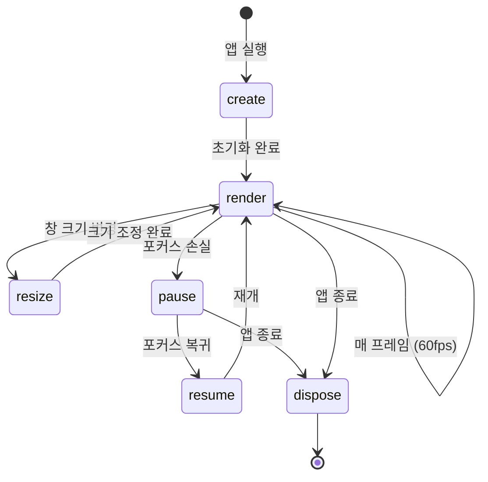
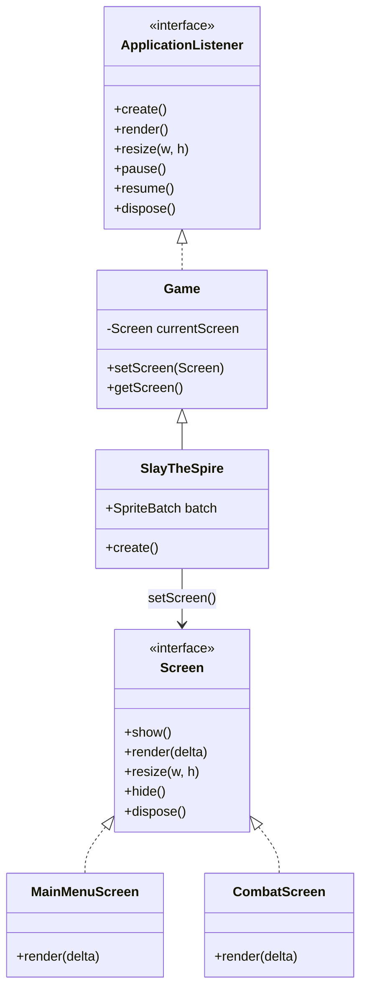

# Ch01. libGDX 생명주기 & 프로젝트 구조

> 📌 **핵심 요약**
> libGDX 앱은 `ApplicationListener` → `Game` → `Screen` 계층 구조를 가지며, 각 생명주기 메서드가 프레임워크에 의해 자동 호출된다. 프로젝트는 `core/`(공통 로직)와 플랫폼별 런처(`lwjgl3/` 등)로 분리되어 다중 플랫폼 빌드를 지원한다.

---

## 🎯 학습 목표

1. libGDX의 `ApplicationListener` 생명주기 6개 메서드의 호출 시점과 책임을 설명할 수 있다
2. `Game`과 `Screen`의 역할 분리를 이해하고, 화면 전환 패턴을 구현할 수 있다
3. gdx-liftoff로 프로젝트를 생성하고 `./gradlew lwjgl3:run`으로 실행할 수 있다
4. `core/`, `lwjgl3/`, `assets/` 디렉토리의 역할을 구분할 수 있다
5. 첫 번째 화면에서 배경색을 설정하고 창을 띄울 수 있다

---

## 1. libGDX란 무엇인가

libGDX는 Java/Kotlin 기반의 크로스플랫폼 게임 개발 프레임워크다. 동일한 `core` 코드로 데스크톱(LWJGL3), Android, iOS(RoboVM), HTML5(GWT) 빌드를 지원한다.

Slay the Spire 클론을 만들 때 libGDX를 선택하는 이유:
- **Scene2D**: 카드 UI, 드래그앤드롭, 애니메이션을 위한 완성된 2D UI 시스템
- **SpriteBatch**: 카드/몬스터 이미지를 효율적으로 렌더링하는 배치 시스템
- **Java 생태계**: 풍부한 라이브러리와 IDE 지원

---

## 2. ApplicationListener 생명주기

libGDX 앱의 진입점은 `ApplicationListener` 인터페이스다. 프레임워크가 적절한 시점에 각 메서드를 호출한다.

```java
public interface ApplicationListener {
    void create();   // 앱 시작 시 1회 — 리소스 초기화
    void render();   // 매 프레임 — 업데이트 + 그리기
    void resize(int width, int height); // 창 크기 변경 시
    void pause();    // 포커스 잃을 때 (Android: 홈버튼)
    void resume();   // 포커스 복귀 시
    void dispose();  // 앱 종료 시 — 리소스 해제
}
```

### 생명주기 흐름



### 각 메서드의 책임

| 메서드 | 호출 시점 | 주요 작업 |
|--------|-----------|-----------|
| `create()` | 앱 시작 시 **1회** | SpriteBatch 생성, 첫 Screen 설정, AssetManager 초기화 |
| `render()` | **매 프레임** | 화면 지우기, 업데이트, 그리기 |
| `resize()` | 창 크기 변경 시 | Viewport 업데이트 |
| `pause()` | 백그라운드 전환 | 진행 중 작업 저장 |
| `resume()` | 포그라운드 복귀 | OpenGL 컨텍스트 복구 |
| `dispose()` | 앱 종료 시 | 모든 리소스 해제 (메모리 누수 방지) |

---

## 3. Game과 Screen 계층 구조

직접 `ApplicationListener`를 구현하면 모든 화면 코드가 한 클래스에 뭉친다. libGDX는 이를 `Game`과 `Screen`으로 분리한다.

### 3.1 Game 클래스

`Game`은 `ApplicationListener`를 구현하면서, 현재 활성화된 `Screen`에 생명주기 호출을 위임한다.

```java
// core/src/main/java/com/mygame/SlayTheSpire.java
public class SlayTheSpire extends Game {

    // 공유 리소스 (모든 Screen에서 접근 가능)
    public SpriteBatch batch;

    @Override
    public void create() {
        // SpriteBatch는 비용이 크므로 Game에서 1개만 생성
        batch = new SpriteBatch();

        // 첫 화면으로 전환
        setScreen(new MainMenuScreen(this));
    }

    @Override
    public void dispose() {
        // 공유 리소스 해제
        batch.dispose();
        // Screen의 dispose()는 setScreen()이 자동 호출
    }
}
```

### 3.2 Screen 인터페이스

각 게임 화면(메인 메뉴, 전투, 지도 등)은 `Screen`을 구현한다.

```java
// core/src/main/java/com/mygame/screen/MainMenuScreen.java
public class MainMenuScreen implements Screen {

    private final SlayTheSpire game; // Game 참조 (화면 전환용)

    public MainMenuScreen(SlayTheSpire game) {
        this.game = game;
    }

    @Override
    public void show() {
        // 이 Screen이 활성화될 때 호출 (create와 다름)
        // Stage 설정, 애니메이션 시작 등
    }

    @Override
    public void render(float delta) {
        // delta: 이전 프레임과의 시간 차이 (초 단위, 보통 0.016f)
        // 배경색 지우기
        ScreenUtils.clear(0.1f, 0.1f, 0.15f, 1f); // R, G, B, A

        // 게임 로직 업데이트
        update(delta);

        // 그리기
        draw();
    }

    @Override
    public void resize(int width, int height) {
        // Viewport 업데이트 (Ch02에서 다룸)
    }

    @Override
    public void pause() { }

    @Override
    public void resume() { }

    @Override
    public void hide() {
        // 다른 Screen으로 전환될 때 호출
        // 리소스 해제 또는 애니메이션 정지
    }

    @Override
    public void dispose() {
        // 이 Screen의 리소스 해제
    }

    private void update(float delta) { /* 게임 로직 */ }
    private void draw() { /* 렌더링 */ }
}
```

### 3.3 클래스 계층 구조



### 3.4 화면 전환 패턴

```java
// 전투 화면에서 메인 메뉴로 복귀
public void onCombatEnd(boolean victory) {
    // setScreen이 내부적으로:
    // 1. 현재 Screen.hide() 호출
    // 2. 현재 Screen.dispose() 호출 (선택적)
    // 3. 새 Screen.show() 호출
    game.setScreen(new MainMenuScreen(game));
}
```

> ⚠️ **주의**: `Game.setScreen()`은 이전 Screen의 `dispose()`를 **자동으로 호출하지 않는다**. 직접 해제하거나, Screen에서 `hide()`에서 처리해야 한다.

---

## 4. 프로젝트 생성: gdx-liftoff

gdx-liftoff는 libGDX 공식 프로젝트 생성 도구다. 구식 `gdx-setup.jar` 대신 사용한다.

### 4.1 CLI로 프로젝트 생성

```bash
# gdx-liftoff 최신 버전 다운로드
# https://github.com/libgdx/gdx-liftoff/releases 에서 jar 다운로드

java -jar gdx-liftoff.jar \
  --projectName slay-the-spire-clone \
  --rootPackage com.mygame \
  --mainClass SlayTheSpire \
  --platforms lwjgl3 \
  --extensions scene2d \
  --template classic
```

또는 GUI 실행:
```bash
java -jar gdx-liftoff.jar
```

GUI 설정 항목:
- **Project name**: `slay-the-spire-clone`
- **Root package**: `com.mygame` (또는 원하는 패키지명)
- **Main class**: `SlayTheSpire`
- **Platforms**: `lwjgl3` (데스크톱 전용 개발 시작)
- **Extensions**: `freetype` (폰트), `scene2d` (UI)

### 4.2 빌드 및 실행

```bash
# 데스크톱 실행
./gradlew lwjgl3:run

# 빌드만
./gradlew lwjgl3:jar

# 실행 가능한 fat jar 생성
./gradlew lwjgl3:dist
```

---

## 5. 프로젝트 구조

```
slay-the-spire-clone/
├── core/                           # 플랫폼 독립적 게임 로직
│   └── src/main/java/com/mygame/
│       ├── SlayTheSpire.java       # Game 진입점
│       ├── screen/
│       │   ├── MainMenuScreen.java
│       │   ├── CombatScreen.java
│       │   └── MapScreen.java
│       ├── model/
│       │   ├── card/
│       │   └── enemy/
│       └── ui/
│           └── actor/
├── lwjgl3/                         # 데스크톱 런처
│   └── src/main/java/com/mygame/lwjgl3/
│       └── Lwjgl3Launcher.java
├── assets/                         # 이미지, 사운드, 폰트 등
│   ├── cards/
│   ├── enemies/
│   ├── ui/
│   └── sounds/
├── build.gradle.kts               # 루트 빌드 스크립트
└── settings.gradle.kts
```

### 5.1 핵심 빌드 파일

```kotlin
// lwjgl3/build.gradle.kts
plugins {
    id("org.beryx.runtime") version "1.13.1" // 패키징용
}

dependencies {
    implementation(project(":core"))
    // lwjgl3 백엔드
    implementation("com.badlogicgames.gdx:gdx-backend-lwjgl3:${libgdxVersion}")
    // 네이티브 라이브러리 (OpenGL, OpenAL)
    implementation("com.badlogicgames.gdx:gdx-platform:${libgdxVersion}:natives-desktop")
}

application {
    mainClass.set("com.mygame.lwjgl3.Lwjgl3Launcher")
}
```

```kotlin
// core/build.gradle.kts
dependencies {
    // libGDX 코어 (플랫폼 독립)
    implementation("com.badlogicgames.gdx:gdx:${libgdxVersion}")
}
```

### 5.2 데스크톱 런처

```java
// lwjgl3/src/main/java/com/mygame/lwjgl3/Lwjgl3Launcher.java
public class Lwjgl3Launcher {
    public static void main(String[] args) {
        // 데스크톱 창 설정
        Lwjgl3ApplicationConfiguration config = new Lwjgl3ApplicationConfiguration();
        config.setTitle("Slay the Spire Clone");
        config.setWindowedMode(1280, 720);  // 초기 창 크기
        config.setForegroundFPS(60);        // 목표 FPS
        config.useVsync(true);

        // 게임 인스턴스와 설정으로 앱 시작
        new Lwjgl3Application(new SlayTheSpire(), config);
    }
}
```

---

## 6. 첫 번째 창 띄우기

모든 것을 합쳐 실제로 실행 가능한 최소 코드:

```java
// SlayTheSpire.java
public class SlayTheSpire extends Game {
    public SpriteBatch batch;

    @Override
    public void create() {
        batch = new SpriteBatch();
        setScreen(new MainMenuScreen(this));
    }

    @Override
    public void dispose() {
        batch.dispose();
    }
}

// MainMenuScreen.java
public class MainMenuScreen implements Screen {
    private final SlayTheSpire game;

    public MainMenuScreen(SlayTheSpire game) {
        this.game = game;
    }

    @Override
    public void render(float delta) {
        // STS의 어두운 배경색 (R=0.1, G=0.1, B=0.15)
        ScreenUtils.clear(0.1f, 0.1f, 0.15f, 1f);
    }

    // 나머지 메서드는 빈 구현
    @Override public void show() {}
    @Override public void resize(int w, int h) {}
    @Override public void pause() {}
    @Override public void resume() {}
    @Override public void hide() {}
    @Override public void dispose() {}
}
```

실행하면 1280x720 창에 짙은 남색 배경이 나타난다.

---

## 정리

- **ApplicationListener**: libGDX 앱의 기반. `create()` → `render()` 루프 → `dispose()` 순으로 동작
- **Game + Screen**: 화면마다 별도 클래스로 분리 — 유지보수성 향상
- **delta time**: `render(float delta)`의 delta는 이전 프레임과의 시간차. 프레임 독립적 업데이트에 필수
- **multi-module 구조**: `core/`는 플랫폼을 모름. `lwjgl3/`가 플랫폼별 진입점을 제공
- **ScreenUtils.clear()**: 매 프레임 시작 시 호출하지 않으면 이전 프레임이 누적됨

다음 챕터(Ch02)에서는 SpriteBatch와 Texture로 실제 이미지를 화면에 그리는 방법을 배운다.

---

## 🔍 심화 학습

### 추천 자료

| 자료 | 링크 | 설명 |
|------|------|------|
| libGDX 공식 위키 | https://libgdx.com/wiki/start/a-simple-game | 첫 번째 게임 튜토리얼 |
| Game 클래스 소스 | GitHub libgdx/libgdx | `Game.java` 실제 구현 확인 |
| gdx-liftoff GitHub | https://github.com/libgdx/gdx-liftoff | 프로젝트 생성 도구 |
| delta time 설명 | Game Programming Patterns | 프레임 독립적 움직임 원리 |

### TODO 실습 과제

1. - [ ] gdx-liftoff로 `slay-the-spire-clone` 프로젝트를 생성하고 `./gradlew lwjgl3:run`으로 실행해본다
2. - [ ] `MainMenuScreen`에서 배경색을 STS 스타일(어두운 보라/남색)로 설정한다
3. - [ ] `CombatScreen`과 `MapScreen` 클래스를 만들고, 키보드 숫자 키(1, 2, 3)로 화면을 전환하는 기능을 구현한다 (InputProcessor 없이 `Gdx.input.isKeyJustPressed()` 사용)
4. - [ ] `render()` 안에서 `Gdx.graphics.getDeltaTime()`을 출력하여 실제 delta 값의 변화를 관찰한다
5. - [ ] `dispose()`가 실제로 호출되는지 확인하기 위해 로그를 추가하고, 창을 닫을 때 로그가 출력되는지 확인한다

---

## ✅ 체크리스트

**생명주기 이해**
- [ ] `create()`는 앱 시작 시 단 1회만 호출됨을 안다
- [ ] `render()`의 `delta` 파라미터가 무엇인지 설명할 수 있다
- [ ] `dispose()`를 호출하지 않으면 메모리 누수가 발생함을 안다
- [ ] `pause()`/`resume()`이 Android에서 중요한 이유를 안다

**Game/Screen 구조**
- [ ] `Game.setScreen()`이 내부적으로 `show()`와 `hide()`를 호출함을 안다
- [ ] 왜 `SpriteBatch`를 `Game`에서 1개만 만드는지 설명할 수 있다
- [ ] `Screen`을 교체할 때 이전 Screen의 리소스를 직접 해제해야 함을 안다

**프로젝트 구조**
- [ ] `core/`와 `lwjgl3/`의 역할 차이를 설명할 수 있다
- [ ] `assets/` 폴더가 런타임에 어떻게 접근되는지 안다
- [ ] `./gradlew lwjgl3:run`으로 프로젝트를 실행할 수 있다

**첫 화면**
- [ ] `ScreenUtils.clear()`로 배경색을 설정할 수 있다
- [ ] `Lwjgl3ApplicationConfiguration`으로 창 크기와 FPS를 설정할 수 있다

---

## 📚 참고 자료

- [libGDX 공식 문서](https://libgdx.com/wiki/)
- [gdx-liftoff 릴리즈](https://github.com/libgdx/gdx-liftoff/releases)
- [ApplicationListener JavaDoc](https://libgdx.badlogicgames.com/ci/nightlies/docs/api/com/badlogic/gdx/ApplicationListener.html)
- [Screen JavaDoc](https://libgdx.badlogicgames.com/ci/nightlies/docs/api/com/badlogic/gdx/Screen.html)
- [ScreenUtils JavaDoc](https://libgdx.badlogicgames.com/ci/nightlies/docs/api/com/badlogic/gdx/utils/ScreenUtils.html)
