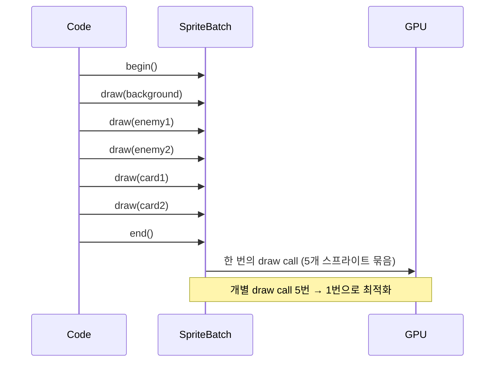
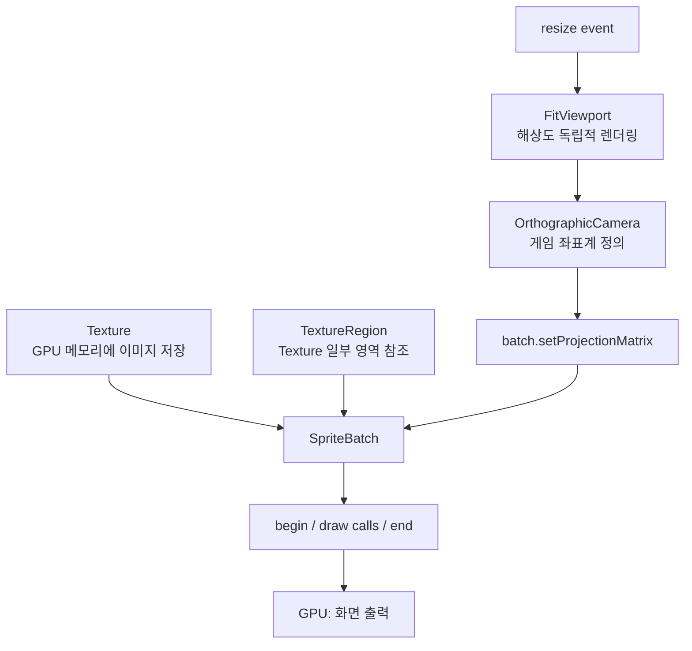

# Ch02. 렌더링 기초

> 📌 **핵심 요약**
> `SpriteBatch`는 GPU draw call을 최소화하는 배치 렌더러다. `Texture`로 이미지를 로드하고, `OrthographicCamera` + `FitViewport`로 해상도에 독립적인 2D 좌표계를 구성하면, STS의 카드/배경/몬스터를 모든 해상도에서 동일하게 렌더링할 수 있다.

---

## 🎯 학습 목표

1. `SpriteBatch`가 draw call을 줄이는 원리를 설명하고, `begin()`/`end()` 블록을 올바르게 사용할 수 있다
2. `Texture`와 `TextureRegion`으로 이미지를 로드하고 부분 영역을 렌더링할 수 있다
3. `OrthographicCamera`의 좌표계와 `setProjectionMatrix()`의 역할을 이해한다
4. `FitViewport`로 해상도 독립적 렌더링을 구성하고 `resize()`에서 올바르게 업데이트할 수 있다
5. 렌더링 레이어 순서(배경 → 몬스터 → 카드)를 SpriteBatch로 구현할 수 있다

---

## 1. SpriteBatch: 배치 렌더링의 원리

GPU에게 "이 이미지를 여기에 그려라"라고 명령하는 것을 **draw call**이라 한다. draw call은 CPU-GPU 간 통신 비용이 비싸서, 카드 60장을 각각 draw call로 보내면 게임이 느려진다.

`SpriteBatch`는 `begin()`과 `end()` 사이에 요청된 그리기들을 메모리에 쌓아두었다가, `end()` 시점에 **한 번의 draw call**로 GPU에 전송한다.



### 1.1 기본 사용법

```java
public class CombatScreen implements Screen {
    private SpriteBatch batch;
    private Texture backgroundTexture;
    private Texture cardTexture;

    @Override
    public void show() {
        batch = new SpriteBatch();
        backgroundTexture = new Texture("ui/combat_bg.png");
        cardTexture = new Texture("cards/strike.png");
    }

    @Override
    public void render(float delta) {
        // 1. 매 프레임 화면을 지운다
        ScreenUtils.clear(0.1f, 0.1f, 0.15f, 1f);

        // 2. 배치 시작
        batch.begin();

        // 3. 그리기 요청 (실제 GPU 전송은 아직 안 됨)
        batch.draw(backgroundTexture, 0, 0, 1920, 1080);
        batch.draw(cardTexture, 100, 50, 250, 400);

        // 4. 배치 종료 → 이 시점에 GPU로 전송
        batch.end();
    }

    @Override
    public void dispose() {
        // SpriteBatch와 Texture는 GPU 자원 → 반드시 해제
        batch.dispose();
        backgroundTexture.dispose();
        cardTexture.dispose();
    }
}
```

### 1.2 SpriteBatch 사용 시 주의사항

```java
// ❌ 잘못된 예: begin/end 밖에서 draw 호출
batch.draw(texture, 0, 0); // 예외 발생: SpriteBatch is not begun

// ❌ 잘못된 예: begin 두 번 호출
batch.begin();
batch.begin(); // 예외 발생: SpriteBatch.begin cannot be nested

// ❌ 잘못된 예: Game에서 생성한 batch를 dispose
// (공유 batch는 Game.dispose()에서만 해제)
batch.dispose(); // Screen.dispose()에서 호출하면 안 됨

// ✅ 올바른 예: Game에서 공유 batch를 주입받아 사용
public class CombatScreen implements Screen {
    private final SlayTheSpire game;

    @Override
    public void render(float delta) {
        ScreenUtils.clear(0.1f, 0.1f, 0.15f, 1f);
        game.batch.begin();
        // ... draw calls
        game.batch.end();
    }
}
```

---

## 2. Texture와 TextureRegion

### 2.1 Texture: 이미지 로딩

`Texture`는 이미지를 GPU 메모리(VRAM)에 업로드한 것이다.

```java
// 기본 로딩
Texture cardTexture = new Texture(Gdx.files.internal("cards/strike.png"));
// 또는 단축 표현
Texture cardTexture = new Texture("cards/strike.png");

// PNG(투명 지원), JPG(배경 이미지), etc.
Texture background = new Texture("ui/combat_bg.jpg");
```

**Power-of-Two 제약**: 구형 GPU에서는 텍스처 크기가 2의 거듭제곱(256, 512, 1024...)이어야 한다. libGDX는 자동 처리해주지만, 텍스처 아틀라스를 사용하면 이 문제를 근본적으로 해결할 수 있다(Ch05에서 다룸).

### 2.2 TextureRegion: 스프라이트 시트에서 부분 사용

카드 이미지를 하나의 큰 텍스처 아틀라스에 모아두고 `TextureRegion`으로 잘라 쓴다.

```java
// 텍스처 아틀라스에서 특정 영역만 사용
Texture atlas = new Texture("cards/card_atlas.png");

// TextureRegion(texture, x, y, width, height) - 픽셀 단위
TextureRegion strikeRegion = new TextureRegion(atlas, 0, 0, 250, 350);
TextureRegion defendRegion = new TextureRegion(atlas, 250, 0, 250, 350);
TextureRegion bashRegion   = new TextureRegion(atlas, 500, 0, 250, 350);

// 그리기
batch.begin();
batch.draw(strikeRegion, cardX, cardY, cardWidth, cardHeight);
batch.end();
```

### 2.3 TextureRegion 2D 배열로 스프라이트 시트 분할

```java
// 6x4 카드 스프라이트 시트를 자동 분할
Texture sheet = new Texture("cards/all_cards.png");
// splitX=6개, splitY=4개 → 각 타일 크기는 자동 계산
TextureRegion[][] cards = TextureRegion.split(
    sheet,
    sheet.getWidth() / 6,   // 각 카드 너비
    sheet.getHeight() / 4   // 각 카드 높이
);

// 3번째 행, 2번째 열 카드
TextureRegion specificCard = cards[2][1];
```

---

## 3. OrthographicCamera: 2D 좌표계

### 3.1 카메라가 필요한 이유

libGDX의 기본 좌표계는 창 픽셀 단위다. 1920x1080 모니터에서는 카드를 (100, 200)에 그리면 되지만, 1280x720에서는 비율이 달라진다. `OrthographicCamera`는 **게임 좌표계**를 정의한다.

```java
// 게임 좌표계를 1920x1080으로 고정
OrthographicCamera camera = new OrthographicCamera();
camera.setToOrtho(false, 1920, 1080);
// false = Y축 방향: false면 좌하단이 (0,0), 위로 갈수록 Y 증가
// true  = Y축 방향: true면 좌상단이 (0,0), 아래로 갈수록 Y 증가 (GUI 좌표계)
```

### 3.2 libGDX의 좌표계 (중요!)

```
(0, 1080) ──────────── (1920, 1080)
    │                         │
    │    게임 화면              │
    │                         │
(0, 0)  ──────────────  (1920, 0)
   └── 원점: 좌하단 (Left-Bottom)
```

> ⚠️ **STS 개발 시 주의**: 많은 게임/UI 프레임워크는 좌상단이 원점이지만, libGDX SpriteBatch는 **좌하단**이 원점이다. Scene2D(Stage)는 같은 좌하단 원점을 사용하므로 일관성이 있다.

### 3.3 카메라를 SpriteBatch에 적용

```java
// 렌더링 시 카메라 행렬을 SpriteBatch에 설정
camera.update(); // 카메라 위치/크기 변경 후 반드시 호출
batch.setProjectionMatrix(camera.combined);

batch.begin();
// 이제 1920x1080 좌표계로 그리기 가능
batch.draw(texture, 100, 200, 250, 350);
batch.end();
```

---

## 4. Viewport: 해상도 독립적 렌더링

카메라만으로는 부족하다. 창 크기가 바뀔 때 어떻게 처리할지 정책이 필요하다. `Viewport`가 이 역할을 한다.

### 4.1 Viewport 종류 비교

| Viewport | 동작 | STS 적합성 |
|----------|------|------------|
| `FitViewport` | 비율 유지 + 레터박스(검은 띠) | ✅ **추천** — 원본 비율 보장 |
| `FillViewport` | 비율 유지 + 화면 꽉 채움 (잘림) | 배경 이미지에 적합 |
| `ExtendViewport` | 비율 유지 + 여백 영역 확장 | 오픈 월드에 적합 |
| `ScreenViewport` | 창 크기 = 게임 크기 (비율 무시) | UI 픽셀 정밀도 필요 시 |
| `StretchViewport` | 비율 무시하고 늘림 | ❌ 카드가 일그러짐 |

### 4.2 FitViewport 구현

```java
public class CombatScreen implements Screen {
    private static final float WORLD_WIDTH  = 1920f;
    private static final float WORLD_HEIGHT = 1080f;

    private OrthographicCamera camera;
    private FitViewport viewport;
    private SpriteBatch batch;

    @Override
    public void show() {
        camera = new OrthographicCamera();
        // FitViewport: 게임 가상 해상도 정의
        viewport = new FitViewport(WORLD_WIDTH, WORLD_HEIGHT, camera);

        batch = new SpriteBatch();
    }

    @Override
    public void render(float delta) {
        // 뷰포트의 검은 레터박스 영역도 지움
        ScreenUtils.clear(0f, 0f, 0f, 1f);
        // 뷰포트 적용 (레터박스 그리기)
        viewport.apply();

        camera.update();
        batch.setProjectionMatrix(camera.combined);

        batch.begin();
        // 1920x1080 좌표계로 그림
        // 실제 창이 1280x720이어도 자동 스케일
        batch.draw(cardTexture, 840, 200, 240, 340);
        batch.end();
    }

    @Override
    public void resize(int width, int height) {
        // 창 크기 변경 시 뷰포트에 알림 (필수!)
        viewport.update(width, height, true);
        // true: 카메라를 뷰포트 중앙에 맞춤
    }
}
```

### 4.3 FitViewport 동작 방식 시각화

```
가상 해상도: 1920 x 1080 (16:9)

실제 창이 1280x800 (16:10)인 경우:
┌──────────────────────────────┐  ← 실제 창 (1280x800)
│░░░░░░░░░░░░░░░░░░░░░░░░░░░░░│  ← 검은 레터박스 (위)
│                              │
│    게임 영역 (1280x720)       │  ← FitViewport가 스케일 조정
│                              │
│░░░░░░░░░░░░░░░░░░░░░░░░░░░░░│  ← 검은 레터박스 (아래)
└──────────────────────────────┘
```

---

## 5. 렌더링 파이프라인 전체 흐름



---

## 6. STS 렌더링 레이어 구성

STS의 전투 화면은 다음 순서로 레이어를 쌓는다 (배치 기준):

```java
@Override
public void render(float delta) {
    ScreenUtils.clear(0f, 0f, 0f, 1f);
    viewport.apply();
    camera.update();

    // === SpriteBatch 레이어 (배경 ~ 카드) ===
    game.batch.setProjectionMatrix(camera.combined);
    game.batch.begin();

    // Layer 1: 배경
    game.batch.draw(combatBackground, 0, 0, WORLD_WIDTH, WORLD_HEIGHT);

    // Layer 2: 몬스터 (배경 위에)
    for (Enemy enemy : enemies) {
        game.batch.draw(enemy.getTexture(),
            enemy.getX(), enemy.getY(),
            enemy.getWidth(), enemy.getHeight());
    }

    // Layer 3: 플레이어
    game.batch.draw(playerTexture, 100, 150, 300, 500);

    // Layer 4: 카드 (맨 위에) — 손패
    for (CardActor card : handCards) {
        game.batch.draw(card.getTexture(),
            card.getX(), card.getY(),
            card.getWidth(), card.getHeight());
    }

    game.batch.end();

    // === Stage 레이어 (HUD, UI) ===
    // stage.draw()는 내부적으로 별도 SpriteBatch 사용
    stage.act(delta);
    stage.draw();
}
```

---

## 7. dispose() 패턴의 중요성

libGDX에서 `Texture`, `SpriteBatch`, `Sound` 등은 GPU/네이티브 메모리를 사용한다. Java GC가 자동으로 해제하지 않으므로 반드시 `dispose()`를 호출해야 한다.

```java
public class CombatScreen implements Screen {
    private Texture background;
    private Texture[] cardTextures;
    private SpriteBatch batch; // Game에서 공유받으면 여기서 dispose 금지!

    @Override
    public void show() {
        background = new Texture("ui/combat_bg.png");
        cardTextures = new Texture[]{
            new Texture("cards/strike.png"),
            new Texture("cards/defend.png"),
        };
    }

    @Override
    public void dispose() {
        // 이 Screen에서 생성한 것만 해제
        background.dispose();
        for (Texture t : cardTextures) {
            t.dispose();
        }
        // batch는 Game에서 생성했으므로 여기서 dispose하지 않음
    }
}
```

> **팁**: libGDX는 `dispose()` 누락을 감지하는 도구를 제공한다. 개발 중 `Gdx.app.setLogLevel(Application.LOG_DEBUG)`를 설정하면 누수 경고가 출력된다.

---

## 정리

- **SpriteBatch**: `begin()` ~ `end()` 사이의 draw 호출을 모아 한 번에 GPU 전송 → draw call 최소화
- **Texture**: GPU 메모리의 이미지. 사용 후 반드시 `dispose()` 필요
- **TextureRegion**: 하나의 큰 텍스처에서 부분 영역만 참조 → 텍스처 아틀라스의 기반
- **OrthographicCamera**: 게임 가상 좌표계 정의. libGDX는 **좌하단 원점**
- **FitViewport**: 가상 해상도(1920x1080)를 실제 창에 맞게 스케일. 레터박스로 비율 보존
- **레이어 순서**: `batch.draw()` 호출 순서가 레이어 순서. 나중에 그린 것이 위에 표시됨

다음 챕터(Ch03)에서는 Scene2D의 `Stage`와 `Actor`로 카드를 인터랙티브한 UI 요소로 만드는 방법을 배운다.

---

## 🔍 심화 학습

### 추천 자료

| 자료 | 링크 | 설명 |
|------|------|------|
| libGDX SpriteBatch 위키 | https://libgdx.com/wiki/graphics/2d/spritebatch-textureregions-and-sprites | 공식 문서 |
| Viewport 가이드 | https://libgdx.com/wiki/graphics/viewports | 종류별 상세 비교 |
| Understanding delta time | Game Programming Patterns | 프레임 독립적 업데이트 |
| Texture Atlas 개념 | libGDX TexturePacker | 스프라이트 시트 최적화 |

### TODO 실습 과제

1. - [ ] `assets/cards/strike.png` 파일을 만들고(임시 색상 이미지 가능), `CombatScreen`에서 SpriteBatch로 화면 중앙에 그린다
2. - [ ] `FitViewport`를 설정하고 창 크기를 바꿔가며 레터박스가 나타나는지 확인한다 (`resize()` 구현 필수)
3. - [ ] 하나의 텍스처 이미지에 카드 3장을 가로로 배치하고, `TextureRegion`으로 각각 잘라서 화면에 나란히 그린다
4. - [ ] `batch.draw()` 순서를 바꿔가며 렌더링 레이어 순서를 실험한다 (카드가 배경보다 먼저 그려지면 어떻게 되는가?)
5. - [ ] `dispose()` 없이 화면 전환을 반복하여 메모리 사용량 증가를 관찰하고, `dispose()`를 추가한 후와 비교한다

---

## ✅ 체크리스트

**SpriteBatch**
- [ ] `begin()` 없이 `draw()`를 호출하면 예외가 발생함을 안다
- [ ] `begin()`과 `end()` 사이의 draw call이 한 번에 GPU로 전송됨을 이해한다
- [ ] Game에서 공유한 SpriteBatch를 Screen에서 `dispose()`하면 안 됨을 안다

**Texture / TextureRegion**
- [ ] `new Texture("파일명")`으로 이미지를 로드할 수 있다
- [ ] `TextureRegion`으로 스프라이트 시트의 특정 영역만 잘라 그릴 수 있다
- [ ] Texture는 사용 후 `dispose()`가 필요함을 안다

**Camera / Viewport**
- [ ] libGDX SpriteBatch의 원점이 **좌하단**임을 안다
- [ ] `camera.update()` 후 `batch.setProjectionMatrix(camera.combined)` 순서를 지킨다
- [ ] `resize()` 에서 `viewport.update(width, height, true)` 를 호출해야 함을 안다
- [ ] `FitViewport`가 레터박스로 비율을 유지하는 방식을 설명할 수 있다

**레이어 렌더링**
- [ ] 나중에 `draw()`한 것이 위 레이어에 그려짐을 안다
- [ ] `ScreenUtils.clear()` 없이 렌더링하면 이전 프레임이 남아있음을 안다

---

## 📚 참고 자료

- [libGDX SpriteBatch 공식 위키](https://libgdx.com/wiki/graphics/2d/spritebatch-textureregions-and-sprites)
- [libGDX Viewports 공식 위키](https://libgdx.com/wiki/graphics/viewports)
- [OrthographicCamera JavaDoc](https://libgdx.badlogicgames.com/ci/nightlies/docs/api/com/badlogic/gdx/graphics/OrthographicCamera.html)
- [TextureRegion JavaDoc](https://libgdx.badlogicgames.com/ci/nightlies/docs/api/com/badlogic/gdx/graphics/g2d/TextureRegion.html)
