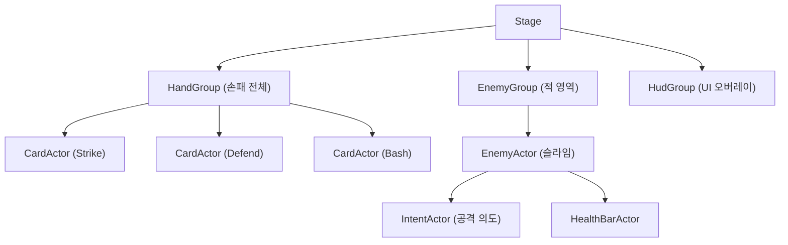

# Ch03. Scene2D 핵심

> 📌 **핵심 요약**
> Scene2D는 libGDX의 2D UI 시스템으로, `Stage`(이벤트/렌더링 컨테이너) + `Actor`(화면 요소) + `Actions`(트윈 애니메이션)의 세 축으로 구성된다. STS의 카드 핸드, 적 배치, 호버 확대 효과를 Scene2D로 구현하면 복잡한 수동 좌표 계산 없이 선언적으로 구성할 수 있다.

---

## 🎯 학습 목표

1. `Stage`를 생성하고 `InputProcessor`로 등록하여 클릭/드래그 이벤트를 받을 수 있다
2. `Actor`를 상속하여 `CardActor`를 구현하고, `draw()` 메서드로 텍스처를 렌더링할 수 있다
3. `Group`으로 관련 Actor를 계층화하고, 부모의 변환이 자식에게 전파됨을 이해한다
4. `Table`로 STS HUD(체력바, 에너지, 카드 핸드)의 레이아웃을 구성할 수 있다
5. `Actions`로 카드 호버 확대, 페이드인 등의 트윈 애니메이션을 구현할 수 있다

---

## 1. Stage: 이벤트 + 렌더링 컨테이너

`Stage`는 Scene2D의 루트 컨테이너다. 두 가지 역할을 동시에 수행한다:
1. **렌더링**: 모든 Actor를 올바른 순서로 그린다
2. **이벤트 처리**: 마우스/터치 이벤트를 올바른 Actor에게 전달한다

```java
public class CombatScreen implements Screen {
    private Stage stage;
    private FitViewport viewport;

    @Override
    public void show() {
        OrthographicCamera camera = new OrthographicCamera();
        viewport = new FitViewport(1920, 1080, camera);

        // Stage는 내부적으로 SpriteBatch를 자체 관리
        stage = new Stage(viewport);

        // Stage를 입력 처리기로 등록
        // → 클릭, 드래그 이벤트가 Stage를 통해 Actor들에게 전달됨
        Gdx.input.setInputProcessor(stage);

        // Actor 추가
        CardActor card = new CardActor(strikeCard, cardTexture);
        card.setPosition(100, 100);
        stage.addActor(card);
    }

    @Override
    public void render(float delta) {
        ScreenUtils.clear(0.1f, 0.1f, 0.15f, 1f);

        // 1. Actor 로직 업데이트 (Actions 처리 포함)
        stage.act(delta);

        // 2. 모든 Actor 렌더링
        stage.draw();
    }

    @Override
    public void resize(int width, int height) {
        viewport.update(width, height, true);
    }

    @Override
    public void dispose() {
        stage.dispose(); // Stage 내부 SpriteBatch도 함께 해제
    }
}
```

### Stage와 일반 SpriteBatch 혼용

```java
@Override
public void render(float delta) {
    ScreenUtils.clear(0f, 0f, 0f, 1f);

    // 1. 배경: 일반 SpriteBatch (Stage 이전에 그림)
    game.batch.setProjectionMatrix(camera.combined);
    game.batch.begin();
    game.batch.draw(backgroundTexture, 0, 0, 1920, 1080);
    game.batch.end();

    // 2. 게임 오브젝트 + UI: Stage
    stage.act(delta);
    stage.draw();
    // Stage는 내부 batch를 사용하므로 game.batch와 충돌 없음
}
```

---

## 2. Actor: 화면 요소의 기본 단위

`Actor`는 Scene2D에서 화면에 표시되는 모든 요소의 기반 클래스다. 위치, 크기, 회전, 투명도 등의 속성을 내장한다.

### 2.1 Actor 기본 속성

```java
Actor actor = new Actor();

// 위치 (좌하단 기준)
actor.setPosition(100f, 200f);   // x, y
actor.setX(100f);
actor.setY(200f);

// 크기
actor.setSize(250f, 350f);
actor.setWidth(250f);
actor.setHeight(350f);

// 회전 (도 단위, 반시계 방향)
actor.setRotation(15f);

// 스케일
actor.setScale(1.2f);      // 균등 확대
actor.setScale(1.5f, 1f);  // X만 확대

// 투명도 (0=완전 투명, 1=완전 불투명)
actor.setColor(1f, 1f, 1f, 0.8f);  // R, G, B, Alpha

// 기준점 (회전/스케일의 중심)
actor.setOrigin(actor.getWidth() / 2, actor.getHeight() / 2); // 중앙 기준
```

### 2.2 CardActor 구현

```java
// core/src/main/java/com/mygame/ui/actor/CardActor.java
public class CardActor extends Actor {

    private final AbstractCard card; // 카드 데이터 (Ch05에서 정의)
    private final Texture texture;
    private boolean hovered = false;

    public CardActor(AbstractCard card, Texture texture) {
        this.card = card;
        this.texture = texture;

        // 카드 크기 설정
        setSize(240f, 340f);
        // 회전/확대 기준점을 카드 하단 중앙으로 (부채꼴 배치 시 자연스러움)
        setOrigin(getWidth() / 2, 0);

        // 이벤트 리스너 등록
        addListener(new InputListener() {
            @Override
            public void enter(InputEvent event, float x, float y, int pointer, Actor fromActor) {
                // 마우스가 카드 위로 진입
                hovered = true;
                addAction(Actions.scaleTo(1.15f, 1.15f, 0.1f, Interpolation.smooth));
            }

            @Override
            public void exit(InputEvent event, float x, float y, int pointer, Actor toActor) {
                // 마우스가 카드 밖으로 나감
                hovered = false;
                addAction(Actions.scaleTo(1f, 1f, 0.1f, Interpolation.smooth));
            }
        });
    }

    @Override
    public void draw(Batch batch, float parentAlpha) {
        // parentAlpha: 부모 Group의 투명도가 자식에게 곱해짐
        Color color = getColor();
        batch.setColor(color.r, color.g, color.b, color.a * parentAlpha);

        // 회전과 스케일을 적용한 드로우
        batch.draw(
            texture,
            getX(), getY(),               // 위치
            getOriginX(), getOriginY(),   // 기준점
            getWidth(), getHeight(),       // 크기
            getScaleX(), getScaleY(),     // 스케일
            getRotation(),                // 회전 각도
            0, 0,                         // 텍스처 소스 x, y
            texture.getWidth(),           // 텍스처 소스 너비
            texture.getHeight(),          // 텍스처 소스 높이
            false, false                  // flipX, flipY
        );

        // 색상 초기화 (다른 Actor에 영향 주지 않음)
        batch.setColor(Color.WHITE);
    }

    @Override
    public void act(float delta) {
        super.act(delta); // 반드시 호출 (Actions 처리)
        // 카드별 업데이트 로직
    }

    public AbstractCard getCard() { return card; }
    public boolean isHovered() { return hovered; }
}
```

---

## 3. Group: Actor 계층화

`Group`은 여러 Actor를 하나로 묶는 컨테이너다. 부모의 위치/회전/스케일 변환이 모든 자식에게 전파된다.



```java
// 손패 전체를 하나의 Group으로 관리
public class HandGroup extends Group {

    private static final float CARD_WIDTH = 240f;
    private static final float CARD_HEIGHT = 340f;
    private static final float FAN_SPREAD = 20f; // 부채꼴 각도 범위

    public HandGroup() {
        setPosition(960f, 100f); // 화면 하단 중앙
    }

    public void layoutCards(Array<CardActor> cards) {
        clearChildren();
        int count = cards.size;
        if (count == 0) return;

        for (int i = 0; i < count; i++) {
            CardActor card = cards.get(i);

            // 부채꼴 배치 계산
            float progress = count == 1 ? 0.5f : (float) i / (count - 1);
            float angle = FAN_SPREAD - (progress * FAN_SPREAD * 2); // +20 ~ -20도
            float xOffset = (i - count / 2f) * (CARD_WIDTH * 0.7f);
            float yOffset = -Math.abs(angle) * 1.5f; // 양 끝이 약간 아래로

            card.setPosition(xOffset - CARD_WIDTH / 2, yOffset);
            card.setRotation(angle);
            card.setOrigin(CARD_WIDTH / 2, 0);

            // Z-order: 마지막 카드가 위에 (오른쪽이 위에 표시)
            addActor(card);
        }
    }
}
```

### Group의 좌표계 변환

```java
// Group 기준 로컬 좌표 ↔ Stage 기준 전역 좌표 변환
Group handGroup = new HandGroup();
handGroup.setPosition(960f, 100f);

// 로컬 좌표 (0, 0)은 전역 좌표 (960, 100)
Vector2 localPos = new Vector2(0, 0);
handGroup.localToStageCoordinates(localPos); // (960, 100)으로 변환됨

// 전역 좌표를 로컬로 변환 (히트 테스트 등에 사용)
Vector2 stagePos = new Vector2(960f, 200f);
handGroup.stageToLocalCoordinates(stagePos); // (0, 100)으로 변환됨
```

---

## 4. Table: 레이아웃 시스템

`Table`은 CSS의 Flexbox와 유사한 격자 기반 레이아웃을 제공한다. HUD(Heads-Up Display) 구성에 매우 유용하다.

```java
// STS 스타일 HUD 레이아웃 구성
public class CombatHud extends Table {

    public CombatHud(Skin skin) {
        // 테이블을 화면 전체 크기로
        setFillParent(true);

        // === 상단: 몬스터 체력 영역 (터치 통과) ===
        // 상단 Row
        Table topRow = new Table();
        topRow.add(new EnemyStatusWidget(skin)).expandX().top().pad(20);
        add(topRow).expandX().fillX().top();

        row(); // 새 행

        // === 중간: 빈 영역 (전투 배경 보이도록) ===
        add().expand(); // 빈 셀이 남은 공간 차지

        row();

        // === 하단: 플레이어 HUD ===
        Table bottomRow = new Table();

        // 플레이어 체력
        Table playerInfo = new Table();
        playerInfo.add(new Label("Ironclad", skin)).left().row();
        playerInfo.add(new HealthBarWidget(skin)).width(200).row();
        bottomRow.add(playerInfo).left().padLeft(40);

        // 에너지 표시 (가운데)
        bottomRow.add(new EnergyWidget(skin)).expandX().center();

        // 카드뽑기 더미 / 버리기 더미 (오른쪽)
        Table deckInfo = new Table();
        deckInfo.add(new Label("Draw: 5", skin)).right().row();
        deckInfo.add(new Label("Discard: 0", skin)).right();
        bottomRow.add(deckInfo).right().padRight(40);

        add(bottomRow).fillX().bottom().padBottom(160); // 카드 핸드 공간 확보
    }
}
```

### Table 레이아웃 메서드

```java
Table table = new Table();
table.setFillParent(true); // 부모(Stage) 크기로 가득 채움

// 셀 추가
table.add(widget)           // 위젯 추가 (현재 행)
    .expand()               // 남은 공간 차지
    .fill()                 // 셀 크기만큼 위젯 늘리기
    .width(200)             // 너비 고정
    .height(50)             // 높이 고정
    .pad(10)                // 상하좌우 패딩
    .padLeft(20)            // 왼쪽 패딩만
    .align(Align.left)      // 셀 내 정렬
    .top()                  // 셀 내 위쪽 정렬
    ;

table.row();    // 새 행으로 이동
table.add(nextWidget).colspan(2); // 두 열에 걸치기
```

---

## 5. Actions: 트윈 애니메이션

`Actions`는 Actor의 속성을 시간에 따라 자동으로 변경하는 애니메이션 시스템이다. `act(delta)` 호출 시마다 진행된다.

### 5.1 기본 Actions

```java
import com.badlogic.gdx.scenes.scene2d.actions.Actions;

// 이동
cardActor.addAction(Actions.moveTo(500f, 300f, 0.3f)); // 0.3초 동안 이동

// 이동 (상대값)
cardActor.addAction(Actions.moveBy(0f, 50f, 0.2f)); // 현재 위치에서 위로 50

// 스케일
cardActor.addAction(Actions.scaleTo(1.2f, 1.2f, 0.15f));

// 회전
cardActor.addAction(Actions.rotateTo(0f, 0.2f));

// 페이드
cardActor.addAction(Actions.fadeIn(0.3f));   // 투명 → 불투명
cardActor.addAction(Actions.fadeOut(0.3f));  // 불투명 → 투명

// 즉시 적용 (시간 없음)
cardActor.addAction(Actions.alpha(0f)); // 즉시 투명하게
```

### 5.2 복합 Actions

```java
// sequence: 순서대로 실행
cardActor.addAction(Actions.sequence(
    Actions.moveTo(960f, 540f, 0.3f),          // 화면 중앙으로 이동
    Actions.scaleTo(1.5f, 1.5f, 0.2f),         // 확대
    Actions.delay(0.5f),                        // 0.5초 대기
    Actions.parallel(                           // 동시 실행
        Actions.scaleTo(1f, 1f, 0.2f),          // 축소
        Actions.fadeOut(0.2f)                   // 페이드 아웃
    ),
    Actions.removeActor()                       // Actor 제거
));

// parallel: 동시 실행
cardActor.addAction(Actions.parallel(
    Actions.moveTo(500f, 200f, 0.4f),
    Actions.rotateTo(0f, 0.4f)
));

// repeat: 반복
cardActor.addAction(Actions.repeat(3, Actions.sequence(
    Actions.moveBy(0, 10f, 0.1f),
    Actions.moveBy(0, -10f, 0.1f)
)));

// forever: 무한 반복
cardActor.addAction(Actions.forever(Actions.sequence(
    Actions.alpha(0.5f, 1f),
    Actions.alpha(1f, 1f)
)));
```

### 5.3 Interpolation: 이징 함수

```java
import com.badlogic.gdx.math.Interpolation;

// 다양한 이징 효과
Actions.moveTo(x, y, 0.3f, Interpolation.smooth);    // 부드러운 감속
Actions.moveTo(x, y, 0.3f, Interpolation.bounceOut); // 통통 튀는 효과
Actions.moveTo(x, y, 0.3f, Interpolation.elasticOut); // 탄성 효과
Actions.moveTo(x, y, 0.3f, Interpolation.swingOut);   // 스윙 효과
Actions.moveTo(x, y, 0.3f, Interpolation.linear);     // 선형 (기본)
Actions.moveTo(x, y, 0.3f, Interpolation.exp5Out);    // 지수 감속

// STS 카드 드로우 시 자주 쓰는 조합
cardActor.addAction(Actions.sequence(
    // 손패 위치로 이동하면서 동시에 회전 조정
    Actions.parallel(
        Actions.moveTo(targetX, targetY, 0.35f, Interpolation.smooth),
        Actions.rotateTo(targetAngle, 0.35f, Interpolation.smooth)
    )
));
```

### 5.4 RunnableAction: 애니메이션 중 로직 실행

```java
// 카드가 대상에 도착한 후 데미지 적용
cardActor.addAction(Actions.sequence(
    Actions.moveTo(enemy.getX(), enemy.getY(), 0.3f, Interpolation.smooth),
    Actions.run(() -> {
        // 데미지 계산 및 적용
        enemy.takeDamage(card.getDamage());
        // 이펙트 생성
        stage.addActor(new DamageNumberActor(card.getDamage(), enemy.getX(), enemy.getY()));
    }),
    Actions.moveTo(originalX, originalY, 0.2f, Interpolation.smooth),
    Actions.removeActor()
));
```

---

## 6. STS 카드 핸드 구현 예시

```java
// 부채꼴 카드 핸드 배치 수학
// 카드 n장을 -θ ~ +θ 범위의 부채꼴로 배치
public void layoutHand(Array<CardActor> hand) {
    int n = hand.size;
    float totalAngle = Math.min(n * 8f, 40f); // 최대 40도 범위
    float angleStep = n > 1 ? totalAngle / (n - 1) : 0;
    float startAngle = totalAngle / 2f;

    // 카드 간격
    float spacing = Math.min(240f, 1400f / Math.max(n, 1));

    for (int i = 0; i < n; i++) {
        CardActor card = hand.get(i);
        float angle = startAngle - i * angleStep;

        // 최종 위치 계산
        float finalX = 960f + (i - n / 2f + 0.5f) * spacing - 120f;
        float finalY = 80f - Math.abs(angle) * 2f; // 양 끝 카드를 약간 아래로

        // 애니메이션으로 이동
        card.addAction(Actions.parallel(
            Actions.moveTo(finalX, finalY, 0.3f, Interpolation.smooth),
            Actions.rotateTo(angle, 0.3f, Interpolation.smooth)
        ));

        // Z-order (오른쪽 카드가 위에)
        card.setZIndex(i);
    }
}
```

---

## 정리

- **Stage**: Scene2D의 루트. `act(delta)` + `draw()`로 모든 Actor를 갱신/렌더링. `Gdx.input.setInputProcessor(stage)` 필수
- **Actor**: 위치/크기/회전/투명도를 내장한 화면 요소. `draw(Batch, float)` 오버라이드로 커스텀 렌더링
- **Group**: Actor를 계층화. 부모 변환이 자식에게 전파. 손패, 적 그룹 관리에 유용
- **Table**: 격자 레이아웃. STS HUD(체력바, 에너지, 덱 정보) 구성에 최적
- **Actions**: 선언적 트윈 애니메이션. `sequence`, `parallel`, `run`을 조합하여 복잡한 연출 표현
- **`act()` 호출 필수**: `Actor.act()` 또는 `super.act(delta)` 호출 없이는 Actions가 처리되지 않음

다음 챕터(Ch04)에서는 `InputMultiplexer`와 `DragAndDrop`으로 카드를 드래그해서 적에게 사용하는 핵심 인터랙션을 구현한다.

---

## 🔍 심화 학습

### 추천 자료

| 자료 | 링크 | 설명 |
|------|------|------|
| Scene2D 공식 위키 | https://libgdx.com/wiki/graphics/2d/scene2d/scene2d | Stage/Actor 상세 문서 |
| Scene2D UI 위키 | https://libgdx.com/wiki/graphics/2d/scene2d/scene2d-ui | Table, Skin, Widget |
| Actions 위키 | https://libgdx.com/wiki/graphics/2d/scene2d/scene2d#actions | 모든 Action 목록 |
| Interpolation 목록 | libGDX JavaDoc | 이징 함수 비교 |

### TODO 실습 과제

1. - [ ] `CardActor`를 구현하고, `Stage`에 5장의 카드를 추가한 후 부채꼴 레이아웃으로 배치한다 (`HandGroup.layoutCards()` 구현)
2. - [ ] 카드에 `InputListener`를 추가하여 마우스 호버 시 카드가 위로 올라오는 애니메이션(`moveBy(0, 40, 0.1f)`)을 구현한다
3. - [ ] `Table`을 사용하여 화면 하단에 HUD를 배치한다 (최소 체력 표시 + 에너지 숫자)
4. - [ ] 카드를 클릭하면 화면 중앙으로 이동했다가 원래 자리로 돌아오는 `sequence` Action을 구현한다
5. - [ ] `Group`을 상속하여 적(`EnemyGroup`)을 만들고, 적 체력바를 자식 Actor로 추가한다. 적 Group을 이동시키면 체력바도 함께 이동하는지 확인한다

---

## ✅ 체크리스트

**Stage**
- [ ] `Stage.act(delta)`와 `Stage.draw()`를 렌더 루프에서 호출한다
- [ ] `Gdx.input.setInputProcessor(stage)` 없이는 이벤트가 전달되지 않음을 안다
- [ ] `Stage.dispose()`를 `Screen.dispose()`에서 호출한다

**Actor**
- [ ] `draw(Batch batch, float parentAlpha)`에서 `parentAlpha`를 색상에 곱해야 함을 안다
- [ ] `act(float delta)`에서 `super.act(delta)`를 반드시 호출해야 함을 안다
- [ ] `setOrigin()`으로 회전/스케일 기준점을 설정할 수 있다

**Group / Table**
- [ ] `Group`에 자식을 추가하면 부모 좌표계를 기준으로 위치가 결정됨을 안다
- [ ] `Table.setFillParent(true)`로 Stage 전체를 채울 수 있다
- [ ] `table.row()`로 새 행을 시작한다

**Actions**
- [ ] `Actions.sequence()`로 순서대로 실행되는 액션을 만들 수 있다
- [ ] `Actions.parallel()`로 동시에 실행되는 액션을 만들 수 있다
- [ ] `Actions.run(Runnable)`으로 애니메이션 중간에 로직을 실행할 수 있다
- [ ] `Interpolation.smooth`와 `Interpolation.linear`의 차이를 안다

---

## 📚 참고 자료

- [libGDX Scene2D 공식 위키](https://libgdx.com/wiki/graphics/2d/scene2d/scene2d)
- [libGDX Scene2D UI 공식 위키](https://libgdx.com/wiki/graphics/2d/scene2d/scene2d-ui)
- [Stage JavaDoc](https://libgdx.badlogicgames.com/ci/nightlies/docs/api/com/badlogic/gdx/scenes/scene2d/Stage.html)
- [Actor JavaDoc](https://libgdx.badlogicgames.com/ci/nightlies/docs/api/com/badlogic/gdx/scenes/scene2d/Actor.html)
- [Actions JavaDoc](https://libgdx.badlogicgames.com/ci/nightlies/docs/api/com/badlogic/gdx/scenes/scene2d/actions/Actions.html)
- [Interpolation JavaDoc](https://libgdx.badlogicgames.com/ci/nightlies/docs/api/com/badlogic/gdx/math/Interpolation.html)
