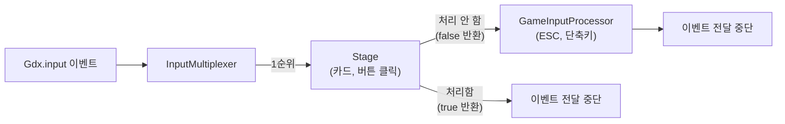
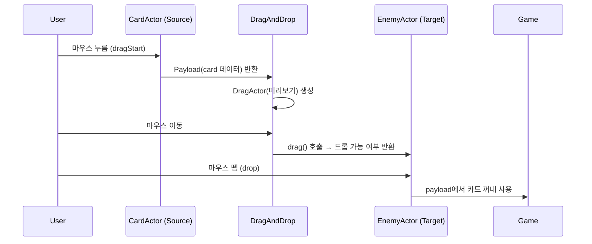
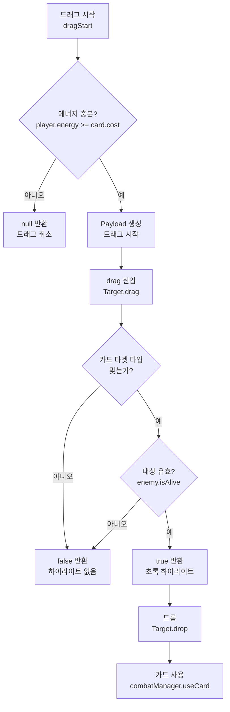

# Ch04. 입력 처리 & DragAndDrop

> 📌 **핵심 요약**
> `InputMultiplexer`로 Stage와 게임 전용 입력 처리기를 체이닝하고, libGDX 내장 `DragAndDrop` 시스템의 Source/Target/Payload 패턴으로 카드를 적에게 드래그해서 사용하는 STS의 핵심 인터랙션을 구현할 수 있다.

---

## 🎯 학습 목표

1. `InputMultiplexer`로 Stage 이벤트와 게임 입력을 올바른 우선순위로 처리할 수 있다
2. `ClickListener`와 `InputListener`로 Actor별 이벤트를 처리할 수 있다
3. `DragAndDrop`의 Source, Target, Payload 구조를 이해하고 구현할 수 있다
4. 드래그 유효성 검사(에너지 부족, 타겟 불가)를 Target에서 처리할 수 있다
5. STS 스타일의 카드 드래그 비주얼(미리보기, 화살표, 타겟 하이라이트)을 구현할 수 있다

---

## 1. 입력 처리 구조

libGDX의 모든 입력(키보드, 마우스, 터치)은 `Gdx.input`을 통해 들어온다. 처리기를 등록하는 방법은 두 가지다:

| 방식 | 사용처 | 특징 |
|------|--------|------|
| `Gdx.input.isKeyPressed()` | 폴링 방식 | `render()` 안에서 매 프레임 체크 |
| `Gdx.input.setInputProcessor()` | 이벤트 방식 | 이벤트 발생 시 콜백 호출 |

### 1.1 폴링 방식 (간단한 입력)

```java
@Override
public void render(float delta) {
    // 키보드 입력 폴링
    if (Gdx.input.isKeyJustPressed(Keys.ESCAPE)) {
        // ESC를 방금 눌렀을 때 (이 프레임에만 true)
        game.setScreen(new MainMenuScreen(game));
    }

    if (Gdx.input.isKeyPressed(Keys.SPACE)) {
        // 스페이스 바를 누르고 있는 동안 (매 프레임 true)
        endTurn();
    }

    // 마우스 위치 (화면 픽셀 좌표)
    int mouseX = Gdx.input.getX();
    int mouseY = Gdx.input.getY();
    // ⚠️ 게임 좌표로 변환 필요 (viewport.unproject 사용)
}
```

---

## 2. InputMultiplexer: 다중 입력 처리기 체이닝

전투 화면에는 두 가지 입력 처리가 필요하다:
1. **Stage**: 카드 클릭, 버튼 클릭 (Scene2D가 처리)
2. **게임 입력**: ESC 메뉴, 단축키, 카메라 이동

`InputMultiplexer`는 등록된 순서대로 처리기에 이벤트를 전달하고, 처리기가 `true`를 반환하면 이후 처리기로 전달하지 않는다.



```java
// CombatScreen.show()
@Override
public void show() {
    stage = new Stage(viewport);

    // 게임 전용 입력 처리기
    InputProcessor gameInput = new InputAdapter() {
        @Override
        public boolean keyDown(int keycode) {
            if (keycode == Keys.ESCAPE) {
                showPauseMenu();
                return true; // 처리 완료 → Stage로 전달하지 않음
            }
            if (keycode == Keys.E) {
                endTurn();
                return true;
            }
            return false; // 미처리 → 다음 처리기로 전달
        }
    };

    // Multiplexer 설정: Stage 우선, 그 다음 게임 입력
    InputMultiplexer multiplexer = new InputMultiplexer();
    multiplexer.addProcessor(stage);      // 1순위: UI
    multiplexer.addProcessor(gameInput);  // 2순위: 게임 단축키
    Gdx.input.setInputProcessor(multiplexer);
}
```

---

## 3. ClickListener와 InputListener

### 3.1 ClickListener: 클릭 이벤트

```java
// Actor에 클릭 리스너 추가
endTurnButton.addListener(new ClickListener() {
    @Override
    public void clicked(InputEvent event, float x, float y) {
        // 버튼이 클릭될 때만 호출 (눌렀다 뗐을 때)
        endTurn();
    }
});

// 탭 카운트로 더블클릭 감지
cardActor.addListener(new ClickListener() {
    @Override
    public void clicked(InputEvent event, float x, float y) {
        if (getTapCount() == 2) {
            // 더블클릭 → 카드 사용 (클릭+클릭 방식)
            useCard(cardActor.getCard(), null);
        }
    }
});
```

### 3.2 InputListener: 세밀한 이벤트 제어

```java
cardActor.addListener(new InputListener() {
    @Override
    public boolean touchDown(InputEvent event, float x, float y, int pointer, int button) {
        // 마우스 버튼 누름. true를 반환해야 이후 이벤트(touchUp 등)를 받음
        return true;
    }

    @Override
    public void touchUp(InputEvent event, float x, float y, int pointer, int button) {
        // 마우스 버튼 뗌
    }

    @Override
    public void touchDragged(InputEvent event, float x, float y, int pointer) {
        // 누른 채 이동
    }

    @Override
    public void enter(InputEvent event, float x, float y, int pointer, Actor fromActor) {
        // 마우스 진입 — 호버 효과 시작
        setHovered(true);
    }

    @Override
    public void exit(InputEvent event, float x, float y, int pointer, Actor toActor) {
        // 마우스 이탈 — 호버 효과 종료
        // pointer == -1 이면 터치 없이 마우스만 이동한 것
        if (pointer < 0) {
            setHovered(false);
        }
    }
});
```

### 3.3 Actor의 히트 영역 커스터마이징

기본적으로 Actor의 히트 영역은 `(0, 0, width, height)` 직사각형이다. 회전된 카드는 실제 화면 영역과 히트 영역이 다를 수 있다.

```java
@Override
public Actor hit(float x, float y, boolean touchable) {
    // 기본 직사각형 히트 테스트
    if (x >= 0 && x <= getWidth() && y >= 0 && y <= getHeight()) {
        return this;
    }
    return null;
}
```

---

## 4. DragAndDrop: 카드 드래그 시스템

libGDX의 `DragAndDrop` 클래스는 드래그앤드롭 인터랙션의 전체 흐름을 관리한다.

### 4.1 핵심 구성 요소



### 4.2 Source: 드래그 시작점 (카드)

```java
// CardActor를 DragAndDrop Source로 등록
DragAndDrop dragAndDrop = new DragAndDrop();

// 드래그 시작 임계값 (픽셀) — 실수 클릭을 드래그로 오인 방지
dragAndDrop.setDragActorPosition(0, 0);
dragAndDrop.setTapSquareSize(8f); // 8픽셀 이상 움직여야 드래그로 인식

for (CardActor cardActor : handCards) {
    dragAndDrop.addSource(new DragAndDrop.Source(cardActor) {

        private Vector2 originalPosition = new Vector2();
        private float originalRotation;

        @Override
        public DragAndDrop.Payload dragStart(InputEvent event, float x, float y, int pointer) {
            AbstractCard card = cardActor.getCard();

            // 에너지 부족 시 드래그 자체를 막음
            if (player.getEnergy() < card.getEnergyCost()) {
                // null 반환 → 드래그 취소
                return null;
            }

            // 원래 위치 저장 (드롭 취소 시 복귀용)
            originalPosition.set(cardActor.getX(), cardActor.getY());
            originalRotation = cardActor.getRotation();

            // 드래그 중 원본 카드 반투명 처리
            cardActor.addAction(Actions.alpha(0.4f, 0.1f));

            // Payload 구성
            DragAndDrop.Payload payload = new DragAndDrop.Payload();

            // 전달할 데이터
            payload.setObject(card);

            // 드래그 중 마우스를 따라다니는 비주얼
            CardActor dragVisual = new CardActor(card, cardActor.getTexture());
            dragVisual.setSize(cardActor.getWidth() * 0.85f, cardActor.getHeight() * 0.85f);
            dragVisual.setRotation(0); // 드래그 중엔 똑바로
            payload.setDragActor(dragVisual);

            // 드롭 가능 영역 위의 비주얼 (선택사항)
            // payload.setValidDragActor(validDragVisual);
            // payload.setInvalidDragActor(invalidDragVisual);

            return payload;
        }

        @Override
        public void dragStop(InputEvent event, float x, float y, int pointer,
                             DragAndDrop.Payload payload, DragAndDrop.Target target) {
            // 드래그 종료 시 항상 호출 (drop 여부 무관)
            // 드롭이 성공했으면 target != null
            if (target == null) {
                // 드롭 실패 → 카드 원래 위치로 복귀
                cardActor.clearActions();
                cardActor.addAction(Actions.parallel(
                    Actions.moveTo(originalPosition.x, originalPosition.y, 0.2f, Interpolation.smooth),
                    Actions.rotateTo(originalRotation, 0.2f, Interpolation.smooth),
                    Actions.alpha(1f, 0.2f)
                ));
            }
        }
    });
}
```

### 4.3 Target: 드롭 대상 (적, 플레이어, 자신)

```java
// 적 Actor를 Target으로 등록
for (EnemyActor enemyActor : enemyActors) {
    dragAndDrop.addTarget(new DragAndDrop.Target(enemyActor) {

        @Override
        public boolean drag(DragAndDrop.Source source, DragAndDrop.Payload payload,
                            float x, float y, int pointer) {
            AbstractCard card = (AbstractCard) payload.getObject();
            Enemy enemy = enemyActor.getEnemy();

            // 드롭 가능 여부 판단
            boolean canDrop = card.isTargetEnemy()     // 적 대상 카드인가?
                && enemy.isAlive()                     // 적이 살아있는가?
                && player.getEnergy() >= card.getEnergyCost(); // 에너지 충분한가?

            // 하이라이트 효과
            if (canDrop) {
                enemyActor.setHighlighted(true); // 초록 테두리 등
            } else {
                enemyActor.setHighlighted(false);
            }

            return canDrop; // true: 드롭 허용, false: 드롭 거부
        }

        @Override
        public void drop(DragAndDrop.Source source, DragAndDrop.Payload payload,
                         float x, float y, int pointer) {
            // 실제 드롭 실행
            AbstractCard card = (AbstractCard) payload.getObject();
            Enemy enemy = enemyActor.getEnemy();

            // 카드 사용 처리
            combatManager.useCard(card, player, enemy);

            // 시각적 피드백
            enemyActor.setHighlighted(false);
        }

        @Override
        public void reset(DragAndDrop.Source source, DragAndDrop.Payload payload) {
            // 다른 Target으로 이동하거나 드래그 종료 시
            enemyActor.setHighlighted(false);
        }
    });
}
```

### 4.4 Target 등록: 여러 타입의 드롭 대상

```java
// STS에는 세 종류의 드롭 대상이 있음
// 1. 적 (공격 카드)
for (EnemyActor enemyActor : enemyActors) {
    dragAndDrop.addTarget(new EnemyTarget(enemyActor, combatManager, player));
}

// 2. 플레이어 자신 (방어, 힐 카드)
dragAndDrop.addTarget(new PlayerTarget(playerActor, combatManager, player));

// 3. 전체 화면 영역 (AOE 카드 - 모든 적에게 적용)
Actor fullScreenTarget = new Actor();
fullScreenTarget.setSize(1920, 1080);
fullScreenTarget.setPosition(0, 0);
stage.addActor(fullScreenTarget); // Stage에 추가 후 Target 등록
dragAndDrop.addTarget(new AllEnemyTarget(fullScreenTarget, enemyActors, combatManager, player));
```

---

## 5. STS의 두 가지 카드 사용 방식 비교

STS는 카드 사용에 두 가지 방법을 제공한다:

| 방식 | 구현 방법 | 타겟이 필요한 카드 | 타겟 불필요 카드 |
|------|-----------|------------------|----------------|
| **드래그앤드롭** | `DragAndDrop` | 적 위에 드롭 | 화면 아무데나 드롭 |
| **클릭+클릭** | `ClickListener` | 카드 클릭 → 적 클릭 | 카드 클릭 → 즉시 사용 |

```java
// 클릭+클릭 방식 구현
public class CombatScreen implements Screen {
    private CardActor selectedCard = null;

    private void setupClickMode(CardActor cardActor) {
        cardActor.addListener(new ClickListener() {
            @Override
            public void clicked(InputEvent event, float x, float y) {
                AbstractCard card = cardActor.getCard();

                if (card.isTargetNone()) {
                    // 타겟 불필요 (강타 등) → 즉시 사용
                    combatManager.useCard(card, player, null);
                } else {
                    // 타겟 필요 → 카드 선택 상태로
                    selectCard(cardActor);
                }
            }
        });
    }

    private void selectCard(CardActor card) {
        // 이전 선택 해제
        if (selectedCard != null) {
            selectedCard.setSelected(false);
        }
        selectedCard = card;
        card.setSelected(true);

        // 적 Actor에 클릭 리스너 추가
        for (EnemyActor enemyActor : enemyActors) {
            enemyActor.addListener(new ClickListener() {
                @Override
                public void clicked(InputEvent event, float x, float y) {
                    if (selectedCard != null) {
                        combatManager.useCard(selectedCard.getCard(), player, enemyActor.getEnemy());
                        deselectCard();
                    }
                    // 리스너 제거 (일회성)
                    enemyActor.removeListener(this);
                }
            });
        }
    }
}
```

---

## 6. 드래그 유효성 검사 패턴

카드 사용 가능 여부를 여러 레이어에서 검사한다:



```java
// 카드 사용 가능 여부를 중앙화
public class CardValidator {
    public static boolean canUseCard(AbstractCard card, Player player, Targetable target) {
        // 1. 에너지 검사
        if (player.getEnergy() < card.getEnergyCost()) return false;

        // 2. 타겟 타입 검사
        if (card.getTargetType() == TargetType.ENEMY && !(target instanceof Enemy)) return false;
        if (card.getTargetType() == TargetType.SELF && !(target instanceof Player)) return false;
        if (card.getTargetType() == TargetType.NONE && target != null) return false;

        // 3. 타겟 생존 검사
        if (target instanceof Enemy && !((Enemy) target).isAlive()) return false;

        // 4. 특수 조건 (카드별 오버라이드)
        return card.canUse(player, target);
    }
}
```

---

## 7. 호버 감지와 카드 프리뷰

```java
// 드래그 중 카드 미리보기 창 표시
dragAndDrop.addSource(new DragAndDrop.Source(cardActor) {
    private CardPreviewActor preview;

    @Override
    public DragAndDrop.Payload dragStart(InputEvent event, float x, float y, int pointer) {
        // 드래그 시작 시 상세 미리보기 창 표시
        preview = new CardPreviewActor(card, skin);
        preview.setPosition(50, 200); // 화면 왼쪽에 고정
        stage.addActor(preview);
        preview.addAction(Actions.fadeIn(0.2f));

        // ... payload 구성
        return payload;
    }

    @Override
    public void dragStop(InputEvent event, float x, float y, int pointer,
                         DragAndDrop.Payload payload, DragAndDrop.Target target) {
        // 미리보기 창 제거
        if (preview != null) {
            preview.addAction(Actions.sequence(
                Actions.fadeOut(0.15f),
                Actions.removeActor()
            ));
        }
    }
});
```

---

## 8. 완성된 입력 처리 구조

```java
public class CombatScreen implements Screen {
    private Stage stage;
    private DragAndDrop dragAndDrop;

    @Override
    public void show() {
        // 1. Stage 생성
        stage = new Stage(viewport);

        // 2. DragAndDrop 초기화
        dragAndDrop = new DragAndDrop();
        dragAndDrop.setDragTime(0);       // 즉시 드래그 (기본 250ms 딜레이 제거)
        dragAndDrop.setDragActorPosition(-60, -170); // 커서 기준 드래그 비주얼 위치

        // 3. 카드 Actor 생성 및 Source 등록
        for (AbstractCard card : combatState.getHand()) {
            CardActor actor = new CardActor(card, assetManager.getTexture(card));
            dragAndDrop.addSource(new CardDragSource(actor, player));
            stage.addActor(actor);
        }

        // 4. 적 Target 등록
        for (Enemy enemy : combatState.getEnemies()) {
            EnemyActor enemyActor = new EnemyActor(enemy, assetManager);
            dragAndDrop.addTarget(new EnemyDropTarget(enemyActor, combatManager));
            stage.addActor(enemyActor);
        }

        // 5. InputMultiplexer
        InputMultiplexer multiplexer = new InputMultiplexer();
        multiplexer.addProcessor(stage);
        multiplexer.addProcessor(new CombatKeyboardInput(game, this));
        Gdx.input.setInputProcessor(multiplexer);
    }

    @Override
    public void render(float delta) {
        ScreenUtils.clear(0.1f, 0.1f, 0.15f, 1f);
        stage.act(delta);
        stage.draw();
    }

    @Override
    public void dispose() {
        stage.dispose();
    }
}
```

---

## 정리

- **InputMultiplexer**: 여러 InputProcessor를 체이닝. Stage를 1순위로, 게임 단축키를 2순위로 등록
- **ClickListener vs InputListener**: ClickListener는 클릭에 최적화, InputListener는 세밀한 이벤트 제어(touchDown/Up/Dragged/enter/exit)
- **DragAndDrop 3요소**:
  - **Source**: 드래그 시작. `dragStart()`에서 Payload 반환. `null` 반환 시 드래그 취소
  - **Target**: 드롭 대상. `drag()`에서 true/false로 수락 여부 결정. `drop()`에서 실제 처리
  - **Payload**: Source → Target으로 전달되는 데이터. `setObject()`로 카드 데이터 전달
- **dragStop()**: 드롭 성공/실패와 무관하게 항상 호출. `target == null`이면 드롭 실패
- **유효성 검사 레이어**: dragStart (에너지 체크) → drag (타겟 타입+생존 체크) → useCard (최종 검증)

다음 챕터(Ch05)에서는 AssetManager를 사용하여 텍스처와 사운드를 비동기로 로딩하고, 로딩 화면을 구현하는 방법을 배운다.

---

## 🔍 심화 학습

### 추천 자료

| 자료 | 링크 | 설명 |
|------|------|------|
| libGDX Input 위키 | https://libgdx.com/wiki/input/mouse-touch-and-keyboard | 입력 처리 전반 |
| Scene2D 이벤트 시스템 | https://libgdx.com/wiki/graphics/2d/scene2d/scene2d | Event/Listener 상세 |
| DragAndDrop 위키 | https://libgdx.com/wiki/graphics/2d/scene2d/scene2d-ui#dragndrop | 공식 DnD 문서 |
| InputMultiplexer JavaDoc | libGDX JavaDoc | 메서드 목록 |

### TODO 실습 과제

1. - [ ] `InputMultiplexer`를 설정하고, ESC 키로 일시정지 화면을 토글하는 `CombatKeyboardInput` 클래스를 구현한다 (Stage의 버튼 클릭과 충돌 없이 동작해야 함)
2. - [ ] `CardActor`에 `InputListener`를 추가하여 마우스 enter/exit에서 카드 설명 팝업을 표시/숨기는 기능을 구현한다
3. - [ ] `DragAndDrop`을 설정하고, 카드를 드래그하여 `EnemyActor` 위에 드롭할 때 콘솔에 "카드 사용: [카드이름] → [적이름]"을 출력하는 프로토타입을 만든다
4. - [ ] `Target.drag()`에서 에너지가 부족하면 `false`를 반환하고, 드래그 비주얼의 색상을 빨간색으로 바꾸는 시각적 피드백을 구현한다
5. - [ ] `dragStop()`에서 드롭이 취소되었을 때(target == null) 카드가 원래 손패 위치로 부드럽게 복귀하는 애니메이션을 구현한다

---

## ✅ 체크리스트

**InputMultiplexer**
- [ ] `multiplexer.addProcessor()` 순서가 우선순위임을 안다 (먼저 추가 = 높은 우선순위)
- [ ] `true` 반환 시 이벤트가 다음 처리기로 전달되지 않음을 안다
- [ ] Stage를 InputMultiplexer에 추가하지 않으면 Actor 이벤트가 동작하지 않음을 안다

**ClickListener / InputListener**
- [ ] `InputListener.touchDown()`이 `true`를 반환해야 이후 이벤트(touchUp 등)를 받음을 안다
- [ ] `exit()` 이벤트에서 `pointer == -1`이면 터치 없는 마우스 이동임을 안다
- [ ] `ClickListener`는 내부적으로 터치 다운+업이 같은 Actor에서 발생해야 clicked가 호출됨을 안다

**DragAndDrop**
- [ ] `dragStart()`에서 `null` 반환 시 드래그가 취소됨을 안다
- [ ] `drag()`의 반환값이 `drop()` 호출 여부를 결정함을 안다
- [ ] `dragStop()`은 드롭 성공/실패와 무관하게 항상 호출됨을 안다
- [ ] `payload.setObject()`로 Source에서 Target으로 데이터를 전달할 수 있다

**유효성 검사**
- [ ] 에너지 부족 시 `dragStart()`에서 `null`을 반환하여 드래그 자체를 막을 수 있다
- [ ] 타겟 불가 시 `drag()`에서 `false`를 반환하여 드롭을 거부할 수 있다
- [ ] `reset()`은 드래그가 Target 영역을 벗어날 때 호출됨을 안다

---

## 📚 참고 자료

- [libGDX Input Handling 공식 위키](https://libgdx.com/wiki/input/mouse-touch-and-keyboard)
- [Scene2D Event System 위키](https://libgdx.com/wiki/graphics/2d/scene2d/scene2d#event-system)
- [DragAndDrop 공식 위키](https://libgdx.com/wiki/graphics/2d/scene2d/scene2d-ui#dragndrop)
- [InputMultiplexer JavaDoc](https://libgdx.badlogicgames.com/ci/nightlies/docs/api/com/badlogic/gdx/InputMultiplexer.html)
- [DragAndDrop JavaDoc](https://libgdx.badlogicgames.com/ci/nightlies/docs/api/com/badlogic/gdx/scenes/scene2d/utils/DragAndDrop.html)
