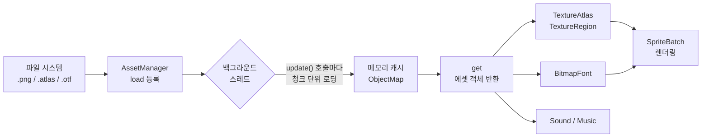

# Ch05. 에셋 관리 & 한글 폰트

> 📌 **핵심 요약**
> AssetManager로 게임 리소스를 비동기 로딩·참조 카운팅 관리하고, TextureAtlas로 draw call을 줄이며, FreeTypeFontGenerator로 한글 BitmapFont를 런타임에 생성한다.

---

## 🎯 학습 목표

1. AssetManager의 비동기 로딩 원리와 참조 카운팅을 이해한다.
2. TextureAtlas가 렌더링 성능에 미치는 영향을 설명할 수 있다.
3. TexturePacker CLI로 개별 이미지를 atlas로 패킹할 수 있다.
4. FreeTypeFontGenerator로 한글 BitmapFont를 메모리 효율적으로 생성할 수 있다.
5. STS 에셋을 추출하여 프로젝트에 통합하는 절차를 수행할 수 있다.

---

## 1. AssetManager — 비동기 로딩의 필요성

게임은 시작 시 수십~수백 MB의 텍스처·사운드·폰트를 메모리에 올려야 한다. 이를 메인 스레드에서 동기적으로 모두 로딩하면 화면이 수 초간 멈춘다. `AssetManager`는 **백그라운드 스레드에서 로딩을 수행**하고, 메인 스레드는 매 프레임 `update()`를 호출해 진행률을 확인하면서 로딩 화면을 렌더링할 수 있다.

### 1.1 기본 사용 패턴

```java
public class LoadingScreen implements Screen {
    private final SlayTheSpire game;
    private AssetManager assets;

    public LoadingScreen(SlayTheSpire game) {
        this.game = game;
        assets = game.assets; // Game 클래스에서 공유

        // 로딩할 에셋 등록 (실제 로딩은 아직 시작 안 됨)
        assets.load("atlas/cards.atlas", TextureAtlas.class);
        assets.load("atlas/effects.atlas", TextureAtlas.class);
        assets.load("audio/sfx/draw_card.mp3", Sound.class);
        assets.load("fonts/NotoSansKR-Regular.otf", FileHandle.class);
    }

    @Override
    public void render(float delta) {
        // update()는 한 번에 일부만 로딩하고 true를 반환하면 완료
        if (assets.update()) {
            // 모든 에셋 로딩 완료 → 다음 화면으로 전환
            game.setScreen(new MainMenuScreen(game));
            return;
        }

        // 로딩 중 — 진행률 표시
        float progress = assets.getProgress(); // 0.0f ~ 1.0f
        renderProgressBar(progress);
    }
}
```

### 1.2 참조 카운팅

`AssetManager`는 내부적으로 각 에셋의 **참조 횟수**를 추적한다.

```java
// 같은 파일을 두 번 load() 해도 실제 파일은 한 번만 읽힘
assets.load("atlas/cards.atlas", TextureAtlas.class);
assets.load("atlas/cards.atlas", TextureAtlas.class); // 참조 카운트 +1

// get()은 캐시된 객체를 반환
TextureAtlas atlas1 = assets.get("atlas/cards.atlas", TextureAtlas.class);
TextureAtlas atlas2 = assets.get("atlas/cards.atlas", TextureAtlas.class);
// atlas1 == atlas2 (동일 객체)

// unload()는 참조 카운트를 하나 줄임
// 카운트가 0이 되면 실제 메모리 해제
assets.unload("atlas/cards.atlas");
```

### 1.3 의존성 자동 관리

`TextureAtlas`는 내부적으로 `.png` 파일들을 참조한다. `AssetManager`는 이 의존성을 자동으로 파악하여 로더가 등록된 순서에 맞게 올바른 순서로 로딩한다.

```java
// AssetDescriptor로 로딩 파라미터 전달
TextureLoader.TextureParameter param = new TextureLoader.TextureParameter();
param.minFilter = Texture.TextureFilter.Linear;
param.magFilter = Texture.TextureFilter.Linear;
assets.load("textures/background.png", Texture.class, param);
```

---

## 2. TextureAtlas — draw call 절약

### 2.1 draw call이란?

GPU에게 "이 텍스처로 이 영역을 그려라"는 명령 하나를 **draw call**이라 한다. 텍스처가 바뀔 때마다 GPU 상태 변경(texture bind)이 발생하여 성능이 저하된다.

```
개별 텍스처 10개:  draw call 10번, 텍스처 바인딩 10번
하나의 atlas:      draw call 1번,  텍스처 바인딩 1번  ← 훨씬 효율적
```

### 2.2 Atlas 사용법

```java
// atlas 로딩
TextureAtlas cardAtlas = assets.get("atlas/cards.atlas", TextureAtlas.class);

// 리전 찾기
TextureRegion strikeRegion = cardAtlas.findRegion("strike");
TextureRegion defendRegion = cardAtlas.findRegion("defend");

// 애니메이션용 리전 배열
Array<TextureAtlas.AtlasRegion> frames = cardAtlas.findRegions("attack_anim");

// SpriteBatch로 그리기
batch.begin();
batch.draw(strikeRegion, x, y, width, height);
batch.end();
```

### 2.3 AtlasRegion vs TextureRegion

`AtlasRegion`은 `TextureRegion`을 상속하며, 추가로 **name**, **index**, **offsetX/Y**(원본 이미지에서의 오프셋), **packedWidth/Height** 등의 메타데이터를 가진다.

```java
TextureAtlas.AtlasRegion region = cardAtlas.findRegion("strike");
System.out.println(region.name);          // "strike"
System.out.println(region.originalWidth); // 원본 크기
System.out.println(region.offsetX);       // 패킹 시 잘린 투명 영역 오프셋
```

---

## 3. TexturePacker — 이미지를 atlas로 패킹

### 3.1 CLI 사용법

```bash
# Gradle 의존성 추가 (build.gradle - desktop 모듈)
implementation "com.badlogicgames.gdx:gdx-tools:$gdxVersion"

# 실행 (개별 이미지 폴더 → atlas 생성)
java -cp gdx-tools.jar com.badlogic.gdx.tools.texturepacker.TexturePacker \
  assets-raw/cards/    \   # 입력: 개별 PNG 폴더
  assets/atlas/        \   # 출력: atlas 폴더
  cards                    # 출력 파일명 (cards.atlas, cards.png)
```

### 3.2 설정 파일 (pack.json)

입력 폴더에 `pack.json`을 두면 패킹 옵션을 지정할 수 있다.

```json
{
  "pot": true,
  "paddingX": 2,
  "paddingY": 2,
  "bleed": true,
  "bleedIterations": 2,
  "edgePadding": true,
  "duplicatePadding": true,
  "rotation": false,
  "minWidth": 16,
  "minHeight": 16,
  "maxWidth": 2048,
  "maxHeight": 2048,
  "stripWhitespaceX": true,
  "stripWhitespaceY": true,
  "filterMin": "Linear",
  "filterMag": "Linear",
  "format": "RGBA8888",
  "jpegQuality": 0.9,
  "outputFormat": "png",
  "fast": false
}
```

### 3.3 Gradle 태스크로 자동화

```groovy
// desktop/build.gradle
task packAtlas(type: JavaExec) {
    mainClass = 'com.badlogic.gdx.tools.texturepacker.TexturePacker'
    classpath = configurations.runtimeClasspath
    args = ['../assets-raw/cards', '../assets/atlas', 'cards']
}

// 빌드 전 자동 실행
compileJava.dependsOn packAtlas
```

---

## 4. STS 에셋 추출

실제 Slay the Spire 에셋을 학습용으로 활용할 수 있다.

### 4.1 macOS Steam 경로

```bash
# STS 설치 경로 (기본값)
~/Library/Application Support/Steam/steamapps/common/SlayTheSpire/

# JAR 파일 위치
~/Library/Application Support/Steam/steamapps/common/SlayTheSpire/desktop-1.0.jar
```

### 4.2 추출 절차

```bash
# 1. 작업 디렉토리 생성
mkdir ~/sts-assets && cd ~/sts-assets

# 2. JAR = ZIP이므로 unzip으로 추출
unzip -o \
  ~/Library/Application\ Support/Steam/steamapps/common/SlayTheSpire/desktop-1.0.jar \
  -d extracted/

# 3. 에셋 디렉토리 확인
ls extracted/
# images/, audio/, localization/, characters/ 등

# 4. 카드 이미지 확인
ls extracted/images/cards/

# 5. 프로젝트 assets 폴더로 복사
cp -r extracted/images/ ../core/assets/
cp -r extracted/audio/  ../core/assets/
```

### 4.3 주요 에셋 경로

| 경로 | 내용 |
|------|------|
| `images/cards/` | 카드 일러스트 PNG |
| `images/monsters/` | 몬스터 스프라이트 |
| `images/ui/` | UI 요소 (버튼, 프레임 등) |
| `audio/sfx/` | 효과음 MP3/OGG |
| `audio/music/` | 배경 음악 |
| `localization/` | 카드 텍스트 JSON |

---

## 5. FreeTypeFontGenerator — 한글 폰트 처리

### 5.1 한글 폰트의 어려움

BitmapFont는 필요한 글자를 미리 PNG로 구워 둔다. 영문은 128자면 충분하지만, **한글은 가~힣까지 11,172자**가 존재한다. 모든 한글을 미리 구우면 텍스처 크기가 거대해진다.

해결책: **FreeTypeFontGenerator**로 런타임에 필요한 글자만 생성한다.

### 5.2 의존성 추가

```groovy
// core/build.gradle
implementation "com.badlogicgames.gdx:gdx-freetype:$gdxVersion"

// desktop/build.gradle
implementation "com.badlogicgames.gdx:gdx-freetype-platform:$gdxVersion:natives-desktop"

// android/build.gradle
natives "com.badlogicgames.gdx:gdx-freetype-platform:$gdxVersion:natives-armeabi-v7a"
natives "com.badlogicgames.gdx:gdx-freetype-platform:$gdxVersion:natives-arm64-v8a"
```

### 5.3 기본 사용법

```java
import com.badlogic.gdx.graphics.g2d.freetype.FreeTypeFontGenerator;
import com.badlogic.gdx.graphics.g2d.freetype.FreeTypeFontGenerator.FreeTypeFontParameter;

public class FontManager {

    private BitmapFont koreanFont;
    private BitmapFont titleFont;
    private BitmapFont cardFont;

    public void loadFonts() {
        FreeTypeFontGenerator generator =
            new FreeTypeFontGenerator(Gdx.files.internal("fonts/NotoSansKR-Regular.otf"));

        // 기본 UI 폰트 (24px)
        FreeTypeFontParameter uiParam = new FreeTypeFontParameter();
        uiParam.size = 24;
        uiParam.color = Color.WHITE;
        uiParam.shadowOffsetX = 1;
        uiParam.shadowOffsetY = 1;
        uiParam.shadowColor = new Color(0, 0, 0, 0.75f);
        uiParam.characters = buildKoreanCharacters();
        koreanFont = generator.generateFont(uiParam);

        // 카드 설명 폰트 (18px, 더 작게)
        FreeTypeFontParameter cardParam = new FreeTypeFontParameter();
        cardParam.size = 18;
        cardParam.color = Color.WHITE;
        cardParam.characters = buildKoreanCharacters();
        cardFont = generator.generateFont(cardParam);

        // generator는 사용 후 반드시 dispose (TTF 파일 메모리 해제)
        generator.dispose();
    }

    /**
     * 게임에서 실제로 사용하는 한글 글자만 포함하여 폰트 크기 최소화.
     * 모든 한글(11,172자) 대신 필요한 글자셋만 지정한다.
     */
    private String buildKoreanCharacters() {
        StringBuilder sb = new StringBuilder();

        // 기본 ASCII
        sb.append(FreeTypeFontGenerator.DEFAULT_CHARS);

        // 자주 쓰는 한글 글자 (카드 이름, UI 텍스트 등)
        sb.append("강타방어철갑강철타격");
        sb.append("데미지피해방어막에너지");
        sb.append("카드덱묘지추방패배승리");
        sb.append("전투보상지도이벤트상점");
        sb.append("체력최대현재턴종료");
        // 실제 게임에서 사용하는 텍스트에 따라 확장

        return sb.toString();
    }

    public BitmapFont getKoreanFont() { return koreanFont; }
    public BitmapFont getCardFont()   { return cardFont; }

    public void dispose() {
        koreanFont.dispose();
        cardFont.dispose();
    }
}
```

### 5.4 모든 한글 글자 생성 (성능 vs 편의성 트레이드오프)

```java
// 방법 1: 전체 한글 (가~힣, 11,172자) — 텍스처가 크지만 편함
param.characters = FreeTypeFontGenerator.DEFAULT_CHARS
    + FreeTypeFontGenerator.DEFAULT_CHARS  // ASCII 두 번 (버그 방지)
    + "\uAC00-\uD7A3";                     // 이 방식은 동작 안 함! 아래 방법 사용

// 방법 2: 범위 루프로 직접 생성
StringBuilder hangul = new StringBuilder(FreeTypeFontGenerator.DEFAULT_CHARS);
for (char c = '\uAC00'; c <= '\uD7A3'; c++) {
    hangul.append(c);
}
param.characters = hangul.toString();
// → 11,172자 추가, 텍스처 4096x4096 이상 필요

// 방법 3: FreeTypeFontGenerator.DEFAULT_CHARS + 게임 텍스트 파싱
// 모든 JSON 텍스트를 읽어 실제 사용 글자셋 추출 → 가장 효율적
```

### 5.5 AssetManager와 FreeType 통합

```java
// AssetManager에 FreeType 로더 등록
AssetManager assets = new AssetManager();
FreeTypeFontGenerator.setMaxTextureSize(2048);

// FreeTypeFontGeneratorLoader 등록
FileHandleResolver resolver = new InternalFileHandleResolver();
assets.setLoader(FreeTypeFontGenerator.class,
    new FreeTypeFontGeneratorLoader(resolver));
assets.setLoader(BitmapFont.class, ".otf",
    new FreetypeFontLoader(resolver));

// 파라미터와 함께 로딩
FreetypeFontLoader.FreeTypeFontLoaderParameter fontParam =
    new FreetypeFontLoader.FreeTypeFontLoaderParameter();
fontParam.fontFileName = "fonts/NotoSansKR-Regular.otf";
fontParam.fontParameters.size = 24;
fontParam.fontParameters.characters = buildKoreanCharacters();

assets.load("fonts/korean24.otf", BitmapFont.class, fontParam);
```

---

## 6. 에셋 로딩 파이프라인



---

## 7. 로딩 화면 구현 패턴

```java
public class LoadingScreen implements Screen {
    private final SlayTheSpire game;
    private final ShapeRenderer shapeRenderer;
    private static final float BAR_WIDTH  = 400f;
    private static final float BAR_HEIGHT = 20f;

    public LoadingScreen(SlayTheSpire game) {
        this.game = game;
        shapeRenderer = new ShapeRenderer();
        queueAssets();
    }

    /** 로딩할 에셋 목록을 등록 (실제 IO는 발생 안 함) */
    private void queueAssets() {
        AssetManager assets = game.assets;
        assets.load("atlas/cards.atlas",   TextureAtlas.class);
        assets.load("atlas/effects.atlas", TextureAtlas.class);
        assets.load("atlas/ui.atlas",      TextureAtlas.class);
        assets.load("audio/sfx/card_draw.mp3", Sound.class);
    }

    @Override
    public void render(float delta) {
        Gdx.gl.glClearColor(0.1f, 0.1f, 0.1f, 1);
        Gdx.gl.glClear(GL20.GL_COLOR_BUFFER_BIT);

        if (game.assets.update(17)) { // 17ms 예산 내에서 로딩
            // 로딩 완료
            game.setScreen(new MainMenuScreen(game));
            return;
        }

        float progress = game.assets.getProgress();
        float screenW = Gdx.graphics.getWidth();
        float screenH = Gdx.graphics.getHeight();
        float barX = (screenW - BAR_WIDTH) / 2f;
        float barY = (screenH - BAR_HEIGHT) / 2f;

        shapeRenderer.begin(ShapeRenderer.ShapeType.Filled);
        // 배경 바
        shapeRenderer.setColor(Color.DARK_GRAY);
        shapeRenderer.rect(barX, barY, BAR_WIDTH, BAR_HEIGHT);
        // 진행 바
        shapeRenderer.setColor(Color.GOLD);
        shapeRenderer.rect(barX, barY, BAR_WIDTH * progress, BAR_HEIGHT);
        shapeRenderer.end();
    }

    @Override public void show() {}
    @Override public void resize(int w, int h) {}
    @Override public void pause() {}
    @Override public void resume() {}
    @Override public void hide() {}

    @Override
    public void dispose() {
        shapeRenderer.dispose();
        // assets는 Game 클래스에서 관리하므로 여기서 dispose 안 함
    }
}
```

---

## 정리

- **AssetManager**는 비동기 로딩 + 참조 카운팅으로 메모리를 효율적으로 관리한다. `load()` → `update()` → `get()` 패턴을 따른다.
- **TextureAtlas**는 여러 이미지를 하나의 텍스처로 합쳐 GPU draw call을 줄인다. 카드, 이펙트, UI를 각각 별도 atlas로 묶는 것이 관리에 유리하다.
- **TexturePacker**는 개별 PNG 파일을 atlas로 변환하는 CLI 도구이며, Gradle 태스크로 자동화할 수 있다.
- **FreeTypeFontGenerator**는 TTF/OTF에서 필요한 글자만 BitmapFont로 생성한다. 한글은 11,172자 전체가 아닌 실제 사용 글자셋만 포함하면 텍스처 크기를 크게 줄일 수 있다.
- **STS 에셋 추출**은 `desktop-1.0.jar`를 unzip하면 images/, audio/ 등을 얻을 수 있다.

다음 챕터(Ch06)에서는 이 에셋들을 사용하는 여러 화면 간의 전환과 게임 전체 상태 관리를 다룬다.

---

## 🔍 심화 학습

### 추천 자료

| 자료 | 링크 | 설명 |
|------|------|------|
| libGDX 공식 문서 | https://libgdx.com/wiki/managing-your-assets | AssetManager 상세 |
| TexturePacker 문서 | https://libgdx.com/wiki/tools/texture-packer | 패킹 옵션 전체 목록 |
| FreeType 문서 | https://libgdx.com/wiki/graphics/2d/fonts/free-type-fonts | FreeType 통합 가이드 |
| Noto Sans KR | https://fonts.google.com/noto/specimen/Noto+Sans+KR | 오픈소스 한글 폰트 |

### TODO 실습 과제

1. `LoadingScreen` 클래스를 작성하고, `assets.update()`의 반환값에 따라 화면을 전환하는 흐름을 구현하라.
2. `assets-raw/cards/` 폴더에 PNG 파일 5개를 넣고, TexturePacker CLI로 `cards.atlas`를 생성하라. 생성된 `.atlas` 텍스트 파일의 구조를 분석하라.
3. Noto Sans KR OTF 파일을 다운로드하여 `FreeTypeFontGenerator`로 크기 16, 24, 32의 BitmapFont 세 가지를 생성하고, 화면에 한글 텍스트를 출력하라.
4. 게임에서 사용하는 모든 카드 이름과 설명 텍스트를 분석하여, 실제 필요한 한글 글자셋만 추출하는 유틸리티 메서드를 작성하라.
5. `AssetManager`에 에셋을 등록하고 `finishLoading()`(동기)과 `update()` 루프(비동기)의 차이를 성능 측면에서 비교하라.

---

## ✅ 체크리스트

### AssetManager
- [ ] `AssetManager.load()`와 `get()`의 차이를 설명할 수 있다
- [ ] `update()`가 true를 반환하는 시점을 안다
- [ ] 참조 카운팅의 동작 방식을 설명할 수 있다
- [ ] `unload()`가 메모리를 즉시 해제하지 않을 수 있는 이유를 안다

### TextureAtlas
- [ ] TextureAtlas가 draw call을 줄이는 원리를 설명할 수 있다
- [ ] `findRegion()`으로 특정 이미지를 가져올 수 있다
- [ ] AtlasRegion의 offsetX/Y 메타데이터의 용도를 안다

### TexturePacker
- [ ] CLI 명령어로 atlas를 생성할 수 있다
- [ ] `pack.json`으로 패킹 옵션을 커스터마이징할 수 있다
- [ ] Gradle 태스크로 빌드 시 자동 패킹을 설정할 수 있다

### FreeType 한글 폰트
- [ ] FreeTypeFontGenerator를 사용한 후 반드시 dispose()해야 하는 이유를 안다
- [ ] 한글 11,172자 전체 대신 필요한 글자셋만 지정하는 방법을 안다
- [ ] FreeTypeFontParameter의 주요 속성(size, color, shadow)을 설정할 수 있다

### STS 에셋 추출
- [ ] macOS에서 STS JAR 파일의 위치를 찾을 수 있다
- [ ] unzip으로 JAR에서 에셋을 추출할 수 있다
- [ ] 추출된 에셋의 디렉토리 구조를 설명할 수 있다

---

## 📚 참고 자료

- [libGDX AssetManager Wiki](https://libgdx.com/wiki/managing-your-assets)
- [libGDX TexturePacker Wiki](https://libgdx.com/wiki/tools/texture-packer)
- [FreeType Fonts Wiki](https://libgdx.com/wiki/graphics/2d/fonts/free-type-fonts)
- [Noto Sans Korean - Google Fonts](https://fonts.google.com/noto/specimen/Noto+Sans+KR)
- [libGDX Asset Loading Best Practices](https://libgdx.com/wiki/app/the-life-cycle)
