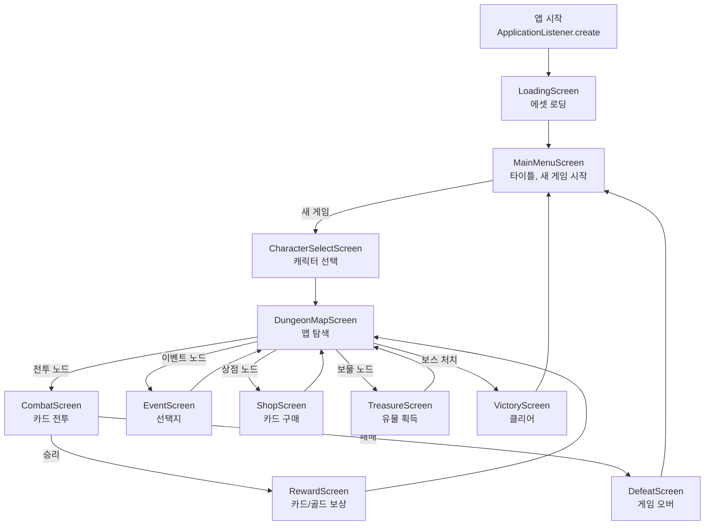

# Ch06. Screen 전환 & 게임 상태 관리

> 📌 **핵심 요약**
> libGDX의 `Game.setScreen()`으로 화면을 전환하고, Screen의 생명주기(show→render→hide→dispose)를 이해하여 STS의 메인메뉴→던전맵→전투→보상 흐름을 구현한다.

---

## 🎯 학습 목표

1. Screen 인터페이스의 생명주기 메서드를 각각의 역할과 함께 설명할 수 있다.
2. `Game.setScreen()`이 내부적으로 어떻게 동작하는지 이해한다.
3. 화면 간 공유 상태를 Game 클래스에서 관리하는 패턴을 구현할 수 있다.
4. STS의 화면 전환 흐름을 설계하고, 각 화면의 책임을 정의할 수 있다.
5. `hide()`와 `dispose()`의 차이를 올바르게 이해하고 메모리 누수를 방지할 수 있다.

---

## 1. Screen 인터페이스 생명주기

### 1.1 전체 생명주기

```
setScreen(screen) 호출
        ↓
   screen.show()        ← 이 화면이 활성화될 때 (초기화)
        ↓
   screen.render(delta) ← 매 프레임 (게임 루프)
        ↓
   screen.resize(w, h)  ← 창 크기 변경 시
        ↓
setScreen(other) 호출 or 앱 종료
        ↓
   screen.hide()        ← 이 화면이 비활성화될 때 (정리 준비)
        ↓
   screen.dispose()     ← 명시적으로 리소스 해제 시
```

### 1.2 각 메서드의 역할

```java
public class CombatScreen implements Screen {

    private final SlayTheSpire game;
    private SpriteBatch batch;
    private Stage stage;

    public CombatScreen(SlayTheSpire game) {
        this.game = game;
        // 생성자: 가볍게 유지. 실제 초기화는 show()에서
    }

    @Override
    public void show() {
        // setScreen()으로 이 화면이 활성화될 때 한 번 호출됨
        // 화면 전용 리소스 초기화 (Stage, InputProcessor 등)
        batch = game.batch; // Game에서 공유 (새로 생성 X)
        stage = new Stage(new ScreenViewport());
        Gdx.input.setInputProcessor(stage);

        // 이전 전투와 독립된 새 전투 상태 초기화
        initializeCombat();
    }

    @Override
    public void render(float delta) {
        // 매 프레임 호출. delta = 이전 프레임과의 경과 시간(초)
        update(delta);
        draw();
    }

    private void update(float delta) {
        stage.act(delta);
        // 게임 로직 업데이트
    }

    private void draw() {
        Gdx.gl.glClearColor(0.08f, 0.05f, 0.12f, 1);
        Gdx.gl.glClear(GL20.GL_COLOR_BUFFER_BIT);
        stage.draw();
    }

    @Override
    public void resize(int width, int height) {
        // 창 크기 변경 시 뷰포트 업데이트
        stage.getViewport().update(width, height, true);
    }

    @Override
    public void pause() {
        // Android: 앱이 백그라운드로 갈 때. 데스크탑은 거의 미사용
    }

    @Override
    public void resume() {
        // Android: 앱이 포그라운드로 돌아올 때
    }

    @Override
    public void hide() {
        // setScreen()으로 다른 화면으로 전환될 때 호출됨
        // ⚠️ dispose()가 아님! 리소스를 해제하면 안 되는 경우도 있음
        // Stage의 InputProcessor 해제 등 "비활성화" 처리
        Gdx.input.setInputProcessor(null);
    }

    @Override
    public void dispose() {
        // 명시적으로 리소스를 해제할 때
        // Stage는 화면이 완전히 버려질 때만 dispose
        if (stage != null) stage.dispose();
    }
}
```

### 1.3 hide() vs dispose() 차이

| | `hide()` | `dispose()` |
|--|----------|-------------|
| **호출 시점** | 다른 화면으로 전환될 때 자동 | 명시적으로 호출할 때 |
| **libGDX 자동 호출** | O (`setScreen()`이 호출) | X (직접 호출 필요) |
| **목적** | 비활성화 처리 | 네이티브 메모리 해제 |
| **리소스 해제** | 보통 불필요 | 반드시 필요 |
| **재사용 가능성** | 화면 재사용 가능 | 이후 사용 불가 |

**중요한 패턴**: `Game.setScreen()`을 보면 내부에서 이전 화면의 `hide()`를 호출하지만 `dispose()`는 호출하지 않는다. 즉, 화면 객체의 dispose는 **개발자가 책임**진다.

```java
// libGDX Game 내부 (참고)
public void setScreen(Screen screen) {
    if (this.screen != null) this.screen.hide(); // hide만 호출
    this.screen = screen;
    if (this.screen != null) {
        this.screen.show();
        this.screen.resize(Gdx.graphics.getWidth(), Gdx.graphics.getHeight());
    }
}
```

---

## 2. STS 화면 흐름 설계

### 2.1 전체 화면 전환 플로우



### 2.2 각 화면의 책임

| 화면 | 진입 조건 | 책임 | 종료 후 이동 |
|------|-----------|------|-------------|
| `MainMenuScreen` | 앱 시작/패배/승리 | 새 게임 시작, 계속 진행 | CharacterSelect |
| `DungeonMapScreen` | 캐릭터 선택 후, 보상 후 | 맵 렌더링, 노드 선택 | 노드 타입별 분기 |
| `CombatScreen` | 전투 노드 클릭 | 카드 플레이, 턴 진행 | RewardScreen |
| `RewardScreen` | 전투 승리 | 카드/유물 선택 | DungeonMapScreen |

---

## 3. Game 클래스 — 공유 상태 관리

```java
public class SlayTheSpire extends Game {

    // ── 공유 렌더링 리소스 ──────────────────────────────────
    public SpriteBatch batch;
    public AssetManager assets;
    public FontManager fonts;    // Ch05에서 만든 FontManager

    // ── 게임 런 상태 ────────────────────────────────────────
    public RunState runState;    // 현재 진행 중인 런의 모든 상태

    // ── 화면 인스턴스 캐시 (재사용할 화면만) ────────────────
    // 주의: 매번 new로 생성하면 메모리 누수 위험
    // STS 클론에서는 화면이 많지 않으므로 매번 new해도 무방
    private DungeonMapScreen dungeonMapScreen;

    @Override
    public void create() {
        // SpriteBatch는 비용이 크므로 하나만 생성 후 공유
        batch = new SpriteBatch();

        assets = new AssetManager();
        fonts = new FontManager();

        // 에셋 로딩 화면으로 시작
        setScreen(new LoadingScreen(this));
    }

    /** 새 게임 런을 시작한다. */
    public void startNewRun(CharacterType characterType) {
        runState = new RunState(characterType);
        // 던전 맵 화면으로 전환 (매번 새로 생성)
        setScreen(new DungeonMapScreen(this));
    }

    /** 전투 종료 후 보상 화면으로 이동한다. */
    public void goToReward(List<CardData> rewardCards) {
        setScreen(new RewardScreen(this, rewardCards));
    }

    /** 보상 선택 후 던전 맵으로 복귀한다. */
    public void goToDungeonMap() {
        setScreen(new DungeonMapScreen(this));
    }

    /** 전투 패배 처리. */
    public void onDefeat() {
        runState = null; // 런 상태 초기화
        setScreen(new DefeatScreen(this));
    }

    @Override
    public void dispose() {
        batch.dispose();
        assets.dispose();
        fonts.dispose();
        // 현재 활성 화면도 dispose
        if (getScreen() != null) getScreen().dispose();
    }
}
```

---

## 4. RunState — 런 전체 상태

```java
/**
 * 하나의 게임 런(시작~승리/패배)에 걸친 모든 상태를 보관한다.
 * Game 클래스에서 보관하여 모든 화면이 접근 가능하게 한다.
 */
public class RunState {

    // ── 캐릭터 정보 ──────────────────────────────────────────
    public final CharacterType characterType;
    public int currentHp;
    public int maxHp;
    public int gold;
    public int floor;           // 현재 층수

    // ── 덱 ───────────────────────────────────────────────────
    public List<AbstractCard> deck;       // 덱 전체 (영구 보관)

    // ── 유물 ─────────────────────────────────────────────────
    public List<AbstractRelic> relics;

    // ── 맵 ───────────────────────────────────────────────────
    public DungeonMap map;
    public MapNode currentNode;

    public RunState(CharacterType characterType) {
        this.characterType = characterType;
        this.maxHp = characterType.getStartingHp();
        this.currentHp = maxHp;
        this.gold = 99;
        this.floor = 0;
        this.deck = new ArrayList<>(characterType.getStartingDeck());
        this.relics = new ArrayList<>();
        this.relics.add(characterType.getStartingRelic());
        this.map = DungeonMap.generate(characterType);
    }
}
```

---

## 5. 전역 상태 관리 패턴 비교

### 5.1 Game 클래스 보관 (권장 — STS 클론에 적합)

```java
// 접근 방법: 화면이 game 참조를 갖고 있음
public class CombatScreen implements Screen {
    private final SlayTheSpire game;

    public CombatScreen(SlayTheSpire game) {
        this.game = game;
    }

    private void onVictory() {
        // game을 통해 RunState에 접근
        game.runState.gold += 50;
        game.goToReward(buildRewardCards());
    }
}
```

**장점**: 구조 단순, 화면 간 참조 명확
**단점**: Game 클래스가 비대해질 수 있음

### 5.2 싱글톤 패턴

```java
// 접근 방법
public class RunState {
    private static RunState instance;
    public static RunState get() { return instance; }
    public static void reset(CharacterType ct) { instance = new RunState(ct); }
}

// 사용
RunState.get().gold += 50;
```

**장점**: 어디서든 접근 가능, 보일러플레이트 없음
**단점**: 테스트 어려움, 의존성 숨겨짐, 멀티스레드 주의

### 5.3 의존성 주입 (과잉 설계)

```java
// Dagger, Koin 등 DI 프레임워크 사용
// 소규모 게임에서는 오버엔지니어링
// ← "시니어 엔지니어가 과하다고 할까?" → 그렇다, 사용 X
```

**STS 클론 선택**: **Game 클래스 보관** 패턴. 단순하고 명확하며 화면 수가 많지 않아 충분하다.

---

## 6. 화면 전환 시 메모리 관리

### 6.1 문제: 화면을 매번 new 하면 이전 화면의 dispose가 필요

```java
// 잘못된 예: 메모리 누수
public void goToReward() {
    setScreen(new RewardScreen(this)); // 이전 CombatScreen이 dispose 안 됨!
}

// 올바른 예: 이전 화면을 명시적으로 dispose
public void goToReward(List<CardData> rewards) {
    Screen previousScreen = getScreen();
    setScreen(new RewardScreen(this, rewards));
    if (previousScreen != null) previousScreen.dispose();
}
```

### 6.2 화면 재사용 전략

```java
// 전략 1: 매번 새로 생성 (단순, 메모리 사용 증가)
setScreen(new DungeonMapScreen(this));

// 전략 2: 화면 캐시 (복잡, 메모리 효율)
if (dungeonMapScreen == null) {
    dungeonMapScreen = new DungeonMapScreen(this);
} else {
    dungeonMapScreen.reinitialize(); // 상태 리셋 메서드 필요
}
setScreen(dungeonMapScreen);
```

**STS 클론 선택**: 전략 1. 화면 수가 10개 미만이며, 각 화면은 상태가 다르므로 재사용보다 새 생성이 관리하기 쉽다.

---

## 7. Screen vs ApplicationListener 비교

| 항목 | `Screen` | `ApplicationListener` |
|------|----------|----------------------|
| 사용 목적 | 화면 단위 분리 | 전체 앱 진입점 |
| 생명주기 | show/hide 추가 | create/dispose |
| 다중 사용 | 여러 인스턴스 생성 | 하나만 존재 |
| `Game` 필요 | O | X (직접 구현) |
| STS 클론에서 | 각 화면 구현에 | `SlayTheSpire extends Game` |

`Game` 자체가 `ApplicationListener`를 구현하므로, `Game`을 상속하면 `Screen` 기반 아키텍처를 자연스럽게 사용할 수 있다.

---

## 정리

- **Screen 생명주기**: `show()` (활성화 초기화) → `render()` (매 프레임) → `hide()` (비활성화) → `dispose()` (명시적 해제). `hide()`는 자동 호출, `dispose()`는 수동 호출.
- **`hide()` ≠ `dispose()`**: hide는 비활성화 처리, dispose는 네이티브 메모리 해제. libGDX는 자동으로 dispose를 호출하지 않는다.
- **Game 클래스**는 공유 리소스(`SpriteBatch`, `AssetManager`)와 전역 상태(`RunState`)의 보관소다.
- **STS 화면 흐름**: LoadingScreen → MainMenu → DungeonMap ↔ Combat/Event/Shop ↔ Reward → Victory/Defeat.
- **화면 전환 시 이전 화면 dispose를 잊지 말 것**: `setScreen()`은 `hide()`만 호출하고 `dispose()`는 호출하지 않는다.

다음 챕터(Ch07)에서는 이 화면들 안에서 체력바, 버튼, 레이블 등의 UI 위젯을 Scene2D Skin을 이용해 구성하는 방법을 다룬다.

---

## 🔍 심화 학습

### 추천 자료

| 자료 | 링크 | 설명 |
|------|------|------|
| libGDX Screen API | https://libgdx.com/wiki/app/the-life-cycle | 생명주기 공식 문서 |
| Game & Screen | https://libgdx.com/wiki/app/modules-and-application | Game 클래스 설명 |
| Screen 전환 패턴 | https://libgdx.com/wiki/graphics/2d/scene2d/scene2d | Scene2D 화면 관리 |

### TODO 실습 과제

1. `SlayTheSpire extends Game` 클래스를 작성하고, `SpriteBatch`와 `AssetManager`를 공유 리소스로 초기화하라.
2. `MainMenuScreen`, `CombatScreen`, `DungeonMapScreen` 세 개의 Screen을 만들고, 버튼 클릭으로 서로 전환되는 흐름을 구현하라.
3. `RunState` POJO를 작성하고, 새 게임 시작 시 초기화하여 `Game.runState`에 보관한 뒤, `CombatScreen`에서 `game.runState.gold`에 접근하라.
4. `setScreen()` 호출 전에 이전 화면을 `dispose()`하는 헬퍼 메서드를 `SlayTheSpire` 클래스에 추가하고, 메모리 누수 없이 화면 전환이 이루어지는지 확인하라.
5. `resize()` 메서드를 각 Screen에 올바르게 구현하고, 창 크기를 변경했을 때 UI가 정상적으로 재배치되는지 확인하라.

---

## ✅ 체크리스트

### Screen 생명주기
- [ ] `show()`가 호출되는 정확한 시점을 설명할 수 있다
- [ ] `hide()`와 `dispose()`의 차이를 설명할 수 있다
- [ ] `render(float delta)`에서 delta를 사용하는 이유를 안다
- [ ] `resize(int w, int h)`를 구현하지 않으면 어떤 문제가 생기는지 안다

### Game 클래스
- [ ] `Game`이 `ApplicationListener`를 구현한다는 것을 안다
- [ ] `setScreen()`이 내부적으로 `hide()`를 호출한다는 것을 안다
- [ ] 공유 리소스를 Game 클래스에 두는 이유를 설명할 수 있다

### 화면 전환
- [ ] STS 화면 전환 흐름을 플로우차트로 그릴 수 있다
- [ ] 화면 전환 시 메모리 누수를 방지하는 방법을 안다
- [ ] `RunState`가 필요한 이유와 어디에 보관해야 하는지 안다

### 상태 관리 패턴
- [ ] Game 클래스 보관 vs 싱글톤 패턴의 장단점을 비교할 수 있다
- [ ] STS 클론에서 싱글톤보다 Game 클래스 보관을 선택하는 이유를 설명할 수 있다

---

## 📚 참고 자료

- [libGDX App Lifecycle](https://libgdx.com/wiki/app/the-life-cycle)
- [libGDX Game Class](https://libgdx.com/wiki/app/modules-and-application)
- [Scene2D UI](https://libgdx.com/wiki/graphics/2d/scene2d/scene2d-ui)
- [libGDX Memory Management](https://libgdx.com/wiki/utils/memory-management)
