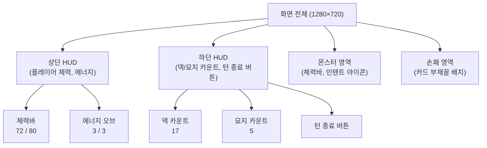

# Ch07. UI 위젯 & 스킨

> 📌 **핵심 요약**
> Scene2D의 Skin으로 위젯 스타일을 데이터로 분리하고, Table 레이아웃으로 HUD를 배치하며, ProgressBar·TextButton·Label·Image로 STS 전투 화면 HUD를 구성한다.

---

## 🎯 학습 목표

1. Skin의 구조(.json + .atlas)와 역할을 설명할 수 있다.
2. `ProgressBar`로 체력바를 구현하고 색상과 크기를 커스터마이징할 수 있다.
3. `TextButton`에 `ClickListener`를 붙여 "턴 종료" 버튼을 구현할 수 있다.
4. `Table` 레이아웃으로 복잡한 HUD를 배치할 수 있다.
5. `NinePatch`로 크기에 무관하게 늘어나는 UI 프레임을 만들 수 있다.

---

## 1. Skin — 스타일을 데이터로 분리

### 1.1 Skin이란?

`Skin`은 위젯의 **시각적 스타일을 코드에서 분리**하는 메커니즘이다. 버튼의 색상, 폰트, 배경 이미지를 Java 코드 안에 하드코딩하는 대신 `.json` 파일로 정의하고, Skin이 이를 로드하여 위젯에 적용한다.

```
ui/
├── uiskin.json      ← 스타일 정의 (폰트, 색상, 드로어블 참조)
├── uiskin.atlas     ← 위젯 이미지들이 패킹된 TextureAtlas
└── uiskin.png       ← atlas의 실제 텍스처
```

### 1.2 기본 Skin 로딩

```java
// 방법 1: 직접 파일 지정
Skin skin = new Skin(Gdx.files.internal("ui/uiskin.json"));

// 방법 2: AssetManager 통해 로딩 (Ch05 방식)
assets.load("ui/uiskin.json", Skin.class);
// ...로딩 완료 후...
Skin skin = assets.get("ui/uiskin.json", Skin.class);
```

### 1.3 uiskin.json 구조

```json
{
  "com.badlogic.gdx.graphics.Color": {
    "white":     { "r": 1, "g": 1, "b": 1, "a": 1 },
    "black":     { "r": 0, "g": 0, "b": 0, "a": 1 },
    "red":       { "r": 0.89, "g": 0.15, "b": 0.15, "a": 1 },
    "healthRed": { "r": 0.8,  "g": 0.1,  "b": 0.1,  "a": 1 }
  },
  "com.badlogic.gdx.graphics.g2d.BitmapFont": {
    "default-font": {
      "file": "fonts/korean24.fnt"
    }
  },
  "com.badlogic.gdx.scenes.scene2d.ui.TextButton$TextButtonStyle": {
    "default": {
      "down":       "button-down",
      "up":         "button-up",
      "over":       "button-over",
      "disabled":   "button-disabled",
      "font":       "default-font",
      "fontColor":  "white"
    },
    "endTurn": {
      "down":       "end-turn-down",
      "up":         "end-turn-up",
      "font":       "default-font",
      "fontColor":  "white"
    }
  },
  "com.badlogic.gdx.scenes.scene2d.ui.ProgressBar$ProgressBarStyle": {
    "default-horizontal": {
      "background":    "progress-bar-background",
      "knobBefore":    "progress-bar-knob-before"
    },
    "healthBar": {
      "background":    "health-bar-bg",
      "knobBefore":    "health-bar-fill"
    }
  },
  "com.badlogic.gdx.scenes.scene2d.ui.Label$LabelStyle": {
    "default": {
      "font":      "default-font",
      "fontColor": "white"
    },
    "damage": {
      "font":      "default-font",
      "fontColor": "red"
    }
  }
}
```

### 1.4 프로그래밍 방식으로 Skin 생성 (atlas 없이 테스트용)

```java
/**
 * 외부 파일 없이 순수 코드로 기본 Skin을 생성한다.
 * 실제 게임에서는 uiskin.json + atlas를 사용하지만,
 * 빠른 프로토타이핑 시 유용하다.
 */
public static Skin createDefaultSkin(BitmapFont font) {
    Skin skin = new Skin();

    // 기본 흰색 픽셀 텍스처 생성
    Pixmap pixmap = new Pixmap(1, 1, Pixmap.Format.RGBA8888);
    pixmap.setColor(Color.WHITE);
    pixmap.fill();
    skin.add("white", new Texture(pixmap));
    pixmap.dispose();

    // 폰트 등록
    skin.add("default", font);

    // 버튼 스타일
    TextButton.TextButtonStyle buttonStyle = new TextButton.TextButtonStyle();
    buttonStyle.up       = skin.newDrawable("white", Color.DARK_GRAY);
    buttonStyle.down     = skin.newDrawable("white", Color.GRAY);
    buttonStyle.over     = skin.newDrawable("white", Color.LIGHT_GRAY);
    buttonStyle.font     = font;
    buttonStyle.fontColor = Color.WHITE;
    skin.add("default", buttonStyle);

    // 레이블 스타일
    Label.LabelStyle labelStyle = new Label.LabelStyle();
    labelStyle.font      = font;
    labelStyle.fontColor = Color.WHITE;
    skin.add("default", labelStyle);

    // ProgressBar 스타일
    ProgressBar.ProgressBarStyle pbStyle = new ProgressBar.ProgressBarStyle();
    pbStyle.background  = skin.newDrawable("white", Color.DARK_GRAY);
    pbStyle.knobBefore  = skin.newDrawable("white", Color.RED);
    skin.add("default-horizontal", pbStyle);

    return skin;
}
```

---

## 2. ProgressBar — 체력바

### 2.1 기본 사용법

```java
// ProgressBar(min, max, stepSize, vertical, skin)
// vertical = false → 가로 방향
ProgressBar healthBar = new ProgressBar(0, maxHp, 1, false, skin, "healthBar");
healthBar.setValue(currentHp);
healthBar.setAnimateDuration(0.2f); // 값 변경 시 부드럽게 애니메이션
```

### 2.2 체력바 커스터마이징

```java
/**
 * STS 스타일 체력바: 빨간 배경 위에 초록→노랑→빨강 그라데이션 체력.
 * Scene2D의 ProgressBar를 커스텀 Drawable로 꾸민다.
 */
public class HealthBar extends ProgressBar {

    private static final Color FULL_COLOR    = new Color(0.2f, 0.8f, 0.2f, 1f); // 초록
    private static final Color HALF_COLOR    = new Color(0.9f, 0.8f, 0.1f, 1f); // 노랑
    private static final Color CRITICAL_COLOR = new Color(0.9f, 0.1f, 0.1f, 1f); // 빨강

    public HealthBar(int maxHp, Skin skin) {
        super(0, maxHp, 1, false, skin);
        setAnimateDuration(0.15f);
    }

    @Override
    public void act(float delta) {
        super.act(delta);
        // 체력 비율에 따라 knobBefore 색상 동적 변경
        float ratio = getValue() / getMaxValue();
        Color fillColor = ratio > 0.5f ? FULL_COLOR
                        : ratio > 0.25f ? HALF_COLOR
                        : CRITICAL_COLOR;
        // ProgressBarStyle의 knobBefore tintColor 변경
        // (실제 구현은 커스텀 Drawable로 처리)
    }
}
```

---

## 3. TextButton — 턴 종료 버튼

### 3.1 기본 사용법

```java
TextButton endTurnBtn = new TextButton("턴 종료", skin, "endTurn");

// ClickListener: 클릭 이벤트 처리
endTurnBtn.addListener(new ClickListener() {
    @Override
    public void clicked(InputEvent event, float x, float y) {
        // 카드 애니메이션 중에는 클릭 무시
        if (combatState.isAnimating()) return;
        combatState.endPlayerTurn();
    }
});

// 비활성화 (몬스터 턴 중)
endTurnBtn.setDisabled(true);
endTurnBtn.setColor(Color.GRAY);
```

### 3.2 ChangeListener (토글/체크박스에 더 적합)

```java
// ClickListener: 마우스 클릭에 반응
// ChangeListener: 값 변경에 반응 (체크박스, 슬라이더 등)
endTurnBtn.addListener(new ChangeListener() {
    @Override
    public void changed(ChangeEvent event, Actor actor) {
        // TextButton은 클릭할 때마다 checked 상태가 토글됨
        // 버튼으로 쓸 때는 ClickListener가 더 직관적
    }
});
```

---

## 4. Label — 텍스트 표시

```java
// 기본 레이블
Label nameLabel   = new Label("아이언클래드", skin);
Label hpLabel     = new Label("72 / 80", skin);
Label energyLabel = new Label("3 / 3", skin);     // 에너지 오브

// 동적 업데이트
hpLabel.setText(currentHp + " / " + maxHp);

// 스타일 지정 (데미지 숫자는 빨간색)
Label damageLabel = new Label("-15", skin, "damage");

// 글자 정렬
nameLabel.setAlignment(Align.center);

// 줄바꿈 (카드 설명문)
Label descLabel = new Label("적에게 6 데미지를 줍니다.", skin);
descLabel.setWrap(true);          // 자동 줄바꿈 활성화
descLabel.setWidth(150);          // 줄바꿈 기준 너비
```

---

## 5. Table 레이아웃 — HUD 배치

Table은 libGDX에서 가장 강력한 레이아웃 컨테이너다. HTML의 `<table>`처럼 행(row)과 열(cell)로 위젯을 정렬한다.

### 5.1 STS 전투 화면 HUD 레이아웃 분석



### 5.2 Table로 HUD 구현

```java
public class CombatHUD {

    private final Stage stage;
    private final Skin skin;
    private final SlayTheSpire game;

    // UI 위젯 참조 (업데이트용)
    private ProgressBar playerHealthBar;
    private Label playerHpLabel;
    private Label energyLabel;
    private Label deckCountLabel;
    private Label discardCountLabel;
    private TextButton endTurnBtn;

    public CombatHUD(SlayTheSpire game, Stage stage, Skin skin) {
        this.game  = game;
        this.stage = stage;
        this.skin  = skin;
        buildUI();
    }

    private void buildUI() {
        buildPlayerPanel();
        buildBottomBar();
    }

    /** 좌측 상단: 플레이어 이름 + 체력바 + 에너지 */
    private void buildPlayerPanel() {
        Table playerPanel = new Table();
        playerPanel.setFillParent(true); // 화면 전체에 걸치되 alignment로 위치 지정
        playerPanel.top().left();        // 좌측 상단 정렬

        // 플레이어 이름
        Label nameLabel = new Label("아이언클래드", skin);
        playerPanel.add(nameLabel).padTop(10).padLeft(10).left();
        playerPanel.row();

        // 체력바
        RunState run = game.runState;
        playerHealthBar = new ProgressBar(0, run.maxHp, 1, false, skin, "healthBar");
        playerHealthBar.setValue(run.currentHp);
        playerHealthBar.setAnimateDuration(0.2f);
        playerPanel.add(playerHealthBar).width(200).height(18).padLeft(10);
        playerPanel.row();

        // 체력 수치 레이블
        playerHpLabel = new Label(run.currentHp + " / " + run.maxHp, skin);
        playerPanel.add(playerHpLabel).padLeft(10).left();
        playerPanel.row();

        // 에너지 오브 (간략히 레이블로)
        energyLabel = new Label("⚡ 3 / 3", skin);
        playerPanel.add(energyLabel).padLeft(10).padTop(5).left();

        stage.addActor(playerPanel);
    }

    /** 우측 하단: 덱/묘지 카운트 + 턴 종료 버튼 */
    private void buildBottomBar() {
        Table bottomBar = new Table();
        bottomBar.setFillParent(true);
        bottomBar.bottom().right();

        // 덱 카운트
        deckCountLabel = new Label("덱: 17", skin);
        bottomBar.add(deckCountLabel).padBottom(20).padRight(15);

        // 묘지 카운트
        discardCountLabel = new Label("묘지: 0", skin);
        bottomBar.add(discardCountLabel).padBottom(20).padRight(20);

        // 턴 종료 버튼
        endTurnBtn = new TextButton("턴 종료", skin, "endTurn");
        endTurnBtn.addListener(new ClickListener() {
            @Override
            public void clicked(InputEvent event, float x, float y) {
                onEndTurn();
            }
        });
        bottomBar.add(endTurnBtn)
            .width(160).height(60)
            .padBottom(20).padRight(20);

        stage.addActor(bottomBar);
    }

    /** 전투 상태가 바뀔 때 HUD를 갱신한다. */
    public void update(CombatState combat) {
        RunState run = game.runState;

        // 체력바 업데이트
        playerHealthBar.setValue(run.currentHp);
        playerHpLabel.setText(run.currentHp + " / " + run.maxHp);

        // 에너지 업데이트
        energyLabel.setText("⚡ " + combat.energy + " / " + combat.maxEnergy);

        // 덱/묘지 카운트 업데이트
        deckCountLabel.setText("덱: " + combat.drawPile.size());
        discardCountLabel.setText("묘지: " + combat.discardPile.size());

        // 몬스터 턴 중에는 버튼 비활성화
        endTurnBtn.setDisabled(!combat.isPlayerTurn());
    }

    private void onEndTurn() {
        // 외부 CombatScreen에 위임 (HUD는 UI만 담당)
        // EventBus나 콜백 패턴 사용 가능
    }
}
```

### 5.3 Table 레이아웃 주요 메서드

```java
Table t = new Table();

// 채우기
t.setFillParent(true);  // Stage 전체 크기로

// 정렬 (체이닝 가능)
t.top().left();         // 좌상단
t.bottom().right();     // 우하단
t.center();             // 중앙

// 셀 추가
t.add(widget)           // 위젯 추가 (Cell 반환)
 .width(200)            // 셀 너비
 .height(30)            // 셀 높이
 .pad(10)               // 상하좌우 패딩
 .padLeft(5)            // 왼쪽만
 .expand()              // 남은 공간 채우기
 .fill()                // 위젯을 셀에 맞게 늘리기
 .left()                // 셀 내 좌측 정렬
 .colspan(3);           // 3열 병합

// 다음 행
t.row();

// 디버그 (레이아웃 경계선 표시 — 개발 시 유용)
t.setDebug(true);
```

---

## 6. Image — 아이콘과 배경

```java
// TextureRegion으로 Image 생성
TextureAtlas uiAtlas = assets.get("atlas/ui.atlas", TextureAtlas.class);
TextureRegion intentIcon = uiAtlas.findRegion("intent_attack");
Image intentImage = new Image(intentIcon);

// 크기 설정
intentImage.setSize(40, 40);

// Scaling 방식
intentImage.setScaling(Scaling.fit);   // 비율 유지하며 맞춤
intentImage.setScaling(Scaling.fill);  // 비율 유지하며 채움
intentImage.setScaling(Scaling.stretch); // 비율 무시하고 늘림

// Table에 추가
table.add(intentImage).size(40, 40).pad(5);
```

---

## 7. NinePatch — 늘어나는 UI 프레임

NinePatch는 이미지를 9개 영역으로 나눠 모서리는 고정, 가장자리와 중앙만 늘린다. 카드 프레임, 버튼, 패널 배경에 사용한다.

```
┌─────┬────────────────┬─────┐
│     │  상단 (가로만)  │     │
│모서리├────────────────┤모서리│
│     │ 중앙 (양방향)   │     │
│모서리├────────────────┤모서리│
│     │  하단 (가로만)  │     │
└─────┴────────────────┴─────┘
```

```java
// 방법 1: Texture에서 직접 생성 (패치 경계 픽셀 지정)
Texture cardFrame = new Texture("images/card_frame.png");
// 상하좌우 패치 경계: 각 방향 15픽셀을 고정
NinePatch patch = new NinePatch(cardFrame, 15, 15, 15, 15);

// 방법 2: TextureAtlas에서 로딩 (pack.json에서 split 정의 시 자동)
TextureAtlas.AtlasRegion region = uiAtlas.findRegion("card_frame");
NinePatch patch = region.splits != null
    ? new NinePatch(region, region.splits[0], region.splits[1],
                    region.splits[2], region.splits[3])
    : new NinePatch(region);

// NinePatchDrawable로 Skin에 등록
NinePatchDrawable drawable = new NinePatchDrawable(patch);
skin.add("card-frame", drawable);

// 카드 배경으로 사용
Image cardBackground = new Image(skin.getDrawable("card-frame"));
cardBackground.setSize(120, 180); // 어떤 크기든 NinePatch가 올바르게 늘림
```

---

## 8. 몬스터 체력바 (전투 화면 내)

```java
/** 몬스터 위에 표시되는 체력바 + 체력 수치 레이블 컴포넌트 */
public class MonsterHealthDisplay extends Group {

    private final ProgressBar healthBar;
    private final Label hpLabel;
    private final Label nameLabel;

    public MonsterHealthDisplay(Monster monster, Skin skin) {
        nameLabel = new Label(monster.getName(), skin);
        healthBar = new ProgressBar(0, monster.getMaxHp(), 1, false, skin, "healthBar");
        healthBar.setValue(monster.getCurrentHp());
        hpLabel = new Label(monster.getCurrentHp() + "/" + monster.getMaxHp(), skin);

        // Group 안에 위젯 배치 (Table 없이 수동 배치)
        nameLabel.setPosition(0, 40);
        healthBar.setPosition(0, 20);
        healthBar.setSize(120, 12);
        hpLabel.setPosition(0, 5);

        addActor(nameLabel);
        addActor(healthBar);
        addActor(hpLabel);
    }

    public void updateHp(int currentHp) {
        healthBar.setValue(currentHp);
        hpLabel.setText(currentHp + "/" + (int) healthBar.getMaxValue());
    }
}
```

---

## 정리

- **Skin**은 위젯의 스타일을 코드에서 분리한다. `.json`에 색상·폰트·드로어블을 정의하고, `.atlas`에 이미지를 패킹한다.
- **ProgressBar**는 `min`, `max`, `stepSize`로 초기화하고 `setValue()`로 값을 갱신한다. `setAnimateDuration()`으로 부드러운 애니메이션을 추가할 수 있다.
- **TextButton**은 `ClickListener`로 클릭 이벤트를 처리하고, `setDisabled(true)`로 비활성화한다.
- **Table**은 `row()`로 줄을 나누고 `add(widget).width().pad()` 등으로 셀을 구성한다. `setFillParent(true)` + `top().right()` 조합으로 화면 구석에 HUD를 배치한다.
- **NinePatch**는 모서리를 고정하고 중앙을 늘려 어떤 크기에도 깨지지 않는 UI 프레임을 만든다.

다음 챕터(Ch08)에서는 카드와 몬스터 데이터를 코드에 하드코딩하는 대신 JSON 파일에서 로딩하는 데이터 드리븐 설계를 다룬다.

---

## 🔍 심화 학습

### 추천 자료

| 자료 | 링크 | 설명 |
|------|------|------|
| Scene2D UI 공식 문서 | https://libgdx.com/wiki/graphics/2d/scene2d/scene2d-ui | 위젯 전체 목록 |
| Skin 사용법 | https://libgdx.com/wiki/graphics/2d/scene2d/skin | Skin JSON 구조 상세 |
| Table 레이아웃 | https://libgdx.com/wiki/graphics/2d/scene2d/table | Table 레이아웃 가이드 |
| NinePatch | https://libgdx.com/wiki/graphics/2d/ninepatches | NinePatch 상세 |

### TODO 실습 과제

1. 코드로 Skin을 생성하는 `createDefaultSkin()` 메서드를 작성하고, TextButton과 Label이 해당 Skin으로 올바르게 렌더링되는지 확인하라.
2. `ProgressBar`로 체력바를 구현하고, 값이 변경될 때 색상이 초록→노랑→빨강으로 바뀌는 `HealthBar` 위젯을 작성하라.
3. `Table`을 사용해 STS 전투 화면 HUD 레이아웃을 구현하라. 좌상단에 체력바, 우하단에 "턴 종료" 버튼을 배치하라.
4. `NinePatch`를 사용하여 어떤 크기의 카드에도 깨지지 않는 카드 프레임 배경을 만들어라.
5. `Table.setDebug(true)`를 활성화하여 레이아웃 경계선을 시각화하고, 각 셀의 패딩과 정렬이 의도한 대로 동작하는지 검증하라.

---

## ✅ 체크리스트

### Skin
- [ ] Skin의 .json과 .atlas 파일의 역할을 각각 설명할 수 있다
- [ ] 코드로 Skin을 생성하는 방법을 안다 (파일 없이)
- [ ] `skin.newDrawable()`로 색상이 적용된 Drawable을 만들 수 있다

### ProgressBar
- [ ] `ProgressBar` 생성자의 5개 파라미터를 모두 설명할 수 있다
- [ ] `setAnimateDuration()`이 어떤 효과를 내는지 안다
- [ ] 체력 비율에 따라 다른 스타일을 적용하는 방법을 안다

### TextButton
- [ ] `ClickListener`와 `ChangeListener`의 차이를 설명할 수 있다
- [ ] 버튼을 비활성화하고 시각적으로 표현하는 방법을 안다

### Table 레이아웃
- [ ] `row()`를 호출해야 하는 시점을 안다
- [ ] `setFillParent(true)`의 효과를 설명할 수 있다
- [ ] `expand()`와 `fill()`의 차이를 안다
- [ ] `setDebug(true)`로 레이아웃을 시각적으로 디버그할 수 있다

### NinePatch
- [ ] NinePatch의 9개 영역 중 고정되는 영역과 늘어나는 영역을 구분할 수 있다
- [ ] `NinePatch(texture, left, right, top, bottom)` 파라미터의 의미를 안다

---

## 📚 참고 자료

- [libGDX Scene2D UI](https://libgdx.com/wiki/graphics/2d/scene2d/scene2d-ui)
- [libGDX Skin](https://libgdx.com/wiki/graphics/2d/scene2d/skin)
- [libGDX Table](https://libgdx.com/wiki/graphics/2d/scene2d/table)
- [libGDX NinePatch](https://libgdx.com/wiki/graphics/2d/ninepatches)
- [Scene2D 위젯 갤러리](https://github.com/libgdx/libgdx/wiki/Scene2d.ui)
