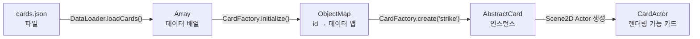

# Ch08. JSON 데이터 로딩

> 📌 **핵심 요약**
> 카드와 몬스터를 코드가 아닌 JSON 파일로 정의하는 데이터 드리븐 설계를 적용하여, 코드 수정 없이 카드 추가와 밸런스 조정이 가능한 구조를 만든다.

---

## 🎯 학습 목표

1. 데이터 드리븐 설계의 장점을 설명하고, 카드·몬스터 JSON 스키마를 직접 설계할 수 있다.
2. libGDX `Json` 클래스로 JSON 파일을 Java 객체로 역직렬화할 수 있다.
3. `JsonValue` 트리를 직접 탐색하여 복잡한 중첩 구조를 파싱할 수 있다.
4. `CardFactory` 패턴으로 id 기반 카드 생성 로직을 캡슐화할 수 있다.
5. JSON 데이터의 필수 필드 검증과 enum 매핑을 안전하게 처리할 수 있다.

---

## 1. 왜 데이터 드리븐인가?

### 1.1 코드 하드코딩 방식의 문제

```java
// ❌ 나쁜 예: 카드가 코드에 박혀 있음
public class Strike extends AbstractCard {
    public Strike() {
        super("strike", "강타", 1, CardType.ATTACK, CardRarity.BASIC);
        this.damage = 6;
    }
    @Override
    public void use(Player player, Monster target) {
        dealDamage(target, this.damage);
    }
}

public class Defend extends AbstractCard {
    public Defend() {
        super("defend", "방어", 1, CardType.SKILL, CardRarity.BASIC);
        this.block = 5;
    }
    // ...
}
// 카드를 하나 추가할 때마다 새 클래스 파일 생성 필요
// 데미지 6→7로 조정하려면 코드 수정→재빌드 필요
```

### 1.2 데이터 드리븐 방식의 이점

| 항목 | 코드 하드코딩 | 데이터 드리븐 |
|------|--------------|--------------|
| 카드 추가 | 새 클래스 작성 + 재빌드 | JSON에 항목 추가 |
| 밸런스 조정 | 코드 수정 + 재빌드 | JSON 수정 (재빌드 불필요) |
| 기획자 협업 | 개발자만 수정 가능 | 기획자가 JSON 직접 수정 가능 |
| 테스트 | 코드 배포 후 확인 | JSON 수정 후 즉시 확인 |
| 모딩 지원 | 불가 | JSON 교체로 가능 (STS 모드 생태계) |

STS 자체도 카드, 몬스터, 이벤트, 유물을 모두 데이터 파일로 관리하며, 이것이 활발한 모딩 커뮤니티의 기반이 되었다.

---

## 2. JSON 스키마 설계

### 2.1 cards.json

```json
[
  {
    "id":          "strike",
    "name":        "강타",
    "cost":        1,
    "type":        "ATTACK",
    "rarity":      "BASIC",
    "description": "적에게 {damage} 데미지를 줍니다.",
    "damage":      6,
    "block":       0,
    "upgradedCost":        1,
    "upgradedDamage":      9,
    "upgradedBlock":       0,
    "upgradedDescription": "적에게 {damage} 데미지를 줍니다.",
    "tags":        ["STARTER", "IRONCLAD"]
  },
  {
    "id":          "defend",
    "name":        "방어",
    "cost":        1,
    "type":        "SKILL",
    "rarity":      "BASIC",
    "description": "{block} 방어도를 얻습니다.",
    "damage":      0,
    "block":       5,
    "upgradedCost":   1,
    "upgradedDamage": 0,
    "upgradedBlock":  8,
    "upgradedDescription": "{block} 방어도를 얻습니다.",
    "tags":        ["STARTER", "IRONCLAD"]
  },
  {
    "id":          "bash",
    "name":        "강타격",
    "cost":        2,
    "type":        "ATTACK",
    "rarity":      "BASIC",
    "description": "적에게 {damage} 데미지를 줍니다. 취약 2를 부여합니다.",
    "damage":      8,
    "block":       0,
    "effects": [
      { "type": "VULNERABLE", "target": "ENEMY", "amount": 2 }
    ],
    "upgradedCost":   2,
    "upgradedDamage": 10,
    "upgradedBlock":  0,
    "upgradedDescription": "적에게 {damage} 데미지를 줍니다. 취약 3을 부여합니다.",
    "upgradedEffects": [
      { "type": "VULNERABLE", "target": "ENEMY", "amount": 3 }
    ],
    "tags": ["IRONCLAD"]
  }
]
```

### 2.2 monsters.json

```json
[
  {
    "id":      "louse_red",
    "name":    "붉은 이",
    "minHp":   10,
    "maxHp":   15,
    "intents": [
      {
        "type":   "ATTACK",
        "damage": 5,
        "times":  1,
        "weight": 70
      },
      {
        "type":   "BUFF",
        "effect": "STRENGTH",
        "amount": 3,
        "weight": 30
      }
    ],
    "tags": ["NORMAL", "ACT1"]
  },
  {
    "id":   "jaw_worm",
    "name": "턱벌레",
    "minHp": 40,
    "maxHp": 44,
    "intents": [
      { "type": "ATTACK",  "damage": 11, "times": 1, "weight": 60 },
      { "type": "DEFEND",  "block":  6,             "weight": 20 },
      { "type": "BUFF",    "effect": "STRENGTH", "amount": 3, "weight": 20 }
    ],
    "tags": ["NORMAL", "ACT1"]
  }
]
```

### 2.3 events.json

```json
[
  {
    "id":   "mushrooms",
    "name": "버섯들",
    "description": "길 위에 빛나는 버섯들이 있습니다...",
    "choices": [
      {
        "text":   "먹는다",
        "effect": { "type": "GAIN_HP", "amount": 5 },
        "drawback": { "type": "CURSE_CARD", "cardId": "regret" }
      },
      {
        "text":   "지나친다",
        "effect": null
      }
    ]
  }
]
```

---

## 3. Java POJO 정의

```java
/** cards.json의 단일 항목과 1:1 매핑되는 데이터 클래스 */
public class CardData {

    // 필수 필드
    public String id;
    public String name;
    public int    cost;
    public String type;     // "ATTACK" | "SKILL" | "POWER" | "CURSE" | "STATUS"
    public String rarity;   // "BASIC" | "COMMON" | "UNCOMMON" | "RARE" | "SPECIAL"
    public String description;

    // 선택 필드 (기본값 0)
    public int damage = 0;
    public int block  = 0;
    public int magicNumber = 0;

    // 업그레이드 후 스탯
    public int    upgradedCost        = -1; // -1 = 변경 없음
    public int    upgradedDamage      = 0;
    public int    upgradedBlock       = 0;
    public int    upgradedMagicNumber = 0;
    public String upgradedDescription = "";

    // 태그 (문자열 배열)
    public String[] tags = {};

    // 이펙트 목록 (선택)
    public EffectData[]          effects         = {};
    public EffectData[]          upgradedEffects = {};

    /** 편의 메서드: type 문자열을 enum으로 변환 */
    public CardType getCardType() {
        try {
            return CardType.valueOf(type);
        } catch (IllegalArgumentException e) {
            Gdx.app.error("CardData", "알 수 없는 카드 타입: " + type + " (id=" + id + ")");
            return CardType.SKILL; // 폴백
        }
    }

    public CardRarity getCardRarity() {
        try {
            return CardRarity.valueOf(rarity);
        } catch (IllegalArgumentException e) {
            Gdx.app.error("CardData", "알 수 없는 희귀도: " + rarity + " (id=" + id + ")");
            return CardRarity.COMMON;
        }
    }
}

/** 카드 효과 데이터 */
public class EffectData {
    public String type;    // "VULNERABLE", "WEAK", "STRENGTH", "DRAW" ...
    public String target;  // "ENEMY", "SELF", "ALL_ENEMIES"
    public int    amount;
    public int    duration;
}

/** 몬스터 인텐트 데이터 */
public class IntentData {
    public String type;    // "ATTACK", "DEFEND", "BUFF", "DEBUFF", "SLEEP"
    public int    damage;
    public int    times;   // 다단 공격 횟수
    public int    block;
    public String effect;  // BUFF/DEBUFF 타입
    public int    amount;
    public int    weight;  // 가중치 (랜덤 선택에 사용)
}

/** 몬스터 데이터 */
public class MonsterData {
    public String       id;
    public String       name;
    public int          minHp;
    public int          maxHp;
    public IntentData[] intents = {};
    public String[]     tags    = {};
}
```

---

## 4. libGDX Json — JSON 역직렬화

### 4.1 Json.fromJson() — 자동 역직렬화

```java
import com.badlogic.gdx.utils.Json;
import com.badlogic.gdx.utils.Array;

public class DataLoader {

    /**
     * cards.json을 읽어 CardData 배열로 역직렬화한다.
     * libGDX Json은 Jackson/Gson보다 가볍고 GWT 호환 가능하다.
     */
    public static Array<CardData> loadCards() {
        Json json = new Json();
        // OutputType.json = 표준 JSON 파싱 (기본값은 relaxed JSON)
        json.setOutputType(JsonWriter.OutputType.json);

        // Array<CardData>로 역직렬화
        // 첫 번째 파라미터: 컨테이너 타입
        // 두 번째 파라미터: 컨테이너 요소 타입
        Array<CardData> cards = json.fromJson(
            Array.class,
            CardData.class,
            Gdx.files.internal("data/cards.json")
        );

        Gdx.app.log("DataLoader", "카드 로딩 완료: " + cards.size + "장");
        return cards;
    }

    public static Array<MonsterData> loadMonsters() {
        Json json = new Json();
        return json.fromJson(
            Array.class,
            MonsterData.class,
            Gdx.files.internal("data/monsters.json")
        );
    }
}
```

### 4.2 libGDX Json vs Jackson vs Gson

| 항목 | libGDX Json | Jackson | Gson |
|------|-------------|---------|------|
| 크기 | 매우 작음 | 큼 | 중간 |
| GWT 호환 | O | X | X |
| 성능 | 충분 | 최고 | 좋음 |
| 기능 | 기본적 | 풍부 | 풍부 |
| libGDX Array | 기본 지원 | 별도 설정 필요 | 별도 설정 필요 |
| **선택 이유** | ← 게임에서 충분하고 의존성 최소화 | | |

### 4.3 JsonValue 트리 직접 탐색

자동 역직렬화가 어려운 복잡한 구조는 `JsonValue` 트리를 직접 탐색한다.

```java
/**
 * JsonValue 트리를 직접 탐색하는 방식.
 * 중첩 구조가 복잡하거나 조건부 파싱이 필요할 때 사용한다.
 */
public static Array<CardData> loadCardsManual() {
    JsonReader reader = new JsonReader();
    JsonValue root = reader.parse(Gdx.files.internal("data/cards.json"));
    // root는 JSON 배열의 최상위 노드

    Array<CardData> result = new Array<>();

    for (JsonValue cardJson = root.child; cardJson != null; cardJson = cardJson.next) {
        CardData data = new CardData();

        // 문자열 필드
        data.id          = cardJson.getString("id");
        data.name        = cardJson.getString("name");
        data.description = cardJson.getString("description");
        data.type        = cardJson.getString("type");
        data.rarity      = cardJson.getString("rarity");

        // 정수 필드 (기본값 포함)
        data.cost   = cardJson.getInt("cost", 1);
        data.damage = cardJson.getInt("damage", 0);
        data.block  = cardJson.getInt("block", 0);

        // 중첩 배열: effects
        JsonValue effectsJson = cardJson.get("effects");
        if (effectsJson != null && effectsJson.isArray()) {
            data.effects = new EffectData[effectsJson.size];
            int i = 0;
            for (JsonValue ej = effectsJson.child; ej != null; ej = ej.next) {
                EffectData e = new EffectData();
                e.type   = ej.getString("type");
                e.target = ej.getString("target", "ENEMY");
                e.amount = ej.getInt("amount", 0);
                data.effects[i++] = e;
            }
        }

        // 문자열 배열: tags
        JsonValue tagsJson = cardJson.get("tags");
        if (tagsJson != null && tagsJson.isArray()) {
            data.tags = new String[tagsJson.size];
            int i = 0;
            for (JsonValue tj = tagsJson.child; tj != null; tj = tj.next) {
                data.tags[i++] = tj.asString();
            }
        }

        result.add(data);
    }

    return result;
}
```

---

## 5. CardFactory — id 기반 카드 생성



```java
/**
 * 카드 id로 AbstractCard 인스턴스를 생성하는 팩토리.
 * JSON 데이터를 내부 맵에 캐싱하여 빠른 조회를 제공한다.
 */
public class CardFactory {

    // id → CardData 맵 (정적, 게임 전체에서 공유)
    private static final ObjectMap<String, CardData> cardDataMap = new ObjectMap<>();
    private static boolean initialized = false;

    /** 게임 시작 시 한 번 호출하여 카드 데이터를 로딩한다. */
    public static void initialize() {
        if (initialized) return;

        Array<CardData> cards = DataLoader.loadCards();
        for (CardData data : cards) {
            if (data.id == null || data.id.isEmpty()) {
                Gdx.app.error("CardFactory", "id가 없는 카드 데이터 발견, 건너뜁니다.");
                continue;
            }
            cardDataMap.put(data.id, data);
        }

        Gdx.app.log("CardFactory", "카드 팩토리 초기화 완료: " + cardDataMap.size + "종");
        initialized = true;
    }

    /**
     * id로 새 AbstractCard 인스턴스를 생성한다.
     * 매번 새 인스턴스를 반환한다 (덱의 카드는 각각 독립된 상태를 가짐).
     */
    public static AbstractCard create(String id) {
        if (!initialized) {
            throw new IllegalStateException("CardFactory.initialize()가 먼저 호출되어야 합니다.");
        }

        CardData data = cardDataMap.get(id);
        if (data == null) {
            Gdx.app.error("CardFactory", "알 수 없는 카드 id: " + id);
            return createFallbackCard(id);
        }

        return new AbstractCard(data);
    }

    /** 데이터 오류 시 폴백 카드 (오류가 게임 크래시를 일으키지 않도록) */
    private static AbstractCard createFallbackCard(String id) {
        CardData fallback = new CardData();
        fallback.id          = id;
        fallback.name        = "???";
        fallback.cost        = 0;
        fallback.type        = "SKILL";
        fallback.rarity      = "COMMON";
        fallback.description = "데이터를 찾을 수 없는 카드입니다.";
        return new AbstractCard(fallback);
    }

    /** 특정 태그를 가진 카드 id 목록을 반환한다 (보상 풀 생성 등에 사용). */
    public static Array<String> getCardsByTag(String tag) {
        Array<String> result = new Array<>();
        for (ObjectMap.Entry<String, CardData> entry : cardDataMap) {
            for (String t : entry.value.tags) {
                if (t.equals(tag)) {
                    result.add(entry.key);
                    break;
                }
            }
        }
        return result;
    }

    /** 특정 희귀도의 카드 id 목록을 반환한다. */
    public static Array<String> getCardsByRarity(CardRarity rarity) {
        Array<String> result = new Array<>();
        for (ObjectMap.Entry<String, CardData> entry : cardDataMap) {
            if (rarity.name().equals(entry.value.rarity)) {
                result.add(entry.key);
            }
        }
        return result;
    }

    /** 테스트용: 등록된 카드 수 반환 */
    public static int getCardCount() { return cardDataMap.size; }
}
```

---

## 6. AbstractCard — 데이터에서 카드 객체 생성

```java
/**
 * 모든 카드의 기반 클래스.
 * CardData(데이터)와 게임 로직(동작)을 연결한다.
 */
public class AbstractCard {

    // ── 기본 정보 (CardData에서 복사) ──────────────────────
    public final String     id;
    public final String     name;
    public final CardType   type;
    public final CardRarity rarity;

    // ── 런타임 상태 ─────────────────────────────────────────
    public int     cost;
    public int     damage;
    public int     block;
    public int     magicNumber;
    public boolean upgraded;
    public boolean exhausts;   // 버린 후 추방 여부

    // ── 설명 (업그레이드에 따라 변경) ───────────────────────
    public String description;

    // ── 원본 데이터 참조 (업그레이드 시 비교용) ─────────────
    private final CardData data;

    public AbstractCard(CardData data) {
        this.data        = data;
        this.id          = data.id;
        this.name        = data.name;
        this.type        = data.getCardType();
        this.rarity      = data.getCardRarity();

        // 런타임 스탯은 기본값으로 초기화
        this.cost        = data.cost;
        this.damage      = data.damage;
        this.block       = data.block;
        this.magicNumber = data.magicNumber;
        this.description = resolveDescription(data.description);
        this.upgraded    = false;
    }

    /** 카드를 업그레이드한다. 이미 업그레이드된 경우 무시. */
    public void upgrade() {
        if (upgraded) return;
        upgraded = true;

        if (data.upgradedCost >= 0)  this.cost = data.upgradedCost;
        if (data.upgradedDamage > 0) this.damage = data.upgradedDamage;
        if (data.upgradedBlock  > 0) this.block  = data.upgradedBlock;

        if (!data.upgradedDescription.isEmpty()) {
            this.description = resolveDescription(data.upgradedDescription);
        }
    }

    /**
     * 설명 문자열의 플레이스홀더를 실제 값으로 치환한다.
     * 예: "적에게 {damage} 데미지" → "적에게 6 데미지"
     */
    private String resolveDescription(String template) {
        return template
            .replace("{damage}",      String.valueOf(damage))
            .replace("{block}",       String.valueOf(block))
            .replace("{magicNumber}", String.valueOf(magicNumber));
    }

    /**
     * 카드 사용 로직. 서브클래스에서 오버라이드한다.
     * 기본 구현은 CardData의 effects를 순서대로 적용한다.
     */
    public void use(Player player, Monster target, CombatState state) {
        EffectData[] effects = upgraded ? data.upgradedEffects : data.effects;

        if (type == CardType.ATTACK && damage > 0) {
            state.dealDamage(player, target, damage);
        }
        if (type == CardType.SKILL && block > 0) {
            state.gainBlock(player, block);
        }
        for (EffectData effect : effects) {
            state.applyEffect(effect, player, target);
        }
    }

    /** 업그레이드 가능 여부 (이미 업그레이드됐거나 업그레이드 데이터 없으면 false) */
    public boolean canUpgrade() {
        return !upgraded && (data.upgradedDamage > 0 || data.upgradedBlock > 0
                          || data.upgradedCost >= 0 || !data.upgradedDescription.isEmpty());
    }
}
```

---

## 7. MonsterFactory — 몬스터 생성

```java
public class MonsterFactory {

    private static final ObjectMap<String, MonsterData> monsterDataMap = new ObjectMap<>();

    public static void initialize() {
        Array<MonsterData> monsters = DataLoader.loadMonsters();
        for (MonsterData data : monsters) {
            monsterDataMap.put(data.id, data);
        }
    }

    /** 몬스터 id로 새 Monster 인스턴스를 생성한다. HP는 min~max 범위에서 랜덤. */
    public static Monster create(String id) {
        MonsterData data = monsterDataMap.get(id);
        if (data == null) {
            throw new IllegalArgumentException("알 수 없는 몬스터 id: " + id);
        }

        // HP는 범위 내 랜덤
        int hp = MathUtils.random(data.minHp, data.maxHp);
        return new Monster(data, hp);
    }

    /** 특정 태그의 몬스터 목록에서 랜덤 선택 */
    public static Monster createRandom(String tag) {
        Array<String> candidates = new Array<>();
        for (ObjectMap.Entry<String, MonsterData> entry : monsterDataMap) {
            for (String t : entry.value.tags) {
                if (t.equals(tag)) {
                    candidates.add(entry.key);
                    break;
                }
            }
        }
        if (candidates.isEmpty()) {
            throw new IllegalStateException("태그 '" + tag + "'에 해당하는 몬스터가 없습니다.");
        }
        return create(candidates.get(MathUtils.random(candidates.size - 1)));
    }
}
```

---

## 8. 데이터 검증

```java
/**
 * JSON 데이터를 로딩한 후 필수 필드와 enum 값을 검증한다.
 * 빌드 시점이나 앱 시작 시 한 번 실행하여 데이터 오류를 조기에 발견한다.
 */
public class DataValidator {

    private static final Set<String> VALID_CARD_TYPES =
        new HashSet<>(Arrays.asList("ATTACK", "SKILL", "POWER", "CURSE", "STATUS"));

    private static final Set<String> VALID_RARITIES =
        new HashSet<>(Arrays.asList("BASIC", "COMMON", "UNCOMMON", "RARE", "SPECIAL", "CURSE"));

    public static ValidationResult validateCards(Array<CardData> cards) {
        ValidationResult result = new ValidationResult();
        Set<String> seenIds = new HashSet<>();

        for (CardData card : cards) {
            // 필수 필드 검사
            if (card.id == null || card.id.isEmpty()) {
                result.addError("카드에 id가 없습니다.");
                continue;
            }

            // 중복 id 검사
            if (seenIds.contains(card.id)) {
                result.addError("중복된 카드 id: " + card.id);
            }
            seenIds.add(card.id);

            // 필드 검사
            if (card.name == null || card.name.isEmpty())
                result.addError(card.id + ": name이 없습니다.");
            if (card.description == null)
                result.addError(card.id + ": description이 없습니다.");

            // enum 검사
            if (!VALID_CARD_TYPES.contains(card.type))
                result.addError(card.id + ": 알 수 없는 type = " + card.type);
            if (!VALID_RARITIES.contains(card.rarity))
                result.addError(card.id + ": 알 수 없는 rarity = " + card.rarity);

            // 범위 검사
            if (card.cost < -1 || card.cost > 3)
                result.addWarning(card.id + ": 비용이 범위를 벗어남: " + card.cost);
            if (card.damage < 0)
                result.addError(card.id + ": damage가 음수입니다.");
        }

        return result;
    }

    public static class ValidationResult {
        public final List<String> errors   = new ArrayList<>();
        public final List<String> warnings = new ArrayList<>();

        public void addError(String msg)   { errors.add(msg); }
        public void addWarning(String msg) { warnings.add(msg); }
        public boolean isValid()           { return errors.isEmpty(); }

        public void printAll() {
            for (String w : warnings) Gdx.app.log("Validator", "경고: " + w);
            for (String e : errors)   Gdx.app.error("Validator", "오류: " + e);
        }
    }
}
```

---

## 9. 전체 초기화 흐름

```java
// SlayTheSpire.create() 또는 LoadingScreen 완료 후
public void initializeFactories() {
    // 1. 데이터 로딩
    Array<CardData>    cards    = DataLoader.loadCards();
    Array<MonsterData> monsters = DataLoader.loadMonsters();

    // 2. 검증
    DataValidator.ValidationResult cardValidation = DataValidator.validateCards(cards);
    cardValidation.printAll();
    if (!cardValidation.isValid()) {
        Gdx.app.error("Game", "카드 데이터에 오류가 있습니다. 게임을 계속 진행하지만 오류를 확인하세요.");
    }

    // 3. 팩토리 초기화
    CardFactory.initialize();
    MonsterFactory.initialize();

    // 4. 사용 예시
    AbstractCard strike = CardFactory.create("strike");
    AbstractCard defend = CardFactory.create("defend");
    Monster jawWorm     = MonsterFactory.create("jaw_worm");

    Gdx.app.log("Game", "팩토리 초기화 완료. "
        + CardFactory.getCardCount() + "종 카드, 준비 완료.");
}
```

---

## 정리

- **데이터 드리븐 설계**는 카드·몬스터를 JSON으로 분리하여 코드 수정 없이 콘텐츠를 추가하고 밸런스를 조정할 수 있게 한다.
- **libGDX Json**은 `fromJson(Array.class, CardData.class, file)` 한 줄로 JSON 배열을 Java 객체 배열로 변환한다. Jackson/Gson보다 가볍고 libGDX Array를 기본 지원한다.
- **JsonValue 트리 탐색**은 중첩 구조나 조건부 파싱이 필요할 때 `root.child` / `node.next` 패턴으로 직접 순회한다.
- **CardFactory**는 id → CardData 맵을 캐싱하고, `create(id)`로 매번 독립된 `AbstractCard` 인스턴스를 반환한다.
- **데이터 검증**은 게임 시작 시 한 번 실행하여 id 중복, 필수 필드 누락, 잘못된 enum 값을 조기에 발견한다.

다음 챕터(Ch09)에서는 이 카드와 몬스터 데이터를 실제 전투에서 사용하는 Phase 1 전투 시스템을 구현한다.

---

## 🔍 심화 학습

### 추천 자료

| 자료 | 링크 | 설명 |
|------|------|------|
| libGDX Json API | https://libgdx.com/wiki/utils/reading-and-writing-json | Json 직렬화 상세 |
| JsonValue API | https://javadoc.io/doc/com.badlogicgames.gdx/gdx/latest/com/badlogic/gdx/utils/JsonValue.html | 트리 탐색 API |
| 데이터 드리븐 설계 | https://gameprogrammingpatterns.com/data-locality.html | 게임 프로그래밍 패턴 |
| STS 모딩 위키 | https://github.com/daviscook477/BaseMod/wiki | STS 데이터 구조 참고 |

### TODO 실습 과제

1. `cards.json` 파일을 직접 설계하고 카드 5개(강타, 방어, 강타격, 헤드버트, 연속치기)의 데이터를 작성하라. 업그레이드 스탯도 포함할 것.
2. `DataLoader.loadCards()`를 구현하고, 로딩된 카드 수와 각 카드의 name, cost, damage를 로그로 출력하라.
3. `CardFactory`를 구현하고 `create("strike")`로 강타 카드 인스턴스를 생성한 뒤, `upgrade()`를 호출하여 업그레이드 전후 데미지 값을 비교하라.
4. `DataValidator.validateCards()`를 구현하고, 일부러 id가 없거나 type이 잘못된 항목을 JSON에 추가하여 오류가 올바르게 감지되는지 확인하라.
5. `JsonValue` 트리를 직접 탐색하는 방식으로 `loadCardsManual()`을 구현하고, `fromJson()` 방식과 결과가 동일한지 비교하라.

---

## ✅ 체크리스트

### 데이터 드리븐 설계
- [ ] 코드 하드코딩 방식 대비 JSON 방식의 장점 3가지를 설명할 수 있다
- [ ] cards.json의 필수 필드와 선택 필드를 구분할 수 있다
- [ ] 업그레이드 데이터를 같은 JSON 항목에 포함하는 이유를 안다

### libGDX Json
- [ ] `json.fromJson(Array.class, CardData.class, file)` 호출의 각 인수 역할을 안다
- [ ] libGDX Json이 Jackson/Gson보다 게임에 적합한 이유를 설명할 수 있다
- [ ] `JsonValue` 트리의 `child`와 `next` 필드로 배열을 순회할 수 있다

### CardFactory
- [ ] `ObjectMap<String, CardData>`에 카드 데이터를 캐싱하는 이유를 안다
- [ ] `create(id)`가 매번 새 인스턴스를 반환해야 하는 이유를 안다
- [ ] `initialize()`를 중복 호출해도 안전하게 처리하는 방법을 안다

### 데이터 검증
- [ ] 게임 시작 시 데이터 검증이 필요한 이유를 설명할 수 있다
- [ ] enum 매핑 실패 시 폴백 값을 사용하는 패턴의 장단점을 안다
- [ ] 중복 id를 감지하는 검증 로직을 작성할 수 있다

---

## 📚 참고 자료

- [libGDX Reading and Writing JSON](https://libgdx.com/wiki/utils/reading-and-writing-json)
- [libGDX JsonValue Javadoc](https://javadoc.io/doc/com.badlogicgames.gdx/gdx/latest/com/badlogic/gdx/utils/JsonValue.html)
- [Game Programming Patterns — Data Locality](https://gameprogrammingpatterns.com/data-locality.html)
- [STS BaseMod Wiki](https://github.com/daviscook477/BaseMod/wiki)
- [libGDX ObjectMap](https://libgdx.com/wiki/utils/collections)
