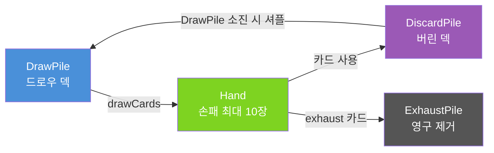
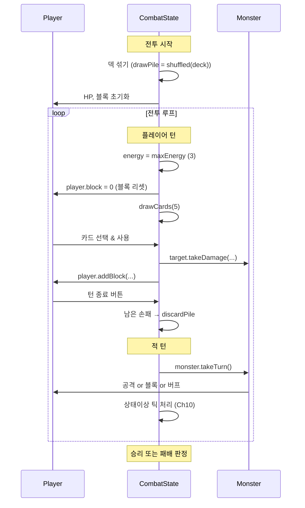

# Ch09. Phase 1 — 최소 전투 프로토타입

> 📌 **핵심 요약**
> 카드 게임의 핵심 루프(에너지 → 카드 사용 → 덱 사이클)와 단순한 적 AI를 구현해 "플레이 가능한 최소 전투"를 완성한다. 이 챕터의 목표는 완성도가 아닌 **동작하는 뼈대**다.

---

## 🎯 학습 목표

1. `AbstractCard` 계층 구조를 설계하고 Strike, Defend, Bash 카드를 구현한다
2. 에너지 시스템(턴당 3 에너지)과 카드 사용 비용 관리를 구현한다
3. Draw → Hand → Discard 덱 사이클과 셔플 메커니즘을 구현한다
4. Jaw Worm의 확률 기반 단순 AI를 구현한다
5. 블록(데미지 흡수, 턴 시작 초기화) 메커니즘을 이해하고 구현한다

---

## 1. 왜 Model은 libGDX 의존 없이 순수 Java인가

STS 클론 프로젝트의 `model/` 패키지는 libGDX API를 한 줄도 import하지 않는다. 이 결정은 아키텍처 상 매우 중요하다.

**이유 1: 단위 테스트 가능성**

libGDX의 대부분 클래스(`Gdx.files`, `Texture`, `SpriteBatch` 등)는 OpenGL 컨텍스트가 없으면 NPE를 던진다. 게임 로직을 libGDX와 분리하면 JUnit만으로 전투 로직을 검증할 수 있다.

```java
// 이렇게 테스트할 수 있다 — libGDX 초기화 없이도
@Test
void 강타_카드_사용시_적에게_6_데미지() {
    Player player = new Player();
    JawWorm jawWorm = new JawWorm();
    Strike strike = new Strike();

    strike.use(player, jawWorm);

    assertEquals(34, jawWorm.currentHp); // 40 - 6
}
```

**이유 2: MVC 분리**

```
model/ (순수 Java) ← 비즈니스 로직, 상태, 규칙
view/  (libGDX)    ← 렌더링, 애니메이션
controller/        ← 입력 처리, model과 view 연결
```

View는 Model을 읽어서 화면에 그릴 뿐, Model은 View를 모른다.

---

## 2. AbstractCard — 카드 클래스 계층 구조

### 2.1 CardType과 기본 추상 클래스

```java
// model/cards/CardType.java
public enum CardType {
    ATTACK,  // 공격 카드 (빨간색)
    SKILL,   // 스킬 카드 (초록색)
    POWER,   // 파워 카드 (보라색, 지속 효과)
    STATUS,  // 상태 카드 (혼란 유발, 사용 불가)
    CURSE    // 저주 카드 (부정적 효과)
}
```

```java
// model/cards/AbstractCard.java
public abstract class AbstractCard {
    public String id;
    public String name;
    public String description;
    public int cost;      // 에너지 비용
    public int damage;    // 기본 데미지 (ATTACK 카드)
    public int block;     // 기본 블록 (SKILL 카드)
    public CardType type;
    public boolean upgraded;  // 업그레이드 여부 (Ch12에서 사용)
    public boolean exhaustOnUse; // 사용 후 exhaust pile로

    public AbstractCard(String id, String name, int cost, CardType type) {
        this.id = id;
        this.name = name;
        this.cost = cost;
        this.type = type;
        this.upgraded = false;
        this.exhaustOnUse = false;
    }

    // 카드 사용의 핵심 — 구체 카드가 반드시 구현
    public abstract void use(Player player, AbstractMonster target);

    // 업그레이드 효과 — 구체 카드가 오버라이드
    public void upgrade() {
        this.upgraded = true;
    }

    // 덱에 들어갈 복사본 생성 (각 카드는 독립 인스턴스여야 함)
    public abstract AbstractCard makeCopy();
}
```

### 2.2 스타터 덱 카드 구현

```java
// model/cards/colorless/Strike.java
public class Strike extends AbstractCard {
    private static final int DAMAGE = 6;
    private static final int UPGRADED_DAMAGE = 9;

    public Strike() {
        super("strike", "강타", 1, CardType.ATTACK);
        this.damage = DAMAGE;
        this.description = "적에게 " + damage + " 데미지를 입힙니다.";
    }

    @Override
    public void use(Player player, AbstractMonster target) {
        // Ch10에서는 DamageAction을 큐에 추가하는 방식으로 변경됨
        // Phase 1에서는 즉시 실행
        target.takeDamage(this.damage);
    }

    @Override
    public void upgrade() {
        super.upgrade();
        this.damage = UPGRADED_DAMAGE;
        this.description = "적에게 " + damage + " 데미지를 입힙니다.";
        this.name = "강타+";
    }

    @Override
    public AbstractCard makeCopy() { return new Strike(); }
}
```

```java
// model/cards/colorless/Defend.java
public class Defend extends AbstractCard {
    private static final int BLOCK = 5;
    private static final int UPGRADED_BLOCK = 8;

    public Defend() {
        super("defend", "방어", 1, CardType.SKILL);
        this.block = BLOCK;
        this.description = "블록 " + block + "을 획득합니다.";
    }

    @Override
    public void use(Player player, AbstractMonster target) {
        // 블록은 플레이어에게 적용 (target은 여기서 무시)
        player.addBlock(this.block);
    }

    @Override
    public void upgrade() {
        super.upgrade();
        this.block = UPGRADED_BLOCK;
        this.description = "블록 " + block + "을 획득합니다.";
        this.name = "방어+";
    }

    @Override
    public AbstractCard makeCopy() { return new Defend(); }
}
```

```java
// model/cards/red/Bash.java — 아이언클래드 전용
public class Bash extends AbstractCard {
    private static final int DAMAGE = 8;
    private static final int VULNERABLE_STACKS = 2;

    public Bash() {
        super("bash", "강타-취약", 2, CardType.ATTACK);
        this.damage = DAMAGE;
        this.description = "적에게 " + DAMAGE + " 데미지. 취약 " + VULNERABLE_STACKS + " 부여.";
    }

    @Override
    public void use(Player player, AbstractMonster target) {
        target.takeDamage(this.damage);
        // Ch10에서 버프 시스템 추가 시 Vulnerable 적용
        // target.addBuff(new VulnerableBuff(VULNERABLE_STACKS));
    }

    @Override
    public AbstractCard makeCopy() { return new Bash(); }
}
```

---

## 3. 에너지 시스템

에너지는 카드 게임의 "자원"이다. 턴당 3 에너지가 주어지고, 카드 사용 시 소모된다.

```java
// model/CombatState.java (일부)
public class CombatState {
    public Player player;
    public List<AbstractMonster> monsters;

    // 덱 세 영역
    public List<AbstractCard> drawPile = new ArrayList<>();
    public List<AbstractCard> hand = new ArrayList<>();
    public List<AbstractCard> discardPile = new ArrayList<>();
    public List<AbstractCard> exhaustPile = new ArrayList<>(); // 영구 제거

    public int energy;
    public int maxEnergy = 3;
    public int turn = 1;

    public boolean canPlayCard(AbstractCard card) {
        // 손에 있는지 + 에너지 충분한지
        return hand.contains(card) && energy >= card.cost;
    }

    public void playCard(AbstractCard card, AbstractMonster target) {
        if (!canPlayCard(card)) return;

        energy -= card.cost;
        hand.remove(card);
        card.use(player, target);

        if (card.exhaustOnUse) {
            exhaustPile.add(card);
        } else {
            discardPile.add(card);
        }
    }
}
```

---

## 4. 덱 사이클 — DrawPile → Hand → DiscardPile



```java
public void drawCards(int count) {
    for (int i = 0; i < count; i++) {
        // DrawPile이 비어있으면 DiscardPile을 셔플해서 DrawPile로
        if (drawPile.isEmpty()) {
            shuffleDiscardIntoDraw();
        }
        // 그래도 비어있으면 (패 10장 이상 or 덱 자체가 작음) 중단
        if (drawPile.isEmpty()) break;
        if (hand.size() >= 10) break; // 손패 최대 10장

        hand.add(drawPile.remove(0));
    }
}

private void shuffleDiscardIntoDraw() {
    drawPile.addAll(discardPile);
    discardPile.clear();
    Collections.shuffle(drawPile, combatRandom); // 시드 기반 랜덤 (Ch13)
}
```

---

## 5. 전투 턴 플로우



---

## 6. 블록 시스템

블록은 데미지를 먼저 흡수하고, 초과 데미지만 HP에 영향을 준다. **턴 시작 시 초기화**된다.

```java
// model/AbstractCreature.java — Player와 Monster의 공통 기반
public abstract class AbstractCreature {
    public String name;
    public int currentHp;
    public int maxHp;
    public int block;

    public void takeDamage(int amount) {
        if (amount <= 0) return;

        // 블록이 데미지 흡수
        int absorbed = Math.min(block, amount);
        block -= absorbed;
        int remaining = amount - absorbed;

        // 남은 데미지가 HP를 깎음
        currentHp -= remaining;
        currentHp = Math.max(0, currentHp); // 0 미만 방지
    }

    public void addBlock(int amount) {
        block += amount;
    }

    public void heal(int amount) {
        currentHp = Math.min(maxHp, currentHp + amount);
    }

    public boolean isDead() {
        return currentHp <= 0;
    }
}
```

---

## 7. Jaw Worm — 단순 적 AI

Jaw Worm은 STS Act 1의 첫 번째 적이다. 세 가지 행동 패턴을 확률에 따라 선택한다.

| Move | 행동 | 확률 | 조건 |
|------|------|------|------|
| CHOMP | 11 데미지 | 45% | 첫 턴 고정 |
| THRASH | 7 데미지 + 5 블록 | 30% | 일반 |
| BELLOW | Strength+3, 6 블록 | 25% | 일반 |

```java
// model/monsters/JawWorm.java
public class JawWorm extends AbstractMonster {
    public enum Move { CHOMP, THRASH, BELLOW }

    private Move nextMove;
    private boolean isFirstTurn = true;

    public JawWorm() {
        super("턱벌레", 40, 44); // HP 40~44 랜덤
    }

    // 다음 행동을 미리 결정 (Intent 표시용, Ch10에서 UI 추가)
    public void determineNextMove(Random random) {
        if (isFirstTurn) {
            nextMove = Move.CHOMP;
            return;
        }
        int roll = random.nextInt(100);
        if (roll < 45) {
            nextMove = Move.CHOMP;
        } else if (roll < 75) {
            nextMove = Move.THRASH;
        } else {
            nextMove = Move.BELLOW;
        }
    }

    @Override
    public void takeTurn(CombatState state) {
        Player player = state.player;

        switch (nextMove) {
            case CHOMP:
                // 11 데미지
                player.takeDamage(11);
                break;
            case THRASH:
                // 7 데미지 + 5 블록
                player.takeDamage(7);
                addBlock(5);
                break;
            case BELLOW:
                // Strength +3, 6 블록 (Strength는 Ch10 버프 시스템에서 구현)
                addBlock(6);
                // addBuff(new StrengthBuff(3));
                break;
        }

        isFirstTurn = false;
        determineNextMove(state.combatRandom);
    }

    public Move getNextMove() { return nextMove; }
}
```

---

## 8. 승리/패배 판정

```java
// CombatState.java
public CombatResult checkCombatResult() {
    // 모든 적이 죽었으면 승리
    boolean allMonstersDead = monsters.stream().allMatch(AbstractCreature::isDead);
    if (allMonstersDead) return CombatResult.VICTORY;

    // 플레이어가 죽었으면 패배
    if (player.isDead()) return CombatResult.DEFEAT;

    return CombatResult.ONGOING;
}

public enum CombatResult { ONGOING, VICTORY, DEFEAT }
```

---

## 9. 스타터 덱 구성

아이언클래드의 스타터 덱은 10장이다.

```java
// model/Player.java
public static List<AbstractCard> getStarterDeck() {
    List<AbstractCard> deck = new ArrayList<>();
    for (int i = 0; i < 5; i++) deck.add(new Strike()); // 강타 5장
    for (int i = 0; i < 4; i++) deck.add(new Defend()); // 방어 4장
    deck.add(new Bash());                                // 강타-취약 1장
    return deck;
}

// 전투 시작 시 덱을 셔플해서 DrawPile로
public void initializeCombat(List<AbstractCard> deck) {
    drawPile.clear();
    hand.clear();
    discardPile.clear();

    for (AbstractCard card : deck) {
        drawPile.add(card.makeCopy()); // 원본 덱은 보존, 복사본으로 전투
    }
    Collections.shuffle(drawPile);
}
```

---

## 정리

- **AbstractCard**는 순수 Java이고, `use(Player, AbstractMonster)`가 유일한 실행 진입점이다
- **에너지**는 `CombatState.energy`로 관리되며, 카드 사용 시 `cost`만큼 차감된다
- **덱 사이클**: DrawPile → (draw) → Hand → (play/discard) → DiscardPile → (shuffle when empty) → DrawPile
- **블록**은 `takeDamage()`에서 먼저 흡수되고, 턴 시작 시 0으로 리셋된다
- **Jaw Worm AI**는 `determineNextMove()`로 다음 행동을 미리 결정해 Intent를 표시한다

다음 챕터(Ch10)에서는 즉시 실행 방식의 `use()`를 **Action Queue** 패턴으로 교체해 애니메이션과 로직을 분리하고, Strength/Vulnerable/Weak 같은 **버프 시스템**을 추가한다.

---

## 🔍 심화 학습

### 추천 자료

| 자료 | 내용 | 링크 |
|------|------|------|
| STS 위키 — The Ironclad | 스타터 덱, 카드 목록 | https://slay-the-spire.fandom.com/wiki/The_Ironclad |
| STS 위키 — Jaw Worm | 정확한 HP 범위, Move 확률 | https://slay-the-spire.fandom.com/wiki/Jaw_Worm |
| Effective Java Item 17 | 불변 객체 설계 (카드 인스턴스) | Joshua Bloch, 3rd Edition |
| Game Programming Patterns — State | 적 AI 상태 패턴 | https://gameprogrammingpatterns.com/state.html |

### TODO 실습 과제

1. `AbstractCard`를 상속받아 **Pommel Strike** 카드를 구현하라. (비용 1, 데미지 9, 카드 사용 시 1장 드로우 — 드로우 힌트: `state.drawCards(1)` 호출)
2. `CombatState.endTurn()`을 구현하라. (손패 전체 → discardPile, 적 턴 실행, 다음 플레이어 턴 시작)
3. `JawWorm`에 **연속 행동 제한** 규칙을 추가하라. (CHOMP를 두 번 연속 사용할 수 없다 — 힌트: `lastMove` 필드 활용)
4. 전투 로그를 출력하는 `CombatLogger`를 작성하고, 10턴 시뮬레이션을 main() 메서드로 실행하라. (JUnit 없이 stdout으로 검증)
5. `Player`의 `addBlock()`에 **Dexterity 버프**를 반영하는 로직을 추가하라. (Dexterity N이면 블록 +N, 힌트: `dexterity` 필드를 `AbstractCreature`에 추가)

---

## ✅ 체크리스트

### 카드 시스템
- [ ] `AbstractCard` 추상 클래스 작성 (id, name, cost, damage, block, type, use())
- [ ] `CardType` enum 정의 (ATTACK, SKILL, POWER, STATUS, CURSE)
- [ ] `Strike` 구현 및 JUnit 테스트 작성
- [ ] `Defend` 구현 및 JUnit 테스트 작성
- [ ] `Bash` 구현 (Vulnerable은 Ch10에서)

### 에너지 & 덱 사이클
- [ ] `CombatState.energy` 관리 (`canPlayCard`, `playCard`)
- [ ] `drawCards(int count)` 구현
- [ ] `shuffleDiscardIntoDraw()` 구현
- [ ] 손패 최대 10장 제한 구현
- [ ] `initializeCombat(deck)` 구현 (덱 복사 & 셔플)

### 전투 플로우
- [ ] `AbstractCreature.takeDamage()` 블록 흡수 로직
- [ ] `CombatState.startTurn()` (에너지 리셋, 블록 리셋, 5장 드로우)
- [ ] `CombatState.endTurn()` (손패 → 디스카드, 적 턴)
- [ ] `CombatState.checkCombatResult()` 승/패 판정

### 적 AI
- [ ] `JawWorm` 세 가지 Move 구현
- [ ] 첫 턴 CHOMP 고정 로직
- [ ] `determineNextMove()` 확률 기반 다음 행동 결정

### 테스트
- [ ] 카드별 JUnit 단위 테스트
- [ ] 블록 흡수 시나리오 테스트 (데미지 < 블록, 데미지 > 블록, 데미지 = 블록)
- [ ] 덱 소진 → 셔플 시나리오 테스트

---

## 📚 참고 자료

- [STS 위키 — Cards](https://slay-the-spire.fandom.com/wiki/Cards)
- [STS 위키 — Combat](https://slay-the-spire.fandom.com/wiki/Combat)
- [libGDX 공식 문서](https://libgdx.com/wiki/)
- [Game Programming Patterns](https://gameprogrammingpatterns.com/)
- [STS Mod 개발 가이드 (BaseMod)](https://github.com/daviscook477/BaseMod/wiki)
