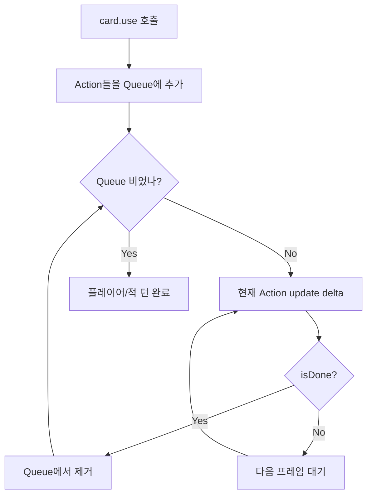
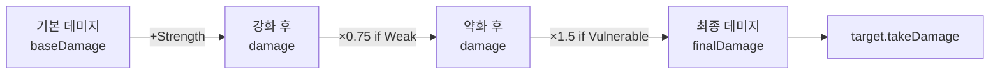

# Ch10. Phase 2 — Action Queue & 버프 시스템

> 📌 **핵심 요약**
> 카드의 즉시 실행 방식을 Action Queue 패턴으로 교체해 애니메이션과 로직을 분리하고, Strength/Vulnerable/Weak/Poison 같은 버프 시스템을 추가해 STS 원작의 핵심 전투 아키텍처를 재현한다.

---

## 🎯 학습 목표

1. Action Queue 패턴의 필요성을 이해하고 `AbstractAction` 계층을 설계한다
2. `DamageAction`, `BlockAction`, `DrawCardAction`, `ApplyBuffAction`을 구현한다
3. `AbstractBuff` 훅 시스템으로 Strength, Vulnerable, Weak, Poison을 구현한다
4. 적의 다음 행동을 미리 표시하는 Intent 시스템을 구현한다
5. 데미지 계산 파이프라인(Strength → Weak → Vulnerable)을 올바른 순서로 구현한다

---

## 1. 왜 Action Queue가 필요한가

Ch09에서 `card.use()`는 즉시 결과를 적용했다. 이 방식의 문제점:

**문제 1: 애니메이션 삽입 불가**

```java
// Ch09 방식 — 즉시 실행
public void use(Player player, AbstractMonster target) {
    target.takeDamage(6); // 데미지가 한 프레임에 적용됨, 애니메이션 삽입 불가
}
```

**문제 2: 중간 트리거 삽입 불가**

STS에서 "칼날 갑옷" 렐릭은 블록이 적용될 때마다 가시 데미지를 돌려준다. 즉시 실행 구조에서는 이 트리거를 삽입할 위치가 없다.

**문제 3: 실행 순서 보장 불가**

"3장 드로우 후 취약 부여" 같은 복합 효과에서 순서가 중요하다.

**Action Queue 방식:**

```
card.use() 호출
  → DamageAction 큐에 추가
  → ApplyBuffAction(Vulnerable) 큐에 추가

게임 루프:
  → DamageAction 실행 (0.3초 애니메이션)
  → 렐릭 트리거 체크
  → ApplyBuffAction 실행
```



---

## 2. AbstractAction 계층 구조

```java
// model/actions/AbstractAction.java
public abstract class AbstractAction {
    // 애니메이션 지속 시간 (초). 0이면 즉시 완료
    protected float duration;
    // 이 액션이 완료되었는지
    public boolean isDone = false;

    // 매 프레임 호출. delta = 이전 프레임과의 시간 차 (초)
    public abstract void update(float delta);

    // 즉시 완료 처리 (애니메이션 없는 액션용 편의 메서드)
    protected void markDone() {
        isDone = true;
    }
}
```

```java
// model/actions/ActionQueue.java
public class ActionQueue {
    private final Queue<AbstractAction> actions = new LinkedList<>();

    public void addAction(AbstractAction action) {
        actions.add(action);
    }

    // 큐의 맨 앞에 삽입 (다음 즉시 실행)
    public void addToFront(AbstractAction action) {
        ((LinkedList<AbstractAction>) actions).addFirst(action);
    }

    public void update(float delta) {
        if (!actions.isEmpty()) {
            AbstractAction current = actions.peek();
            current.update(delta);
            if (current.isDone) {
                actions.poll();
            }
        }
    }

    public boolean isEmpty() { return actions.isEmpty(); }
    public int size() { return actions.size(); }
}
```

---

## 3. 구체 Action 구현

### 3.1 DamageAction — 데미지 계산 포함

```java
// model/actions/DamageAction.java
public class DamageAction extends AbstractAction {
    private final AbstractCreature target;
    private final AbstractCreature source;
    private int baseDamage;

    public DamageAction(AbstractCreature target, AbstractCreature source, int baseDamage) {
        this.target = target;
        this.source = source;
        this.baseDamage = baseDamage;
        this.duration = 0.1f; // 짧은 히트 애니메이션
    }

    @Override
    public void update(float delta) {
        // 데미지 계산 파이프라인
        int finalDamage = calculateDamage();
        target.takeDamage(finalDamage);

        // View에 히트 이펙트 알림 (Observer 패턴, Ch10 후반)
        // EventBus.post(new DamageEvent(target, finalDamage));

        markDone();
    }

    private int calculateDamage() {
        float damage = (float) baseDamage;

        // 1단계: 소스의 Strength 적용 (+/- 고정 데미지)
        if (source != null && source.hasBuff("Strength")) {
            damage += source.getBuff("Strength").stackCount;
        }

        // 2단계: 소스에 Weak이 있으면 데미지 25% 감소
        if (source != null && source.hasBuff("Weak")) {
            damage *= 0.75f;
        }

        // 3단계: 타겟에 Vulnerable이 있으면 데미지 50% 증가
        if (target.hasBuff("Vulnerable")) {
            damage *= 1.5f;
        }

        return Math.max(0, (int) damage);
    }
}
```

> **데미지 계산 순서**가 중요하다. STS 원작은 Strength → Weak → Vulnerable 순으로 적용한다.



### 3.2 BlockAction

```java
// model/actions/BlockAction.java
public class BlockAction extends AbstractAction {
    private final AbstractCreature target;
    private int baseBlock;

    public BlockAction(AbstractCreature target, int baseBlock) {
        this.target = target;
        this.baseBlock = baseBlock;
        this.duration = 0.1f;
    }

    @Override
    public void update(float delta) {
        int finalBlock = baseBlock;

        // Dexterity 버프 적용 (+N 블록)
        if (target.hasBuff("Dexterity")) {
            finalBlock += target.getBuff("Dexterity").stackCount;
        }

        // Frail 디버프 적용 (블록 25% 감소)
        if (target.hasBuff("Frail")) {
            finalBlock = (int)(finalBlock * 0.75f);
        }

        target.addBlock(Math.max(0, finalBlock));
        markDone();
    }
}
```

### 3.3 DrawCardAction

```java
// model/actions/DrawCardAction.java
public class DrawCardAction extends AbstractAction {
    private final CombatState state;
    private final int amount;

    public DrawCardAction(CombatState state, int amount) {
        this.state = state;
        this.amount = amount;
        this.duration = 0.05f * amount; // 카드당 0.05초 딜레이
    }

    @Override
    public void update(float delta) {
        state.drawCards(amount);
        markDone();
    }
}
```

### 3.4 ApplyBuffAction

```java
// model/actions/ApplyBuffAction.java
public class ApplyBuffAction extends AbstractAction {
    private final AbstractCreature target;
    private final AbstractBuff buff;

    public ApplyBuffAction(AbstractCreature target, AbstractBuff buff) {
        this.target = target;
        this.buff = buff;
    }

    @Override
    public void update(float delta) {
        target.addBuff(buff);
        markDone();
    }
}
```

---

## 4. 카드 use() 리팩토링 — Action Queue 방식

```java
// Ch09 방식 (즉시 실행)
public void use(Player player, AbstractMonster target) {
    target.takeDamage(this.damage); // ❌
}

// Ch10 방식 (Action Queue)
public void use(Player player, AbstractMonster target, CombatState state) {
    state.actionQueue.addAction(
        new DamageAction(target, player, this.damage) // ✅
    );
}
```

```java
// Bash — 복합 액션 예시
public class Bash extends AbstractCard {
    @Override
    public void use(Player player, AbstractMonster target, CombatState state) {
        // 순서대로 큐에 추가: 데미지 먼저, 그 다음 버프
        state.actionQueue.addAction(new DamageAction(target, player, this.damage));
        state.actionQueue.addAction(new ApplyBuffAction(target, new VulnerableBuff(2)));
    }
}
```

---

## 5. 버프 시스템 — AbstractBuff

```java
// model/buffs/AbstractBuff.java
public abstract class AbstractBuff {
    public String id;
    public String name;
    public String description;
    public int stackCount;          // 스택 가능한 버프 (Strength +3 등)
    public boolean isDebuff;        // 적에게 붙으면 디버프, UI 색상 다름
    public boolean isBuff;          // 플레이어에게 유리한 버프
    public boolean isPostActionBuff; // 액션 큐 처리 후 적용

    // 이벤트 훅 — 구체 버프가 필요한 것만 오버라이드
    public void onTurnStart(AbstractCreature owner) {}
    public void onTurnEnd(AbstractCreature owner) {}
    public void onCardPlayed(AbstractCard card, AbstractCreature owner) {}
    public void atDamageGive(DamageInfo info) {}     // 내가 줄 데미지 수정
    public void atDamageReceive(DamageInfo info) {}  // 내가 받을 데미지 수정
    public void onAttacked(DamageInfo info, int damageDealt) {}
    public void onDeath(AbstractCreature owner) {}

    // 버프 스택 추가
    public void stackBuff(AbstractBuff buff) {
        this.stackCount += buff.stackCount;
    }

    // 버프 감소 (턴마다)
    public void reduceDuration() {
        this.stackCount--;
    }

    public boolean isExhausted() {
        return stackCount <= 0;
    }
}
```

### 5.1 구체 버프 구현

```java
// model/buffs/StrengthBuff.java
public class StrengthBuff extends AbstractBuff {
    public StrengthBuff(int amount) {
        this.id = "Strength";
        this.name = "근력";
        this.stackCount = amount;
        this.isBuff = amount > 0;
        this.isDebuff = amount < 0;
        this.description = "공격력이 " + Math.abs(amount) + " " +
                           (amount > 0 ? "증가합니다." : "감소합니다.");
    }
    // atDamageGive는 DamageAction에서 직접 읽으므로 훅 불필요
}
```

```java
// model/buffs/VulnerableBuff.java
public class VulnerableBuff extends AbstractBuff {
    public VulnerableBuff(int stacks) {
        this.id = "Vulnerable";
        this.name = "취약";
        this.stackCount = stacks;
        this.isDebuff = true;
        this.description = "받는 공격 데미지가 50% 증가합니다. " + stacks + "턴 지속.";
    }

    @Override
    public void onTurnStart(AbstractCreature owner) {
        // 매 턴 시작 시 스택 1 감소
        reduceDuration();
    }
}
```

```java
// model/buffs/PoisonBuff.java
public class PoisonBuff extends AbstractBuff {
    public PoisonBuff(int stacks) {
        this.id = "Poison";
        this.name = "독";
        this.stackCount = stacks;
        this.isDebuff = true;
        this.description = "매 턴 시작에 " + stacks + " 데미지를 받고 스택이 1 감소합니다.";
    }

    @Override
    public void onTurnStart(AbstractCreature owner) {
        if (stackCount > 0) {
            // 독 데미지는 블록을 무시하지 않는다 (원작 규칙)
            owner.takeDamage(stackCount);
            reduceDuration();
        }
    }
}
```

```java
// model/buffs/WeakBuff.java
public class WeakBuff extends AbstractBuff {
    public WeakBuff(int stacks) {
        this.id = "Weak";
        this.name = "약화";
        this.stackCount = stacks;
        this.isDebuff = true;
        this.description = "공격 데미지가 25% 감소합니다. " + stacks + "턴 지속.";
    }

    @Override
    public void onTurnStart(AbstractCreature owner) {
        reduceDuration();
    }
}
```

### 5.2 AbstractCreature 버프 관리

```java
// model/AbstractCreature.java — 버프 관련 메서드 추가
public abstract class AbstractCreature {
    protected Map<String, AbstractBuff> buffs = new HashMap<>();

    public void addBuff(AbstractBuff newBuff) {
        if (buffs.containsKey(newBuff.id)) {
            // 이미 있으면 스택 추가
            buffs.get(newBuff.id).stackBuff(newBuff);
            // 스택이 0 이하가 되면 제거
            if (buffs.get(newBuff.id).isExhausted()) {
                buffs.remove(newBuff.id);
            }
        } else {
            buffs.put(newBuff.id, newBuff);
        }
    }

    public boolean hasBuff(String id) {
        return buffs.containsKey(id) && !buffs.get(id).isExhausted();
    }

    public AbstractBuff getBuff(String id) {
        return buffs.get(id);
    }

    // 턴 시작 시 모든 버프의 onTurnStart 훅 실행
    public void triggerBuffsOnTurnStart() {
        // ConcurrentModificationException 방지를 위해 복사본 순회
        new ArrayList<>(buffs.values()).forEach(buff -> buff.onTurnStart(this));
        // 소진된 버프 제거
        buffs.entrySet().removeIf(e -> e.getValue().isExhausted());
    }
}
```

---

## 6. Intent 시스템 — 적의 다음 행동 표시

Intent는 플레이어가 적의 다음 행동을 미리 알 수 있게 해주는 STS의 핵심 UX 기능이다.

```java
// model/monsters/Intent.java
public enum Intent {
    ATTACK,           // 공격 (칼 아이콘)
    ATTACK_BUFF,      // 공격 + 버프
    ATTACK_DEBUFF,    // 공격 + 디버프
    DEFEND,           // 방어/블록
    BUFF,             // 자기 버프
    DEBUFF,           // 플레이어 디버프
    STRONG_BUFF,      // 강력한 버프
    UNKNOWN,          // 알 수 없음 (의식 부재 등)
    ESCAPE,           // 도주
    SLEEP,            // 잠자기
    MAGIC             // 특수 효과
}
```

```java
// model/monsters/AbstractMonster.java — Intent 관련 추가
public abstract class AbstractMonster extends AbstractCreature {
    protected Intent intent;
    protected int intentDamage;    // 공격 시 예상 데미지 (UI 표시용)
    protected int intentMultiHit;  // 멀티 히트 횟수 (0이면 단타)

    // 다음 행동 결정 — 구체 몬스터가 구현
    public abstract void determineNextMove(Random random);

    public Intent getIntent() { return intent; }
    public int getIntentDamage() { return intentDamage; }

    // 공격 Intent 설정 편의 메서드
    protected void setAttackIntent(int damage, int multiHit) {
        this.intent = Intent.ATTACK;
        this.intentDamage = damage;
        this.intentMultiHit = multiHit;
    }

    protected void setDefendIntent() {
        this.intent = Intent.DEFEND;
        this.intentDamage = 0;
    }
}
```

---

## 7. 확장 카드 목록 (Phase 2 추가)

Phase 2에서 추가할 수 있는 아이언클래드 카드들:

| 카드명 | 비용 | 효과 | 타입 |
|--------|------|------|------|
| Pommel Strike | 1 | 9 데미지, 1장 드로우 | ATTACK |
| Shrug It Off | 1 | 블록 8, 1장 드로우 | SKILL |
| Thunderclap | 1 | 전체 4 데미지, 전체 취약 1 | ATTACK |
| Twin Strike | 1 | 5 데미지 × 2 | ATTACK |
| Wild Strike | 1 | 12 데미지, 덱에 Wound 추가 | ATTACK |
| Armaments | 1 | 블록 5, 손패 카드 1장 업그레이드 | SKILL |
| Flex | 0 | Strength +2, 턴 종료 시 Strength -2 | SKILL |
| Havoc | 1 | DrawPile 상단 카드 사용 (비용 무시) | SKILL |
| Headbutt | 1 | 9 데미지, DiscardPile 상단 → DrawPile 상단 | ATTACK |
| Clothesline | 2 | 12 데미지, 적에게 Weak 2 | ATTACK |

```java
// Thunderclap — 전체 공격 예시
public class Thunderclap extends AbstractCard {
    public Thunderclap() {
        super("thunderclap", "낙뢰", 1, CardType.ATTACK);
        this.damage = 4;
        this.description = "모든 적에게 " + damage + " 데미지. 모든 적에게 취약 1 부여.";
    }

    @Override
    public void use(Player player, AbstractMonster target, CombatState state) {
        // 모든 적에게 Action 추가
        for (AbstractMonster monster : state.monsters) {
            state.actionQueue.addAction(new DamageAction(monster, player, this.damage));
            state.actionQueue.addAction(new ApplyBuffAction(monster, new VulnerableBuff(1)));
        }
    }
}
```

---

## 8. 다중 적 전투 관리

```java
// CombatState — 다중 적 지원
public class CombatState {
    public List<AbstractMonster> monsters = new ArrayList<>();

    // 적 추가
    public void addMonster(AbstractMonster monster) {
        monsters.add(monster);
    }

    // 살아있는 적만 반환
    public List<AbstractMonster> getLivingMonsters() {
        return monsters.stream()
            .filter(m -> !m.isDead())
            .collect(Collectors.toList());
    }

    // 적 턴 처리 (모든 살아있는 적이 순서대로 행동)
    public void processMonsterTurn() {
        for (AbstractMonster monster : getLivingMonsters()) {
            monster.triggerBuffsOnTurnStart(); // 독, 취약 등 틱
            monster.takeTurn(this);
            monster.determineNextMove(combatRandom); // 다음 Intent 결정
        }
    }
}
```

---

## 정리

- **Action Queue**는 `card.use()` → 큐에 Action 추가 → 게임 루프에서 순차 처리 방식으로 애니메이션/로직/트리거를 분리한다
- **DamageAction**이 데미지 계산 파이프라인을 담당한다: Strength(고정) → Weak(×0.75) → Vulnerable(×1.5)
- **AbstractBuff**의 이벤트 훅 시스템은 버프 효과를 게임 이벤트에 반응하도록 분리한다
- **Intent**는 플레이어가 전략적 판단을 내릴 수 있게 하는 STS의 핵심 UX 요소다

다음 챕터(Ch11)에서는 전투 외부 구조인 **DAG 맵 생성**과 **런 전체 루프**(카드 보상, 상점, 휴식)를 구현한다.

---

## 🔍 심화 학습

### 추천 자료

| 자료 | 내용 | 링크 |
|------|------|------|
| STS 위키 — Buffs | 모든 버프/디버프 목록 | https://slay-the-spire.fandom.com/wiki/Buffs |
| Game Programming Patterns — Command | Action Queue의 이론적 기반 | https://gameprogrammingpatterns.com/command.html |
| STS BaseMod API | `AbstractBuff` 원본 구조 | https://github.com/daviscook477/BaseMod/wiki |
| Oracle Java Docs — Queue | `LinkedList`의 Queue 구현 | https://docs.oracle.com/en/java/docs/api/java.base/java/util/Queue.html |

### TODO 실습 과제

1. `TwinStrike` 카드를 Action Queue 방식으로 구현하라. (5 데미지 × 2타 — 힌트: `DamageAction`을 2번 큐에 추가)
2. `PoisonBuff.onTurnStart()`를 구현하고, 독 스택이 0이 되면 자동 제거되는지 JUnit으로 검증하라
3. `Flex` 카드를 구현하라. (Strength +2 부여, 턴 종료 시 Strength -2 — 힌트: `onTurnEnd` 훅을 가진 `TemporaryStrengthBuff` 작성)
4. `ActionQueue`에 `addToFront()` 메서드를 추가하고, 이 메서드가 필요한 상황을 하나 이상 고안하라 (힌트: 반격 렐릭)
5. `Thunderclap`이 Vulnerable 상태의 적에게 올바른 데미지를 주는지 테스트 케이스를 작성하라 (데미지 계산 순서 검증)

---

## ✅ 체크리스트

### Action Queue
- [ ] `AbstractAction` 추상 클래스 (duration, isDone, update)
- [ ] `ActionQueue` 구현 (add, addToFront, update, isEmpty)
- [ ] `DamageAction` — 데미지 계산 파이프라인 포함
- [ ] `BlockAction` — Dexterity/Frail 적용
- [ ] `DrawCardAction` 구현
- [ ] `ApplyBuffAction` 구현
- [ ] 카드 `use()` 시그니처를 `CombatState` 파라미터 포함으로 변경

### 버프 시스템
- [ ] `AbstractBuff` 훅 메서드 정의
- [ ] `StrengthBuff` 구현 (양수/음수 모두)
- [ ] `VulnerableBuff` 구현 (턴마다 스택 감소)
- [ ] `WeakBuff` 구현
- [ ] `PoisonBuff` 구현
- [ ] `AbstractCreature.addBuff()` 스택 관리
- [ ] `triggerBuffsOnTurnStart()` 구현

### Intent 시스템
- [ ] `Intent` enum 정의
- [ ] `AbstractMonster.getIntent()` / `getIntentDamage()` 추가
- [ ] `JawWorm` Intent 연동 (3가지 Move별 Intent 설정)
- [ ] View에서 Intent 아이콘 표시 (Ch03 Scene2D 활용)

### 데미지 계산
- [ ] Strength 적용 테스트
- [ ] Vulnerable 적용 테스트 (50% 증가)
- [ ] Weak 적용 테스트 (25% 감소)
- [ ] Strength + Vulnerable 복합 테스트
- [ ] 데미지 0 미만 방지 테스트

---

## 📚 참고 자료

- [STS 위키 — Status Effects](https://slay-the-spire.fandom.com/wiki/Status_Effects)
- [Game Programming Patterns — Observer](https://gameprogrammingpatterns.com/observer.html)
- [Game Programming Patterns — Command](https://gameprogrammingpatterns.com/command.html)
- [Java Queue Interface Docs](https://docs.oracle.com/en/java/docs/api/java.base/java/util/Queue.html)
