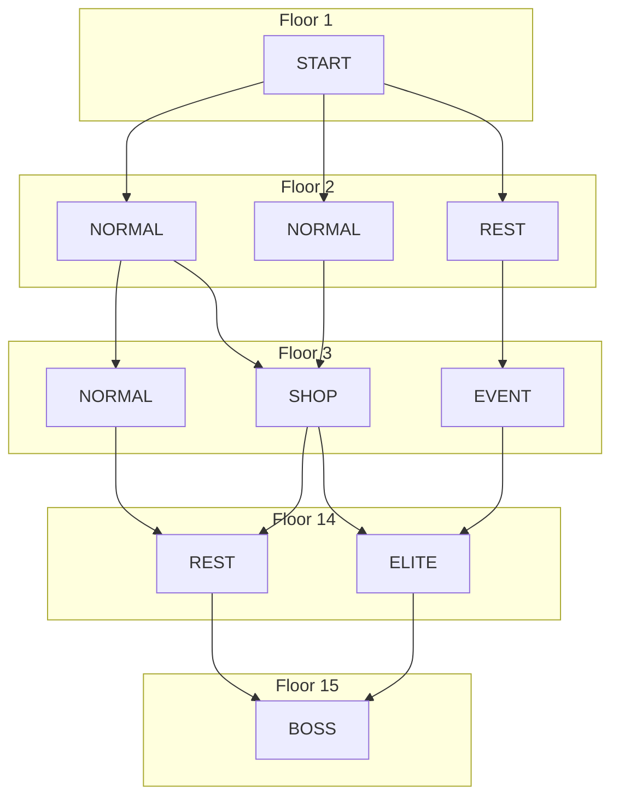
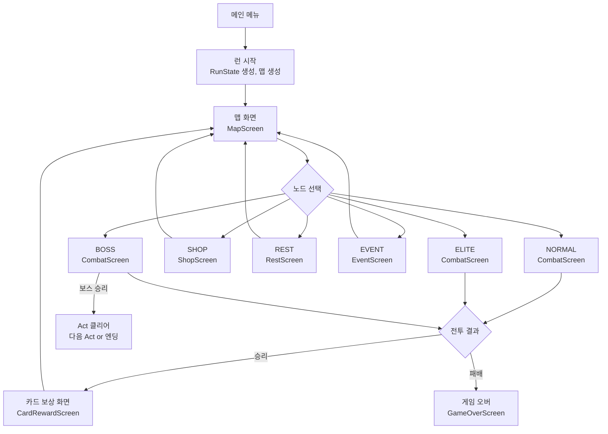

# Ch11. Phase 3 — 맵 & 런 구조

> 📌 **핵심 요약**
> DAG(방향 비순환 그래프) 알고리즘으로 15층 던전 맵을 생성하고, 카드 보상/상점/휴식을 포함한 런 전체 루프를 구현해 "한 판의 게임"을 완성한다.

---

## 🎯 학습 목표

1. DAG 맵 생성 알고리즘(층별 노드 배치 + 경로 연결 + 교차 방지)을 구현한다
2. 6가지 노드 타입(전투/엘리트/상점/휴식/이벤트/보스)과 확률 분포를 설계한다
3. `RunState`로 HP·골드·덱·렐릭을 런 전체에 걸쳐 유지하는 구조를 구현한다
4. 전투 승리 후 카드 보상 3장 선택 흐름을 구현한다
5. 상점 가격 공식과 카드 제거 시스템을 구현한다

---

## 1. STS 맵 구조 이해

STS의 맵은 **층(floor)별로 복수의 노드**가 있고, 인접 층 노드 간에 경로가 연결된 DAG다. 플레이어는 현재 위치에서 연결된 경로 중 하나를 선택해 다음 층으로 이동한다.



STS Act 1 기준:
- **15층** (1~14층 일반 노드 + 15층 보스)
- 층당 **2~4개** 노드
- **경로 교차 금지** (맵이 시각적으로 꼬이지 않도록)

---

## 2. MapNode와 NodeType

```java
// model/map/NodeType.java
public enum NodeType {
    NORMAL,   // 일반 전투 (56%)
    ELITE,    // 엘리트 전투 (8%, 좋은 보상)
    SHOP,     // 상점 (5%)
    REST,     // 휴식 자리 (12%, HP 회복 or 카드 업그레이드)
    EVENT,    // 랜덤 이벤트 (22%, ? 아이콘)
    BOSS      // 보스 (마지막 층 고정)
}
```

```java
// model/map/MapNode.java
public class MapNode {
    public final int floor;     // 0 = 1층
    public final int column;    // 해당 층에서의 위치 인덱스
    public NodeType type;
    public List<MapNode> connections = new ArrayList<>(); // 다음 층 연결 노드들
    public boolean visited = false;
    public boolean available = false; // 현재 선택 가능한 노드인지

    // 렌더링용 좌표 (View에서 사용)
    public float renderX, renderY;

    public MapNode(int floor, int column) {
        this.floor = floor;
        this.column = column;
    }

    public void addConnection(MapNode next) {
        if (!connections.contains(next)) {
            connections.add(next);
        }
    }
}
```

---

## 3. DAG 맵 생성 알고리즘

맵 생성의 핵심 제약:
1. 각 노드는 다음 층에 최소 1개 연결
2. 각 노드는 이전 층에서 최소 1개 연결
3. 경로가 교차하지 않음
4. 같은 층에 같은 타입이 연속 3개 이상 금지

```java
// model/map/DungeonMap.java
public class DungeonMap {
    public static final int FLOORS = 15;
    public static final int MIN_COLS = 2;
    public static final int MAX_COLS = 4;

    // floors.get(f) = f층의 노드 목록 (0-indexed)
    public List<List<MapNode>> floors = new ArrayList<>();
    private Random random;

    public void generate(long seed) {
        this.random = new Random(seed);
        floors.clear();

        // 1단계: 각 층의 노드 수 결정 및 노드 생성
        for (int f = 0; f < FLOORS - 1; f++) {
            int cols = MIN_COLS + random.nextInt(MAX_COLS - MIN_COLS + 1);
            List<MapNode> floorNodes = new ArrayList<>();
            for (int c = 0; c < cols; c++) {
                floorNodes.add(new MapNode(f, c));
            }
            floors.add(floorNodes);
        }
        // 마지막 층: 보스 1개
        List<MapNode> bossFloor = new ArrayList<>();
        bossFloor.add(new MapNode(FLOORS - 1, 0));
        floors.add(bossFloor);

        // 2단계: 경로 연결 (교차 방지 포함)
        connectFloors();

        // 3단계: 노드 타입 할당
        assignNodeTypes();

        // 4단계: 첫 층 모두 available
        floors.get(0).forEach(n -> n.available = true);
    }

    private void connectFloors() {
        for (int f = 0; f < FLOORS - 1; f++) {
            List<MapNode> current = floors.get(f);
            List<MapNode> next = floors.get(f + 1);

            // 각 현재 층 노드에서 다음 층 노드 1~2개 연결
            for (MapNode node : current) {
                // 기본: column이 가까운 노드와 연결
                int targetCol = Math.min(node.column, next.size() - 1);
                node.addConnection(next.get(targetCol));

                // 50% 확률로 인접 컬럼에도 연결 (단, 교차 방지)
                if (random.nextBoolean() && next.size() > 1) {
                    int altCol = targetCol + (random.nextBoolean() ? 1 : -1);
                    if (altCol >= 0 && altCol < next.size()) {
                        if (!wouldCross(node, next.get(altCol), current, next)) {
                            node.addConnection(next.get(altCol));
                        }
                    }
                }
            }

            // 다음 층의 모든 노드가 최소 1개 연결 받도록 보장
            for (MapNode nextNode : next) {
                boolean hasIncoming = current.stream()
                    .anyMatch(n -> n.connections.contains(nextNode));
                if (!hasIncoming) {
                    // 가장 가까운 현재 층 노드와 연결
                    current.stream()
                        .min(Comparator.comparingInt(n -> Math.abs(n.column - nextNode.column)))
                        .ifPresent(closest -> closest.addConnection(nextNode));
                }
            }
        }
    }

    // 교차 검사: 두 경로 (a→c, b→d)가 교차하는지 확인
    private boolean wouldCross(MapNode from, MapNode to,
                               List<MapNode> currentFloor, List<MapNode> nextFloor) {
        for (MapNode other : currentFloor) {
            if (other == from) continue;
            for (MapNode otherTarget : other.connections) {
                if (otherTarget.floor != to.floor) continue;
                // (from.column < other.column && to.column > otherTarget.column)
                // 또는 반대 방향이면 교차
                if ((from.column < other.column && to.column > otherTarget.column) ||
                    (from.column > other.column && to.column < otherTarget.column)) {
                    return true;
                }
            }
        }
        return false;
    }

    private void assignNodeTypes() {
        // 노드 타입 확률표 (STS Act 1 기준)
        for (int f = 0; f < FLOORS - 1; f++) {
            for (MapNode node : floors.get(f)) {
                node.type = rollNodeType(f);
            }
        }
        // 보스는 항상 BOSS
        floors.get(FLOORS - 1).get(0).type = NodeType.BOSS;

        // 1~3층: 엘리트 금지 (너무 이르면 게임 오버)
        for (int f = 0; f < 3; f++) {
            for (MapNode node : floors.get(f)) {
                if (node.type == NodeType.ELITE) {
                    node.type = NodeType.NORMAL;
                }
            }
        }
        // 보스 직전 층(13층): 항상 REST 또는 SHOP
        for (MapNode node : floors.get(FLOORS - 2)) {
            if (node.type == NodeType.NORMAL || node.type == NodeType.ELITE) {
                node.type = random.nextBoolean() ? NodeType.REST : NodeType.SHOP;
            }
        }
    }

    private NodeType rollNodeType(int floor) {
        int roll = random.nextInt(100);
        if (roll < 56) return NodeType.NORMAL;
        if (roll < 64) return NodeType.ELITE;   // 8%
        if (roll < 69) return NodeType.SHOP;    // 5%
        if (roll < 81) return NodeType.REST;    // 12%
        return NodeType.EVENT;                  // 22%
    }
}
```

| NodeType | 확률 | 특징 |
|----------|------|------|
| NORMAL | 56% | 일반 전투, 카드 보상 |
| ELITE | 8% | 강한 적, 렐릭 보상 |
| SHOP | 5% | 카드/렐릭 구매, 카드 제거 |
| REST | 12% | HP 30% 회복 or 카드 업그레이드 |
| EVENT | 22% | ? 아이콘, 랜덤 이벤트 |
| BOSS | - | 마지막 층 고정 |

---

## 4. RunState — 런 전체 상태

`RunState`는 던전을 클리어할 때까지 모든 상태를 보유하는 데이터 클래스다.

```java
// model/RunState.java
public class RunState {
    // 플레이어 상태
    public int currentHp;
    public int maxHp;
    public int gold;
    public int ascensionLevel = 0; // 난이도 (0~20)

    // 카드 컬렉션
    public List<AbstractCard> deck = new ArrayList<>();

    // 렐릭 (순서 중요: 획득 순서대로 효과 발동)
    public List<AbstractRelic> relics = new ArrayList<>();

    // 포션 슬롯 (최대 3개)
    public List<AbstractPotion> potions = new ArrayList<>();
    public int maxPotions = 3;

    // 맵 & 진행 상태
    public DungeonMap map;
    public MapNode currentNode;
    public int currentFloor = 0;
    public int act = 1;

    // 런 통계 (엔딩 화면용)
    public int enemiesKilled = 0;
    public int cardsPlayed = 0;
    public int damageTaken = 0;
    public long seed;

    public RunState(long seed) {
        this.seed = seed;
        this.currentHp = 80;
        this.maxHp = 80;
        this.gold = 99;
    }

    public boolean isAlive() { return currentHp > 0; }

    public void addCard(AbstractCard card) {
        deck.add(card);
    }

    public boolean removeCard(AbstractCard card) {
        return deck.remove(card);
    }

    public void addGold(int amount) {
        gold = Math.max(0, gold + amount);
    }

    public void heal(int amount) {
        currentHp = Math.min(maxHp, currentHp + amount);
    }

    public void healPercent(float percent) {
        int healAmount = (int)(maxHp * percent);
        heal(healAmount);
    }

    public void increaseMaxHp(int amount) {
        maxHp += amount;
        currentHp += amount; // 증가량만큼 즉시 회복
    }
}
```

---

## 5. 런 전체 루프



---

## 6. 카드 보상 시스템

전투 승리 후 3장의 카드 중 1장을 선택한다.

```java
// model/rewards/CardReward.java
public class CardReward {
    private static final int REWARD_COUNT = 3;

    // 보상 카드 3장 생성 (현재는 고정 풀, 추후 Act/Rare 확률 적용)
    public static List<AbstractCard> generateReward(RunState runState, Random random) {
        List<AbstractCard> pool = getCardPool(runState);
        Collections.shuffle(pool, random);

        List<AbstractCard> reward = new ArrayList<>();
        for (int i = 0; i < REWARD_COUNT && i < pool.size(); i++) {
            reward.add(pool.get(i).makeCopy());
        }
        return reward;
    }

    private static List<AbstractCard> getCardPool(RunState runState) {
        // 획득 가능한 전체 카드 풀 (이미 5장 이상 덱에 있는 카드 제외 등)
        // Phase 3에서는 단순하게 하드코딩된 풀 사용
        return Arrays.asList(
            new Strike(), new Defend(), new Bash(),
            new Pommel Strike(), new ShrugItOff(), new Thunderclap()
            // ... 더 많은 카드
        );
    }

    // 희귀도 기반 보상 (추후 구현)
    // COMMON: 60%, UNCOMMON: 37%, RARE: 3%
    // 엘리트 승리 시: UNCOMMON: 50%, RARE: 10%
}
```

---

## 7. 상점 시스템

```java
// model/shop/Shop.java
public class Shop {
    public List<AbstractCard> cards = new ArrayList<>();          // 구매 가능 카드
    public List<AbstractRelic> relics = new ArrayList<>();        // 구매 가능 렐릭
    public List<AbstractPotion> potions = new ArrayList<>();      // 구매 가능 포션
    public int cardRemovalCost = 75;                              // 카드 제거 비용

    public void generate(Random random) {
        cards = generateShopCards(random);
        relics = generateShopRelics(random);
        potions = generateShopPotions(random);
    }

    // 상점 카드 가격 공식 (STS 원작 기준)
    public int getCardPrice(AbstractCard card) {
        // 기본 가격: 희귀도에 따라 다름
        // COMMON: 45~55, UNCOMMON: 68~82, RARE: 135~165
        switch (card.rarity) {
            case COMMON: return 45 + random.nextInt(11);     // 45~55
            case UNCOMMON: return 68 + random.nextInt(15);   // 68~82
            case RARE: return 135 + random.nextInt(31);      // 135~165
            default: return 50;
        }
    }

    public boolean purchaseCard(AbstractCard card, RunState runState) {
        int price = getCardPrice(card);
        if (runState.gold < price) return false;

        runState.addGold(-price);
        runState.addCard(card.makeCopy());
        cards.remove(card);
        return true;
    }

    public boolean removeCard(AbstractCard card, RunState runState) {
        if (runState.gold < cardRemovalCost) return false;
        if (!runState.deck.contains(card)) return false;

        runState.addGold(-cardRemovalCost);
        runState.removeCard(card);
        // 카드 제거 이후 가격 증가 (25골드)
        cardRemovalCost += 25;
        return true;
    }
}
```

---

## 8. 휴식 자리 (Rest Site)

```java
// model/rest/RestSite.java
public class RestSite {
    // 옵션 1: HP 30% 회복
    public void rest(RunState runState) {
        runState.healPercent(0.30f);
    }

    // 옵션 2: 덱에서 카드 1장 업그레이드
    public void smith(AbstractCard card, RunState runState) {
        // 덱 내에서 해당 카드를 업그레이드
        if (runState.deck.contains(card) && !card.upgraded) {
            card.upgrade();
        }
    }

    // 고급 옵션 (렐릭으로 해금):
    // - Dig: 랜덤 렐릭 획득 (Shovel 렐릭)
    // - Lift: 최대 체력 +5 (Girya 렐릭)
    // - Recall: 열쇠 획득 (Calling Bell 렐릭, Act 3)
    // - Toke: 카드 제거 (Peace Pipe 렐릭)
}
```

---

## 9. 맵 이동 로직

```java
// model/map/DungeonMap.java
public void moveToNode(MapNode node, RunState runState) {
    if (runState.currentNode != null) {
        // 현재 노드에서 선택한 노드로의 연결이 있는지 검증
        if (!runState.currentNode.connections.contains(node)) {
            throw new IllegalStateException("연결되지 않은 노드로 이동 시도");
        }
        runState.currentNode.visited = true;
    }

    // 다음 층의 available 노드 초기화
    if (runState.currentNode != null) {
        for (MapNode connectedNode : runState.currentNode.connections) {
            connectedNode.available = false;
        }
    }

    runState.currentNode = node;
    runState.currentFloor = node.floor;

    // 선택한 노드에서 연결된 다음 층 노드를 available로 표시
    node.connections.forEach(n -> n.available = true);
}
```

---

## 정리

- **DungeonMap**은 DAG 구조로 층별 노드와 경로를 관리한다. 교차 방지 로직이 핵심이다
- **RunState**는 덱·HP·골드·렐릭·맵 위치를 보유하며 방 클리어 시 지속된다
- 런 루프: Map → (전투/상점/휴식/이벤트) → 카드 보상 → Map 반복
- **카드 보상**은 희귀도 기반 확률로 3장을 추출하며, 플레이어가 1장 선택 or 스킵한다
- **상점 카드 제거**는 75골드에서 시작해 사용 시마다 25골드 증가한다

다음 챕터(Ch12)에서는 렐릭 시스템, 포션, 카드 업그레이드, 보스 AI, 랜덤 이벤트를 추가해 게임의 깊이를 완성한다.

---

## 🔍 심화 학습

### 추천 자료

| 자료 | 내용 | 링크 |
|------|------|------|
| STS 위키 — Map | 정확한 층수, 노드 확률 | https://slay-the-spire.fandom.com/wiki/Map |
| Wikipedia — DAG | 방향 비순환 그래프 이론 | https://en.wikipedia.org/wiki/Directed_acyclic_graph |
| STS 위키 — Shop | 상점 가격, 제거 비용 | https://slay-the-spire.fandom.com/wiki/Merchant |
| Scene2D libGDX | 맵 렌더링을 위한 Actor 배치 | https://libgdx.com/wiki/graphics/2d/scene2d/scene2d |

### TODO 실습 과제

1. `DungeonMap.generate()`를 구현하고, 생성된 맵을 콘솔에 ASCII 아트로 출력하라. (각 층을 한 줄로, 노드를 `[N]`, `[E]`, `[S]` 등으로 표시, 연결선은 `/` `|` `\` 활용)
2. 교차 방지 로직을 단위 테스트로 검증하라. (3열 맵에서 0→2 경로와 2→0 경로가 동시에 존재하지 않는지)
3. `CardReward.generateReward()`에 희귀도 확률을 구현하라. (COMMON 60%, UNCOMMON 37%, RARE 3% — 힌트: 0~99 랜덤 값 기반 분기)
4. `Shop`의 카드 제거 가격이 75 → 100 → 125 순으로 증가하는지 테스트 케이스를 작성하라
5. `RunState`를 JSON으로 직렬화/역직렬화하는 코드를 작성하라. (Gson 라이브러리 활용, 런 저장/불러오기 기반)

---

## ✅ 체크리스트

### 맵 생성
- [ ] `NodeType` enum 정의 (6종)
- [ ] `MapNode` (floor, column, type, connections, visited, available)
- [ ] `DungeonMap.generate(seed)` — 노드 생성 + 경로 연결 + 타입 할당
- [ ] 교차 방지 `wouldCross()` 구현
- [ ] 다음 층 노드 최소 1개 연결 보장
- [ ] 1~3층 엘리트 금지, 보스 직전 층 REST/SHOP 보장

### RunState
- [ ] HP, 최대 HP, 골드 필드
- [ ] 덱 (카드 리스트) 관리 (addCard, removeCard)
- [ ] 렐릭/포션 슬롯
- [ ] 현재 노드, 현재 층, Act 추적
- [ ] `healPercent(float)` 구현

### 런 루프
- [ ] `MapScreen` — 노드 표시, 클릭 시 이동
- [ ] `CardRewardScreen` — 3장 표시, 선택/스킵
- [ ] `RestScreen` — 휴식(HP 회복) / 대장간(카드 업그레이드) 선택
- [ ] `ShopScreen` — 카드/렐릭/포션 목록, 구매, 카드 제거
- [ ] 게임 오버 화면

### 상점
- [ ] 카드 가격 공식 (희귀도별)
- [ ] 카드 제거 비용 (75 + 25n)
- [ ] 구매 후 gold 차감 검증
- [ ] 재고 소진 후 구매 시도 예외 처리

---

## 📚 참고 자료

- [STS 위키 — Map Generation](https://slay-the-spire.fandom.com/wiki/Map)
- [STS 위키 — Merchant](https://slay-the-spire.fandom.com/wiki/Merchant)
- [STS 위키 — Rest Site](https://slay-the-spire.fandom.com/wiki/Rest_Site)
- [libGDX Scene2D — Table Layout](https://libgdx.com/wiki/graphics/2d/scene2d/table)
- [Gson User Guide](https://github.com/google/gson/blob/main/UserGuide.md)
