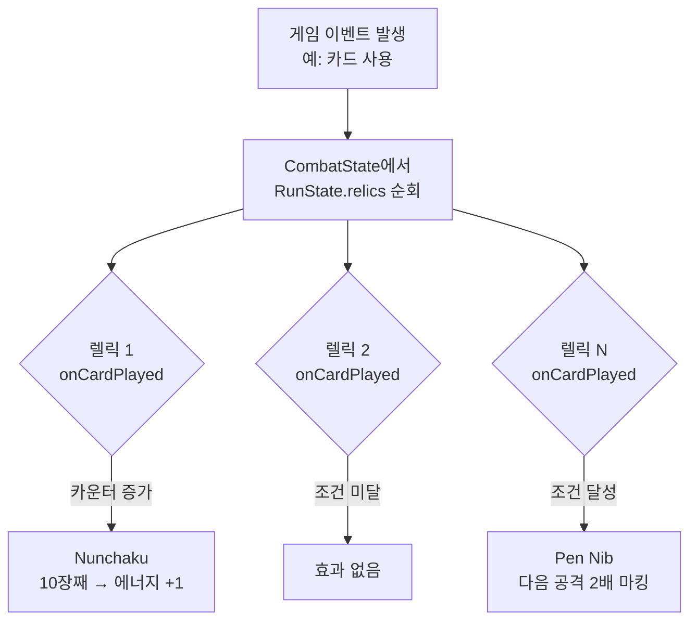
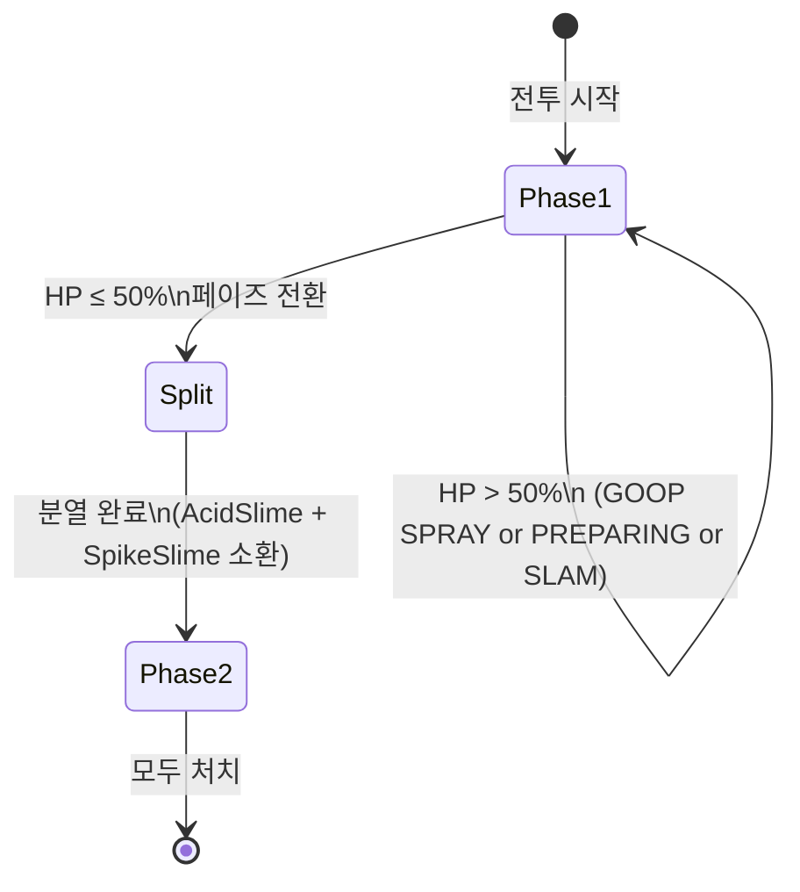
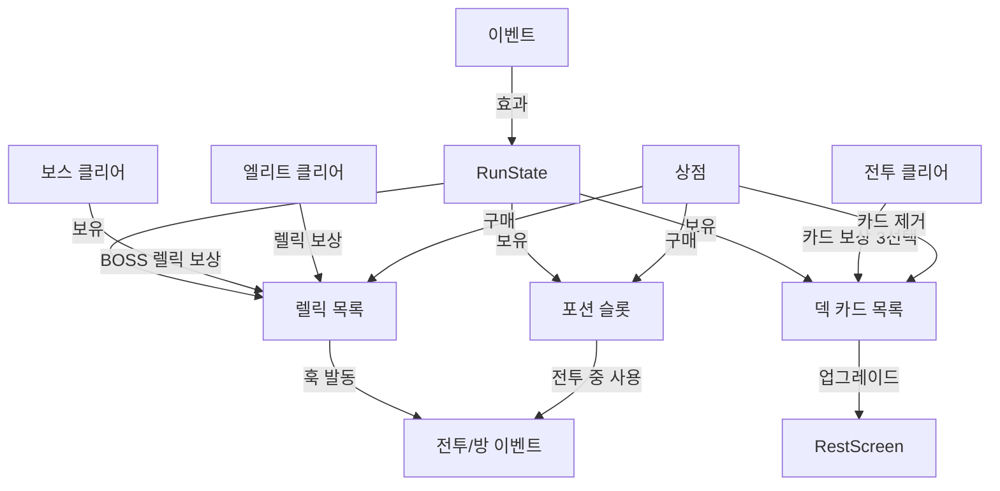

# Ch12. Phase 4 — 콘텐츠 확장

> 📌 **핵심 요약**
> 렐릭·포션·카드 업그레이드·보스 AI·랜덤 이벤트를 추가해 게임의 조합 깊이와 전략적 선택지를 완성한다. 이 챕터는 "플레이 가능한 게임"을 "반복 플레이하고 싶은 게임"으로 만드는 단계다.

---

## 🎯 학습 목표

1. 이벤트 훅 기반 `AbstractRelic` 시스템을 설계하고 8~10개의 렐릭을 구현한다
2. `AbstractPotion`으로 즉시 사용 가능한 포션 시스템을 구현한다
3. `upgrade()` 메서드를 활용한 카드 업그레이드 시스템을 완성한다
4. 페이즈 전환이 있는 보스 AI(스테이트 머신)를 구현한다
5. 선택지 기반 랜덤 이벤트 시스템을 설계한다

---

## 1. 렐릭 시스템 — 게임 규칙 변경기

렐릭은 STS의 빌드 다양성을 만드는 핵심이다. 각 렐릭은 게임 이벤트에 반응하는 **훅**을 가지며, 런 전체에 걸쳐 효과가 지속된다.

렐릭이 단순한 스탯 보너스가 아닌 이유: 렐릭은 **게임 규칙 자체를 바꾼다**. "매 전투 시작 시 Strength +1"은 스탯이지만, "카드를 사용할 때마다 에너지 1 생성"(Pen Nib 유사)은 플레이 스타일을 바꾼다.

```java
// model/relics/RelicTier.java
public enum RelicTier {
    STARTER,    // 시작 렐릭 (캐릭터 고유)
    COMMON,     // 일반 (상점, 보스, 이벤트)
    UNCOMMON,   // 희귀
    RARE,       // 매우 희귀
    BOSS,       // 보스 클리어 보상
    SHOP,       // 상점 전용
    EVENT,      // 이벤트 전용
    SPECIAL     // 특수 (키 등)
}
```

```java
// model/relics/AbstractRelic.java
public abstract class AbstractRelic {
    public String id;
    public String name;
    public String description;
    public RelicTier tier;
    public int counter = -1; // 일부 렐릭의 카운터 (예: Nunchaku: 0~9)

    // 렐릭은 RunState를 직접 참조하지 않고 훅을 통해서만 동작한다
    // 이렇게 하면 렐릭 효과를 독립적으로 테스트할 수 있다

    public void onEquip(Player player) {}          // 획득 시 즉시 효과
    public void onUnequip(Player player) {}         // 제거 시 (거의 없음)

    // 전투 이벤트 훅
    public void onBattleStart(CombatState state) {}
    public void onTurnStart(CombatState state) {}
    public void onTurnEnd(CombatState state) {}
    public void onCardPlayed(AbstractCard card, CombatState state) {}
    public void onMonsterDeath(AbstractMonster monster, CombatState state) {}
    public void onBattleEnd(CombatState state) {}

    // 런 이벤트 훅
    public void onEnterRoom(MapNode node, RunState runState) {}
    public void onPlayerHeal(int amount, RunState runState) {}
    public int onGoldGained(int gold, RunState runState) { return gold; } // 골드 수정 가능

    // 카운터 표시 (일부 렐릭용)
    public boolean hasCounter() { return counter >= 0; }
    public void incrementCounter() { counter++; }
    public void resetCounter(int value) { counter = value; }
}
```

### 1.1 렐릭 구현 예시

```java
// model/relics/common/BurningBlood.java
// 아이언클래드 시작 렐릭 — 전투 종료 시 HP 6 회복
public class BurningBlood extends AbstractRelic {
    public BurningBlood() {
        this.id = "BurningBlood";
        this.name = "불타는 피";
        this.description = "전투 종료 시 HP를 6 회복합니다.";
        this.tier = RelicTier.STARTER;
    }

    @Override
    public void onBattleEnd(CombatState state) {
        state.runState.heal(6);
    }
}
```

```java
// model/relics/common/Vajra.java
// 획득 시 즉시 Strength +1
public class Vajra extends AbstractRelic {
    public Vajra() {
        this.id = "Vajra";
        this.name = "바즈라";
        this.description = "획득 시 Strength +1을 영구적으로 얻습니다.";
        this.tier = RelicTier.RARE;
    }

    @Override
    public void onEquip(Player player) {
        // 전투 외부에서 영구 Strength 부여
        player.permanentStrength += 1;
    }

    @Override
    public void onBattleStart(CombatState state) {
        // 매 전투 시작 시 permanentStrength를 버프로 적용
        if (state.player.permanentStrength > 0) {
            state.actionQueue.addAction(new ApplyBuffAction(
                state.player, new StrengthBuff(state.player.permanentStrength)
            ));
        }
    }
}
```

```java
// model/relics/common/Nunchaku.java
// 카드 10장 사용 시 에너지 1 충전
public class Nunchaku extends AbstractRelic {
    private static final int TRIGGER_COUNT = 10;

    public Nunchaku() {
        this.id = "Nunchaku";
        this.name = "쌍절곤";
        this.description = "카드를 " + TRIGGER_COUNT + "장 사용할 때마다 에너지를 1 충전합니다.";
        this.tier = RelicTier.COMMON;
        this.counter = 0;
    }

    @Override
    public void onCardPlayed(AbstractCard card, CombatState state) {
        counter++;
        if (counter >= TRIGGER_COUNT) {
            state.energy = Math.min(state.energy + 1, state.maxEnergy + 1);
            counter = 0; // 리셋
        }
    }
}
```

### 1.2 렐릭 티어별 구현 목록

| 렐릭명 | 티어 | 효과 |
|--------|------|------|
| Burning Blood | STARTER | 전투 후 HP 6 회복 |
| Vajra | RARE | 획득 시 Strength +1 영구 |
| Nunchaku | COMMON | 카드 10장마다 에너지 +1 |
| Bag of Preparation | COMMON | 첫 턴 2장 추가 드로우 |
| Akabeko | COMMON | 첫 공격 +8 데미지 |
| Anchor | COMMON | 전투 시작 시 블록 10 |
| Art of War | UNCOMMON | 적 행동 안 하는 턴에 에너지 +1 |
| Bronze Scales | COMMON | 피격 시 3 데미지 반격 |
| Pen Nib | UNCOMMON | 카드 10장마다 다음 공격 2배 |
| Centennial Puzzle | COMMON | 첫 피격 시 3장 드로우 |

```java
// model/relics/common/BagOfPreparation.java
public class BagOfPreparation extends AbstractRelic {
    public BagOfPreparation() {
        this.id = "BagOfPreparation";
        this.name = "준비 가방";
        this.description = "매 전투 첫 턴에 카드를 2장 더 드로우합니다.";
        this.tier = RelicTier.COMMON;
    }

    @Override
    public void onBattleStart(CombatState state) {
        // 전투 시작(첫 드로우 전)에 2장 추가 예약
        state.firstTurnExtraDraws += 2;
    }
}
```

---

## 2. 렐릭 이벤트 훅 흐름



```java
// CombatState — 렐릭 훅 발동 예시
public void onCardPlayed(AbstractCard card) {
    // 모든 렐릭의 onCardPlayed 훅 실행
    for (AbstractRelic relic : runState.relics) {
        relic.onCardPlayed(card, this);
    }
}
```

---

## 3. 포션 시스템

포션은 전투 중 언제든 사용할 수 있는 소모성 아이템이다. 최대 3개 슬롯에 보관한다.

```java
// model/potions/AbstractPotion.java
public abstract class AbstractPotion {
    public String id;
    public String name;
    public String description;
    public PotionRarity rarity;
    public boolean requiresTarget; // true: 적 선택 필요, false: 즉시 효과

    // 포션 사용 — target은 requiresTarget=false일 때 null
    public abstract void use(Player player, AbstractMonster target, CombatState state);

    // 포션 사용 가능 조건 (기본: 항상 사용 가능)
    public boolean canUse(CombatState state) { return true; }
}
```

```java
// model/potions/FirePotion.java
public class FirePotion extends AbstractPotion {
    public FirePotion() {
        this.id = "FirePotion";
        this.name = "화염 포션";
        this.description = "선택한 적에게 20 데미지.";
        this.rarity = PotionRarity.COMMON;
        this.requiresTarget = true;
    }

    @Override
    public void use(Player player, AbstractMonster target, CombatState state) {
        state.actionQueue.addAction(new DamageAction(target, player, 20));
    }
}
```

```java
// model/potions/BlockPotion.java
public class BlockPotion extends AbstractPotion {
    public BlockPotion() {
        this.id = "BlockPotion";
        this.name = "방어 포션";
        this.description = "블록 12 획득.";
        this.rarity = PotionRarity.COMMON;
        this.requiresTarget = false;
    }

    @Override
    public void use(Player player, AbstractMonster target, CombatState state) {
        state.actionQueue.addAction(new BlockAction(player, 12));
    }
}
```

```java
// model/potions/StrengthPotion.java
public class StrengthPotion extends AbstractPotion {
    public StrengthPotion() {
        this.id = "StrengthPotion";
        this.name = "근력 포션";
        this.description = "이번 전투 동안 Strength +2.";
        this.requiresTarget = false;
    }

    @Override
    public void use(Player player, AbstractMonster target, CombatState state) {
        state.actionQueue.addAction(new ApplyBuffAction(player, new StrengthBuff(2)));
    }
}
```

---

## 4. 카드 업그레이드 시스템

휴식 자리에서 1장, 또는 렐릭 효과로 업그레이드한다. `upgraded` 플래그와 `upgrade()` 메서드로 관리한다.

```java
// 각 카드의 업그레이드 효과
public class Strike extends AbstractCard {
    // 기본: 6 데미지, 업그레이드: 9 데미지
    @Override
    public void upgrade() {
        super.upgrade(); // upgraded = true, name = "강타+"
        upgradeDamage(3); // damage += 3
        updateDescription();
    }
}

public class Defend extends AbstractCard {
    // 기본: 5 블록, 업그레이드: 8 블록
    @Override
    public void upgrade() {
        super.upgrade();
        upgradeBlock(3);
        updateDescription();
    }
}

public class Bash extends AbstractCard {
    // 기본: 8 데미지 + 취약 2, 업그레이드: 10 데미지 + 취약 3
    @Override
    public void upgrade() {
        super.upgrade();
        upgradeDamage(2);
        this.vulnerableStacks = 3;
        updateDescription();
    }
}
```

```java
// AbstractCard — 업그레이드 편의 메서드
public abstract class AbstractCard {
    protected void upgradeDamage(int amount) {
        this.damage += amount;
    }

    protected void upgradeBlock(int amount) {
        this.block += amount;
    }

    protected void upgradeCost(int newCost) {
        this.cost = newCost;
    }

    // 이름 뒤에 + 추가 (이미 super.upgrade()에서 처리)
    protected void upgradeName() {
        this.name += "+";
    }
}
```

---

## 5. 보스 AI — 페이즈 전환 스테이트 머신

Act 1 보스: **Slime Boss** (점액 보스). HP 140. 2페이즈 전환.



```java
// model/monsters/boss/SlimeBoss.java
public class SlimeBoss extends AbstractMonster {
    private enum Phase { PHASE_1, SPLITTING, PHASE_2 }
    private enum Move { GOOP_SPRAY, PREPARING, SLAM }

    private Phase phase = Phase.PHASE_1;
    private Move nextMove;
    private boolean hasSplit = false;

    public SlimeBoss() {
        super("점액 보스", 140, 140);
        this.isBoss = true;
    }

    @Override
    public void takeTurn(CombatState state) {
        // HP 50% 이하 & 아직 분열 안 했으면 분열
        if (currentHp <= maxHp / 2 && !hasSplit) {
            performSplit(state);
            return;
        }

        switch (nextMove) {
            case GOOP_SPRAY:
                // 플레이어에게 Slimed 카드 5장을 덱에 추가
                for (int i = 0; i < 5; i++) {
                    state.actionQueue.addAction(new MakeTempCardAction(state, new Slimed()));
                }
                break;
            case PREPARING:
                // 이번 턴은 행동 안 함 (다음 턴 SLAM 예고)
                break;
            case SLAM:
                // 35 데미지 (강력한 단타)
                state.actionQueue.addAction(new DamageAction(state.player, this, 35));
                break;
        }
        determineNextMove(state.combatRandom);
    }

    private void performSplit(CombatState state) {
        hasSplit = true;
        // 자신을 제거하고 두 슬라임 소환
        int halfHp = currentHp / 2;
        state.actionQueue.addAction(new SpawnMonsterAction(state,
            new AcidSlime(halfHp)));
        state.actionQueue.addAction(new SpawnMonsterAction(state,
            new SpikeSlime(halfHp)));
        state.actionQueue.addAction(new RemoveMonsterAction(state, this));
    }

    @Override
    public void determineNextMove(Random random) {
        if (hasSplit) return;

        // 페이즈 1 Move 패턴: GOOP_SPRAY → PREPARING → SLAM → PREPARING → SLAM ...
        // (단순화: 3-move 사이클)
        switch (nextMove) {
            case GOOP_SPRAY: nextMove = Move.PREPARING; break;
            case PREPARING:  nextMove = Move.SLAM; break;
            case SLAM:       nextMove = Move.PREPARING; break;
            default:         nextMove = Move.GOOP_SPRAY; break;
        }
        updateIntent();
    }

    private void updateIntent() {
        switch (nextMove) {
            case GOOP_SPRAY: intent = Intent.DEBUFF; break;
            case PREPARING:  intent = Intent.UNKNOWN; break;
            case SLAM:       setAttackIntent(35, 1); break;
        }
    }
}
```

---

## 6. 랜덤 이벤트 시스템

이벤트는 선택지 기반(2~3개)이며, 각 선택지는 RunState를 수정하는 람다로 구현한다.

```java
// model/events/GameEvent.java
public class GameEvent {
    public String id;
    public String title;
    public String description;  // 이벤트 배경 설명
    public String imageKey;     // 이벤트 이미지 (asset key)
    public List<EventChoice> choices = new ArrayList<>();

    public GameEvent(String id, String title, String description) {
        this.id = id;
        this.title = title;
        this.description = description;
    }
}
```

```java
// model/events/EventChoice.java
public class EventChoice {
    public String text;                    // 선택지 텍스트
    public String resultText;              // 선택 후 결과 설명
    public Consumer<RunState> effect;      // 실제 효과
    public Predicate<RunState> condition;  // 선택 가능 조건 (null이면 항상 가능)

    public EventChoice(String text, String resultText, Consumer<RunState> effect) {
        this.text = text;
        this.resultText = resultText;
        this.effect = effect;
        this.condition = null;
    }

    public boolean isAvailable(RunState runState) {
        return condition == null || condition.test(runState);
    }
}
```

```java
// model/events/BigFishEvent.java — "Big Fish" 이벤트 구현
public class BigFishEvent extends GameEvent {
    public BigFishEvent() {
        super("BigFish", "큰 물고기",
              "맑은 강물에서 거대한 물고기 한 마리가 당신을 바라보고 있습니다.\n" +
              "물고기는 무언가를 제공하려는 것 같습니다.");

        // 선택지 1: HP 회복
        choices.add(new EventChoice(
            "먹다.",
            "물고기를 먹었다. HP 33% 회복.",
            runState -> runState.healPercent(0.33f)
        ));

        // 선택지 2: 최대 HP 증가 + 저주 카드
        choices.add(new EventChoice(
            "변이하다.",
            "최대 HP +5. 덱에 저주 카드 추가.",
            runState -> {
                runState.increaseMaxHp(5);
                runState.addCard(new Parasite()); // 저주 카드
            }
        ));

        // 선택지 3: 렐릭 획득 + 최대 HP 감소 (조건: HP > 50%)
        choices.add(new EventChoice(
            "제물로 바치다.",
            "렐릭 획득. 최대 HP -28.",
            runState -> {
                runState.addRelic(RelicPool.getRandomRelic(runState.rng));
                runState.maxHp = Math.max(1, runState.maxHp - 28);
                runState.currentHp = Math.min(runState.currentHp, runState.maxHp);
            },
            runState -> runState.currentHp > runState.maxHp * 0.5f  // 조건
        ));
    }
}
```

### 이벤트 JSON 구조 (데이터 기반 확장 시)

```json
{
  "id": "BigFish",
  "title": "큰 물고기",
  "description": "맑은 강물에서 거대한 물고기가...",
  "imageKey": "event_big_fish",
  "choices": [
    {
      "text": "먹다.",
      "resultText": "HP 33% 회복.",
      "effects": [{ "type": "HEAL_PERCENT", "value": 0.33 }]
    },
    {
      "text": "변이하다.",
      "resultText": "최대 HP +5. 저주 카드 추가.",
      "effects": [
        { "type": "INCREASE_MAX_HP", "value": 5 },
        { "type": "ADD_CARD", "cardId": "Parasite" }
      ]
    }
  ]
}
```

---

## 7. 이벤트 풀 및 선택 로직

```java
// model/events/EventPool.java
public class EventPool {
    private static final List<GameEvent> ACT1_EVENTS = Arrays.asList(
        new BigFishEvent(),
        new GoldenShrineEvent(),
        new DeadAdventurerEvent(),
        new FaceTraderEvent(),
        new MushroomEvent()
        // ... 더 많은 이벤트
    );

    public static GameEvent getRandomEvent(Random random, Set<String> visitedEvents) {
        // 방문하지 않은 이벤트 우선 선택
        List<GameEvent> available = ACT1_EVENTS.stream()
            .filter(e -> !visitedEvents.contains(e.id))
            .collect(Collectors.toList());

        if (available.isEmpty()) {
            // 모든 이벤트를 다 봤으면 풀 리셋
            available = new ArrayList<>(ACT1_EVENTS);
        }

        return available.get(random.nextInt(available.size()));
    }
}
```

---

## 8. 전체 콘텐츠 연결 구조



---

## 정리

- **AbstractRelic**의 이벤트 훅 시스템은 렐릭 효과를 게임 이벤트와 느슨하게 결합한다. 새 렐릭 추가 시 CombatState를 수정할 필요가 없다
- **포션**은 `requiresTarget` 플래그로 타겟 선택 UI와 즉시 효과 UI를 구분한다
- **보스 AI**의 페이즈 전환은 스테이트 머신 패턴으로 구현한다. HP 임계치 감지 → 특수 Action 실행
- **이벤트 시스템**의 `Consumer<RunState>` 람다 방식은 이벤트 효과를 코드로 표현하기 쉽지만, 대규모 확장 시 JSON 기반으로 전환할 수 있다

다음 챕터(Ch13)에서는 오디오, 카드 플레이 애니메이션, 화면 전환, 시드 기반 랜덤으로 게임의 **"느낌"**을 완성한다.

---

## 🔍 심화 학습

### 추천 자료

| 자료 | 내용 | 링크 |
|------|------|------|
| STS 위키 — Relics | 모든 렐릭 목록 및 효과 | https://slay-the-spire.fandom.com/wiki/Relics |
| STS 위키 — Boss Fights | 보스 Move 패턴 | https://slay-the-spire.fandom.com/wiki/Bosses |
| STS 위키 — Events | 이벤트 목록 및 선택지 | https://slay-the-spire.fandom.com/wiki/Events |
| Game Programming Patterns — State | 보스 페이즈 스테이트 머신 | https://gameprogrammingpatterns.com/state.html |

### TODO 실습 과제

1. `BronzeScales` 렐릭을 구현하라. (피격 시 3 데미지 반격 — 힌트: `onAttacked` 훅에서 `DamageAction`을 큐에 추가)
2. `AnchorRelic`을 구현하라. (전투 시작 시 블록 10 — 힌트: `onBattleStart`에서 `BlockAction` 큐 추가)
3. `SlimeBoss.performSplit()`을 완성하라. (AcidSlime과 SpikeSlime을 각각 현재 HP의 절반으로 소환, `SpawnMonsterAction` 구현 필요)
4. `BigFishEvent`의 세 번째 선택지 조건(HP > 50%)을 검증하는 테스트를 작성하라
5. 렐릭 훅 발동 순서가 획득 순서를 따르는지 테스트하라. (렐릭 A → B 순으로 획득 시, A의 `onBattleStart`가 B보다 먼저 호출되어야 한다)

---

## ✅ 체크리스트

### 렐릭 시스템
- [ ] `RelicTier` enum (STARTER, COMMON, UNCOMMON, RARE, BOSS, SHOP, EVENT)
- [ ] `AbstractRelic` 훅 메서드 정의 (onEquip, onBattleStart, onCardPlayed 등)
- [ ] `BurningBlood` 구현 및 테스트
- [ ] `Nunchaku` 구현 (카드 10장 카운터)
- [ ] `BagOfPreparation` 구현
- [ ] `Vajra` 구현 (permanentStrength 개념)
- [ ] `CombatState`에서 렐릭 훅 발동 지점 추가

### 포션 시스템
- [ ] `AbstractPotion` (requiresTarget, use, canUse)
- [ ] `FirePotion` 구현 (20 데미지, 타겟 선택)
- [ ] `BlockPotion` 구현 (블록 12, 즉시)
- [ ] `StrengthPotion` 구현
- [ ] `RunState.potions` 슬롯 관리 (최대 3개)
- [ ] 포션 사용 UI 연결 (Ch03 드래그앤드롭 활용)

### 카드 업그레이드
- [ ] 모든 스타터 카드 `upgrade()` 구현
- [ ] `upgraded` 플래그 기반 이름/설명 변경
- [ ] RestScreen에서 덱의 미업그레이드 카드 목록 표시
- [ ] 업그레이드된 카드 시각적 구분 (테두리 색 등)

### 보스 AI
- [ ] `SlimeBoss` 페이즈 1 Move 사이클
- [ ] HP 50% 이하 페이즈 전환 트리거
- [ ] `performSplit()` — 두 슬라임 소환 + 자신 제거
- [ ] `AcidSlime`, `SpikeSlime` 기본 구현

### 이벤트 시스템
- [ ] `GameEvent`, `EventChoice` 구조
- [ ] `BigFishEvent` 3가지 선택지 구현
- [ ] 조건부 선택지 (`condition` Predicate)
- [ ] `EventPool` 랜덤 이벤트 선택 (미방문 우선)
- [ ] `EventScreen` — 텍스트 + 선택지 버튼 UI

---

## 📚 참고 자료

- [STS 위키 — Relics](https://slay-the-spire.fandom.com/wiki/Relics)
- [STS 위키 — Potions](https://slay-the-spire.fandom.com/wiki/Potions)
- [STS 위키 — Slime Boss](https://slay-the-spire.fandom.com/wiki/Slime_Boss)
- [STS 위키 — Events](https://slay-the-spire.fandom.com/wiki/Events)
- [Game Programming Patterns — State Machine](https://gameprogrammingpatterns.com/state.html)
