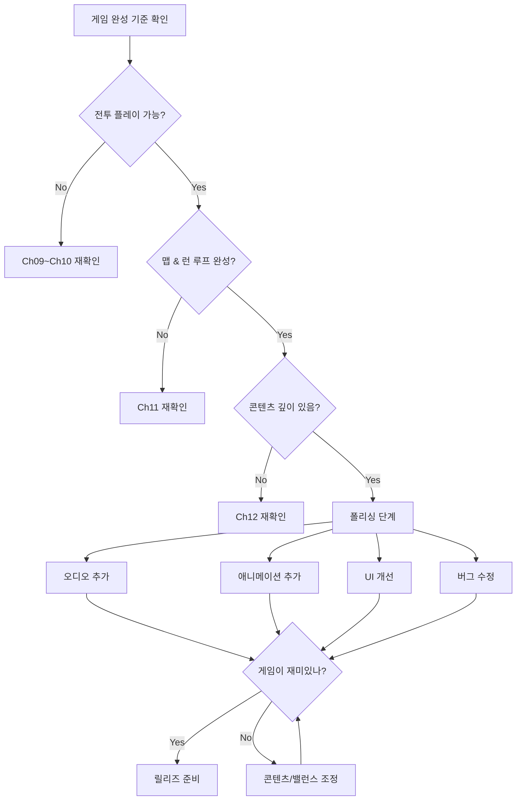

# Ch13. 오디오 & 폴리싱

> 📌 **핵심 요약**
> libGDX 오디오 API로 효과음·BGM을 추가하고, Scene2D Actions로 카드 플레이 애니메이션과 데미지 숫자 팝업을 구현하며, 시드 기반 랜덤으로 재현 가능한 런을 완성해 게임의 "느낌"을 완성한다.

---

## 🎯 학습 목표

1. libGDX의 `Sound`와 `Music` API의 차이를 이해하고 올바르게 사용한다
2. Scene2D `Actions`를 조합해 카드 플레이·데미지 팝업·화면 전환 애니메이션을 구현한다
3. `GameRandom`으로 모든 랜덤을 시드 기반으로 관리해 런 재현성을 확보한다
4. `Interpolation` 종류별 시각적 차이를 이해하고 적절한 애니메이션에 적용한다
5. 프로젝트 전체 패키지 구조를 최종 정리하고 폴리싱 체크리스트를 완료한다

---

## 1. libGDX 오디오 — Sound vs Music

libGDX는 오디오를 두 가지 방식으로 처리한다. 선택 기준은 **파일 길이와 사용 패턴**이다.

| 항목 | Sound | Music |
|------|-------|-------|
| 용도 | 짧은 효과음 (0.1~3초) | 긴 BGM (스트리밍) |
| 메모리 | 전체를 RAM에 로드 | 스트리밍 (일부만 버퍼) |
| 동시 재생 | 여러 인스턴스 동시 가능 | 인스턴스 1개 |
| 루프 | 가능 (드물게 사용) | 루프 권장 |
| 파일 크기 제한 | 1MB 미만 권장 | 제한 없음 |
| 인터페이스 | `Sound` | `Music` |

```java
// 효과음 로드 & 재생 (AssetManager 활용)
Sound hitSound    = Gdx.audio.newSound(Gdx.files.internal("audio/sfx/hit.ogg"));
Sound blockSound  = Gdx.audio.newSound(Gdx.files.internal("audio/sfx/block.ogg"));
Sound cardFlip    = Gdx.audio.newSound(Gdx.files.internal("audio/sfx/card_flip.ogg"));
Sound cardPlay    = Gdx.audio.newSound(Gdx.files.internal("audio/sfx/card_play.ogg"));

// 재생 (long = soundId, 볼륨/피치 제어 가능)
long id = hitSound.play(0.8f); // volume 0.8
hitSound.setPitch(id, 1.2f);   // 피치 변조 (조금 더 높게)

// BGM 로드 & 재생
Music battleBgm = Gdx.audio.newMusic(Gdx.files.internal("audio/bgm/battle.ogg"));
battleBgm.setLooping(true);
battleBgm.setVolume(0.5f);
battleBgm.play();

// 화면 전환 시 BGM 교체
void switchBgm(Music newBgm) {
    if (currentBgm != null && currentBgm.isPlaying()) {
        currentBgm.stop();
    }
    currentBgm = newBgm;
    currentBgm.setLooping(true);
    currentBgm.play();
}
```

### 1.1 오디오 에셋 목록

| 파일 | 타입 | 용도 |
|------|------|------|
| `audio/bgm/menu.ogg` | Music | 메인 메뉴 BGM |
| `audio/bgm/battle.ogg` | Music | 전투 BGM |
| `audio/bgm/map.ogg` | Music | 맵 화면 BGM |
| `audio/bgm/boss.ogg` | Music | 보스 전투 BGM |
| `audio/sfx/card_play.ogg` | Sound | 카드 플레이 |
| `audio/sfx/card_draw.ogg` | Sound | 카드 드로우 |
| `audio/sfx/hit.ogg` | Sound | 공격 피격 |
| `audio/sfx/block.ogg` | Sound | 블록 획득 |
| `audio/sfx/death.ogg` | Sound | 몬스터 처치 |
| `audio/sfx/potion.ogg` | Sound | 포션 사용 |
| `audio/sfx/relic.ogg` | Sound | 렐릭 획득 |
| `audio/sfx/button_click.ogg` | Sound | UI 버튼 클릭 |

> **에셋 출처**: STS 원본 게임의 오디오는 저작권이 있다. 학습 프로젝트에서는 [OpenGameArt.org](https://opengameart.org/) 또는 [Freesound.org](https://freesound.org/)의 CC0/CC-BY 라이선스 에셋을 사용할 것.

---

## 2. SoundManager — 중앙 오디오 관리

```java
// core/audio/SoundManager.java
public class SoundManager implements Disposable {
    private static SoundManager instance;

    private final Map<String, Sound> sounds = new HashMap<>();
    private final Map<String, Music> musics = new HashMap<>();
    private Music currentBgm;

    private float masterVolume = 1.0f;
    private float sfxVolume = 0.8f;
    private float bgmVolume = 0.5f;
    private boolean muted = false;

    public static SoundManager getInstance() {
        if (instance == null) instance = new SoundManager();
        return instance;
    }

    public void loadAssets(AssetManager assetManager) {
        // AssetManager를 통한 비동기 로드 (Ch05 연계)
        assetManager.load("audio/sfx/hit.ogg", Sound.class);
        assetManager.load("audio/sfx/card_play.ogg", Sound.class);
        assetManager.load("audio/bgm/battle.ogg", Music.class);
        // ...
    }

    public void playSound(String key) {
        if (muted) return;
        Sound sound = sounds.get(key);
        if (sound != null) {
            sound.play(sfxVolume * masterVolume);
        }
    }

    public void playSoundWithPitch(String key, float pitch) {
        if (muted) return;
        Sound sound = sounds.get(key);
        if (sound != null) {
            long id = sound.play(sfxVolume * masterVolume);
            sound.setPitch(id, pitch);
        }
    }

    public void playBgm(String key) {
        if (currentBgm != null) {
            currentBgm.stop();
        }
        currentBgm = musics.get(key);
        if (currentBgm != null && !muted) {
            currentBgm.setLooping(true);
            currentBgm.setVolume(bgmVolume * masterVolume);
            currentBgm.play();
        }
    }

    public void setMasterVolume(float volume) {
        this.masterVolume = MathUtils.clamp(volume, 0f, 1f);
        if (currentBgm != null) {
            currentBgm.setVolume(bgmVolume * masterVolume);
        }
    }

    @Override
    public void dispose() {
        sounds.values().forEach(Sound::dispose);
        musics.values().forEach(Music::dispose);
    }
}
```

---

## 3. 카드 플레이 애니메이션 — Scene2D Actions

Scene2D의 `Actions`는 Actor에 적용하는 **시간 기반 변환**이다. `sequence`(순차)와 `parallel`(동시)을 조합해 복잡한 애니메이션을 만든다.

```java
// 카드를 핸드에서 화면 중앙으로 이동 후 페이드아웃
public void animateCardPlay(CardActor cardActor, float targetX, float targetY) {
    SoundManager.getInstance().playSound("card_play");

    cardActor.addAction(Actions.sequence(
        // 1. 핸드에서 중앙으로 이동하면서 크기 축소 (0.25초)
        Actions.parallel(
            Actions.moveTo(targetX, targetY, 0.25f, Interpolation.fastSlow),
            Actions.scaleTo(0.6f, 0.6f, 0.25f, Interpolation.fastSlow)
        ),
        // 2. 잠깐 멈춤 (0.05초)
        Actions.delay(0.05f),
        // 3. 페이드아웃과 함께 더 작아짐 (0.15초)
        Actions.parallel(
            Actions.fadeOut(0.15f, Interpolation.fade),
            Actions.scaleTo(0.3f, 0.3f, 0.15f)
        ),
        // 4. Actor 제거
        Actions.removeActor()
    ));
}
```

```java
// 카드 드로우 애니메이션 (DrawPile 위치에서 핸드로)
public void animateCardDraw(CardActor cardActor, float handX, float handY) {
    SoundManager.getInstance().playSound("card_draw");

    // DrawPile 위치 (화면 우하단)
    float drawPileX = Gdx.graphics.getWidth() - 120f;
    float drawPileY = 30f;

    cardActor.setPosition(drawPileX, drawPileY);
    cardActor.setScale(0.3f);
    cardActor.getColor().a = 0f; // 처음에 투명

    cardActor.addAction(Actions.parallel(
        Actions.moveTo(handX, handY, 0.3f, Interpolation.swingOut),
        Actions.scaleTo(1.0f, 1.0f, 0.3f),
        Actions.fadeIn(0.2f)
    ));
}
```

---

## 4. 데미지 숫자 팝업

```java
// view/ui/DamagePopup.java
public class DamagePopup {
    public static void show(Stage stage, Skin skin, int damage,
                            float x, float y, boolean isPlayerDamage) {
        String text = "-" + damage;
        String styleName = isPlayerDamage ? "damage-player" : "damage-enemy";

        Label label = new Label(text, skin, styleName);
        label.setFontScale(1.5f);
        label.setPosition(x - label.getPrefWidth() / 2f, y);
        stage.addActor(label);

        // 위로 떠오르며 페이드아웃
        label.addAction(Actions.sequence(
            Actions.parallel(
                Actions.moveBy(0, 60f, 0.9f, Interpolation.pow2Out),
                Actions.sequence(
                    Actions.delay(0.4f),   // 0.4초 유지
                    Actions.fadeOut(0.5f, Interpolation.fade)
                )
            ),
            Actions.removeActor()
        ));

        // 효과음
        SoundManager.getInstance().playSound("hit");
    }

    // 블록 팝업 (파란색)
    public static void showBlock(Stage stage, Skin skin, int block, float x, float y) {
        Label label = new Label("🛡 " + block, skin, "block-popup");
        label.setPosition(x, y);
        stage.addActor(label);

        label.addAction(Actions.sequence(
            Actions.parallel(
                Actions.moveBy(0, 40f, 0.6f, Interpolation.pow2Out),
                Actions.fadeOut(0.6f)
            ),
            Actions.removeActor()
        ));
    }
}
```

---

## 5. Interpolation — 움직임의 "느낌"

`Interpolation`은 0→1 사이의 진행도를 비선형으로 변환해 자연스러운 움직임을 만든다.

| Interpolation | 특징 | 적합한 용도 |
|--------------|------|------------|
| `linear` | 일정 속도 | 프로그레스 바 |
| `fastSlow` | 빠르게 시작, 천천히 끝 | 카드 이동 (손 → 타겟) |
| `slowFast` | 천천히 시작, 빠르게 끝 | 중력 낙하 효과 |
| `bounce` | 목표에서 튕김 | 카드 핸드 도착 |
| `swingOut` | 약간 오버슈팅 후 정착 | 카드 드로우 |
| `elastic` | 스프링처럼 튕김 | 팝업 등장 |
| `pow2Out` | 부드럽게 감속 | 숫자 팝업 상승 |
| `fade` | `pow2` 양방향 | 페이드인/아웃 |
| `circle` | 원호 형태 가속/감속 | 부드러운 UI 전환 |

```java
// Interpolation 시각적 비교 코드 (디버그용)
// render() 안에서 확인
shapeRenderer.begin(ShapeRenderer.ShapeType.Line);
float[] interps = {0, 0.1f, 0.2f, ..., 1.0f};
for (int i = 0; i < interps.length - 1; i++) {
    float x1 = i * 10f;
    float x2 = (i+1) * 10f;
    // linear: y = t
    shapeRenderer.line(x1, Interpolation.linear.apply(interps[i]) * 100,
                       x2, Interpolation.linear.apply(interps[i+1]) * 100);
    // fastSlow: 위로
    shapeRenderer.line(x1, Interpolation.fastSlow.apply(interps[i]) * 100 + 110,
                       x2, Interpolation.fastSlow.apply(interps[i+1]) * 100 + 110);
}
shapeRenderer.end();
```

---

## 6. 화면 전환 — 페이드 인/아웃

```java
// view/transitions/FadeTransition.java
public class FadeTransition extends Actor {
    private boolean isFadingIn;
    private Runnable onComplete;

    public static void fadeOut(Stage stage, float duration, Runnable onComplete) {
        // 검은 오버레이를 투명→불투명으로
        Image overlay = new Image(new Texture(createBlackPixmap()));
        overlay.setFillParent(true);
        overlay.getColor().a = 0f;
        stage.addActor(overlay);

        overlay.addAction(Actions.sequence(
            Actions.fadeIn(duration, Interpolation.fade),
            Actions.run(onComplete)
        ));
    }

    public static void fadeIn(Stage stage, float duration) {
        // 검은 오버레이를 불투명→투명으로 (새 화면 등장 시)
        Image overlay = new Image(new Texture(createBlackPixmap()));
        overlay.setFillParent(true);
        stage.addActor(overlay);

        overlay.addAction(Actions.sequence(
            Actions.fadeOut(duration, Interpolation.fade),
            Actions.removeActor()
        ));
    }

    // 화면 전환 콤보: 페이드아웃 → 화면 전환 → 페이드인
    public static void crossFade(Stage currentStage, Runnable changeScreen,
                                  Stage nextStage, float duration) {
        fadeOut(currentStage, duration / 2, () -> {
            changeScreen.run();
            fadeIn(nextStage, duration / 2);
        });
    }

    private static Pixmap createBlackPixmap() {
        Pixmap pixmap = new Pixmap(1, 1, Pixmap.Format.RGBA8888);
        pixmap.setColor(Color.BLACK);
        pixmap.fill();
        return pixmap;
    }
}
```

---

## 7. 시드 기반 랜덤 — GameRandom

STS의 모든 랜덤(맵 생성, 몬스터 AI, 카드 보상, 이벤트)은 시드 하나에서 결정론적으로 생성된다. 이것이 스피드런 카테고리, 버그 재현, 공정한 도전 비교를 가능하게 한다.

```java
// model/random/GameRandom.java
public class GameRandom {
    private final Random random;
    private final long seed;
    private long callCount = 0; // 디버깅: 몇 번째 랜덤 호출인지 추적

    public GameRandom(long seed) {
        this.seed = seed;
        this.random = new Random(seed);
    }

    public int nextInt(int bound) {
        callCount++;
        return random.nextInt(bound);
    }

    public float nextFloat() {
        callCount++;
        return random.nextFloat();
    }

    public boolean nextBoolean() {
        callCount++;
        return random.nextBoolean();
    }

    public <T> void shuffle(List<T> list) {
        // Fisher-Yates 셔플 — Random 인스턴스를 직접 사용
        for (int i = list.size() - 1; i > 0; i--) {
            int j = nextInt(i + 1);
            T tmp = list.get(i);
            list.set(i, list.get(j));
            list.set(j, tmp);
        }
    }

    public <T> T randomElement(List<T> list) {
        return list.get(nextInt(list.size()));
    }

    public long getSeed() { return seed; }
    public long getCallCount() { return callCount; }
}
```

```java
// RunState에서 GameRandom 사용
public class RunState {
    public final long seed;
    public final GameRandom mapRng;    // 맵 생성용
    public final GameRandom combatRng; // 전투 랜덤용 (몬스터 AI, 카드 드로우)
    public final GameRandom rewardRng; // 보상 카드 선택용
    public final GameRandom eventRng;  // 이벤트 선택용

    public RunState(long seed) {
        this.seed = seed;
        // 같은 시드에서 파생된 다른 RNG 스트림 (STS 원작 방식)
        this.mapRng    = new GameRandom(seed);
        this.combatRng = new GameRandom(seed + 1);
        this.rewardRng = new GameRandom(seed + 2);
        this.eventRng  = new GameRandom(seed + 3);
    }
}
```

**시드 기반 랜덤의 중요성:**
- **스피드런**: 같은 시드면 같은 맵, 같은 보상 → 경쟁 공정성 확보
- **버그 재현**: "시드 12345의 3층에서 발생한 버그" → 완벽 재현 가능
- **데일리 챌린지**: 하루에 하나의 시드를 모든 플레이어가 공유

---

## 8. 파티클 효과 — libGDX ParticleEffect

```java
// view/effects/ParticleManager.java
public class ParticleManager implements Disposable {
    private final Map<String, ParticleEffect> templates = new HashMap<>();
    private final List<ParticleEffect> active = new ArrayList<>();
    private final SpriteBatch batch;

    public void loadParticles() {
        // .p 파일: libGDX Particle Editor로 생성
        ParticleEffect fire = new ParticleEffect();
        fire.load(Gdx.files.internal("particles/fire.p"),
                  Gdx.files.internal("particles/"));
        templates.put("fire", fire);

        ParticleEffect poison = new ParticleEffect();
        poison.load(Gdx.files.internal("particles/poison.p"),
                    Gdx.files.internal("particles/"));
        templates.put("poison", poison);
    }

    // 파티클 재생 (이펙트 복사본 생성)
    public void spawnEffect(String key, float x, float y) {
        ParticleEffect template = templates.get(key);
        if (template == null) return;

        ParticleEffect effect = new ParticleEffect(template); // 복사본
        effect.setPosition(x, y);
        effect.start();
        active.add(effect);
    }

    public void update(float delta) {
        active.removeIf(e -> {
            e.update(delta);
            return e.isComplete();
        });
    }

    public void render() {
        batch.begin();
        active.forEach(e -> e.draw(batch));
        batch.end();
    }

    @Override
    public void dispose() {
        templates.values().forEach(ParticleEffect::dispose);
    }
}
```

---

## 9. 최종 프로젝트 패키지 구조

```
core/src/main/java/com/yourdomain/sts/
├── Main.java                    # ApplicationAdapter (진입점)
├── audio/
│   └── SoundManager.java
├── model/                       # 순수 Java — libGDX 의존 없음
│   ├── cards/
│   │   ├── AbstractCard.java
│   │   ├── CardType.java
│   │   └── colorless/           # Strike, Defend, Bash ...
│   ├── monsters/
│   │   ├── AbstractMonster.java
│   │   ├── Intent.java
│   │   ├── JawWorm.java
│   │   └── boss/SlimeBoss.java
│   ├── buffs/
│   │   ├── AbstractBuff.java
│   │   └── StrengthBuff.java ...
│   ├── relics/
│   │   ├── AbstractRelic.java
│   │   └── common/BurningBlood.java ...
│   ├── potions/
│   │   ├── AbstractPotion.java
│   │   └── FirePotion.java ...
│   ├── actions/
│   │   ├── AbstractAction.java
│   │   ├── ActionQueue.java
│   │   └── DamageAction.java ...
│   ├── map/
│   │   ├── MapNode.java
│   │   ├── NodeType.java
│   │   └── DungeonMap.java
│   ├── events/
│   │   ├── GameEvent.java
│   │   ├── EventChoice.java
│   │   └── BigFishEvent.java ...
│   ├── random/
│   │   └── GameRandom.java
│   ├── CombatState.java
│   ├── RunState.java
│   ├── AbstractCreature.java
│   └── Player.java
├── screens/                     # libGDX Screen 구현
│   ├── MainMenuScreen.java
│   ├── MapScreen.java
│   ├── CombatScreen.java
│   ├── CardRewardScreen.java
│   ├── ShopScreen.java
│   ├── RestScreen.java
│   ├── EventScreen.java
│   └── GameOverScreen.java
├── view/                        # 렌더링 컴포넌트
│   ├── actors/
│   │   ├── CardActor.java
│   │   ├── MonsterActor.java
│   │   └── RelicActor.java
│   ├── ui/
│   │   ├── DamagePopup.java
│   │   ├── EnergyOrb.java
│   │   ├── HealthBar.java
│   │   └── IntentIcon.java
│   ├── effects/
│   │   └── ParticleManager.java
│   └── transitions/
│       └── FadeTransition.java
└── assets/                      # (android/assets/ 링크)
    ├── audio/bgm/
    ├── audio/sfx/
    ├── images/cards/
    ├── images/monsters/
    ├── images/ui/
    ├── particles/
    └── skin/
        ├── uiskin.json
        └── uiskin.atlas
```

---

## 10. 폴리싱 체크리스트 플로우



### 폴리싱 우선순위

1. **필수** (없으면 게임처럼 느껴지지 않음)
   - 카드 플레이 시 효과음
   - 피격 효과음 & 데미지 숫자
   - 전투 BGM
   - 화면 전환 페이드

2. **권장** (퀄리티를 크게 높임)
   - 카드 드로우 애니메이션
   - 블록/힐 숫자 팝업
   - 렐릭 획득 효과음
   - 맵 노드 이동 애니메이션

3. **선택** (여유 있을 때)
   - 파티클 효과 (불꽃, 독)
   - BGM 크로스페이드
   - 카드 호버 확대 애니메이션
   - 승리/패배 연출

---

## 11. 메모리 관리 & Disposable

libGDX에서 OpenGL 자원(Texture, Sound, Music 등)은 **명시적으로 해제**해야 한다.

```java
// 모든 Screen에서 dispose() 구현
public class CombatScreen implements Screen {
    private Stage stage;
    private Skin skin;
    // Sound는 SoundManager가 관리 (여기서 dispose 안 함)

    @Override
    public void dispose() {
        stage.dispose();
        // skin은 AssetManager가 관리하면 여기서 dispose 안 함
    }
}

// Main.java — 앱 종료 시 전체 해제
public class Main extends ApplicationAdapter {
    @Override
    public void dispose() {
        SoundManager.getInstance().dispose();
        assetManager.dispose();
        currentScreen.dispose();
    }
}
```

---

## 정리

- **Sound**는 짧은 효과음(RAM 로드), **Music**은 BGM(스트리밍). 혼동하면 메모리 문제나 레이턴시 발생
- **Scene2D Actions**의 `sequence` + `parallel` 조합으로 복잡한 애니메이션을 선언적으로 표현한다
- **Interpolation** 선택이 게임의 "느낌"을 결정한다. `fastSlow`(카드 이동), `swingOut`(드로우), `bounce`(도착)
- **GameRandom**으로 모든 랜덤을 시드에서 파생시키면 런 재현성과 스피드런 공정성이 확보된다
- **폴리싱 우선순위**: 효과음 > 데미지 팝업 > BGM > 화면 전환 > 파티클

---

## 🔍 심화 학습

### 추천 자료

| 자료 | 내용 | 링크 |
|------|------|------|
| libGDX 공식 — Audio | Sound/Music API 상세 | https://libgdx.com/wiki/audio/sound-effects-and-music |
| libGDX 공식 — Particle Effects | ParticleEditor 사용법 | https://libgdx.com/wiki/2d/particle-effects |
| Scene2D Actions 문서 | Actions 종류 목록 | https://libgdx.com/wiki/graphics/2d/scene2d/scene2d#actions |
| Freesound.org | CC0 효과음 리소스 | https://freesound.org |
| OpenGameArt.org | CC0/CC-BY 게임 에셋 | https://opengameart.org |
| STS Seed Finder | 시드 기반 런 분석 | https://www.spirescan.org |

### TODO 실습 과제

1. `SoundManager.playSoundWithPitch()`를 활용해 카드 드로우 시마다 피치를 살짝 변조하라. (0.9f ~ 1.1f 랜덤 — 힌트: `GameRandom.nextFloat() * 0.2f + 0.9f`)
2. 데미지 팝업이 동시에 여러 개 표시될 때(Thunderclap 전체 공격) 서로 겹치지 않도록 Y 오프셋을 적용하라
3. `GameRandom` 클래스를 작성하고, 같은 시드로 생성한 두 인스턴스가 동일한 수열을 생성하는지 JUnit으로 검증하라
4. `FadeTransition.crossFade()`를 MapScreen → CombatScreen 전환에 적용하라
5. libGDX Particle Editor로 간단한 파티클 효과(.p 파일)를 직접 만들고 게임에 적용하라 (힌트: Tools → Particle Editor in libGDX setup)

---

## ✅ 체크리스트

### 오디오
- [ ] `SoundManager` 싱글톤 구현
- [ ] 효과음 로드 (카드 플레이, 피격, 블록, 드로우)
- [ ] BGM 로드 (전투, 맵, 메뉴, 보스)
- [ ] 화면별 BGM 전환 구현
- [ ] 볼륨 조절 옵션 (설정 화면)
- [ ] `dispose()` 메모리 해제 확인

### 애니메이션
- [ ] 카드 플레이 애니메이션 (핸드 → 중앙 → 페이드아웃)
- [ ] 카드 드로우 애니메이션 (DrawPile → 핸드)
- [ ] 데미지 숫자 팝업 (위로 떠오르며 사라짐)
- [ ] 블록 획득 팝업
- [ ] 몬스터 피격 시 흔들림 (moveBy 좌우 반복)
- [ ] 화면 전환 페이드 인/아웃

### 시드 기반 랜덤
- [ ] `GameRandom` 클래스 구현
- [ ] RunState에서 목적별 RNG 분리 (mapRng, combatRng 등)
- [ ] 메인 메뉴 시드 입력 UI (또는 랜덤 시드 생성)
- [ ] 시드 표시 (화면 어딘가에 현재 시드 표시)
- [ ] 동일 시드 재현 테스트

### 파티클 & 이펙트
- [ ] `ParticleManager` 구현
- [ ] 독 파티클 효과 (Poison 버프 적용 시)
- [ ] 불꽃 파티클 (Fire Potion 사용 시)
- [ ] 카드 드로우 시 작은 파티클

### 최종 프로젝트 정리
- [ ] 패키지 구조 정리 (model/view/screens 분리)
- [ ] 사용하지 않는 import 제거
- [ ] 하드코딩된 상수를 Constants 클래스로 이동
- [ ] README.md 작성 (빌드 방법, 조작법, 시드 입력 방법)
- [ ] 메모리 누수 확인 (VisualVM 또는 `-verbose:gc`)

---

## 📚 참고 자료

- [libGDX — Audio](https://libgdx.com/wiki/audio/sound-effects-and-music)
- [libGDX — Particle Effects](https://libgdx.com/wiki/2d/particle-effects)
- [libGDX — Actions](https://libgdx.com/wiki/graphics/2d/scene2d/scene2d#actions)
- [libGDX — Memory Management](https://libgdx.com/wiki/managing-your-assets)
- [Freesound.org — CC0 SFX](https://freesound.org)
- [OpenGameArt.org — Game Assets](https://opengameart.org)
- [STS BaseMod — Source Reference](https://github.com/daviscook477/BaseMod)
