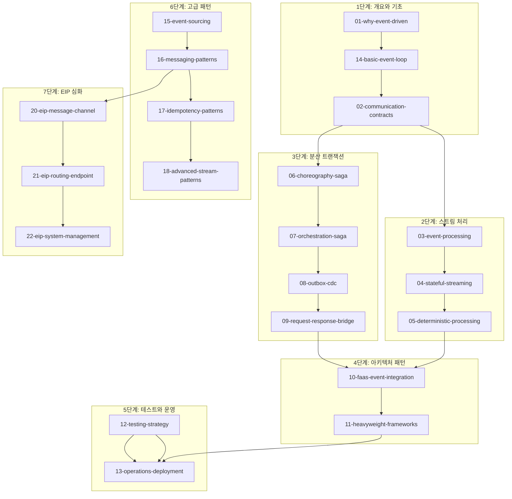

# 01. Event-Driven Architecture (EDA) 실습

이벤트 기반 아키텍처의 핵심 패턴을 Spring Boot + Redpanda로 구현하는 22개 PoC 실습

> **이론 문서**: `runners-high/docs/02_Architecture/03_EventDriven/` (17개 챕터)
> **실습 코드**: `runners-high/poc/08_MessageQueue/red-panda/project/redpanda-spring-boot/` (기존 인프라 재활용)

---

## 학습 목표

- EDA 핵심 패턴(Saga, Outbox, CDC, Request-Response Bridge 등)을 직접 구현하여 이해한다
- 이벤트 스트림 처리(Stateless/Stateful/Deterministic)의 차이와 적용 시나리오를 파악한다
- FaaS, Heavyweight Framework 등 다양한 이벤트 처리 방식을 비교한다
- 이벤트 기반 시스템의 테스트 전략과 운영/배포 방법을 학습한다

---

## 기술 스택

| 기술 | 버전 | 용도 |
|------|------|------|
| **Spring Boot** | 3.3.x | 애플리케이션 프레임워크 |
| **Redpanda** | v25.3.6 | 메시지 브로커 (Kafka API 호환) |
| **Apache Avro** | 1.11.3 | 스키마 기반 직렬화 |
| **spring-kafka** | 3.2.x | Producer/Consumer, Listener |
| **Kafka Streams** | 3.7.x | 스트림 처리 (03, 04, 05번) |
| **Debezium** | 2.7.x | CDC (08번) |
| **Apache Flink** | 1.18.x | 헤비웨이트 스트림 처리 (11번) |
| **Testcontainers** | 1.20.x | 통합 테스트 |
| **PostgreSQL** | 16 | Outbox, CDC 실습 |
| **Docker Compose** | v2 | 로컬 인프라 |

---

## 챕터 구성

| # | 파일 | 이론 매핑 | 설명 |
|---|------|----------|------|
| 01 | [01-why-event-driven.md](learning/01-why-event-driven.md) | Ch.01-02 | EDA 필요성, 핵심 개념 (개요) |
| 02 | [02-communication-contracts.md](learning/02-communication-contracts.md) | Ch.03 | Avro 스키마 진화, 호환성 모드 |
| 03 | [03-event-processing.md](learning/03-event-processing.md) | Ch.05 | Kafka Streams Filter, Map, Branch |
| 04 | [04-stateful-streaming.md](learning/04-stateful-streaming.md) | Ch.06-07 | 윈도우 집계, KTable, State Store |
| 05 | [05-deterministic-processing.md](learning/05-deterministic-processing.md) | Ch.06 | Event Time, 워터마크, 재처리 |
| 06 | [06-choreography-saga.md](learning/06-choreography-saga.md) | Ch.08 | 이벤트 체이닝 분산 트랜잭션 |
| 07 | [07-orchestration-saga.md](learning/07-orchestration-saga.md) | Ch.08 | 중앙 조정자 기반 SAGA |
| 08 | [08-outbox-cdc.md](learning/08-outbox-cdc.md) | Ch.04 | Transactional Outbox + Debezium CDC |
| 09 | [09-request-response-bridge.md](learning/09-request-response-bridge.md) | Ch.13 | ReplyingKafkaTemplate 브릿지 |
| 10 | [10-faas-event-integration.md](learning/10-faas-event-integration.md) | Ch.09 | Spring Cloud Function 서버리스 패턴 |
| 11 | [11-heavyweight-frameworks.md](learning/11-heavyweight-frameworks.md) | Ch.11 | Apache Flink 실시간 이상 탐지 |
| 12 | [12-testing-strategy.md](learning/12-testing-strategy.md) | Ch.15 | Testcontainers, 계약 테스트 |
| 13 | [13-operations-deployment.md](learning/13-operations-deployment.md) | Ch.16 | rpk CLI, 모니터링, 배포 전략 |
| 14 | [14-basic-event-loop.md](learning/14-basic-event-loop.md) | Ch.01-02 | Consumer → Process → Producer 기본 루프 |
| 15 | [15-event-sourcing.md](learning/15-event-sourcing.md) | Ch.10 | Event Sourcing, CQRS, Snapshot |
| 16 | [16-messaging-patterns.md](learning/16-messaging-patterns.md) | - | EIP 패턴 (Claim Check, Router, Splitter, Translator) |
| 17 | [17-idempotency-patterns.md](learning/17-idempotency-patterns.md) | - | 멱등성 패턴 (Idempotent Reader/Writer, Schema-on-Read) |
| 18 | [18-advanced-stream-patterns.md](learning/18-advanced-stream-patterns.md) | - | 고급 스트림 처리 (Event Time, Suppress, Merger, State Table) |
| 20 | [20-eip-message-channel.md](learning/20-eip-message-channel.md) | Ch.17 확장 | EIP 메시지 구조(Command/Document/Event) & 채널 패턴 (Kafka 매핑) |
| 21 | [21-eip-routing-endpoint.md](learning/21-eip-routing-endpoint.md) | Ch.17 확장 | EIP 고급 라우팅(Recipient List, Routing Slip) & 엔드포인트 패턴 |
| 22 | [22-eip-system-management.md](learning/22-eip-system-management.md) | Ch.17 확장 | EIP 시스템 관리(Wire Tap, Control Bus, Message History) |

---

## 이론 → PoC 매핑

| 이론 챕터 | PoC | 핵심 실습 |
|----------|-----|----------|
| Ch.01 이벤트 기반 필요성 | 01-why-event-driven | 개요 (이론 중심) |
| Ch.02 마이크로서비스 기초 | 01-why-event-driven, 14-basic-event-loop | 이벤트 루프, 오프셋 관리 |
| Ch.03 통신과 데이터 계약 | 02-communication-contracts | Avro 스키마 호환성 검증 |
| Ch.04 기존 시스템 통합 | 08-outbox-cdc | Debezium CDC, Dual Write 해결 |
| Ch.05 이벤트 기반 처리 기초 | 03-event-processing | Filter/Map/Branch 변환 |
| Ch.06 결정적 스트림 처리 | 05-deterministic-processing | 워터마크, Grace Period, 재처리 |
| Ch.07 상태 기반 스트리밍 | 04-stateful-streaming | Tumbling Window 집계, KTable |
| Ch.08 워크플로우 구축 | 06-choreography-saga, 07-orchestration-saga | SAGA 패턴 비교 |
| Ch.09 FaaS 기반 마이크로서비스 | 10-faas-event-integration | Cold Start, 함수 합성, DLQ |
| Ch.11 헤비웨이트 프레임워크 | 11-heavyweight-frameworks | Flink DataStream, SQL, CDC |
| Ch.13 동기-비동기 통합 | 09-request-response-bridge | Correlation ID, 타임아웃 |
| Ch.15 테스트 | 12-testing-strategy | RedpandaContainer, 토폴로지 테스트 |
| Ch.16 배포 | 13-operations-deployment | Rolling Update, Blue-Green |

> **Redpanda-specific 실습** (WASM, Connect, Iceberg)은 `poc/08_MessageQueue/red-panda/learning/05-event-driven-poc/`에서 다룹니다.

---

## 학습 순서



### 학습 경로 설명

#### 1단계: 개요와 기초 (01, 14, 02)
EDA의 필요성을 이해한 후 기본 이벤트 루프를 구현하고, 스키마 관리를 학습합니다.

#### 2단계: 스트림 처리 (03, 04, 05)
Kafka Streams로 무상태 변환부터 상태 관리, 결정적 처리까지 순서대로 진행합니다.

#### 3단계: 분산 트랜잭션 (06, 07, 08, 09)
Choreography → Orchestration → Outbox/CDC → Request-Response 순서로 마이크로서비스 워크플로우 패턴을 학습합니다.

#### 4단계: 아키텍처 패턴 (10, 11)
서버리스(FaaS)와 헤비웨이트 프레임워크(Flink) 접근법을 비교합니다.

#### 5단계: 테스트와 운영 (12, 13)
전체 실습을 마친 후 테스트 전략과 프로덕션 운영 방법을 종합합니다.

#### 6단계: 고급 패턴 (15, 16, 17, 18)
Event Sourcing/CQRS, EIP 메시징 패턴, 멱등성, 고급 스트림 처리(Event Time, Suppress, State Table) 등 심화 패턴을 학습합니다.

#### 7단계: EIP 심화 (20, 21, 22)
Ch17(messaging-patterns)에서 다룬 EIP 기초 8패턴을 확장하여 EIP 61패턴 전체를 커버합니다. 메시지 구조와 채널 패턴(20) → 고급 라우팅과 엔드포인트(21) → 시스템 관리와 관측성(22) 순서로 진행합니다.

---

## Practice 프로젝트

기존 Redpanda Spring Boot 프로젝트를 재활용합니다.

```
# 기존 인프라 경로
poc/08_MessageQueue/red-panda/project/redpanda-spring-boot/

# 포함된 공통 인프라
├── docker-compose.yml      # Redpanda v25.3.6 + Console v3.5.1
├── build.gradle            # Spring Kafka + Avro 의존성
└── src/test/.../AbstractKafkaTest  # Testcontainers 기본 설정
```

### 실습 환경 실행

```bash
# 1. Redpanda + Console 실행
cd poc/08_MessageQueue/red-panda/project
docker-compose up -d

# 2. Console 확인
open http://localhost:8080

# 3. Spring Boot 빌드 & 테스트
cd redpanda-spring-boot
./gradlew build
./gradlew test
```

---

## 관련 프로젝트

| 프로젝트 | 위치 | 설명 |
|---------|------|------|
| **Redpanda 학습** | `poc/08_MessageQueue/red-panda/` | 브로커 설정, 기본 개념, Spring Boot 통합 |
| **Redpanda-specific EDA** | `poc/08_MessageQueue/red-panda/learning/05-event-driven-poc/` | WASM, Connect, Iceberg (3챕터) |
| **EDA 이론** | `docs/02_Architecture/03_EventDriven/` | 17개 챕터 이론 문서 |

---

## 참고 자료

- [Apache Kafka Documentation](https://kafka.apache.org/documentation/)
- [Redpanda Documentation](https://docs.redpanda.com)
- [Kafka Streams Documentation](https://kafka.apache.org/documentation/streams/)
- [Debezium Documentation](https://debezium.io/documentation/)
- *Building Event-Driven Microservices* by Adam Bellemare (O'Reilly)
