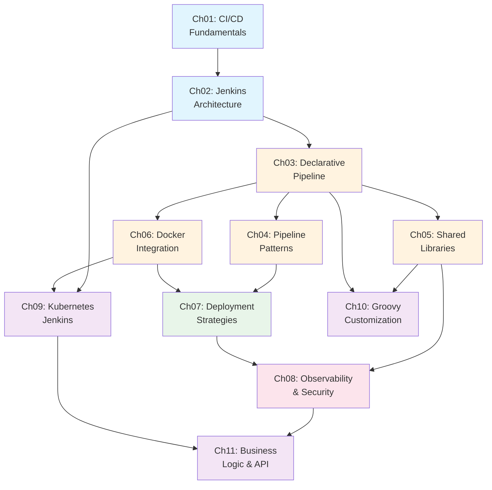

# 01-jenkins: CI/CD 파이프라인 실습

## 프로젝트 개요

Jenkins를 통해 CI/CD 파이프라인을 설계하고 운영하는 방법을 학습합니다. 단순히 파이프라인을 "돌려보는" 수준이 아니라, Pipeline as Code 원칙에 따라 재현 가능하고 유지보수 가능한 파이프라인을 구축하는 것이 목표입니다. Docker 기반 환경에서 빌드부터 배포까지 전체 흐름을 직접 경험합니다.

## 학습 목표

이 프로젝트를 완료하면 다음을 면접에서 자신있게 설명할 수 있어야 합니다:

1. **CI/CD 파이프라인 설계**: 빌드-테스트-배포 단계를 왜 분리하는지, 각 단계의 역할과 실패 시 대응 전략을 설명할 수 있다
2. **Pipeline as Code**: Jenkinsfile로 파이프라인을 코드로 관리하는 이유와 Declarative vs Scripted 차이를 설명할 수 있다
3. **Docker 통합 빌드**: Jenkins에서 Docker를 활용한 빌드 환경 격리와 멀티스테이지 빌드 전략을 구현할 수 있다
4. **Shared Library 설계**: 공통 파이프라인 로직을 라이브러리로 추출하여 여러 프로젝트에서 재사용하는 패턴을 적용할 수 있다
5. **Jenkins 보안 모델**: 인증/인가 구조, Credentials 관리, 에이전트 격리 전략을 설명할 수 있다
6. **모니터링과 트러블슈팅**: 파이프라인 실패 원인을 체계적으로 분석하고, Prometheus 메트릭으로 Jenkins 상태를 모니터링할 수 있다

## 전제 조건

| 항목 | 최소 버전 | 확인 명령어 |
|------|----------|------------|
| Docker | 24.0+ | `docker --version` |
| Docker Compose | 2.20+ | `docker compose version` |
| Git | 2.40+ | `git --version` |

## 커리큘럼

| Ch | 주제 | 학습 시간 | 핵심 질문 | 상태 |
|----|------|----------|----------|------|
| 01 | [CI/CD Fundamentals](./learning/01-cicd-fundamentals/) | 30min | 왜 코드를 머지할 때마다 수동으로 빌드하고 배포하면 안 되는가? | ⬜ |
| 02 | [Jenkins Architecture](./learning/02-jenkins-architecture/) | 45min | Jenkins Controller가 죽으면 파이프라인은 어떻게 되는가? | ⬜ |
| 03 | [Declarative Pipeline](./learning/03-declarative-pipeline/) | 45min | Jenkinsfile을 코드로 관리하면 뭐가 달라지는가? | ⬜ |
| 04 | [Pipeline Patterns](./learning/04-pipeline-patterns/) | 40min | 브랜치마다 다른 파이프라인을 실행하려면 어떻게 설계하는가? | ⬜ |
| 05 | [Shared Libraries](./learning/05-shared-libraries/) | 35min | 100개 프로젝트의 Jenkinsfile이 비슷할 때, 중복을 어떻게 제거하는가? | ⬜ |
| 06 | [Docker Integration](./learning/06-docker-integration/) | 40min | 파이프라인에서 Docker 이미지를 빌드하려면 Jenkins 자체가 Docker 안에 있어야 하는가? | ⬜ |
| 07 | [Deployment Strategies](./learning/07-deployment-strategies/) | 35min | 프로덕션 배포 중 장애가 발생하면 어떻게 30초 안에 롤백하는가? | ⬜ |
| 08 | [Observability & Security](./learning/08-observability-security/) | 35min | Jenkins가 느려졌을 때 어디를 봐야 하는가? | ⬜ |
| 09 | [Kubernetes Jenkins](./learning/09-kubernetes-jenkins/) | 45min | 쿠버네티스 환경의 Jenkins는 VM 기반과 무엇이 다른가? | ⬜ |
| 10 | [Groovy Customization](./learning/10-groovy-customization/) | 40min | Groovy로 Jenkins를 커스터마이징하는 것은 권장되는가? | ⬜ |
| 11 | [Business Logic & API](./learning/11-business-logic-api/) | 40min | Jenkins를 비즈니스 로직에 사용할 때 무엇을 주의해야 하는가? | ⬜ |
| 12 | [Pipeline Resume과 Durability](./learning/12-pipeline-resume-durability/) | 40min | controller가 죽었을 때 파이프라인은 어디서부터 재개되는가? | ⬜ |

**총 학습 시간**: 약 7시간

## 학습 로드맵



**범례**: 파란색=기초, 주황색=핵심, 초록색=배포, 분홍색=운영, 보라색=심화

## 실습 환경

Docker Compose로 다음 3개 컨테이너를 구성합니다:

| 서비스 | 이미지 | 포트 | 역할 |
|--------|--------|------|------|
| jenkins-controller | jenkins/jenkins:lts-jdk17 | 8080, 50000 | Jenkins 마스터 노드 |
| jenkins-agent | jenkins/ssh-agent:jdk17 | - | 빌드 실행 에이전트 |
| docker-registry | registry:2 | 5000 | 로컬 Docker 이미지 저장소 |

```
┌─────────────────────────────────────────────────┐
│                 jenkins-net                       │
│                                                   │
│  ┌──────────────┐  ┌──────────┐  ┌────────────┐ │
│  │  Controller   │  │  Agent   │  │  Registry  │ │
│  │  :8080/:50000 │──│  (SSH)   │  │  :5000     │ │
│  └──────────────┘  └──────────┘  └────────────┘ │
│         │                              │          │
│         └──────── Docker Socket ───────┘          │
└─────────────────────────────────────────────────┘
```

## Quick Start

```bash
cd practice/

# 환경 시작
docker compose up -d

# Jenkins 접속
open http://localhost:8080
# ID: admin / PW: admin

# 환경 종료
docker compose down

# 데이터 포함 완전 초기화
docker compose down -v
```

## 디렉토리 구조

```
01-jenkins/
├── README.md                          # 이 파일
├── learning/                          # 챕터별 학습 문서
│   ├── 01-cicd-fundamentals/          # CI/CD 역사, 왜 필요한가
│   ├── 02-jenkins-architecture/       # Controller-Agent, 플러그인, 보안
│   ├── 03-declarative-pipeline/       # Jenkinsfile 문법, Groovy DSL
│   ├── 04-pipeline-patterns/          # 멀티브랜치, 병렬, 조건부 실행
│   ├── 05-shared-libraries/           # vars/, src/, 재사용 패턴
│   ├── 06-docker-integration/         # DinD vs DooD, 컨테이너 빌드
│   ├── 07-deployment-strategies/      # Blue-Green, Canary, GitOps
│   ├── 08-observability-security/     # 메트릭, Prometheus, RBAC
│   ├── 09-kubernetes-jenkins/         # K8s 환경 Jenkins 차이점
│   ├── 10-groovy-customization/       # 전역 Hook, Init Groovy, 권장 여부
│   └── 11-business-logic-api/         # 웹훅, REST API, 비즈니스 로직 주의점
│   각 디렉토리: LEARN.md + INVESTIGATE.md
└── practice/                          # 실습 코드
    ├── README.md                      # Quick Reference (명령어 모음)
    ├── docker-compose.yml             # Controller + Agent + Registry
    ├── jenkins-config/                # Jenkins 설정
    │   ├── casc.yaml                  # Configuration as Code
    │   └── plugins.txt                # 플러그인 목록
    ├── sample-app/                    # 샘플 애플리케이션
    │   ├── Dockerfile                 # Multi-stage 빌드
    │   └── Jenkinsfile                # Declarative Pipeline (TODO 포함)
    └── shared-library/                # Jenkins Shared Library
        ├── vars/                      # buildDocker.groovy, deployTo.groovy
        └── src/                       # PipelineHelper 클래스
```
