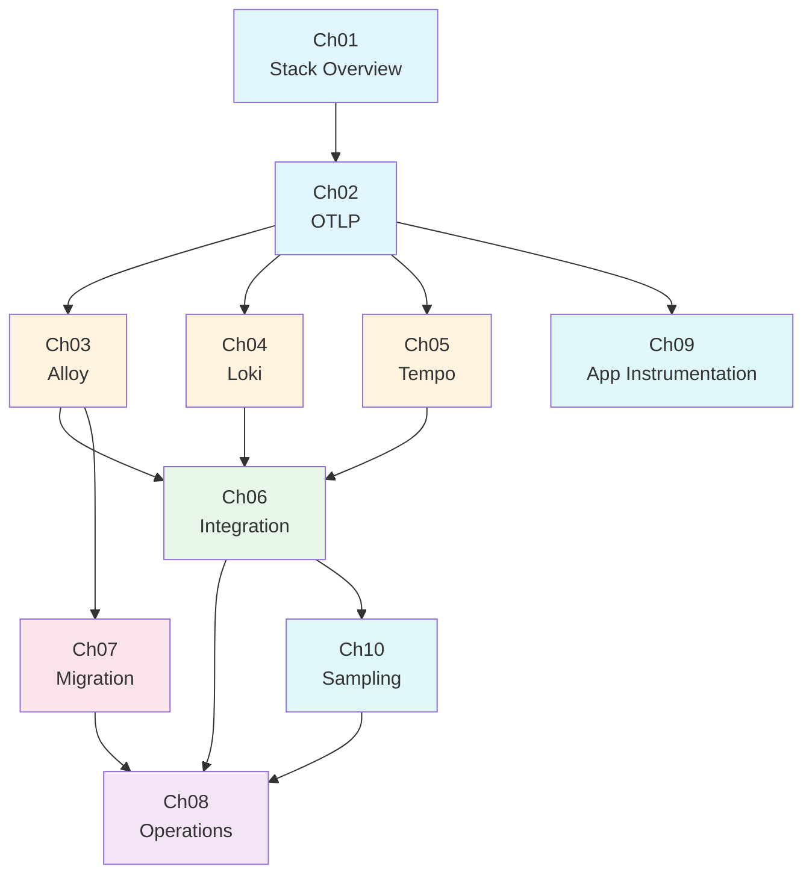

# 07_Observability: OTLP, Alloy, Loki, Tempo 학습

## 프로젝트 개요

이 프로젝트는 Observability를 "메트릭 하나 보는 법"이 아니라, 애플리케이션이 내보내는 텔레메트리 데이터를 어떻게 수집하고 저장하고 분석하는지까지 연결해서 학습하는 것을 목표로 합니다.  
현재 저장소에는 `Jaeger + OpenTelemetry Collector` 기반의 실습 자산이 이미 있고, 이번 학습 문서는 그 자산을 출발점으로 삼아 **OTLP**, **Grafana Alloy**, **Grafana Loki**, **Grafana Tempo**를 체계적으로 이해하도록 구성했습니다.

핵심은 세 가지입니다.

1. 애플리케이션이 무엇을 내보내는지 이해한다.
2. 수집기와 저장소가 각각 무슨 책임을 가지는지 구분한다.
3. 로그와 트레이스를 연결해서 실제 장애 분석 흐름을 설명할 수 있게 만든다.

## 학습 목표

이 커리큘럼을 완료하면 다음 내용을 면접이나 기술 토론에서 설명할 수 있어야 합니다.

1. **OTLP의 역할**: OpenTelemetry 신호를 OTLP로 내보내는 이유와 `OTLP/gRPC`, `OTLP/HTTP`의 차이를 설명할 수 있다.
2. **Alloy의 책임**: Grafana Alloy가 Promtail과 같은 단일 목적 에이전트와 어떻게 다른지, 왜 수집기 계층에서 중요해졌는지 설명할 수 있다.
3. **Loki의 저장 모델**: Loki가 왜 "로그용 객체 저장소 + 라벨 인덱스" 철학을 가지는지, 어떤 라벨 전략이 비용을 폭발시키는지 설명할 수 있다.
4. **Tempo의 역할**: Tempo가 로그 저장소가 아니라 trace backend라는 점과, TraceQL로 어떤 분석이 가능한지 설명할 수 있다.
5. **통합 아키텍처**: 애플리케이션이 OTLP로 보낸 데이터가 Alloy를 거쳐 Loki와 Tempo로 흘러가는 전체 경로를 설명할 수 있다.
6. **마이그레이션 판단**: Promtail을 계속 쓰지 말아야 하는 이유와, 2026년 3월 기준 어떤 마이그레이션 순서가 안전한지 설명할 수 있다.
7. **애플리케이션 계측**: OTel SDK의 API/SDK 분리 구조와, auto-instrumentation 선택지(Java Agent, Spring Boot Starter, K8s Operator)의 차이를 설명할 수 있다.
8. **샘플링 전략**: Head Sampling과 Tail Sampling의 차이, 비용 vs 가시성 트레이드오프, 고볼륨 환경에서의 조합 전략을 설명할 수 있다.

## 선수 지식

| 항목 | 최소 수준 | 확인 포인트 |
|------|----------|------------|
| OpenTelemetry | 기초 | trace, span, resource 용어를 들어본 상태 |
| Docker Compose | 기초 | `docker compose up -d`를 실행할 수 있음 |
| 로그/트레이스 | 기초 | 애플리케이션 로그와 분산 추적의 차이를 알고 있음 |

## 커리큘럼

| Ch | 주제 | 학습 시간 | 핵심 질문 | 상태 |
|----|------|----------|----------|------|
| 01 | [Observability Stack Overview](./learning/01-observability-stack-overview/) | 30min | 수집기, 저장소, UI를 왜 분리해서 봐야 하는가? | ⬜ |
| 02 | [OTLP and Signal Flow](./learning/02-otlp-and-signal-flow/) | 40min | OTLP는 단순 포맷이 아니라 어떤 계약을 제공하는가? | ⬜ |
| 03 | [Grafana Alloy](./learning/03-grafana-alloy/) | 40min | Alloy는 OTel Collector와 무엇이 같고, 무엇이 다른가? | ⬜ |
| 04 | [Grafana Loki](./learning/04-grafana-loki/) | 45min | Loki는 왜 로그 본문이 아니라 라벨만 인덱싱하는가? | ⬜ |
| 05 | [Grafana Tempo](./learning/05-grafana-tempo/) | 40min | Tempo는 Jaeger와 비교해 어떤 운영 철학을 가지는가? | ⬜ |
| 06 | [Alloy-Loki-Tempo Integration](./learning/06-alloy-loki-tempo-integration/) | 45min | 로그와 트레이스를 한 화면에서 연결하려면 무엇을 맞춰야 하는가? | ⬜ |
| 07 | [Promtail to Alloy Migration](./learning/07-promtail-to-alloy-migration/) | 35min | 2026년 3월 이후에도 Promtail을 계속 쓰면 왜 위험한가? | ⬜ |
| 08 | [Operations and Troubleshooting](./learning/08-operations-and-troubleshooting/) | 45min | 데이터가 안 보일 때 어디부터 확인해야 하는가? | ⬜ |
| 09 | [Application Instrumentation](./learning/09-application-instrumentation/) | 45min | 애플리케이션이 텔레메트리를 생성하려면 무엇을 설정해야 하는가? | ⬜ |
| 10 | [Sampling Strategies](./learning/10-sampling-strategies/) | 35min | 모든 trace를 저장하지 않으면서도 중요한 정보를 놓치지 않으려면? | ⬜ |

**총 학습 시간**: 약 6시간 40분

## 학습 로드맵



## 현재 PoC 자산과 연결 포인트

이번 학습 문서는 코드를 새로 만들기보다, 이미 있는 자산을 어떻게 읽어야 하는지까지 함께 안내합니다.

| 자산 | 역할 | 문서에서 다루는 포인트 |
|------|------|------------------------|
| `practice/01-minimal-lgtm-lab/` | 최소 Alloy + Loki + Tempo 실습 | learning 내용을 가장 짧은 경로로 확인하는 입문 실습 |
| `docker-compose.yml` | Jaeger + OTel Collector 기반 미니 실습 | OTLP 수신기와 trace backend 기본 흐름 |
| `otel-collector-config.yaml` | tail-based sampling 예제 | 수집기 계층과 processor 책임 |
| `service-a`, `service-b` | Spring Boot tracing demo | trace_id 전파와 서비스 간 호출 |
| `demo/opentelemetry-demo/` | OTel Demo 전체 스택 | OTLP 신호와 대시보드 흐름 확장 학습 |
| `docs/promtail-deprecation.md` | Promtail 종료 정리 | Alloy migration 챕터의 로컬 참고 문서 |

## Quick Start

### 1. 현재 미니 실습 환경 실행

```bash
docker compose up -d
```

### 2. 서비스 실행

```bash
cd service-b
./gradlew bootRun
```

```bash
cd service-a
./gradlew bootRun
```

### 3. 요청 보내기

```bash
curl http://localhost:8070/hello
```

### 4. UI 확인

- Jaeger UI: `http://localhost:16686`
- Kafka UI: `http://localhost:8080`
- Collector metrics: `http://localhost:8888`

이 실습은 아직 `Alloy + Loki + Tempo`를 직접 띄우는 환경은 아닙니다. 대신 현재 자산으로 **OTLP와 trace 흐름의 기본기**를 익힌 뒤, 새 학습 문서에서 Grafana 스택으로 확장하는 설계와 운영 포인트를 이해하는 순서로 접근합니다.

## 디렉토리 구조

```text
07_Observability/
├── README.md
├── learning/
│   ├── 01-observability-stack-overview/
│   ├── 02-otlp-and-signal-flow/
│   ├── 03-grafana-alloy/
│   ├── 04-grafana-loki/
│   ├── 05-grafana-tempo/
│   ├── 06-alloy-loki-tempo-integration/
│   ├── 07-promtail-to-alloy-migration/
│   ├── 08-operations-and-troubleshooting/
│   ├── 09-application-instrumentation/
│   └── 10-sampling-strategies/
├── practice/
│   └── 01-minimal-lgtm-lab/
├── docs/
├── demo/
├── service-a/
├── service-b/
├── docker-compose.yml
└── otel-collector-config.yaml
```

## 참고 자료

### 로컬 문서

- `docs/03_OpenTelemetry-Overview.md`
- `docs/04_OpenTelemetry-Architecture.md`
- `docs/opentelemetry-demo-architecture.md`
- `docs/promtail-deprecation.md`
- `../../docs/07_Observability/02_텔레메트리_파이프라인/03_파이프라인_관리.md`

### 공식 문서

- OpenTelemetry OTLP Specification
- Grafana Alloy Documentation
- Grafana Loki Documentation
- Grafana Tempo Documentation

## 학습 원칙

- 키워드만 적지 않고, 반드시 "왜?"를 설명한다.
- 로그 저장소와 trace 저장소를 혼동하지 않는다.
- 설정값보다 먼저 데이터 흐름을 이해한다.
- 현재 PoC 자산과 연결해서 학습한다.
