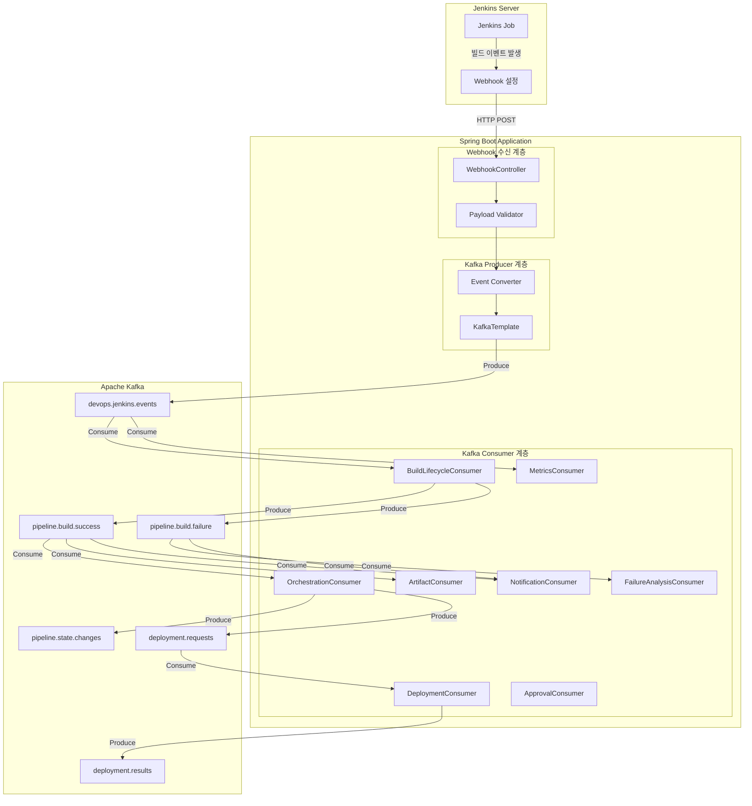

# 1. 전체 아키텍처 및 Webhook 등록

## 1-1. Jenkins Webhook → Kafka 전체 아키텍처



---

## 1-2. Jenkins Webhook 등록 상세 흐름

```mermaid
sequenceDiagram
    autonumber
    participant Admin as 관리자
    participant Jenkins as Jenkins
    participant SB as Spring Boot
    participant Kafka as Kafka

    rect rgb(200, 220, 240)
        Note over Admin,Jenkins: Phase 1: Webhook 설정
        Admin->>Jenkins: Jenkins 관리 접속
        Admin->>Jenkins: Job 설정 > Webhook 추가
        Admin->>Jenkins: URL 입력: http://springboot:8080/webhooks/jenkins
        Admin->>Jenkins: 이벤트 선택 (Started, Completed, Finalized)
        Jenkins-->>Admin: Webhook 설정 완료
    end

    rect rgb(220, 240, 200)
        Note over Jenkins,SB: Phase 2: Spring Boot 준비
        Note right of SB: @PostMapping("/webhooks/jenkins")<br/>WebhookController 준비
        Note right of SB: KafkaTemplate&lt;String, DevOpsEvent&gt;<br/>Producer 설정
        Note right of SB: @KafkaListener 어노테이션<br/>Consumer 설정
    end

    rect rgb(240, 220, 200)
        Note over Jenkins,Kafka: Phase 3: 이벤트 발생 시 흐름
        Jenkins->>Jenkins: 빌드 시작/완료/종료
        Jenkins->>SB: POST /webhooks/jenkins (JSON Payload)
        SB->>SB: Payload 검증
        SB->>SB: DevOpsEvent 변환
        SB->>Kafka: kafkaTemplate.send("devops.jenkins.events", event)
        Kafka-->>SB: ACK
        SB-->>Jenkins: HTTP 200 OK
    end
```
