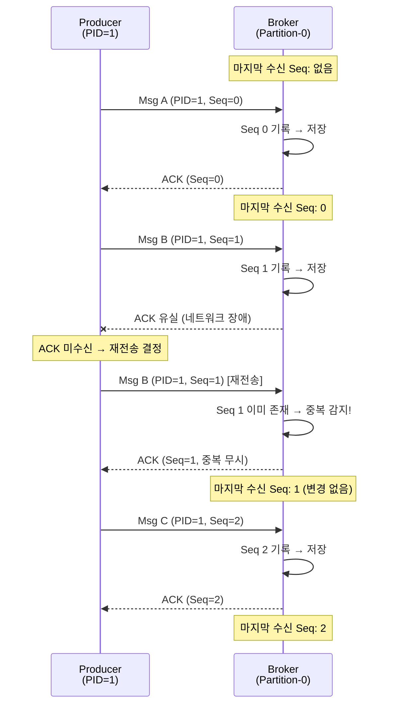
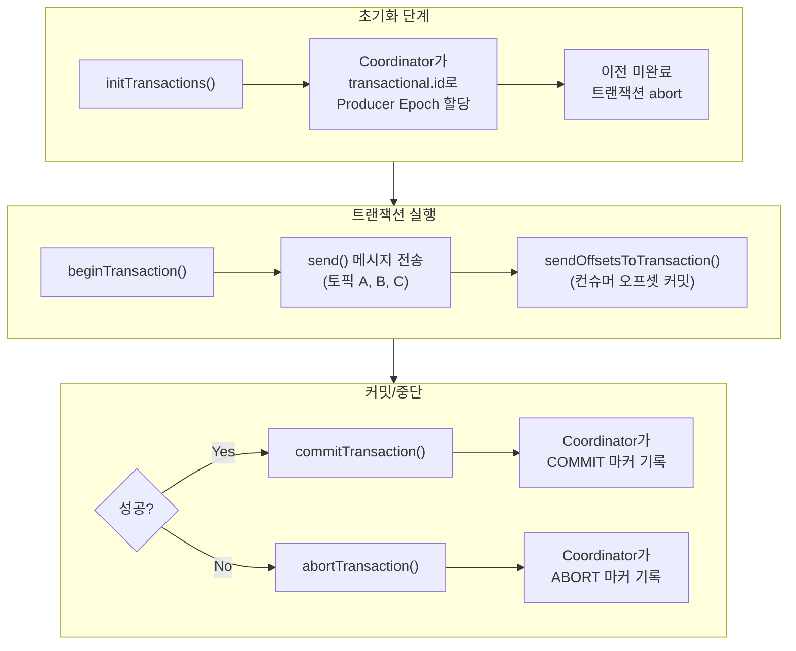
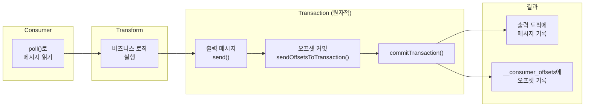

# Kafka Exactly-Once Semantics 깊이 이해하기

```yaml
title: "Kafka Exactly-Once Semantics 깊이 이해하기"
category: "08_MessageQueue"
date: 2026-02-08
reading_time: "30-40분"
concepts:
  - 멱등성 프로듀서 (Idempotent Producer)
  - 트랜잭션 API (Transactional API)
  - Consume-Transform-Produce 패턴
```

---

## 서론

> **이 에세이를 읽고 나면:**
> - 메시지 전달 보장의 세 가지 수준(At-Most-Once, At-Least-Once, Exactly-Once)을 명확히 구분할 수 있습니다
> - Kafka가 멱등성 프로듀서와 트랜잭션 API로 Exactly-Once를 구현하는 원리를 설명할 수 있습니다
> - 실무에서 Consume-Transform-Produce 패턴을 적용하여 end-to-end Exactly-Once를 달성하는 방법을 알게 됩니다

분산 시스템에서 "메시지를 정확히 한 번만 처리한다"는 것은 오랫동안 불가능하다고 여겨졌습니다. 네트워크 장애, 프로세스 재시작, 브로커 크래시 같은 장애 상황에서 메시지가 유실되거나 중복 처리되는 것은 분산 메시징의 숙명처럼 보였습니다. 실제로 2017년 이전까지 Kafka는 At-Least-Once(최소 한 번) 전달만 보장했고, 중복 방지는 전적으로 애플리케이션의 몫이었습니다.

결제 시스템을 예로 들어보겠습니다. 사용자가 10,000원을 송금하는 이벤트가 Kafka를 통해 처리됩니다. 프로듀서가 메시지를 보냈는데 브로커의 응답이 네트워크 타임아웃으로 돌아오지 않았습니다. 프로듀서는 전송 실패로 판단하고 같은 메시지를 다시 보냅니다. 하지만 실제로는 첫 번째 메시지도 브로커에 정상 기록되어, 결과적으로 20,000원이 송금됩니다. 이런 중복 처리는 금융, 재고 관리, 주문 처리 등 정확성이 생명인 도메인에서 치명적입니다.

Apache Kafka 0.11(2017년)에서 도입된 Exactly-Once Semantics(EOS)는 이 문제를 브로커 레벨에서 해결합니다. 이 에세이에서는 다음 핵심 개념을 다룹니다:

1. **멱등성 프로듀서(Idempotent Producer)**: 단일 파티션 내에서 프로듀서 재시도에 의한 메시지 중복을 방지하는 메커니즘
2. **트랜잭션 API(Transactional API)**: 여러 파티션과 토픽에 걸친 원자적 쓰기를 보장하는 메커니즘
3. **Consume-Transform-Produce 패턴**: 읽기-처리-쓰기를 하나의 원자적 단위로 묶어 end-to-end Exactly-Once를 달성하는 방법

---

## 본론

### 1. 멱등성 프로듀서 (Idempotent Producer)

#### 1.1 정의와 배경

멱등성 프로듀서란, 동일한 메시지를 여러 번 전송하더라도 브로커에는 정확히 한 번만 기록되도록 보장하는 Kafka 프로듀서 모드입니다.

**왜 등장했나요?**

기존 Kafka 프로듀서는 메시지 전송 후 브로커로부터 ACK를 받지 못하면 메시지를 재전송했습니다. 이 재전송 메커니즘은 메시지 유실을 방지하지만(At-Least-Once), 근본적인 문제가 있었습니다. 브로커가 실제로는 메시지를 정상 기록했지만 ACK 응답만 네트워크 문제로 유실된 경우, 프로듀서는 이를 실패로 판단하고 같은 메시지를 다시 보냅니다. 결과적으로 동일한 메시지가 파티션에 두 번 기록됩니다.

이 문제를 애플리케이션 레벨에서 해결하려면 컨슈머 쪽에서 중복 감지 로직을 직접 구현해야 했습니다. 메시지에 고유 ID를 부여하고, 이미 처리한 ID를 데이터베이스에 저장하고, 매번 조회하는 식입니다. 이는 복잡할 뿐 아니라 성능 오버헤드도 상당했습니다. 멱등성 프로듀서는 이 중복 방지 책임을 브로커 레벨로 내림으로써 문제를 근본적으로 해결합니다.

#### 1.2 동작 원리

멱등성 프로듀서는 **Producer ID(PID)**와 **시퀀스 번호(Sequence Number)**라는 두 가지 메커니즘으로 동작합니다. 프로듀서가 처음 초기화될 때 브로커로부터 고유한 PID를 할당받습니다. 이후 각 파티션에 보내는 메시지마다 0부터 시작하는 시퀀스 번호를 순차적으로 증가시켜 함께 전송합니다. 브로커는 (PID, 파티션) 조합별로 마지막으로 수신한 시퀀스 번호를 메모리에 기록합니다.



위 시퀀스 다이어그램에서 핵심은 세 번째 화살표입니다. 프로듀서가 Msg B를 재전송하지만, 브로커는 PID=1에 대해 Seq=1을 이미 수신했음을 알고 있으므로 중복 쓰기를 무시합니다. 이 과정은 프로듀서와 컨슈머 모두에게 투명하게 일어나며, 별도의 애플리케이션 로직이 필요하지 않습니다.

브로커는 시퀀스 번호의 연속성도 검증합니다. 만약 Seq=3 다음에 갑자기 Seq=5가 오면, 중간에 메시지가 유실되었음을 의미하므로 `OutOfOrderSequenceException`을 발생시킵니다. 이를 통해 메시지 순서 보장과 유실 감지까지 가능합니다.

#### 1.3 실무 적용

실제 프로젝트에서 멱등성 프로듀서를 적용하는 것은 매우 간단합니다. Kafka 3.0 이상에서는 기본적으로 활성화되어 있지만, 명시적으로 설정하는 것이 좋습니다.

**시나리오**: 주문 이벤트를 Kafka로 전송하는 주문 서비스

```java
// 멱등성 프로듀서 설정
Properties props = new Properties();
props.put(ProducerConfig.BOOTSTRAP_SERVERS_CONFIG, "kafka:9092");
props.put(ProducerConfig.KEY_SERIALIZER_CLASS_CONFIG, StringSerializer.class);
props.put(ProducerConfig.VALUE_SERIALIZER_CLASS_CONFIG, JsonSerializer.class);

// 핵심 설정: 멱등성 활성화
props.put(ProducerConfig.ENABLE_IDEMPOTENCE_CONFIG, true);

// 멱등성을 위해 자동 설정되는 값들 (명시적 설정 권장)
props.put(ProducerConfig.ACKS_CONFIG, "all");           // 모든 ISR 복제본 확인
props.put(ProducerConfig.RETRIES_CONFIG, Integer.MAX_VALUE); // 무한 재시도
props.put(ProducerConfig.MAX_IN_FLIGHT_REQUESTS_PER_CONNECTION, 5); // 최대 5개 동시 전송

KafkaProducer<String, OrderEvent> producer = new KafkaProducer<>(props);

// 메시지 전송 - 재시도해도 중복 없음
OrderEvent event = new OrderEvent("order-123", "CREATED", 10000);
ProducerRecord<String, OrderEvent> record =
    new ProducerRecord<>("order-events", event.getOrderId(), event);

producer.send(record, (metadata, exception) -> {
    if (exception != null) {
        log.error("전송 실패: {}", exception.getMessage());
    } else {
        log.info("전송 성공: partition={}, offset={}",
                 metadata.partition(), metadata.offset());
    }
});
```

**핵심 포인트**:
- `enable.idempotence=true`를 설정하면 `acks=all`, `retries=MAX_VALUE`가 자동으로 설정됩니다. 이들 중 하나라도 호환되지 않는 값으로 명시하면 예외가 발생합니다.
- `max.in.flight.requests.per.connection`은 5 이하여야 합니다. Kafka는 파티션 내에서 최대 5개의 in-flight 배치에 대해 순서 보장과 중복 방지를 수행합니다.

**멱등성 프로듀서의 한계**: 멱등성 프로듀서는 단일 프로듀서 세션 내에서, 단일 파티션에 대해서만 중복을 방지합니다. 프로듀서가 재시작되면 새로운 PID를 할당받기 때문에, 이전 세션의 중복을 감지할 수 없습니다. 또한 여러 파티션에 걸친 원자적 쓰기도 보장하지 않습니다. 이 한계를 극복하는 것이 바로 트랜잭션 API입니다.

---

### 2. 트랜잭션 API (Transactional API)

#### 2.1 정의와 배경

Kafka 트랜잭션 API란, 여러 토픽과 파티션에 걸친 메시지 쓰기를 하나의 원자적(atomic) 단위로 묶어, 모두 성공하거나 모두 실패하도록 보장하는 메커니즘입니다.

**왜 필요한가요?**

멱등성 프로듀서만으로는 실무의 복잡한 요구사항을 충족하기 어렵습니다. 스트림 처리 애플리케이션을 생각해보겠습니다. 입력 토픽에서 주문 이벤트를 읽고, 결제 토픽과 재고 토픽에 각각 메시지를 써야 합니다. 결제 토픽에는 성공적으로 썼는데 재고 토픽 쓰기 중에 프로듀서가 크래시되면, 결제는 진행되었지만 재고는 차감되지 않는 데이터 불일치가 발생합니다.

또한 프로듀서가 재시작되면 새로운 PID를 받기 때문에, 재시작 전에 보낸 메시지와 재시작 후에 보낸 메시지 사이의 중복도 감지할 수 없습니다. 트랜잭션 API는 `transactional.id`라는 정적 식별자를 도입하여 프로듀서 재시작에도 동일한 논리적 프로듀서로 인식될 수 있게 합니다.

#### 2.2 동작 원리

트랜잭션 API의 핵심에는 **Transaction Coordinator**라는 브로커 측 컴포넌트가 있습니다. 각 트랜잭션의 상태를 `__transaction_state`라는 내부 토픽에 기록하여 관리합니다. 트랜잭션의 전체 흐름은 다음과 같습니다.



위 다이어그램에서 각 단계가 의미하는 바를 자세히 살펴보겠습니다.

**1단계 - 초기화**: `initTransactions()`를 호출하면, Transaction Coordinator는 `transactional.id`를 키로 해당 프로듀서의 **에포크(epoch)**를 증가시킵니다. 에포크는 동일한 `transactional.id`를 가진 프로듀서의 세대를 구분하는 숫자입니다. 이전 에포크의 프로듀서가 보낸 미완료 트랜잭션은 자동으로 abort됩니다. 이것이 바로 **좀비 펜싱(zombie fencing)**입니다. 크래시 후 재시작한 프로듀서가 이전 인스턴스의 미완료 작업을 정리하는 것입니다.

**2단계 - 트랜잭션 실행**: `beginTransaction()` 이후의 모든 `send()` 호출은 트랜잭션에 포함됩니다. 여러 토픽, 여러 파티션에 걸쳐 메시지를 보낼 수 있습니다. 이 메시지들은 브로커에 실제로 기록되지만, 아직 컨슈머에게는 보이지 않습니다.

**3단계 - 커밋/중단**: `commitTransaction()`이 호출되면 Coordinator는 각 파티션에 COMMIT 마커를 기록합니다. 이 마커가 기록된 후에야 `read_committed` 모드의 컨슈머가 해당 트랜잭션의 메시지를 읽을 수 있습니다. 반대로 `abortTransaction()`이 호출되면 ABORT 마커가 기록되고, 해당 트랜잭션의 메시지는 컨슈머에게 영원히 보이지 않습니다.

#### 2.3 실무 적용

**시나리오**: 주문 이벤트를 읽어서 결제 이벤트와 재고 이벤트를 원자적으로 기록하는 스트림 프로세서

```java
Properties props = new Properties();
props.put(ProducerConfig.BOOTSTRAP_SERVERS_CONFIG, "kafka:9092");
props.put(ProducerConfig.ENABLE_IDEMPOTENCE_CONFIG, true);

// 트랜잭션 핵심 설정: 고유한 transactional.id
props.put(ProducerConfig.TRANSACTIONAL_ID_CONFIG, "order-processor-1");

KafkaProducer<String, String> producer = new KafkaProducer<>(props);

// 1. 초기화 - 이전 미완료 트랜잭션 정리 + 에포크 증가
producer.initTransactions();

try {
    // 2. 트랜잭션 시작
    producer.beginTransaction();

    // 3. 여러 토픽에 원자적으로 쓰기
    producer.send(new ProducerRecord<>(
        "payment-events", orderId, paymentEvent));
    producer.send(new ProducerRecord<>(
        "inventory-events", productId, inventoryEvent));
    producer.send(new ProducerRecord<>(
        "notification-events", userId, notificationEvent));

    // 4. 트랜잭션 커밋 - 세 메시지가 모두 원자적으로 가시화
    producer.commitTransaction();

} catch (ProducerFencedException e) {
    // 좀비 프로듀서 감지 - 새 인스턴스가 이미 활성화됨
    log.error("이 프로듀서는 펜싱되었습니다. 종료합니다.", e);
    producer.close();
} catch (KafkaException e) {
    // 기타 오류 - 트랜잭션 중단
    producer.abortTransaction();
    log.error("트랜잭션 실패, abort 처리", e);
}
```

**주의사항**:
- `transactional.id`는 반드시 애플리케이션 인스턴스별로 고유해야 합니다. 같은 `transactional.id`를 가진 새 프로듀서가 초기화되면, 이전 프로듀서는 `ProducerFencedException`과 함께 더 이상 트랜잭션을 수행할 수 없게 됩니다. 이것은 의도된 동작으로, 좀비 프로듀서가 데이터를 오염시키는 것을 방지합니다.
- 트랜잭션 타임아웃(`transaction.timeout.ms`, 기본 60초) 내에 커밋 또는 중단이 이루어지지 않으면, Coordinator가 자동으로 트랜잭션을 abort합니다. 따라서 트랜잭션 내에서 무거운 연산이나 외부 시스템 호출을 하는 것은 피해야 합니다.

---

### 3. Consume-Transform-Produce 패턴

#### 3.1 정의와 배경

Consume-Transform-Produce 패턴이란, 입력 토픽에서 메시지를 읽고(Consume), 비즈니스 로직으로 변환한 뒤(Transform), 출력 토픽에 결과를 쓰는(Produce) 과정을 하나의 원자적 트랜잭션으로 묶는 패턴입니다. 이 패턴에서는 컨슈머의 오프셋 커밋까지 트랜잭션에 포함시켜 진정한 end-to-end Exactly-Once를 달성합니다.

**왜 필요한가요?**

트랜잭션 API만으로는 "쓰기" 측면의 원자성만 보장합니다. 하지만 스트림 처리에서는 "읽기"도 함께 고려해야 합니다. 컨슈머가 메시지를 읽고 처리한 후 출력 토픽에 썼는데, 오프셋 커밋 전에 크래시가 발생하면 어떻게 될까요? 재시작 후 컨슈머는 같은 메시지를 다시 읽고 다시 처리합니다. 출력 토픽에는 중복 메시지가 쓰이게 됩니다.

이 문제를 해결하는 핵심 아이디어는 **컨슈머 오프셋 커밋을 프로듀서 트랜잭션 안에 포함시키는 것**입니다. 출력 메시지와 오프셋 커밋이 원자적으로 함께 커밋되므로, 커밋이 성공하면 둘 다 반영되고, 실패하면 둘 다 롤백됩니다.

#### 3.2 동작 원리



위 다이어그램은 Consume-Transform-Produce의 전체 흐름을 보여줍니다. 핵심은 `send()`와 `sendOffsetsToTransaction()`이 같은 트랜잭션 안에서 실행되어, `commitTransaction()`이 호출될 때 출력 메시지와 오프셋이 동시에 커밋된다는 점입니다. 만약 커밋 전에 장애가 발생하면, 재시작 시 `initTransactions()`가 미완료 트랜잭션을 abort하고, 컨슈머는 이전 커밋된 오프셋부터 다시 읽기 시작합니다. 출력 토픽의 미커밋 메시지는 `read_committed` 컨슈머에게 보이지 않으므로 중복이 발생하지 않습니다.

#### 3.3 실무 적용

**시나리오**: 주문 이벤트를 읽어 정산 이벤트로 변환하는 파이프라인

```java
// 컨슈머 설정 - read_committed 모드 필수
Properties consumerProps = new Properties();
consumerProps.put(ConsumerConfig.BOOTSTRAP_SERVERS_CONFIG, "kafka:9092");
consumerProps.put(ConsumerConfig.GROUP_ID_CONFIG, "settlement-processor");
consumerProps.put(ConsumerConfig.ISOLATION_LEVEL_CONFIG, "read_committed");
consumerProps.put(ConsumerConfig.ENABLE_AUTO_COMMIT_CONFIG, false);

KafkaConsumer<String, OrderEvent> consumer = new KafkaConsumer<>(consumerProps);
consumer.subscribe(List.of("order-events"));

// 프로듀서 설정 - 트랜잭션 활성화
Properties producerProps = new Properties();
producerProps.put(ProducerConfig.BOOTSTRAP_SERVERS_CONFIG, "kafka:9092");
producerProps.put(ProducerConfig.TRANSACTIONAL_ID_CONFIG, "settlement-processor-1");
producerProps.put(ProducerConfig.ENABLE_IDEMPOTENCE_CONFIG, true);

KafkaProducer<String, SettlementEvent> producer = new KafkaProducer<>(producerProps);
producer.initTransactions();

// 메인 루프: Consume-Transform-Produce
while (true) {
    // 1. Consume - 메시지 읽기
    ConsumerRecords<String, OrderEvent> records = consumer.poll(Duration.ofMillis(100));

    if (records.isEmpty()) continue;

    // 2. 트랜잭션 시작
    producer.beginTransaction();

    try {
        for (ConsumerRecord<String, OrderEvent> record : records) {
            // 3. Transform - 주문을 정산 이벤트로 변환
            SettlementEvent settlement = SettlementEvent.builder()
                .orderId(record.value().getOrderId())
                .amount(record.value().getAmount())
                .merchantId(record.value().getMerchantId())
                .settlementDate(LocalDate.now().plusDays(1))
                .build();

            // 4. Produce - 정산 토픽에 쓰기
            producer.send(new ProducerRecord<>(
                "settlement-events", settlement.getMerchantId(), settlement));
        }

        // 5. 오프셋 커밋을 트랜잭션에 포함
        Map<TopicPartition, OffsetAndMetadata> offsets = new HashMap<>();
        for (TopicPartition partition : records.partitions()) {
            List<ConsumerRecord<String, OrderEvent>> partRecords =
                records.records(partition);
            long lastOffset = partRecords.get(partRecords.size() - 1).offset();
            offsets.put(partition, new OffsetAndMetadata(lastOffset + 1));
        }
        producer.sendOffsetsToTransaction(offsets, consumer.groupMetadata());

        // 6. 원자적 커밋 - 정산 메시지 + 오프셋이 함께 커밋
        producer.commitTransaction();

    } catch (ProducerFencedException e) {
        log.error("좀비 펜싱 감지 - 종료", e);
        break;
    } catch (KafkaException e) {
        producer.abortTransaction();
        log.error("트랜잭션 실패 - abort 후 재시도", e);
    }
}
```

**핵심 포인트**:
- 컨슈머의 `isolation.level`을 `read_committed`로 설정해야 합니다. 그래야 커밋되지 않은 트랜잭션 메시지를 읽지 않습니다. 기본값은 `read_uncommitted`이므로 반드시 명시적으로 설정해야 합니다.
- `enable.auto.commit`은 반드시 `false`로 설정합니다. 오프셋 커밋은 `sendOffsetsToTransaction()`을 통해 트랜잭션 안에서 수행해야 하기 때문입니다.
- Kafka Streams를 사용하면 이 모든 보일러플레이트를 `processing.guarantee=exactly_once_v2`라는 한 줄 설정으로 대체할 수 있습니다. 내부적으로 위와 동일한 Consume-Transform-Produce 패턴을 자동으로 적용합니다.

---

## 결론

### 핵심 요약

| 개념 | 정의 | 핵심 포인트 |
|------|------|-------------|
| 멱등성 프로듀서 | PID + 시퀀스 번호로 단일 파티션 내 중복 방지 | Kafka 3.0+에서 기본 활성화, 프로듀서 재시작 시 보장 안 됨 |
| 트랜잭션 API | transactional.id + 에포크로 다중 파티션 원자적 쓰기 | 좀비 펜싱으로 재시작 시에도 안전, 타임아웃 주의 |
| Consume-Transform-Produce | 오프셋 커밋을 트랜잭션에 포함하여 end-to-end EOS | read_committed + auto.commit=false 필수 |

### 기억해야 할 3가지

1. **멱등성은 기본, 트랜잭션은 선택**: Kafka 3.0 이상에서 멱등성 프로듀서는 기본값입니다. 추가 비용 없이 단일 파티션 중복을 방지할 수 있으므로 모든 프로덕션 워크로드에서 활용해야 합니다. 트랜잭션은 다중 파티션 원자성이 필요한 경우에만 사용하면 됩니다.

2. **Exactly-Once는 Kafka 내부 보장**: Kafka의 EOS는 Kafka 에코시스템 내부에서의 보장입니다. Kafka에서 읽어 외부 데이터베이스에 쓰는 경우, 외부 시스템과의 Exactly-Once는 해당 시스템의 멱등성(예: UPSERT)이나 Outbox 패턴 등 별도의 전략이 필요합니다.

3. **성능과 정합성의 트레이드오프**: 트랜잭션은 Coordinator 통신, 마커 기록, read_committed 지연 등의 오버헤드를 수반합니다. 처리량이 10-20% 정도 감소할 수 있습니다. 모든 토픽에 무조건 적용하기보다, 데이터 정합성이 핵심인 워크로드(결제, 재고, 정산)에 선별적으로 적용하는 것이 바람직합니다.

### 복습 카드

> spaced-repetition 스킬과 연계

**Q1**: 멱등성 프로듀서는 어떤 메커니즘으로 중복을 감지하나요?
<details>
<summary>정답</summary>
프로듀서에 할당된 고유한 Producer ID(PID)와 파티션별 시퀀스 번호(Sequence Number)를 사용합니다. 브로커는 (PID, Partition) 조합별 마지막 시퀀스 번호를 추적하여, 이미 수신한 시퀀스의 메시지가 오면 중복으로 판단하고 무시합니다.
</details>

**Q2**: 트랜잭션 API에서 좀비 펜싱(zombie fencing)이란 무엇이고, 왜 필요한가요?
<details>
<summary>정답</summary>
좀비 펜싱이란 동일한 transactional.id를 가진 새 프로듀서가 초기화될 때, 이전 프로듀서의 에포크를 무효화하여 더 이상 트랜잭션을 수행하지 못하게 하는 메커니즘입니다. 이전 프로듀서가 크래시 후 네트워크 파티션 상태에서 여전히 살아있을 때, 미완료 트랜잭션으로 데이터를 오염시키는 것을 방지하기 위해 필요합니다.
</details>

**Q3**: Consume-Transform-Produce 패턴에서 end-to-end Exactly-Once를 보장하려면 컨슈머에 어떤 설정이 필요한가요?
<details>
<summary>정답</summary>
두 가지 설정이 필수입니다. 첫째, `isolation.level=read_committed`로 설정하여 커밋된 트랜잭션 메시지만 읽도록 합니다. 둘째, `enable.auto.commit=false`로 설정하여 오프셋이 자동 커밋되지 않게 하고, `sendOffsetsToTransaction()`으로 트랜잭션 내에서 오프셋을 커밋합니다.
</details>

---

## 더 알아보기

- [Apache Kafka KIP-98: Exactly Once Delivery and Transactional Messaging](https://cwiki.apache.org/confluence/display/KAFKA/KIP-98+-+Exactly+Once+Delivery+and+Transactional+Messaging)
- [Confluent - Exactly-once Semantics are Possible](https://www.confluent.io/blog/exactly-once-semantics-are-possible-heres-how-apache-kafka-does-it/)
- [Confluent - Message Delivery Guarantees](https://docs.confluent.io/kafka/design/delivery-semantics.html)

---

*작성일: 2026-02-08*
