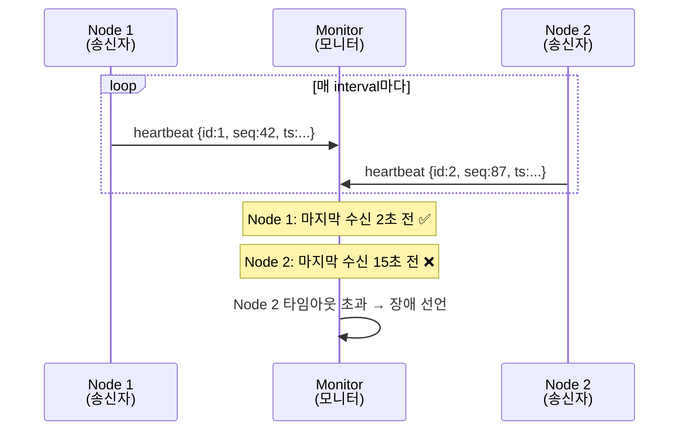
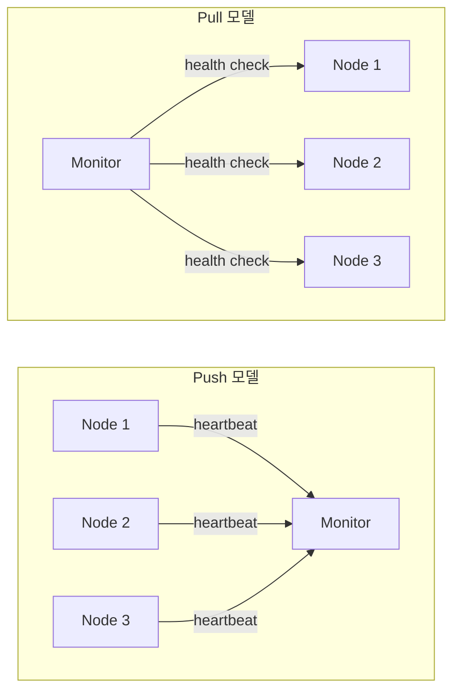
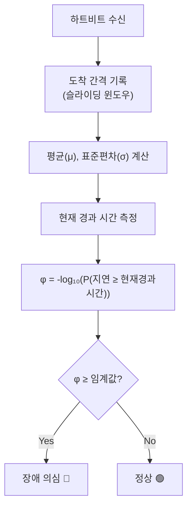
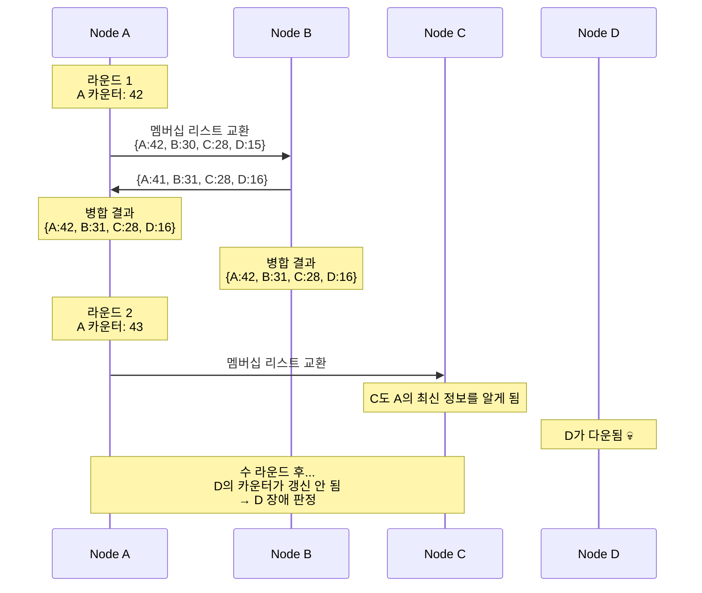

# 분산 시스템의 하트비트와 장애 감지 깊이 이해하기

```yaml
title: "분산 시스템의 하트비트와 장애 감지 깊이 이해하기"
category: "02_Architecture"
date: 2026-02-08
reading_time: "30-40분"
concepts:
  - 하트비트 메커니즘 (Push vs Pull)
  - Phi Accrual 장애 감지기
  - 가십 프로토콜 기반 분산 장애 감지
source: "https://arpitbhayani.me/blogs/heartbeats-in-distributed-systems/"
```

---

## 서론

> **이 에세이를 읽고 나면:**
> - 분산 시스템에서 노드 장애를 감지하는 핵심 메커니즘을 이해할 수 있습니다
> - 고정 타임아웃의 한계와 Phi Accrual 감지기의 통계적 접근법을 설명할 수 있습니다
> - 수천 개 노드 규모에서 가십 프로토콜로 확장하는 방법을 알 수 있습니다

분산 시스템에서 가장 근본적인 질문 중 하나는 "저 노드가 지금 살아있는가?"입니다. 단일 서버 환경에서는 프로세스가 응답하지 않으면 OS가 즉시 알려주지만, 네트워크로 연결된 수백 개의 노드로 구성된 시스템에서는 이 단순한 질문에 답하는 것조차 놀라울 정도로 어렵습니다. 노드가 정말 죽은 것인지, 네트워크가 일시적으로 끊긴 것인지, 아니면 단순히 느린 것인지 구분해야 하기 때문입니다.

실무에서 이 문제는 매우 구체적인 상황으로 나타납니다. 예를 들어, Kubernetes 클러스터에서 워커 노드 하나가 응답을 멈추면, 그 위에서 실행 중이던 Pod들을 다른 노드로 옮겨야 합니다. 하지만 너무 성급하게 "죽었다"고 판단하면 불필요한 재스케줄링이 발생하고, 너무 느리게 판단하면 서비스 중단 시간이 길어집니다. 바로 이 균형을 잡는 것이 장애 감지의 핵심 과제입니다.

이 에세이에서는 다음 핵심 개념을 다룹니다:

1. **하트비트 메커니즘**: 노드가 살아있음을 증명하는 주기적 신호와 Push/Pull 모델의 차이
2. **Phi Accrual 장애 감지기**: 이진 판정(살았다/죽었다)을 넘어선 통계적 의심 수준 계산
3. **가십 프로토콜**: 중앙 모니터 없이 수천 개 노드로 확장하는 분산 장애 감지

---

## 본론

### 1. 하트비트 메커니즘

#### 1.1 정의와 배경

하트비트(Heartbeat)란 분산 시스템에서 한 노드가 다른 노드에 주기적으로 보내는 "나는 살아있다"는 경량 신호입니다.

**왜 등장했나요?**

분산 시스템 초기에는 노드 상태를 확인하기 위해 직접 요청을 보내고 응답을 기다리는 방식을 사용했습니다. 하지만 이 방식은 요청 자체가 실패하면 노드가 죽은 것인지 네트워크가 끊긴 것인지 구분할 수 없었고, 모든 노드에 개별적으로 확인 요청을 보내면 네트워크 부하가 급격히 증가하는 문제가 있었습니다. 이를 해결하기 위해 각 노드가 스스로 주기적으로 "살아있음"을 알리는 하트비트 방식이 등장했습니다.

하트비트 메시지는 최소한의 정보만 담습니다. 노드 ID, 타임스탬프, 시퀀스 번호 정도면 충분합니다. 핵심은 메시지의 내용이 아니라 **메시지가 도착했다는 사실** 자체입니다.

#### 1.2 동작 원리

하트비트 시스템은 **송신자(Sender)**와 **모니터(Monitor)** 두 컴포넌트로 구성됩니다. 송신자는 정해진 간격(Interval)으로 하트비트를 보내고, 모니터는 각 노드의 마지막 하트비트 수신 시간을 기록합니다. 현재 시간과 마지막 수신 시간의 차이가 타임아웃(Timeout)을 초과하면, 해당 노드를 "장애"로 판정합니다.



위 다이어그램에서 Node 1은 정상적으로 하트비트를 보내고 있지만, Node 2는 오랫동안 하트비트가 도착하지 않아 모니터가 장애로 판정하는 상황을 보여줍니다.

여기서 두 가지 핵심 파라미터의 설정이 중요합니다:

| 파라미터 | 설명 | 트레이드오프 |
|---------|------|-------------|
| **간격 (Interval)** | 하트비트 전송 주기 | 짧으면 빠른 감지 ↔ 네트워크 부하 증가 |
| **타임아웃 (Timeout)** | 장애 선언까지 대기 시간 | 짧으면 빠른 감지 ↔ 오탐(false positive) 증가 |

1,000개 노드가 500ms 간격으로 하트비트를 보내면 초당 2,000개 메시지가 발생합니다. 이것만으로도 실제 애플리케이션 트래픽을 방해할 수 있습니다. 반면 간격을 30초로 늘리면 네트워크 부하는 줄지만, 장애를 감지하는 데 최소 1분 이상 걸릴 수 있습니다.

실무에서는 타임아웃을 간격의 2~3배로 설정하는 것이 일반적이며, 단일 하트비트 누락이 아닌 **연속 3회 이상 미수신** 후 장애를 선언하는 방식으로 오탐을 줄입니다.

#### 1.3 Push vs Pull 모델

하트비트를 전달하는 방식에는 두 가지 모델이 있습니다.

**Push 모델**은 각 노드가 능동적으로 모니터에게 하트비트를 보냅니다. Kubernetes의 kubelet이 API 서버에 10초 간격으로 상태를 보고하는 것이 대표적입니다. 노드가 자신의 상태를 직접 보고하기 때문에 구현이 직관적이지만, 완전히 다운된 노드는 당연히 하트비트를 보낼 수 없으므로 "침묵 = 장애"로 해석해야 합니다.

**Pull 모델**은 반대로 모니터가 각 노드에게 "살아있니?"라고 물어보는 방식입니다. Prometheus가 타겟 서버의 `/metrics` 엔드포인트를 주기적으로 스크레이핑하는 것이 이 방식입니다. 모니터가 폴링 주기를 완전히 제어할 수 있지만, 노드 수가 늘어나면 모니터 자체에 부하가 집중됩니다.



위 다이어그램에서 Push 모델은 화살표가 노드에서 모니터로 향하고, Pull 모델은 모니터에서 노드로 향합니다. 실제 프로덕션에서는 두 모델을 결합한 하이브리드 방식을 많이 사용합니다. 노드는 Push로 정기 상태를 보고하고, 모니터는 의심스러운 노드에 대해 추가로 Pull 확인을 수행하는 식입니다.

#### 1.4 실무 적용: Kubernetes 하트비트

Kubernetes에서의 하트비트 설정을 살펴보겠습니다.

**시나리오**: 50개 워커 노드로 구성된 Kubernetes 클러스터에서 노드 장애를 감지하는 상황

```yaml
# kubelet 설정: 노드 수준 하트비트
# kubelet이 API 서버에 10초마다 NodeStatus 업데이트 전송 (Push)
# 40초(nodeMonitorGracePeriod) 동안 미수신 시 NotReady 선언

# Pod 수준: liveness probe (Pull)
apiVersion: v1
kind: Pod
spec:
  containers:
  - name: app
    livenessProbe:
      httpGet:
        path: /healthz
        port: 8080
      initialDelaySeconds: 15   # 시작 후 15초 대기
      periodSeconds: 10          # 10초 간격으로 체크
      failureThreshold: 3        # 3회 연속 실패 시 재시작
      timeoutSeconds: 2          # 응답 대기 2초
```

**핵심 포인트**:
- 노드 수준은 Push 모델(kubelet → API 서버), Pod 수준은 Pull 모델(kubelet → 컨테이너)로 하이브리드 구성
- `failureThreshold: 3`으로 일시적 지연에 의한 오탐 방지
- `timeoutSeconds: 2`로 느린 응답도 비정상으로 처리 — 느린 노드가 죽은 노드보다 더 위험할 수 있기 때문

---

### 2. Phi Accrual 장애 감지기

#### 2.1 정의와 배경

Phi Accrual 장애 감지기란 하트비트 도착 간격의 통계적 분포를 분석하여, 노드 장애를 이진 판정(살았다/죽었다)이 아닌 **연속적 의심 수준(φ 값)**으로 표현하는 고도화된 장애 감지 알고리즘입니다.

**왜 필요한가요?**

고정 타임아웃 기반 하트비트만으로는 네트워크 지연이 가변적인 환경에서 심각한 한계가 있습니다. 같은 데이터센터 내 RTT가 1ms인 노드와 대륙 간 RTT가 100ms인 노드에 동일한 타임아웃을 적용하면, 전자는 너무 느슨하고 후자는 너무 엄격합니다. 고정 타임아웃은 네트워크 상황이 변해도 적응하지 못하기 때문에, GC 정지나 일시적 네트워크 혼잡으로 인한 오탐이 빈번하게 발생합니다.

Phi Accrual 감지기는 이 문제를 **"최근 하트비트 도착 패턴을 학습하고, 현재 지연이 얼마나 이상한지 통계적으로 판단하는"** 방식으로 해결합니다.

#### 2.2 동작 원리

Phi Accrual 감지기는 다음 세 단계로 동작합니다.

**1단계 — 샘플 수집**: 최근 N개의 하트비트 도착 간격(inter-arrival time)을 슬라이딩 윈도우에 저장합니다. 예를 들어 하트비트가 1.0초, 1.1초, 0.9초, 1.2초 간격으로 도착했다면, 이 값들이 윈도우에 쌓입니다.

**2단계 — 분포 추정**: 수집된 샘플의 평균(μ)과 표준편차(σ)를 계산합니다. 이를 통해 "하트비트가 보통 어떤 간격으로 도착하는가"의 확률 분포를 추정합니다.

**3단계 — φ(phi) 값 계산**: 현재 시점에서 마지막 하트비트 이후 경과 시간을 확률 분포에 대입하여, "이 정도 지연이 우연히 발생할 확률"의 음의 로그를 계산합니다.



위 다이어그램에서 핵심은 φ 값 계산 단계입니다. φ 값이 높을수록 "이 정도로 오래 하트비트가 안 온 적이 거의 없었다"는 의미이므로, 장애 확률이 높습니다.

φ 값과 장애 확률의 관계는 다음과 같습니다:

| φ 값 | 장애 확률 | 의미 |
|------|----------|------|
| 1 | ~90% | 약간 의심 |
| 2 | ~99% | 높은 의심 |
| 3 | ~99.9% | 거의 확실 |
| 8 | ~99.999999% | Cassandra 기본 임계값 |

Cassandra는 φ 임계값을 8로 설정합니다. 이는 99.999999%의 확신이 있어야 노드를 "다운"으로 판정한다는 의미로, 극도로 보수적인 접근입니다. 잘못된 장애 선언으로 인한 불필요한 데이터 복제와 리밸런싱의 비용이 장애 감지가 몇 초 늦어지는 비용보다 훨씬 크기 때문입니다.

#### 2.3 실무 적용: 고정 타임아웃 vs Phi Accrual 비교

**시나리오**: 평소 하트비트가 1초 간격으로 도착하던 노드에서, JVM Full GC로 인해 3초 동안 하트비트가 지연된 상황

```python
# === 고정 타임아웃 방식 ===
class FixedTimeoutDetector:
    def __init__(self, timeout_sec=3.0):
        self.timeout = timeout_sec
        self.last_heartbeat = time.time()

    def receive(self):
        self.last_heartbeat = time.time()

    def is_alive(self):
        return (time.time() - self.last_heartbeat) < self.timeout
        # GC 3초 → 타임아웃 3초 → 즉시 "장애" 선언 (오탐!)


# === Phi Accrual 방식 ===
class PhiAccrualDetector:
    def __init__(self, threshold=8.0, window_size=100):
        self.threshold = threshold
        self.window = deque(maxlen=window_size)
        self.last_arrival = None

    def receive(self):
        now = time.time()
        if self.last_arrival is not None:
            interval = now - self.last_arrival
            self.window.append(interval)
        self.last_arrival = now

    def phi(self):
        if len(self.window) < 2:
            return 0.0
        elapsed = time.time() - self.last_arrival
        mean = statistics.mean(self.window)
        std = statistics.stdev(self.window)
        # 정규분포 가정 하에 P(X >= elapsed) 계산
        z = (elapsed - mean) / max(std, 0.001)
        p = 1.0 - 0.5 * (1.0 + math.erf(z / math.sqrt(2)))
        return -math.log10(max(p, 1e-15))

    def is_alive(self):
        return self.phi() < self.threshold
        # GC 3초, 평소 간격 1초±0.1초
        # φ ≈ 5.2 → 임계값 8 미만 → "아직 정상" 판정
        # 실제 장애(60초 무응답) → φ > 15 → "장애" 판정
```

**핵심 포인트**:
- 고정 타임아웃은 3초 GC에도 즉시 장애로 판정하여 오탐 발생
- Phi Accrual은 "평소 패턴 대비 얼마나 비정상인가"를 계산하므로, GC로 인한 일시적 지연은 정상 범위로 처리
- 네트워크 특성이 다른 노드마다 별도 윈도우를 유지하므로, 자동으로 환경에 적응

---

### 3. 가십 프로토콜 기반 분산 장애 감지

#### 3.1 정의와 배경

가십 프로토콜(Gossip Protocol)이란 각 노드가 임의로 선택한 소수의 피어와 주기적으로 상태 정보를 교환하여, 중앙 모니터 없이 전체 클러스터의 상태를 파악하는 분산 통신 방식입니다.

**왜 필요한가요?**

앞서 살펴본 하트비트 메커니즘(Push/Pull)과 Phi Accrual 감지기는 모두 **중앙 모니터**의 존재를 전제합니다. 하지만 중앙 모니터 자체가 죽으면 어떻게 될까요? 이것이 바로 단일 장애 지점(SPOF) 문제입니다. 모니터를 이중화하면 "모니터의 모니터"가 필요해지고, 이 무한 후퇴를 근본적으로 해결하려면 장애 감지의 책임을 모든 노드에 분산시켜야 합니다.

가십 프로토콜은 자연계의 전염(epidemic) 모델에서 영감을 받았습니다. 한 사람이 소문을 3명에게 전하고, 그 3명이 각각 다른 3명에게 전하면, 놀라운 속도로 전체 집단에 정보가 퍼집니다. 1,000개 노드 클러스터에서도 정보가 전체에 전파되는 데 불과 몇 초면 충분합니다.

#### 3.2 동작 원리

가십 기반 장애 감지는 다음 과정으로 동작합니다.

**1) 하트비트 카운터 증가**: 매 가십 라운드마다 자신의 하트비트 카운터를 1 증가시킵니다. 이 카운터가 증가하고 있다는 것은 해당 노드가 살아있다는 증거입니다.

**2) 랜덤 피어 선택**: 전체 클러스터에서 소수(보통 1~3개)의 랜덤 노드를 선택합니다. 전체가 아닌 소수에게만 전파하기 때문에 각 노드의 네트워크 부하가 클러스터 크기와 무관하게 일정합니다.

**3) 멤버십 리스트 교환**: 선택된 피어와 자신이 알고 있는 모든 노드의 상태 정보(하트비트 카운터, 타임스탬프)를 교환합니다. 더 높은 카운터 값을 가진 정보가 항상 우선합니다.

**4) 장애 판정**: 특정 노드의 하트비트 카운터가 일정 시간 동안 갱신되지 않으면, 해당 노드를 장애로 판정합니다.



위 시퀀스 다이어그램은 가십의 핵심 특성을 보여줍니다. Node A가 B와 교환할 때, A는 B의 더 높은 카운터(31)를, B는 A의 더 높은 카운터(42)를 각각 채택합니다. 이후 A가 C와 교환하면 C도 최신 정보를 알게 되고, 이 과정이 반복되면서 정보가 기하급수적으로 퍼져나갑니다. Node D가 다운되면, D의 카운터가 더 이상 증가하지 않으므로 시간이 지나면 모든 노드가 D의 장애를 인식합니다.

#### 3.3 실무 적용: Cassandra의 가십 + Phi Accrual 결합

Cassandra는 가십 프로토콜과 Phi Accrual 감지기를 결합하여 대규모 클러스터에서 효과적인 장애 감지를 구현합니다.

**시나리오**: 100개 노드로 구성된 Cassandra 클러스터에서 노드 장애를 감지하는 상황

```java
// Cassandra 가십 설정 (cassandra.yaml 기반)
// 1초마다 최대 3개 랜덤 피어와 가십 교환
// Phi Accrual 임계값 8 (기본값)

// 가십 라운드 의사 코드
public class GossipDigestSynHandler {

    // 1초마다 실행되는 가십 라운드
    void runGossipRound() {
        // 1. 자신의 하트비트 버전 증가
        Gossiper.instance.heartbeatState.updateVersion();

        // 2. 랜덤 피어 3개 선택
        List<InetAddress> peers = selectRandomPeers(3);

        // 3. 각 피어와 3-way 핸드셰이크로 상태 동기화
        // SYN: 내가 아는 각 노드의 버전 요약 전송
        // ACK: 상대가 더 최신 정보를 가진 노드 목록 + 내가 모르는 정보
        // ACK2: 요청받은 최신 정보 전송
        for (InetAddress peer : peers) {
            sendGossipDigestSyn(peer, makeDigest());
        }
    }

    // Phi Accrual 기반 장애 판정
    void convict(InetAddress endpoint) {
        double phi = failureDetector.phi(endpoint);
        if (phi > PHI_THRESHOLD) {  // 기본값: 8
            // φ > 8 → 99.999999% 확률로 장애
            markAsDown(endpoint);
            // 힌트 핸드오프 활성화: 다운 노드 대신 다른 노드가 임시 저장
        }
    }
}
```

**핵심 포인트**:
- 100개 노드에서 각 노드가 1초에 3개 피어와만 교환 → 노드당 네트워크 부하 일정
- 중앙 모니터 없음 → SPOF 제거, 어떤 노드가 죽어도 나머지가 감지 가능
- Phi Accrual과 결합하여 네트워크 지터에 강건한 판정

**트레이드오프**:
- 장애 정보 전파에 수 초 지연 (최종 일관성)
- 전파 완료 전 노드마다 클러스터 상태가 다를 수 있음
- 전체 네트워크 트래픽은 중앙 방식보다 많음 (정보 중복 교환)

---

## 결론

### 핵심 요약

| 개념 | 정의 | 핵심 포인트 |
|------|------|-------------|
| 하트비트 메커니즘 | 노드가 주기적으로 보내는 "살아있음" 신호 | Interval과 Timeout의 트레이드오프가 감지 품질을 결정 |
| Phi Accrual 감지기 | 하트비트 도착 패턴의 통계 분석으로 의심 수준 계산 | 고정 타임아웃의 오탐 문제를 해결, 네트워크 환경에 자동 적응 |
| 가십 프로토콜 | 랜덤 피어 간 정보 교환으로 분산 장애 감지 | SPOF 제거, 클러스터 크기와 무관한 선형 확장성 |

### 기억해야 할 3가지

1. **"느린 노드가 죽은 노드보다 위험하다"**: 완전히 다운된 노드는 타임아웃으로 감지되지만, 간헐적으로 느려지는 노드는 요청을 받아들이되 제때 처리하지 못해 연쇄 장애를 일으킬 수 있습니다. 이것이 Phi Accrual처럼 통계적 접근이 필요한 이유입니다.

2. **"감지 속도와 정확도는 트레이드오프"**: 빠른 감지를 원하면 오탐이 늘고, 정확한 감지를 원하면 실제 장애에 대한 반응이 느려집니다. 시스템의 특성에 맞는 균형점을 찾아야 합니다. Kubernetes는 40초(빠른 복구 우선), Cassandra는 φ=8(데이터 안전 우선)을 선택했습니다.

3. **"규모가 커지면 중앙 집중은 한계에 부딪힌다"**: 수십 개 노드까지는 중앙 모니터가 효과적이지만, 수백~수천 개로 넘어가면 가십 프로토콜 같은 분산 방식이 필수입니다. 각 노드의 부하가 클러스터 크기와 무관하게 일정한 것이 핵심 장점입니다.

### 복습 카드

**Q1**: 하트비트의 Push 모델과 Pull 모델의 차이는 무엇인가요?
<details>
<summary>정답</summary>
Push 모델은 각 노드가 능동적으로 모니터에 하트비트를 보내는 방식(예: Kubernetes kubelet → API 서버)이고, Pull 모델은 모니터가 각 노드에 상태를 물어보는 방식(예: Prometheus 스크레이핑)입니다. Push는 구현이 간단하지만 완전히 다운된 노드를 침묵으로만 판단해야 하고, Pull은 모니터가 폴링을 제어하지만 노드 수 증가 시 모니터 부하가 커집니다.
</details>

**Q2**: Phi Accrual 감지기가 고정 타임아웃보다 나은 이유는 무엇인가요?
<details>
<summary>정답</summary>
고정 타임아웃은 네트워크 지연 변동에 적응하지 못해 GC 정지 같은 일시적 지연에도 오탐이 발생합니다. Phi Accrual은 최근 하트비트 도착 간격의 통계 분포를 학습하여 "현재 지연이 평소 패턴 대비 얼마나 비정상인가"를 연속적 수치(φ)로 판단합니다. 네트워크 환경이 달라도 자동 적응하며, 임계값(예: Cassandra의 φ=8)을 조절하여 감지 민감도를 제어할 수 있습니다.
</details>

**Q3**: 1,000개 노드 클러스터에서 하트비트 기반 장애 감지를 설계한다면, 어떤 접근법을 사용해야 하나요?
<details>
<summary>정답</summary>
가십 프로토콜 + Phi Accrual 감지기 조합을 사용합니다. 중앙 모니터 방식은 SPOF와 확장성 한계가 있으므로, 각 노드가 매 라운드 1~3개 랜덤 피어와 상태를 교환하는 가십 방식이 적합합니다. 각 노드의 네트워크 부하가 클러스터 크기와 무관하게 일정하고, Phi Accrual과 결합하면 네트워크 지터에도 강건한 장애 판정이 가능합니다. Cassandra가 바로 이 방식을 사용합니다.
</details>

---

## 더 알아보기

- [Heartbeats in Distributed Systems - Arpit Bhayani](https://arpitbhayani.me/blogs/heartbeats-in-distributed-systems/)
- [A Gossip-Style Failure Detection Service - Cornell University](https://www.cs.cornell.edu/home/rvr/papers/GossipFD.pdf)
- [The Phi Accrual Failure Detector - Hayashibara et al.](https://doc.akka.io/docs/akka/current/typed/failure-detector.html)
- [Cassandra Architecture: Gossip Protocol](https://cassandra.apache.org/doc/latest/cassandra/architecture/dynamo.html)

---

*작성일: 2026-02-08*
