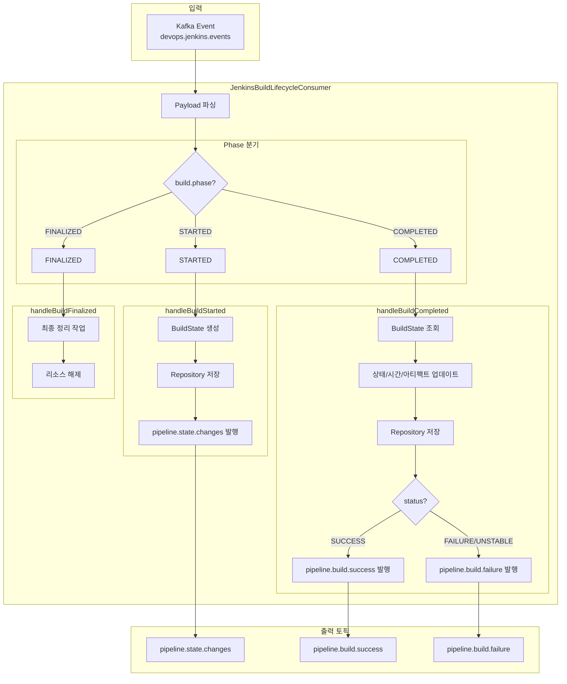
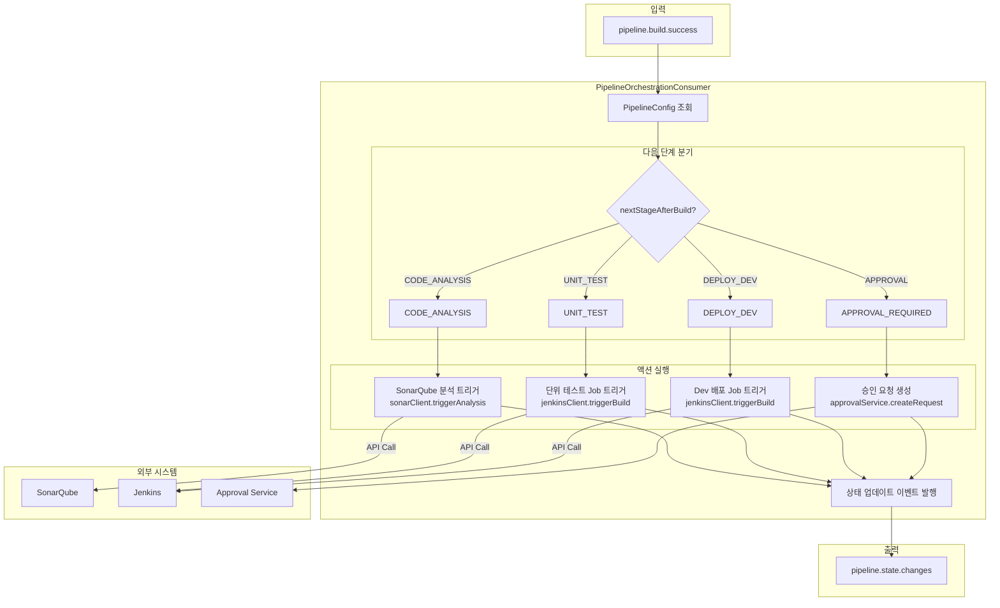
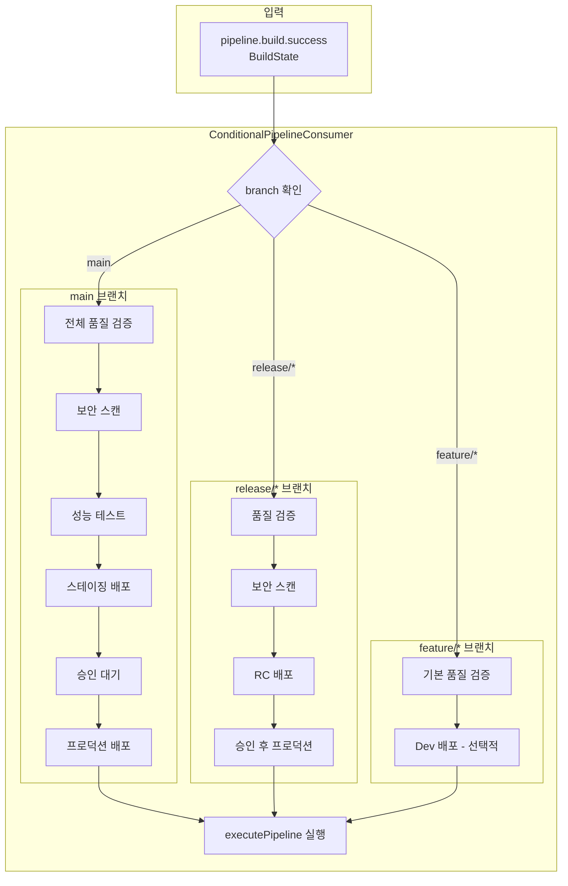

# 2. 빌드 라이프사이클 및 오케스트레이션

## 2-1. 빌드 라이프사이클 추적 (BuildLifecycleConsumer)

```mermaid
flowchart TB
    subgraph Input["입력"]
        KAFKA_EVENT[Kafka Event<br/>devops.jenkins.events]
    end

    subgraph Consumer["JenkinsBuildLifecycleConsumer"]
        PARSE[Payload 파싱]
        
        subgraph PhaseCheck["Phase 분기"]
            CHECK{build.phase?}
            STARTED[STARTED]
            COMPLETED[COMPLETED]
            FINALIZED[FINALIZED]
        end
        
        subgraph StartedHandler["handleBuildStarted"]
            S1[BuildState 생성]
            S2[Repository 저장]
            S3[pipeline.state.changes 발행]
        end
        
        subgraph CompletedHandler["handleBuildCompleted"]
            C1[BuildState 조회]
            C2[상태/시간/아티팩트 업데이트]
            C3[Repository 저장]
            C4{status?}
            C5[pipeline.build.success 발행]
            C6[pipeline.build.failure 발행]
        end
        
        subgraph FinalizedHandler["handleBuildFinalized"]
            F1[최종 정리 작업]
            F2[리소스 해제]
        end
    end

    subgraph Output["출력 토픽"]
        OUT1[pipeline.state.changes]
        OUT2[pipeline.build.success]
        OUT3[pipeline.build.failure]
    end

    KAFKA_EVENT --> PARSE
    PARSE --> CHECK
    
    CHECK -->|STARTED| STARTED
    CHECK -->|COMPLETED| COMPLETED
    CHECK -->|FINALIZED| FINALIZED
    
    STARTED --> S1 --> S2 --> S3 --> OUT1
    
    COMPLETED --> C1 --> C2 --> C3 --> C4
    C4 -->|SUCCESS| C5 --> OUT2
    C4 -->|FAILURE/UNSTABLE| C6 --> OUT3
    
    FINALIZED --> F1 --> F2
```

---

## 2-2. 파이프라인 오케스트레이션 (PipelineOrchestrationConsumer)

```mermaid
flowchart TB
    subgraph Input["입력"]
        SUCCESS_EVENT[pipeline.build.success]
    end

    subgraph Consumer["PipelineOrchestrationConsumer"]
        GET_CONFIG[PipelineConfig 조회]
        
        subgraph NextStage["다음 단계 분기"]
            STAGE_CHECK{nextStageAfterBuild?}
            CODE_ANALYSIS[CODE_ANALYSIS]
            UNIT_TEST[UNIT_TEST]
            DEPLOY_DEV[DEPLOY_DEV]
            APPROVAL[APPROVAL_REQUIRED]
        end
        
        subgraph Actions["액션 실행"]
            A1[SonarQube 분석 트리거<br/>sonarClient.triggerAnalysis]
            A2[단위 테스트 Job 트리거<br/>jenkinsClient.triggerBuild]
            A3[Dev 배포 Job 트리거<br/>jenkinsClient.triggerBuild]
            A4[승인 요청 생성<br/>approvalService.createRequest]
        end
        
        STATE_UPDATE[상태 업데이트 이벤트 발행]
    end

    subgraph External["외부 시스템"]
        SONAR[SonarQube]
        JENKINS[Jenkins]
        APPROVAL_SVC[Approval Service]
    end

    subgraph Output["출력"]
        STATE_TOPIC[pipeline.state.changes]
    end

    SUCCESS_EVENT --> GET_CONFIG
    GET_CONFIG --> STAGE_CHECK
    
    STAGE_CHECK -->|CODE_ANALYSIS| CODE_ANALYSIS --> A1
    STAGE_CHECK -->|UNIT_TEST| UNIT_TEST --> A2
    STAGE_CHECK -->|DEPLOY_DEV| DEPLOY_DEV --> A3
    STAGE_CHECK -->|APPROVAL| APPROVAL --> A4
    
    A1 -->|API Call| SONAR
    A2 -->|API Call| JENKINS
    A3 -->|API Call| JENKINS
    A4 --> APPROVAL_SVC
    
    A1 --> STATE_UPDATE
    A2 --> STATE_UPDATE
    A3 --> STATE_UPDATE
    A4 --> STATE_UPDATE
    
    STATE_UPDATE --> STATE_TOPIC
```

---

## 2-3. 조건부 파이프라인 실행 (ConditionalPipelineConsumer)

```mermaid
flowchart TB
    subgraph Input["입력"]
        EVENT[pipeline.build.success<br/>BuildState]
    end

    subgraph Consumer["ConditionalPipelineConsumer"]
        BRANCH_CHECK{branch 확인}
        
        subgraph MainPipeline["main 브랜치"]
            M1[전체 품질 검증]
            M2[보안 스캔]
            M3[성능 테스트]
            M4[스테이징 배포]
            M5[승인 대기]
            M6[프로덕션 배포]
        end
        
        subgraph ReleasePipeline["release/* 브랜치"]
            R1[품질 검증]
            R2[보안 스캔]
            R3[RC 배포]
            R4[승인 후 프로덕션]
        end
        
        subgraph FeaturePipeline["feature/* 브랜치"]
            F1[기본 품질 검증]
            F2[Dev 배포 - 선택적]
        end
        
        EXECUTE[executePipeline 실행]
    end

    EVENT --> BRANCH_CHECK
    
    BRANCH_CHECK -->|main| M1
    M1 --> M2 --> M3 --> M4 --> M5 --> M6
    M6 --> EXECUTE
    
    BRANCH_CHECK -->|release/*| R1
    R1 --> R2 --> R3 --> R4
    R4 --> EXECUTE
    
    BRANCH_CHECK -->|feature/*| F1
    F1 --> F2
    F2 --> EXECUTE
```
