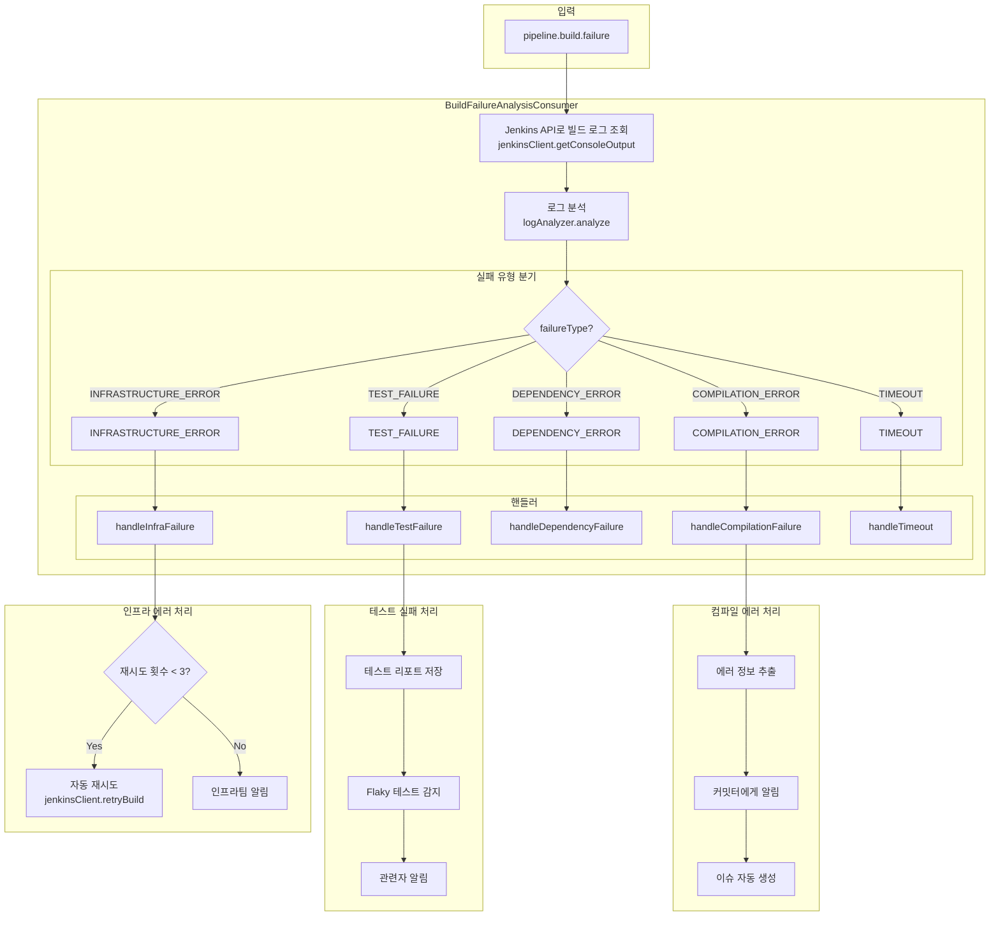
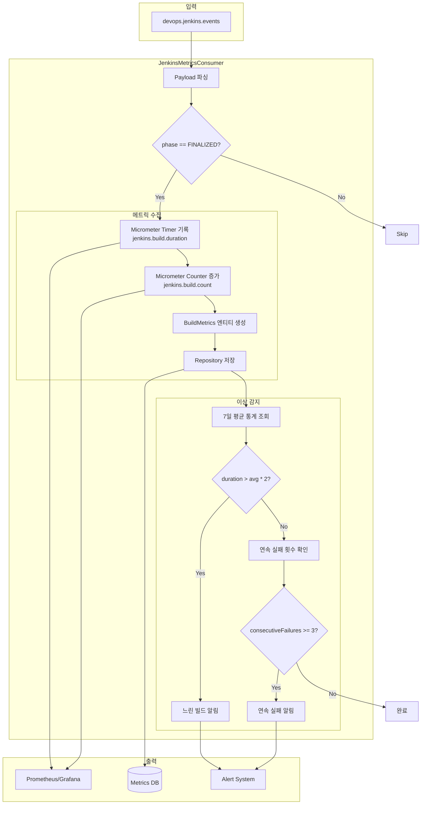

# 3. 실패 분석 및 메트릭 수집

## 3-1. 빌드 실패 분석 (BuildFailureAnalysisConsumer)

```mermaid
flowchart TB
    subgraph Input["입력"]
        FAILURE_EVENT[pipeline.build.failure]
    end

    subgraph Consumer["BuildFailureAnalysisConsumer"]
        GET_LOG[Jenkins API로 빌드 로그 조회<br/>jenkinsClient.getConsoleOutput]
        
        ANALYZE[로그 분석<br/>logAnalyzer.analyze]
        
        subgraph FailureType["실패 유형 분기"]
            TYPE_CHECK{failureType?}
            COMPILE[COMPILATION_ERROR]
            TEST[TEST_FAILURE]
            DEP[DEPENDENCY_ERROR]
            INFRA[INFRASTRUCTURE_ERROR]
            TIMEOUT[TIMEOUT]
        end
        
        subgraph Handlers["핸들러"]
            H_COMPILE[handleCompilationFailure]
            H_TEST[handleTestFailure]
            H_DEP[handleDependencyFailure]
            H_INFRA[handleInfraFailure]
            H_TIMEOUT[handleTimeout]
        end
    end

    subgraph CompileHandler["컴파일 에러 처리"]
        CE1[에러 정보 추출]
        CE2[커밋터에게 알림]
        CE3[이슈 자동 생성]
    end

    subgraph TestHandler["테스트 실패 처리"]
        TE1[테스트 리포트 저장]
        TE2[Flaky 테스트 감지]
        TE3[관련자 알림]
    end

    subgraph InfraHandler["인프라 에러 처리"]
        IE1{재시도 횟수 < 3?}
        IE2[자동 재시도<br/>jenkinsClient.retryBuild]
        IE3[인프라팀 알림]
    end

    FAILURE_EVENT --> GET_LOG --> ANALYZE --> TYPE_CHECK
    
    TYPE_CHECK -->|COMPILATION_ERROR| COMPILE --> H_COMPILE
    TYPE_CHECK -->|TEST_FAILURE| TEST --> H_TEST
    TYPE_CHECK -->|DEPENDENCY_ERROR| DEP --> H_DEP
    TYPE_CHECK -->|INFRASTRUCTURE_ERROR| INFRA --> H_INFRA
    TYPE_CHECK -->|TIMEOUT| TIMEOUT --> H_TIMEOUT
    
    H_COMPILE --> CE1 --> CE2 --> CE3
    H_TEST --> TE1 --> TE2 --> TE3
    H_INFRA --> IE1
    IE1 -->|Yes| IE2
    IE1 -->|No| IE3
```

---

## 3-2. 메트릭 수집 (JenkinsMetricsConsumer)

```mermaid
flowchart TB
    subgraph Input["입력"]
        JENKINS_EVENT[devops.jenkins.events]
    end

    subgraph Consumer["JenkinsMetricsConsumer"]
        PARSE[Payload 파싱]
        
        PHASE_CHECK{phase == FINALIZED?}
        
        subgraph MetricsCollection["메트릭 수집"]
            M1[Micrometer Timer 기록<br/>jenkins.build.duration]
            M2[Micrometer Counter 증가<br/>jenkins.build.count]
            M3[BuildMetrics 엔티티 생성]
            M4[Repository 저장]
        end
        
        subgraph AnomalyDetection["이상 감지"]
            A1[7일 평균 통계 조회]
            A2{duration > avg * 2?}
            A3[느린 빌드 알림]
            A4[연속 실패 횟수 확인]
            A5{consecutiveFailures >= 3?}
            A6[연속 실패 알림]
        end
    end

    subgraph Output["출력"]
        PROMETHEUS[Prometheus/Grafana]
        DB[(Metrics DB)]
        ALERT[Alert System]
    end

    JENKINS_EVENT --> PARSE --> PHASE_CHECK
    
    PHASE_CHECK -->|No| END1[Skip]
    PHASE_CHECK -->|Yes| M1
    
    M1 --> M2 --> M3 --> M4
    M4 --> A1
    
    A1 --> A2
    A2 -->|Yes| A3
    A2 -->|No| A4
    
    A4 --> A5
    A5 -->|Yes| A6
    A5 -->|No| END2[완료]
    
    M1 --> PROMETHEUS
    M2 --> PROMETHEUS
    M4 --> DB
    A3 --> ALERT
    A6 --> ALERT
```
