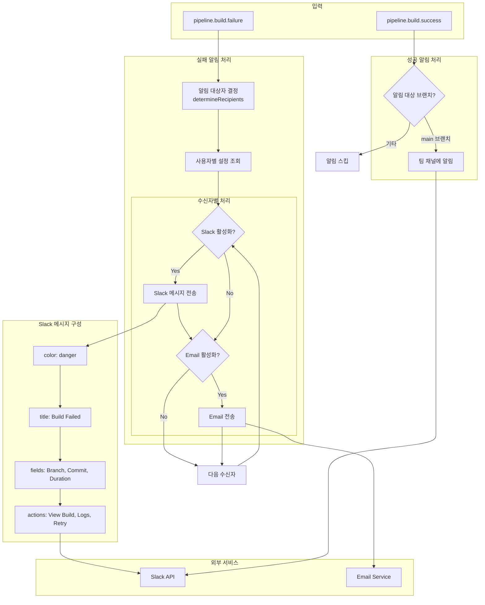
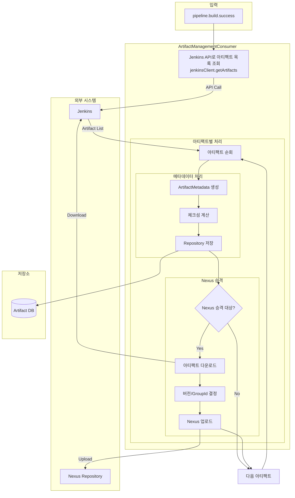

# 4. 알림 및 아티팩트 관리

## 4-1. 알림 처리 (JenkinsNotificationConsumer)

```mermaid
flowchart TB
    subgraph Input["입력"]
        FAILURE[pipeline.build.failure]
        SUCCESS[pipeline.build.success]
    end

    subgraph FailureNotification["실패 알림 처리"]
        F1[알림 대상자 결정<br/>determineRecipients]
        F2[사용자별 설정 조회]
        
        subgraph RecipientLoop["수신자별 처리"]
            F3{Slack 활성화?}
            F4[Slack 메시지 전송]
            F5{Email 활성화?}
            F6[Email 전송]
        end
    end

    subgraph SuccessNotification["성공 알림 처리"]
        S1{알림 대상 브랜치?}
        S2[팀 채널에 알림]
    end

    subgraph SlackMessage["Slack 메시지 구성"]
        SM1[color: danger]
        SM2[title: Build Failed]
        SM3[fields: Branch, Commit, Duration]
        SM4[actions: View Build, Logs, Retry]
    end

    subgraph External["외부 서비스"]
        SLACK[Slack API]
        EMAIL[Email Service]
    end

    FAILURE --> F1 --> F2 --> F3
    F3 -->|Yes| F4 --> F5
    F3 -->|No| F5
    F5 -->|Yes| F6
    F5 -->|No| NEXT[다음 수신자]
    F6 --> NEXT
    NEXT --> F3
    
    F4 --> SM1 --> SM2 --> SM3 --> SM4
    SM4 --> SLACK
    F6 --> EMAIL
    
    SUCCESS --> S1
    S1 -->|main 브랜치| S2 --> SLACK
    S1 -->|기타| SKIP[알림 스킵]
```

---

## 4-2. 아티팩트 관리 (ArtifactManagementConsumer)

```mermaid
flowchart TB
    subgraph Input["입력"]
        SUCCESS_EVENT[pipeline.build.success]
    end

    subgraph Consumer["ArtifactManagementConsumer"]
        GET_ARTIFACTS[Jenkins API로 아티팩트 목록 조회<br/>jenkinsClient.getArtifacts]
        
        subgraph ArtifactLoop["아티팩트별 처리"]
            LOOP_START[아티팩트 순회]
            
            subgraph MetadataProcess["메타데이터 처리"]
                META1[ArtifactMetadata 생성]
                META2[체크섬 계산]
                META3[Repository 저장]
            end
            
            subgraph NexusPromotion["Nexus 승격"]
                N1{Nexus 승격 대상?}
                N2[아티팩트 다운로드]
                N3[버전/GroupId 결정]
                N4[Nexus 업로드]
            end
        end
    end

    subgraph External["외부 시스템"]
        JENKINS[Jenkins]
        NEXUS[Nexus Repository]
    end

    subgraph Storage["저장소"]
        DB[(Artifact DB)]
    end

    SUCCESS_EVENT --> GET_ARTIFACTS
    GET_ARTIFACTS -->|API Call| JENKINS
    JENKINS -->|Artifact List| LOOP_START
    
    LOOP_START --> META1 --> META2 --> META3 --> DB
    META3 --> N1
    
    N1 -->|Yes| N2
    N2 -->|Download| JENKINS
    N2 --> N3 --> N4
    N4 -->|Upload| NEXUS
    
    N1 -->|No| NEXT[다음 아티팩트]
    N4 --> NEXT
    NEXT --> LOOP_START
```
