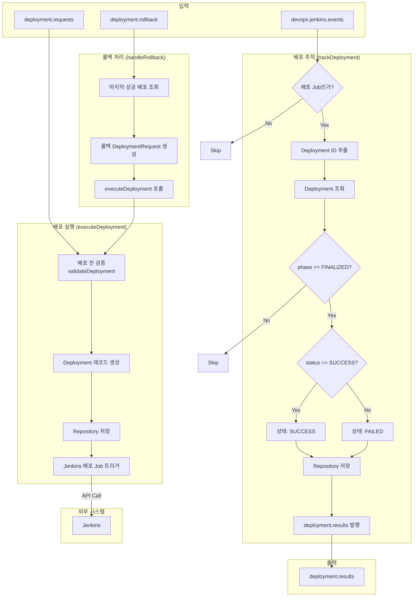
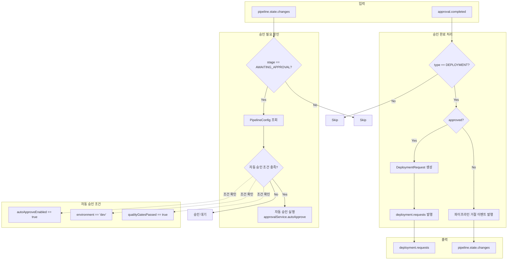
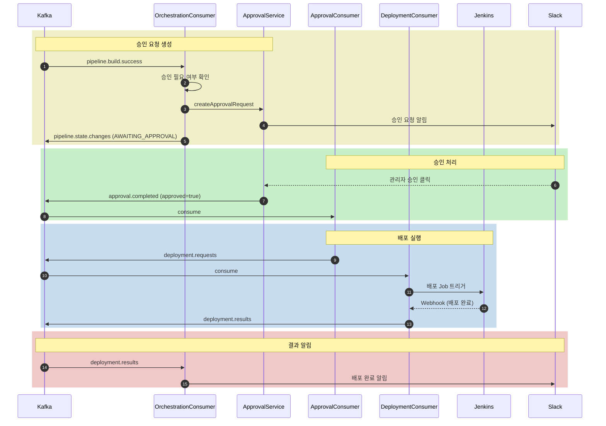

# 5. 배포 및 승인 워크플로우

## 5-1. 배포 트리거 및 관리 (DeploymentConsumer)

```mermaid
flowchart TB
    subgraph Input["입력"]
        DEPLOY_REQ[deployment.requests]
        JENKINS_EVENT[devops.jenkins.events]
        ROLLBACK_REQ[deployment.rollback]
    end

    subgraph ExecuteDeployment["배포 실행 (executeDeployment)"]
        E1[배포 전 검증<br/>validateDeployment]
        E2[Deployment 레코드 생성]
        E3[Repository 저장]
        E4[Jenkins 배포 Job 트리거]
    end

    subgraph TrackDeployment["배포 추적 (trackDeployment)"]
        T1{배포 Job인가?}
        T2[Deployment ID 추출]
        T3[Deployment 조회]
        T4{phase == FINALIZED?}
        T5{status == SUCCESS?}
        T6[상태: SUCCESS]
        T7[상태: FAILED]
        T8[Repository 저장]
        T9[deployment.results 발행]
    end

    subgraph HandleRollback["롤백 처리 (handleRollback)"]
        R1[마지막 성공 배포 조회]
        R2[롤백 DeploymentRequest 생성]
        R3[executeDeployment 호출]
    end

    subgraph External["외부 시스템"]
        JENKINS[Jenkins]
    end

    subgraph Output["출력"]
        RESULTS[deployment.results]
    end

    DEPLOY_REQ --> E1 --> E2 --> E3 --> E4
    E4 -->|API Call| JENKINS

    JENKINS_EVENT --> T1
    T1 -->|No| SKIP1[Skip]
    T1 -->|Yes| T2 --> T3 --> T4
    T4 -->|No| SKIP2[Skip]
    T4 -->|Yes| T5
    T5 -->|Yes| T6 --> T8
    T5 -->|No| T7 --> T8
    T8 --> T9 --> RESULTS

    ROLLBACK_REQ --> R1 --> R2 --> R3 --> E1
```

---

## 5-2. 승인 워크플로우 연동 (ApprovalIntegrationConsumer)

```mermaid
flowchart TB
    subgraph Input["입력"]
        APPROVAL_DONE[approval.completed]
        STATE_CHANGE[pipeline.state.changes]
    end

    subgraph OnApprovalCompleted["승인 완료 처리"]
        A1{type == DEPLOYMENT?}
        A2{approved?}
        A3[DeploymentRequest 생성]
        A4[deployment.requests 발행]
        A5[파이프라인 거절 이벤트 발행]
    end

    subgraph CheckApprovalRequired["승인 필요 확인"]
        C1{stage == AWAITING_APPROVAL?}
        C2[PipelineConfig 조회]
        C3{자동 승인 조건 충족?}
        C4[자동 승인 실행<br/>approvalService.autoApprove]
    end

    subgraph AutoApproveConditions["자동 승인 조건"]
        COND1[autoApproveEnabled == true]
        COND2[environment == 'dev']
        COND3[qualityGatesPassed == true]
    end

    subgraph Output["출력"]
        DEPLOY_TOPIC[deployment.requests]
        STATE_TOPIC[pipeline.state.changes]
    end

    APPROVAL_DONE --> A1
    A1 -->|No| SKIP1[Skip]
    A1 -->|Yes| A2
    A2 -->|Yes| A3 --> A4 --> DEPLOY_TOPIC
    A2 -->|No| A5 --> STATE_TOPIC

    STATE_CHANGE --> C1
    C1 -->|No| SKIP2[Skip]
    C1 -->|Yes| C2 --> C3
    C3 -->|Yes| C4
    C3 -->|No| WAIT[승인 대기]
    
    C3 -.->|조건 확인| COND1
    C3 -.->|조건 확인| COND2
    C3 -.->|조건 확인| COND3
```

---

## 5-3. 배포-승인 통합 시퀀스

```mermaid
sequenceDiagram
    autonumber
    participant K as Kafka
    participant OC as OrchestrationConsumer
    participant AS as ApprovalService
    participant AC as ApprovalConsumer
    participant DC as DeploymentConsumer
    participant J as Jenkins
    participant Slack as Slack

    rect rgb(240, 240, 200)
        Note over K,AS: 승인 요청 생성
        K->>OC: pipeline.build.success
        OC->>OC: 승인 필요 여부 확인
        OC->>AS: createApprovalRequest
        AS->>Slack: 승인 요청 알림
        OC->>K: pipeline.state.changes (AWAITING_APPROVAL)
    end

    rect rgb(200, 240, 200)
        Note over Slack,AC: 승인 처리
        Slack-->>AS: 관리자 승인 클릭
        AS->>K: approval.completed (approved=true)
        K->>AC: consume
    end

    rect rgb(200, 220, 240)
        Note over AC,J: 배포 실행
        AC->>K: deployment.requests
        K->>DC: consume
        DC->>J: 배포 Job 트리거
        J-->>DC: Webhook (배포 완료)
        DC->>K: deployment.results
    end

    rect rgb(240, 200, 200)
        Note over K,Slack: 결과 알림
        K->>OC: deployment.results
        OC->>Slack: 배포 완료 알림
    end
```
