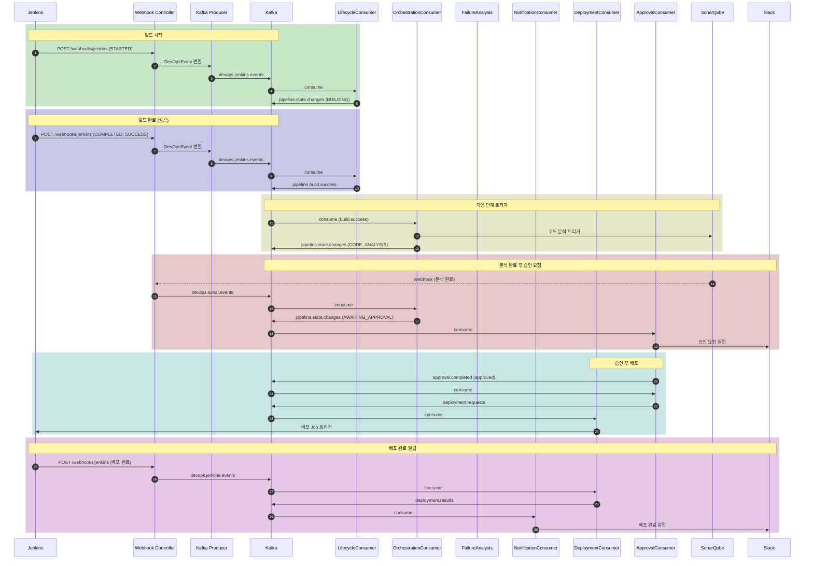
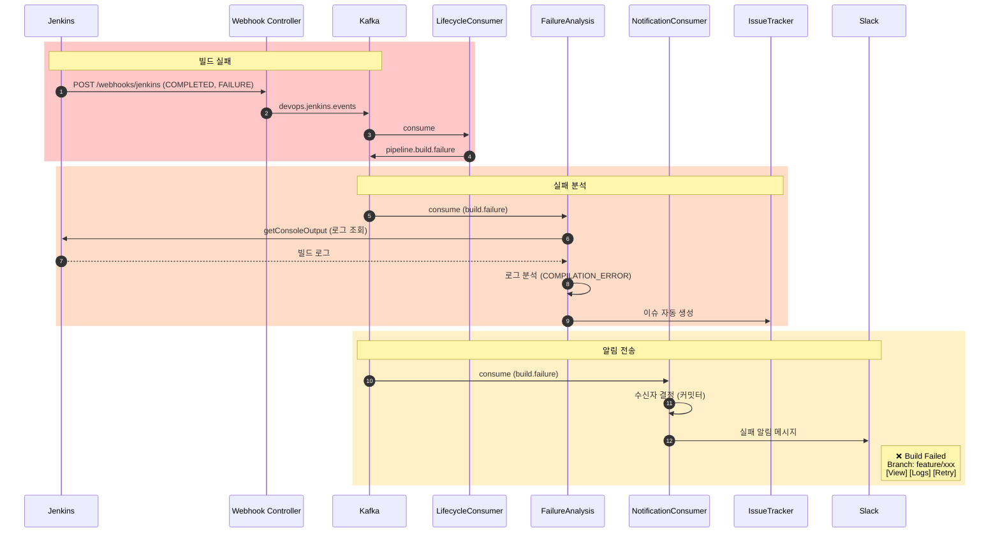
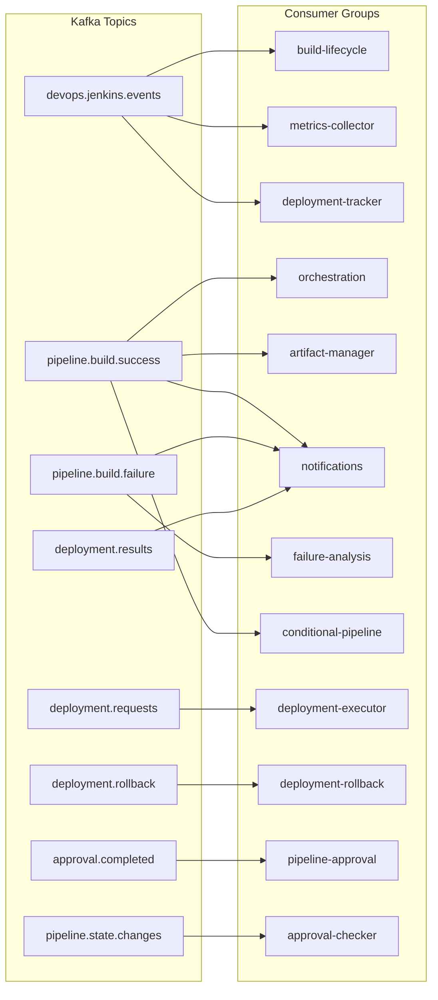
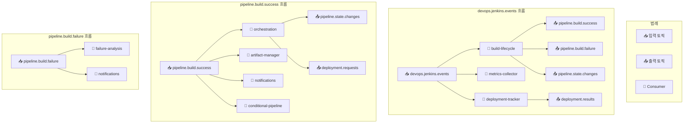
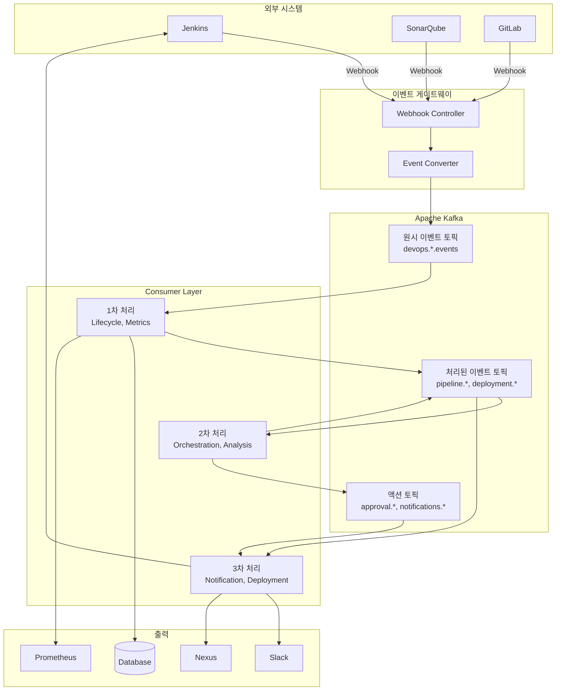

# 6. 전체 시퀀스 및 토픽 매핑

## 6-1. 전체 이벤트 흐름 시퀀스 (성공 시나리오)

```mermaid
sequenceDiagram
    autonumber
    participant J as Jenkins
    participant WH as Webhook Controller
    participant KP as Kafka Producer
    participant K as Kafka
    participant LC as LifecycleConsumer
    participant OC as OrchestrationConsumer
    participant FA as FailureAnalysis
    participant NC as NotificationConsumer
    participant DC as DeploymentConsumer
    participant AC as ApprovalConsumer
    participant SQ as SonarQube
    participant Slack as Slack

    rect rgb(200, 230, 200)
        Note over J,K: 빌드 시작
        J->>WH: POST /webhooks/jenkins (STARTED)
        WH->>KP: DevOpsEvent 변환
        KP->>K: devops.jenkins.events
        K->>LC: consume
        LC->>K: pipeline.state.changes (BUILDING)
    end

    rect rgb(200, 200, 230)
        Note over J,K: 빌드 완료 (성공)
        J->>WH: POST /webhooks/jenkins (COMPLETED, SUCCESS)
        WH->>KP: DevOpsEvent 변환
        KP->>K: devops.jenkins.events
        K->>LC: consume
        LC->>K: pipeline.build.success
    end

    rect rgb(230, 230, 200)
        Note over K,SQ: 다음 단계 트리거
        K->>OC: consume (build.success)
        OC->>SQ: 코드 분석 트리거
        OC->>K: pipeline.state.changes (CODE_ANALYSIS)
    end

    rect rgb(230, 200, 200)
        Note over K,Slack: 분석 완료 후 승인 요청
        SQ-->>WH: Webhook (분석 완료)
        WH->>K: devops.sonar.events
        K->>OC: consume
        OC->>K: pipeline.state.changes (AWAITING_APPROVAL)
        K->>AC: consume
        AC->>Slack: 승인 요청 알림
    end

    rect rgb(200, 230, 230)
        Note over AC,DC: 승인 후 배포
        AC->>K: approval.completed (approved)
        K->>AC: consume
        AC->>K: deployment.requests
        K->>DC: consume
        DC->>J: 배포 Job 트리거
    end

    rect rgb(230, 200, 230)
        Note over J,Slack: 배포 완료 알림
        J->>WH: POST /webhooks/jenkins (배포 완료)
        WH->>K: devops.jenkins.events
        K->>DC: consume
        DC->>K: deployment.results
        K->>NC: consume
        NC->>Slack: 배포 완료 알림
    end
```

---

## 6-2. 실패 시나리오 시퀀스

```mermaid
sequenceDiagram
    autonumber
    participant J as Jenkins
    participant WH as Webhook Controller
    participant K as Kafka
    participant LC as LifecycleConsumer
    participant FA as FailureAnalysis
    participant NC as NotificationConsumer
    participant IT as IssueTracker
    participant Slack as Slack

    rect rgb(255, 200, 200)
        Note over J,K: 빌드 실패
        J->>WH: POST /webhooks/jenkins (COMPLETED, FAILURE)
        WH->>K: devops.jenkins.events
        K->>LC: consume
        LC->>K: pipeline.build.failure
    end

    rect rgb(255, 220, 200)
        Note over K,IT: 실패 분석
        K->>FA: consume (build.failure)
        FA->>J: getConsoleOutput (로그 조회)
        J-->>FA: 빌드 로그
        FA->>FA: 로그 분석 (COMPILATION_ERROR)
        FA->>IT: 이슈 자동 생성
    end

    rect rgb(255, 240, 200)
        Note over K,Slack: 알림 전송
        K->>NC: consume (build.failure)
        NC->>NC: 수신자 결정 (커밋터)
        NC->>Slack: 실패 알림 메시지
        Note right of Slack: ❌ Build Failed<br/>Branch: feature/xxx<br/>[View] [Logs] [Retry]
    end
```

---

## 6-3. Consumer Group 및 토픽 매핑

```mermaid
flowchart LR
    subgraph Topics["Kafka Topics"]
        T1[devops.jenkins.events]
        T2[pipeline.build.success]
        T3[pipeline.build.failure]
        T4[pipeline.state.changes]
        T5[deployment.requests]
        T6[deployment.results]
        T7[deployment.rollback]
        T8[approval.completed]
    end

    subgraph ConsumerGroups["Consumer Groups"]
        CG1[build-lifecycle]
        CG2[metrics-collector]
        CG3[deployment-tracker]
        CG4[orchestration]
        CG5[artifact-manager]
        CG6[notifications]
        CG7[failure-analysis]
        CG8[conditional-pipeline]
        CG9[deployment-executor]
        CG10[deployment-rollback]
        CG11[pipeline-approval]
        CG12[approval-checker]
    end

    T1 --> CG1
    T1 --> CG2
    T1 --> CG3
    
    T2 --> CG4
    T2 --> CG5
    T2 --> CG6
    T2 --> CG8
    
    T3 --> CG6
    T3 --> CG7
    
    T4 --> CG12
    
    T5 --> CG9
    
    T6 --> CG6
    
    T7 --> CG10
    
    T8 --> CG11
```

---

## 6-4. 토픽-Consumer 상세 매핑 테이블

```mermaid
flowchart TB
    subgraph Legend["범례"]
        direction LR
        L1[📥 입력 토픽]
        L2[📤 출력 토픽]
        L3[🔄 Consumer]
    end

    subgraph T1Flow["devops.jenkins.events 흐름"]
        T1_IN[📥 devops.jenkins.events]
        
        T1_C1[🔄 build-lifecycle]
        T1_C2[🔄 metrics-collector]
        T1_C3[🔄 deployment-tracker]
        
        T1_OUT1[📤 pipeline.build.success]
        T1_OUT2[📤 pipeline.build.failure]
        T1_OUT3[📤 pipeline.state.changes]
        T1_OUT4[📤 deployment.results]
        
        T1_IN --> T1_C1
        T1_IN --> T1_C2
        T1_IN --> T1_C3
        
        T1_C1 --> T1_OUT1
        T1_C1 --> T1_OUT2
        T1_C1 --> T1_OUT3
        T1_C3 --> T1_OUT4
    end

    subgraph T2Flow["pipeline.build.success 흐름"]
        T2_IN[📥 pipeline.build.success]
        
        T2_C1[🔄 orchestration]
        T2_C2[🔄 artifact-manager]
        T2_C3[🔄 notifications]
        T2_C4[🔄 conditional-pipeline]
        
        T2_OUT1[📤 pipeline.state.changes]
        T2_OUT2[📤 deployment.requests]
        
        T2_IN --> T2_C1
        T2_IN --> T2_C2
        T2_IN --> T2_C3
        T2_IN --> T2_C4
        
        T2_C1 --> T2_OUT1
        T2_C1 --> T2_OUT2
    end

    subgraph T3Flow["pipeline.build.failure 흐름"]
        T3_IN[📥 pipeline.build.failure]
        
        T3_C1[🔄 failure-analysis]
        T3_C2[🔄 notifications]
        
        T3_IN --> T3_C1
        T3_IN --> T3_C2
    end
```

---

## 6-5. 전체 데이터 흐름 요약

```mermaid
flowchart TB
    subgraph External["외부 시스템"]
        JENKINS[Jenkins]
        SONAR[SonarQube]
        GITLAB[GitLab]
    end

    subgraph Gateway["이벤트 게이트웨이"]
        WH[Webhook Controller]
        CONV[Event Converter]
    end

    subgraph Kafka["Apache Kafka"]
        RAW[원시 이벤트 토픽<br/>devops.*.events]
        PROCESSED[처리된 이벤트 토픽<br/>pipeline.*, deployment.*]
        ACTION[액션 토픽<br/>approval.*, notifications.*]
    end

    subgraph Consumers["Consumer Layer"]
        PRIMARY[1차 처리<br/>Lifecycle, Metrics]
        SECONDARY[2차 처리<br/>Orchestration, Analysis]
        TERTIARY[3차 처리<br/>Notification, Deployment]
    end

    subgraph Outputs["출력"]
        DB[(Database)]
        METRICS[Prometheus]
        SLACK[Slack]
        NEXUS[Nexus]
    end

    JENKINS -->|Webhook| WH
    SONAR -->|Webhook| WH
    GITLAB -->|Webhook| WH
    
    WH --> CONV --> RAW
    
    RAW --> PRIMARY
    PRIMARY --> PROCESSED
    
    PROCESSED --> SECONDARY
    SECONDARY --> PROCESSED
    SECONDARY --> ACTION
    
    ACTION --> TERTIARY
    PROCESSED --> TERTIARY
    
    PRIMARY --> DB
    PRIMARY --> METRICS
    TERTIARY --> SLACK
    TERTIARY --> NEXUS
    TERTIARY --> JENKINS
```
