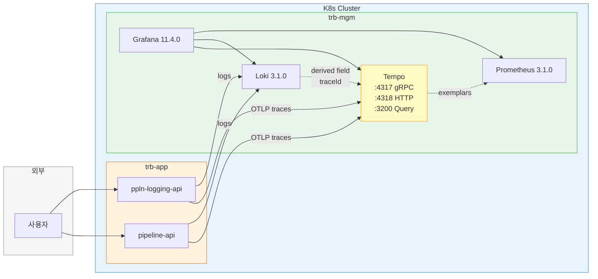
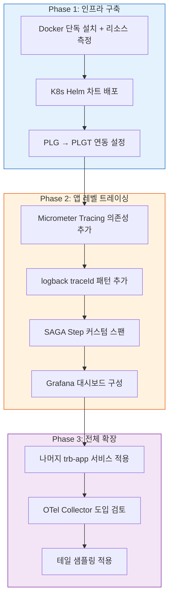

# Grafana Tempo 도입 조사

> 작성일: 2026-03-13 | 목적: TPS 개발계에 분산 트레이싱 도입을 위한 Tempo 설치 절차, 리소스 측정, 연동 방안 조사

---

## 목표

TPS 개발계에는 분산 트레이싱이 전혀 없다. PLG 스택(Prometheus 3.1.0 + Loki 3.1.0 + Grafana 11.4.0)이 `trb-mgm` 네임스페이스에서 운영 중이므로, Tempo를 추가하면 PLGT 스택으로 확장된다. 이 문서는 Tempo 단독 설치 절차와 리소스 측정 방법, 그리고 pipeline-api + ppln-logging-api 모듈에 트레이싱을 적용하는 흐름을 정리한다.

**범위:** 조사 + 문서화만. 실제 서버 실행, 코드 변경, 매니페스트 배포는 하지 않는다.

**사전 적용 대상:**
- `pipeline-api` — SAGA Orchestrator 기반 파이프라인 CRUD + 트리거 실행
- `ppln-logging-api` — 파이프라인 로그 수집/조회

두 모듈 모두 현재 Micrometer Tracing 의존성이 없고, logback에 traceId 패턴도 없으므로 처음부터 셋업이 필요하다.

---

## 핵심 개념

### 1. Tempo란

Grafana Labs가 개발한 오픈소스 분산 트레이싱 백엔드다. OTLP, Jaeger, Zipkin 프로토콜로 스팬을 수신하고 오브젝트 스토리지에 저장한다. Elasticsearch나 Cassandra 같은 인덱싱 엔진이 필요 없고 traceID 기반 조회만 지원하기 때문에 리소스 효율이 높다.

Jaeger나 Zipkin 같은 기존 트레이싱 백엔드와의 핵심 차이는 **인덱스 없는 설계**에 있다. 전통적인 트레이싱 백엔드는 서비스명, 오퍼레이션명, 태그 등으로 스팬을 인덱싱해서 검색할 수 있게 하지만, 그만큼 스토리지와 CPU를 많이 소모한다. Tempo는 traceID를 알고 있어야 조회가 가능한 대신, 인덱싱 비용이 0이다. "traceID를 어디서 얻느냐?"는 Loki 로그에서 추출하거나 Grafana의 exemplar 링크로 해결한다. PLG 스택이 이미 있는 TPS 환경에서 이 접근이 자연스럽게 맞아떨어진다.

내부 컴포넌트는 다음과 같다:

| 컴포넌트 | 역할 |
|----------|------|
| **distributor** | 스팬 수신, 해싱으로 ingester에 분배 |
| **ingester** | WAL에 스팬 기록, 주기적으로 블록으로 플러시 |
| **compactor** | 블록 병합, 만료 블록 삭제 |
| **querier** | traceID로 스팬 조회 |
| **query-frontend** | 쿼리 분할, 캐싱 (선택) |

### 2. 배포 모드

Tempo는 세 가지 배포 모드를 제공한다. 선택 기준은 수신 트래픽 MB/s이며, 공식 문서는 spans/sec가 아닌 이 단위로 사이징 가이드를 제시한다.

| 모드 | 구조 | 적합 환경 | 처리량 |
|------|------|----------|--------|
| **Monolithic** | 단일 바이너리에 모든 컴포넌트 실행 | 개발/테스트, 소규모 프로덕션 | ~수 MB/s |
| **Simple Scalable** | 읽기(querier) / 쓰기(distributor+ingester) 2그룹 분리 | 중간 규모 | ~수십 MB/s |
| **Microservices** | 각 컴포넌트가 독립 Pod | 대규모 프로덕션 | ~수백 MB/s |

Monolithic는 모든 컴포넌트가 한 프로세스에서 실행되어 설정이 단순하고 디버깅이 쉽다. 단, 수평 확장이 제한적이라 트래픽이 커지면 Simple Scalable로 전환해야 한다.

TPS 개발계는 `trb-app`에 12개 서비스가 있고 트래픽이 낮으므로 **Monolithic(standalone)** 이 적합하다.

### 3. 목표 아키텍처



### 4. 도입 경로



---

## 실습 절차

### 섹션 1: Docker 단독 설치 (Deploy VM)

설치 대상 서버는 `tr-dev-trb-deploy`(10.255.17.235, 4C/8G/500GB)다. 이 서버는 Bastion/HAProxy/Dnsmasq 역할을 하며, Docker가 설치되어 있어 단독 검증에 적합하다.

#### 1-1. Harbor에 이미지 Push

TPS는 외부 레지스트리 직접 참조 대신 Harbor 내부 레지스트리를 사용한다. Tempo 이미지도 Harbor에 push해야 한다.

```bash
# 태그 존재 확인 (교훈: 미존재 태그가 전체 compose를 실패시킨다)
docker manifest inspect grafana/tempo:2.7.2

# pull → tag → push
docker pull grafana/tempo:2.7.2
docker tag grafana/tempo:2.7.2 harbor.dev.trb.com/trb/tempo:2.7.2
docker push harbor.dev.trb.com/trb/tempo:2.7.2
```

> 버전 선택 근거: 2.7.x는 2025년 상반기 안정 릴리스다. 2.6+ 부터 TraceQL 메트릭, vParquet4 포맷이 안정화되었다. 최신 마이너 버전을 확인하고 `docker manifest inspect`로 존재를 검증한 후 지정할 것.

#### 1-2. tempo.yaml 작성

```yaml
# /opt/tempo/tempo.yaml
server:
  http_listen_port: 3200

multitenancy_enabled: false

distributor:
  receivers:
    otlp:
      protocols:
        grpc:
          endpoint: 0.0.0.0:4317
        http:
          endpoint: 0.0.0.0:4318

ingester:
  lifecycler:
    ring:
      replication_factor: 1   # standalone이므로 1 고정

compactor:
  compaction:
    block_retention: 336h     # 14일 보존

storage:
  trace:
    backend: local
    local:
      path: /var/tempo/traces
    wal:
      path: /var/tempo/wal
```

`replication_factor: 1`인 이유는 standalone 모드에서 ingester가 1개뿐이기 때문이다. 이 값을 2 이상으로 올리면 두 번째 ingester를 찾지 못해 distributor가 스팬 수신을 거부한다.

`block_retention: 336h`(14일)은 개발계에서 충분한 보존 기간이다. 기본값은 48시간인데, 금요일에 발생한 이슈를 월요일에 조사할 때 이미 데이터가 없는 상황을 방지하기 위해 14일로 설정한다.

#### 1-3. Docker 실행

```bash
# 데이터 디렉토리 생성
sudo mkdir -p /opt/tempo/data

# 실행
docker run -d \
  --name tempo \
  --restart unless-stopped \
  -v /opt/tempo/tempo.yaml:/etc/tempo.yaml:ro \
  -v /opt/tempo/data:/var/tempo \
  -p 3200:3200 \
  -p 4317:4317 \
  -p 4318:4318 \
  harbor.dev.trb.com/trb/tempo:2.7.2 \
  -config.file=/etc/tempo.yaml

# health check
curl -s http://localhost:3200/ready
# 정상: "ready"
```

#### 1-4. 합성 트레이스 생성 + 리소스 측정

`jaeger-tracegen`은 OTLP gRPC를 지원하는 합성 트레이스 생성 도구다.

```bash
# tracegen 이미지 pull
docker pull jaegertracing/jaeger-tracegen:latest

# idle 상태 측정 (30분)
docker stats tempo --no-stream --format "{{.CPUPerc}}\t{{.MemUsage}}"

# 100 spans/s 부하
docker run --rm --network host \
  jaegertracing/jaeger-tracegen \
  -traces 1000 -workers 10 \
  -otlp-endpoint localhost:4317 -otlp-insecure

# 1000 spans/s 부하 (workers 증가)
docker run --rm --network host \
  jaegertracing/jaeger-tracegen \
  -traces 10000 -workers 50 \
  -otlp-endpoint localhost:4317 -otlp-insecure
```

#### 1-5. 측정 기록 템플릿

30분 간격으로 `docker stats`와 `du -sh`를 실행해서 아래 테이블을 채운다.

```bash
# CPU/Memory 측정
docker stats tempo --no-stream --format "table {{.Name}}\t{{.CPUPerc}}\t{{.MemUsage}}\t{{.NetIO}}"

# 디스크 사용량
du -sh /opt/tempo/data/
du -sh /opt/tempo/data/traces/
du -sh /opt/tempo/data/wal/
```

| 시점 | 부하 | CPU% | Memory | Disk (traces) | Disk (WAL) |
|------|------|------|--------|--------------|------------|
| T+0 | idle | | | | |
| T+10m | idle | | | | |
| T+30m | 100 spans/s | | | | |
| T+60m | 100 spans/s | | | | |
| T+90m | 1000 spans/s | | | | |
| T+120m | 1000 spans/s | | | | |

#### 1-6. 트레이스 조회 검증

```bash
# 최근 트레이스 목록 (Tempo HTTP API)
curl -s http://localhost:3200/api/search | jq '.traces[:3]'

# 특정 traceID로 조회
curl -s http://localhost:3200/api/traces/<TRACE_ID> | jq '.batches | length'
```

---

### 섹션 2: K8s 설치 — Helm + App of Apps 패턴

TPS manifest는 Helm + ArgoCD App of Apps 패턴으로 관리된다. 새 서비스 추가 절차는 `tps-manifest-helm-차트-추가-가이드.md`에 문서화되어 있으며, Tempo도 동일 패턴을 따른다.

#### 2-1. 기존 구조

```
tps_manifest/
├── helm-charts/
│   ├── tps-helm/              # Umbrella chart (16개 서브차트)
│   │   └── values/values-dev.yaml
│   ├── ppln-logging-api/      # 독립 Helm chart
│   ├── kube-prometheus-stack/  # Prometheus + Grafana
│   ├── loki-stack/            # Loki + Promtail
│   └── alloy/                 # Grafana Alloy (로그 수집)
├── argocd-apps/
│   └── app-of-apps/
│       ├── dev/
│       │   └── trb-mgm-application.yaml
│       └── charts/
│           └── trb-mgm/
│               ├── templates/         # 서비스별 ArgoCD Application 템플릿
│               └── values-dev.yaml    # 서비스 활성화 블록
└── kubernetes-manifests/
    └── custom-resources/
        └── servicemonitors/
```

Tempo를 추가할 때 건드려야 하는 파일은 세 곳이다:

1. `helm-charts/tempo/` — 실제 K8s 리소스 차트
2. `argocd-apps/app-of-apps/charts/trb-mgm/templates/tempo.yaml` — ArgoCD Application 템플릿
3. `argocd-apps/app-of-apps/charts/trb-mgm/values-dev.yaml` — 서비스 블록 추가

#### 2-2. Helm 차트 준비

```bash
# 방법 A: 공식 차트 pull (권장)
helm repo add grafana https://grafana.github.io/helm-charts
helm repo update
helm pull grafana/tempo --version 1.14.0 --untar --untardir helm-charts/

# 환경별 values 생성
cd helm-charts/tempo/
touch values-dev.yaml
```

`values-dev.yaml` (기본값과 다른 부분만):

```yaml
# helm-charts/tempo/values-dev.yaml
tempo:
  storage:
    trace:
      backend: local
      local:
        path: /var/tempo/traces
      wal:
        path: /var/tempo/wal
  retention: 336h        # 14일
  receivers:
    otlp:
      protocols:
        grpc:
          endpoint: 0.0.0.0:4317
        http:
          endpoint: 0.0.0.0:4318

  resources:
    requests:
      cpu: 250m
      memory: 512Mi
    limits:
      cpu: "1"
      memory: 2Gi

persistence:
  enabled: true
  storageClassName: nfs-csi
  size: 10Gi

serviceMonitor:
  enabled: true          # Prometheus가 Tempo 메트릭 수집
```

방법 B(Plain YAML 직접 작성)도 가능하다. ConfigMap(tempo.yaml 내용 동일) + PVC(nfs-csi 10Gi) + Deployment(1 replica, 250m/512Mi ~ 1core/2Gi, readiness `/ready`) + Service(ClusterIP, 3200/4317/4318)를 `kubernetes-manifests/tempo/`에 배치하면 된다. 검증 후 Helm 차트로 전환한다.

#### 2-3. ArgoCD Application 템플릿

기존 loki-stack 템플릿을 복사해서 이름과 참조만 바꾸면 된다.

```yaml
# argocd-apps/app-of-apps/charts/trb-mgm/templates/tempo.yaml
{{- if .Values.tempo.enabled }}
apiVersion: argoproj.io/v1alpha1
kind: Application
metadata:
  name: tempo
  namespace: trb-oss
  finalizers:
    - resources-finalizer.argocd.argoproj.io
spec:
  project: default
  source:
    repoURL: {{ .Values.spec.source.repoURL }}
    targetRevision: {{ .Values.spec.source.targetRevision }}
    path: helm-charts/tempo
    helm:
      valueFiles:
        - values-dev.yaml
  destination:
    server: {{ .Values.spec.destination.server }}
    namespace: trb-mgm
  syncPolicy:
    automated:
      prune: true
      selfHeal: true
{{- end }}
```

```yaml
# argocd-apps/app-of-apps/charts/trb-mgm/values-dev.yaml 에 추가
tempo:
  enabled: true
```

#### 2-4. 배포 검증

```bash
# Helm 렌더링 테스트 (로컬)
helm template tempo helm-charts/tempo/ -f helm-charts/tempo/values-dev.yaml

# ArgoCD Application 렌더링 테스트
helm template trb-mgm argocd-apps/app-of-apps/charts/trb-mgm/ \
  -f argocd-apps/app-of-apps/charts/trb-mgm/values-dev.yaml

# 배포 후 확인
kubectl get pods -n trb-mgm -l app=tempo
kubectl logs -n trb-mgm deployment/tempo --tail=20
curl -s http://tempo.trb-mgm:3200/ready
```

---

### 섹션 3: 공식 권장 스펙 vs 측정값 비교

#### 3-1. 공식 사이징 가이드

Tempo 공식 문서는 distributor 기준으로 10MB/s 수신 트래픽당 CPU 2코어, Memory 2GB를 권장한다. Standalone 모드의 최소 스펙은 다음과 같다:

| 환경 | CPU | Memory | 비고 |
|------|-----|--------|------|
| 개발/테스트 | 2코어 | 2GB | 최소 권장 |
| 소규모 프로덕션 | 4코어 | 4-8GB | ~수 MB/s |

#### 3-2. 스토리지 옵션

| 백엔드 | 적합 환경 | TPS 적용 |
|--------|----------|---------|
| `local` | 개발 전용, 단일 인스턴스 | 초기 검증용 |
| `s3` (MinIO) | 프로덕션 권장, 확장 가능 | `trb-oss`에 MinIO(RELEASE.2024-04-18) 운영 중 |
| `gcs` / `azure` | 클라우드 환경 | 해당 없음 |

local 백엔드는 compactor가 블록을 로컬 파일시스템에 저장하므로 인스턴스가 죽으면 데이터 유실 위험이 있다. 프로덕션에서는 MinIO를 S3 호환 백엔드로 사용해야 하고, TPS에는 이미 MinIO가 있으므로 전환 장벽이 낮다.

`block_retention` 기본값은 48시간이다. compactor는 주기적으로(기본 5분 간격) 만료 블록을 확인하고 삭제한다. 개발계에서는 14일(336h)로 설정해 주중 이슈를 충분히 추적할 수 있게 한다.

#### 3-3. 비교 테이블 (측정 후 채움)

| 지표 | Docker 측정값 | K8s 측정값 | 공식 권장 | 차이 |
|------|-------------|-----------|----------|------|
| CPU (idle) | | | ~0.1 core | |
| CPU (100 spans/s) | | | ~0.25 core | |
| CPU (1000 spans/s) | | | ~0.5 core | |
| Memory (idle) | | | ~256MB | |
| Memory (100 spans/s) | | | ~512MB | |
| Memory (1000 spans/s) | | | ~1GB | |
| Disk/일 (100 spans/s) | | | ~1GB | |

#### 3-4. 클러스터 리소스 여유

Worker 5대의 총 리소스는 36C/64G(8C/16G x 4대 + 4C/8G x 1대)이다. `trb-mgm` 네임스페이스에 21개 Pod가 운영 중이다.

Tempo의 request 스펙 `250m/512Mi`는 전체 클러스터 대비 CPU 0.7%, Memory 0.8%에 불과하다. PLG 스택이 이미 `trb-mgm`에서 안정적으로 돌아가는 상황에서 Tempo 1개 Pod 추가는 리소스 부담이 거의 없다.

---

### 섹션 4: PLG → PLGT 연동 설정

Tempo 도입이 확정되면 기존 PLG 스택과 연동해서 로그↔트레이스↔메트릭 간 상관관계를 연결해야 한다. 이 섹션의 설정들은 확정 시 적용할 내용을 미리 정리한 것이다.

#### 4-1. Grafana Tempo Datasource 프로비저닝

```yaml
# grafana/provisioning/datasources/tempo.yaml
apiVersion: 1
datasources:
  - name: Tempo
    type: tempo
    access: proxy
    url: http://tempo.trb-mgm:3200
    uid: tempo
    jsonData:
      tracesToLogsV2:
        datasourceUid: loki
        filterByTraceID: true
        customQuery: true
        query: '{job="$${__span.tags.service.name}"} | "$${__span.traceId}"'
      tracesToMetrics:
        datasourceUid: prometheus
        tags: [{ key: service.name, value: service }]
      nodeGraph: { enabled: true }
      serviceMap: { datasourceUid: prometheus }
```

`tracesToLogsV2`는 Tempo에서 트레이스를 보다가 클릭 한 번으로 Loki 로그로 이동할 수 있게 한다. `tracesToMetrics`는 해당 서비스의 메트릭 대시보드로 연결한다.

#### 4-2. Loki Derived Fields (Loki → Tempo 링크)

Loki 로그에서 traceId를 추출하고 Tempo로 점프하는 설정이다.

```yaml
# grafana/provisioning/datasources/loki.yaml 에 추가
datasources:
  - name: Loki
    type: loki
    # ... 기존 설정 ...
    jsonData:
      derivedFields:
        - datasourceUid: tempo
          matcherRegex: "\\[([a-f0-9]{32})\\]"     # logback [traceId] 패턴
          name: TraceID
          url: "$${__value.raw}"
          urlDisplayLabel: "View Trace"
```

정규식 `\[([a-f0-9]{32})\]`은 logback 패턴 `[%X{traceId:-}]`에서 출력하는 32자리 hex traceId를 매칭한다. 로그 라인에 `[a1b2c3d4e5f6...]`가 있으면 자동으로 "View Trace" 링크가 생긴다.

#### 4-3. Prometheus Exemplars (Metrics → Tempo 링크)

```yaml
# kube-prometheus-stack values에 추가
prometheus:
  prometheusSpec:
    enableFeatures:
      - exemplar-storage
    exemplarTraceIdDestinations:
      - datasourceUid: tempo
        name: trace_id
```

Exemplar는 메트릭 데이터 포인트에 traceId를 태깅하는 기능이다. Grafana에서 메트릭 그래프 위의 작은 다이아몬드를 클릭하면 해당 시점의 실제 트레이스로 점프할 수 있다. "이 레이턴시 스파이크가 정확히 어떤 요청 때문이었나?"를 바로 확인할 수 있어 디버깅 시간을 크게 줄인다.

#### 4-4. Tempo metrics_generator (선택)

Tempo가 수신한 스팬에서 자동으로 메트릭을 생성하여 Prometheus에 remote_write하는 기능이다. 앱에서 별도로 메트릭을 export하지 않아도 서비스 그래프와 스팬 메트릭을 얻을 수 있다.

```yaml
# tempo.yaml에 추가 (선택)
metrics_generator:
  storage:
    path: /var/tempo/generator/wal
    remote_write:
      - url: http://prometheus-server.trb-mgm:9090/api/v1/write
        send_exemplars: true
  processor:
    service_graphs:
      dimensions: [service.namespace]
    span_metrics:
      dimensions: [http.method, http.status_code]
```

`service_graphs` 프로세서는 `traces_service_graph_request_total`, `traces_service_graph_request_failed_total`, `traces_service_graph_request_server_seconds` 같은 메트릭을 생성한다. Grafana의 Node Graph 패널로 서비스 간 호출 관계와 에러율을 시각화할 수 있다.

개발계에서는 metrics_generator 없이 시작하고, 서비스 토폴로지 시각화가 필요해지면 활성화하는 것을 권장한다.

---

### 섹션 5: TPS 사전 도입 — pipeline + ppln-logging 모듈

사전 적용 대상인 두 모듈의 현재 상태와 트레이싱 도입 방법을 정리한다.

#### 5-1. 현재 상태 (두 모듈 공통)

| 항목 | 상태 |
|------|------|
| Spring Boot | 3.2.3 |
| Java | 17 |
| Micrometer Tracing | **없음** |
| logback 패턴 | `%d{yyyy-MM-dd HH:mm:ss} [%level] [%thread] %logger{36} - %msg%n` (traceId 없음) |
| Actuator | health, refresh, prometheus 노출 중 |

#### 5-2. Layer A: Istio 사이드카 (코드 변경 없음, Quick Win)

Istio가 `istio-system` 네임스페이스에 설치되어 있다(istiod + istio-gateway, 2 Pods). 현재 사이드카 주입은 비활성 상태다.

사이드카를 주입하면 코드 변경 없이 HTTP 요청/응답 레벨의 분산 트레이싱을 얻는다. Envoy 프록시가 자동으로 스팬을 생성하고 OTLP로 전송하기 때문이다.

**활성화 절차:**

```bash
# 네임스페이스 레벨 활성화 (전체 Pod에 사이드카 주입)
kubectl label namespace trb-app istio-injection=enabled

# 또는 Pod 단위 활성화 (권장, 점진적 도입)
# Deployment의 spec.template.metadata.annotations에 추가:
#   sidecar.istio.io/inject: "true"

# Pod 재시작으로 사이드카 주입
kubectl rollout restart deployment/ppln-logging-api -n trb-app
```

**Telemetry API로 Tempo 엔드포인트 지정:**

```yaml
# istio meshConfig에 extensionProvider 등록
apiVersion: install.istio.io/v1alpha1
kind: IstioOperator
spec:
  meshConfig:
    extensionProviders:
      - name: tempo-otlp
        opentelemetry:
          service: tempo.trb-mgm.svc.cluster.local
          port: 4317
    defaultProviders:
      tracing: []          # 기본은 비활성
---
# Telemetry CR로 네임스페이스별 활성화
apiVersion: telemetry.istio.io/v1
kind: Telemetry
metadata:
  name: trb-app-tracing
  namespace: trb-app
spec:
  tracing:
    - providers:
        - name: tempo-otlp
      randomSamplingPercentage: 100    # 개발계 100%
```

**리소스 영향:** 사이드카당 ~50-100MB. 12 Pods 전체 적용 시 ~600MB-1.2GB 추가. 점진적 도입: ppln-logging-api → pipeline-api → 전체.

#### 5-3. Layer B: Spring Boot Micrometer Tracing (앱 레벨 스팬)

Istio 사이드카는 HTTP 경계만 추적한다. 앱 내부 로직(SAGA Step 실행, DB 쿼리 등)을 추적하려면 Micrometer Tracing이 필요하다.

**의존성 추가 (build.gradle):**

```groovy
// Spring Boot 3.2.3이므로 개별 의존성 추가
// (3.4+는 spring-boot-starter-opentelemetry 단일 의존성으로 가능)
implementation 'io.micrometer:micrometer-tracing-bridge-otel'
implementation 'io.opentelemetry:opentelemetry-exporter-otlp'
```

**application.yml 추가:**

```yaml
management:
  tracing:
    sampling:
      probability: 1.0    # 개발계 100% 샘플링
  otlp:
    tracing:
      endpoint: http://tempo.trb-mgm:4318/v1/traces
```

**logback-spring.xml 수정:**

```xml
<!-- 변경 전 -->
<property name="LOG_PATTERN"
  value="%d{yyyy-MM-dd HH:mm:ss} [%highlight(%level)] [%thread] %logger{36} - %msg%n"/>

<!-- 변경 후: traceId 추가 -->
<property name="LOG_PATTERN"
  value="%d{yyyy-MM-dd HH:mm:ss} [%highlight(%level)] [%thread] [%X{traceId:-}] %logger{36} - %msg%n"/>
```

Micrometer Tracing은 MDC(Mapped Diagnostic Context)에 `traceId`와 `spanId`를 자동 주입한다. `%X{traceId:-}`는 MDC에서 traceId 값을 꺼내 출력하고, 없으면 빈 문자열을 출력한다. 이 패턴이 있어야 Loki → Tempo 상관관계가 동작한다.

**자동 계측 범위:** HTTP 서버(DispatcherServlet), HTTP 클라이언트(RestTemplate, WebClient), `@Transactional` 경계(JDBC, JPA)

**core-lib 공통화:** 모든 TPS 모듈이 core-lib을 의존하므로, core-lib에 `logback-include.xml`을 추가하고 각 모듈에서 `<include>`로 참조하면 traceId 패턴을 일괄 적용할 수 있다. 모듈별 커스터마이징이 필요할 수 있으므로 강제보다는 include 패턴을 권장한다.

#### 5-4. 커스텀 스팬 — pipeline-api SAGA Orchestrator

pipeline-api의 SAGA Orchestrator는 4개 플로우를 순차 Step으로 실행한다. 각 Step의 execute/compensate를 개별 스팬으로 기록하면 실패 지점을 즉시 파악할 수 있다.

**4개 플로우와 Step:**

| 플로우 | Step 수 | 주요 Step |
|--------|---------|----------|
| `createPipeline` | 4 | CreateIntgrtd → Validate → CreateJenkins → SaveDB |
| `updatePipeline` | 4 | UpdateIntgrtd → Validate → UpdateJenkins → UpdateDB |
| `deletePipeline` | 4 | CheckTicket → DeleteIntgrtd → Validate → DeleteDB |
| `executeTriggerPipeline` | 6 | ValidateTrigger → CheckRunning → PrepareSubtasks → ExecuteJenkins → UpdateStatus → PostProcess |

**Observation 래핑 예시 (구현 방향):**

```java
// SagaOrchestrator.execute() 에서 각 Step을 Observation으로 래핑
// 이 코드는 방향을 보여줄 뿐이며, 실제 구현은 기존 SagaStep 인터페이스에 맞춰야 한다

Observation sagaObs = Observation.createNotStarted(
    "saga.execute"
    , observationRegistry
).lowCardinalityKeyValue("saga.flow", "createPipeline");

sagaObs.observe(() -> {
    for (SagaStep<C> step : steps) {
        Observation stepObs = Observation.createNotStarted(
            "saga.step"
            , observationRegistry
        ).lowCardinalityKeyValue("step.name", step.getClass().getSimpleName());

        stepObs.observe(() -> step.execute(context));
    }
});
```

스팬 계층 구조는 이렇게 나타난다:

```
[saga.execute: createPipeline]                  ← 부모 스팬
  ├── [saga.step: CreateIntgrtdStep]            ← 자식 스팬
  ├── [saga.step: ValidateCreateStep]
  ├── [saga.step: CreateJenkinsStep]
  └── [saga.step: SavePipelineStep]
```

보상(compensation) 경로에서도 같은 패턴으로 스팬을 기록하면, Tempo에서 "어떤 Step이 실패해서 어디까지 보상이 실행되었는지"를 시각적으로 확인할 수 있다.

---

### 섹션 6: 리스크 + 상세 대응

#### 리스크 1: Istio 사이드카가 Ingress 라우팅을 깨뜨림

- **가능성:** 중 / **영향:** 높

Istio 사이드카가 주입되면 모든 inbound/outbound 트래픽이 Envoy 프록시를 거친다. 기존 Ingress Controller(ingress-nginx)가 직접 Pod로 라우팅하던 경로에 Envoy 레이어가 추가되면서 헤더 변조, 타임아웃, mTLS 불일치가 발생할 수 있다. TPS는 `auth-ingress`에서 JWT 검증을 하는데, Envoy가 이 흐름을 간섭할 가능성이 있다.

**대응:**

1. **1개 서비스 먼저 테스트:** ppln-logging-api에만 Pod annotation(`sidecar.istio.io/inject: "true"`)으로 주입하고 24시간 관찰한다.
2. **PeerAuthentication PERMISSIVE:** `PeerAuthentication` CR에서 `mtls.mode: PERMISSIVE`로 설정해 mTLS 미적용 트래픽도 허용한다.
3. **Envoy 접근 로그 확인:** `istioctl proxy-config log <pod> --level debug`로 라우팅 문제를 진단한다.
4. **롤백:** annotation 제거 + Pod 재시작으로 즉시 원복이 가능하다.

#### 리스크 2: NFS 지연이 Tempo 압축에 영향

- **가능성:** 중 / **영향:** 낮

Tempo의 WAL과 compactor는 디스크 I/O에 민감하다. NFS는 네트워크 파일시스템이라 로컬 SSD 대비 지연이 크고, 파일 잠금 동작이 다를 수 있다. 하지만 개발계 트래픽이 ~수십 spans/s 수준이라 실제 영향은 제한적이다.

**대응:**

1. **초기에는 NFS로 시작:** 트래픽이 낮으므로 NFS로 충분하다.
2. **WAL 분리:** WAL은 `emptyDir`(sizeLimit 2Gi)에, 장기 스토리지만 NFS PVC에 저장한다.
3. **MinIO 전환:** 지연이 문제될 경우 `trb-oss`의 MinIO를 S3 호환 백엔드로 사용한다. `storage.trace.backend: s3` + `s3.endpoint: minio.trb-oss:9000`으로 설정한다.
4. **모니터링:** `tempo_ingester_flush_duration_seconds` 메트릭으로 flush 지연을 추적한다.

#### 리스크 3: OTel 라이브러리 Nexus 프록시 불가

- **가능성:** 낮 / **영향:** 중

TPS는 외부 Maven Central 접근 시 Nexus(3.68.1) 프록시를 경유한다. OpenTelemetry 라이브러리가 Nexus에 캐싱되지 않았으면 의존성 해결이 실패한다.

**대응:**

1. **Nexus 프록시 확인:** Nexus 관리 화면에서 maven-central 프록시에 `io.opentelemetry` 그룹이 캐싱되는지 확인한다.
2. **사전 검증:** 로컬에서 `./gradlew dependencies --configuration runtimeClasspath`로 의존성 트리를 확인한다.
3. **수동 업로드:** 프록시 불가 시 `mvn deploy:deploy-file`로 `maven-releases` 레포지토리에 수동 업로드한다.
4. **BOM 활용:** `io.opentelemetry:opentelemetry-bom`으로 버전 충돌을 방지한다.

#### 리스크 4: 로그에 traceId 미출력

- **가능성:** 중 / **영향:** 낮

Micrometer Tracing이 MDC에 traceId를 자동 주입하지만, logback 패턴에 `%X{traceId}`가 없으면 로그에 출력되지 않는다. 출력되지 않으면 Loki → Tempo 상관관계가 동작하지 않는다.

**대응:**

1. logback-spring.xml에서 `%X{traceId:-}` 패턴을 추가한다 (섹션 5-3 참조).
2. core-lib에 `logback-include.xml`을 추가해서 모듈별 일괄 적용한다.
3. Loki derived field 정규식이 로그 포맷과 일치하는지 확인한다: `\[([a-f0-9]{32})\]`
4. 로컬 검증: curl 요청 → 로그 출력에서 traceId 확인 → Tempo에서 해당 traceId로 조회한다.

---

## 검증

### 셀프 검증 질문

1. Tempo의 3가지 배포 모드와 각각 어떤 상황에 적합한가?
2. standalone에서 `replication_factor`를 1 이외로 설정하면 어떻게 되는가?
3. local vs S3 스토리지 백엔드가 프로덕션에서 다르게 동작하는 이유는?
4. `block_retention` 기본값은? compactor가 만료 블록을 처리하는 주기는?
5. Istio Telemetry API에서 extensionProvider와 Telemetry CR의 역할 차이는?
6. Micrometer Tracing이 MDC에 traceId를 주입하는 원리는?
7. metrics_generator의 service_graphs 프로세서가 생성하는 메트릭 이름은?
8. Prometheus exemplars가 메트릭→트레이스 연결을 가능하게 하는 메커니즘은?
9. OTel Collector 없이 앱에서 직접 Tempo로 전송하는 것의 장단점은?
10. TPS manifest의 App of Apps 패턴에서 Tempo를 추가할 때 필요한 파일은?

### 체크포인트

- [ ] Tempo의 인덱스 없는 설계가 PLG 스택과 맞아떨어지는 이유를 설명할 수 있는가?
- [ ] standalone `tempo.yaml`을 보고 각 설정의 역할을 설명할 수 있는가?
- [ ] Docker 측정 → K8s 배포 → PLGT 연동 → 앱 적용 순서의 근거를 설명할 수 있는가?
- [ ] Istio 사이드카 vs Micrometer Tracing의 추적 범위 차이를 구분할 수 있는가?
- [ ] SAGA Orchestrator에 커스텀 스팬을 추가할 때의 스팬 계층 구조를 그릴 수 있는가?
- [ ] 4가지 리스크 각각의 대응 방안 첫 번째 단계를 즉시 떠올릴 수 있는가?

---

## 참조

| 파일 | 용도 |
|------|------|
| `tps_manifest/helm-charts/kube-prometheus-stack/` | Prometheus Helm 차트 패턴 |
| `tps_manifest/helm-charts/loki-stack/` | Loki Helm 차트 패턴 |
| `tps_manifest/argocd-apps/app-of-apps/dev/` | ArgoCD Application 예시 |
| `tps-gitlab2/pipeline-api/build.gradle` | 의존성 추가 대상 |
| `tps-gitlab2/ppln-logging-api/build.gradle` | 의존성 추가 대상 |
| `tps-manifest-helm-차트-추가-가이드.md` | Helm 차트 추가 절차 |
| `tps-manifest-argocd-구조-분석.md` | App of Apps 구조 설명 |
| Grafana Tempo 공식 문서 | 설정/사이징 레퍼런스 |