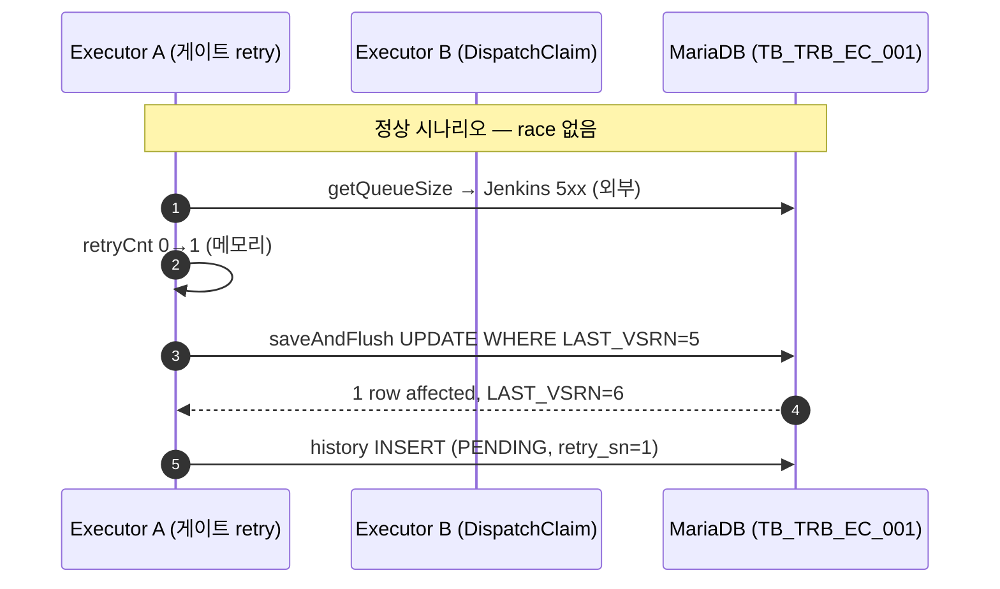
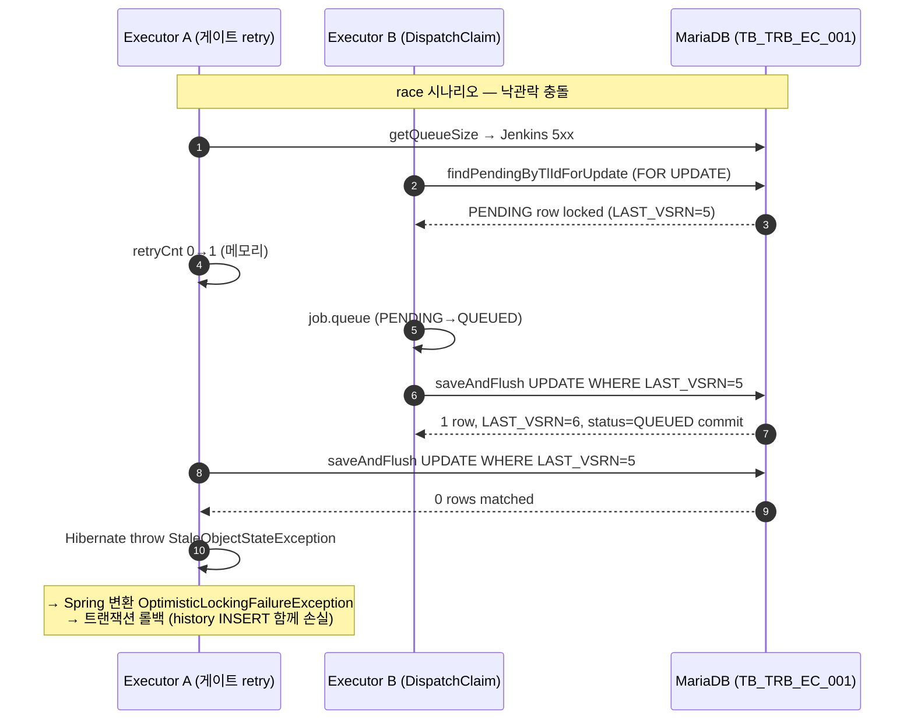
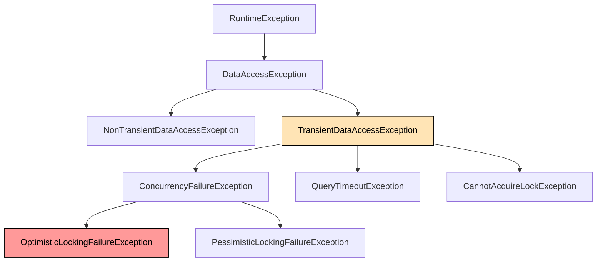
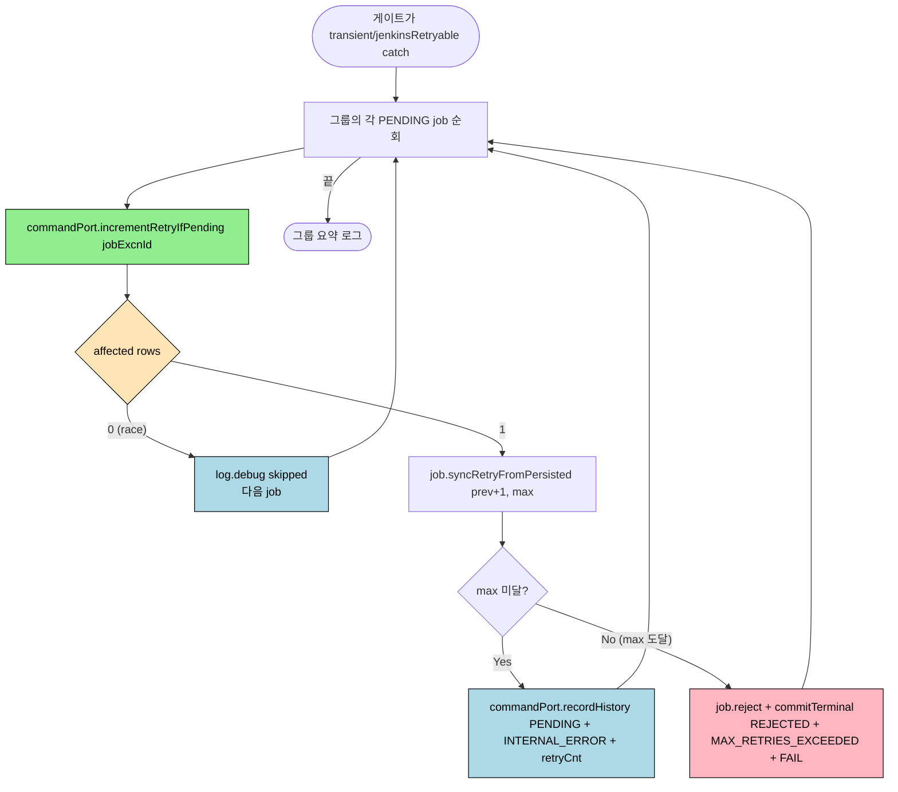

# Dispatch 게이트 retry 누적 경로의 낙관락 race 와 native UPDATE 우회

- **발생일**: 2026-05-26 (코드 리뷰 중 식별, 운영 사고 미관측 — 사전 차단)
- **영향 범위**: TPS 3.0.5P / `executor/engine` / `org.okestro.tps.jenkins.domain.component.DispatchDomainComponent`. dispatch 게이트가 일시 실패 (DB lock wait, Jenkins 5xx/네트워크) 시 retry 카운트를 누적하는 신규 경로.
- **심각도**: 잠재적 정합성 결함 (도입 *이전에* 코드 리뷰로 식별, 실제 운영 발현 없음). 발현 시 → retry history 누락 + 외부 catch 와 예외 계층이 겹쳐 중첩 진입 가능성.
- **상태**: 해결 완료. `commandPort.saveWithHistory(job, PENDING, ...)` 도메인 객체 save 경로를 `commandPort.incrementRetryIfPending(jobExcnId)` native UPDATE + `recordHistory(...)` 로 교체.
- **관련 티켓**: 미연결.
- **fix 회차**: 1 (1차 retry 분기 도입 → 코드 리뷰에서 결함 지적 → fix 적용)
- **작성자**: bh.sim (Claude 보조)
- **선행 관찰**: `bright-jumping-parasol` plan (`~/.claude-work/plans/`) — dispatch 게이트에 DB transient + Jenkins getQueueSize retryable 분기 도입. 1차 구현은 `saveWithHistory` 경로를 사용했고, 본 보고서는 그 결함과 해결 과정을 박제.

---

## 1. 장애 현상 (Symptom)

### 1-1. 코드 리뷰 단계에서 식별된 가설적 발현

운영에서는 아직 발현 안 됨. 코드 리뷰 시 발견한 race 가설:

```
1. executor 인스턴스 A 의 게이트가 PENDING 작업 N건 로드
2. Jenkins getQueueSize 가 5xx → JenkinsBuildException(retryable=true)
3. A 가 retry 분기 진입 → 도메인 객체 retryCnt++ → save 시도
4. 그 사이 executor 인스턴스 B 의 DispatchClaim 이 같은 PENDING 행을
   FOR UPDATE 로 잡고 QUEUED 로 commit
5. A 의 save 가 stale LAST_VSRN 으로 도착 → OptimisticLockingFailureException
6. 트랜잭션 롤백 → retry history INSERT 도 함께 사라짐
```

발현하면 운영 관찰 가능한 증상:

| 증상 | DB 표현 |
|---|---|
| retry 누적이 1~3 회 일어났는데 history 가 그만큼 안 남음 | `TB_TRB_EC_002_P` 의 PENDING(retry_sn>0) 라인 누락 |
| 작업이 최종 REJECTED 됐는데 reason 의 `cause=` 부분이 비어있음 | `FAIL_RSN` 의 cause 사슬 끊김 |
| 같은 jobExcnId 에 대해 다른 인스턴스가 진행 중인데 우리 인스턴스 로그에 retry 누적 시도 흔적만 남음 | log 에 `OptimisticLockingFailureException` 스택 산발 |

### 1-2. 정상 시나리오 vs race 시나리오





---

## 2. 코드 위치 / 정확한 발현 경로 (Evidence)

### 2-1. 게이트의 retry 분기 (변경 이전)

`executor/engine/src/main/java/org/okestro/tps/jenkins/domain/component/DispatchDomainComponent.java` — 1차 구현 (지금은 교체됨):

```java
// retryGroupOrFail (이전 버전)
boolean retried = job.retryOrFailFromPending(maxRetryCount);  // 메모리 retryCnt++
if (retried) {
    commandPort.saveWithHistory(             // ← 이 호출이 낙관락 충돌 발생점
        job,
        ExecutionJobStatus.PENDING,
        reason,
        job.getRetryCnt()
    );
}
```

### 2-2. 다른 인스턴스의 PENDING 점유 경로

`executor/engine/src/main/java/org/okestro/tps/jenkins/domain/component/DispatchClaimDomainComponent.java:55-100`:

```java
@Transactional
public List<ExecutionJob> claimAndQueueByTlId(String tlId, int quota) {
    List<ExecutionJob> locked = queryPort.findPendingByTlIdForUpdate(tlId);  // ← 비관락
    ...
    job.queue();                              // PENDING → QUEUED 메모리 전이
    commandPort.saveWithHistory(
        job, ExecutionJobStatus.QUEUED, null, 0
    );
}
```

### 2-3. native query — FOR UPDATE 정의

`executor/engine/src/main/java/org/okestro/tps/jenkins/infrastructure/persistence/ExecutionJobJpaRepository.java:82-85`:

```java
+ " FOR UPDATE"
, nativeQuery = true
)
List<ExecutionJobEntity> findPendingByTlIdForUpdate(...)
```

### 2-4. `@Version` 낙관락 컬럼

`executor/engine/src/main/java/org/okestro/tps/jenkins/infrastructure/persistence/ExecutionJobEntity.java:84-86`:

```java
@Version
@Column(name = "LAST_VSRN", nullable = false)
private Integer version;
```

### 2-5. `saveAndFlush` 가 발행하는 SQL (Hibernate 자동 생성)

`executor/engine/src/main/java/org/okestro/tps/jenkins/infrastructure/persistence/adapter/ExecutionJobCommandAdapter.java:54-60`:

```java
ExecutionJobEntity entity = mapper.toEntity(job);
ExecutionJobEntity saved = jobRepository.saveAndFlush(entity);
// 발행되는 SQL (Hibernate 자동):
//   UPDATE TB_TRB_EC_001
//   SET ...,
//       LAST_VSRN = LAST_VSRN + 1
//   WHERE JOB_EXCN_ID = ?
//     AND LAST_VSRN = ?     ← 메모리에 들고 있던 version
job.applyPersistedVersion(saved.getVersion());
```

WHERE 절의 `LAST_VSRN = ?` 가 race 의 핵심. 메모리 version 과 DB 가 어긋나면 0 row 매칭 → `StaleObjectStateException` → Spring 이 `OptimisticLockingFailureException` 으로 변환.

---

## 3. 왜 외부 catch 와 겹치면 더 위험한가

게이트의 `gateBatch` catch 순서 — `DispatchDomainComponent.java:115-136`:

```java
try {
    info = toolInfoPort.loadByTlId(tlId);
} catch (ToolInfoNotFoundException e) {
    rejectInvalidGroup(...);
} catch (TransientDataAccessException e) {   // ← OptimisticLockingFailureException 도 여기 잡힘
    retryGroupOrFail(tlId, groupJobs, e);
} catch (RuntimeException e) {
    rejectInvalidGroup(..., INTERNAL_ERROR);
}
```

`OptimisticLockingFailureException` 의 상속 계층:



`OptimisticLockingFailureException` 이 `TransientDataAccessException` 하위라서:

- `loadByTlId` 에서 던지는 진짜 일시 실패 (QueryTimeoutException, CannotAcquireLockException 등) 와 **save 도중 발생한 낙관락 충돌**이 *같은 catch* 에 잡힘
- `retryGroupOrFail` 안의 `saveWithHistory` 가 throw 하면 그 예외가 위쪽 catch 까지 거슬러 올라가서 **무한 재진입 / 중첩 처리** 가능성
- 사용자가 의도한 "재시도" 와 도메인이 의도하지 않은 "낙관락 충돌" 이 코드 상 구분 불가

---

## 4. 해결책 — native UPDATE 한 줄로 race 자체를 차단

### 4-1. 새 메서드 추가 (markLogFileStored 와 동일 패턴)

`executor/engine/src/main/java/org/okestro/tps/jenkins/infrastructure/persistence/ExecutionJobJpaRepository.java`:

```java
@Modifying
@Query(
    value = "UPDATE TB_TRB_EC_001"
          + " SET RETRY_CNT = RETRY_CNT + 1"
          + " , MDFCN_DT = :now"
          + " , LAST_VSRN = LAST_VSRN + 1"     // ← 직접 증가, WHERE 에 메모리값 없음
          + " WHERE JOB_EXCN_ID = :jobExcnId"
          + " AND EXCN_STTS = 'PENDING'"       // ← race 가드
    , nativeQuery = true
)
int incrementRetryIfPending(
    @Param("jobExcnId") String jobExcnId,
    @Param("now") LocalDateTime now
);
```

### 4-2. 게이트의 retry 흐름 (현재)



### 4-3. 새 SQL vs Hibernate 자동 SQL — race 가드 비교

| 비교 축 | Hibernate 자동 (saveAndFlush) | 신규 native (incrementRetryIfPending) |
|---|---|---|
| WHERE 절 | `WHERE JOB_EXCN_ID=? AND LAST_VSRN=?` ← 메모리 version 비교 | `WHERE JOB_EXCN_ID=? AND EXCN_STTS='PENDING'` ← 상태 비교 |
| 다른 인스턴스가 먼저 QUEUED 전이 | 0 row → `StaleObjectStateException` throw → 트랜잭션 롤백 | 0 row → affected=0 반환, 예외 없음 |
| 낙관락 컬럼 갱신 | Hibernate 가 자동 (`LAST_VSRN = LAST_VSRN + 1`) | 우리가 직접 (`LAST_VSRN = LAST_VSRN + 1`) — 결과 동일 |
| race 시 동작 | 예외 catch + 외부 catch 연쇄 위험 | 조용히 스킵, 호출자가 affected 검사 |

### 4-4. 도메인 객체 동기화 — `syncRetryFromPersisted`

`executor/engine/src/main/java/org/okestro/tps/jenkins/domain/model/ExecutionJob.java`:

```java
/**
 * Dispatch 게이트 전용 — DB 의 incrementRetryIfPending 으로 증가된 retryCnt 를
 * 도메인 객체에 동기화하고 max 도달 여부를 판정한다.
 */
public boolean syncRetryFromPersisted(int persistedRetryCnt, int maxRetryCount) {
    this.retryCnt = persistedRetryCnt;
    return this.retryCnt < maxRetryCount;
}
```

도메인 메서드는 메모리 동기화 + 판정만 담당. **DB 갱신은 이미 commandPort 가 처리**한 상태.

### 4-5. retryGroupOrFail 의 새 본문

```java
int updated = commandPort.incrementRetryIfPending(job.getJobExcnId());
if (updated == 0) {
    log.debug("[DispatchBatch] Not PENDING at DB-update time (raced), skip: jobExcnId={}",
              job.getJobExcnId());
    skipped++;
    continue;
}

int newRetryCnt = job.getRetryCnt() + 1;
boolean canRetry = job.syncRetryFromPersisted(newRetryCnt, maxRetryCount);

if (!canRetry) {
    job.reject();
    terminalCommitPort.commitTerminal(
        job, REJECTED, MAX_RETRIES_EXCEEDED, retryCnt, FAIL
    );
    rejected++;
} else {
    commandPort.recordHistory(           // ← saveWithHistory 가 아니라 history-only
        job.getJobExcnId(),
        ExecutionJobStatus.PENDING,
        reason,
        job.getRetryCnt()
    );
    retained++;
}
```

핵심 변경:
- `saveWithHistory(job, ...)` (도메인 객체 save + history) → `incrementRetryIfPending(jobExcnId)` (native UPDATE) + `recordHistory(jobExcnId, ...)` (history-only INSERT)
- 두 호출 모두 도메인 객체를 우회 → 낙관락 충돌 자체가 발생할 SQL 이 발행되지 않음

---

## 5. 같은 패턴을 이미 따르는 선례 — `markLogFileStored`

`executor/engine/src/main/java/org/okestro/tps/jenkins/infrastructure/persistence/ExecutionJobJpaRepository.java:130-143`:

```java
@Modifying
@Query(
    value = "UPDATE TB_TRB_EC_001"
          + " SET LOG_FILE_YN = 'Y'"
          + " , MDFCN_DT = :now"
          + " , LAST_VSRN = LAST_VSRN + 1"
          + " WHERE JOB_EXCN_ID = :jobExcnId"
          + " AND LOG_FILE_YN = 'N'"
    , nativeQuery = true
)
int markLogFileStored(@Param("jobExcnId") String jobExcnId, @Param("now") LocalDateTime now);
```

로그 미적재 보상 스케줄러가 같은 race (다른 인스턴스가 이미 'Y' 로 반영)를 같은 방식으로 흡수. **이번 변경은 이미 확립된 코드베이스 표준을 따른 것**이지 새 패턴이 아님.

---

## 6. 회귀 가드 — 단위 테스트

`executor/engine/src/test/java/org/okestro/tps/jenkins/domain/component/DispatchDomainComponentTest.java`:

| 케이스 | 검증 |
|---|---|
| `gateBatch_transientDbFailure_retainsPendingWithRetry` | retryable 시 incrementRetryIfPending 1회 + recordHistory(PENDING, INTERNAL_ERROR, 1) 호출. saveWithHistory 미호출. |
| `gateBatch_transientDbFailure_dbRaceSkipsJob` | **affected=0 시** recordHistory / commitTerminal 모두 미호출, 도메인 객체 retryCnt 0 유지. |
| `gateBatch_transientDbFailure_exhaustedRetry_rejectsGroup` | retryCnt=max-1 진입 → 1회 증가 후 max 도달 → REJECTED + MAX_RETRIES_EXCEEDED. |
| `gateBatch_jenkinsQueueSizeRetryable_retainsPendingWithRetry` | Jenkins 5xx → identity 그룹 단위 retry, 위와 동일 단언. |
| `gateBatch_jenkinsQueueSizeExhausted_rejectsGroup` | Jenkins retry 예산 소진 시 REJECTED. |
| `gateBatch_jenkinsQueueSizeNonRetryable_rejectsPerTlId` | Jenkins 4xx → identity 그룹 안 *각 tlId 단위* REJECTED. retry 경로 미진입. |
| `gateBatch_nonTransientRuntimeException_rejectsGroupImmediately` | NPE 같은 코드 버그 → 즉시 REJECTED, retry 누적 안 함. |

`gateBatch_transientDbFailure_dbRaceSkipsJob` 가 본 사고의 핵심 회귀 가드 — affected=0 path 가 예외 없이 조용히 스킵되는지 검증.

---

## 7. 정합성 확인

1. **낙관락 컬럼 의미 보존**: `LAST_VSRN += 1` 을 native UPDATE 가 명시적으로 갱신. 다른 컴포넌트의 후속 save 가 정상 낙관락 검증 가능.
2. **상태 머신 invariant**: 게이트 retry 는 PENDING → PENDING 자기-유지. `ExecutionJobStatus.validateTransition` 의 자기-전이 거부 (line 110) 와 충돌 없음 — transition 함수를 호출하지 않음.
3. **24h PENDING_TIMEOUT_EXCEEDED 안전망**: retry 가 누적 안 되는 race 케이스 (affected=0 무한 반복) 가 발생해도 24h 안전망이 최종 종결.
4. **submit 단계와의 정합**: submit 은 SUBMITTING → PENDING 롤백이라 자기-전이 아님 → `saveWithHistory(job, PENDING, ...)` 그대로 사용 가능 (낙관락 회피 불필요). 게이트만 다른 패턴.

---

## 8. 운영 알림 권고

- **메트릭**: `dispatch.gate.transient.retain.count` / `dispatch.gate.transient.race-skip.count` / `dispatch.gate.transient.exhausted.count` 카운터 추가. race-skip 이 지속적으로 발생하면 → 다른 인스턴스와의 정상 분담 (덜 위험) vs 게이트가 PENDING 후보를 잘못 잡고 있음 (튜닝 필요) 의 신호.
- **로그 패턴**: `[DispatchBatch] retryGroupOrFail summary: ... retained=N, rejected=N, skipped=N` 한 줄 요약을 운영 대시보드에 노출. skipped 이 retained 보다 지속적으로 크면 인스턴스 간 분담 불균형.

---

## 9. 회고 (Lessons)

1. **JPA `@Version` 낙관락은 비트랜잭션 orchestration 안에서 위험**. 짧은 트랜잭션 안에서만 안전. orchestration 레이어가 도메인 객체를 들고 다니며 여러 트랜잭션에 걸쳐 save 하면 race 시 stale version 으로 깨짐.
2. **예외 계층이 catch 분기와 겹치면 의도와 다른 처리가 일어남**. `OptimisticLockingFailureException ⊂ TransientDataAccessException` 라서 진짜 일시 실패와 race 충돌이 같은 분기에 잡힘. 분기 설계 시 catch 범위와 *발생 가능한 모든 예외 계층*을 같이 봐야 함.
3. **이미 확립된 코드베이스 표준 (`markLogFileStored`) 을 먼저 찾아보면** 새 패턴 설계 비용이 사라짐. 본 fix 는 그 패턴을 그대로 복제. 신규 패턴이 아니라 *기존 표준 적용 누락 회복*.
4. **try/catch 로 사후 처리하는 대신 race 조건 자체가 안 일어나는 SQL 을 설계**. WHERE 절에 상태/조건을 박아 affected=0 으로 처리하는 게 catch 분기 추가보다 단순하고 안전.

---

## 10. 참조

- 코드: `DispatchDomainComponent.java` (retryGroupOrFail), `ExecutionJobJpaRepository.java:130~`, `ExecutionJob.java:syncRetryFromPersisted`, `ExecutionJobCommandAdapter.java:incrementRetryIfPending`
- 스킬 문서: `~/claude/.claude/skills/domains/tps/v305p/executor/references/retry-policy.md` §1, §9
- plan: `~/.claude-work/plans/bright-jumping-parasol.md`
- 선행 issue: `2026-05-21/operator-hikari-set-network-timeout-on-closed.md` (HikariCP race 관련, 본 사고와 별개 도메인이지만 "비트랜잭션 orchestration 의 race" 라는 결이 같음)
