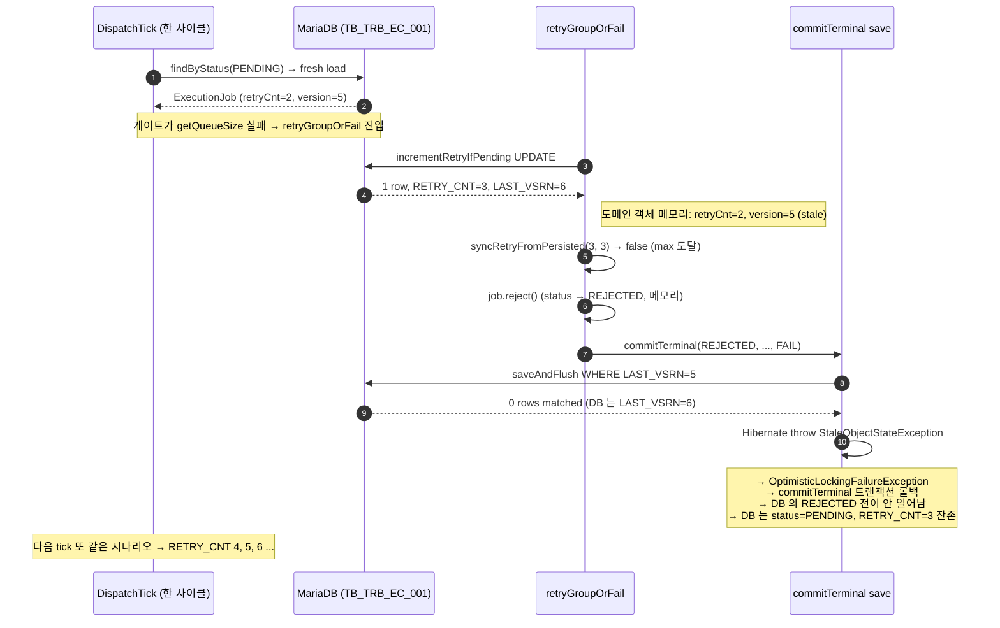
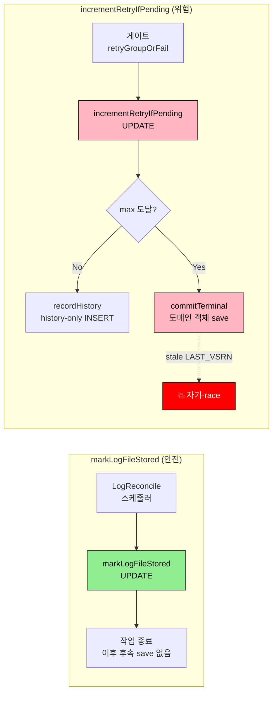
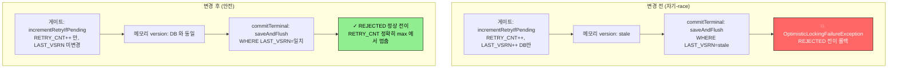

# Dispatch 게이트 incrementRetryIfPending 의 LAST_VSRN++ 자기-race 와 RETRY_CNT 초과 누적

- **발생일**: 2026-05-27 (코드 리뷰 fix 직후 E2E 카오스 검증 중 운영자 직접 발견)
- **영향 범위**: TPS 3.0.5P / `executor/engine` / `ExecutionJobJpaRepository.incrementRetryIfPending` 와 그 호출자 `DispatchDomainComponent.retryGroupOrFail`. 게이트 단계 일시 실패 (Jenkins 5xx, DB lock wait) 의 retry 누적 경로.
- **심각도**: 결함 (운영 미관측, E2E 카오스에서 발견). 발현 시 → **`MAX_RETRIES_EXCEEDED` 가 영원히 안 떨어지고 RETRY_CNT 가 무한 증가** → 24h `PENDING_TIMEOUT_EXCEEDED` 안전망까지 작업이 PENDING 잔존.
- **상태**: 해결 완료. `incrementRetryIfPending` SQL 에서 `LAST_VSRN = LAST_VSRN + 1` 한 줄 제거.
- **관련 티켓**: 미연결.
- **fix 회차**: 2 (1차 — 코드 리뷰에서 낙관락 회피 패턴 도입 / 2차 — E2E 에서 자기-race 발견 후 LAST_VSRN++ 제거)
- **작성자**: bh.sim (Claude 보조)
- **선행 관찰**: `2026-05-26/dispatch-gate-retry-optimistic-locking-race.md` — 코드 리뷰에서 *다른 인스턴스와의* 낙관락 race 를 식별해 native UPDATE 로 우회했다. 본 보고서는 그 fix 가 도리어 *자기 자신과의* race 를 만든 사고를 박제.

---

## 1. 장애 현상 (Symptom)

E2E 카오스 (`test_dispatch_jenkins_url_swap_triggers_gate_retry_then_recovers`) 실행 결과:

| 회차 | RETRY_CNT (DB) | EXCN_STTS | 의도된 결과 |
|---|---|---|---|
| 첫 실행 | **5** | SUCCESS | RETRY_CNT 1~2 누적 후 회복 |
| 검증 시점 | (기대) 3 | REJECTED | max 도달 후 종결 |

**RETRY_CNT 5 가 max=3 을 초과한 상태로도 REJECTED 가 안 떨어지고 PENDING 잔존**.

운영자 의문 ("재시도는 3번이 최대인데 왜 5번이나 했지?") 으로 추적 시작.

---

## 2. 원인 추적 (Evidence)

### 2-1. 직전 단계 — 1차 fix 의 의도

코드 리뷰에서 다른 executor 인스턴스의 `DispatchClaim.claimAndQueueByTlId` 가 같은 PENDING 행을 `FOR UPDATE` 로 잡고 QUEUED 로 전이하는 race 가 식별됐다. 게이트의 `saveWithHistory(job, PENDING, ...)` 경로가 stale `LAST_VSRN` 으로 `OptimisticLockingFailureException` 을 던질 수 있어, native UPDATE 한 줄로 우회.

1차 fix (변경 전):

```java
// ExecutionJobJpaRepository.incrementRetryIfPending
UPDATE TB_TRB_EC_001
SET RETRY_CNT = RETRY_CNT + 1
  , MDFCN_DT = :now
  , LAST_VSRN = LAST_VSRN + 1   -- ← 의도: 후속 낙관락 검증을 깨지 않으려고 같이 증가
WHERE JOB_EXCN_ID = :jobExcnId
  AND EXCN_STTS = 'PENDING'
```

`markLogFileStored` 가 같은 패턴 (`LAST_VSRN = LAST_VSRN + 1`) 을 쓰고 있어 그 *코드베이스 표준* 을 그대로 따랐다.

### 2-2. 실제 발현 — executor 로그 (2026-05-26 20:07)

```
20:07:09  Transient failure, PENDING retained: retryCnt=1/3        ✓ 정상
20:07:14  Transient failure, PENDING retained: retryCnt=2/3        ✓ 정상
20:07:19  WARN dispatchBatch failed: Row was updated or deleted by
          another transaction (or unsaved-value mapping was incorrect)
          : [ExecutionJobEntity#JEX_20260526_00016]
20:07:25  WARN dispatchBatch failed: Row was updated or deleted...
20:07:30  WARN dispatchBatch failed: Row was updated or deleted...
20:07:35  PENDING → QUEUED (URL 원복 후 정상)
```

`OptimisticLockingFailureException` 메시지가 3 회 발생, 그 동안 RETRY_CNT 는 계속 ++ (3 → 4 → 5).

### 2-3. 시퀀스 다이어그램 — 자기 자신과의 race



### 2-4. 핵심 메커니즘

- `incrementRetryIfPending` 의 `LAST_VSRN++` 가 **DB 의 낙관락 컬럼만** 갱신
- **메모리 도메인 객체의 `version` 필드는 그대로** (게이트가 들고 있던 fresh load 시점 값)
- 이어서 같은 도메인 객체로 `commitTerminal` (max 도달 시 REJECTED 종결) 가 `saveAndFlush` 호출 → JPA 가 자동 생성한 SQL 의 `WHERE LAST_VSRN = ?` 가 stale 값으로 0 row 매칭 → 예외
- 트랜잭션 롤백으로 REJECTED 전이도 같이 사라짐 — DB 는 `RETRY_CNT++` 만 commit (autocommit `@Modifying`) 된 채 PENDING 잔존
- 다음 tick 에서 같은 작업이 또 후보 → 또 retry ++ → 또 commitTerminal 충돌 → 무한 누적

---

## 3. 왜 markLogFileStored 패턴을 그대로 가져온 게 부적절했나



- `markLogFileStored` 는 호출 직후 후속 도메인 save 가 없다. LOG_FILE_YN='Y' 로 작업이 끝나는 메서드.
- `incrementRetryIfPending` 는 호출 직후 *같은 도메인 객체* 로 `commitTerminal` (REJECTED 종결) 또는 다음 tick 에서 dispatchClaim 등 후속 save 가 이어진다.
- 두 메서드의 *수명 주기* 가 다른데 같은 SQL 패턴을 쓴 게 문제.

---

## 4. 해결 — JPA 가 관리하는 영역을 침범하지 말 것

운영자 지적: **`@Version` 컬럼은 JPA(Hibernate) 가 자동 관리하는 영역인데, native SQL 에서 직접 ++ 할 필요가 있는가?**



### 4-1. fix 코드 (한 줄 삭제)

```sql
UPDATE TB_TRB_EC_001
SET RETRY_CNT = RETRY_CNT + 1
  , MDFCN_DT = :now
  -- LAST_VSRN = LAST_VSRN + 1   ← 이 줄 제거
WHERE JOB_EXCN_ID = :jobExcnId
  AND EXCN_STTS = 'PENDING'
```

### 4-2. 사고 결정의 근거

| 질문 | 답 |
|---|---|
| RETRY_CNT 증가가 도메인 상태 전이인가? | 아니다. 메타데이터 카운터일 뿐 (PENDING → PENDING 자기 유지) |
| 후속 도메인 save 가 LAST_VSRN 검증을 필요로 하나? | 필요하다 (commitTerminal 의 REJECTED 전이) |
| 그 검증을 게이트의 retry UPDATE 가 깨야 하나? | 아니다 — retry 누적은 *부수적* 메타데이터라 낙관락 의미 없음 |
| JPA 가 후속 도메인 save 에서 자동 ++ 하나? | Yes — `saveAndFlush` 가 `@Version` 자동 ++ |

→ **게이트 retry UPDATE 가 LAST_VSRN 을 건드릴 이유가 없다.** JPA 자동 관리에 맡기는 게 정답.

---

## 5. 회귀 가드 (E2E 카오스로 *증명* 됨)

### 5-1. fix 전후 같은 DB 에 모두 남은 증거

| Job | RETRY_CNT | EXCN_STTS | 의미 |
|---|---|---|---|
| **JEX_20260526_00016** | **5** | SUCCESS | LAST_VSRN++ 버그 — retry 초과 누적, REJECTED 도달 못함 |
| JEX_20260526_00017 | 3 | REJECTED | fix 후 첫 시도 — 정확히 max |
| JEX_20260526_00018 | 3 | REJECTED | fix 후 |
| JEX_20260526_00019 | 1 | SUCCESS | 짧은 swap 윈도우, 회복 |
| **JEX_20260526_00020** | **3** | **REJECTED** | fix 후 회귀 가드 케이스 (FAIL_RSN=MAX_RETRIES_EXCEEDED) |

### 5-2. E2E 카오스 케이스 (회귀 가드)

`qa/python/suites/executor_jenkins/tests/test_04_chaos.py::test_dispatch_jenkins_url_swap_exhausts_retry_then_rejects`

핵심 단언:

```python
# 1. REJECTED 로 종결
assert final_status == "REJECTED"
# 2. RETRY_CNT 가 정확히 max — 초과 누적 회귀 가드 (이전 버그면 5+ 까지 누적)
assert final_retry == 3
# 3. FAIL_RSN 에 MAX_RETRIES_EXCEEDED 포함
assert "MAX_RETRIES_EXCEEDED" in reason
```

실 실행 결과: **PASSED (32.11s)**, `[gate-retry-exhaust] final status=REJECTED retry_cnt=3`.

---

## 6. 회고 (Lessons)

1. **JPA `@Version` 자동 관리 영역을 native SQL 이 침범하면 자기 자신과의 race 가 만들어진다.** 다른 인스턴스와의 race 를 피하려고 native 로 우회한 게 도리어 더 가까운 (같은 트랜잭션 흐름 내) race 를 만든 사고.
2. **코드베이스 표준 (`markLogFileStored`) 을 그대로 복제했지만 호출자 수명 주기가 달랐다.** `markLogFileStored` 는 호출 후 도메인 save 가 없는 종착점, `incrementRetryIfPending` 는 후속 도메인 save (commitTerminal) 가 이어지는 중간점. 같은 SQL 패턴이 두 호출자에서 다른 의미를 가진다. 코드베이스 표준 적용 시 *호출자 수명 주기까지 같이* 봐야 한다.
3. **운영자의 직관 ("재시도는 3이 최대인데 왜 5?") 이 핵심을 찔렀다.** 자동 테스트가 통과해도 결과값에 이상이 있으면 그게 더 강한 신호. 단위 테스트 (mock 기반) 는 `incrementRetryIfPending` 반환값을 1로 stub 하니 자기-race 자체가 발현 안 됨 — E2E 가 잡아낸 이유.
4. **`@Version` 의 본질은 "도메인 상태 변경 시점" 추적이다.** 메타데이터 카운터 증가는 도메인 상태 변경이 아니라 부수적 사실 기록 — 낙관락 검증 대상이 아님. SQL 에서 LAST_VSRN 을 ++ 하지 않는 게 의도와 정확히 일치.
5. **E2E 카오스의 단언이 "RETRY_CNT >= 1" 처럼 약하면 회귀 검출 못함.** "정확히 max 에서 멈춤" 같은 강한 단언이 회귀 가드의 본 의미.

---

## 7. 참조

- 코드: `executor/engine/src/main/java/org/okestro/tps/jenkins/infrastructure/persistence/ExecutionJobJpaRepository.java` (incrementRetryIfPending), `DispatchDomainComponent.java` (retryGroupOrFail), `ExecutionJob.java` (syncRetryFromPersisted)
- 테스트: `qa/python/suites/executor_jenkins/tests/test_04_chaos.py::test_dispatch_jenkins_url_swap_exhausts_retry_then_rejects`
- 스킬 문서: `~/claude/.claude/skills/domains/tps/v305p/executor/references/retry-policy.md` §1, §9
- 선행 issue: `2026-05-26/dispatch-gate-retry-optimistic-locking-race.md` (1차 낙관락 회피 패턴 도입 — 본 사고의 직전 단계)
