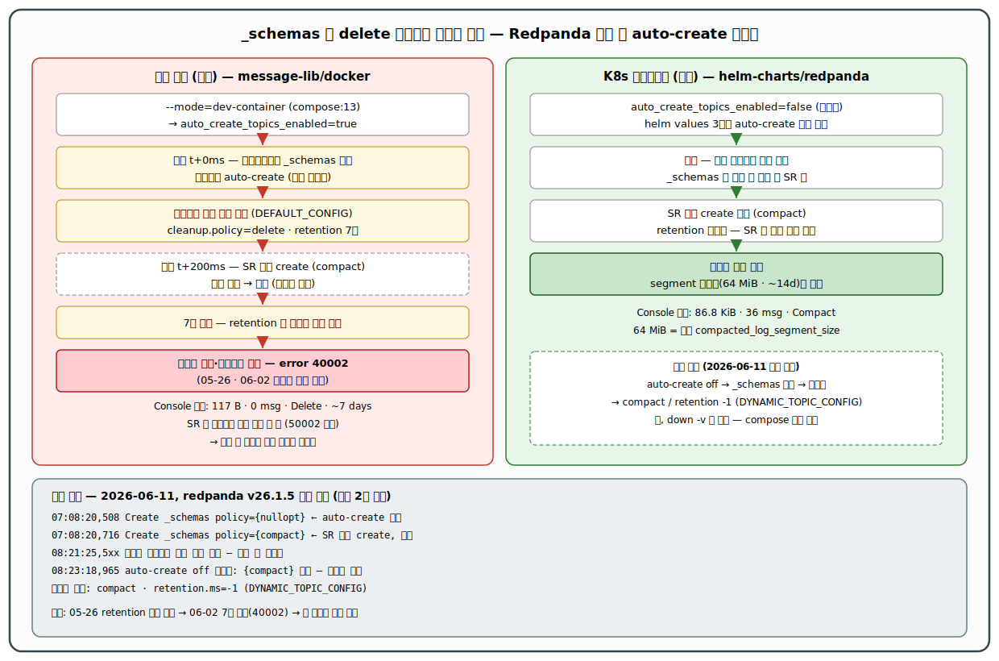

# Redpanda `_schemas` delete 정책 생성의 근본 원인 확정 — 부팅 시 auto-create 레이스 (선행 2건 종결)

- **발생일**: 2026-06-11 (원인 확정·로컬 복구 적용일. 토픽 오생성 자체는 현 볼륨의 첫 부팅 시점부터 잠복)
- **영향 범위**: 로컬 sbh-local 환경(개인 macOS). `message-lib/docker/docker-compose.yml` 로 기동된 Redpanda 단일 컨테이너(v26.1.5). K8s 매니페스트 배포본(`tps_manifest/helm-charts/redpanda`, dev/ppp)은 **비해당** — 같은 날 Console 대조 관측으로 정상(`Compact`) 확인, 본 문서의 대조군.
- **심각도**: 로컬 한정. 단, 선행 2건이 겪은 "7일 주기 재발"의 **근본 원인**이므로 이 문서가 닫히지 않으면 사고는 계속 반복된다.
- **상태**: 원인 확정 + 로컬 1차 복구 **적용 완료**(`_schemas` = `compact` / `retention.ms=-1`, §3.1). 영구 예방(compose 변경)은 미적용 — **`down -v` 를 하면 재발한다** (§3.2).
- **관련 티켓**: 미연결.
- **fix 회차**: 1 (런타임 복구까지 적용. compose 영구 예방은 별도 승인 대기).
- **선행 이슈**:
  - [`2026-05-26/redpanda-schema-registry-schemas-topic-retention-corruption.md`](../2026-05-26/redpanda-schema-registry-schemas-topic-retention-corruption.md) — `_schemas` 가 delete/7일로 만들어져 retention 만료로 손상됨을 최초 진단. *왜 delete 로 만들어졌는지*는 미규명.
  - [`2026-06-02/redpanda-schema-registry-schemas-retention-recurrence-testcommand.md`](../2026-06-02/redpanda-schema-registry-schemas-retention-recurrence-testcommand.md) — 예고된 7일 재발(40002). §3.2 방안 B 에 "`auto_create_topics_enabled=false` 추가, 옵션 이름 조사 필요 — 추측 금지" 숙제를 남김. **본 문서가 그 숙제를 닫는다.**



---

## 1. 증상 — 같은 차트 계열, 두 클러스터의 `_schemas` 가 다르다

Redpanda Console 에서 두 환경의 `_schemas` 를 나란히 보면 정책이 갈린다.

| 항목 | K8s 매니페스트 (정상) | 로컬 도커 (사고) |
|------|---------------------|----------------|
| Size | 86.8 KiB | 117 B |
| Estimated messages | 36 | 0 |
| Cleanup Policy | **Compact** | **Delete** |
| 보관 | 무기한 (segment ~14d or 64 MiB 롤오버만) | **~7 days** or Infinite |

매니페스트 쪽 segment 64 MiB 는 차트의 `tunable.compacted_log_segment_size: 67108864`(values.yaml) 와 일치하는 정상 compact 토픽의 표시다. 도커 쪽 `rpk topic describe _schemas -c` 실측은 모든 키가 `DEFAULT_CONFIG` 출처였다 — 누구도 명시 설정 없이 클러스터 기본값을 상속받아 만들어진 토픽이라는 지문이다.

```
cleanup.policy   delete      DEFAULT_CONFIG
retention.ms     604800000   DEFAULT_CONFIG   # = 7일
```

Schema Registry 가 자기 토픽을 정식으로 만들면 `compact`/`retention -1` 을 강제한다(공식 문서: "Schemas are stored in a compacted topic"). 즉 도커의 `_schemas` 는 **SR 가 만든 토픽이 아니다.** 그러면 누가, 언제 만들었는가 — 가 본 문서의 질문이다.

---

## 2. 근본 원인 — 부팅 시점, auto-create 가 SR 의 정식 create 를 200ms 차이로 선점한다

**한 줄 결론: `--mode=dev-container` 가 켜는 `auto_create_topics_enabled=true` 상태에서, 브로커 부팅 직후 어떤 클라이언트의 `_schemas` 참조가 auto-create 경로(정책 미지정 → 클러스터 기본 delete/7일 상속)로 토픽을 먼저 만들고, ~200ms 뒤 도착하는 SR 의 정식 create(compact)는 "이미 존재"로 무효가 된다.**

`auto_create_topics_enabled=true` 라는 설정 *자체*가 곧 사고는 아니다 — 이 설정은 선점 생성을 **허용하는 필요조건**(enabler)이고, 방아쇠는 부팅 시퀀스의 레이스다. 다만 둘 중 제거 가능한 쪽이 설정이므로 수정 지점도 설정이 된다.

### 2.1 결정적 증거 — 부팅 로그의 create 페어 (2회 재현)

`docker logs` 에서 `_schemas` 대상 `Create topics` 이벤트를 시간순으로 뽑으면, **서로 다른 두 부팅에서 동일한 페어**가 나온다.

```
INFO 2026-06-11 07:08:20,508  Create topics {kafka/_schemas}  cleanup_policy_bitflags: {nullopt}   ← auto-create 선점 (정책 미지정)
INFO 2026-06-11 07:08:20,716  Create topics {kafka/_schemas}  cleanup_policy_bitflags: {compact}   ← SR 정식 create, 이미 존재라 무효
INFO 2026-06-11 08:21:25,556  Create topics {kafka/_schemas}  cleanup_policy_bitflags: {nullopt}   ← (재시작 실험) 동일 페어 재현
INFO 2026-06-11 08:21:25,764  Create topics {kafka/_schemas}  cleanup_policy_bitflags: {compact}
INFO 2026-06-11 08:21:25,764  schemaregistry - Schema registry successfully initialized
WARN 2026-06-11 08:21:25,969  schemaregistry - mitigate_error: ... ({_schemas/0}, { error_code: unknown_topic_or_partition })
```

`{nullopt}` = 생성 요청에 cleanup 정책이 아예 없음 → 브로커가 클러스터 기본값(`log_cleanup_policy=delete`, `log_retention_ms=7일`)을 채운다. 그래서 §1 의 모든 키가 `DEFAULT_CONFIG` 였다. `{compact}` = SR 가 의도한 정식 생성 — 항상 **나중에** 도착한다.

### 2.2 교차 검증 — 레이스를 제거하면 compact 가 이긴다

`auto_create_topics_enabled=false` 로 두고 `_schemas` 를 지운 뒤 재부팅하면(절차는 §3.1), create 이벤트가 **compact 단독**으로 한 번만 발생하고 토픽이 올바르게 만들어진다.

```
INFO 2026-06-11 08:23:18,965  Create topics {kafka/_schemas}  cleanup_policy_bitflags: {compact}   ← 단독, 레이스 없음

cleanup.policy   compact   DYNAMIC_TOPIC_CONFIG   # 명시 설정 출처 — SR 가 직접 박은 값
retention.ms     -1        DYNAMIC_TOPIC_CONFIG   # 무기한
```

출처가 `DEFAULT_CONFIG` → `DYNAMIC_TOPIC_CONFIG` 로 바뀐 것이 "상속이 아니라 SR 가 의도한 정책" 임을 못박는다. 같은 부팅, 같은 이미지, 설정 하나 차이로 결과가 갈렸으므로 인과가 닫힌다.

### 2.3 보조 증거들

- **SR 는 런타임에 토픽을 만들지 않는다 (실측).** 토픽을 지운 상태에서 `GET /subjects` 도 `POST /subjects/.../versions` 도 모두 `{"error_code":50002,"message":"_schemas topic does not exist"}` 를 반환할 뿐 토픽을 만들지 않았다. 생성 기회는 **부팅 시퀀스 한 번뿐**이고, 그 한 번을 auto-create 에게 빼앗기면 끝이다. (선행 이슈에서 `down -v` 복구 직후 곧장 잘못된 토픽이 돼 있었던 이유이기도 하다.)
- **`--mode=dev-container` 가 auto-create 를 켠다 (공식 문서).** rpk 공식 레퍼런스(rpk-redpanda-start / rpk-redpanda-mode)가 dev-container 모드의 효과로 `auto_create_topics_enabled: true` 를 명시한다. `docker-compose.yml:13` 이 이 모드를 쓴다. 실측 `rpk cluster config get auto_create_topics_enabled` = `true`.
- **매니페스트 클러스터가 정상인 이유.** helm 차트 values 3종(`values.yaml`/`values-dev.yaml`/`values-ppp.yaml`)을 전부 grep 해도 auto-create 설정이 없다 → Redpanda 기본값 `false` → 선점 생성 경로가 원천 차단 → SR 의 compact create 가 항상 이긴다. 사고/정상의 차이가 정확히 이 설정 하나로 설명된다.

### 2.4 미확정 — 선점 참조를 날린 클라이언트의 정체

부팅 후 ~200ms 안에 `_schemas` 를 참조한 주체는 확정하지 못했다. 후보와 정황만 적는다.

1. **Redpanda 내부 SR kafka client 의 fetch 경로 (유력)** — 토픽 부재 동안 `schemaregistry - mitigate_error: ... unknown_topic_or_partition` 이 수 초 간격으로 반복 기록됐다. SR 내부 클라이언트가 상시 fetch 를 돌린다는 뜻이고, 부팅 시 이 fetch 가 정식 create 보다 먼저 나가며 auto-create 를 유발했을 수 있다.
2. **Redpanda Console** — 두 부팅 모두 Console 컨테이너가 이미 떠 있었음을 `docker inspect` 시작 시각으로 확인했다(07:07:07 시작, create 페어는 07:08:20). 배제 불가.

어느 쪽이든 메커니즘(auto-create 경로 생성)·enabler(`auto_create_topics_enabled=true`)·수정 지점은 동일하므로, 주체 확정은 본 사고 종결에 필수가 아니다. 추측으로 채우지 않고 미확정으로 남긴다.

> 반증해 둔 오답(박제): 1차 분석에서는 "message-lib 앱이나 외부 도구가 `_schemas` 를 선점 참조했다" 는 외부 클라이언트 가설을 세웠다. 그러나 create 페어가 부팅 후 0.2초 안에 발생하고, 앱이 전혀 돌지 않는 시점의 재시작 실험에서도 동일 재현되므로, 선점은 **부팅 시퀀스 내부**의 일이다. 외부 후보로 살아남는 것은 상시 기동 중인 Console 뿐이다.

---

## 3. 해결

### 3.1 적용 완료 — 레이스 제거 상태에서 `_schemas` 재생성 (2026-06-11 실행)

현 토픽이 0건이라 삭제 재생성이 안전했다. 실행한 절차 그대로 적는다 (재사용 가능).

```bash
# 1) auto-create 를 끄고 (레이스 제거)
docker exec redpanda-local rpk cluster config set auto_create_topics_enabled false

# 2) 삭제 보호를 임시 해제하고 잘못된 토픽 제거 → 보호 복구
docker exec redpanda-local rpk cluster config set kafka_nodelete_topics '["_redpanda.audit_log","__consumer_offsets"]'
docker exec redpanda-local rpk topic delete _schemas
docker exec redpanda-local rpk cluster config set kafka_nodelete_topics '["_redpanda.audit_log","__consumer_offsets","_schemas"]'

# 3) 재부팅 — SR 가 부팅 시퀀스에서 compact 로 단독 생성
docker restart redpanda-local
#    SR 준비를 readiness 폴링으로 기다린 뒤 측정 (§5.2 참고)
curl -s http://localhost:8084/subjects     # [] 200 OK

# 4) 검증 — DYNAMIC_TOPIC_CONFIG 출처의 compact/-1 확인
docker exec redpanda-local rpk topic describe _schemas -c | grep -iE 'cleanup|retention\.ms'
#    cleanup.policy  compact  DYNAMIC_TOPIC_CONFIG
#    retention.ms    -1       DYNAMIC_TOPIC_CONFIG

# 5) auto-create 원복 (이유는 아래)
docker exec redpanda-local rpk cluster config set auto_create_topics_enabled true
```

**auto-create 를 원복한 이유**: 현 로컬 토픽 인벤토리에 `_schemas` 외 데이터 토픽이 없다 — `tps.v305p.*` 토픽들은 operator/executor 가 첫 발행할 때 auto-create 로 만들어진다(명시 생성 스크립트 없음). `false` 로 두면 로컬 앱의 첫 발행이 UNKNOWN_TOPIC 으로 막힌다. `_schemas` 는 이미 올바른 정책으로 존재하므로, auto-create 가 다시 켜져도 기존 토픽에는 영향이 없다.

### 3.2 영구 예방 — 미적용. `down -v` 를 하면 재발한다

§3.1 의 cluster config 변경과 치유된 토픽은 모두 **볼륨에 저장**된다. `down -v` 는 볼륨과 함께 둘 다 지우고, 다음 `up` 의 첫 부팅에서 §2.1 레이스가 그대로 재연된다. 종결하려면 `message-lib/docker/docker-compose.yml` 수정이 필요하다 (별도 승인 후 진행).

| 옵션 | 내용 | 트레이드오프 |
|------|------|-------------|
| **① init 사이드카로 `_schemas` 정책 교정 (권장)** | redpanda healthy 후 1회 실행되는 서비스가 §3.1 의 2)~4) 시퀀스(보호 해제 → 삭제 → 재생성 유도) 또는 `rpk topic alter-config _schemas --set cleanup.policy=compact --set retention.ms=-1` 을 수행 | 앱 동작(데이터 토픽 auto-create) 무변경. 선행 06-02 방안 C 와 동일 계열 — 이번 원인 규명으로 "왜 이게 필요한가" 가 닫힘 |
| ② 부트 단계에서 auto-create 차단 | `redpanda start` args 에 auto-create 비활성 설정 추가 + 데이터 토픽(`tps.v305p.*`) 명시 생성 init 추가 | 레이스 원천 제거로 가장 깨끗하나, 데이터 토픽 생성 책임이 새로 생김. args 로 cluster property 를 주입하는 정확한 문법(`--set redpanda.auto_create_topics_enabled=false`)은 적용 시점에 v26 기준 검증 필요 |

권장을 ① 로 두는 근거: 본 환경의 로컬 개발 흐름이 토픽 자동생성에 실제로 의존함을 인벤토리로 확인했고(§3.1), ① 은 그 의존을 건드리지 않으면서 사고 지점(`_schemas` 정책)만 외과적으로 교정한다.

---

## 4. 검증 방법

```bash
# 4.1 현재 상태 (적용 완료분) — compact/-1, 출처 DYNAMIC_TOPIC_CONFIG
docker exec redpanda-local rpk topic describe _schemas -c | grep -iE 'cleanup\.policy|retention\.ms'

# 4.2 SR 정상 응답
curl -s -i http://localhost:8084/subjects          # 200 + []

# 4.3 부팅 레이스 부재 확인 — 이번 부팅의 create 이벤트가 compact 단독인지
docker logs redpanda-local 2>&1 | grep -E "Create topics.*_schemas" | grep -oE 'cleanup_policy_bitflags: \{[a-z]*\}'

# 4.4 (영구 예방 적용 후) down -v → up 한 사이클 돌려 4.1 이 유지되는지
#     — 이 항목이 통과해야 사고 계보(05-26 → 06-02 → 06-11)가 최종 종결된다
```

완료 판정: 4.1~4.3 은 2026-06-11 통과 확인. **4.4 는 §3.2 적용 전까지 미통과 상태**이며, 그때까지 `down -v` 는 "7일 시한폭탄 리셋" 임을 인지하고 사용한다.

---

## 5. 메모

1. **선행 숙제 종결.** 06-02 §3.2 방안 B 가 남긴 "auto_create 옵션 조사 필요 — 추측 금지" 는 본 문서 §2 로 닫혔다. 설정의 출처(`--mode=dev-container`, rpk 공식 문서), 실측값, 인과(레이스), 교차 검증(off 시 compact 단독 생성)까지 1차 자료로 확정했다.
2. **측정 실수 박제 — not-ready 를 not-exist 로 오판할 뻔했다.** 재시작 직후 `rpk topic list 2>/dev/null | grep _schemas || echo absent` 패턴이 "브로커 미기동" 과 "토픽 없음" 을 구분하지 못해 false negative 를 냈다. stderr 를 버리고 빈 grep 을 부재로 해석하면 안 된다. → 측정 전 readiness 게이트(`curl /subjects` 가 200 줄 때까지 폴링)를 먼저 통과시키고, 부재 판정은 명시적 에러 메시지로 한다.
3. **"설정이 문제냐" 는 질문에 대한 정확한 답.** `auto_create_topics_enabled=true` 는 단독으로는 무해하다(매니페스트가 아닌 일반 운영에서도 흔히 켠다). 문제는 *SR 의 토픽 생성 기회가 부팅 한 번뿐인 구조*와 결합할 때다 — 그 한 번의 레이스에서 auto-create 가 이기면 잘못된 정책이 영구화되고, SR 는 런타임에 이를 교정하지 않는다. 사고를 한 문장으로 줄이면 "**복구 불가능한 1회성 생성 기회를 무정책 생성자에게 빼앗겼다**" 이다.
