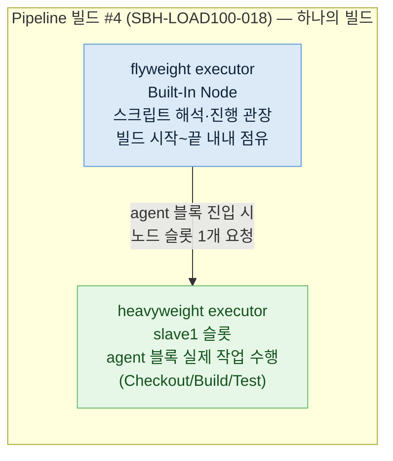

# 하나의 Pipeline 빌드가 실행기(executor)를 둘 이상 점유하는 이유 — flyweight vs heavyweight executor

- **발생일**: 2026-06-15 (load_orchestration 100건 burst 부하 테스트 중, Jenkins "빌드 실행 상태" 화면 관찰)
- **영향 범위**: Jenkins Pipeline(Declarative/Scripted) 전반. 특정 버그가 아니라 Pipeline 실행 모델의 정상 동작.
- **심각도**: 장애 아님 — 오해 해소용 원리 설명. 같은 `#빌드번호`가 Built-In Node 와 slave 에 동시에 보여 "중복 실행"으로 오인하기 쉬워 박제.
- **상태**: 정상 동작 확정. EC_001 에 빌드 1건·BLD_NO 1개만 존재함을 실측으로 확인.
- **작성자**: bh.sim (Claude 보조)

---

## 1. 관찰된 현상 (Symptom)

부하 테스트에서 100개 Pipeline job 을 한꺼번에 트리거하던 중, Jenkins 대시보드 "빌드 실행 상태" 패널에 같은 빌드가 두 군데에 동시에 떴습니다. 예를 들어 `SBH-LOAD100-018 #4` 가 상단 **Built-In Node** 에 한 번, 그리고 아래 **slave1** 의 7번 실행기에 `(Checkout)` 이라는 꼬리표를 달고 또 한 번 나타났습니다. 빌드 번호(`#4`)가 같으니 "executor 가 같은 작업을 두 번 실행하는 것 아닌가" 하는 의심이 들 수밖에 없습니다.

DB 를 직접 확인하면 의심은 풀립니다. `TB_TRB_EC_001` 에서 `SBH-LOAD100-018` 은 단 한 행(`JOB_EXCN_ID=JEX_...444`, `BLD_NO=4`)뿐입니다. executor 가 트리거한 빌드도 하나고, Jenkins 가 만든 빌드 번호도 하나입니다. 중복 실행이 아니라, **하나의 빌드가 실행기를 둘 점유한 것**입니다.

## 2. 원인 (Root Cause) — 두 종류의 executor

Jenkins Pipeline 은 빌드 하나를 돌릴 때 성격이 다른 두 실행기를 씁니다. 이 구분을 모르면 같은 빌드가 두 번 보이는 게 이상하게 느껴집니다.

**flyweight executor (경량 실행기)** 는 Pipeline 스크립트 *그 자체* 를 해석하고 진행을 관장하는 실행기입니다. `pipeline { ... }` 블록을 한 줄씩 읽어 다음에 뭘 할지 정하고, 단계 사이의 상태를 들고 있는 "오케스트레이터" 역할을 합니다. 이 일은 CPU 를 거의 쓰지 않아서 보통 **Built-In Node(과거 master)** 위에서 돌고, 빌드가 시작되어 끝날 때까지 *내내* 한 자리를 차지합니다. 화면 상단의 `Built-In Node` 에 뜬 `#4` 가 바로 이것입니다.

**heavyweight executor (중량 실행기)** 는 `node { }`(Scripted) 또는 `agent { }`(Declarative) 블록 안의 실제 작업 — 소스 체크아웃, 셸 명령, 빌드, 테스트 — 을 수행하는 실행기입니다. 진짜 일을 하므로 빌드 노드(예: `slave1`)의 실행기 슬롯 하나를 잡습니다. 화면 slave1 의 7번에 `SBH-LOAD100-020 #4 (Checkout)` 으로 뜬 것이 이것이고, `(Checkout)` 은 지금 그 중량 실행기가 Checkout 스테이지를 돌리고 있다는 뜻입니다.

그래서 `agent any` 로 시작하는 평범한 Pipeline 하나가 실행 중일 때, **flyweight 1개(Built-In Node) + heavyweight 1개(agent 가 배정된 노드)** 가 동시에 점유됩니다. 빌드 번호가 같은 채로 두 패널에 나타나는 이유가 이것입니다.

## 3. 왜 이렇게 설계됐나

Pipeline 의 강점은 빌드가 중간에 노드를 옮겨 다니거나(여러 `agent`), 잠시 사람의 입력을 기다리거나(`input`), 병렬 분기(`parallel`)를 돌리는 데 있습니다. 이 모든 흐름을 누군가는 끝까지 추적해야 하는데, 그 역할을 무거운 빌드 노드에 맡기면 정작 일할 슬롯이 줄고, 빌드가 `input` 에서 한 시간을 멈춰 있는 동안 비싼 실행기를 붙들게 됩니다. 그래서 진행 관장은 비용이 거의 없는 flyweight 로 분리해 Built-In Node 에 두고, 실제 작업만 heavyweight 로 빌드 노드에서 돌립니다. 덕분에 `input` 대기 중인 빌드는 flyweight 한 자리만 차지하고 heavyweight 는 반납합니다.

이 분리 때문에 한 빌드가 "둘로 보이는" 것은 비정상이 아니라 설계 의도입니다. 오히려 `agent none` 으로 선언해 최상위에서 노드를 안 잡는 Pipeline 이라면, 스테이지가 실제로 돌 때만 heavyweight 가 잠깐 잡혔다 풀리고 flyweight 만 계속 떠 있는 모습을 보게 됩니다.

## 4. 어떻게 구분해 읽나

화면에서 헷갈리지 않으려면 다음을 봅니다.

- **Built-In Node 에 뜬 항목**: 거의 항상 flyweight 입니다. 빌드가 사는 동안 계속 떠 있고 `(스테이지명)` 꼬리표가 없는 경우가 많습니다.
- **slave/agent 노드에 뜬 항목**: heavyweight 입니다. `(Checkout)`, `(Test)` 처럼 지금 도는 스테이지 이름이 붙습니다.
- **빌드 번호가 같은가**: 같은 `#N` 이면 한 빌드의 두 실행기입니다. 번호가 다르면 진짜 다른 빌드입니다.

확실히 하려면 실행 기록(우리 경우 `TB_TRB_EC_001`)에서 그 `JOB_EXCN_ID`/`BLD_NO` 행 수를 셉니다. 행이 하나면 중복 실행이 아닙니다.

## 5. 결론

같은 빌드 번호가 Built-In Node 와 slave 에 동시에 보인 것은 **flyweight executor(스크립트 진행 관장)와 heavyweight executor(스테이지 실제 수행)를 한 빌드가 동시에 점유**했기 때문입니다. 중복 트리거도, executor 버그도 아니며 Jenkins Pipeline 의 정상 실행 모델입니다. DB 에 빌드가 1건만 있다는 사실이 이를 뒷받침합니다.
